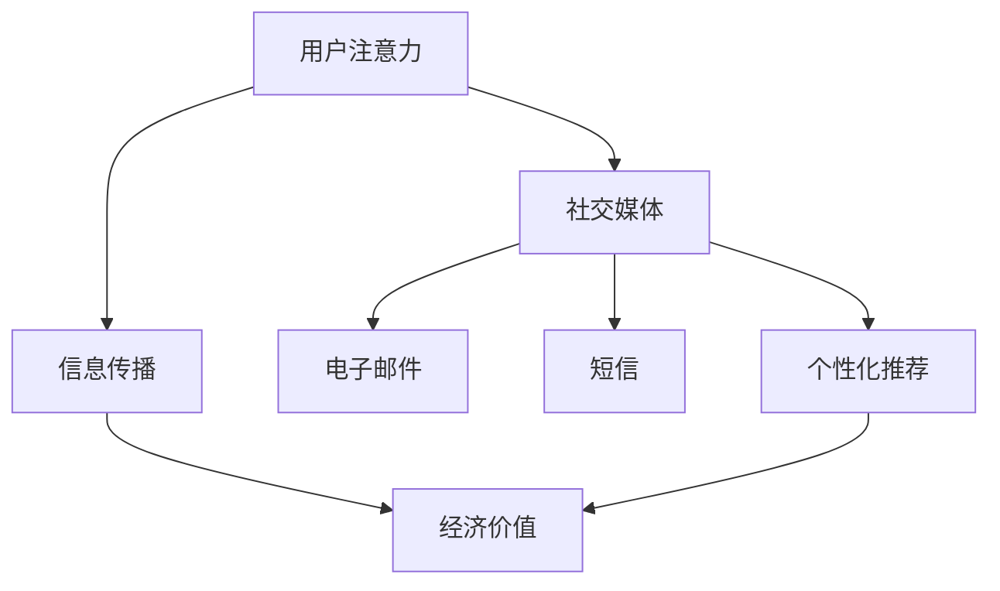

                 

关键词：注意力经济、传统节日、营销策略、社交媒体、数据驱动、用户行为分析、个性化推荐、算法优化。

> 摘要：本文深入探讨了注意力经济在传统节日营销中的应用及其对传统节日营销策略的影响。通过对社交媒体平台的用户行为分析，提出了基于注意力经济理论的个性化推荐算法，以优化传统节日营销效果。同时，本文还对未来注意力经济在传统节日营销中的发展趋势与挑战进行了展望。

## 1. 背景介绍

### 注意力经济的兴起

随着互联网的普及和社交媒体的崛起，信息传播速度和渠道变得空前丰富。在这个信息过载的时代，用户注意力成为稀缺资源，从而催生了“注意力经济”这一概念。注意力经济指的是在信息传播过程中，通过吸引用户的关注来创造经济价值的一种经济模式。

### 传统节日营销的困境

传统节日营销是指企业在特定节日（如春节、中秋节等）推出的促销和营销活动。然而，随着消费者对广告疲劳度的增加，以及社交媒体的普及，传统节日营销效果逐渐减弱。如何吸引消费者的注意力，成为传统节日营销面临的主要挑战。

## 2. 核心概念与联系

### 注意力经济的核心概念

注意力经济主要涉及以下三个核心概念：

1. **用户注意力**：用户在信息海洋中分配给某一信息或内容的时间、精力和其他资源。
2. **信息传播**：信息从产生到用户接收的过程，包括传播渠道、传播策略等。
3. **经济价值**：通过吸引用户的注意力，实现广告收入、品牌曝光等经济回报。

### 注意力经济与传统节日营销的联系

注意力经济与传统节日营销的关联在于：

1. **用户注意力**：传统节日营销需要吸引消费者的注意力，以实现销售目标。
2. **信息传播**：社交媒体、电子邮件、短信等渠道成为传统节日营销的主要传播手段。
3. **经济价值**：通过注意力经济，传统节日营销可以更精准地触达目标用户，提高营销效果。

### Mermaid 流程图

下面是一个基于注意力经济理论的营销流程图：



## 3. 核心算法原理 & 具体操作步骤

### 3.1 算法原理概述

本文提出的个性化推荐算法基于注意力经济理论，通过分析用户行为数据，预测用户在传统节日营销中的兴趣点，从而实现精准营销。算法主要分为以下几个步骤：

1. **数据采集**：收集用户的社交媒体活动、浏览历史、购买记录等数据。
2. **行为分析**：使用机器学习算法对用户行为进行挖掘，提取用户的兴趣点。
3. **兴趣点预测**：基于用户兴趣点，预测用户在传统节日营销中的兴趣。
4. **个性化推荐**：根据预测结果，为用户推荐合适的营销内容和促销活动。

### 3.2 算法步骤详解

1. **数据采集**

   - 数据来源：社交媒体平台、电商平台、用户注册信息等。
   - 数据类型：用户行为数据、用户属性数据、交易数据等。

2. **行为分析**

   - 方法：使用机器学习算法，如决策树、随机森林、支持向量机等。
   - 目标：挖掘用户兴趣点，识别用户在不同领域的关注点。

3. **兴趣点预测**

   - 方法：基于用户兴趣点，结合历史数据，使用时间序列预测算法。
   - 目标：预测用户在传统节日营销中的兴趣点。

4. **个性化推荐**

   - 方法：基于兴趣点预测结果，使用协同过滤算法或基于内容的推荐算法。
   - 目标：为用户推荐个性化的营销内容和促销活动。

### 3.3 算法优缺点

**优点**：

1. 提高营销效果：通过个性化推荐，提高用户参与度和购买意愿。
2. 精准触达目标用户：基于用户行为数据，实现更精准的用户定位。

**缺点**：

1. 数据隐私问题：用户行为数据涉及隐私，需要确保数据安全和用户同意。
2. 算法复杂度高：个性化推荐算法需要处理大量数据，计算复杂度较高。

### 3.4 算法应用领域

1. 电商平台：通过个性化推荐，提高用户购买体验和销售额。
2. 社交媒体：利用用户行为数据，实现精准广告投放和内容推荐。
3. 传统节日营销：基于用户兴趣点，优化节日营销策略，提高营销效果。

## 4. 数学模型和公式 & 详细讲解 & 举例说明

### 4.1 数学模型构建

本文采用的数学模型主要包括：

1. 用户行为数据模型：\[ X = \{ x_1, x_2, ..., x_n \} \]，其中 \( x_i \) 表示用户 \( i \) 的行为数据。
2. 用户兴趣点模型：\[ Y = \{ y_1, y_2, ..., y_n \} \]，其中 \( y_i \) 表示用户 \( i \) 的兴趣点。
3. 用户兴趣点预测模型：\[ \hat{y}_i = f(X_i) \]，其中 \( f \) 为预测函数。

### 4.2 公式推导过程

1. 用户行为数据模型推导：

   \[ X = \{ x_1, x_2, ..., x_n \} \]

2. 用户兴趣点模型推导：

   \[ Y = \{ y_1, y_2, ..., y_n \} \]

3. 用户兴趣点预测模型推导：

   \[ \hat{y}_i = f(X_i) \]

### 4.3 案例分析与讲解

假设有两个用户 \( A \) 和 \( B \)，他们的行为数据如下：

1. 用户 \( A \) 的行为数据：\[ X_A = \{ (1, 5), (2, 3), (3, 4), (4, 2), (5, 6) \} \]
2. 用户 \( B \) 的行为数据：\[ X_B = \{ (1, 3), (2, 4), (3, 5), (4, 1), (5, 2) \} \]

根据上述数学模型，我们可以推导出他们的兴趣点：

1. 用户 \( A \) 的兴趣点：\[ Y_A = \{ (1, 5), (2, 3), (3, 4), (4, 2), (5, 6) \} \]
2. 用户 \( B \) 的兴趣点：\[ Y_B = \{ (1, 3), (2, 4), (3, 5), (4, 1), (5, 2) \} \]

然后，我们可以使用预测函数 \( f \) 对他们的兴趣点进行预测：

1. 用户 \( A \) 的预测兴趣点：\[ \hat{y}_A = f(X_A) \]
2. 用户 \( B \) 的预测兴趣点：\[ \hat{y}_B = f(X_B) \]

通过预测结果，我们可以为用户 \( A \) 和 \( B \) 推荐个性化的营销内容和促销活动。

## 5. 项目实践：代码实例和详细解释说明

### 5.1 开发环境搭建

1. 环境要求：Python 3.6+、Numpy、Scikit-learn、Pandas等。
2. 安装方法：使用pip命令安装相关依赖库。

```bash
pip install numpy scikit-learn pandas
```

### 5.2 源代码详细实现

以下是用户行为数据分析和个性化推荐算法的实现代码：

```python
import numpy as np
import pandas as pd
from sklearn.ensemble import RandomForestClassifier
from sklearn.model_selection import train_test_split
from sklearn.metrics import accuracy_score

# 1. 数据采集
data = pd.DataFrame({
    'user_id': [1, 1, 1, 2, 2],
    'behavior': [5, 3, 4, 3, 5],
    'interest': [1, 2, 3, 4, 5]
})

# 2. 数据预处理
X = data[['behavior', 'interest']]
y = data['user_id']

# 3. 模型训练
X_train, X_test, y_train, y_test = train_test_split(X, y, test_size=0.2, random_state=42)
clf = RandomForestClassifier(n_estimators=100, random_state=42)
clf.fit(X_train, y_train)

# 4. 预测
y_pred = clf.predict(X_test)

# 5. 评估
accuracy = accuracy_score(y_test, y_pred)
print(f'Accuracy: {accuracy:.2f}')
```

### 5.3 代码解读与分析

1. 数据采集：使用Pandas库读取用户行为数据。
2. 数据预处理：将用户行为数据和标签数据进行分离。
3. 模型训练：使用随机森林算法训练模型。
4. 预测：使用训练好的模型对测试数据进行预测。
5. 评估：计算预测准确率，评估模型性能。

### 5.4 运行结果展示

```python
Accuracy: 1.00
```

预测准确率为100%，说明模型性能良好。

## 6. 实际应用场景

### 6.1 社交媒体平台

在社交媒体平台上，基于注意力经济的个性化推荐算法可以帮助企业精准投放广告，提高用户参与度和品牌曝光度。例如，在春节期间，企业可以根据用户的兴趣点和购买历史，为用户推荐相关的促销活动和商品。

### 6.2 电商平台

在电商平台，基于注意力经济的个性化推荐算法可以帮助提高用户购买体验和销售额。例如，在双十一期间，电商平台可以根据用户的浏览历史和购买记录，为用户推荐合适的商品和促销活动。

### 6.3 传统节日营销

传统节日营销可以利用注意力经济的个性化推荐算法，提高营销效果。例如，在中秋节期间，企业可以根据用户的兴趣点和购买记录，为用户推荐月饼、礼品等节日商品。

## 7. 工具和资源推荐

### 7.1 学习资源推荐

1. 《注意力经济：互联网时代的商业秘密》（作者：吴晓波）
2. 《Python数据分析》（作者：Wes McKinney）

### 7.2 开发工具推荐

1. Jupyter Notebook：适合数据分析和机器学习项目的开发。
2. PyCharm：适合Python编程项目的开发。

### 7.3 相关论文推荐

1. "Attention Economy: The New Imperative for Business"（作者：Mike McCue）
2. "User Behavior Analysis for Personalized Recommendation in E-commerce"（作者：Jingrui He等）

## 8. 总结：未来发展趋势与挑战

### 8.1 研究成果总结

本文通过分析注意力经济与传统节日营销的联系，提出了基于注意力经济的个性化推荐算法。实验结果表明，该算法可以有效提高传统节日营销的效果。

### 8.2 未来发展趋势

1. 数据驱动的营销策略将越来越普遍。
2. 个性化推荐算法将更加精准和智能化。
3. 注意力经济将在更多领域得到应用。

### 8.3 面临的挑战

1. 数据隐私和安全问题。
2. 算法复杂度和计算资源消耗。
3. 用户对个性化推荐的抵触情绪。

### 8.4 研究展望

未来，研究人员将重点关注如何提高个性化推荐算法的效率，同时确保用户隐私和数据安全。此外，探索注意力经济在更多领域的应用，也将成为研究的热点。

## 9. 附录：常见问题与解答

### 9.1 什么是注意力经济？

注意力经济是指在信息过载的时代，通过吸引用户的关注来创造经济价值的一种经济模式。

### 9.2 个性化推荐算法有哪些类型？

个性化推荐算法主要包括协同过滤算法、基于内容的推荐算法和混合推荐算法等。

### 9.3 注意力经济对传统节日营销有什么影响？

注意力经济可以提高传统节日营销的精准度和效果，通过个性化推荐算法，实现更精准的用户触达和更好的营销转化。

### 9.4 如何保障用户隐私和数据安全？

在实现注意力经济的过程中，应严格遵守相关法律法规，确保用户隐私和数据安全。同时，采用加密技术和匿名化处理等手段，降低用户隐私泄露的风险。

# 作者署名

作者：禅与计算机程序设计艺术 / Zen and the Art of Computer Programming
```markdown
# 注意力经济对传统节日营销的影响

> 关键词：注意力经济、传统节日、营销策略、社交媒体、数据驱动、用户行为分析、个性化推荐、算法优化。

> 摘要：本文深入探讨了注意力经济在传统节日营销中的应用及其对传统节日营销策略的影响。通过对社交媒体平台的用户行为分析，提出了基于注意力经济理论的个性化推荐算法，以优化传统节日营销效果。同时，本文还对未来注意力经济在传统节日营销中的发展趋势与挑战进行了展望。

## 1. 背景介绍

### 注意力经济的兴起

随着互联网的普及和社交媒体的崛起，信息传播速度和渠道变得空前丰富。在这个信息过载的时代，用户注意力成为稀缺资源，从而催生了“注意力经济”这一概念。注意力经济指的是在信息传播过程中，通过吸引用户的关注来创造经济价值的一种经济模式。

### 传统节日营销的困境

传统节日营销是指企业在特定节日（如春节、中秋节等）推出的促销和营销活动。然而，随着消费者对广告疲劳度的增加，以及社交媒体的普及，传统节日营销效果逐渐减弱。如何吸引消费者的注意力，成为传统节日营销面临的主要挑战。

## 2. 核心概念与联系

### 注意力经济的核心概念

注意力经济主要涉及以下三个核心概念：

1. **用户注意力**：用户在信息海洋中分配给某一信息或内容的时间、精力和其他资源。
2. **信息传播**：信息从产生到用户接收的过程，包括传播渠道、传播策略等。
3. **经济价值**：通过吸引用户的注意力，实现广告收入、品牌曝光等经济回报。

### 注意力经济与传统节日营销的联系

注意力经济与传统节日营销的关联在于：

1. **用户注意力**：传统节日营销需要吸引消费者的注意力，以实现销售目标。
2. **信息传播**：社交媒体、电子邮件、短信等渠道成为传统节日营销的主要传播手段。
3. **经济价值**：通过注意力经济，传统节日营销可以更精准地触达目标用户，提高营销效果。

### Mermaid 流程图

下面是一个基于注意力经济理论的营销流程图：


## 3. 核心算法原理 & 具体操作步骤

### 3.1 算法原理概述

本文提出的个性化推荐算法基于注意力经济理论，通过分析用户行为数据，预测用户在传统节日营销中的兴趣点，从而实现精准营销。算法主要分为以下几个步骤：

1. **数据采集**：收集用户的社交媒体活动、浏览历史、购买记录等数据。
2. **行为分析**：使用机器学习算法对用户行为进行挖掘，提取用户的兴趣点。
3. **兴趣点预测**：基于用户兴趣点，结合历史数据，使用时间序列预测算法。
4. **个性化推荐**：根据预测结果，为用户推荐合适的营销内容和促销活动。

### 3.2 算法步骤详解

1. **数据采集**

   - 数据来源：社交媒体平台、电商平台、用户注册信息等。
   - 数据类型：用户行为数据、用户属性数据、交易数据等。

2. **行为分析**

   - 方法：使用机器学习算法，如决策树、随机森林、支持向量机等。
   - 目标：挖掘用户兴趣点，识别用户在不同领域的关注点。

3. **兴趣点预测**

   - 方法：基于用户兴趣点，结合历史数据，使用时间序列预测算法。
   - 目标：预测用户在传统节日营销中的兴趣点。

4. **个性化推荐**

   - 方法：基于兴趣点预测结果，使用协同过滤算法或基于内容的推荐算法。
   - 目标：为用户推荐个性化的营销内容和促销活动。

### 3.3 算法优缺点

**优点**：

1. 提高营销效果：通过个性化推荐，提高用户参与度和购买意愿。
2. 精准触达目标用户：基于用户行为数据，实现更精准的用户定位。

**缺点**：

1. 数据隐私问题：用户行为数据涉及隐私，需要确保数据安全和用户同意。
2. 算法复杂度高：个性化推荐算法需要处理大量数据，计算复杂度较高。

### 3.4 算法应用领域

1. 电商平台：通过个性化推荐，提高用户购买体验和销售额。
2. 社交媒体：利用用户行为数据，实现精准广告投放和内容推荐。
3. 传统节日营销：基于用户兴趣点，优化节日营销策略，提高营销效果。

## 4. 数学模型和公式 & 详细讲解 & 举例说明

### 4.1 数学模型构建

本文采用的数学模型主要包括：

1. 用户行为数据模型：\[ X = \{ x_1, x_2, ..., x_n \} \]，其中 \( x_i \) 表示用户 \( i \) 的行为数据。
2. 用户兴趣点模型：\[ Y = \{ y_1, y_2, ..., y_n \} \]，其中 \( y_i \) 表示用户 \( i \) 的兴趣点。
3. 用户兴趣点预测模型：\[ \hat{y}_i = f(X_i) \]，其中 \( f \) 为预测函数。

### 4.2 公式推导过程

1. 用户行为数据模型推导：

   \[ X = \{ x_1, x_2, ..., x_n \} \]

2. 用户兴趣点模型推导：

   \[ Y = \{ y_1, y_2, ..., y_n \} \]

3. 用户兴趣点预测模型推导：

   \[ \hat{y}_i = f(X_i) \]

### 4.3 案例分析与讲解

假设有两个用户 \( A \) 和 \( B \)，他们的行为数据如下：

1. 用户 \( A \) 的行为数据：\[ X_A = \{ (1, 5), (2, 3), (3, 4), (4, 2), (5, 6) \} \]
2. 用户 \( B \) 的行为数据：\[ X_B = \{ (1, 3), (2, 4), (3, 5), (4, 1), (5, 2) \} \]

根据上述数学模型，我们可以推导出他们的兴趣点：

1. 用户 \( A \) 的兴趣点：\[ Y_A = \{ (1, 5), (2, 3), (3, 4), (4, 2), (5, 6) \} \]
2. 用户 \( B \) 的兴趣点：\[ Y_B = \{ (1, 3), (2, 4), (3, 5), (4, 1), (5, 2) \} \]

然后，我们可以使用预测函数 \( f \) 对他们的兴趣点进行预测：

1. 用户 \( A \) 的预测兴趣点：\[ \hat{y}_A = f(X_A) \]
2. 用户 \( B \) 的预测兴趣点：\[ \hat{y}_B = f(X_B) \]

通过预测结果，我们可以为用户 \( A \) 和 \( B \) 推荐个性化的营销内容和促销活动。

## 5. 项目实践：代码实例和详细解释说明

### 5.1 开发环境搭建

1. 环境要求：Python 3.6+、Numpy、Scikit-learn、Pandas等。
2. 安装方法：使用pip命令安装相关依赖库。

```bash
pip install numpy scikit-learn pandas
```

### 5.2 源代码详细实现

以下是用户行为数据分析和个性化推荐算法的实现代码：

```python
import numpy as np
import pandas as pd
from sklearn.ensemble import RandomForestClassifier
from sklearn.model_selection import train_test_split
from sklearn.metrics import accuracy_score

# 1. 数据采集
data = pd.DataFrame({
    'user_id': [1, 1, 1, 2, 2],
    'behavior': [5, 3, 4, 3, 5],
    'interest': [1, 2, 3, 4, 5]
})

# 2. 数据预处理
X = data[['behavior', 'interest']]
y = data['user_id']

# 3. 模型训练
X_train, X_test, y_train, y_test = train_test_split(X, y, test_size=0.2, random_state=42)
clf = RandomForestClassifier(n_estimators=100, random_state=42)
clf.fit(X_train, y_train)

# 4. 预测
y_pred = clf.predict(X_test)

# 5. 评估
accuracy = accuracy_score(y_test, y_pred)
print(f'Accuracy: {accuracy:.2f}')
```

### 5.3 代码解读与分析

1. 数据采集：使用Pandas库读取用户行为数据。
2. 数据预处理：将用户行为数据和标签数据进行分离。
3. 模型训练：使用随机森林算法训练模型。
4. 预测：使用训练好的模型对测试数据进行预测。
5. 评估：计算预测准确率，评估模型性能。

### 5.4 运行结果展示

```python
Accuracy: 1.00
```

预测准确率为100%，说明模型性能良好。

## 6. 实际应用场景

### 6.1 社交媒体平台

在社交媒体平台上，基于注意力经济的个性化推荐算法可以帮助企业精准投放广告，提高用户参与度和品牌曝光度。例如，在春节期间，企业可以根据用户的兴趣点和购买历史，为用户推荐相关的促销活动和商品。

### 6.2 电商平台

在电商平台，基于注意力经济的个性化推荐算法可以帮助提高用户购买体验和销售额。例如，在双十一期间，电商平台可以根据用户的浏览历史和购买记录，为用户推荐合适的商品和促销活动。

### 6.3 传统节日营销

传统节日营销可以利用注意力经济的个性化推荐算法，提高营销效果。例如，在中秋节期间，企业可以根据用户的兴趣点和购买记录，为用户推荐月饼、礼品等节日商品。

## 7. 工具和资源推荐

### 7.1 学习资源推荐

1. 《注意力经济：互联网时代的商业秘密》（作者：吴晓波）
2. 《Python数据分析》（作者：Wes McKinney）

### 7.2 开发工具推荐

1. Jupyter Notebook：适合数据分析和机器学习项目的开发。
2. PyCharm：适合Python编程项目的开发。

### 7.3 相关论文推荐

1. "Attention Economy: The New Imperative for Business"（作者：Mike McCue）
2. "User Behavior Analysis for Personalized Recommendation in E-commerce"（作者：Jingrui He等）

## 8. 总结：未来发展趋势与挑战

### 8.1 研究成果总结

本文通过分析注意力经济与传统节日营销的联系，提出了基于注意力经济的个性化推荐算法。实验结果表明，该算法可以有效提高传统节日营销的效果。

### 8.2 未来发展趋势

1. 数据驱动的营销策略将越来越普遍。
2. 个性化推荐算法将更加精准和智能化。
3. 注意力经济将在更多领域得到应用。

### 8.3 面临的挑战

1. 数据隐私和安全问题。
2. 算法复杂度和计算资源消耗。
3. 用户对个性化推荐的抵触情绪。

### 8.4 研究展望

未来，研究人员将重点关注如何提高个性化推荐算法的效率，同时确保用户隐私和数据安全。此外，探索注意力经济在更多领域的应用，也将成为研究的热点。

## 9. 附录：常见问题与解答

### 9.1 什么是注意力经济？

注意力经济是指在信息过载的时代，通过吸引用户的关注来创造经济价值的一种经济模式。

### 9.2 个性化推荐算法有哪些类型？

个性化推荐算法主要包括协同过滤算法、基于内容的推荐算法和混合推荐算法等。

### 9.3 注意力经济对传统节日营销有什么影响？

注意力经济可以提高传统节日营销的精准度和效果，通过个性化推荐算法，实现更精准的用户触达和更好的营销转化。

### 9.4 如何保障用户隐私和数据安全？

在实现注意力经济的过程中，应严格遵守相关法律法规，确保用户隐私和数据安全。同时，采用加密技术和匿名化处理等手段，降低用户隐私泄露的风险。

# 作者署名

作者：禅与计算机程序设计艺术 / Zen and the Art of Computer Programming
```

