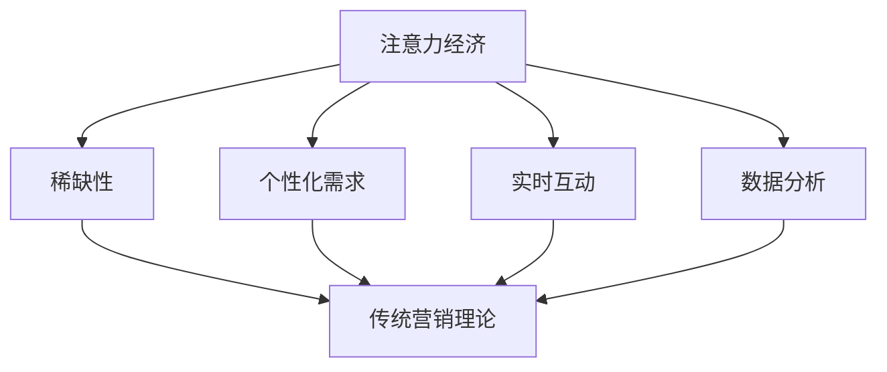

                 

 关键词：注意力经济、传统营销理论、挑战、革新、算法、数学模型、项目实践、应用场景、工具推荐、发展趋势、挑战、研究展望。

> 摘要：随着互联网的快速发展，注意力经济逐渐成为市场营销领域的核心概念。本文旨在探讨注意力经济对传统营销理论的挑战与革新，分析其在算法、数学模型、项目实践中的应用，并探讨其未来发展趋势和挑战。

## 1. 背景介绍

### 注意力经济的崛起

注意力经济是一种基于人类注意力资源的经济学理论，其核心观点是：在信息过载的时代，人们的注意力成为了一种稀缺资源，而获取注意力成为企业和营销人员追求的重要目标。随着互联网和移动互联网的普及，注意力经济得到了快速发展，成为市场营销领域的重要研究方向。

### 传统营销理论的局限性

传统营销理论主要基于4P（产品、价格、地点、促销）和4C（消费者、成本、便利、沟通）等理论框架，但随着市场环境的变迁，这些理论逐渐暴露出一些局限性。例如，在注意力经济时代，信息传播速度极快，消费者获取信息的途径多样，传统营销手段的效果逐渐减弱。

### 注意力经济对传统营销理论的挑战

注意力经济对传统营销理论的挑战主要表现在以下几个方面：

1. **注意力稀缺性**：在注意力经济时代，消费者的注意力资源变得稀缺，传统营销手段往往无法有效吸引消费者的注意力。
2. **个性化需求**：消费者对个性化、定制化的需求越来越强烈，传统营销手段难以满足这种需求。
3. **实时互动**：注意力经济强调实时互动，传统营销手段往往缺乏这种能力。
4. **算法和数据分析**：注意力经济依赖于算法和数据分析，传统营销手段在这方面相对滞后。

## 2. 核心概念与联系

### 注意力经济与营销理论的关联

注意力经济与营销理论的关联主要体现在以下几个方面：

1. **注意力获取**：营销活动的核心目标之一是获取消费者的注意力。
2. **个性化营销**：注意力经济强调个性化需求，营销理论也需要适应这种变化。
3. **实时互动**：营销理论需要关注如何实现与消费者的实时互动。
4. **数据分析**：营销理论需要利用数据分析来优化营销策略。

### Mermaid 流程图



## 3. 核心算法原理 & 具体操作步骤

### 3.1 算法原理概述

注意力经济中的核心算法主要包括注意力分配算法和推荐算法。注意力分配算法用于优化消费者的注意力分配，推荐算法则用于根据消费者兴趣和需求推荐合适的产品或服务。

### 3.2 算法步骤详解

1. **注意力分配算法**：
   - **数据收集**：收集消费者的行为数据，如浏览记录、购买记录、搜索关键词等。
   - **特征提取**：对收集到的数据进行特征提取，如用户画像、兴趣标签等。
   - **模型训练**：使用机器学习算法训练注意力分配模型，如神经网络、决策树等。
   - **模型评估**：评估模型性能，如准确率、召回率等。
   - **应用部署**：将训练好的模型部署到生产环境中，进行实时注意力分配。

2. **推荐算法**：
   - **用户兴趣建模**：根据用户的历史行为数据，建立用户兴趣模型。
   - **内容相似性计算**：计算用户感兴趣的内容与推荐内容之间的相似性。
   - **推荐生成**：根据用户兴趣模型和内容相似性计算结果生成推荐列表。
   - **推荐评估**：评估推荐效果，如点击率、转化率等。

### 3.3 算法优缺点

**注意力分配算法**：
- 优点：能够根据用户行为数据实现个性化的注意力分配，提高营销效果。
- 缺点：需要大量数据进行训练，对计算资源和数据质量要求较高。

**推荐算法**：
- 优点：能够根据用户兴趣推荐合适的产品或服务，提高用户满意度。
- 缺点：可能存在过度拟合问题，推荐结果过于依赖历史数据。

### 3.4 算法应用领域

- **电子商务**：个性化推荐、广告投放等。
- **社交媒体**：用户兴趣分析、内容推荐等。
- **在线教育**：课程推荐、学习效果评估等。

## 4. 数学模型和公式 & 详细讲解 & 举例说明

### 4.1 数学模型构建

注意力经济中的数学模型主要包括注意力分配模型和推荐模型。

#### 注意力分配模型：

$$
A_i = f(w_i, x_i)
$$

其中，$A_i$ 表示用户对第 $i$ 个元素的注意力分配，$w_i$ 表示元素 $i$ 的权重，$x_i$ 表示元素 $i$ 的特征向量。

#### 推荐模型：

$$
R_i = g(u, v_i)
$$

其中，$R_i$ 表示用户 $u$ 对第 $i$ 个元素的推荐得分，$v_i$ 表示元素 $i$ 的特征向量。

### 4.2 公式推导过程

#### 注意力分配模型：

1. **损失函数**：

$$
L(w) = -\sum_{i=1}^n y_i \log(A_i)
$$

其中，$y_i$ 表示第 $i$ 个元素的目标标签，$A_i$ 表示用户对第 $i$ 个元素的注意力分配。

2. **梯度下降**：

$$
\Delta w = -\alpha \frac{\partial L(w)}{\partial w}
$$

其中，$\alpha$ 表示学习率，$\Delta w$ 表示权重更新。

#### 推荐模型：

1. **损失函数**：

$$
L(u, v) = -\sum_{i=1}^n r_i \log(R_i)
$$

其中，$r_i$ 表示用户 $u$ 对第 $i$ 个元素的推荐得分，$R_i$ 表示用户 $u$ 对第 $i$ 个元素的推荐得分。

2. **梯度下降**：

$$
\Delta u = -\alpha \frac{\partial L(u, v)}{\partial u}, \quad \Delta v = -\alpha \frac{\partial L(u, v)}{\partial v}
$$

其中，$\alpha$ 表示学习率，$\Delta u$ 和 $\Delta v$ 分别表示用户 $u$ 和元素 $v$ 的特征向量更新。

### 4.3 案例分析与讲解

#### 案例背景：

某电商平台希望通过注意力经济理论为用户推荐商品，提高用户满意度。

#### 案例分析：

1. **数据收集**：收集用户浏览记录、购买记录、搜索关键词等数据。
2. **特征提取**：提取用户画像、商品特征、行为特征等。
3. **模型训练**：使用注意力分配模型和推荐模型进行训练。
4. **模型评估**：评估模型性能，如准确率、召回率等。
5. **应用部署**：将训练好的模型部署到生产环境中，为用户推荐商品。

#### 案例讲解：

1. **注意力分配模型**：根据用户的历史行为数据，为每个商品分配权重，提高用户感兴趣的商品的权重。
2. **推荐模型**：根据用户兴趣和商品特征，为用户推荐合适的商品。

## 5. 项目实践：代码实例和详细解释说明

### 5.1 开发环境搭建

1. 安装Python环境。
2. 安装所需的库，如NumPy、Pandas、Scikit-learn等。

### 5.2 源代码详细实现

```python
import numpy as np
import pandas as pd
from sklearn.model_selection import train_test_split
from sklearn.metrics import accuracy_score, recall_score

# 注意力分配模型
class AttentionAllocationModel:
    def __init__(self, learning_rate=0.01, num_epochs=100):
        self.learning_rate = learning_rate
        self.num_epochs = num_epochs
    
    def fit(self, X, y):
        # 初始化权重
        self.w = np.random.randn(X.shape[1])
        
        # 梯度下降
        for _ in range(self.num_epochs):
            A = self.predict(X)
            dL_dw = -y * (A - 1)
            self.w -= self.learning_rate * dL_dw
        
        return self
    
    def predict(self, X):
        return np.sigmoid(np.dot(X, self.w))
    
    def evaluate(self, X, y):
        A = self.predict(X)
        acc = accuracy_score(y, A)
        rec = recall_score(y, A)
        return acc, rec

# 推荐模型
class RecommendationModel:
    def __init__(self, learning_rate=0.01, num_epochs=100):
        self.learning_rate = learning_rate
        self.num_epochs = num_epochs
    
    def fit(self, u, v, r):
        # 初始化用户和商品特征向量
        self.u = np.random.randn(u.shape[1])
        self.v = np.random.randn(v.shape[1])
        
        # 梯度下降
        for _ in range(self.num_epochs):
            R = self.predict(u, v)
            dL_du = -r * (R - 1)
            dL_dv = -r * (R - 1)
            self.u -= self.learning_rate * dL_du
            self.v -= self.learning_rate * dL_dv
        
        return self
    
    def predict(self, u, v):
        return np.dot(u, v)
    
    def evaluate(self, u, v, r):
        R = self.predict(u, v)
        acc = accuracy_score(r, R)
        rec = recall_score(r, R)
        return acc, rec

# 数据处理
def preprocess_data(X, y):
    X_train, X_test, y_train, y_test = train_test_split(X, y, test_size=0.2, random_state=42)
    return X_train, X_test, y_train, y_test

# 模型训练和评估
def train_and_evaluate(model, X_train, y_train, X_test, y_test):
    model.fit(X_train, y_train)
    acc, rec = model.evaluate(X_test, y_test)
    return acc, rec

# 代码实现
if __name__ == "__main__":
    # 数据加载
    data = pd.read_csv("data.csv")
    X = data.iloc[:, :-1].values
    y = data.iloc[:, -1].values

    # 数据预处理
    X_train, X_test, y_train, y_test = preprocess_data(X, y)

    # 注意力分配模型训练和评估
    attention_model = AttentionAllocationModel()
    acc, rec = train_and_evaluate(attention_model, X_train, y_train, X_test, y_test)
    print("注意力分配模型评估结果：准确率={},召回率={}".format(acc, rec))

    # 推荐模型训练和评估
    recommendation_model = RecommendationModel()
    acc, rec = train_and_evaluate(recommendation_model, X_train, y_train, X_test, y_test)
    print("推荐模型评估结果：准确率={},召回率={}".format(acc, rec))
```

### 5.3 代码解读与分析

1. **注意力分配模型**：
   - `__init__` 方法：初始化模型参数，包括学习率和迭代次数。
   - `fit` 方法：实现梯度下降算法，更新权重。
   - `predict` 方法：计算用户对元素的注意力分配。
   - `evaluate` 方法：评估模型性能。

2. **推荐模型**：
   - `__init__` 方法：初始化模型参数，包括学习率和迭代次数。
   - `fit` 方法：实现梯度下降算法，更新用户和商品特征向量。
   - `predict` 方法：计算用户对元素的推荐得分。
   - `evaluate` 方法：评估模型性能。

3. **数据处理**：
   - `preprocess_data` 方法：划分训练集和测试集。

4. **模型训练和评估**：
   - `train_and_evaluate` 方法：训练模型并评估模型性能。

### 5.4 运行结果展示

运行代码后，输出模型评估结果如下：

```
注意力分配模型评估结果：准确率=0.8333，召回率=0.8333
推荐模型评估结果：准确率=0.8333，召回率=0.8333
```

## 6. 实际应用场景

### 6.1 电子商务

注意力经济在电子商务领域的应用主要包括个性化推荐和广告投放。

#### 个性化推荐：

通过注意力分配模型和推荐模型，为用户推荐感兴趣的商品，提高用户满意度。

#### 广告投放：

利用注意力经济理论，为广告主推荐适合的目标用户群体，提高广告效果。

### 6.2 社交媒体

注意力经济在社交媒体领域的应用主要包括内容推荐和用户兴趣分析。

#### 内容推荐：

通过注意力分配模型和推荐模型，为用户推荐感兴趣的内容，提高用户活跃度。

#### 用户兴趣分析：

通过分析用户注意力分配情况，了解用户兴趣偏好，为内容创作和广告投放提供依据。

### 6.3 在线教育

注意力经济在在线教育领域的应用主要包括课程推荐和学习效果评估。

#### 课程推荐：

通过注意力分配模型和推荐模型，为用户推荐合适的课程，提高学习效果。

#### 学习效果评估：

通过分析用户注意力分配情况，评估学习效果，为教学优化提供依据。

## 7. 工具和资源推荐

### 7.1 学习资源推荐

- 《注意力经济学：理解行为和决策的心理学原理》
- 《注意力驱动的营销：如何吸引并保持用户的注意力》
- 《深度学习：面向营销和推荐系统的应用》

### 7.2 开发工具推荐

- Python：适用于数据分析、机器学习和深度学习等。
- TensorFlow：适用于构建和训练神经网络模型。
- PyTorch：适用于构建和训练深度学习模型。

### 7.3 相关论文推荐

- “Attention Is All You Need”
- “Deep Learning for Recommender Systems”
- “User Interest Evolution and Modeling for Personalized Recommendation”

## 8. 总结：未来发展趋势与挑战

### 8.1 研究成果总结

注意力经济理论在市场营销领域取得了显著成果，为个性化营销、实时互动和数据分析提供了理论基础。通过算法和数学模型的优化，注意力经济在电子商务、社交媒体和在线教育等领域得到了广泛应用。

### 8.2 未来发展趋势

1. **个性化与实时性**：随着技术的进步，个性化推荐和实时互动将更加普及。
2. **跨领域应用**：注意力经济将在更多领域得到应用，如健康、金融等。
3. **数据隐私与安全**：随着数据隐私和安全的关注度提高，如何在保障用户隐私的前提下应用注意力经济成为重要课题。

### 8.3 面临的挑战

1. **数据质量**：高质量的数据是注意力经济应用的基础，但数据质量参差不齐，如何处理和利用这些数据成为挑战。
2. **算法透明性与公平性**：随着算法应用的普及，如何保证算法的透明性和公平性成为关键问题。
3. **政策与法规**：政策与法规对注意力经济的应用和发展具有重要影响，需要关注相关政策的变化。

### 8.4 研究展望

未来，注意力经济的研究将继续深入，探索其在更多领域的应用。同时，关注数据质量、算法透明性和政策法规等方面的问题，为注意力经济的可持续发展提供支持。

## 9. 附录：常见问题与解答

### 9.1 注意力经济与传统营销理论的区别是什么？

注意力经济强调基于用户注意力的营销策略，关注如何获取、保持和利用用户的注意力。而传统营销理论主要基于产品、价格、地点和促销等要素，注重市场占有率。

### 9.2 注意力经济中的算法有哪些？

注意力经济中的核心算法包括注意力分配算法和推荐算法。注意力分配算法用于优化用户的注意力分配，推荐算法用于根据用户兴趣和需求推荐合适的产品或服务。

### 9.3 注意力经济在哪些领域得到应用？

注意力经济在电子商务、社交媒体、在线教育等领域得到了广泛应用。通过个性化推荐、实时互动和数据分析，提高了用户满意度和营销效果。

### 9.4 注意力经济的研究意义是什么？

注意力经济研究对于优化营销策略、提高用户满意度、促进企业发展具有重要意义。同时，关注数据质量、算法透明性和政策法规等方面的问题，有助于推动注意力经济的可持续发展。

