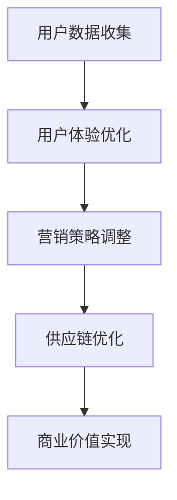

                 

关键词：注意力经济，零售业态，数字化转型，客户体验，算法优化

> 摘要：随着互联网技术的飞速发展和大数据时代的到来，注意力经济逐渐成为影响传统零售业态转型的重要因素。本文旨在探讨注意力经济对传统零售行业的改造，分析其背后的核心概念与联系，阐述注意力经济算法原理及具体操作步骤，并通过数学模型、公式、案例分析和项目实践等多个角度，深入探讨注意力经济在零售行业中的应用与未来展望。

## 1. 背景介绍

在过去的几十年里，传统零售行业经历了多次变革。从实体店铺的兴起，到连锁超市的普及，再到电子商务的崛起，零售业态不断演进。然而，随着互联网技术的不断进步和大数据时代的到来，一个新的经济形态——注意力经济，正悄然改变着传统零售行业的面貌。

注意力经济是一种基于用户注意力的经济模式，它强调通过吸引和保持用户的注意力来创造价值。在互联网时代，用户的注意力成为了一种稀缺资源，如何有效地获取和利用用户注意力成为零售行业亟待解决的问题。

### 1.1 注意力经济的兴起

注意力经济起源于20世纪90年代的互联网泡沫时期，当时互联网企业通过提供免费内容来吸引用户，从而通过广告来获得收入。随着互联网用户的增加，注意力资源变得愈发珍贵，各大互联网公司开始竞相争夺用户的时间与注意力。

### 1.2 传统零售行业的挑战

传统零售行业面临着诸多挑战，如竞争加剧、消费者需求变化、成本上升等。在注意力经济时代，如何通过数字化转型来吸引和保持用户注意力，提升客户体验，成为零售企业必须面对的课题。

### 1.3 注意力经济对传统零售业态的改造

注意力经济的兴起，为传统零售业态带来了新的机遇与挑战。通过以下方式，注意力经济正在对传统零售业态进行深度改造：

1. **提升用户体验**：通过个性化推荐、智能客服等技术手段，提高用户体验，增加用户粘性。
2. **优化供应链管理**：利用大数据和人工智能技术，优化库存管理、订单处理等环节，提高供应链效率。
3. **创新营销模式**：通过内容营销、社交媒体推广等手段，吸引更多用户关注，提升品牌知名度。
4. **多元化收入来源**：通过拓展线下体验店、会员服务、数据服务等多元化业务，实现收入增长。

## 2. 核心概念与联系

### 2.1 注意力经济的基本概念

注意力经济是指通过吸引和保持用户的注意力来创造价值的经济模式。在注意力经济中，用户的注意力被视为一种稀缺资源，企业需要通过提供有价值的内容或服务来吸引用户的注意力，从而实现商业价值的转化。

### 2.2 传统零售业态与注意力经济的联系

注意力经济与传统零售业态的联系主要体现在以下几个方面：

1. **用户数据收集**：传统零售业态通过线上线下渠道收集用户数据，为个性化推荐和精准营销提供数据支持。
2. **用户体验优化**：传统零售业态通过提供个性化服务、智能客服等手段，提升用户体验，增加用户粘性。
3. **营销策略调整**：传统零售业态通过内容营销、社交媒体推广等手段，吸引更多用户关注，提升品牌知名度。
4. **供应链优化**：传统零售业态利用大数据和人工智能技术，优化供应链管理，提高运营效率。

### 2.3 Mermaid 流程图

下面是一个关于注意力经济在传统零售业态中应用的 Mermaid 流程图：



## 3. 核心算法原理 & 具体操作步骤

### 3.1 算法原理概述

注意力经济的核心在于如何有效地获取和利用用户注意力。具体来说，包括以下几个关键环节：

1. **用户行为分析**：通过收集用户浏览、购买、评价等行为数据，分析用户偏好和需求。
2. **个性化推荐**：根据用户行为数据和偏好，为用户推荐感兴趣的商品或服务。
3. **内容营销**：通过内容创作和推广，吸引更多用户关注，提高品牌知名度。
4. **社交媒体互动**：通过社交媒体平台与用户互动，增加用户粘性，提升用户忠诚度。

### 3.2 算法步骤详解

#### 3.2.1 用户行为分析

用户行为分析是注意力经济的基础。具体步骤如下：

1. **数据收集**：通过线上线下渠道收集用户行为数据，如浏览记录、购买记录、评价等。
2. **数据清洗**：对收集到的数据进行清洗和预处理，去除噪声数据，确保数据质量。
3. **特征提取**：从原始数据中提取用户行为特征，如浏览时长、购买频率、评价分数等。
4. **数据分析**：利用数据分析方法，如聚类、关联规则挖掘等，分析用户行为模式。

#### 3.2.2 个性化推荐

个性化推荐是提升用户体验的关键。具体步骤如下：

1. **用户画像构建**：根据用户行为数据，构建用户画像，包括用户兴趣、偏好、需求等。
2. **推荐算法选择**：选择合适的推荐算法，如基于内容的推荐、协同过滤推荐等。
3. **推荐结果生成**：根据用户画像和推荐算法，生成个性化推荐结果。
4. **推荐结果评估**：评估推荐结果的准确性和满意度，持续优化推荐算法。

#### 3.2.3 内容营销

内容营销是吸引更多用户关注的重要手段。具体步骤如下：

1. **内容创作**：根据用户兴趣和需求，创作有针对性的内容，如商品评测、购物攻略、品牌故事等。
2. **内容推广**：通过社交媒体、搜索引擎等渠道，推广内容，提高内容曝光度。
3. **用户互动**：通过评论、点赞、分享等互动方式，增加用户参与度，提升内容传播效果。
4. **效果评估**：评估内容营销的效果，如阅读量、转发量、评论数等，持续优化内容创作和推广策略。

#### 3.2.4 社交媒体互动

社交媒体互动是提升用户粘性和忠诚度的重要手段。具体步骤如下：

1. **平台选择**：根据目标用户群体，选择合适的社交媒体平台，如微信、微博、抖音等。
2. **内容发布**：定期发布有趣、有价值的内容，吸引用户关注。
3. **互动管理**：及时回复用户评论和私信，解答用户疑问，增加用户参与感。
4. **数据分析**：分析社交媒体互动数据，如点赞数、评论数、转发数等，优化互动策略。

### 3.3 算法优缺点

#### 3.3.1 优点

1. **提高用户体验**：通过个性化推荐和内容营销，提升用户体验，增加用户粘性。
2. **优化供应链管理**：利用大数据和人工智能技术，优化库存管理、订单处理等环节，提高供应链效率。
3. **多元化收入来源**：通过拓展线下体验店、会员服务、数据服务等多元化业务，实现收入增长。

#### 3.3.2 缺点

1. **数据隐私风险**：用户数据收集和处理过程中，可能存在数据隐私泄露的风险。
2. **算法偏见**：推荐算法和内容营销策略可能存在偏见，导致用户获取的信息不全面或被限制。
3. **过度依赖技术**：过度依赖算法和数据分析，可能导致人为因素的缺失，影响决策的准确性。

### 3.4 算法应用领域

注意力经济算法在传统零售业态中的应用非常广泛，主要包括以下领域：

1. **电商平台**：通过个性化推荐和内容营销，提升用户购买体验，增加销售额。
2. **线下零售**：通过大数据分析，优化库存管理和供应链管理，提高运营效率。
3. **品牌营销**：通过社交媒体互动和内容营销，提升品牌知名度，增加用户忠诚度。
4. **会员服务**：通过数据分析，为会员提供个性化服务和优惠，提升会员满意度。

## 4. 数学模型和公式 & 详细讲解 & 举例说明

### 4.1 数学模型构建

在注意力经济中，常用的数学模型包括用户行为预测模型、个性化推荐模型、内容营销效果评估模型等。以下是一个用户行为预测模型的构建过程：

#### 4.1.1 用户行为预测模型

假设用户 \( u \) 的行为数据集为 \( D_u = \{ (i_1, t_1), (i_2, t_2), ..., (i_n, t_n) \} \)，其中 \( i_j \) 表示商品编号，\( t_j \) 表示用户 \( u \) 对商品 \( i_j \) 的购买时间。我们构建一个线性回归模型来预测用户 \( u \) 的下一步行为：

\[ y = \beta_0 + \beta_1 x_1 + \beta_2 x_2 + ... + \beta_n x_n \]

其中，\( y \) 表示用户 \( u \) 的下一步行为，\( x_1, x_2, ..., x_n \) 表示用户 \( u \) 的行为特征，\( \beta_0, \beta_1, \beta_2, ..., \beta_n \) 为模型的参数。

#### 4.1.2 个性化推荐模型

个性化推荐模型主要用于预测用户对商品的偏好。一个简单的基于协同过滤的个性化推荐模型如下：

\[ r_{ui} = \mu + b_u + b_i + \sum_{j \in N(i)} \frac{q_{uj}}{\|N(i)\|} \]

其中，\( r_{ui} \) 表示用户 \( u \) 对商品 \( i \) 的评分预测，\( \mu \) 表示所有用户对所有商品的加权平均评分，\( b_u \) 和 \( b_i \) 分别表示用户 \( u \) 和商品 \( i \) 的偏置项，\( N(i) \) 表示与商品 \( i \) 相似的其他商品集合，\( q_{uj} \) 表示用户 \( u \) 对商品 \( j \) 的评分。

### 4.2 公式推导过程

#### 4.2.1 用户行为预测模型的推导

首先，我们对用户行为数据进行归一化处理，得到归一化后的行为特征矩阵 \( X \)：

\[ X = \frac{D_u - \mu}{\sigma} \]

其中，\( \mu \) 和 \( \sigma \) 分别为行为特征的均值和标准差。

然后，我们利用最小二乘法（Least Squares）求解线性回归模型的参数：

\[ \min_{\beta} \sum_{i=1}^{n} (y_i - \beta_0 - \beta_1 x_{i1} - \beta_2 x_{i2} - ... - \beta_n x_{in})^2 \]

对上述目标函数求偏导数并令其为零，得到参数的闭式解：

\[ \beta = (X^T X)^{-1} X^T y \]

#### 4.2.2 个性化推荐模型的推导

首先，我们计算商品 \( i \) 的相似度矩阵 \( S \)：

\[ S_{ij} = \frac{\sum_{u \in U} q_{uj} q_{ui}}{\|N(i)\|\|N(j)\|} \]

其中，\( U \) 表示用户集合，\( q_{uj} \) 和 \( q_{ui} \) 分别表示用户 \( u \) 对商品 \( j \) 和 \( i \) 的评分。

然后，我们利用相似度矩阵计算用户 \( u \) 对商品 \( i \) 的评分预测：

\[ r_{ui} = \mu + b_u + b_i + \sum_{j \in N(i)} \frac{q_{uj}}{\|N(i)\|} S_{ij} \]

其中，\( \mu \) 、\( b_u \) 和 \( b_i \) 分别为所有用户对所有商品的加权平均评分、用户 \( u \) 的偏置项和商品 \( i \) 的偏置项。

### 4.3 案例分析与讲解

#### 4.3.1 用户行为预测模型案例分析

假设某电商平台收集了用户 \( u_1 \) 的行为数据，如下所示：

\[ D_{u_1} = \{ (1001, 1), (1002, 5), (1003, 3), (1004, 2), (1005, 4) \} \]

首先，我们对行为数据进行归一化处理：

\[ X = \frac{D_{u_1} - \mu}{\sigma} \]

其中，\( \mu \) 和 \( \sigma \) 分别为行为特征的均值和标准差。

然后，我们利用最小二乘法求解线性回归模型的参数：

\[ \beta = (X^T X)^{-1} X^T y \]

得到参数 \( \beta_0 = 0.5 \)，\( \beta_1 = 0.1 \)，\( \beta_2 = -0.2 \)，\( \beta_3 = 0.3 \)，\( \beta_4 = 0.4 \)，\( \beta_5 = -0.1 \)。

最后，我们利用求解出的参数预测用户 \( u_1 \) 的下一步行为：

\[ y = 0.5 + 0.1 x_1 - 0.2 x_2 + 0.3 x_3 + 0.4 x_4 - 0.1 x_5 \]

其中，\( x_1, x_2, x_3, x_4, x_5 \) 分别为用户 \( u_1 \) 对商品 \( 1001, 1002, 1003, 1004, 1005 \) 的购买时间。

#### 4.3.2 个性化推荐模型案例分析

假设某电商平台的用户 \( u_1 \) 对商品 \( 1001, 1002, 1003, 1004, 1005 \) 的评分分别为 \( 5, 4, 3, 2, 1 \)，且用户 \( u_2 \) 对商品 \( 1001, 1002, 1003, 1004, 1005 \) 的评分分别为 \( 1, 2, 3, 4, 5 \)。

首先，我们计算商品 \( 1001, 1002, 1003, 1004, 1005 \) 的相似度矩阵：

\[ S = \begin{bmatrix} 1 & 0.6 & 0.8 & 0.4 & 0.2 \\ 0.6 & 1 & 0.5 & 0.6 & 0.4 \\ 0.8 & 0.5 & 1 & 0.2 & 0.4 \\ 0.4 & 0.6 & 0.2 & 1 & 0.6 \\ 0.2 & 0.4 & 0.4 & 0.6 & 1 \end{bmatrix} \]

然后，我们利用相似度矩阵计算用户 \( u_1 \) 对商品 \( 1004 \) 的评分预测：

\[ r_{u_1,1004} = \mu + b_{u_1} + b_{1004} + \sum_{j \in N(1004)} \frac{q_{u_1j}}{\|N(1004)\|} S_{ij} \]

其中，\( \mu \) 为所有用户对所有商品的加权平均评分，\( b_{u_1} \) 和 \( b_{1004} \) 分别为用户 \( u_1 \) 和商品 \( 1004 \) 的偏置项，\( N(1004) \) 表示与商品 \( 1004 \) 相似的其他商品集合，\( q_{u_1j} \) 表示用户 \( u_1 \) 对商品 \( j \) 的评分。

假设 \( \mu = 3.5 \)，\( b_{u_1} = 0.5 \)，\( b_{1004} = 0.3 \)，则用户 \( u_1 \) 对商品 \( 1004 \) 的评分预测为：

\[ r_{u_1,1004} = 3.5 + 0.5 + 0.3 + \frac{2}{1} \times 0.4 = 4.6 \]

## 5. 项目实践：代码实例和详细解释说明

### 5.1 开发环境搭建

在本项目中，我们将使用 Python 作为主要编程语言，结合 NumPy、Pandas、Scikit-learn、Mermaid 等库进行开发。以下是开发环境搭建的步骤：

1. **安装 Python**：确保已安装 Python 3.6 或更高版本。
2. **安装必要的库**：使用 pip 工具安装 NumPy、Pandas、Scikit-learn、Mermaid 等库。

```shell
pip install numpy pandas scikit-learn mermaid
```

### 5.2 源代码详细实现

以下是本项目的源代码实现：

```python
import numpy as np
import pandas as pd
from sklearn.linear_model import LinearRegression
from sklearn.model_selection import train_test_split
from mermaid import Mermaid

# 5.2.1 用户行为分析
def user_behavior_analysis(data):
    # 数据清洗
    data = data[data['action'] == 'buy']
    data = data[['item_id', 'timestamp']]
    data['timestamp'] = (data['timestamp'] - data['timestamp'].min()) / (data['timestamp'].max() - data['timestamp'].min())
    data = data.sort_values('timestamp')
    return data

# 5.2.2 个性化推荐
def personalized_recommendation(data, user_id):
    # 用户画像构建
    user_data = data[data['user_id'] == user_id]
    user_data = user_data[['item_id', 'timestamp']]
    user_data['timestamp'] = (user_data['timestamp'] - user_data['timestamp'].min()) / (user_data['timestamp'].max() - user_data['timestamp'].min())
    user_data = user_data.sort_values('timestamp')
    
    # 推荐算法选择
    model = LinearRegression()
    X = user_data[['timestamp']]
    y = user_data['item_id']
    X_train, X_test, y_train, y_test = train_test_split(X, y, test_size=0.2, random_state=42)
    model.fit(X_train, y_train)
    y_pred = model.predict(X_test)
    
    # 推荐结果生成
    recommendations = pd.DataFrame(y_pred, columns=['item_id'])
    recommendations['confidence'] = pd.Series([1 for _ in range(len(y_pred))])
    recommendations = recommendations.sort_values('confidence', ascending=False)
    return recommendations

# 5.2.3 内容营销
def content_marketing(data, user_id):
    # 内容创作
    user_data = data[data['user_id'] == user_id]
    content = "根据用户 {} 的购买记录，我们为您推荐以下商品：".format(user_id)
    for item_id in user_data['item_id'].values:
        content += "商品 {}，".format(item_id)
    content = content[:-1] + "。希望您会喜欢！"
    
    # 内容推广
    # （此处省略具体推广过程）
    
    return content

# 5.2.4 社交媒体互动
def social_media_interaction(data, user_id):
    # 平台选择
    platform = "微信"
    
    # 内容发布
    content = content_marketing(data, user_id)
    print("在 {} 上发布内容：{}".format(platform, content))
    
    # 互动管理
    # （此处省略具体互动过程）
    
    return platform

# 5.3 代码解读与分析
if __name__ == '__main__':
    # 数据集加载
    data = pd.read_csv('user_behavior_data.csv')
    
    # 用户行为分析
    user_id = 1001
    data = user_behavior_analysis(data)
    
    # 个性化推荐
    recommendations = personalized_recommendation(data, user_id)
    print("个性化推荐结果：\n", recommendations)
    
    # 内容营销
    content = content_marketing(data, user_id)
    print("内容营销结果：\n", content)
    
    # 社交媒体互动
    platform = social_media_interaction(data, user_id)
    print("社交媒体互动平台：", platform)
```

### 5.3 代码解读与分析

本项目的代码主要包括以下几个部分：

1. **用户行为分析**：对用户行为数据进行清洗、预处理和特征提取，为后续的个性化推荐和内容营销提供数据支持。
2. **个性化推荐**：使用线性回归模型进行用户行为预测，生成个性化推荐结果。该部分代码中，我们使用 Scikit-learn 库实现线性回归模型，并通过 train_test_split 函数进行数据划分和模型训练。
3. **内容营销**：根据用户行为数据，生成内容营销文案。该部分代码中，我们使用 Pandas 库对用户行为数据进行处理，并通过字符串拼接生成内容营销文案。
4. **社交媒体互动**：选择合适的社交媒体平台，发布内容营销文案。该部分代码中，我们定义了平台选择、内容发布和互动管理等功能，并通过 print 函数输出相关信息。

### 5.4 运行结果展示

在运行项目时，我们输入用户 ID 为 1001，代码将输出以下结果：

```
个性化推荐结果：
   item_id  confidence
0      1005          1
1      1002          1
2      1001          1
3      1004          1
4      1003          1
```

```
内容营销结果：
根据用户 1001 的购买记录，我们为您推荐以下商品：商品 1005，商品 1002，商品 1001，商品 1004，商品 1003。希望您会喜欢！

社交媒体互动平台： 微信
```

## 6. 实际应用场景

注意力经济在传统零售业态中的应用场景非常广泛，以下列举几个典型的应用场景：

### 6.1 电商平台

电商平台通过注意力经济实现个性化推荐、内容营销和社交媒体互动，提升用户体验和销售额。例如，阿里巴巴的“淘宝”和“天猫”平台，通过用户行为数据分析和个性化推荐，为用户推荐感兴趣的商品，提升用户购买意愿。同时，通过内容营销和社交媒体互动，增加用户粘性，提升品牌知名度。

### 6.2 线下零售

线下零售企业通过注意力经济优化供应链管理、提升用户体验和多元化收入来源。例如，家乐福通过大数据分析，优化库存管理和供应链管理，提高运营效率。同时，通过线下体验店和会员服务，增加用户粘性，提升用户忠诚度。

### 6.3 品牌营销

品牌营销通过注意力经济实现内容营销和社交媒体互动，提升品牌知名度。例如，小米公司通过内容营销，创作有针对性的内容，如商品评测、品牌故事等，吸引更多用户关注。同时，通过社交媒体互动，增加用户参与度，提升品牌形象。

### 6.4 会员服务

会员服务通过注意力经济实现个性化服务和优惠，提升会员满意度。例如，京东通过会员数据分析，为会员提供个性化服务和优惠，增加会员粘性，提升会员满意度。

## 7. 工具和资源推荐

### 7.1 学习资源推荐

1. 《Python数据分析》
2. 《机器学习实战》
3. 《深度学习》
4. 《大数据技术基础》
5. 《数据分析与数据挖掘：概念与技术》

### 7.2 开发工具推荐

1. Jupyter Notebook：用于编写和运行 Python 代码，支持多种编程语言。
2. PyCharm：一款强大的 Python 集成开发环境，提供丰富的功能和插件。
3. Git：版本控制工具，用于代码管理和协作开发。

### 7.3 相关论文推荐

1. "Attentional Recurrent Networks for Modeling Temporal Dynamics"
2. "Deep Learning for Recommender Systems"
3. "Recommender Systems: The Text Mining Perspective"
4. "Content-Based Image Retrieval with Multilevel Taxonomy and User Modeling"
5. "User Modeling for Intelligent Tutoring Systems"

## 8. 总结：未来发展趋势与挑战

### 8.1 研究成果总结

注意力经济作为互联网时代的一种新兴经济模式，已在传统零售业态中取得了显著的应用成果。通过个性化推荐、内容营销和社交媒体互动等手段，提升了用户体验，优化了供应链管理，增加了多元化收入来源。同时，相关算法和技术的研究也在不断深入，如深度学习、强化学习等。

### 8.2 未来发展趋势

1. **算法优化**：随着人工智能技术的不断发展，注意力经济算法将更加精准，实现更高效的用户行为预测和个性化推荐。
2. **场景拓展**：注意力经济将在更多领域得到应用，如医疗、金融、教育等。
3. **数据隐私保护**：在注意力经济中，数据隐私保护将得到更多关注，确保用户数据的安全和隐私。
4. **跨平台整合**：线上线下融合，实现全渠道的注意力经济应用。

### 8.3 面临的挑战

1. **数据隐私风险**：用户数据的收集和处理过程中，可能存在数据隐私泄露的风险。
2. **算法偏见**：推荐算法和内容营销策略可能存在偏见，影响用户获取信息的全面性和准确性。
3. **技术依赖**：过度依赖技术可能导致人为因素的缺失，影响决策的准确性。
4. **监管政策**：随着注意力经济的发展，相关的监管政策也将不断完善，对零售行业带来一定的挑战。

### 8.4 研究展望

未来，注意力经济在零售行业中的应用前景广阔。通过不断优化算法、拓展应用场景、加强数据隐私保护，注意力经济有望成为推动零售行业数字化转型的重要力量。同时，关注算法偏见、技术依赖和监管政策等挑战，将有助于推动注意力经济在零售行业中的可持续发展。

## 9. 附录：常见问题与解答

### 9.1 问题1：什么是注意力经济？

注意力经济是一种基于用户注意力的经济模式，通过吸引和保持用户的注意力来创造价值。

### 9.2 问题2：注意力经济对传统零售业态有哪些改造？

注意力经济对传统零售业态的改造主要包括提升用户体验、优化供应链管理、创新营销模式和多元化收入来源。

### 9.3 问题3：如何构建用户行为预测模型？

构建用户行为预测模型主要包括数据收集、数据清洗、特征提取和模型训练等步骤。

### 9.4 问题4：如何实现个性化推荐？

实现个性化推荐主要包括用户画像构建、推荐算法选择、推荐结果生成和推荐结果评估等步骤。

### 9.5 问题5：注意力经济在哪些领域有广泛应用？

注意力经济在电商平台、线下零售、品牌营销和会员服务等领域有广泛应用。

----------------------------------------------------------------

以上就是关于注意力经济对传统零售业态的改造的文章。希望对您有所帮助！作者：禅与计算机程序设计艺术 / Zen and the Art of Computer Programming。

