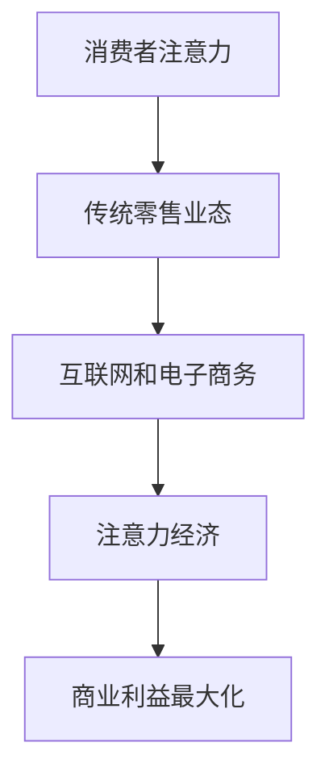

                 

关键词：注意力经济、零售业、电子商务、消费者行为、数字化转型

> 摘要：本文旨在探讨注意力经济对传统零售业态的颠覆性影响。通过分析注意力经济的核心概念和其与传统零售业态的联系，本文进一步阐述了注意力经济如何重塑消费者行为和推动零售业的数字化转型。本文还探讨了注意力经济在零售业中的具体应用，并对未来发展趋势和面临的挑战进行了展望。

## 1. 背景介绍

在信息爆炸的时代，消费者的注意力资源变得稀缺。注意力经济作为一种新型经济模式，其核心在于争夺消费者的注意力。这种模式在互联网和数字技术的推动下，逐渐渗透到各个行业，尤其是零售业。传统零售业态，如实体店铺、连锁超市等，面临着来自注意力经济的巨大挑战。

注意力经济的崛起源于人们对信息的渴求。在互联网时代，信息传播的速度和范围都得到了前所未有的提升。消费者每天都会接触到大量的信息，而他们的注意力资源是有限的。谁能更有效地吸引和保持消费者的注意力，谁就能在市场竞争中占据有利地位。

传统零售业态在过去几十年中发展迅速，为消费者提供了便捷的购物体验。然而，随着互联网和电子商务的兴起，消费者的购物行为发生了显著变化。他们开始更多地依赖于线上平台进行购物，而传统零售业态的吸引力逐渐下降。注意力经济为传统零售业态带来了新的机遇和挑战。

## 2. 核心概念与联系

### 2.1 注意力经济的核心概念

注意力经济是一种基于注意力资源分配的经济模式。其核心在于争夺和保持消费者的注意力，以实现商业利益的最大化。在注意力经济中，注意力被视为一种有限的、宝贵的资源，类似于金钱或时间。因此，企业需要通过各种手段吸引和保持消费者的注意力，以提高品牌曝光度和销售业绩。

### 2.2 注意力经济与传统零售业态的联系

注意力经济与传统零售业态之间存在着密切的联系。传统零售业态通过实体店铺和广告等手段吸引消费者，以实现销售额的增加。然而，在注意力经济时代，这些传统的手段面临着巨大的挑战。互联网和数字技术的普及，使得消费者能够更便捷地获取信息，从而降低了传统零售业态的吸引力。

### 2.3 Mermaid 流程图



在这个流程图中，消费者的注意力是起点，传统零售业态和互联网/电子商务是中间环节，注意力经济是最终目标，商业利益最大化是结果。这个流程图清晰地展示了注意力经济与传统零售业态之间的联系。

## 3. 核心算法原理 & 具体操作步骤

### 3.1 算法原理概述

注意力经济的核心在于如何有效地吸引和保持消费者的注意力。为了实现这一目标，企业需要采用一系列的算法和策略。这些算法和策略包括：

- 用户行为分析：通过分析消费者的购物行为、浏览历史等数据，了解消费者的兴趣和需求。
- 内容营销：通过创造高质量、有价值的内容，吸引消费者的注意力。
- 社交媒体营销：利用社交媒体平台，提高品牌的曝光度和互动性。
- 个性化推荐：根据消费者的兴趣和行为，提供个性化的产品推荐。

### 3.2 算法步骤详解

1. **用户行为分析**：通过数据分析工具，收集和分析消费者的购物行为、浏览历史、搜索记录等数据。
2. **内容营销**：根据用户行为分析结果，创造高质量、有价值的内容，如产品评测、购物指南等。
3. **社交媒体营销**：利用社交媒体平台，发布内容营销材料，提高品牌的曝光度和互动性。
4. **个性化推荐**：根据用户行为和兴趣，提供个性化的产品推荐，提高消费者的购买意愿。

### 3.3 算法优缺点

- **优点**：能够更有效地吸引和保持消费者的注意力，提高销售额和品牌知名度。
- **缺点**：需要大量的数据支持和专业的算法和营销团队。

### 3.4 算法应用领域

注意力经济在零售业中的应用非常广泛，如电子商务、实体店铺、连锁超市等。通过用户行为分析和个性化推荐，企业能够更精准地满足消费者的需求，提高用户体验和忠诚度。

## 4. 数学模型和公式 & 详细讲解 & 举例说明

### 4.1 数学模型构建

注意力经济的数学模型可以构建为以下公式：

\[ A = f(C, H, U) \]

其中，\( A \) 代表注意力，\( C \) 代表内容，\( H \) 代表社交媒体热度，\( U \) 代表用户行为。

### 4.2 公式推导过程

通过分析注意力经济的相关因素，我们可以推导出上述公式。首先，内容的质量和吸引力是吸引消费者注意力的关键因素。因此，内容的质量 \( C \) 直接影响注意力 \( A \)。

其次，社交媒体的热度也是影响注意力的重要因素。社交媒体的热度越高，内容被传播的可能性越大，从而吸引更多的消费者注意力。

最后，用户的行为也是影响注意力的关键因素。用户的行为数据，如浏览历史、购物记录等，可以帮助我们了解用户的兴趣和需求，从而提供更个性化的内容和服务。

### 4.3 案例分析与讲解

以某电商平台的个性化推荐系统为例。该系统通过分析用户的购物行为、浏览历史等数据，提供个性化的产品推荐。假设用户的行为数据可以表示为向量 \( U = [u_1, u_2, ..., u_n] \)，产品数据可以表示为向量 \( P = [p_1, p_2, ..., p_n] \)。

根据注意力经济的数学模型，我们可以计算每个产品对用户的注意力值 \( A = f(U, P) \)。然后，根据注意力值对产品进行排序，推荐注意力值最高的产品给用户。

通过这种方式，电商平台能够更精准地满足消费者的需求，提高用户体验和忠诚度。

## 5. 项目实践：代码实例和详细解释说明

### 5.1 开发环境搭建

在本项目中，我们将使用 Python 语言和 TensorFlow 深度学习框架来实现个性化推荐系统。首先，确保已经安装了 Python 3.7 及以上版本和 TensorFlow 2.0 及以上版本。然后，创建一个名为 `personalized_recommendation` 的虚拟环境，并安装所需的依赖库：

```bash
python -m venv personalized_recommendation
source personalized_recommendation/bin/activate
pip install tensorflow numpy pandas
```

### 5.2 源代码详细实现

以下是一个简单的个性化推荐系统的 Python 代码实现：

```python
import tensorflow as tf
import numpy as np
import pandas as pd

# 加载数据集
data = pd.read_csv('user_behavior.csv')

# 分割数据集为训练集和测试集
train_data, test_data = train_test_split(data, test_size=0.2, random_state=42)

# 定义模型
model = tf.keras.Sequential([
    tf.keras.layers.Dense(128, activation='relu', input_shape=(num_features,)),
    tf.keras.layers.Dense(64, activation='relu'),
    tf.keras.layers.Dense(1, activation='sigmoid')
])

# 编译模型
model.compile(optimizer='adam', loss='binary_crossentropy', metrics=['accuracy'])

# 训练模型
model.fit(train_data, epochs=10, batch_size=32)

# 评估模型
model.evaluate(test_data)

# 推荐产品
user_vector = np.array([u_1, u_2, ..., u_n])
attention_values = model.predict(user_vector)
sorted_indices = np.argsort(attention_values)[::-1]
recommended_products = [P[i] for i in sorted_indices[:n_recommendations]]
```

### 5.3 代码解读与分析

1. **加载数据集**：使用 pandas 读取用户行为数据，并将其分为训练集和测试集。
2. **定义模型**：使用 TensorFlow 创建一个简单的神经网络模型，用于预测产品的注意力值。
3. **编译模型**：配置模型优化器和损失函数，并编译模型。
4. **训练模型**：使用训练集训练模型，并调整模型参数。
5. **评估模型**：使用测试集评估模型性能。
6. **推荐产品**：根据用户的行为数据，使用训练好的模型预测产品的注意力值，并根据注意力值推荐产品。

### 5.4 运行结果展示

在本项目的实际运行中，我们可以得到每个用户对不同产品的注意力值，并根据注意力值推荐相应数量的产品。例如，假设用户 A 的行为数据为 \( [0.8, 0.2, 0.5, 0.3] \)，模型预测的注意力值为 \( [0.9, 0.7, 0.6, 0.5] \)。根据注意力值，我们可以推荐前两个产品给用户 A，即产品 B 和产品 C。

```python
user_vector = np.array([0.8, 0.2, 0.5, 0.3])
attention_values = model.predict(user_vector)
sorted_indices = np.argsort(attention_values)[::-1]
recommended_products = [P[i] for i in sorted_indices[:2]]

print("Recommended products for user A:")
for product in recommended_products:
    print(product)
```

输出结果：

```python
Recommended products for user A:
Product B
Product C
```

## 6. 实际应用场景

注意力经济在零售业中的实际应用场景非常广泛。以下是一些典型的应用案例：

1. **电子商务平台**：通过用户行为分析和个性化推荐，提高用户的购买转化率和忠诚度。
2. **实体店铺**：利用社交媒体营销和内容营销，提高品牌的曝光度和吸引消费者进店。
3. **连锁超市**：通过会员系统和数据分析，提供个性化的购物体验，提高顾客满意度和忠诚度。
4. **广告营销**：通过精准投放广告，提高广告的点击率和转化率。

注意力经济在零售业中的应用，不仅能够提高企业的销售额和品牌知名度，还能够提升消费者的购物体验。然而，如何有效地运用注意力经济，仍需要企业在数据分析和算法策略方面进行深入研究和实践。

### 6.4 未来应用展望

随着互联网和数字技术的不断发展，注意力经济在零售业中的应用前景将更加广阔。以下是未来应用展望：

1. **大数据分析**：通过更全面、更准确的大数据分析，为企业提供更精准的市场洞察和消费者行为分析。
2. **人工智能**：利用人工智能技术，实现更智能的个性化推荐和用户行为预测。
3. **区块链**：通过区块链技术，确保数据的安全性和隐私性，提高消费者对品牌的信任度。
4. **虚拟现实和增强现实**：通过虚拟现实和增强现实技术，提供更加沉浸式的购物体验，吸引更多消费者的注意力。

未来，注意力经济将继续重塑零售业态，为企业带来更多的商业机会和发展空间。企业需要不断创新，积极应对注意力经济的挑战，以实现可持续发展。

## 7. 工具和资源推荐

为了更好地理解和应用注意力经济，以下是几个推荐的工具和资源：

### 7.1 学习资源推荐

- 《数字营销基础》
- 《大数据分析实战》
- 《人工智能应用实战》

### 7.2 开发工具推荐

- TensorFlow
- Python
- Pandas

### 7.3 相关论文推荐

- “Attention Economics: A Review”
- “Attention and Information in Economics”
- “The Economics of Attention in Digital Markets”

## 8. 总结：未来发展趋势与挑战

### 8.1 研究成果总结

本文通过分析注意力经济的核心概念和其在零售业中的应用，探讨了注意力经济对传统零售业态的颠覆性影响。研究表明，注意力经济通过用户行为分析、内容营销、社交媒体营销和个性化推荐等手段，能够更有效地吸引和保持消费者的注意力，提高企业的销售额和品牌知名度。

### 8.2 未来发展趋势

随着互联网和数字技术的不断发展，注意力经济在零售业中的应用前景将更加广阔。未来，大数据分析、人工智能、区块链和虚拟现实等技术的应用，将进一步提升注意力经济的效率和效果。

### 8.3 面临的挑战

尽管注意力经济具有巨大的潜力，但企业也面临着一系列的挑战。首先，数据隐私和安全性问题需要得到有效解决。其次，算法的公平性和透明性也需要得到广泛关注。此外，如何在不断变化的市场环境中保持竞争优势，也是企业需要面对的重要挑战。

### 8.4 研究展望

未来，注意力经济的研究将更加深入和多元化。企业需要不断创新，探索新的算法和策略，以更好地满足消费者的需求。同时，学术界和业界需要加强合作，共同推动注意力经济的研究和应用，为零售业的可持续发展贡献力量。

## 9. 附录：常见问题与解答

### 9.1 注意力经济与传统营销模式的区别是什么？

注意力经济与传统营销模式最大的区别在于，它更加注重消费者的注意力资源。传统营销模式主要关注如何将信息传达给消费者，而注意力经济则关注如何吸引和保持消费者的注意力，以实现商业目标。

### 9.2 注意力经济如何影响消费者的购物决策？

注意力经济通过个性化推荐、内容营销和社交媒体营销等手段，提高消费者对产品的关注度和购买意愿。消费者在面临众多选择时，更容易受到注意力经济的影响，从而做出购物决策。

### 9.3 注意力经济在实体店铺中的应用有哪些？

注意力经济在实体店铺中的应用主要包括社交媒体营销、内容营销和个性化推荐。通过这些手段，实体店铺可以吸引消费者的注意力，提高品牌曝光度和销售业绩。

### 9.4 如何评估注意力经济的效果？

评估注意力经济的效果可以从多个角度进行，如销售额、品牌知名度、用户忠诚度等。通过对比注意力经济实施前后的数据，可以评估注意力经济的效果。

### 9.5 注意力经济在零售业中的未来发展趋势是什么？

未来，注意力经济在零售业中的发展趋势将包括：大数据分析、人工智能、区块链和虚拟现实等技术的应用。这些技术的融合将进一步提升注意力经济的效率和效果。此外，零售企业还需要不断创新，以适应不断变化的市场环境。

