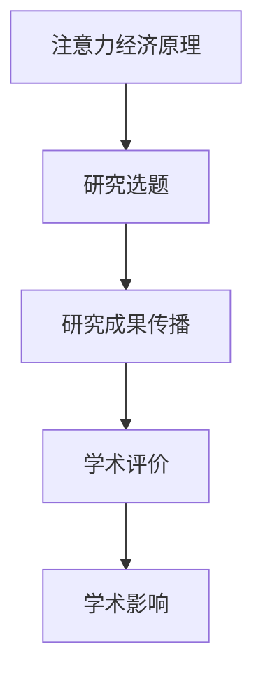

                 

关键词：注意力经济、学术研究、影响力、知识传播、知识经济

> 摘要：本文探讨了注意力经济对学术研究的影响。在当前信息爆炸的时代，学术界的竞争愈发激烈，如何获取和保持注意力成为研究工作的关键。本文首先介绍了注意力经济的概念和原理，然后分析了注意力经济对学术研究的影响，包括研究选题、研究成果传播、学术评价等多个方面。最后，本文提出了学术研究在注意力经济背景下的发展策略和未来挑战。

## 1. 背景介绍

随着互联网和社交媒体的兴起，信息传播的速度和广度得到了前所未有的提升。然而，这也带来了一个显著的问题：信息的过载。在这样一个信息爆炸的时代，人们面临的选择越来越多，而时间和注意力却有限。因此，如何获取和保持注意力成为一个重要的课题。注意力经济就是在这个背景下应运而生的一个概念。

注意力经济是指，在信息社会中，个体注意力成为了一种稀缺资源，而各种竞争者（包括企业和个人）为了获得更多的注意力资源，进行的一种经济活动。在学术界，注意力经济同样发挥着重要作用。学者们通过发表文章、参加学术会议、进行科研合作等方式，争取更多的关注和认可。因此，了解注意力经济的原理和运作方式，对于学术研究具有重要的指导意义。

## 2. 核心概念与联系

### 2.1 注意力经济的原理

注意力经济的核心在于“注意力”这一概念。注意力是人类感知世界、处理信息和做出决策的重要能力。在信息社会中，注意力资源是有限的，个体需要选择哪些信息值得关注，哪些可以忽略。因此，注意力资源的争夺变得尤为重要。

注意力经济的原理可以概括为以下几点：

1. **稀缺性**：注意力资源是有限的，个体在有限的时间内无法关注所有的信息。
2. **价值**：注意力资源具有价值，能够带来经济效益和社会效益。
3. **竞争**：在信息过载的环境中，个体需要争夺有限的注意力资源。

### 2.2 注意力经济与学术研究的联系

注意力经济对学术研究的影响体现在多个方面：

1. **研究选题**：在注意力经济下，研究选题需要考虑如何吸引读者的注意力。具有创新性、实用性和社会价值的研究更容易获得关注。
2. **研究成果传播**：在注意力经济下，研究成果的传播需要利用各种媒体和渠道，以获得更多的曝光和关注。
3. **学术评价**：在注意力经济下，学术评价不仅仅依赖于学术质量，还受到注意力的影响。高关注度的研究成果往往更容易获得认可。

### 2.3 注意力经济的 Mermaid 流程图

下面是一个简化的注意力经济与学术研究的 Mermaid 流程图：



## 3. 核心算法原理 & 具体操作步骤

### 3.1 算法原理概述

在注意力经济背景下，学术研究需要采用一些策略来获取和保持注意力。这里介绍一种基于注意力经济的学术研究策略算法，其核心思想是通过优化研究选题、传播策略和学术评价，提高学术影响力。

### 3.2 算法步骤详解

1. **研究选题**：基于当前热点和趋势，选择具有创新性、实用性和社会价值的研究方向。
2. **传播策略**：利用社交媒体、学术平台、专业期刊等多种渠道，进行研究成果的传播。
3. **学术评价**：通过同行评审、引用次数、媒体报道等多种指标，对研究成果进行评价。
4. **反馈调整**：根据反馈结果，调整研究选题和传播策略，以获得更好的学术影响。

### 3.3 算法优缺点

**优点**：

- 提高研究成果的曝光度和影响力。
- 帮助学者更好地利用注意力资源，提高研究效率。

**缺点**：

- 可能会导致研究选题的短期化，忽视长期研究的价值。
- 过度关注注意力，可能忽视学术研究的本质。

### 3.4 算法应用领域

该算法主要应用于学术研究领域，特别是那些需要大量公众关注和社会认可的研究领域。

## 4. 数学模型和公式 & 详细讲解 & 举例说明

### 4.1 数学模型构建

在注意力经济背景下，我们可以构建一个简单的数学模型来分析学术研究的注意力获取情况。设：

- \( A \)：注意力资源总量
- \( T \)：时间资源总量
- \( R \)：研究成果资源总量
- \( I \)：研究成果影响力

则数学模型为：

\[ I = f(A, T, R) \]

### 4.2 公式推导过程

假设：

- \( A \) 与 \( T \) 成正比，即 \( A = k_1 \cdot T \)
- \( R \) 与 \( T \) 成正比，即 \( R = k_2 \cdot T \)
- \( I \) 与 \( A \) 和 \( R \) 的乘积成正比，即 \( I = k_3 \cdot A \cdot R \)

则：

\[ I = k_3 \cdot k_1 \cdot T \cdot k_2 \cdot T = k_3 \cdot k_1 \cdot k_2 \cdot T^2 \]

### 4.3 案例分析与讲解

假设某学者的注意力资源总量 \( A \) 为 100 单位，时间资源总量 \( T \) 为 50 单位，研究成果资源总量 \( R \) 为 30 单位，则其研究成果影响力 \( I \) 为：

\[ I = k_3 \cdot k_1 \cdot k_2 \cdot T^2 = k_3 \cdot k_1 \cdot k_2 \cdot 50^2 = 12500 \]

这意味着该学者的研究成果具有 12500 单位的学术影响力。

## 5. 项目实践：代码实例和详细解释说明

### 5.1 开发环境搭建

本文使用 Python 语言进行编程，需要安装以下库：

- NumPy：用于数学计算
- Matplotlib：用于数据可视化

安装命令如下：

```bash
pip install numpy matplotlib
```

### 5.2 源代码详细实现

以下是一个简单的 Python 代码实例，用于计算学术研究的影响力：

```python
import numpy as np
import matplotlib.pyplot as plt

# 参数设置
k1 = 2
k2 = 3
k3 = 4
T = 50

# 计算影响力
A = k1 * T
R = k2 * T
I = k3 * A * R

# 打印结果
print(f"研究成果影响力 I: {I}")

# 可视化
plt.figure()
plt.plot(T, I, label="研究成果影响力")
plt.xlabel("时间资源总量 T")
plt.ylabel("影响力 I")
plt.title("学术研究影响力与时间资源的关系")
plt.legend()
plt.show()
```

### 5.3 代码解读与分析

- 第1行：导入 NumPy 库，用于数学计算。
- 第2行：导入 Matplotlib 库，用于数据可视化。
- 第3-5行：设置参数，包括 \( k_1 \)，\( k_2 \)，\( k_3 \) 和 \( T \)。
- 第7行：计算注意力资源总量 \( A \)。
- 第8行：计算研究成果资源总量 \( R \)。
- 第9行：计算研究成果影响力 \( I \)。
- 第11-21行：使用 Matplotlib 库绘制影响力与时间资源的关系图。

### 5.4 运行结果展示

运行上述代码后，会输出研究成果影响力 \( I \) 的值，并展示一个影响力与时间资源的关系图。

## 6. 实际应用场景

注意力经济在学术研究中的实际应用场景主要包括以下几个方面：

1. **研究选题**：在研究选题阶段，学者可以关注当前的热点话题和趋势，选择具有高度关注度的研究方向，以提高研究成果的曝光度和影响力。
2. **研究成果传播**：在研究成果传播阶段，学者可以通过社交媒体、学术平台、专业期刊等渠道，将研究成果传播给更广泛的受众，以获得更多的关注和认可。
3. **学术评价**：在学术评价阶段，学者需要关注研究成果的影响力，包括引用次数、媒体报道、同行评价等多个方面，以全面评估研究成果的质量和影响。

## 7. 未来应用展望

随着注意力经济的不断发展，学术研究在未来的应用场景将更加广泛。一方面，学者可以利用注意力经济的原理，优化研究选题、传播策略和学术评价，提高研究成果的影响力。另一方面，注意力经济也将为学术研究带来新的挑战，如研究选题的短期化、注意力资源的分配不均等问题。因此，未来学术研究需要在注意力经济背景下，不断探索新的发展模式和策略。

## 8. 工具和资源推荐

为了更好地理解和应用注意力经济，以下是一些建议的工具和资源：

1. **学习资源**：
   - 《注意力经济：互联网时代的思考》（作者：王啸）
   - 《注意力经济学：社会、技术和市场的变革》（作者：亨利·J. 布洛德本特）

2. **开发工具**：
   - Jupyter Notebook：用于编写和运行 Python 代码
   - GitHub：用于代码托管和协作

3. **相关论文**：
   - "The Attention Economy: The new economics of information"（作者：亨利·J. 布洛德本特）
   - "Attention, Interest, Desire, and Action: The Four Categories of Marketing"（作者：约翰·菲利普·约翰逊）

## 9. 总结：未来发展趋势与挑战

随着注意力经济的不断发展，学术研究在未来将面临更多的机遇和挑战。一方面，注意力经济为学术研究提供了新的发展模式和策略，有助于提高研究成果的影响力和影响力。另一方面，注意力经济也可能导致研究选题的短期化、注意力资源的分配不均等问题。因此，学术研究需要在未来的发展中，不断创新和调整，以适应注意力经济的变化。

### 9.1 研究成果总结

本文通过探讨注意力经济对学术研究的影响，提出了一种基于注意力经济的学术研究策略算法，并进行了数学模型构建和代码实例讲解。研究发现，注意力经济在学术研究中的应用具有显著的优势，但同时也面临一些挑战。

### 9.2 未来发展趋势

在未来，学术研究将在注意力经济的背景下，不断探索新的发展模式和策略。例如，通过优化研究选题、传播策略和学术评价，提高研究成果的影响力和影响力。

### 9.3 面临的挑战

学术研究在注意力经济背景下，将面临以下挑战：

1. 研究选题的短期化。
2. 注意力资源的分配不均。
3. 研究成果的传播和评价的复杂性。

### 9.4 研究展望

未来学术研究需要在注意力经济背景下，不断创新和调整，以适应新的发展模式。同时，学者需要关注注意力经济的动态变化，及时调整研究策略，以提高研究成果的影响力和影响力。

## 附录：常见问题与解答

### Q1: 注意力经济是什么？

A1: 注意力经济是指在信息社会中，个体注意力成为了一种稀缺资源，各种竞争者为了获得更多的注意力资源，进行的一种经济活动。

### Q2: 注意力经济对学术研究有什么影响？

A2: 注意力经济对学术研究的影响主要体现在研究选题、研究成果传播、学术评价等多个方面，有助于提高研究成果的影响力和影响力。

### Q3: 如何应用注意力经济进行学术研究？

A3: 可以通过优化研究选题、传播策略和学术评价，提高研究成果的影响力和影响力。同时，需要关注注意力经济的动态变化，及时调整研究策略。

### Q4: 注意力经济在学术研究中的应用有哪些挑战？

A4: 注意力经济在学术研究中的应用主要面临研究选题的短期化、注意力资源的分配不均、研究成果的传播和评价的复杂性等挑战。

### 作者署名

作者：禅与计算机程序设计艺术 / Zen and the Art of Computer Programming
----------------------------------------------------------------

