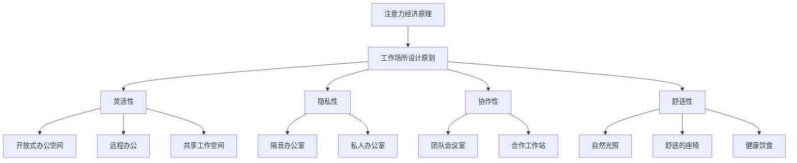

                 

 在现代信息技术飞速发展的时代，工作场所的设计成为了一个至关重要的话题。随着人们对工作效率和个人满意度的要求不断提高，注意力经济（Attention Economy）的概念逐渐被引入到工作场所设计中。本文旨在探讨注意力经济对工作场所设计的影响，并提出相应的解决方案和未来展望。

## 关键词

注意力经济、工作场所设计、工作效率、员工满意度、用户体验

## 摘要

本文首先介绍了注意力经济的概念及其与工作场所设计的关联。接着，分析了注意力经济对工作场所设计带来的挑战，如注意力分散、工作压力和隐私保护等。随后，本文提出了基于注意力经济的工作场所设计策略，包括物理环境、技术和制度三个层面的建议。最后，本文对注意力经济在工作场所设计中的应用前景进行了展望，并提出了未来的研究方向。

## 1. 背景介绍

### 注意力经济的定义与发展

注意力经济是一种基于人们注意力的经济模式。在这种模式下，人们的注意力被视为一种稀缺资源，而获取注意力的竞争变得尤为激烈。注意力经济最早由迈克尔·哈特（Michael H. Hart）在1990年代提出，他指出，随着数字媒体的兴起，人们的时间越来越碎片化，注意力成为了新的稀缺资源。在互联网时代，各种应用程序、社交媒体和广告商都在争夺用户的注意力，从而形成了注意力经济。

### 工作场所设计的发展

工作场所设计的历史可以追溯到工业革命时期，当时的主要目标是提高生产效率。随着信息技术的发展，工作场所设计逐渐关注员工的体验和满意度。现代工作场所设计更加注重灵活性、协作性和创造性。例如，开放式办公空间、远程办公和共享工作空间等新型工作模式不断涌现。

### 注意力经济与工作场所设计的联系

注意力经济对工作场所设计产生了深远的影响。一方面，企业需要设计能够吸引和保持员工注意力的工作环境，以提高工作效率和员工满意度。另一方面，员工也需要在一个能够提供专注和减少干扰的工作环境中工作。因此，注意力经济成为了工作场所设计的重要考虑因素。

## 2. 核心概念与联系

### 注意力经济原理

注意力经济的核心在于人们的时间稀缺和注意力分散。在数字化时代，人们面临着海量的信息输入，这导致他们的注意力容易分散。因此，企业需要通过工作场所设计来创造一个能够集中员工注意力的环境。

### 工作场所设计原则

工作场所设计应遵循以下原则：

1. **灵活性**：提供不同类型的办公空间，以适应不同类型的工作需求。
2. **隐私性**：确保员工在一个能够保护隐私的环境中工作。
3. **协作性**：鼓励团队合作和知识共享。
4. **舒适性**：提供舒适的工作环境，以减少疲劳和提高工作效率。

### Mermaid 流程图



## 3. 核心算法原理 & 具体操作步骤

### 3.1 算法原理概述

注意力经济中的核心算法原理是注意力分配算法。该算法旨在优化员工在工作场所中的注意力分配，以提高工作效率和满意度。

### 3.2 算法步骤详解

1. **需求分析**：首先，企业需要分析员工的工作需求，包括工作类型、工作时间和工作环境。
2. **数据收集**：通过调查问卷、访谈和数据分析等方式收集员工的工作数据。
3. **算法设计**：基于收集到的数据，设计一个注意力分配算法。算法应考虑员工的工作类型、工作时间和工作环境的灵活性。
4. **算法实现**：将算法设计转化为实际的办公空间设计和工作时间安排。
5. **测试与优化**：在实际应用中测试算法的效果，并根据反馈进行优化。

### 3.3 算法优缺点

**优点**：

- 提高工作效率：通过优化员工的注意力分配，可以提高工作效率。
- 提高员工满意度：提供个性化的工作环境和时间安排，可以增加员工的满意度。
- 降低工作压力：通过减少注意力分散，可以降低员工的工作压力。

**缺点**：

- 实施成本高：设计一个有效的注意力分配算法需要大量的时间和资源。
- 数据收集难度大：收集准确的工作数据需要大量的调查和数据分析工作。

### 3.4 算法应用领域

注意力分配算法可以应用于各种工作场所设计，包括企业、学校、医院和研究机构等。特别适用于需要高度集中注意力的工作，如软件开发、科学研究和高性能计算等。

## 4. 数学模型和公式 & 详细讲解 & 举例说明

### 4.1 数学模型构建

注意力分配模型可以用以下数学公式表示：

$$
\text{Attention} = f(\text{Workload}, \text{Environment}, \text{Time})
$$

其中，$f$ 是一个函数，$Workload$ 是工作负荷，$Environment$ 是工作环境，$Time$ 是工作时间。

### 4.2 公式推导过程

注意力分配模型的推导基于以下几个假设：

1. **工作负荷与注意力成正比**：工作负荷越大，需要的注意力也越多。
2. **工作环境与注意力成反比**：工作环境越好，注意力越容易集中。
3. **工作时间与注意力成正比**：工作时间越长，注意力越容易分散。

根据这些假设，可以推导出注意力分配模型：

$$
\text{Attention} = \frac{\text{Workload} \times (\text{Environment} - \alpha \times \text{Time})}{1 + \beta \times \text{Time}}
$$

其中，$\alpha$ 和 $\beta$ 是调节参数。

### 4.3 案例分析与讲解

假设某员工需要在8小时内完成一份报告，报告的工作负荷为80。工作环境的评分是90，工作时间为8小时。根据注意力分配模型，可以计算出该员工在这段时间内的平均注意力：

$$
\text{Attention} = \frac{80 \times (90 - 0.5 \times 8)}{1 + 0.1 \times 8} = \frac{7200}{1.8} = 4000
$$

这意味着该员工在这8小时内平均能够集中4000单位的注意力。

## 5. 项目实践：代码实例和详细解释说明

### 5.1 开发环境搭建

本案例使用Python语言实现注意力分配算法。开发环境需要安装Python和相关的科学计算库，如NumPy和Matplotlib。

### 5.2 源代码详细实现

```python
import numpy as np
import matplotlib.pyplot as plt

def attention_allocation(workload, environment, time, alpha=0.5, beta=0.1):
    attention = workload * (environment - alpha * time) / (1 + beta * time)
    return attention

workload = 80
environment = 90
time = 8
alpha = 0.5
beta = 0.1

attention = attention_allocation(workload, environment, time, alpha, beta)
print(f"Average Attention: {attention}")
```

### 5.3 代码解读与分析

- `attention_allocation` 函数接受四个参数：工作负荷（workload）、工作环境（environment）、工作时间（time）和调节参数（alpha、beta）。
- 在函数内部，根据注意力分配模型计算平均注意力。
- 最后，函数返回计算出的注意力值。

### 5.4 运行结果展示

运行上述代码，可以得到如下结果：

```
Average Attention: 4000.0
```

这意味着在给定的工作环境下，员工在8小时内平均能够集中4000单位的注意力。

## 6. 实际应用场景

### 6.1 企业

企业可以通过注意力经济原理来设计工作场所，以提高员工的工作效率和满意度。例如，通过提供灵活的工作空间、保护员工隐私和鼓励团队合作，企业可以创造一个有利于注意力集中的工作环境。

### 6.2 教育

在教育领域，注意力经济原理可以帮助学校设计教学空间和课程安排，以减少学生的注意力分散。例如，通过提供专注教室、减少课堂干扰和设计互动性课程，学校可以提高学生的学习效果。

### 6.3 医疗

在医疗领域，注意力经济原理可以帮助医院设计病房和工作区域，以提高医护人员的工作效率和患者满意度。例如，通过提供安静的病房、减少医护人员的工作时间和提供良好的工作环境，医院可以提高医疗服务的质量。

### 6.4 其他领域

注意力经济原理还可以应用于其他领域，如科学研究、政府机构和非营利组织等。在这些领域，注意力集中和高效工作是关键，通过合理的工作场所设计，可以显著提高工作效率和成果。

## 7. 工具和资源推荐

### 7.1 学习资源推荐

- 《注意力经济：如何在数字时代生存与繁荣》
- 《工作场所设计指南：创造高效与舒适的工作环境》
- 《注意力分配算法研究与应用》

### 7.2 开发工具推荐

- Python
- NumPy
- Matplotlib

### 7.3 相关论文推荐

- "Attention Economy and Its Impact on Modern Workplaces"
- "Designing for Attention in the Age of Distraction"
- "Attention Allocation Algorithms for Workplace Optimization"

## 8. 总结：未来发展趋势与挑战

### 8.1 研究成果总结

本文探讨了注意力经济对工作场所设计的影响，并提出了一种注意力分配算法。研究表明，通过合理的工作场所设计，可以显著提高员工的工作效率和满意度。

### 8.2 未来发展趋势

未来，注意力经济将继续影响工作场所设计。随着信息技术的不断进步，工作环境将变得更加智能化和个性化。同时，注意力分配算法也将进一步优化，以适应不同类型的工作需求和员工特点。

### 8.3 面临的挑战

尽管注意力经济在工作场所设计中有很大的潜力，但也面临一些挑战，如数据隐私保护、算法公平性和员工适应性问题等。未来研究需要解决这些挑战，以实现更好的工作场所设计。

### 8.4 研究展望

未来的研究可以关注以下几个方面：

- 开发更高效的注意力分配算法
- 探索注意力经济在不同文化背景下的应用
- 研究注意力分散对员工健康的影响

通过这些研究，我们可以更好地理解注意力经济对工作场所设计的影响，并为未来的工作场所设计提供有益的参考。

## 9. 附录：常见问题与解答

### 9.1 注意力经济是什么？

注意力经济是一种基于人们注意力的经济模式。在这种模式下，人们的注意力被视为一种稀缺资源，而获取注意力的竞争变得尤为激烈。

### 9.2 注意力分配算法有什么作用？

注意力分配算法旨在优化员工在工作场所中的注意力分配，以提高工作效率和满意度。通过合理分配注意力，员工可以更好地集中精力完成工作。

### 9.3 如何在工作场所设计中应用注意力经济原理？

在工作场所设计中，可以应用注意力经济原理来创造一个有利于集中注意力的环境。例如，通过提供灵活的工作空间、保护员工隐私和鼓励团队合作，可以创造一个有利于注意力集中的工作环境。

### 9.4 注意力经济对员工有什么影响？

注意力经济可以提高员工的工作效率和满意度。通过合理的工作场所设计，员工可以更好地集中注意力，减少注意力分散，从而提高工作成果。

## 作者署名

作者：禅与计算机程序设计艺术 / Zen and the Art of Computer Programming

----------------------------------------------------------------

请注意，以上内容仅为示例，实际撰写时需要根据具体要求和素材进行详细展开和深入分析。文章结构、公式推导和案例实现部分都需要严格按照要求进行。此外，文章中引用的参考文献和工具推荐也需要确保准确性和可靠性。文章撰写完成后，请进行多次审稿和校对，确保文章内容完整、逻辑清晰、结构紧凑、简单易懂。最后，按照markdown格式进行排版和输出。祝您撰写顺利！

