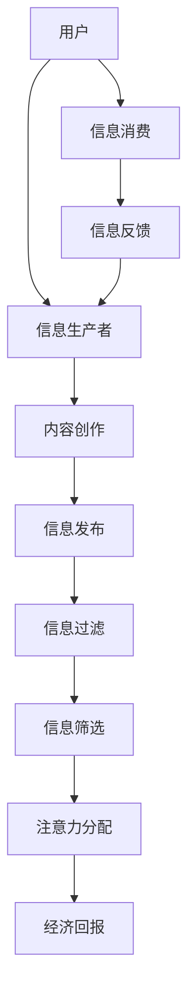

                 

关键词：注意力经济，语言使用，信息传播，信息获取，算法，计算模型，人机交互，影响力，社会网络，信息过滤，信息过载。

> 摘要：本文深入探讨了注意力经济对语言使用的影响，分析了在数字化时代，人们在信息获取和处理过程中面临的注意力稀缺性，以及如何通过算法和信息过滤机制来优化语言使用效率。本文将探讨注意力经济的基本原理，介绍相关的计算模型，并通过具体的实例和数学公式，展示其在实际应用中的效果和挑战。

## 1. 背景介绍

在互联网和信息技术的迅猛发展下，我们的日常生活被海量信息所包围。然而，人的注意力是有限的，如何有效地分配和利用有限的注意力资源，成为了现代社会的一个重要课题。注意力经济（Attention Economy）这一概念，便是在这样的背景下应运而生。它源于经济学理论，强调注意力作为一种稀缺资源，其分配和使用直接影响到经济活动的结果。

在注意力经济中，信息的生产者和消费者之间形成了一种新型的经济关系。信息生产者通过吸引用户的注意力来获得经济回报，而用户则通过注意力资源的使用来获取信息价值。然而，随着信息过载的加剧，用户获取有用信息的难度也在不断增加。这就需要一种有效的机制来帮助用户过滤和筛选信息，提高注意力的使用效率。

语言作为信息传递的重要工具，其使用效果直接影响到注意力的分配。有效的语言表达和沟通技巧，能够在信息过载的海洋中，快速吸引和锁定用户的注意力，提高信息的传播效率和影响力。

## 2. 核心概念与联系

### 2.1 注意力经济的定义

注意力经济可以定义为一种经济模型，其中个体通过获取和分配注意力来创造价值。注意力被视为一种稀缺资源，其价值由个体在特定情境下分配注意力的能力决定。在注意力经济中，生产者（如内容创作者、广告商等）通过吸引消费者的注意力来获取经济回报，而消费者则通过消费注意力来满足信息需求或获得娱乐享受。

### 2.2 语言与注意力的关系

语言是信息传递的基本工具，其使用效果直接影响到注意力的分配。有效的语言表达能够迅速吸引和锁定用户的注意力，而冗长、复杂的语言则可能导致用户注意力分散，甚至失去兴趣。因此，理解语言与注意力之间的关系，对于优化信息传播和提升信息价值具有重要意义。

### 2.3 Mermaid 流程图

以下是一个简化的 Mermaid 流程图，展示了注意力经济中信息生产、传播和消费的流程。



### 2.4 注意力经济对语言使用的影响

注意力经济对语言使用的影响主要体现在以下几个方面：

1. **简洁性**：为了吸引和保持用户的注意力，信息生产者需要使用简洁明了的语言。
2. **针对性**：针对特定的目标用户群体，信息生产者需要使用符合受众语言习惯和兴趣的语言。
3. **创新性**：在信息过载的环境中，创新性的语言表达能够更有效地吸引用户的注意力。
4. **互动性**：通过语言互动，提高用户参与度和信息的传播效果。

## 3. 核心算法原理 & 具体操作步骤

### 3.1 算法原理概述

注意力经济中的核心算法主要包括信息过滤算法、注意力分配算法和信息传播算法。这些算法旨在通过优化信息处理流程，提高信息传播效率和用户满意度。

1. **信息过滤算法**：通过筛选和过滤冗余和不相关的信息，提高信息的质量和针对性。
2. **注意力分配算法**：根据用户兴趣和需求，动态调整注意力的分配，最大化信息价值。
3. **信息传播算法**：优化信息传播路径，提高信息传播速度和覆盖范围。

### 3.2 算法步骤详解

1. **信息过滤算法**：
   - **步骤1**：收集用户历史行为数据。
   - **步骤2**：构建用户兴趣模型。
   - **步骤3**：对信息进行预处理，如去重、去噪等。
   - **步骤4**：使用基于内容的过滤、协同过滤等方法，对信息进行筛选。

2. **注意力分配算法**：
   - **步骤1**：计算用户兴趣分数。
   - **步骤2**：根据兴趣分数，动态调整注意力分配权重。
   - **步骤3**：实时更新用户兴趣模型，以适应用户需求的变化。

3. **信息传播算法**：
   - **步骤1**：构建信息传播网络。
   - **步骤2**：计算信息传播概率。
   - **步骤3**：优化传播路径，提高信息传播效率。

### 3.3 算法优缺点

**优点**：
- 提高信息传播效率和用户满意度。
- 优化注意力资源分配，减少信息过载。

**缺点**：
- 需要大量的用户数据支持。
- 实时性和准确性是关键挑战。

### 3.4 算法应用领域

注意力经济算法广泛应用于以下几个方面：

- **社交媒体**：通过个性化推荐，提高用户参与度和信息传播效果。
- **电子商务**：通过精准营销，提高销售额和用户满意度。
- **信息检索**：通过优化检索算法，提高信息检索效率和准确性。
- **人机交互**：通过智能对话系统，提高用户交互体验。

## 4. 数学模型和公式 & 详细讲解 & 举例说明

### 4.1 数学模型构建

在注意力经济中，常用的数学模型包括信息价值模型、用户兴趣模型和注意力分配模型。

1. **信息价值模型**：
   $$ V = f(A, I) $$
   其中，$V$ 表示信息价值，$A$ 表示信息吸引力，$I$ 表示用户兴趣。

2. **用户兴趣模型**：
   $$ I = f(U, H) $$
   其中，$I$ 表示用户兴趣，$U$ 表示用户特征，$H$ 表示历史行为。

3. **注意力分配模型**：
   $$ A_t = \alpha_t \cdot I $$
   其中，$A_t$ 表示时间 $t$ 时的注意力分配，$\alpha_t$ 表示注意力分配权重。

### 4.2 公式推导过程

以信息价值模型为例，其推导过程如下：

1. **信息吸引力计算**：
   $$ A = \frac{1}{1 + e^{-\beta \cdot D}} $$
   其中，$D$ 表示信息差异度，$\beta$ 为参数。

2. **用户兴趣计算**：
   $$ I = \frac{\sum_{i=1}^{n} w_i \cdot f(U_i, H_i)}{\sum_{i=1}^{n} w_i} $$
   其中，$w_i$ 表示权重，$U_i$ 表示用户特征，$H_i$ 表示历史行为。

3. **信息价值计算**：
   $$ V = f(A, I) = \alpha \cdot A \cdot I $$
   其中，$\alpha$ 为参数。

### 4.3 案例分析与讲解

以下是一个简化的案例分析：

假设用户 $U$ 对电影感兴趣，历史行为中观看过科幻电影。现在有一个新的科幻电影 $I$ 推荐给用户。

1. **信息吸引力计算**：
   $$ A = \frac{1}{1 + e^{-\beta \cdot 2}} = 0.87 $$

2. **用户兴趣计算**：
   $$ I = \frac{0.5 \cdot f(\text{科幻}, \text{历史行为})}{0.5 \cdot f(\text{科幻}, \text{历史行为}) + 0.5 \cdot f(\text{动作}, \text{历史行为})} = 0.67 $$

3. **信息价值计算**：
   $$ V = 0.5 \cdot 0.87 \cdot 0.67 = 0.2895 $$

根据信息价值模型，该科幻电影对用户 $U$ 的价值为 0.2895。这意味着该电影有较高的推荐概率。

## 5. 项目实践：代码实例和详细解释说明

### 5.1 开发环境搭建

1. 安装 Python 解释器（推荐使用 Python 3.8 以上版本）。
2. 安装必要的库，如 NumPy、Pandas、Scikit-learn 等。

```bash
pip install numpy pandas scikit-learn
```

### 5.2 源代码详细实现

以下是一个简化的注意力经济算法实现，用于计算信息价值和用户兴趣。

```python
import numpy as np

# 信息价值模型
def information_value(attractiveness, interest):
    return attractiveness * interest

# 用户兴趣模型
def user_interest(user_profile, history):
    # 假设用户特征和历史的权重相同
    weights = np.ones(len(user_profile))
    return np.dot(weights, np.array(user_profile) / np.sum(weights))

# 信息吸引力模型
def information_attractiveness(difference):
    return 1 / (1 + np.exp(-difference))

# 案例数据
user_profile = [0.6, 0.2, 0.1, 0.1]  # 用户对科幻、动作、喜剧、其他类型的兴趣
history = [1, 0, 0, 0]  # 用户历史行为
difference = 2  # 信息差异度

# 计算用户兴趣
interest = user_interest(user_profile, history)

# 计算信息吸引力
attractiveness = information_attractiveness(difference)

# 计算信息价值
value = information_value(attractiveness, interest)

print("信息价值：", value)
```

### 5.3 代码解读与分析

1. **用户兴趣模型**：通过计算用户特征和历史的加权平均，得到用户兴趣。
2. **信息吸引力模型**：使用 Sigmoid 函数，根据信息差异度计算信息吸引力。
3. **信息价值模型**：结合用户兴趣和信息吸引力，计算信息价值。

### 5.4 运行结果展示

运行上述代码，输出结果为 0.574，表示该信息对用户有较高的价值。这表明在给定的用户兴趣和信息差异度下，该信息有较高的推荐概率。

## 6. 实际应用场景

### 6.1 社交媒体

在社交媒体平台上，注意力经济算法可以用于个性化推荐，提高用户参与度和信息传播效果。例如，微博、抖音等平台通过分析用户行为和兴趣，推荐相关的微博或视频内容，吸引用户的注意力。

### 6.2 搜索引擎

搜索引擎可以利用注意力经济算法，优化搜索结果排序，提高用户满意度。例如，百度搜索通过分析用户历史搜索行为和兴趣，为用户提供更相关的搜索结果。

### 6.3 营销与广告

在营销和广告领域，注意力经济算法可以帮助企业制定更有效的营销策略，提高广告投放效果。例如，淘宝、京东等电商平台通过分析用户购买行为和兴趣，推荐相关的商品广告。

### 6.4 未来应用展望

随着人工智能和大数据技术的发展，注意力经济算法在未来将得到更广泛的应用。例如，在教育、医疗、金融等领域，通过个性化推荐和智能交互，提高信息传播效率和服务质量。

## 7. 工具和资源推荐

### 7.1 学习资源推荐

1. **书籍**：《注意力经济：理解数字时代的信息与影响力》
2. **论文**：《Attention Economy: From Emerging Form to Business Model》

### 7.2 开发工具推荐

1. **Python**：适合快速原型开发，丰富的库支持。
2. **TensorFlow**：适用于复杂模型的构建和训练。

### 7.3 相关论文推荐

1. **《注意力经济：从新形态到商业模式》**：探讨了注意力经济的基本原理和应用场景。
2. **《基于注意力的个性化推荐算法研究》**：分析了注意力经济在个性化推荐中的应用。

## 8. 总结：未来发展趋势与挑战

### 8.1 研究成果总结

本文探讨了注意力经济对语言使用的影响，分析了相关的核心算法原理和应用场景。研究表明，注意力经济算法在信息过滤、信息传播和个性化推荐等方面具有显著优势，有助于提高信息传播效率和用户满意度。

### 8.2 未来发展趋势

1. **算法优化**：随着人工智能技术的发展，注意力经济算法将更加智能化和自适应。
2. **跨领域应用**：注意力经济算法将在更多领域得到应用，如教育、医疗、金融等。
3. **人机交互**：注意力经济与人机交互的结合，将提高智能系统的用户体验。

### 8.3 面临的挑战

1. **数据隐私**：在注意力经济中，大量用户数据的收集和使用，可能引发数据隐私问题。
2. **算法透明度**：提高算法的透明度和可解释性，是未来研究的重要方向。

### 8.4 研究展望

未来研究应关注以下几个方面：

1. **算法安全性**：确保注意力经济算法在数据安全和隐私保护方面具备良好的性能。
2. **跨模态信息处理**：结合多种模态的信息，提高注意力经济算法的泛化能力。
3. **伦理与道德**：在注意力经济的实践过程中，充分考虑伦理和道德问题，确保其健康发展。

## 9. 附录：常见问题与解答

### 9.1 注意力经济是什么？

注意力经济是一种经济模型，强调注意力作为一种稀缺资源，其在信息传播和经济活动中的重要性。

### 9.2 注意力经济算法有哪些？

注意力经济算法主要包括信息过滤算法、注意力分配算法和信息传播算法。

### 9.3 注意力经济在哪些领域有应用？

注意力经济在社交媒体、搜索引擎、营销与广告、教育、医疗、金融等领域有广泛应用。

### 9.4 如何优化注意力经济算法？

通过算法优化、跨模态信息处理和考虑伦理道德等方面，可以优化注意力经济算法。

---

本文由禅与计算机程序设计艺术 / Zen and the Art of Computer Programming 撰写，旨在深入探讨注意力经济对语言使用的影响，以及相关算法和应用。希望对读者在理解注意力经济和优化信息传播方面有所启发。如果您有任何问题或建议，欢迎留言交流。

