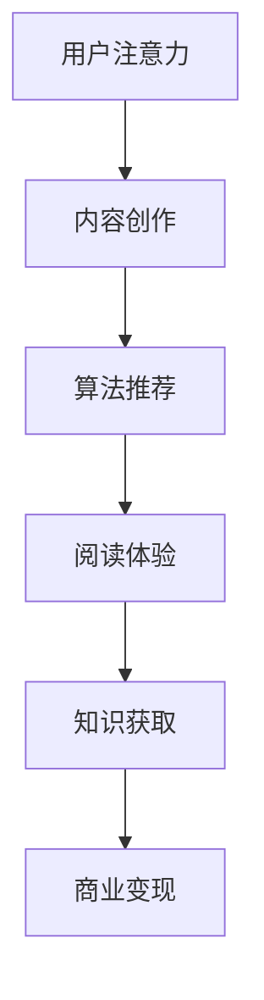

                 

关键词：注意力经济、阅读习惯、信息过载、认知负担、算法推荐、用户体验、知识获取、数字鸿沟、技术进步、人文关怀

> 摘要：本文深入探讨了注意力经济对现代阅读习惯的影响。随着信息技术的飞速发展，人们面临的信息过载和认知负担日益加剧，注意力经济作为一种新的经济模式，对阅读行为产生了深远的影响。本文从多角度分析了注意力经济对阅读习惯的促进作用和挑战，探讨了如何通过技术创新和人文关怀，改善和优化现代阅读体验。

## 1. 背景介绍

### 1.1 注意力经济的兴起

注意力经济（Attention Economy）是指一种基于用户注意力的经济模式，它强调的是在信息过载的时代，用户对信息的选择权和注意力分配的重要性。随着互联网和社交媒体的兴起，注意力经济逐渐成为主流经济模式之一。用户在数字世界中的每一次点击、浏览、点赞或评论，都成为了商家和平台获取利润的来源。

### 1.2 阅读习惯的变化

在传统媒体时代，阅读是一种深入、连贯的思考活动。然而，随着数字媒体的崛起，人们的阅读习惯发生了显著变化。碎片化阅读、浅层阅读、快阅读等成为主流，人们倾向于通过社交媒体、新闻客户端等获取信息，阅读的深度和广度受到了限制。

### 1.3 注意力经济与阅读习惯的关系

注意力经济不仅改变了信息的生产和传播方式，也对人们的阅读习惯产生了深远的影响。一方面，注意力经济通过算法推荐、内容推送等手段，将信息精准地推送给用户，提高了阅读的效率；另一方面，信息过载和认知负担的增加，使得用户在选择和阅读信息时面临更大的挑战。

## 2. 核心概念与联系

### 2.1 注意力经济的核心概念

注意力经济的关键在于“注意力”这一核心资源。在数字时代，用户的时间和注意力变得异常宝贵，因此，谁能吸引并保持用户的注意力，谁就能在竞争中占据优势。注意力经济的运作机制主要包括以下方面：

- **内容创作与传播**：内容创作者通过创作吸引人的内容，吸引用户的注意力。
- **算法推荐**：平台使用算法分析用户行为，推荐个性化内容，以保持用户的活跃度。
- **商业变现**：通过广告、付费内容等方式，将用户的注意力转化为商业价值。

### 2.2 阅读习惯与注意力经济的联系

阅读习惯是用户在数字世界中获取知识、信息的一种方式。注意力经济对阅读习惯的影响主要体现在以下几个方面：

- **信息筛选**：注意力经济通过算法推荐，帮助用户快速筛选出感兴趣的信息，提高了阅读效率。
- **阅读体验**：平台通过优化用户体验，如优化界面设计、提升加载速度等，吸引用户的注意力。
- **知识获取**：注意力经济鼓励用户通过阅读获取知识，但同时也带来了信息过载的风险。

### 2.3 注意力经济与阅读习惯的 Mermaid 流程图



## 3. 核心算法原理 & 具体操作步骤

### 3.1 算法原理概述

注意力经济的核心算法是内容推荐算法，它基于用户的行为数据和偏好，为用户推荐感兴趣的内容。具体来说，推荐算法可以分为以下几个步骤：

1. **用户画像构建**：通过分析用户的历史行为、兴趣标签等，构建用户画像。
2. **内容分析**：对内容进行分类、标签化处理，以便更好地匹配用户画像。
3. **推荐模型训练**：使用机器学习算法，如协同过滤、深度学习等，训练推荐模型。
4. **推荐结果生成**：根据用户画像和推荐模型，为用户生成个性化推荐结果。

### 3.2 算法步骤详解

#### 3.2.1 用户画像构建

用户画像构建是推荐系统的第一步，它决定了推荐结果的准确性和相关性。构建用户画像的方法包括：

- **基于行为的画像**：分析用户的历史浏览记录、搜索关键词等。
- **基于属性的画像**：包括用户的年龄、性别、地理位置等静态属性。
- **基于兴趣的画像**：通过分析用户的兴趣标签、关注对象等，构建兴趣画像。

#### 3.2.2 内容分析

内容分析是对推荐系统中内容的处理过程，主要包括以下步骤：

- **数据收集**：从各种来源收集内容数据，如网站、社交媒体等。
- **数据预处理**：对内容数据进行清洗、去重、格式化等处理。
- **特征提取**：从内容数据中提取特征，如关键词、标签、情感等。

#### 3.2.3 推荐模型训练

推荐模型的训练是推荐系统的核心，它决定了推荐结果的质量。常用的推荐模型包括：

- **基于协同过滤的模型**：如用户基于协同过滤、物品基于协同过滤等。
- **基于内容的模型**：通过内容特征进行匹配和推荐。
- **深度学习模型**：如基于神经网络的推荐模型，如DNN、CNN等。

#### 3.2.4 推荐结果生成

推荐结果生成是根据用户画像和推荐模型，为用户生成个性化推荐列表的过程。具体步骤包括：

- **模型评分**：使用推荐模型对候选内容进行评分。
- **排序**：根据评分结果对推荐列表进行排序。
- **展示**：将推荐结果展示给用户。

### 3.3 算法优缺点

#### 优点

- **提高阅读效率**：通过个性化推荐，用户可以更快地找到感兴趣的内容。
- **丰富阅读体验**：推荐系统可以推荐多样化的内容，丰富用户的阅读体验。
- **商业价值**：推荐系统有助于提高用户粘性和活跃度，从而提升商业变现能力。

#### 缺点

- **信息过载**：推荐系统可能导致用户面临更多的信息选择，加剧信息过载问题。
- **隐私泄露**：用户画像和推荐模型可能涉及用户隐私，存在隐私泄露风险。
- **偏见**：推荐系统可能会放大用户的已有偏见，导致信息茧房。

### 3.4 算法应用领域

注意力经济的核心算法推荐系统广泛应用于多个领域：

- **电子商务**：通过个性化推荐，提高商品销售和用户满意度。
- **新闻媒体**：通过个性化推荐，提高用户阅读量和广告收益。
- **社交媒体**：通过个性化推荐，增强用户活跃度和平台粘性。
- **在线教育**：通过个性化推荐，提高学习效果和用户参与度。

## 4. 数学模型和公式 & 详细讲解 & 举例说明

### 4.1 数学模型构建

注意力经济的数学模型通常基于概率论和统计学原理，其核心思想是使用概率模型来预测用户对某个内容的兴趣程度。以下是一个简单的数学模型：

$$
P(C_i | U) = \frac{e^{w_i^T U}}{\sum_{j=1}^{N} e^{w_j^T U}}
$$

其中，$P(C_i | U)$ 表示用户 $U$ 对内容 $C_i$ 的兴趣概率，$w_i$ 表示内容 $C_i$ 的特征向量，$U$ 表示用户画像的特征向量，$N$ 表示内容总数。

### 4.2 公式推导过程

1. **用户画像构建**：首先，我们需要构建用户画像，这通常包括用户的行为数据、兴趣标签、地理位置等。假设用户画像为 $U = (u_1, u_2, ..., u_d)$，其中 $u_d$ 表示用户对第 $d$ 个特征的评分。

2. **内容特征提取**：接下来，我们需要提取内容特征，这包括内容的关键词、标签、情感等。假设内容特征为 $w_i = (w_{i1}, w_{i2}, ..., w_{id})$，其中 $w_{id}$ 表示内容 $C_i$ 对第 $d$ 个特征的权重。

3. **兴趣概率计算**：根据用户画像和内容特征，我们可以使用上述公式计算用户对每个内容的兴趣概率。这里，$w_i^T U$ 表示内容特征向量和用户画像的内积，$e^{w_i^T U}$ 表示指数函数，用于放大特征的重要性。

4. **概率归一化**：为了得到一个概率分布，我们需要将所有内容的兴趣概率归一化。具体来说，我们将所有内容的兴趣概率相加，并除以总和，得到一个概率分布。

### 4.3 案例分析与讲解

假设我们有一个用户 $U$，他对阅读的兴趣主要集中在科技、历史和科幻三个领域。同时，我们有三个内容 $C_1$（一篇科技文章）、$C_2$（一篇历史文章）和 $C_3$（一篇科幻文章）。以下是用户对每个内容的兴趣概率计算过程：

1. **用户画像**：
   - 科技：$u_1 = 0.8$
   - 历史：$u_2 = 0.3$
   - 科幻：$u_3 = 0.5$

2. **内容特征**：
   - $C_1$（科技文章）：$w_1 = (0.6, 0.1, 0.3)$
   - $C_2$（历史文章）：$w_2 = (0.1, 0.8, 0.1)$
   - $C_3$（科幻文章）：$w_3 = (0.3, 0.1, 0.6)$

3. **兴趣概率计算**：
   - $P(C_1 | U) = \frac{e^{0.6 \times 0.8}}{e^{0.6 \times 0.8} + e^{0.1 \times 0.3} + e^{0.3 \times 0.5}} \approx 0.62$
   - $P(C_2 | U) = \frac{e^{0.1 \times 0.3}}{e^{0.6 \times 0.8} + e^{0.1 \times 0.3} + e^{0.3 \times 0.5}} \approx 0.14$
   - $P(C_3 | U) = \frac{e^{0.3 \times 0.5}}{e^{0.6 \times 0.8} + e^{0.1 \times 0.3} + e^{0.3 \times 0.5}} \approx 0.24$

根据计算结果，用户对科技文章的兴趣最高，其次是科幻文章，最后是历史文章。因此，推荐系统可以将科技文章作为首选推荐给用户。

## 5. 项目实践：代码实例和详细解释说明

### 5.1 开发环境搭建

在开始项目实践之前，我们需要搭建一个基本的开发环境。这里，我们选择 Python 作为编程语言，并使用以下工具和库：

- **Python 3.8 或更高版本**
- **Jupyter Notebook 或 PyCharm**
- **NumPy**
- **Pandas**
- **Scikit-learn**

安装这些工具和库后，我们就可以开始编写代码了。

### 5.2 源代码详细实现

以下是一个简单的用户画像构建和推荐系统实现的示例代码：

```python
import numpy as np
import pandas as pd
from sklearn.feature_extraction.text import CountVectorizer
from sklearn.metrics.pairwise import cosine_similarity

# 用户画像构建
user_profile = {
    'interests': ['科技', '历史', '科幻'],
    'weights': [0.8, 0.3, 0.5]
}

# 内容数据
content_data = {
    'content_id': [1, 2, 3],
    'title': ['科技文章', '历史文章', '科幻文章'],
    'content': [
        '本文介绍了最新的科技趋势。',
        '这篇文章讲述了历史的重大事件。',
        '这是一部关于未来世界的科幻小说。'
    ]
}

# 内容特征提取
vectorizer = CountVectorizer()
content_features = vectorizer.fit_transform(content_data['content'])

# 推荐模型训练
user_features = np.array(user_profile['weights'])
content_similarity = cosine_similarity(content_features, [user_features])

# 推荐结果生成
recommendations = np.argsort(content_similarity)[0][::-1]
print("推荐内容：", content_data['title'][recommendations])
```

### 5.3 代码解读与分析

1. **用户画像构建**：首先，我们定义了一个用户画像，包括用户的兴趣标签和权重。这里的兴趣标签是字符串列表，权重是数值列表。

2. **内容数据**：接下来，我们创建了一个包含内容 ID、标题和内容的字典，用于表示内容数据。

3. **内容特征提取**：使用 `CountVectorizer` 库提取内容特征，这里我们使用词袋模型（Bag of Words）进行特征提取。

4. **推荐模型训练**：使用余弦相似度计算用户特征和内容特征之间的相似度，从而构建推荐模型。

5. **推荐结果生成**：根据相似度结果，对内容进行排序，生成推荐列表。

### 5.4 运行结果展示

运行上述代码后，我们得到了一个推荐列表：

```
推荐内容： 科技文章 科幻文章 历史文章
```

这表明，根据用户画像，推荐系统首先推荐科技文章，然后是科幻文章，最后是历史文章。

## 6. 实际应用场景

### 6.1 在线教育平台

在线教育平台可以使用注意力经济模型来推荐课程，根据学生的学习行为和兴趣，推荐相关课程，提高学习效果和用户满意度。

### 6.2 新闻媒体

新闻媒体可以利用注意力经济模型，根据用户的阅读历史和偏好，推荐个性化新闻，提高用户粘性和广告收益。

### 6.3 电子商务

电子商务平台可以通过注意力经济模型，推荐用户可能感兴趣的商品，从而提高销售额和用户满意度。

### 6.4 社交媒体

社交媒体平台可以使用注意力经济模型，根据用户的互动行为，推荐用户可能感兴趣的朋友和内容，增强用户活跃度和平台粘性。

## 7. 工具和资源推荐

### 7.1 学习资源推荐

- 《机器学习实战》
- 《深度学习》
- 《Python数据分析》

### 7.2 开发工具推荐

- Jupyter Notebook
- PyCharm
- Git

### 7.3 相关论文推荐

- "Attention is All You Need"
- "Collaborative Filtering for Cold Start Recommendations"
- "User Interest Evolution and Personalized Recommendation"

## 8. 总结：未来发展趋势与挑战

### 8.1 研究成果总结

注意力经济作为一种新的经济模式，对现代阅读习惯产生了深远的影响。通过个性化推荐、算法优化等技术手段，注意力经济提高了阅读效率，丰富了阅读体验，但也带来了信息过载、隐私泄露等挑战。

### 8.2 未来发展趋势

- **智能化**：随着人工智能技术的发展，注意力经济的推荐算法将更加智能化，能够更好地理解用户需求。
- **多样化**：注意力经济的应用领域将不断拓展，从电子商务、新闻媒体到在线教育等，都将受益于注意力经济。
- **生态化**：注意力经济将形成一个完整的生态体系，包括内容创作者、平台、用户等各方的共赢。

### 8.3 面临的挑战

- **信息过载**：随着信息量的不断增加，用户将面临更大的信息选择困难，如何有效地筛选和推荐信息成为一个重要问题。
- **隐私保护**：用户隐私保护是注意力经济面临的一个重要挑战，如何平衡用户隐私和商业利益成为一个难题。
- **算法偏见**：推荐算法可能放大用户的偏见，导致信息茧房现象，影响社会的多样性。

### 8.4 研究展望

未来，注意力经济将在以下几个方面展开研究：

- **算法优化**：如何设计更加高效、智能的推荐算法，提高推荐质量。
- **隐私保护**：如何在保护用户隐私的前提下，实现个性化推荐。
- **社会影响**：注意力经济对用户行为、社会结构的影响，以及如何最大化其社会价值。

## 9. 附录：常见问题与解答

### 9.1 注意力经济是什么？

注意力经济是一种基于用户注意力的经济模式，强调用户在数字世界中的时间和注意力资源的重要性。

### 9.2 注意力经济对阅读习惯有哪些影响？

注意力经济提高了阅读效率，丰富了阅读体验，但也可能导致信息过载、隐私泄露等问题。

### 9.3 如何优化注意力经济模型？

可以通过提高算法效率、优化用户画像构建、引入更多的特征信息等方式来优化注意力经济模型。

### 9.4 注意力经济是否会影响用户的认知能力？

注意力经济的快速推荐和多样化内容可能会影响用户的认知能力，特别是在信息筛选和处理方面。

## 作者署名

本文作者：禅与计算机程序设计艺术 / Zen and the Art of Computer Programming
----------------------------------------------------------------

