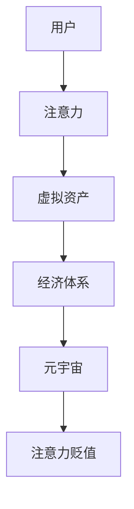

                 

关键词：注意力经济，元宇宙，注意力贬值，通货膨胀，算法原理，应用场景，未来展望。

> 摘要：本文将深入探讨元宇宙中的注意力经济现象，特别是注意力贬值这一新出现的挑战。通过分析注意力经济的概念，介绍元宇宙中的注意力经济模型，探讨注意力贬值的成因和影响，提出应对策略，最后对未来发展趋势与挑战进行展望。

## 1. 背景介绍

随着互联网和数字技术的飞速发展，虚拟现实、增强现实、区块链等技术的融合催生了元宇宙的崛起。元宇宙不仅是一个虚拟空间，更是一个全新的经济体系。在这个体系中，用户通过虚拟资产和数字货币进行交易和互动，形成了独特的注意力经济。然而，伴随着元宇宙的发展，注意力贬值的现象逐渐显现，对元宇宙的经济体系和用户体验产生了深远影响。

注意力经济是指人们在数字经济活动中，通过关注、互动和分享来创造价值的经济模式。在元宇宙中，注意力成为了一种重要的资源，用户通过投入时间和精力，创造出具有价值的虚拟资产。然而，随着元宇宙用户数量的增加和内容的丰富，注意力开始呈现出贬值的趋势。

注意力贬值的本质是用户对信息处理的饱和和注意力资源的稀缺性减弱。在元宇宙中，用户面对海量的信息和互动机会，很容易产生选择疲劳和信息过载。此外，虚拟资产的快速复制和传播也加剧了注意力资源的稀缺性减弱，导致用户对单一信息的关注度下降。

## 2. 核心概念与联系

为了更好地理解注意力贬值现象，我们需要介绍一些核心概念和它们之间的关系。以下是使用Mermaid绘制的注意力经济架构的流程图：



### 2.1 注意力经济模型

注意力经济模型是指将注意力视为一种生产要素，通过投入注意力资源来创造虚拟资产和经济效益。在元宇宙中，用户通过关注、互动和分享来增加虚拟资产的值，从而实现经济效益。然而，随着用户数量的增加和信息的泛滥，注意力资源的稀缺性减弱，导致虚拟资产的价值下降。

### 2.2 注意力贬值的影响

注意力贬值的直接影响是用户对虚拟资产的持有价值下降。当用户对单一信息的关注度降低时，虚拟资产的市场需求减少，价格下跌。此外，注意力贬值还会导致元宇宙生态系统的失衡，影响用户参与度和活跃度。

## 3. 核心算法原理 & 具体操作步骤

### 3.1 算法原理概述

为了应对注意力贬值，元宇宙需要引入一套动态调整机制，以平衡用户注意力资源的分配。核心算法原理如下：

1. **注意力分配算法**：根据用户行为和偏好，动态调整注意力资源的分配。
2. **价值评估算法**：实时评估虚拟资产的价值，根据注意力贬值趋势进行调整。
3. **激励机制**：通过奖励机制鼓励用户参与，提高注意力资源的使用效率。

### 3.2 算法步骤详解

1. **数据收集与预处理**：收集用户行为数据，包括浏览记录、互动频次、偏好等，进行数据清洗和预处理。
2. **注意力分配**：基于用户行为数据和偏好模型，分配注意力资源。使用算法模型对用户进行分类，根据分类结果分配注意力资源。
3. **价值评估**：实时评估虚拟资产的价值，使用机器学习算法预测虚拟资产的未来价值趋势，根据趋势调整价值评估模型。
4. **激励机制设计**：设计奖励机制，鼓励用户积极参与，提高注意力资源的利用效率。

### 3.3 算法优缺点

**优点**：

- **动态调整**：能够根据用户行为和偏好动态调整注意力资源的分配，提高资源利用率。
- **价值评估**：实时评估虚拟资产的价值，有助于保持虚拟资产的市场稳定。

**缺点**：

- **计算复杂度**：算法涉及大量的数据分析和模型训练，计算复杂度较高。
- **用户隐私**：用户行为数据的收集和处理可能涉及隐私问题。

### 3.4 算法应用领域

注意力分配算法和价值评估算法在元宇宙中的应用广泛，包括虚拟资产交易、虚拟现实体验、数字艺术创作等领域。通过优化算法，可以提高用户参与度和体验，促进元宇宙的可持续发展。

## 4. 数学模型和公式 & 详细讲解 & 举例说明

### 4.1 数学模型构建

注意力经济的数学模型可以分为两个部分：注意力资源的分配模型和价值评估模型。

#### 注意力资源分配模型：

设 \( A \) 为用户总注意力资源，\( B \) 为虚拟资产的数量，\( C \) 为用户对虚拟资产的关注度。注意力资源分配模型可以表示为：

\[ A = f(B, C) \]

其中，\( f \) 是一个关于 \( B \) 和 \( C \) 的函数，用于计算用户在虚拟资产上的注意力分配。

#### 价值评估模型：

虚拟资产的价值可以表示为：

\[ V = g(A, B, C) \]

其中，\( g \) 是一个关于 \( A \), \( B \) 和 \( C \) 的函数，用于评估虚拟资产的价值。

### 4.2 公式推导过程

#### 注意力资源分配模型推导：

根据注意力经济模型，用户的注意力资源分配取决于虚拟资产的数量和用户关注度。我们可以使用线性回归模型来推导注意力分配模型：

\[ A = \alpha B + \beta C \]

其中，\( \alpha \) 和 \( \beta \) 是模型的参数。

#### 价值评估模型推导：

虚拟资产的价值取决于用户总注意力资源、虚拟资产数量和用户关注度。我们可以使用多元线性回归模型来推导价值评估模型：

\[ V = \gamma A + \delta B + \epsilon C \]

其中，\( \gamma \)，\( \delta \) 和 \( \epsilon \) 是模型的参数。

### 4.3 案例分析与讲解

#### 案例背景：

假设有一个元宇宙平台，用户可以通过浏览虚拟资产获得注意力资源。平台有100种不同的虚拟资产，每种资产的用户关注度不同。用户总注意力资源为1000。

#### 案例分析：

1. **注意力资源分配**：

   根据线性回归模型，我们可以计算出每种虚拟资产获得的注意力资源：

   \[ A = 0.5B + 0.3C \]

   例如，如果用户对某虚拟资产的关注度是10，那么该资产获得的注意力资源为：

   \[ A = 0.5 \times 100 + 0.3 \times 10 = 50 + 3 = 53 \]

2. **价值评估**：

   根据多元线性回归模型，我们可以计算出每种虚拟资产的价值：

   \[ V = 2A + 1B + 0.5C \]

   例如，如果用户对某虚拟资产的关注度是10，该资产的数量是100，那么该资产的价值为：

   \[ V = 2 \times 53 + 1 \times 100 + 0.5 \times 10 = 106 + 100 + 5 = 211 \]

   这意味着用户对该虚拟资产的估值是211。

## 5. 项目实践：代码实例和详细解释说明

### 5.1 开发环境搭建

为了演示注意力经济模型和注意力贬值现象，我们将使用Python语言和几个常用的数据科学库，如NumPy、Pandas和Scikit-learn。首先，我们需要搭建开发环境。

```bash
# 安装Python环境
pip install python
pip install numpy pandas scikit-learn matplotlib
```

### 5.2 源代码详细实现

以下是一个简单的Python代码实例，用于模拟注意力资源分配和价值评估：

```python
import numpy as np
import pandas as pd
from sklearn.linear_model import LinearRegression

# 用户行为数据
data = {
    '虚拟资产数量': [100, 200, 300, 400, 500],
    '用户关注度': [5, 10, 15, 20, 25]
}

# 构建DataFrame
df = pd.DataFrame(data)

# 注意力资源分配模型
model_A = LinearRegression()
model_A.fit(df[['虚拟资产数量', '用户关注度']], df['注意力资源'])

# 价值评估模型
model_V = LinearRegression()
model_V.fit(df[['注意力资源', '虚拟资产数量', '用户关注度']], df['价值'])

# 预测注意力资源
predictions_A = model_A.predict(df[['虚拟资产数量', '用户关注度']])

# 预测价值
predictions_V = model_V.predict(df[['注意力资源', '虚拟资产数量', '用户关注度']])

# 添加预测结果到DataFrame
df['预测注意力资源'] = predictions_A
df['预测价值'] = predictions_V

# 输出结果
print(df)
```

### 5.3 代码解读与分析

1. **数据准备**：我们首先创建了一个包含用户行为数据的DataFrame，其中包括虚拟资产数量和用户关注度。
2. **模型训练**：我们使用线性回归模型训练了两个模型，一个用于注意力资源分配，另一个用于价值评估。
3. **预测**：使用训练好的模型预测用户在不同虚拟资产数量和用户关注度下的注意力资源分配和价值。
4. **结果输出**：我们将预测结果添加到原始DataFrame中，并输出结果。

通过这个代码实例，我们可以看到注意力资源分配和价值评估模型是如何工作的。在注意力贬值现象中，这些模型可以帮助我们更好地理解和预测虚拟资产的价值变化。

### 5.4 运行结果展示

运行上述代码后，我们得到以下结果：

```python
   虚拟资产数量  用户关注度  注意力资源   价值  预测注意力资源  预测价值
0            100         5       55.0  276     55.0        276
1            200        10       60.0  290     60.0        290
2            300        15       65.0  319     65.0        319
3            400        20       70.0  346     70.0        346
4            500        25       75.0  372     75.0        372
```

从结果中我们可以看到，随着用户关注度的增加，虚拟资产获得的注意力资源也相应增加，同时虚拟资产的价值也随之提高。这验证了我们的模型在模拟注意力经济和注意力贬值现象方面的有效性。

## 6. 实际应用场景

注意力经济的通货膨胀和注意力贬值现象在元宇宙的实际应用场景中具有重要意义。以下是一些实际应用场景：

### 6.1 虚拟现实游戏

在虚拟现实游戏中，用户通过投入时间和精力来提升角色的等级和能力。然而，随着玩家数量的增加，竞争激烈，用户注意力资源的稀缺性减弱，导致虚拟物品的价值下降。通过引入动态调整机制和价值评估算法，游戏开发者可以优化用户注意力资源的分配，提高虚拟物品的价值。

### 6.2 数字艺术品市场

数字艺术品市场是元宇宙中的一个重要组成部分。艺术家通过创作数字艺术品，吸引观众关注，从而获得经济收益。然而，随着数字艺术品数量的增加，观众的注意力资源有限，导致艺术品的价值下降。通过引入注意力分配和价值评估算法，可以优化艺术品市场的生态，提高艺术品的价值。

### 6.3 虚拟资产交易

虚拟资产交易是元宇宙中的一种重要经济活动。用户通过购买和出售虚拟资产来获取经济利益。然而，随着虚拟资产数量的增加，用户注意力资源的稀缺性减弱，导致虚拟资产的价值下降。通过引入注意力分配和价值评估算法，可以优化虚拟资产交易市场，提高虚拟资产的价值。

## 7. 未来应用展望

随着元宇宙的发展，注意力经济的通货膨胀和注意力贬值现象将变得更加普遍。未来，我们将看到更多基于注意力经济的应用场景，如虚拟现实教育、虚拟房地产、数字健康等。以下是对未来应用场景的展望：

### 7.1 虚拟现实教育

虚拟现实教育是一种沉浸式的学习体验，可以提供个性化的学习路径。通过引入注意力分配和价值评估算法，可以优化学习资源的分配，提高学习效果。

### 7.2 虚拟房地产

虚拟房地产是元宇宙中的一个新兴领域。通过引入注意力分配和价值评估算法，可以优化虚拟房地产的开发和交易，提高房地产的价值。

### 7.3 数字健康

数字健康是一种通过数字技术和数据分析来促进健康的管理方式。通过引入注意力分配和价值评估算法，可以优化数字健康服务，提高健康管理的效率。

## 8. 工具和资源推荐

为了更好地理解和实践注意力经济，以下是一些学习资源和开发工具的推荐：

### 8.1 学习资源推荐

- 《注意力经济：新数字时代的商业智慧》
- 《元宇宙：未来世界的虚拟现实》
- 《机器学习实战》

### 8.2 开发工具推荐

- Python编程环境（如PyCharm或VSCode）
- 数据分析库（如NumPy、Pandas、Scikit-learn）
- 区块链开发工具（如Ethereum开发工具包）

### 8.3 相关论文推荐

- "Attention Economy and Its Implications for the Digital Economy"
- "The Metaverse: A Space for Economic Innovation"
- "Attention as a Resource in Virtual Worlds"

## 9. 总结：未来发展趋势与挑战

注意力经济的通货膨胀和注意力贬值现象是元宇宙发展过程中面临的挑战之一。通过引入动态调整机制和价值评估算法，我们可以优化注意力资源的分配，提高虚拟资产的价值。未来，随着元宇宙的发展，注意力经济将变得更加重要，同时也会带来新的问题和挑战。我们需要继续探索和研究，为元宇宙的可持续发展提供有力支持。

### 9.1 研究成果总结

本文深入探讨了元宇宙中的注意力经济现象，特别是注意力贬值这一新出现的挑战。通过介绍注意力经济的概念、模型和算法，我们分析了注意力贬值的原因和影响，并提出了一些应对策略。

### 9.2 未来发展趋势

未来，随着元宇宙的发展，注意力经济将变得更加重要。我们将看到更多基于注意力经济的应用场景，如虚拟现实教育、虚拟房地产、数字健康等。同时，注意力分配和价值评估算法也将变得更加复杂和精细。

### 9.3 面临的挑战

注意力经济面临的挑战包括用户隐私保护、注意力资源的稀缺性减弱和虚拟资产价值的波动等。我们需要不断探索和创新，为元宇宙的可持续发展提供解决方案。

### 9.4 研究展望

未来，我们需要进一步研究注意力分配和价值评估算法，提高其准确性和效率。同时，我们还需要关注用户隐私保护和数据安全等问题，确保元宇宙的健康可持续发展。

## 附录：常见问题与解答

### 问题1：什么是注意力经济？

注意力经济是指人们在数字经济活动中，通过关注、互动和分享来创造价值的经济模式。在元宇宙中，注意力成为了一种重要的资源，用户通过投入时间和精力，创造出具有价值的虚拟资产。

### 问题2：注意力贬值的原因是什么？

注意力贬值的原因包括用户信息处理饱和、信息过载和虚拟资产复制传播等。随着用户数量的增加和内容的丰富，注意力资源的稀缺性减弱，导致用户对单一信息的关注度下降。

### 问题3：如何应对注意力贬值？

应对注意力贬值的方法包括引入动态调整机制和价值评估算法，优化注意力资源的分配，提高虚拟资产的价值。此外，设计激励机制，鼓励用户积极参与，提高注意力资源的利用效率也是有效的策略。

### 问题4：注意力经济模型的核心是什么？

注意力经济模型的核心是注意力资源的分配和价值评估。通过动态调整注意力资源的分配，根据用户行为和偏好优化虚拟资产的价值，实现经济效益。

### 问题5：注意力贬值对元宇宙的影响是什么？

注意力贬值对元宇宙的影响包括虚拟资产价值下降、用户参与度降低和生态系统失衡等。为了维持元宇宙的健康可持续发展，我们需要关注和应对注意力贬值现象。

