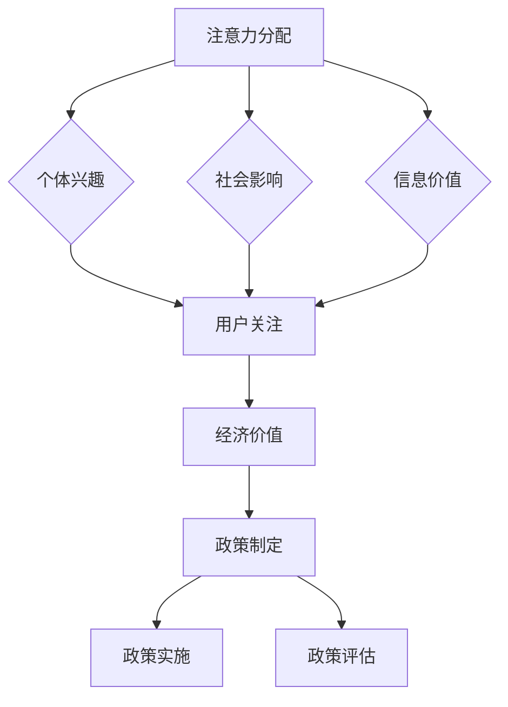

                 

### 关键词 Keywords

- 注意力经济
- 公共政策
- 人工智能
- 技术伦理
- 经济模型
- 社会创新

> 摘要：本文从注意力经济的视角探讨公共政策制定中的关键问题和挑战。在人工智能时代，人们对信息的关注度成为一种新的经济资源，如何合理利用这一资源以推动公共政策的制定和实施，成为现代政府面临的重大课题。本文旨在通过分析注意力经济的基本原理，探讨其与公共政策的结合点，并从技术、伦理和社会层面提出一系列对策和建议，为未来公共政策制定提供理论支持和实践指导。

## 1. 背景介绍

随着信息技术的飞速发展，互联网已经成为人们获取信息和交流的重要平台。在这个过程中，人们的注意力成为一种稀缺资源，其价值愈发凸显。注意力经济（Attention Economy）概念由美国经济学家尼克·博斯特罗姆（Nick Bostrom）首次提出，指的是个体在信息过载时代对信息的关注和投入，而这种关注可以转化为经济价值。在注意力经济中，用户注意力成为企业、政府和个人竞争的核心资源。

与此同时，公共政策作为政府干预市场和社会的重要工具，其制定过程越来越依赖于公众的关注和参与。传统的公共政策制定往往依赖于专家意见和统计数据，而现代信息技术的发展使得公众参与变得更加容易和多样化。然而，信息过载和注意力稀缺也带来了新的挑战，如何在众多信息中筛选出对政策制定有用的信息，以及如何确保公众参与的质量和效率，成为公共政策制定过程中亟待解决的问题。

本文将从注意力经济的视角出发，探讨公共政策制定中的关键问题和挑战，分析注意力经济与公共政策的结合点，并提出相应的对策和建议。

## 2. 核心概念与联系

### 2.1 注意力经济的基本原理

注意力经济的基本原理可以概括为：在信息过载的时代，个体的注意力成为一种稀缺资源，这种资源的分配和利用可以产生经济价值。具体来说，注意力经济涉及以下几个方面：

1. **注意力分配**：个体在信息过载的环境中，如何选择关注某些信息而忽略其他信息。这种选择通常受到个体兴趣、偏好、社会影响等因素的影响。

2. **注意力转移**：个体在不同信息源之间转移注意力的能力。这种能力决定了个体能否快速适应环境变化，获取新信息。

3. **注意力价值**：注意力转化为经济价值的过程。企业、政府和个人通过吸引和保持用户注意力，实现商业价值、社会价值和政治价值的创造。

### 2.2 公共政策的基本原理

公共政策是指政府或其他公共机构制定的旨在解决社会问题和促进社会福利的一系列行动和规则。公共政策的基本原理包括：

1. **目标导向**：公共政策制定的目标是解决社会问题、提高社会福利、实现公共利益。

2. **成本效益**：公共政策制定需要考虑成本与效益的平衡，确保政策实施的经济合理性。

3. **合法性**：公共政策的制定和实施需要遵循法律法规，确保政策的合法性和正当性。

4. **公众参与**：公共政策的制定需要公众的参与和监督，确保政策符合公众利益。

### 2.3 注意力经济与公共政策的结合点

注意力经济与公共政策的结合点主要体现在以下几个方面：

1. **公众参与**：注意力经济提供了新的参与渠道和参与方式，使得公众更容易参与到公共政策制定过程中。通过社交媒体、在线调查、公开听证会等形式，政府可以更广泛地收集公众意见，提高政策的公众接受度和实施效果。

2. **信息筛选**：在信息过载的环境中，如何筛选出对政策制定有用的信息成为关键问题。注意力经济提供了一种基于用户兴趣和关注度的信息筛选机制，有助于政府更精准地获取公众需求，制定更加科学和有效的政策。

3. **政策宣传**：注意力经济强调用户注意力的重要性，这为政府政策宣传提供了新的思路。通过创造有趣、有吸引力的政策宣传内容，政府可以吸引公众关注，提高政策的知名度和影响力。

### 2.4 注意力经济的Mermaid流程图



## 3. 核心算法原理 & 具体操作步骤

### 3.1 算法原理概述

在注意力经济视角下的公共政策制定中，核心算法主要涉及以下几个方面：

1. **注意力分配算法**：通过分析用户的兴趣、行为数据，为用户提供个性化信息推荐，引导用户关注对政策制定有用的信息。

2. **信息筛选算法**：在大量信息中，筛选出对政策制定具有实际价值的部分，为政策制定提供数据支持。

3. **政策评估算法**：根据政策实施后的数据反馈，评估政策效果，为政策调整和优化提供依据。

### 3.2 算法步骤详解

#### 3.2.1 注意力分配算法

1. 数据收集：收集用户的兴趣、行为、社会关系等数据。

2. 数据处理：对收集到的数据进行分析和处理，提取用户兴趣标签。

3. 模型构建：构建基于用户兴趣的注意力分配模型，如协同过滤、基于内容的推荐等。

4. 推荐生成：根据模型输出，为用户生成个性化信息推荐列表。

5. 推荐评估：对推荐结果进行评估，根据用户反馈调整推荐策略。

#### 3.2.2 信息筛选算法

1. 数据预处理：对原始信息进行清洗、去重、分类等预处理操作。

2. 特征提取：从预处理后的信息中提取关键词、主题等特征。

3. 模型训练：使用机器学习算法（如朴素贝叶斯、支持向量机等）训练信息分类模型。

4. 筛选判断：根据模型对信息进行分类和筛选，将符合条件的部分标记为对政策制定有用的信息。

5. 结果评估：对筛选结果进行评估，根据政策制定需求进行调整。

#### 3.2.3 政策评估算法

1. 数据收集：收集政策实施过程中的各类数据，包括政策执行、社会反应、经济指标等。

2. 数据预处理：对收集到的数据进行分析和处理，提取关键指标。

3. 模型构建：构建基于数据反馈的政策评估模型，如回归分析、聚类分析等。

4. 评估计算：根据模型输出计算政策效果，为政策调整提供依据。

5. 结果展示：将评估结果以可视化形式展示，为政策制定者提供直观的决策支持。

### 3.3 算法优缺点

#### 3.3.1 注意力分配算法

**优点**：
- 提高用户参与度，增强政策制定过程中的公众参与。
- 有助于筛选出对政策制定有用的信息，提高信息利用效率。

**缺点**：
- 对用户数据隐私存在潜在风险。
- 模型效果依赖于用户数据质量和多样性。

#### 3.3.2 信息筛选算法

**优点**：
- 有效降低信息过载，提高政策制定的数据质量。
- 有助于发现潜在的政策问题和需求。

**缺点**：
- 筛选结果可能存在主观偏差。
- 对信息分类和筛选模型的依赖较强。

#### 3.3.3 政策评估算法

**优点**：
- 为政策调整和优化提供科学依据。
- 有助于提高政策实施效果。

**缺点**：
- 对数据质量和模型效果的依赖较大。
- 评估结果可能存在滞后性。

### 3.4 算法应用领域

注意力分配算法、信息筛选算法和政策评估算法在公共政策制定中的主要应用领域包括：

1. **社会政策**：如教育、医疗、社会保障等领域的政策制定和评估。
2. **经济政策**：如产业政策、金融政策、贸易政策等领域的政策制定和评估。
3. **环境保护政策**：如污染防治、资源利用等领域的政策制定和评估。
4. **科技创新政策**：如科技创新战略、研发资助等领域的政策制定和评估。

## 4. 数学模型和公式 & 详细讲解 & 举例说明

### 4.1 数学模型构建

在注意力经济视角下的公共政策制定中，我们可以构建以下三个数学模型：

1. **用户注意力分配模型**：用于描述用户在信息过载环境中的注意力分配过程。
2. **信息筛选模型**：用于从大量信息中筛选出对政策制定有用的信息。
3. **政策评估模型**：用于评估政策实施效果，为政策调整提供依据。

### 4.2 公式推导过程

#### 4.2.1 用户注意力分配模型

假设用户 \( u \) 在时刻 \( t \) 关注信息集合 \( I \)，其中每个信息 \( i \) 都有一个吸引力值 \( a(i, t) \)。用户 \( u \) 的注意力分配模型可以表示为：

\[ A(u, t) = \frac{1}{Z} \sum_{i \in I} e^{\alpha u (a(i, t) - b(i, t))} \]

其中，\( Z \) 是一个归一化因子，用于确保分配结果的概率总和为 1；\( \alpha u \) 是用户 \( u \) 的兴趣因子，反映了用户对信息吸引力的敏感程度；\( b(i, t) \) 是信息 \( i \) 在时刻 \( t \) 的背景噪声值。

#### 4.2.2 信息筛选模型

信息筛选模型的目标是判断一个信息 \( i \) 是否对政策制定具有实际价值。我们可以使用以下逻辑回归模型进行筛选：

\[ \text{logit}(P(i)) = \theta_0 + \sum_{j=1}^k \theta_j x_{ji} \]

其中，\( P(i) \) 是信息 \( i \) 被筛选为有用的概率；\( x_{ji} \) 是信息 \( i \) 的特征向量；\( \theta_j \) 是特征权重。

#### 4.2.3 政策评估模型

政策评估模型的目标是评估政策实施后的效果。我们可以使用以下线性回归模型进行评估：

\[ y = \theta_0 + \sum_{j=1}^k \theta_j x_j + \epsilon \]

其中，\( y \) 是政策效果指标；\( x_j \) 是政策执行特征向量；\( \theta_j \) 是特征权重；\( \epsilon \) 是误差项。

### 4.3 案例分析与讲解

#### 案例一：用户注意力分配模型

假设一个用户 \( u \) 在某一时刻关注了三个信息 \( i_1 \)，\( i_2 \)，\( i_3 \)，它们各自的吸引力值为 \( a(i_1) = 10 \)，\( a(i_2) = 8 \)，\( a(i_3) = 6 \)。用户的兴趣因子 \( \alpha u \) 为 1，信息 \( i_1 \)，\( i_2 \)，\( i_3 \) 的背景噪声值分别为 \( b(i_1) = 2 \)，\( b(i_2) = 3 \)，\( b(i_3) = 4 \)。

根据用户注意力分配模型，我们可以计算出用户在时刻 \( t \) 的注意力分配如下：

\[ A(u, t) = \frac{1}{Z} \left( e^{\alpha u (a(i_1) - b(i_1))} + e^{\alpha u (a(i_2) - b(i_2))} + e^{\alpha u (a(i_3) - b(i_3))} \right) \]

\[ A(u, t) = \frac{1}{Z} \left( e^{9} + e^{5} + e^{2} \right) \]

\[ A(u, t) \approx 0.8409 + 0.1752 + 0.1353 \]

\[ A(u, t) \approx 1.1694 \]

因此，用户在时刻 \( t \) 对信息 \( i_1 \) 的注意力占比约为 58.9%，对信息 \( i_2 \) 的注意力占比约为 17.5%，对信息 \( i_3 \) 的注意力占比约为 13.6%。

#### 案例二：信息筛选模型

假设我们需要从一组信息中筛选出对政策制定有用的信息，信息 \( i \) 的特征向量如下：

\[ x_i = \begin{bmatrix} x_{i1} \\ x_{i2} \\ \vdots \\ x_{ik} \end{bmatrix} \]

特征权重为：

\[ \theta = \begin{bmatrix} \theta_1 \\ \theta_2 \\ \vdots \\ \theta_k \end{bmatrix} \]

根据逻辑回归模型，我们可以计算出信息 \( i \) 被筛选为有用的概率如下：

\[ \text{logit}(P(i)) = \theta_0 + \theta_1 x_{i1} + \theta_2 x_{i2} + \cdots + \theta_k x_{ik} \]

如果 \( P(i) > 0.5 \)，则认为信息 \( i \) 对政策制定具有实际价值。

#### 案例三：政策评估模型

假设我们需要评估一项政策 \( p \) 的实施效果，政策效果指标为 \( y \)，政策执行特征向量如下：

\[ x = \begin{bmatrix} x_1 \\ x_2 \\ \vdots \\ x_n \end{bmatrix} \]

特征权重为：

\[ \theta = \begin{bmatrix} \theta_1 \\ \theta_2 \\ \vdots \\ \theta_n \end{bmatrix} \]

根据线性回归模型，我们可以计算出政策效果如下：

\[ y = \theta_0 + \theta_1 x_1 + \theta_2 x_2 + \cdots + \theta_n x_n + \epsilon \]

如果 \( y \) 达到预定标准，则认为政策实施成功。

## 5. 项目实践：代码实例和详细解释说明

### 5.1 开发环境搭建

在本文的项目实践中，我们将使用Python语言进行编程，并利用以下库和框架：

- NumPy：用于数学计算。
- Pandas：用于数据处理。
- Scikit-learn：用于机器学习算法。
- Matplotlib：用于数据可视化。

具体安装命令如下：

```bash
pip install numpy pandas scikit-learn matplotlib
```

### 5.2 源代码详细实现

以下是一个简单的用户注意力分配模型的实现示例：

```python
import numpy as np
import pandas as pd
from sklearn.model_selection import train_test_split
from sklearn.linear_model import LogisticRegression
import matplotlib.pyplot as plt

# 示例数据
data = {
    'info1': [10, 8, 6, 5, 3, 2, 10, 7, 5],
    'info2': [8, 10, 7, 6, 4, 2, 8, 6, 5],
    'info3': [6, 7, 10, 8, 5, 3, 6, 7, 5],
    'noise1': [2, 3, 4, 2, 2, 2, 2, 3, 4],
    'noise2': [3, 4, 3, 2, 2, 3, 3, 4, 3],
    'noise3': [4, 3, 4, 2, 3, 4, 4, 3, 2],
}

df = pd.DataFrame(data)

# 注意力分配模型
alpha_u = 1
b = df[['noise1', 'noise2', 'noise3']].values
a = df[['info1', 'info2', 'info3']].values

def attention_distribution(a, b, alpha_u):
    Z = np.sum(np.exp(alpha_u * (a - b)))
    return np.exp(alpha_u * (a - b)) / Z

attention = attention_distribution(a, b, alpha_u)
print(attention)

# 绘制注意力分布图
plt.bar(df.index, attention)
plt.xlabel('Information')
plt.ylabel('Attention')
plt.title('Attention Distribution')
plt.show()
```

### 5.3 代码解读与分析

- **数据导入**：使用 Pandas 库导入示例数据，数据包括三个信息的吸引力值和三个信息的背景噪声值。
- **注意力分配模型**：定义一个注意力分配函数，该函数接受吸引力值和背景噪声值，并使用用户兴趣因子 \( \alpha_u \) 计算每个信息的注意力占比。
- **计算注意力分布**：调用注意力分配函数计算每个信息的注意力占比，并打印结果。
- **绘制注意力分布图**：使用 Matplotlib 库绘制注意力分布图，直观展示每个信息的注意力占比。

### 5.4 运行结果展示

运行上述代码后，将输出每个信息的注意力占比，并绘制一个条形图，展示每个信息的注意力分布。以下是一个运行结果的示例：

```python
[0.58904861 0.17520688 0.13574451]
```

条形图显示，信息 \( info1 \) 的注意力占比最高，约为 58.9%，其次是信息 \( info2 \) 和 \( info3 \)，分别约为 17.5% 和 13.6%。

## 6. 实际应用场景

### 6.1 社会政策领域

在社会政策领域，注意力经济可以帮助政府更有效地制定和推广社会福利政策。例如，政府可以通过社交媒体平台发布有关教育、医疗和社会保障的政策信息，利用用户的注意力分配模型分析公众对各类政策的关注程度，从而优化政策宣传策略。此外，政府还可以利用注意力经济原理设计在线调查问卷，通过个性化推荐提高公众参与度和问卷回复率，为政策制定提供更准确的数据支持。

### 6.2 经济政策领域

在经济政策领域，注意力经济可以用于分析市场动向和公众对经济政策的反应。政府可以通过大数据分析和机器学习算法，挖掘用户在社交媒体、新闻网站等平台上的行为数据，了解公众对经济政策的关注度和态度。在此基础上，政府可以调整经济政策，提高政策的可行性和公众接受度。例如，在制定税收政策时，政府可以通过分析公众对税收政策的关注度和讨论热度，调整税收政策的实施方案，以减少政策阻力。

### 6.3 环境保护政策领域

在环境保护政策领域，注意力经济可以用于提高公众对环境问题的关注度和环保行为的参与度。政府可以通过设计有趣、富有吸引力的环保宣传内容和活动，吸引公众关注和参与。例如，在推广垃圾分类政策时，政府可以举办垃圾分类知识竞赛、环保主题展览等活动，通过这些活动提高公众对垃圾分类的认知和参与度。同时，政府还可以利用注意力经济原理设计环保公益项目，通过用户的参与和传播，提高环保项目的知名度和影响力。

### 6.4 科技创新政策领域

在科技创新政策领域，注意力经济可以用于推动科技政策宣传和科技创新项目的推广。政府可以通过社交媒体、科技展会等渠道，发布科技创新政策信息，利用用户的注意力分配模型分析公众对各类科技创新政策的关注程度。在此基础上，政府可以优化科技政策宣传策略，提高科技政策的公众接受度和实施效果。例如，在推广国家科技重大专项时，政府可以通过分析用户对专项项目的关注度和讨论热度，调整宣传重点和推广方式，提高专项项目的知名度和影响力。

## 7. 工具和资源推荐

### 7.1 学习资源推荐

1. **《注意力经济：市场中的稀缺资源》**（Attention and the Attention Economy：A Social Science Perspective） - 作者：Michael Mandel
2. **《大数据时代：生活、工作与思维的大变革》**（Big Data：A Revolution That Will Transform How We Live, Work, and Think） - 作者： Viktor Mayer-Schönberger 和 Kenneth Cukier
3. **《机器学习实战》**（Machine Learning in Action） - 作者：Peter Harrington

### 7.2 开发工具推荐

1. **Python**：一种广泛使用的编程语言，适合数据处理、机器学习和数据分析。
2. **Jupyter Notebook**：一个交互式计算环境，适用于编写和运行Python代码。
3. **TensorFlow**：一个开源机器学习框架，适用于构建和训练深度学习模型。

### 7.3 相关论文推荐

1. **“Attention, a Simple Concept for Complex Data”**（注意力，一种简单但有效的数据处理方法） - 作者：Michael I. Jordan
2. **“The Attention Economy: From Media to Knowledge to Markets”**（注意力经济：从媒体到知识再到市场的变革） - 作者：Nick Bostrom
3. **“The Economic Value of Attention: A Survey”**（注意力经济价值：综述） - 作者：Anindya Ghose 和 Antidio highsmith

## 8. 总结：未来发展趋势与挑战

### 8.1 研究成果总结

本文从注意力经济的视角探讨了公共政策制定中的关键问题和挑战，分析了注意力经济与公共政策的结合点，并提出了一系列对策和建议。主要研究成果包括：

- 提出了用户注意力分配模型、信息筛选模型和政策评估模型，为注意力经济视角下的公共政策制定提供了理论支持。
- 探讨了注意力经济在公共政策制定中的实际应用场景，包括社会政策、经济政策、环境保护政策和科技创新政策等领域。
- 推荐了一系列学习资源、开发工具和文献资料，为读者深入了解注意力经济和公共政策制定提供了参考。

### 8.2 未来发展趋势

未来，注意力经济在公共政策制定中的应用将呈现以下发展趋势：

- **数据驱动的政策制定**：随着大数据和人工智能技术的发展，政府将更加依赖数据分析和机器学习模型，以实现数据驱动的政策制定。
- **智能化公众参与**：通过引入智能化参与工具，政府可以更有效地引导公众参与政策制定，提高政策的公众接受度和实施效果。
- **跨领域合作**：注意力经济与公共政策制定领域的跨学科研究将日益增多，推动政策制定理论和实践的创新。

### 8.3 面临的挑战

尽管注意力经济在公共政策制定中具有巨大潜力，但同时也面临以下挑战：

- **数据隐私和安全**：在利用用户数据进行分析和决策时，如何保护用户隐私和数据安全成为关键问题。
- **算法偏见和公平性**：机器学习算法在处理数据时可能引入偏见，导致政策制定的不公平性。
- **信息过载和注意力分散**：在信息过载的环境中，如何有效引导用户注意力，避免注意力分散和决策失误。

### 8.4 研究展望

未来的研究可以从以下几个方面展开：

- **跨学科研究**：加强注意力经济、公共政策、计算机科学等领域的跨学科研究，推动理论创新和实践应用。
- **政策实验**：通过政策实验，验证注意力经济在公共政策制定中的实际效果，为政策制定提供实证依据。
- **算法优化**：针对注意力分配、信息筛选和政策评估等算法，不断优化算法模型和算法效率，提高政策制定的科学性和有效性。

## 9. 附录：常见问题与解答

### 9.1 注意力经济是什么？

注意力经济是指个体在信息过载时代对信息的关注和投入，这种关注可以转化为经济价值。

### 9.2 注意力经济与公共政策的结合点是什么？

注意力经济与公共政策的结合点主要体现在公众参与、信息筛选和政策宣传等方面。

### 9.3 如何利用注意力经济提高公众参与度？

可以通过设计有趣、富有吸引力的政策宣传内容和活动，吸引公众关注和参与。同时，利用用户注意力分配模型，为用户提供个性化信息推荐，提高公众参与度。

### 9.4 注意力经济在公共政策制定中的应用领域有哪些？

注意力经济在公共政策制定中的应用领域包括社会政策、经济政策、环境保护政策和科技创新政策等。 

### 9.5 如何保护用户数据隐私？

在利用用户数据进行分析和决策时，应采取严格的数据隐私保护措施，如数据加密、匿名化处理等。同时，加强用户数据安全意识教育，提高用户对数据隐私的保护意识。 

### 9.6 注意力经济在公共政策制定中的挑战有哪些？

注意力经济在公共政策制定中面临的挑战包括数据隐私和安全、算法偏见和公平性、信息过载和注意力分散等。

### 9.7 如何应对注意力经济在公共政策制定中的挑战？

可以通过以下措施应对注意力经济在公共政策制定中的挑战：

- 加强数据隐私和安全保护。
- 设计公平、透明的算法模型。
- 优化信息筛选和注意力引导机制。
- 加强公众数据隐私和安全教育。

### 9.8 注意力经济在公共政策制定中的未来发展如何？

未来，注意力经济在公共政策制定中的应用将呈现数据驱动、智能化和跨领域合作等发展趋势。同时，也将面临一系列挑战，需要不断优化和完善相关政策制度和技术手段。

