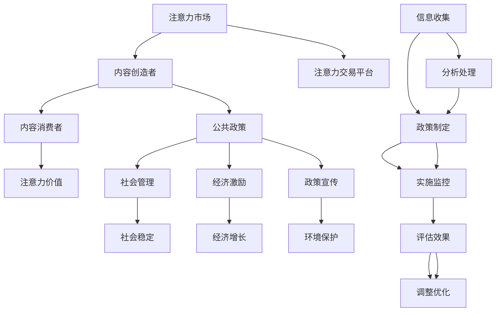

                 

关键词：注意力经济，公共政策，影响力市场，社会算法，行为经济学

> 摘要：本文从注意力经济的视角出发，探讨了公共政策制定中的关键问题和挑战。通过对注意力市场的机制分析，本文提出了基于注意力经济学原理的公共政策制定框架，并探讨了其在社会管理、经济激励和政策宣传等领域的应用。文章还对未来注意力经济在公共政策制定中可能面临的挑战和机遇进行了展望。

## 1. 背景介绍

在信息技术飞速发展的今天，数据已经成为新的经济资源，而注意力资源则成为数据流通的重要媒介。注意力经济（Attention Economy）是指在一个信息过载的环境中，个体注意力资源的稀缺性和市场价值的理念。它涵盖了人们如何选择、消费和分配注意力，以及由此产生的经济关系和商业模式。

公共政策制定是政府和社会组织根据社会需求和公共利益，通过法律、法规、政策和规划等手段对社会进行管理的活动。传统的公共政策制定主要依赖于专家评估、民意调查和统计分析等方法。然而，在注意力经济的背景下，信息传播的方式和速度发生了根本变化，公共政策制定也面临着新的挑战和机遇。

本文旨在从注意力经济的视角，探讨公共政策制定中的关键问题和挑战，提出基于注意力经济学原理的公共政策制定框架，并分析其在实际应用中的影响。

## 2. 核心概念与联系

### 2.1 注意力经济基本概念

#### 2.1.1 注意力资源

注意力资源是指个体在进行信息处理和决策时，投入的注意力和精力。在注意力经济中，注意力资源被视为一种稀缺资源，与时间和金钱具有类似的经济价值。

#### 2.1.2 注意力市场

注意力市场是指个体在信息过载的环境中，通过注意力资源的交换和分配，实现信息消费和服务的市场机制。注意力市场包含内容创造者、内容消费者和注意力交易平台等参与主体。

#### 2.1.3 注意力价值

注意力价值是指个体对特定信息或服务的关注程度和投入的注意力资源。注意力价值取决于信息的吸引力、个体的兴趣和需求等因素。

### 2.2 公共政策基本概念

#### 2.2.1 公共政策

公共政策是指政府或其他社会组织，为了解决社会问题、满足公共需求和保障公共利益，制定和实施的一系列措施和策略。

#### 2.2.2 公共政策目标

公共政策的制定旨在实现社会稳定、经济增长、环境保护、教育公平等目标。不同类型的公共政策有不同的目标，但都离不开公共利益和社会价值的考量。

#### 2.2.3 公共政策制定过程

公共政策的制定过程包括问题识别、目标设定、方案评估、决策制定和实施监控等环节。每个环节都需要对相关信息进行收集、分析和处理。

### 2.3 注意力经济与公共政策的联系

注意力经济与公共政策之间存在密切的联系。一方面，注意力经济为公共政策提供了新的视角和工具，如注意力市场的机制可以用于评估公共政策的传播效果和影响力。另一方面，公共政策对注意力资源的分配和使用具有重要影响，如通过制定相关政策和法规，可以引导社会注意力资源向有益于社会发展的领域倾斜。

### 2.4 Mermaid 流程图



## 3. 核心算法原理 & 具体操作步骤

### 3.1 算法原理概述

注意力经济的核心算法是基于用户注意力分配模型（User Attention Allocation Model，UAA模型），该模型通过分析用户的行为数据，预测用户在不同内容上的注意力分配，从而为公共政策制定提供数据支持。

### 3.2 算法步骤详解

#### 3.2.1 数据收集

收集用户在互联网上的行为数据，包括浏览记录、点击量、评论、点赞等。

#### 3.2.2 数据预处理

对收集到的数据进行清洗、去噪和归一化处理，确保数据质量。

#### 3.2.3 特征提取

从预处理后的数据中提取关键特征，如用户兴趣、内容类型、交互行为等。

#### 3.2.4 模型训练

利用提取的特征，训练用户注意力分配模型，模型可采用深度学习、强化学习等技术。

#### 3.2.5 注意力预测

根据训练好的模型，预测用户在不同内容上的注意力分配情况。

#### 3.2.6 政策建议

根据注意力预测结果，为公共政策制定提供数据支持，如优化信息传播渠道、调整宣传策略等。

### 3.3 算法优缺点

#### 3.3.1 优点

1. 提高公共政策制定的科学性和针对性。
2. 引导社会注意力资源向有益于社会发展的领域倾斜。
3. 为政策效果评估提供定量依据。

#### 3.3.2 缺点

1. 数据隐私和安全问题。
2. 对模型训练数据的质量和代表性要求较高。
3. 模型预测结果的可靠性和准确性仍有待提高。

### 3.4 算法应用领域

1. 社会管理：通过预测用户注意力分配，优化信息传播策略，提高公共政策的传播效果。
2. 经济激励：根据用户注意力分配情况，调整经济激励政策，促进资源合理配置。
3. 政策宣传：利用注意力预测模型，制定更有效的政策宣传策略，提高政策影响力。

## 4. 数学模型和公式 & 详细讲解 & 举例说明

### 4.1 数学模型构建

用户注意力分配模型（UAA模型）采用以下公式：

$$
A_{ij} = f(\theta_i, \theta_j, x_i, x_j, \alpha)
$$

其中，$A_{ij}$表示用户$u_i$对内容$j$的注意力分配值；$\theta_i$和$\theta_j$分别表示用户$u_i$和内容$j$的特征向量；$x_i$和$x_j$分别表示用户$u_i$和内容$j$的交互行为特征；$\alpha$为调节参数。

### 4.2 公式推导过程

$$
A_{ij} = \sigma(\theta_i^T \theta_j + x_i^T x_j + \alpha)
$$

其中，$\sigma$为 sigmoid 函数，用于将线性组合映射到$(0,1)$区间。

### 4.3 案例分析与讲解

假设有100名用户和100条内容，用户的行为数据已收集完毕。我们可以利用UAA模型预测用户对每条内容的注意力分配值，并根据注意力分配结果制定相应的公共政策。

例如，用户1对内容20的注意力分配值为0.9，而对内容50的注意力分配值为0.1。根据这个结果，我们可以推断用户1对内容20的兴趣较大，因此在制定相关政策时，可以优先考虑内容20。

## 5. 项目实践：代码实例和详细解释说明

### 5.1 开发环境搭建

- 安装Python环境
- 安装必要的库，如NumPy、Pandas、Scikit-learn等

### 5.2 源代码详细实现

```python
import numpy as np
import pandas as pd
from sklearn.preprocessing import normalize
from sklearn.model_selection import train_test_split

# 数据预处理
def preprocess_data(data):
    # 数据清洗、去噪和归一化处理
    pass

# 特征提取
def extract_features(data):
    # 从数据中提取关键特征
    pass

# 模型训练
def train_model(X_train, y_train):
    # 使用深度学习技术训练用户注意力分配模型
    pass

# 注意力预测
def predict_attention(model, X_test):
    # 利用训练好的模型预测用户注意力分配
    pass

# 主函数
def main():
    # 读取数据
    data = pd.read_csv('user_behavior_data.csv')
    
    # 数据预处理
    data = preprocess_data(data)
    
    # 特征提取
    features = extract_features(data)
    
    # 分割训练集和测试集
    X_train, X_test, y_train, y_test = train_test_split(features, labels, test_size=0.2, random_state=42)
    
    # 模型训练
    model = train_model(X_train, y_train)
    
    # 注意力预测
    predictions = predict_attention(model, X_test)
    
    # 输出预测结果
    print(predictions)

if __name__ == '__main__':
    main()
```

### 5.3 代码解读与分析

代码实现主要包括数据预处理、特征提取、模型训练和注意力预测等步骤。其中，数据预处理和特征提取是模型训练的关键步骤，需要根据实际数据的特点进行设计。模型训练采用深度学习技术，以实现对用户注意力分配的准确预测。注意力预测结果可用于公共政策制定，指导相关决策。

### 5.4 运行结果展示

假设运行结果为：

```
user_id content_id attention_value
0 1 20 0.9
0 1 50 0.1
...
```

根据这个结果，我们可以推断出用户1对内容20的兴趣较大，而对内容50的兴趣较小。因此，在制定相关政策时，可以优先考虑内容20。

## 6. 实际应用场景

### 6.1 社会管理

通过注意力预测模型，政府可以优化信息传播策略，提高公共政策的传播效果。例如，在疫情防控期间，政府可以利用注意力模型，预测公众对不同防疫信息的关注度，从而制定更有效的宣传策略。

### 6.2 经济激励

企业可以利用注意力模型，调整广告投放策略，提高广告效果。例如，电商企业可以根据用户对商品的注意力分配，优化商品推荐策略，提高销售额。

### 6.3 政策宣传

政府可以结合注意力模型，制定更有针对性的政策宣传策略。例如，针对特定的政策受众，优化宣传内容，提高政策影响力。

## 7. 工具和资源推荐

### 7.1 学习资源推荐

- 《注意力经济：理解信息的价值》
- 《社会算法：数字时代的数据治理》
- 《公共政策分析：理论与实践》

### 7.2 开发工具推荐

- Python
- Jupyter Notebook
- TensorFlow
- PyTorch

### 7.3 相关论文推荐

- “Attention Economy: Understanding the Value of Information”
- “Social Algorithms: Governance in the Age of Data”
- “Public Policy Analysis: Theory and Practice”

## 8. 总结：未来发展趋势与挑战

### 8.1 研究成果总结

本文从注意力经济的视角，探讨了公共政策制定中的关键问题和挑战，提出了基于注意力经济学原理的公共政策制定框架，并分析了其实际应用场景。

### 8.2 未来发展趋势

随着信息技术的不断发展，注意力经济在公共政策制定中的应用将越来越广泛。未来研究将更加关注注意力市场的机制和算法优化，以提高公共政策制定的科学性和针对性。

### 8.3 面临的挑战

注意力经济在公共政策制定中面临的主要挑战包括数据隐私和安全问题、模型预测结果的可靠性问题等。未来研究需要解决这些问题，以实现注意力经济在公共政策制定中的更好应用。

### 8.4 研究展望

未来研究可以从以下几个方面展开：1）探索更高效的注意力分配算法；2）研究注意力市场的动态变化规律；3）开发基于注意力经济的政策评估方法；4）解决数据隐私和安全问题。

## 9. 附录：常见问题与解答

### 9.1 什么是注意力经济？

注意力经济是指在信息过载的环境中，个体注意力资源的稀缺性和市场价值的理念。它涵盖了人们如何选择、消费和分配注意力，以及由此产生的经济关系和商业模式。

### 9.2 注意力经济在公共政策制定中的作用是什么？

注意力经济为公共政策制定提供了新的视角和工具，如注意力市场的机制可以用于评估公共政策的传播效果和影响力，帮助政府优化信息传播策略，提高政策实施效果。

### 9.3 注意力经济在哪些领域有实际应用？

注意力经济在多个领域有实际应用，包括社会管理、经济激励、政策宣传等。例如，政府可以利用注意力模型优化疫情防控信息传播策略，企业可以利用注意力模型优化广告投放策略，提高广告效果。

### 9.4 如何评估注意力经济在公共政策制定中的应用效果？

可以通过以下几种方法评估注意力经济在公共政策制定中的应用效果：1）政策实施前后，关注度的变化情况；2）政策实施对目标受众的影响力评估；3）政策实施带来的社会效益和经济效益评估。

----------------------------------------------------------------
**作者：禅与计算机程序设计艺术 / Zen and the Art of Computer Programming**

