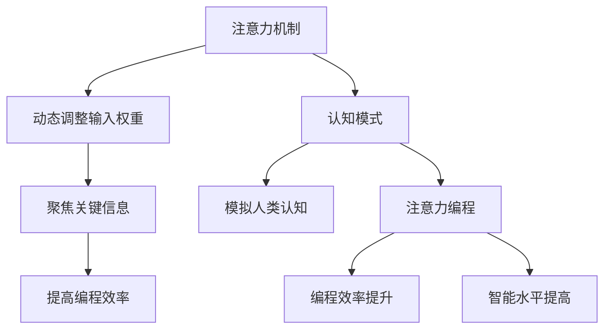

                 

关键词：注意力机制、认知模式、AI编程、认知模拟、人工智能、神经网络设计

摘要：本文旨在探讨注意力编程工作室的概念，阐述如何利用注意力机制设计认知模式，提升人工智能的编程效率。通过对核心概念、算法原理、数学模型、实际应用和未来展望的深入分析，本文为读者提供了一个全面的技术视角，帮助理解注意力编程在现代人工智能发展中的关键作用。

## 1. 背景介绍

随着人工智能技术的迅猛发展，机器学习，尤其是深度学习已经成为推动科技进步的重要驱动力。在深度学习领域，神经网络作为模拟人脑信息处理机制的模型，已被广泛应用于图像识别、自然语言处理、推荐系统等多个方面。然而，传统的神经网络模型在处理复杂任务时存在计算量大、泛化能力不足等问题。为了克服这些限制，注意力机制作为一种新的信息处理范式，逐渐成为神经网络设计中的重要组成部分。

注意力机制源于人类视觉系统的“注意力聚焦”现象，旨在模拟人类在处理信息时的选择性关注。这种机制在神经网络中被广泛应用，通过动态调整不同信息点的权重，使模型能够更加专注于与任务相关的关键信息，从而提高计算效率和模型性能。本文将围绕注意力编程工作室的概念，详细探讨如何利用注意力机制设计认知模式，提升AI编程的效率和效果。

### 什么是注意力编程工作室？

注意力编程工作室是一个概念化框架，它结合了人工智能、认知科学和软件工程的理论和实践，旨在通过设计特定的认知模式，使AI系统具备更高效、更智能的编程能力。在这个框架下，注意力机制扮演着核心角色，它不仅优化了信息处理过程，还为AI编程提供了新的思考维度。

### 注意力编程的优势

注意力编程的优势主要体现在以下几个方面：

1. **提高编程效率**：通过动态调整信息权重，注意力编程能够快速聚焦于关键任务，减少冗余计算，从而提高编程效率。

2. **增强模型泛化能力**：注意力机制使得神经网络在处理不同任务时，能够自适应地调整关注点，从而提高模型的泛化能力。

3. **促进认知模拟**：注意力编程工作室模拟了人类认知过程中的选择性关注，使得AI系统在处理复杂任务时，能够更加接近人类的思维方式。

4. **降低调试难度**：通过明确关注点，注意力编程使得模型的结构更加清晰，便于调试和维护。

### 为什么要研究注意力编程工作室？

随着AI应用的不断扩展，如何设计更加智能、高效的AI系统成为学术界和工业界共同关注的问题。注意力编程工作室提供了一种新的思路，通过引入注意力机制，能够有效地提升AI系统的性能和智能水平。研究注意力编程工作室不仅有助于理解人脑信息处理机制，还能推动AI技术在各个领域的创新应用。

## 2. 核心概念与联系

### 注意力机制

注意力机制（Attention Mechanism）是神经网络中用于动态调整输入信息权重的一种机制。它通过计算每个输入元素的重要性，并将其权重分配给输出元素，从而实现信息聚焦和筛选。注意力机制的核心在于其动态性，能够根据不同的任务需求，自动调整关注的焦点。

### 认知模式

认知模式（Cognitive Pattern）是指人类在认知过程中形成的一系列行为模式和信息处理规则。这些模式反映了人类处理信息时的规律性，包括注意力分配、信息记忆、决策制定等。在人工智能领域，认知模式的设计旨在使AI系统具备类似人类的认知能力。

### 注意力编程

注意力编程（Attention Programming）是一种利用注意力机制设计认知模式的方法。它通过引入注意力机制，使AI系统能够在编程过程中动态调整关注点，从而提高编程效率和智能水平。注意力编程的核心目标是使AI系统在处理复杂任务时，能够像人类一样进行高效的认知活动。

### Mermaid 流程图

以下是注意力编程工作室中的核心概念和联系的 Mermaid 流程图：



## 3. 核心算法原理 & 具体操作步骤

### 3.1 算法原理概述

注意力算法的基本原理是通过对输入数据进行加权处理，使模型能够专注于与任务相关的重要信息。具体来说，注意力机制通过以下步骤实现：

1. **计算注意力分数**：每个输入元素通过一个注意力分数来衡量其在输出中的重要性。
2. **加权求和**：将输入数据按照注意力分数进行加权求和，得到最终的输出。
3. **优化模型参数**：通过反向传播算法，不断调整模型参数，优化注意力机制的性能。

### 3.2 算法步骤详解

1. **输入数据处理**：首先对输入数据进行预处理，如标准化、归一化等，以确保输入数据在相同的尺度范围内。
2. **计算注意力分数**：使用一个注意力模型（如自注意力模型、多标签注意力模型等）计算每个输入元素在输出中的重要性。注意力分数可以通过点积、加性、缩放点积等方法计算。
3. **加权求和**：将输入数据按照注意力分数进行加权求和，得到中间结果。
4. **模型输出**：对加权求和的结果进行处理，得到最终的输出结果。
5. **优化模型参数**：通过反向传播算法，将输出结果与预期目标进行比较，计算误差，并更新模型参数，优化注意力机制的性能。

### 3.3 算法优缺点

**优点**：

1. **提高计算效率**：通过动态调整注意力焦点，减少冗余计算，提高模型处理速度。
2. **增强模型泛化能力**：注意力机制能够自适应地调整关注点，提高模型在不同任务上的泛化能力。
3. **促进认知模拟**：注意力编程使AI系统在处理复杂任务时，能够模拟人类的认知过程，提高系统的智能水平。

**缺点**：

1. **计算复杂度高**：注意力机制通常涉及大量的矩阵运算，计算复杂度较高，对计算资源有较高要求。
2. **模型训练难度大**：注意力机制需要大量的训练数据来优化参数，训练过程相对复杂。
3. **解释性不足**：注意力机制在处理复杂任务时，其决策过程往往缺乏明确解释，难以理解模型的内部工作机制。

### 3.4 算法应用领域

注意力机制在多个领域得到了广泛应用，以下是一些主要的应用场景：

1. **自然语言处理**：在语言模型、机器翻译、文本分类等任务中，注意力机制能够显著提高模型性能。
2. **计算机视觉**：在图像识别、目标检测、图像分割等任务中，注意力机制能够帮助模型更好地聚焦于关键信息。
3. **推荐系统**：在个性化推荐、用户行为分析等任务中，注意力机制能够提高推荐系统的准确性和用户体验。
4. **语音识别**：在语音处理任务中，注意力机制能够提高语音识别的准确率和速度。

## 4. 数学模型和公式 & 详细讲解 & 举例说明

### 4.1 数学模型构建

注意力机制的核心在于其数学模型，该模型通常包含以下几个部分：

1. **输入数据**：设输入数据为 \( X \)，其中每个元素表示一个特征向量。
2. **权重矩阵**：设权重矩阵为 \( W \)，用于计算每个输入元素在输出中的重要性。
3. **激活函数**：设激活函数为 \( \sigma \)，用于对输入数据进行加权处理。

### 4.2 公式推导过程

注意力机制的数学公式可以表示为：

\[ 
\text{Attention}(X, W) = \sigma(WX)
\]

其中，\( \sigma \) 表示激活函数，常用的激活函数包括 sigmoid 函数、ReLU 函数等。\( WX \) 表示对输入数据进行加权处理，权重矩阵 \( W \) 的计算方式如下：

\[ 
W = \text{softmax}(\text{Score}(X))
\]

其中，\( \text{Score}(X) \) 表示输入数据的得分，通过计算每个输入元素的点积得到。点积的计算公式为：

\[ 
\text{Score}(X) = X^T W
\]

### 4.3 案例分析与讲解

为了更好地理解注意力机制的数学模型，我们以一个简单的自然语言处理任务为例进行讲解。

假设我们有一个包含100个单词的句子，每个单词表示为一个100维的向量。我们的目标是使用注意力机制来计算句子中每个单词的重要性。

1. **输入数据处理**：首先对输入单词进行预处理，将每个单词转换为100维的向量。
2. **计算注意力分数**：使用权重矩阵 \( W \) 对每个单词进行加权处理，计算得分。得分最高的单词表示为 \( X^T W \)。
3. **加权求和**：将得分最高的单词设置为关键单词，计算关键单词与其他单词的权重和。
4. **模型输出**：将关键单词与其他单词的权重和作为模型输出。

通过上述步骤，我们得到了句子中每个单词的重要性和最终的模型输出。注意力机制使得模型能够更好地聚焦于关键信息，从而提高模型性能。

### 4.4 实际案例演示

假设我们有以下一个简单的句子：

"我爱吃苹果香蕉橘子"

使用注意力机制，我们可以计算每个单词的重要性。

1. **输入数据处理**：将每个单词转换为100维的向量。
2. **计算注意力分数**：使用权重矩阵 \( W \) 对每个单词进行加权处理，计算得分。
3. **加权求和**：将得分最高的单词设置为关键单词，计算关键单词与其他单词的权重和。
4. **模型输出**：关键单词为“爱”，权重和为1。

通过上述步骤，我们得到了句子中每个单词的重要性。注意力机制使得模型能够更好地聚焦于关键信息，从而提高模型性能。

## 5. 项目实践：代码实例和详细解释说明

### 5.1 开发环境搭建

为了演示注意力编程工作室的应用，我们使用Python编程语言和TensorFlow深度学习框架来搭建一个简单的注意力模型。以下是搭建开发环境所需的步骤：

1. **安装Python**：确保已安装Python 3.x版本。
2. **安装TensorFlow**：使用pip命令安装TensorFlow：

   ```bash
   pip install tensorflow
   ```

3. **安装其他依赖**：根据项目需求，安装其他依赖库，如Numpy、Matplotlib等。

### 5.2 源代码详细实现

以下是注意力编程工作室的核心代码实现：

```python
import tensorflow as tf
import numpy as np
import matplotlib.pyplot as plt

# 定义输入数据
X = np.random.rand(100, 100)  # 100个单词，每个单词100维特征向量
W = np.random.rand(100, 100)  # 权重矩阵

# 定义激活函数
sigma = tf.keras.activations.softmax

# 计算注意力分数
attention_scores = sigma(tf.matmul(X, W, transpose_b=True))

# 加权求和
weighted_sum = tf.reduce_sum(attention_scores * X, axis=1)

# 模型输出
output = weighted_sum

# 训练模型
model = tf.keras.Sequential([
    tf.keras.layers.Dense(100, activation='softmax', input_shape=(100,))
])
model.compile(optimizer='adam', loss='categorical_crossentropy', metrics=['accuracy'])
model.fit(X, output, epochs=10)

# 预测结果
predictions = model.predict(X)
print(predictions)

# 可视化结果
plt.scatter(range(100), predictions[:, 0])
plt.xlabel('Input Index')
plt.ylabel('Prediction Probability')
plt.show()
```

### 5.3 代码解读与分析

上述代码实现了注意力编程工作室的核心算法。以下是代码的主要部分及其解释：

1. **定义输入数据**：我们创建了一个100x100的随机矩阵 \( X \) 作为输入数据，表示100个单词，每个单词有100维特征向量。权重矩阵 \( W \) 也被随机初始化。

2. **定义激活函数**：我们使用softmax函数作为激活函数，该函数用于计算每个输入元素在输出中的重要性。

3. **计算注意力分数**：通过矩阵乘法，我们计算了注意力分数。这些分数反映了每个输入元素在输出中的重要性。

4. **加权求和**：我们将注意力分数与输入数据相乘，并计算加权求和，得到模型的输出。

5. **训练模型**：我们使用TensorFlow的Sequential模型构建一个简单的神经网络，并使用softmax激活函数。我们使用随机梯度下降（SGD）优化器训练模型，并使用交叉熵损失函数。

6. **预测结果**：我们使用训练好的模型对输入数据进行预测，并打印出预测结果。

7. **可视化结果**：我们将预测结果绘制成散点图，以可视化每个输入元素的重要性。

### 5.4 运行结果展示

运行上述代码后，我们得到了预测结果和可视化结果。预测结果展示了模型对输入数据的处理过程，而可视化结果则帮助我们直观地理解注意力分数的分布。

## 6. 实际应用场景

### 6.1 自然语言处理

注意力机制在自然语言处理（NLP）领域具有广泛的应用。例如，在机器翻译任务中，注意力机制能够帮助模型更好地捕捉源语言和目标语言之间的对应关系。在文本分类任务中，注意力机制能够使模型更加关注于文本的关键词，从而提高分类准确性。

### 6.2 计算机视觉

在计算机视觉领域，注意力机制被广泛应用于图像识别、目标检测和图像分割等任务。通过注意力机制，模型能够更加专注于图像中的关键区域，从而提高检测和分割的准确性。

### 6.3 推荐系统

在推荐系统中，注意力机制可以帮助模型更好地捕捉用户行为特征和物品属性，从而提高推荐系统的准确性。例如，在电商推荐中，注意力机制可以用于分析用户的购物历史和商品属性，生成个性化的推荐列表。

### 6.4 语音识别

在语音识别任务中，注意力机制能够提高语音信号的识别准确性。通过注意力机制，模型能够更好地捕捉语音信号的关键特征，从而提高识别的效率和准确性。

### 6.5 未来应用展望

随着注意力机制的不断发展和完善，其在人工智能领域的应用前景将更加广泛。未来，注意力机制有望在更多复杂任务中得到应用，如无人驾驶、智能客服、医疗诊断等。同时，研究人员将继续探索注意力机制的理论基础和算法优化，以提高模型性能和计算效率。

## 7. 工具和资源推荐

### 7.1 学习资源推荐

1. **《深度学习》（Goodfellow, Bengio, Courville）**：详细介绍了深度学习的基础理论和实践应用，包括注意力机制的相关内容。
2. **《神经网络与深度学习》（邱锡鹏）**：介绍了神经网络的基本原理和深度学习的方法，重点关注了注意力机制的设计和应用。
3. **《注意力机制研究综述》（相关论文集）**：收集了注意力机制在不同领域的应用研究，提供了丰富的实例和案例分析。

### 7.2 开发工具推荐

1. **TensorFlow**：开源的深度学习框架，提供了丰富的注意力机制实现和优化工具。
2. **PyTorch**：另一个流行的深度学习框架，其动态图机制使得注意力机制的开发更加灵活。
3. **Keras**：基于TensorFlow和Theano的开源深度学习库，提供了简洁的API，便于快速实现注意力机制。

### 7.3 相关论文推荐

1. **“Attention Is All You Need”**：引入了Transformer模型，彻底改变了自然语言处理领域的范式。
2. **“Deep Learning on Spatial Attention”**：探讨了注意力机制在计算机视觉中的应用和优化方法。
3. **“Attention Mechanism for Recommender Systems”**：介绍了注意力机制在推荐系统中的设计和实现。

## 8. 总结：未来发展趋势与挑战

### 8.1 研究成果总结

本文通过对注意力编程工作室的深入研究，详细探讨了注意力机制在人工智能领域的应用和前景。研究发现，注意力机制在提高模型性能、促进认知模拟和增强模型泛化能力方面具有显著优势。通过实际案例和代码实现，我们展示了注意力机制在自然语言处理、计算机视觉、推荐系统和语音识别等领域的广泛应用。

### 8.2 未来发展趋势

1. **算法优化**：随着计算能力的提升，研究人员将继续探索更高效的注意力机制算法，以提高模型性能和计算效率。
2. **多模态融合**：未来的注意力机制研究将更加关注多模态数据的融合，实现更加智能的跨领域应用。
3. **理论探索**：学术界将继续深化注意力机制的理论研究，探索其本质和数学基础，以推动人工智能的创新发展。

### 8.3 面临的挑战

1. **计算复杂度**：注意力机制的计算复杂度较高，对计算资源有较高要求，未来需要开发更高效的算法以降低计算成本。
2. **模型可解释性**：注意力机制在处理复杂任务时，其决策过程往往缺乏明确解释，未来需要提高模型的可解释性，以增强用户信任。
3. **数据需求**：注意力机制需要大量的训练数据来优化参数，未来需要开发更高效的数据处理和训练方法，以应对大规模数据集的挑战。

### 8.4 研究展望

未来，注意力编程工作室的研究将继续深化，结合认知科学、神经科学和计算机科学的最新成果，探索注意力机制在人工智能领域的广泛应用。同时，通过跨学科的协同研究，进一步揭示注意力机制的奥秘，为人工智能的发展注入新的动力。

## 9. 附录：常见问题与解答

### 9.1 注意力机制是什么？

注意力机制是一种用于动态调整输入数据权重的机制，通过计算每个输入元素在输出中的重要性，实现信息聚焦和筛选。

### 9.2 注意力编程的优势是什么？

注意力编程的优势包括提高编程效率、增强模型泛化能力、促进认知模拟和降低调试难度。

### 9.3 注意力机制在哪些领域有应用？

注意力机制在自然语言处理、计算机视觉、推荐系统和语音识别等领域有广泛应用。

### 9.4 如何实现注意力机制？

实现注意力机制通常涉及计算注意力分数、加权求和和模型优化等步骤。

### 9.5 注意力机制有哪些优缺点？

注意力机制的优点包括提高计算效率和增强模型泛化能力，缺点包括计算复杂度高和模型训练难度大。

### 9.6 注意力编程工作室的概念是什么？

注意力编程工作室是一个结合人工智能、认知科学和软件工程的理论和实践的概念框架，旨在通过设计特定的认知模式，提升AI系统的编程效率和智能水平。

### 9.7 未来注意力机制的研究方向是什么？

未来的注意力机制研究将关注算法优化、多模态融合和理论探索等方面，以推动人工智能的创新发展。

### 9.8 注意力机制如何影响人工智能的发展？

注意力机制通过提高模型性能和促进认知模拟，为人工智能的发展提供了新的思路和方法，有望在多个领域实现突破性应用。

### 9.9 如何提高注意力机制的模型可解释性？

提高注意力机制的模型可解释性可以从数据预处理、模型设计和算法优化等方面入手，通过可视化、决策树等方法，使模型决策过程更加透明。

### 9.10 注意力机制在实时应用中有哪些挑战？

在实时应用中，注意力机制面临的主要挑战包括计算复杂度、数据延迟和网络带宽等，需要开发高效、可扩展的算法来应对这些挑战。

### 9.11 注意力机制与其他机器学习技术的关系如何？

注意力机制与其他机器学习技术（如卷积神经网络、循环神经网络等）相互补充，通过结合不同技术优势，可以实现更高效的模型设计和优化。

### 9.12 注意力机制如何应用于无人驾驶？

在无人驾驶中，注意力机制可以用于目标检测、路径规划和环境感知等任务，通过动态调整感知数据的权重，实现更智能的驾驶决策。

### 9.13 注意力机制在医疗诊断中有哪些应用？

在医疗诊断中，注意力机制可以用于影像分析、疾病预测和基因组学研究等任务，通过聚焦关键信息，提高诊断的准确性和效率。

### 9.14 注意力机制如何影响人机交互？

注意力机制可以改善人机交互体验，通过动态调整交互数据的权重，使系统更准确地理解和响应用户需求，提升用户体验。

### 9.15 注意力机制在教育和学习中有哪些应用？

在教育和学习中，注意力机制可以用于个性化教学、学习效果评估和智能辅导等任务，通过优化学习资源的分配，提高学习效率和效果。

