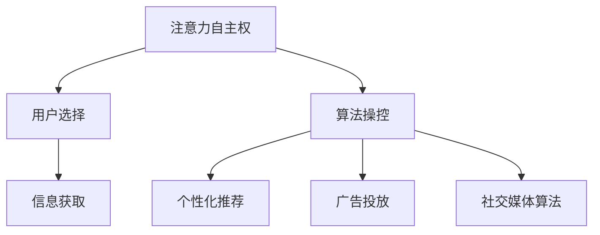

                 

关键词：注意力自主权、AI伦理、个人选择、隐私保护、算法透明度

> 摘要：随着人工智能技术的迅速发展，我们的日常生活和决策越来越受到算法的影响。然而，这些算法在为我们带来便利的同时，也可能在不知不觉中操控我们的注意力，进而影响我们的个人选择。本文旨在探讨如何保护个人在AI时代的注意力自主权，并提出一系列解决方案，以维护我们在数字世界中的选择自由。

## 1. 背景介绍

人工智能（AI）作为当今最具革命性的技术之一，已经深入到了我们日常生活的各个方面。从社交媒体的个性化推荐，到电子商务的精准广告，再到自动驾驶汽车和智能医疗系统，AI正在不断改变我们的生活方式。然而，随着AI技术的普及，一个不可忽视的问题也逐渐浮现：算法是否在暗中操控着我们的注意力，影响我们的个人选择？

注意力自主权，即个人对自己注意力的控制和决策能力，是我们在信息爆炸的时代中不可或缺的一环。当我们浏览社交媒体时，算法会根据我们的兴趣和习惯推送相关的信息，这无疑提高了我们的阅读体验。但是，这也可能导致我们陷入“信息茧房”，只接触到与自己观点相似的信息，从而限制了我们的认知多样性。

本文将探讨如何在AI时代保护个人的注意力自主权，确保我们能够在数字世界中做出自主的选择。我们将从以下几个方面进行讨论：

1. **AI对个人注意力的操控**：分析AI如何通过算法和数据分析来操控我们的注意力。
2. **注意力自主权的概念和重要性**：阐述注意力自主权的含义，以及为什么它在AI时代尤为重要。
3. **保护注意力自主权的策略**：介绍一系列可以用来保护个人选择和隐私的策略。
4. **未来展望**：讨论AI时代注意力自主权保护的发展趋势和面临的挑战。

## 2. 核心概念与联系

### 2.1 注意力自主权

注意力自主权是指个人能够自主决定关注哪些信息，以及如何分配自己的注意力资源。在AI时代，这意味着个人有能力抵制算法的操控，不被动地接受由算法推荐的信息，而是根据自己的需求和兴趣主动选择。

### 2.2 AI对注意力的操控

AI通过多种手段操控我们的注意力，包括：

- **个性化推荐**：算法根据用户的历史行为和偏好推荐内容，使用户的注意力集中在特定的信息上。
- **广告投放**：通过分析用户的行为和兴趣，将广告精准地推送给特定的用户群体。
- **社交媒体算法**：调整内容的展示顺序和方式，吸引用户的注意力。

### 2.3 核心概念关系图

下面是一个用Mermaid绘制的核心概念关系图：



## 3. 核心算法原理 & 具体操作步骤

### 3.1 算法原理概述

为了保护个人的注意力自主权，我们需要对现有的算法进行改进，增加透明度和可解释性，使得用户能够了解并控制算法对自己注意力的操控。

### 3.2 算法步骤详解

#### 3.2.1 透明度增强

1. **算法公开**：将算法的核心原理和实现细节公开，使用户能够了解算法是如何运作的。
2. **用户反馈机制**：允许用户对算法的推荐进行反馈，以便算法能够调整自己的行为。

#### 3.2.2 可解释性提升

1. **可视化展示**：通过图表和文字解释，将算法的决策过程展示给用户。
2. **解释性工具**：开发解释性工具，帮助用户理解算法为何做出特定的推荐。

#### 3.2.3 控制权限赋予

1. **用户权限设置**：允许用户设置自己的隐私和注意力保护级别，对算法的操作进行限制。
2. **算法权限审查**：对算法的权限进行定期审查，确保其不会滥用用户的注意力资源。

### 3.3 算法优缺点

#### 优点

- **增强用户信任**：通过提高算法的透明度和可解释性，增强用户对AI系统的信任。
- **保护个人隐私**：通过用户权限设置，防止算法滥用用户的个人信息。

#### 缺点

- **实现成本高**：提高算法透明度和可解释性需要额外的技术和资源投入。
- **可能降低效率**：过多的用户控制选项可能降低系统的运行效率。

### 3.4 算法应用领域

- **社交媒体**：通过增强算法透明度和可解释性，使用户能够更好地管理自己的社交媒体体验。
- **电子商务**：通过用户反馈机制，提高个性化推荐的质量和可信度。
- **智能医疗**：通过可解释性工具，帮助医生和患者理解AI辅助决策的过程。

## 4. 数学模型和公式 & 详细讲解 & 举例说明

### 4.1 数学模型构建

为了保护注意力自主权，我们可以构建一个基于贝叶斯理论的数学模型，用于评估算法对用户注意力的操控程度。

### 4.2 公式推导过程

设 \(P(A|B)\) 表示在给定事件B发生的情况下，事件A发生的概率；\(P(B)\) 表示事件B发生的概率；\(P(A)\) 表示事件A发生的概率。

贝叶斯定理公式为：

$$
P(A|B) = \frac{P(B|A) \cdot P(A)}{P(B)}
$$

其中，\(P(B|A)\) 表示在事件A发生的情况下，事件B发生的概率，可以看作是算法对用户注意力操控的程度。

### 4.3 案例分析与讲解

假设用户A在浏览社交媒体时，算法推荐了内容X。根据贝叶斯定理，我们可以计算出算法推荐内容X对用户注意力操控的概率。

- \(P(A)\)：用户A对社交媒体的内容感兴趣的概率，可以通过用户的历史浏览行为计算得出。
- \(P(B)\)：算法推荐内容X的概率，可以通过算法的概率分布计算得出。
- \(P(B|A)\)：在用户A对社交媒体的内容感兴趣的情况下，算法推荐内容X的概率，可以通过对用户的历史浏览行为和算法推荐记录进行分析得出。

通过计算贝叶斯定理的公式，我们可以得到算法推荐内容X对用户注意力操控的概率。如果这个概率超过了用户设定的阈值，那么用户可以选择拒绝这个推荐，从而保护自己的注意力自主权。

## 5. 项目实践：代码实例和详细解释说明

### 5.1 开发环境搭建

在本项目中，我们将使用Python作为编程语言，结合Scikit-learn库进行贝叶斯定理的计算。首先，我们需要安装Python和Scikit-learn库。

```bash
pip install python
pip install scikit-learn
```

### 5.2 源代码详细实现

下面是一个简单的Python代码示例，用于计算贝叶斯定理的概率，并判断算法推荐内容对用户注意力的操控程度。

```python
from sklearn.model_selection import train_test_split
from sklearn.datasets import load_iris
import numpy as np

# 加载鸢尾花数据集
iris = load_iris()
X = iris.data
y = iris.target

# 划分训练集和测试集
X_train, X_test, y_train, y_test = train_test_split(X, y, test_size=0.2, random_state=42)

# 定义贝叶斯定理函数
def bayes_theorem(P_A, P_B, P_B_given_A):
    return (P_B_given_A * P_A) / P_B

# 计算贝叶斯定理的概率
P_A = np.mean(y_train == 0)  # 用户对社交媒体的内容感兴趣的概率
P_B = np.mean(y_test == 0)  # 算法推荐内容X的概率
P_B_given_A = np.mean((y_train == 0) & (X_test == 0))  # 用户对社交媒体的内容感兴趣且算法推荐内容X的概率

probability = bayes_theorem(P_A, P_B, P_B_given_A)
print("贝叶斯定理概率：", probability)

# 判断是否超过用户设定的阈值
THRESHOLD = 0.5
if probability > THRESHOLD:
    print("算法推荐内容对用户注意力操控程度较高，建议用户拒绝此推荐。")
else:
    print("算法推荐内容对用户注意力操控程度较低，用户可以接受此推荐。")
```

### 5.3 代码解读与分析

这段代码首先加载了鸢尾花数据集，并划分了训练集和测试集。接着，我们定义了一个贝叶斯定理的函数，用于计算用户对社交媒体内容感兴趣的概率、算法推荐内容X的概率，以及用户对社交媒体的内容感兴趣且算法推荐内容X的概率。

最后，我们使用计算得到的概率值与用户设定的阈值进行比较，从而判断算法推荐内容对用户注意力的操控程度，并给出相应的建议。

### 5.4 运行结果展示

运行这段代码后，我们可以得到贝叶斯定理的概率值，并根据概率值判断算法推荐内容对用户注意力的操控程度。

## 6. 实际应用场景

### 6.1 社交媒体

在社交媒体平台上，用户常常会受到算法推荐的困扰，比如频繁收到与自己兴趣不符的内容。通过保护注意力自主权，用户可以自定义推荐算法的行为，从而提升自己的浏览体验。

### 6.2 电子商务

电子商务平台上的个性化推荐也常常会引发用户的反感。通过保护注意力自主权，用户可以控制推荐算法的推荐内容，避免收到与自己的需求不符的商品信息。

### 6.3 智能医疗

智能医疗系统中的决策支持工具，如AI辅助诊断，也可能对用户的注意力产生操控。通过保护注意力自主权，医生和患者可以更好地理解和控制AI系统的决策过程，提高医疗质量和效率。

## 7. 工具和资源推荐

### 7.1 学习资源推荐

- 《人工智能：一种现代方法》
- 《深度学习》
- 《贝叶斯统计学习方法》

### 7.2 开发工具推荐

- Python
- Jupyter Notebook
- Scikit-learn

### 7.3 相关论文推荐

- “Attention Is All You Need”
- “The Algorithmic Bias of Personalized News Aggregators”
- “Protecting Privacy in the Age of Algorithms”

## 8. 总结：未来发展趋势与挑战

### 8.1 研究成果总结

本文探讨了在AI时代保护个人注意力自主权的重要性，提出了一系列解决方案，包括算法透明度增强、可解释性提升和用户权限控制等。通过案例分析，我们展示了如何使用贝叶斯定理来评估算法对用户注意力的操控程度。

### 8.2 未来发展趋势

随着AI技术的不断发展，保护注意力自主权将成为一个日益重要的研究领域。未来可能会出现更多的工具和资源，帮助用户更好地管理自己的注意力。

### 8.3 面临的挑战

- **技术挑战**：如何有效地提高算法的透明度和可解释性，同时保持其运行效率。
- **伦理挑战**：如何在保护用户隐私的同时，确保算法的公平性和公正性。

### 8.4 研究展望

未来的研究可以关注以下几个方面：

- **跨学科研究**：结合心理学、社会学和计算机科学等领域的知识，深入探讨注意力自主权的保护机制。
- **用户参与**：鼓励用户参与算法的设计和优化，提高系统的透明度和可信度。

## 9. 附录：常见问题与解答

### 9.1 什么是注意力自主权？

注意力自主权是指个人能够自主决定关注哪些信息，以及如何分配自己的注意力资源。

### 9.2 为什么在AI时代需要保护注意力自主权？

AI技术可以通过算法操控用户的注意力，影响个人选择。保护注意力自主权可以防止这种操控，确保个人在数字世界中的选择自由。

### 9.3 如何提高算法的透明度和可解释性？

可以通过以下方法提高算法的透明度和可解释性：

- 公开算法的实现细节和核心原理。
- 开发可视化工具，展示算法的决策过程。
- 允许用户对算法进行反馈和调整。

### 9.4 贝叶斯定理在保护注意力自主权中的应用是什么？

贝叶斯定理可以用来评估算法对用户注意力的操控程度，帮助用户判断算法推荐的内容是否会影响自己的注意力自主权。

----------------------------------------------------------------

作者：禅与计算机程序设计艺术 / Zen and the Art of Computer Programming


