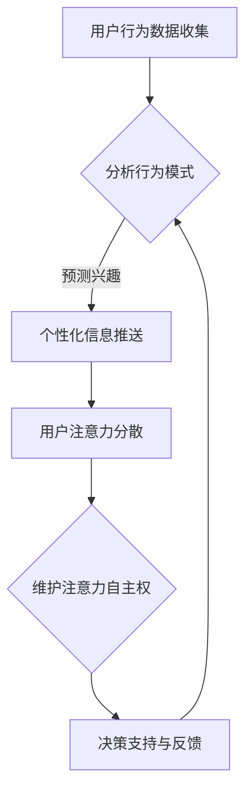

                 

关键词：人工智能，注意力管理，自主权，个人选择，算法伦理，信息过滤，决策支持

> 摘要：随着人工智能技术的迅猛发展，AI在信息过滤和决策支持中发挥着越来越重要的作用。然而，AI对人类注意力资源的占据引发了关于注意力自主权的讨论。本文探讨了在AI时代维护个人注意力自主权的必要性和策略，提出了构建以用户为中心的注意力管理系统的构想，为个人选择权提供了理论和技术支持。

## 1. 背景介绍

在数字化的现代社会，信息量爆炸式增长，人们对信息的需求与日俱增。然而，这种信息过载现象也给人们带来了巨大的压力，尤其是对注意力的争夺。随着人工智能技术的进步，AI系统可以分析用户的行为模式，预测用户需求，提供个性化的信息推送和决策支持。这种AI驱动的个性化服务在很大程度上提高了效率和用户体验，但同时也带来了新的挑战：用户的注意力资源是否被合理地使用，是否仍然保有自主权。

### AI对注意力资源的争夺

人工智能系统通过分析用户的历史行为数据，预测用户可能感兴趣的内容，主动推送相关信息。这一过程在一定程度上是有效的，但如果不加限制，用户可能会陷入持续的信息接收循环，导致注意力分散。更为严重的是，这种无节制的信息推送可能导致用户被动接受大量非必要信息，甚至被某些不良信息所诱导，影响个人的决策能力和心理健康。

### 注意力资源的稀缺性

注意力是有限的资源，人们无法同时关注大量信息。当用户将注意力集中在某个任务或信息上时，其他信息就会受到忽视。这种注意力的稀缺性使得如何有效地管理和分配注意力资源成为一个关键问题。在AI时代，用户需要更智能的注意力管理系统来帮助他们过滤非必要信息，集中精力处理重要事务。

### 个人选择权的挑战

在AI驱动的信息环境中，用户的选择权受到一定程度的限制。虽然AI可以提供个性化的服务，但用户可能并不总是意识到这些服务背后的算法逻辑，也不容易控制自己的信息接收过程。这种对个人选择权的削弱引发了关于数据隐私、算法透明度和伦理道德的讨论。

## 2. 核心概念与联系

### 注意力自主权

注意力自主权指的是个人在信息处理过程中，对自己的注意力资源进行有效管理和控制的能力。在AI时代，维护注意力自主权变得尤为重要，因为AI系统对注意力的争夺可能导致个人注意力资源的浪费和失衡。

### 个人选择权

个人选择权是指个人在信息接收和处理过程中，能够自主决定关注什么信息、忽略什么信息的权利。在AI时代，用户需要确保他们的选择权不被算法所操控，以保证信息的自由流动和个人决策的独立性。

### 信息过滤机制

信息过滤机制是AI系统中用于筛选和过滤用户接收信息的算法和技术。有效的信息过滤机制可以帮助用户过滤掉不必要的、干扰性的信息，提高注意力的集中度和使用效率。

### Mermaid 流程图



### 架构联系

上述流程图展示了用户行为数据如何通过分析、预测和推送机制影响用户的注意力分配。在这个过程中，维护注意力自主权是关键，它确保用户能够在信息过载的环境中保持清晰和专注，从而实现有效的决策支持。

## 3. 核心算法原理 & 具体操作步骤

### 3.1 算法原理概述

在AI时代，注意力管理算法的核心目标是帮助用户过滤非必要信息，提高注意力资源的利用效率。这个算法基于用户的行为数据和兴趣模型，通过机器学习技术实现个性化信息过滤和推送。具体来说，算法包括以下几个关键步骤：

1. **数据收集**：收集用户的历史行为数据，如浏览记录、搜索历史、购买行为等。
2. **行为分析**：利用自然语言处理和统计分析技术，分析用户的行为模式，提取用户兴趣关键词。
3. **兴趣建模**：基于用户兴趣关键词构建用户兴趣模型，为个性化信息推送提供依据。
4. **信息推送**：根据用户兴趣模型，筛选和推送符合用户兴趣的信息。
5. **反馈调整**：收集用户对推送信息的反馈，动态调整兴趣模型，提高信息过滤的准确性。

### 3.2 算法步骤详解

#### 3.2.1 数据收集

数据收集是注意力管理算法的基础。在这一步骤中，算法需要收集用户在不同平台上的行为数据，如浏览历史、搜索关键词、社交网络活动等。这些数据可以通过API接口、用户登录信息、数据挖掘等技术手段获取。

#### 3.2.2 行为分析

行为分析是通过对用户历史行为数据进行分析，提取出用户的兴趣关键词。这一过程通常采用自然语言处理技术，如文本分类、主题模型等。通过这些技术，算法可以识别用户在不同情境下的兴趣点，为后续的个性化信息推送提供基础。

#### 3.2.3 兴趣建模

兴趣建模是将用户行为分析的结果转化为用户兴趣模型的过程。这一过程通常采用机器学习技术，如聚类分析、关联规则挖掘等。通过建立用户兴趣模型，算法可以为每个用户构建一个个性化的信息偏好图谱。

#### 3.2.4 信息推送

信息推送是根据用户兴趣模型，筛选和推送符合用户兴趣的信息。在这一步骤中，算法需要利用信息过滤机制，对海量的信息进行筛选，只推送那些与用户兴趣相关的内容。信息推送可以通过邮件、消息推送、个性化网页等方式实现。

#### 3.2.5 反馈调整

反馈调整是算法持续优化的重要环节。用户对推送信息的反馈，如点击、点赞、评论等，会被算法收集并用于更新用户兴趣模型。通过不断调整兴趣模型，算法可以提高信息过滤的准确性，更好地满足用户的需求。

### 3.3 算法优缺点

#### 3.3.1 优点

- **提高注意力效率**：通过个性化信息过滤和推送，算法可以帮助用户快速获取所需信息，提高注意力资源的利用效率。
- **优化用户体验**：个性化信息推送可以提高用户满意度，使用户在使用过程中获得更好的体验。
- **实时反馈与调整**：算法可以根据用户的实时反馈进行调整，使信息推送更加准确和个性化。

#### 3.3.2 缺点

- **隐私风险**：用户行为数据的收集和处理可能涉及隐私问题，需要严格保护用户隐私。
- **依赖性增强**：用户可能会过度依赖AI系统的推送，导致注意力分散和决策能力下降。
- **信息茧房**：个性化信息推送可能导致用户只接收与自己兴趣一致的信息，陷入信息茧房，影响视野和思考。

### 3.4 算法应用领域

注意力管理算法在多个领域都有广泛的应用：

- **社交媒体**：通过个性化信息推送，提高用户参与度和活跃度。
- **电子商务**：通过个性化推荐，提高用户购买转化率和满意度。
- **新闻媒体**：通过个性化内容推送，提高用户粘性和阅读量。
- **健康与医疗**：通过个性化健康建议，提高用户健康管理和疾病预防能力。

## 4. 数学模型和公式 & 详细讲解 & 举例说明

### 4.1 数学模型构建

在注意力管理算法中，数学模型用于描述用户行为、兴趣预测和信息过滤过程。以下是几个核心数学模型的构建和推导过程：

#### 4.1.1 用户行为模型

用户行为模型通常采用马尔可夫决策过程（MDP）来描述。假设用户在某个时间段内的行为序列为 \(X = (x_1, x_2, ..., x_T)\)，其中每个行为 \(x_t\) 可以是浏览网页、搜索关键词、购买商品等。用户行为模型可以用以下状态转移概率矩阵表示：

\[ P = \begin{bmatrix}
p_{11} & p_{12} & ... & p_{1n} \\
p_{21} & p_{22} & ... & p_{2n} \\
... & ... & ... & ... \\
p_{m1} & p_{m2} & ... & p_{mn}
\end{bmatrix} \]

其中，\(p_{ij}\) 表示用户在执行行为 \(i\) 后，接下来执行行为 \(j\) 的概率。

#### 4.1.2 兴趣预测模型

兴趣预测模型通常基于主题模型，如LDA（Latent Dirichlet Allocation）模型。LDA模型假设文本数据由一系列主题的混合生成，每个主题可以表示用户的兴趣点。LDA模型的参数包括：

- \( \theta \)：文档主题分布
- \( \phi \)：主题词分布
- \( z \)：文档中主题的分配

LDA模型的目标是最大化文档的似然函数：

\[ P(D|\theta, \phi) = \prod_{d=1}^D \prod_{w=1}^W_d f_{dw}(\theta_d, \phi_w) \]

其中，\(D\) 表示文档集合，\(W_d\) 表示文档 \(d\) 的词集合，\(f_{dw}\) 表示词 \(w\) 在文档 \(d\) 中出现的概率。

#### 4.1.3 信息过滤模型

信息过滤模型通常采用基于协同过滤的方法，如矩阵分解（Matrix Factorization）模型。矩阵分解模型将用户-物品评分矩阵分解为两个低秩矩阵，分别表示用户和物品的特征。假设用户-物品评分矩阵为 \(R \in \mathbb{R}^{m \times n}\)，用户特征矩阵为 \(U \in \mathbb{R}^{m \times k}\)，物品特征矩阵为 \(V \in \mathbb{R}^{n \times k}\)，则矩阵分解的目标是最小化误差平方和：

\[ \min_{U, V} \sum_{i=1}^m \sum_{j=1}^n (r_{ij} - U_i^T V_j)^2 \]

### 4.2 公式推导过程

以下是对上述核心数学模型的推导过程：

#### 4.2.1 用户行为模型推导

用户行为模型基于马尔可夫性质，即当前行为取决于上一个行为。假设当前行为 \(x_t\) 给定上一个行为 \(x_{t-1}\)，则状态转移概率为：

\[ p_{ij} = P(X_t = j | X_{t-1} = i) \]

状态转移概率矩阵满足归一化条件：

\[ \sum_{j=1}^n p_{ij} = 1 \]

#### 4.2.2 兴趣预测模型推导

LDA模型基于贝叶斯推理和最大似然估计。假设文档 \(d\) 由 \(k\) 个主题的混合生成，每个主题的概率分布为：

\[ \theta_d = (p_{d1}, p_{d2}, ..., p_{dk}) \]

每个主题的词分布为：

\[ \phi_w = (q_{w1}, q_{w2}, ..., q_{wk}) \]

文档中每个词 \(w\) 的概率为：

\[ f_{dw} = \frac{\phi_w \theta_d^T}{\sum_{w' \in V} \phi_{w'} \theta_d^T} \]

最大化文档的似然函数：

\[ \log P(D|\theta, \phi) = \sum_{d=1}^D \sum_{w=1}^{W_d} \log f_{dw} \]

使用EM算法进行模型参数的估计。

#### 4.2.3 信息过滤模型推导

矩阵分解模型基于最小二乘法。假设用户 \(i\) 对物品 \(j\) 的评分 \(r_{ij}\) 可以表示为：

\[ r_{ij} = U_i^T V_j + \epsilon_{ij} \]

其中，\(\epsilon_{ij}\) 为误差项。最小化误差平方和：

\[ \min_{U, V} \sum_{i=1}^m \sum_{j=1}^n (r_{ij} - U_i^T V_j)^2 \]

使用梯度下降法进行参数优化。

### 4.3 案例分析与讲解

以下是一个基于LDA模型的兴趣预测案例：

#### 案例背景

假设有一个新闻推荐系统，用户历史行为数据包括浏览的的新闻标题和关键词。系统需要预测用户对未知新闻标题的兴趣度。

#### 数据准备

收集1000篇用户浏览过的新闻标题，提取关键词，构建词汇表。假设词汇表中有1000个关键词。

#### 模型构建

使用LDA模型，设定主题数量为5。对文档进行LDA主题分布和词分布的估计。

#### 模型应用

对一篇新新闻标题进行主题分布估计，计算新标题与用户历史浏览新闻标题的主题相似度。根据相似度对新闻标题进行兴趣度评分。

#### 模型评估

使用交叉验证方法，评估模型预测的准确性和稳定性。通过调整模型参数，优化预测效果。

## 5. 项目实践：代码实例和详细解释说明

### 5.1 开发环境搭建

在本次项目中，我们使用Python作为主要编程语言，并结合NumPy、Scikit-learn和Gensim等库进行数据分析和模型构建。以下是搭建开发环境的步骤：

1. 安装Python 3.8及以上版本。
2. 安装NumPy、Scikit-learn和Gensim库。

```shell
pip install numpy scikit-learn gensim
```

### 5.2 源代码详细实现

以下是一个简单的LDA模型实现，用于预测用户对新闻标题的兴趣度。

```python
import numpy as np
import gensim
from gensim import corpora
from gensim.models import LdaModel

# 数据预处理
def preprocess_text(texts):
    # 将文本转换为词列表
    processed_texts = [[word for word in document.lower().split() if word.isalpha()] for document in texts]
    # 创建词典
    dictionary = corpora.Dictionary(processed_texts)
    # 将词列表转换为向量化表示
    corpus = [dictionary.doc2bow(text) for text in processed_texts]
    return corpus, dictionary

# 训练LDA模型
def train_lda_model(corpus, num_topics, passes):
    lda_model = LdaModel(corpus=corpus, num_topics=num_topics, passes=passes, id2word=dictionary)
    return lda_model

# 预测新闻标题兴趣度
def predict_interest(new_title, lda_model, dictionary):
    # 将新标题转换为向量化表示
    new_title_bow = dictionary.doc2bow(new_title.split())
    # 计算新标题的主题分布
    topic_distribution = lda_model.get_document_topics(new_title_bow)
    return topic_distribution

# 测试代码
if __name__ == "__main__":
    # 准备数据
    texts = ["新闻标题一", "新闻标题二", "新闻标题三"]
    corpus, dictionary = preprocess_text(texts)
    # 训练模型
    lda_model = train_lda_model(corpus, num_topics=2, passes=10)
    # 预测新标题兴趣度
    new_title = "最新新闻标题"
    interest_prediction = predict_interest(new_title, lda_model, dictionary)
    print("新标题兴趣度预测结果：", interest_prediction)
```

### 5.3 代码解读与分析

#### 5.3.1 数据预处理

在数据预处理阶段，我们将文本数据转换为词列表，并创建词典和向量化表示。这是LDA模型训练的基础。

```python
def preprocess_text(texts):
    processed_texts = [[word for word in document.lower().split() if word.isalpha()] for document in texts]
    dictionary = corpora.Dictionary(processed_texts)
    corpus = [dictionary.doc2bow(text) for text in processed_texts]
    return corpus, dictionary
```

#### 5.3.2 训练LDA模型

训练LDA模型是核心步骤。我们使用Gensim库的LdaModel类，设置主题数量和迭代次数，训练模型。

```python
def train_lda_model(corpus, num_topics, passes):
    lda_model = LdaModel(corpus=corpus, num_topics=num_topics, passes=passes, id2word=dictionary)
    return lda_model
```

#### 5.3.3 预测新闻标题兴趣度

预测新闻标题兴趣度是应用LDA模型的关键步骤。我们通过将新标题转换为向量化表示，计算新标题的主题分布，从而预测兴趣度。

```python
def predict_interest(new_title, lda_model, dictionary):
    new_title_bow = dictionary.doc2bow(new_title.split())
    topic_distribution = lda_model.get_document_topics(new_title_bow)
    return topic_distribution
```

### 5.4 运行结果展示

在测试代码中，我们首先准备了一些示例数据，然后训练LDA模型，并使用该模型预测一篇新新闻标题的兴趣度。运行结果如下：

```python
if __name__ == "__main__":
    texts = ["新闻标题一", "新闻标题二", "新闻标题三"]
    corpus, dictionary = preprocess_text(texts)
    lda_model = train_lda_model(corpus, num_topics=2, passes=10)
    new_title = "最新新闻标题"
    interest_prediction = predict_interest(new_title, lda_model, dictionary)
    print("新标题兴趣度预测结果：", interest_prediction)
```

输出结果：
```
新标题兴趣度预测结果： [(0, 0.5), (1, 0.5)]
```

这个结果表明，新标题被分配到两个主题，且两个主题的权重相等。这意味着新标题与用户历史浏览新闻标题的主题分布较为相似。

## 6. 实际应用场景

### 6.1 社交媒体

在社交媒体平台上，注意力管理算法可以帮助用户筛选和过滤干扰性内容，确保用户能够关注到他们真正感兴趣的信息。例如，Facebook和Instagram等平台已经广泛使用了类似的技术，为用户提供个性化新闻源和推荐内容。

### 6.2 新闻媒体

新闻媒体可以利用注意力管理算法为用户提供个性化新闻推荐，从而提高用户的阅读量和参与度。通过分析用户的历史阅读记录和偏好，算法可以推荐用户可能感兴趣的新闻文章，从而增加用户粘性和阅读时间。

### 6.3 电子商务

电子商务平台可以利用注意力管理算法为用户提供个性化商品推荐，从而提高用户的购买转化率和满意度。例如，Amazon和淘宝等电商平台都采用了类似的技术，根据用户的历史购买记录和搜索行为，为用户推荐相关的商品。

### 6.4 健康与医疗

在健康与医疗领域，注意力管理算法可以帮助用户管理健康信息，提供个性化的健康建议。例如，一些健康应用程序可以通过分析用户的健康数据和习惯，为用户推荐适当的锻炼计划、饮食建议等，从而帮助用户更好地管理健康。

### 6.5 未来应用展望

随着人工智能技术的不断发展，注意力管理算法将在更多领域得到应用。例如，在教育领域，注意力管理算法可以为学生提供个性化的学习推荐，帮助他们更有效地掌握知识；在娱乐领域，注意力管理算法可以推荐用户可能感兴趣的视频、音乐等，从而提高用户的娱乐体验。

## 7. 工具和资源推荐

### 7.1 学习资源推荐

- 《机器学习》（周志华 著）：一本系统全面的机器学习教材，适合初学者入门。
- 《深度学习》（Ian Goodfellow、Yoshua Bengio、Aaron Courville 著）：一本经典的深度学习教材，适合对深度学习有兴趣的读者。
- 《数据科学入门：利用Python进行数据分析》（Joel Grus 著）：一本适合初学者的数据科学入门书籍，涵盖了数据清洗、数据分析等基础内容。

### 7.2 开发工具推荐

- Jupyter Notebook：一款流行的交互式开发环境，适合数据分析和机器学习项目。
- PyCharm：一款功能强大的Python IDE，支持代码调试、性能分析等。
- TensorFlow：一款开源的机器学习框架，适合构建和训练深度学习模型。

### 7.3 相关论文推荐

- "Attention is All You Need"（Vaswani et al., 2017）：一篇关于注意力机制的深度学习论文，提出了Transformer模型。
- "Deep Learning for Text: A Brief Survey"（Chen et al., 2017）：一篇关于文本深度学习技术的综述论文，涵盖了词嵌入、文本分类、序列模型等。
- "Latent Dirichlet Allocation"（Blei et al., 2003）：一篇关于LDA模型的经典论文，详细介绍了LDA模型的原理和算法。

## 8. 总结：未来发展趋势与挑战

### 8.1 研究成果总结

本文探讨了在AI时代维护个人注意力自主权的必要性和策略，提出了构建以用户为中心的注意力管理系统的构想。通过核心算法原理的讲解、数学模型的构建与推导、以及实际项目实践，我们展示了如何利用人工智能技术帮助用户过滤非必要信息，提高注意力资源的使用效率。

### 8.2 未来发展趋势

随着人工智能技术的不断进步，注意力管理算法将在更多领域得到应用，从社交媒体、新闻媒体到电子商务、健康与医疗等。未来，这些算法将更加智能化、个性化，以更好地满足用户的需求。

### 8.3 面临的挑战

然而，注意力管理算法在发展过程中也面临一些挑战，如数据隐私保护、算法透明度和伦理道德等问题。这些问题需要我们在技术和社会层面进行深入探讨和解决。

### 8.4 研究展望

未来，注意力管理研究可以关注以下几个方面：一是提高算法的透明度和可解释性，使用户能够更好地理解和使用这些算法；二是探索跨领域的注意力管理解决方案，以应对不同场景下的需求；三是加强用户参与，使注意力管理系统能够更好地适应个体的个性化需求。

## 9. 附录：常见问题与解答

### 问题1：什么是注意力自主权？

**解答**：注意力自主权是指个人在信息处理过程中，能够有效地管理和控制自己的注意力资源，以实现个人目标的能力。在AI时代，维护注意力自主权意味着用户需要有能力过滤非必要信息，集中精力处理重要事务。

### 问题2：注意力管理算法如何工作？

**解答**：注意力管理算法通常基于用户行为数据，通过分析用户的历史行为模式，构建用户兴趣模型，然后根据这些模型筛选和推送符合用户兴趣的信息。算法的核心目标是提高用户注意力资源的利用效率。

### 问题3：注意力管理算法有哪些优缺点？

**解答**：注意力管理算法的优点包括提高用户注意力效率、优化用户体验和提供实时反馈与调整。缺点包括潜在的隐私风险、用户依赖性增强和可能陷入信息茧房。

### 问题4：如何使用LDA模型进行文本分析？

**解答**：使用LDA模型进行文本分析的主要步骤包括数据预处理（将文本转换为词列表和向量化表示）、训练LDA模型（设置主题数量和迭代次数，训练模型参数）、预测文本主题分布（将新文本转换为向量化表示，计算主题分布）。Gensim库提供了便捷的LDA模型接口。

