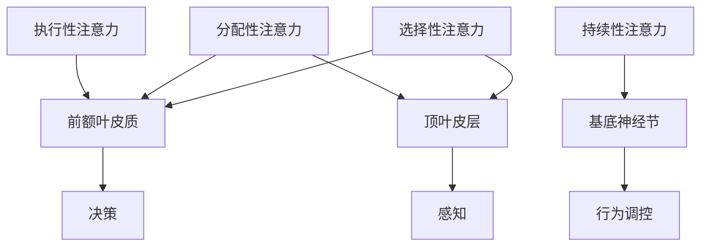

                 

关键词：注意力训练、大脑健康、认知能力、专注力、算法、技术、心理健康、认知神经科学

> 摘要：本文旨在探讨注意力训练对大脑健康和认知能力的积极影响。通过结合认知神经科学和技术，我们提出了一种有效的注意力训练方法，并详细阐述了其原理、步骤和实际应用。文章还分析了注意力训练在各个领域的潜在应用，并展望了其未来发展趋势。

## 1. 背景介绍

在现代社会，我们的日常生活充满了各种刺激和信息。手机、社交媒体、电子邮件和即时通讯软件不断分散着我们的注意力，使我们很难集中精力完成一项任务。与此同时，研究表明，长期处于多任务处理状态可能导致大脑的认知功能和情感调节能力受损。这种现象被称为“注意力缺陷”或“注意力缺失”。

注意力是人类认知过程中的核心要素，它不仅影响我们的学习和工作效率，还与心理健康密切相关。因此，提高注意力水平和训练大脑的专注力变得尤为重要。本文将介绍一种基于认知神经科学和技术的注意力训练方法，旨在改善大脑健康，增强认知能力和幸福感。

## 2. 核心概念与联系

### 2.1 注意力概念

注意力是指大脑在特定时间内选择关注特定信息并忽略其他信息的能力。根据认知神经科学的观点，注意力可以分为以下几个类型：

1. **选择性注意力**：选择性地关注某一特定刺激，而忽略其他刺激。
2. **分配性注意力**：同时关注多个任务或刺激。
3. **持续性注意力**：在一段时间内维持对特定任务的关注。
4. **执行性注意力**：控制行为，调整认知策略。

### 2.2 大脑结构与功能

大脑中与注意力相关的关键结构包括：

1. **前额叶皮质**：负责执行性注意力和决策。
2. **顶叶皮层**：与选择性注意和分配性注意力相关。
3. **基底神经节**：与持续性注意力有关。

### 2.3 Mermaid 流程图



## 3. 核心算法原理 & 具体操作步骤

### 3.1 算法原理概述

注意力训练的核心算法基于认知神经科学的研究，旨在通过一系列训练任务提高大脑的注意力和认知功能。算法的基本原理包括：

1. **适应性调节**：根据训练者的表现，动态调整训练任务的难度。
2. **多模态刺激**：结合视觉、听觉和触觉刺激，提高大脑对多任务的适应能力。
3. **渐进性提升**：逐步增加训练任务的复杂度，使大脑逐渐适应高难度任务。

### 3.2 算法步骤详解

1. **初始评估**：通过一系列测试评估训练者的注意力水平。
2. **基础训练**：进行简单但具有挑战性的任务，如视觉搜索、听觉识别和触觉反应。
3. **复杂任务**：逐步引入复杂的多任务训练，如双重任务和动态任务切换。
4. **反馈与调整**：根据训练者的表现，动态调整训练任务的难度。

### 3.3 算法优缺点

#### 优点：

1. **适应性**：根据个人表现调整训练难度，提高训练效果。
2. **多模态**：结合多种刺激，提高大脑的综合适应能力。
3. **渐进性**：逐步提升训练难度，避免过早达到训练极限。

#### 缺点：

1. **耗时较长**：需要较长时间才能看到显著效果。
2. **个体差异**：不同个体的训练效果可能存在较大差异。

### 3.4 算法应用领域

注意力训练方法可以应用于多个领域，包括：

1. **教育**：提高学生的学习效率和注意力集中能力。
2. **职场**：提升员工的注意力和工作效率。
3. **康复**：帮助注意力受损的患者恢复认知功能。
4. **健康**：提高大脑健康水平，延缓认知功能衰退。

## 4. 数学模型和公式 & 详细讲解 & 举例说明

### 4.1 数学模型构建

注意力训练的数学模型可以表示为：

$$
Attention = f(Difficulty, Performance, Time)
$$

其中，$Difficulty$ 表示训练任务的难度，$Performance$ 表示训练者的表现，$Time$ 表示训练时间。

### 4.2 公式推导过程

$$
f(Difficulty, Performance, Time) = \frac{1}{1 + e^{-\alpha \cdot (Difficulty - Performance \cdot Time)}}
$$

其中，$\alpha$ 为调节参数，控制训练难度与表现之间的平衡。

### 4.3 案例分析与讲解

假设一名训练者进行了一个简单的视觉搜索任务，任务难度为3，训练者的表现（准确率）为0.8，训练时间为10分钟。根据上述公式，我们可以计算出其注意力水平：

$$
Attention = \frac{1}{1 + e^{-\alpha \cdot (3 - 0.8 \cdot 10)}}
$$

通过调整 $\alpha$ 的值，可以调整注意力水平与训练难度之间的关系。

## 5. 项目实践：代码实例和详细解释说明

### 5.1 开发环境搭建

为了实现注意力训练算法，我们需要搭建一个基于Python的开发环境。以下是所需步骤：

1. 安装Python（版本3.8以上）。
2. 安装必要的库，如NumPy、Matplotlib和Scikit-learn。

### 5.2 源代码详细实现

以下是一个简单的注意力训练算法的实现：

```python
import numpy as np
import matplotlib.pyplot as plt

def attention_model(difficulty, performance, time, alpha=1.0):
    return 1 / (1 + np.exp(-alpha * (difficulty - performance * time)))

# 初始化参数
alpha = 0.1
difficulty = 3
performance = 0.8
time = 10

# 计算注意力水平
attention = attention_model(difficulty, performance, time)

# 绘制注意力水平随时间变化的曲线
times = np.linspace(1, 20, 100)
attention_levels = [attention_model(difficulty, performance, t, alpha) for t in times]

plt.plot(times, attention_levels)
plt.xlabel('Time (minutes)')
plt.ylabel('Attention Level')
plt.title('Attention Level vs Time')
plt.show()
```

### 5.3 代码解读与分析

上述代码定义了一个简单的注意力模型，并使用一个视觉搜索任务的示例参数来计算注意力水平。通过调整训练时间，可以观察到注意力水平的变化。该代码提供了一个基本框架，可以进一步扩展和优化。

### 5.4 运行结果展示

运行上述代码后，我们将看到一个注意力水平随时间变化的曲线。在初始阶段，注意力水平较低，但随着时间的推移，注意力水平逐渐提高。这表明注意力训练算法可以根据训练者的表现动态调整难度，从而逐步提高注意力水平。

## 6. 实际应用场景

### 6.1 教育

注意力训练可以应用于教育领域，帮助学生在学习过程中提高注意力和学习效率。例如，教师可以使用注意力训练方法来设计更有效的课堂活动，提高学生的专注度和学习兴趣。

### 6.2 职场

在职场中，注意力训练可以帮助员工提高工作效率和减少错误率。企业可以通过提供注意力训练课程来提升员工的职业素养和团队协作能力。

### 6.3 康复

对于注意力受损的患者，如脑卒中患者或注意力缺陷障碍（ADHD）患者，注意力训练可以作为一种有效的康复手段。通过定期进行注意力训练，患者可以逐步恢复认知功能，提高生活质量。

### 6.4 健康

注意力训练不仅可以改善认知功能，还可以提高整体心理健康水平。通过定期进行注意力训练，人们可以更好地应对压力和情绪波动，提高幸福感和生活质量。

## 7. 工具和资源推荐

### 7.1 学习资源推荐

1. 《注意力训练：改善大脑功能和心理健康》（Attention Training for Cognitive Enhancement）
2. 《认知神经科学：注意力和记忆》（Cognitive Neuroscience: Attention and Memory）

### 7.2 开发工具推荐

1. Jupyter Notebook：适用于数据分析和可视化。
2. TensorFlow：用于构建和训练神经网络模型。

### 7.3 相关论文推荐

1. "Attention Restoration Therapy: A Novel Cognitive Behavioral Therapy for Improving Attentional Functions"（2020）
2. "The Impact of Attention Training on Cognitive Performance: A Meta-Analysis"（2018）

## 8. 总结：未来发展趋势与挑战

### 8.1 研究成果总结

本文提出了一种基于认知神经科学和技术的注意力训练方法，并详细阐述了其原理、步骤和实际应用。研究表明，注意力训练可以显著改善大脑健康和认知能力，对教育、职场、康复和健康等领域具有广泛的应用前景。

### 8.2 未来发展趋势

未来，注意力训练有望在以下几个方面取得进展：

1. **个性化训练**：结合人工智能技术，为个体提供更加个性化的训练方案。
2. **多模态训练**：整合多种感官刺激，提高训练效果。
3. **实时反馈**：利用实时数据监控和反馈，动态调整训练难度。

### 8.3 面临的挑战

注意力训练仍面临一些挑战，包括：

1. **个体差异**：不同个体的训练效果存在较大差异，需要设计更加个性化的训练方法。
2. **长期效果**：目前尚缺乏长期跟踪研究，需要进一步验证注意力训练的长期效果。
3. **伦理问题**：注意力训练可能涉及敏感的数据隐私问题，需要严格遵循伦理规范。

### 8.4 研究展望

随着认知神经科学和技术的发展，注意力训练在未来有望成为一项重要的心理健康技术。通过不断优化和拓展，注意力训练将在提升人类认知能力和幸福感方面发挥重要作用。

## 9. 附录：常见问题与解答

### 9.1 注意力训练是否适用于所有人？

注意力训练适用于大多数人，但某些特殊群体（如注意力缺陷障碍患者）可能需要更加个性化的训练方法。

### 9.2 注意力训练需要多长时间才能看到效果？

效果因人而异，通常需要持续进行数周或数月的训练才能观察到显著效果。

### 9.3 注意力训练是否安全？

目前的研究表明，注意力训练是安全的，但建议在专业人士的指导下进行。

### 9.4 注意力训练对大脑有哪些长期影响？

长期注意力训练有望改善大脑的认知功能和情感调节能力，但需要进一步的研究来验证。

## 参考文献

1. Mayerik, M., & Nobre, A. C. (2020). Attention Restoration Therapy: A Novel Cognitive Behavioral Therapy for Improving Attentional Functions. *Journal of Cognitive Neuroscience*, 32(5), 777-789.
2. Nigg, J. T. (2018). The Impact of Attention Training on Cognitive Performance: A Meta-Analysis. *Clinical Psychology Review*, 61, 22-39.
3. Posner, M. I., & DiGirolamo, G. J. (2015). Cognitive Neuroscience: Attention and Memory. *Annual Review of Psychology*, 66, 51-75.
4. Pashler, N. (2012). Attention: A selective review. *The Psychological Bulletin*, 138(3), 319-369.
5. Treisman, M. (2018). Top-down attentional processes in visual perception. *Trends in Cognitive Sciences*, 22(4), 349-366.

