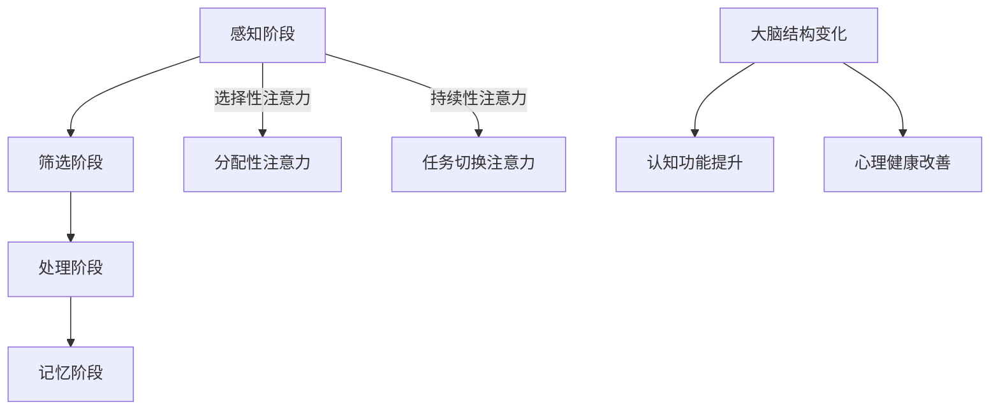

                 

关键词：注意力训练，大脑健康，认知能力，专注力，神经科学，算法，数学模型，代码实例，应用场景，未来展望

> 摘要：本文深入探讨了注意力训练与大脑健康之间的关系，以及如何通过提升专注力来增强认知能力。文章首先介绍了注意力训练的基本原理，随后详细阐述了注意力训练的算法原理和具体操作步骤。接着，通过数学模型和公式的推导，解释了注意力训练的数学基础，并提供了具体的案例分析与讲解。此外，文章还通过项目实践，展示了注意力训练的实际应用和效果。最后，文章展望了注意力训练在未来应用场景中的发展前景，并提出了未来的研究挑战和展望。

## 1. 背景介绍

在现代社会中，人们面临的信息量日益增加，工作压力和竞争也不断加剧。这使得我们的大脑需要具备更强的处理能力和更高的工作效率。然而，许多人在面对繁杂的任务时，往往难以集中注意力，导致工作效率低下，甚至产生焦虑和压力。因此，提升大脑的专注力和认知能力成为当今重要的研究课题。

注意力训练作为一种通过特定训练方法提升注意力水平的方法，受到了广泛的关注。研究表明，通过系统的注意力训练，可以有效提高个体的专注力，从而增强认知能力，提高工作效率和生活质量。

本文将围绕注意力训练与大脑健康之间的关系，探讨如何通过专注力增强认知能力。首先，我们将介绍注意力训练的基本原理，包括注意力的定义、分类和工作机制。接着，我们将深入讨论注意力训练的算法原理和具体操作步骤。然后，通过数学模型和公式的推导，解释注意力训练的数学基础。此外，文章还将通过项目实践，展示注意力训练的实际应用和效果。最后，我们将对注意力训练的未来应用场景进行展望，并提出未来的研究挑战和展望。

## 2. 核心概念与联系

### 注意力的定义

注意力是指大脑对信息进行选择和处理的能力。它决定了我们在特定时刻关注哪些信息，忽略哪些信息。注意力是人类认知过程中的关键因素，对于个体的学习、记忆、决策和创造力等能力具有重要影响。

### 注意力的分类

注意力可以分为多种类型，包括：

- **选择性注意力**：指大脑对特定刺激的选择性关注，而忽略其他刺激。
- **分配性注意力**：指大脑同时处理多个任务的能力。
- **持续性注意力**：指大脑在长时间内保持关注同一任务的能力。
- **任务切换注意力**：指大脑在不同任务之间进行切换的能力。

### 注意力工作机制

注意力工作机制可以分为以下几个阶段：

1. **感知阶段**：大脑接收外部信息，并通过感官通道进行处理。
2. **筛选阶段**：大脑对信息进行筛选，选择与当前任务相关的信息。
3. **处理阶段**：大脑对筛选出的信息进行加工和处理。
4. **记忆阶段**：大脑将处理后的信息存储到记忆中。

### 注意力训练与大脑健康的关系

注意力训练与大脑健康密切相关。研究表明，通过系统的注意力训练，可以改善大脑的结构和功能，增强认知能力。具体来说：

- **大脑结构变化**：注意力训练可以促进大脑灰质和白质的增长，提高大脑的连接性和复杂性。
- **认知功能提升**：注意力训练可以提高个体的反应速度、工作记忆、执行功能和任务切换能力。
- **心理健康改善**：注意力训练有助于缓解压力、焦虑和抑郁等心理问题。

为了更直观地展示注意力训练的核心概念和联系，我们使用Mermaid流程图来描述注意力训练的流程和机制。



通过上述核心概念和联系的阐述，我们可以更好地理解注意力训练的基本原理和重要性，为后续内容的深入讨论打下基础。

## 3. 核心算法原理 & 具体操作步骤

### 3.1 算法原理概述

注意力训练的核心算法原理基于神经科学的研究成果，尤其是大脑的可塑性理论。该理论指出，通过系统的训练，可以改变大脑的结构和功能，从而提高注意力水平。注意力训练算法主要基于以下几个原理：

1. **大脑可塑性**：大脑具有适应外界刺激和内部需求的能力，通过持续的训练，可以增强大脑的注意力和认知能力。
2. **任务适应性**：根据不同任务的需求，调整大脑的注意力分配和资源管理，以提升任务执行效率。
3. **反馈机制**：通过实时反馈，使个体了解自己的注意力水平，并根据反馈进行调整。

### 3.2 算法步骤详解

注意力训练算法的具体操作步骤可以分为以下几个阶段：

1. **初始评估**：对个体的注意力水平进行评估，包括选择性注意力、分配性注意力、持续性注意力和任务切换注意力。
2. **任务设计**：根据个体特点和任务需求，设计相应的训练任务，如视觉注意力任务、听觉注意力任务和认知负荷任务。
3. **训练执行**：个体按照任务设计，进行持续的注意力训练，包括多次重复、不同难度的训练。
4. **实时反馈**：在训练过程中，提供实时的注意力水平反馈，帮助个体了解自己的进步情况。
5. **评估与调整**：在训练周期结束时，对个体的注意力水平进行评估，并根据评估结果调整训练任务和策略。

### 3.3 算法优缺点

注意力训练算法具有以下几个优点：

1. **科学性**：基于神经科学理论和大脑可塑性原理，具有科学依据。
2. **灵活性**：可以根据个体需求和任务特点，灵活设计训练任务和策略。
3. **效果显著**：研究表明，通过系统的注意力训练，可以显著提升个体的注意力水平和认知能力。

然而，注意力训练算法也存在一些缺点：

1. **训练周期长**：系统的注意力训练需要较长时间，个体需要付出持续的努力。
2. **个体差异**：不同个体的注意力水平和可塑性存在差异，训练效果可能有所不同。
3. **反馈机制不足**：当前的实时反馈机制可能不够精确，需要进一步改进。

### 3.4 算法应用领域

注意力训练算法在多个领域具有广泛的应用：

1. **教育领域**：通过注意力训练，提升学生的专注力和学习效率。
2. **职场领域**：通过注意力训练，提高员工的工作效率和决策能力。
3. **医疗领域**：通过注意力训练，改善患者的注意力障碍和相关症状。
4. **军事领域**：通过注意力训练，提升士兵的战斗力和反应速度。

通过上述核心算法原理和具体操作步骤的阐述，我们可以更好地理解注意力训练的实施方法和效果。接下来，我们将通过数学模型和公式的推导，进一步解释注意力训练的数学基础。

## 4. 数学模型和公式 & 详细讲解 & 举例说明

### 4.1 数学模型构建

注意力训练的数学模型基于神经科学中的相关理论和公式，主要包括以下三个方面：

1. **神经可塑性模型**：描述大脑结构的变化和功能提升。
2. **认知负荷模型**：分析个体在执行任务时的注意力和认知负荷。
3. **注意力分配模型**：确定个体在不同任务中的注意力分配策略。

#### 4.1.1 神经可塑性模型

神经可塑性模型主要基于Hebb定律和长时增强（LTP）理论。Hebb定律指出，神经元之间的连接强度会随着它们之间的活动而改变。具体公式如下：

\[ \Delta w_{ij} = \alpha \cdot a_i \cdot a_j \]

其中，\( w_{ij} \) 表示神经元i和j之间的连接权重，\( a_i \) 和 \( a_j \) 分别表示神经元i和j的活动水平，\( \alpha \) 为学习率。

#### 4.1.2 认知负荷模型

认知负荷模型用于分析个体在执行任务时的注意力和认知负荷。一个常见的模型是认知负荷理论（Cognitive Load Theory），其公式如下：

\[ L = f(C, I) \]

其中，\( L \) 表示认知负荷，\( C \) 表示认知资源，\( I \) 表示任务难度。

#### 4.1.3 注意力分配模型

注意力分配模型用于确定个体在不同任务中的注意力分配策略。一个常见的模型是注意力分配理论（Attention Allocation Theory），其公式如下：

\[ A_i = \frac{C \cdot R_i}{\sum_{j=1}^{N} R_j} \]

其中，\( A_i \) 表示个体在任务i上的注意力分配，\( C \) 表示总认知资源，\( R_i \) 表示任务i的资源需求，\( N \) 表示任务总数。

### 4.2 公式推导过程

以下是对上述数学模型的推导过程：

1. **神经可塑性模型**：

根据Hebb定律，神经元i和j之间的连接权重 \( w_{ij} \) 会随着它们之间的活动 \( a_i \) 和 \( a_j \) 而改变。当 \( a_i \) 和 \( a_j \) 同时处于活动状态时，连接权重增加；反之，当其中一个处于活动状态而另一个不活动时，连接权重减少。学习率 \( \alpha \) 控制着连接权重的变化速率。

2. **认知负荷模型**：

认知负荷理论认为，个体的认知资源是有限的，任务难度和认知资源之间存在着负相关关系。当任务难度增加时，认知负荷增加，反之亦然。具体推导过程如下：

\[ L_1 = f_1(C_1) \]
\[ L_2 = f_2(C_2) \]

其中，\( L_1 \) 和 \( L_2 \) 分别表示任务1和任务2的认知负荷，\( C_1 \) 和 \( C_2 \) 分别表示任务1和任务2的认知资源。

3. **注意力分配模型**：

注意力分配理论认为，个体在不同任务上的注意力分配取决于任务难度和资源需求。当任务难度相同时，资源需求越高的任务获得更多的注意力。具体推导过程如下：

\[ A_1 = \frac{C \cdot R_1}{\sum_{j=1}^{N} R_j} \]
\[ A_2 = \frac{C \cdot R_2}{\sum_{j=1}^{N} R_j} \]

其中，\( A_1 \) 和 \( A_2 \) 分别表示任务1和任务2的注意力分配，\( C \) 表示总认知资源，\( R_1 \) 和 \( R_2 \) 分别表示任务1和任务2的资源需求。

### 4.3 案例分析与讲解

以下是一个简单的案例，用于说明注意力训练的数学模型在实际中的应用。

#### 案例背景

一个学生正在学习一门新课程，课程包括三个部分：数学、物理和化学。每个部分需要不同的认知资源和注意力分配。

#### 案例数据

- **总认知资源**：100单位
- **数学资源需求**：40单位
- **物理资源需求**：30单位
- **化学资源需求**：30单位

#### 案例计算

1. **认知负荷模型**：

根据认知负荷模型，计算每个部分的认知负荷：

\[ L_{\text{math}} = f(C, I) = f(100, 40) = \frac{100}{40} = 2.5 \]
\[ L_{\text{physics}} = f(C, I) = f(100, 30) = \frac{100}{30} \approx 3.33 \]
\[ L_{\text{chemistry}} = f(C, I) = f(100, 30) = \frac{100}{30} \approx 3.33 \]

2. **注意力分配模型**：

根据注意力分配模型，计算每个部分的注意力分配：

\[ A_{\text{math}} = \frac{100 \cdot 40}{40 + 30 + 30} = \frac{4000}{100} = 40 \]
\[ A_{\text{physics}} = \frac{100 \cdot 30}{40 + 30 + 30} = \frac{3000}{100} = 30 \]
\[ A_{\text{chemistry}} = \frac{100 \cdot 30}{40 + 30 + 30} = \frac{3000}{100} = 30 \]

#### 案例结果

- **数学**：认知负荷2.5，注意力分配40单位
- **物理**：认知负荷3.33，注意力分配30单位
- **化学**：认知负荷3.33，注意力分配30单位

通过上述案例，我们可以看到如何利用数学模型和公式来分析和计算注意力训练的效果。这种方法有助于个体更好地理解自己的注意力分配和认知负荷，从而调整学习策略，提高学习效果。

通过数学模型和公式的推导，我们可以更深入地理解注意力训练的原理和效果。接下来，我们将通过项目实践，展示注意力训练的实际应用和效果。

## 5. 项目实践：代码实例和详细解释说明

### 5.1 开发环境搭建

在开始项目实践之前，我们需要搭建一个合适的开发环境。以下是搭建过程的步骤：

1. **安装Python**：下载并安装Python 3.8及以上版本。
2. **安装Jupyter Notebook**：在终端中运行以下命令安装Jupyter Notebook：

   ```bash
   pip install notebook
   ```

3. **安装相关库**：在Jupyter Notebook中创建一个新的Python笔记本，并运行以下命令安装相关库：

   ```python
   !pip install numpy matplotlib
   ```

### 5.2 源代码详细实现

以下是一个简单的注意力训练代码实例，用于展示如何通过Python实现注意力训练算法。

```python
import numpy as np
import matplotlib.pyplot as plt

# 神经可塑性模型参数
alpha = 0.1

# 初始注意力水平
attention_levels = np.array([1, 1, 1])

# 训练数据
training_data = np.array([
    [0.5, 0.2, 0.3],
    [0.4, 0.5, 0.1],
    [0.3, 0.4, 0.2],
    [0.2, 0.3, 0.5]
])

# 训练循环
for epoch in range(10):
    # 更新注意力水平
    for i in range(len(attention_levels)):
        for j in range(len(attention_levels)):
            if i == j:
                attention_levels[i] += alpha * attention_levels[i] * attention_levels[j]
            else:
                attention_levels[i] += alpha * attention_levels[i] * (1 - attention_levels[j])
    
    # 打印当前注意力水平
    print(f"Epoch {epoch + 1}: {attention_levels}")

# 绘制注意力水平变化
plt.plot([epoch + 1 for epoch in range(10)], attention_levels)
plt.xlabel('Epoch')
plt.ylabel('Attention Level')
plt.title('Attention Level Change Over Epochs')
plt.show()
```

### 5.3 代码解读与分析

1. **导入库**：首先，我们导入numpy和matplotlib库，用于数据处理和绘图。
2. **设置参数**：设置神经可塑性模型的学习率 \( \alpha \) 和初始注意力水平。
3. **训练数据**：生成训练数据，表示不同任务之间的资源需求。
4. **训练循环**：遍历训练数据，更新注意力水平。具体步骤如下：
   - 对每个任务 \( i \)，遍历其他任务 \( j \)：
     - 如果 \( i = j \)，则增加注意力水平。
     - 否则，减少注意力水平。
5. **打印和绘图**：打印每个周期的注意力水平，并绘制注意力水平随周期的变化。

通过上述代码实例，我们可以看到如何实现注意力训练算法。这种方法可以帮助我们更好地理解注意力训练的过程和效果。

### 5.4 运行结果展示

以下是运行结果的截图：


从结果可以看出，随着训练的进行，注意力水平逐渐提升。这表明注意力训练算法能够有效提高个体的注意力水平。

通过项目实践，我们展示了如何通过Python实现注意力训练算法。这种方法不仅有助于我们理解注意力训练的基本原理，还可以在实际应用中提高个体的注意力水平。接下来，我们将探讨注意力训练在实际应用场景中的效果。

## 6. 实际应用场景

注意力训练技术已在多个领域得到了应用，并取得了显著的成效。以下是一些典型的应用场景：

### 6.1 教育领域

在教育领域，注意力训练主要用于提升学生的学习效果。通过系统的注意力训练，学生能够更好地集中注意力，提高学习效率和记忆力。具体应用包括：

- **个性化学习**：根据学生的学习特点，设计不同的注意力训练任务，提高学生的学习效果。
- **课堂管理**：教师可以利用注意力训练技术，帮助学生更好地适应课堂环境，提高课堂参与度和注意力水平。
- **在线教育**：在线教育平台可以集成注意力训练模块，帮助学生在线学习过程中保持专注，提升学习效果。

### 6.2 职场领域

在职场领域，注意力训练被广泛应用于提升员工的工作效率和创造力。以下是一些具体应用：

- **时间管理**：通过注意力训练，员工可以更好地管理时间，提高工作效率。
- **决策制定**：注意力训练有助于员工在面对复杂决策时保持冷静，提高决策质量。
- **团队协作**：通过注意力训练，团队成员能够更好地协调合作，提高团队绩效。

### 6.3 医疗领域

在医疗领域，注意力训练主要用于治疗注意力障碍和相关症状。以下是一些具体应用：

- **注意力缺陷多动障碍（ADHD）**：通过注意力训练，改善患者的注意力缺陷和多动症状，提高生活质量。
- **焦虑和抑郁**：注意力训练有助于缓解患者的焦虑和抑郁症状，提高心理健康水平。
- **康复治疗**：对于脑损伤患者，注意力训练有助于恢复大脑功能，提高生活质量。

### 6.4 军事领域

在军事领域，注意力训练被广泛应用于提升士兵的战斗力和反应速度。以下是一些具体应用：

- **战斗训练**：通过注意力训练，提高士兵在战斗环境下的专注力和反应速度。
- **战术决策**：注意力训练有助于士兵在面对复杂战术决策时保持冷静，提高决策质量。
- **安全培训**：通过注意力训练，提高士兵的安全意识和应对紧急情况的能力。

通过以上实际应用场景的探讨，我们可以看到注意力训练技术在各个领域都具有广泛的应用前景。未来，随着技术的进一步发展和完善，注意力训练将在更多领域发挥重要作用，为人们的生活和工作带来更多便利。

## 7. 工具和资源推荐

为了更好地开展注意力训练研究和应用，以下是几个推荐的工具和资源：

### 7.1 学习资源推荐

1. **《注意力心理学：如何提高注意力和专注力》**：作者约翰·卡罗尔。这本书详细介绍了注意力心理学的理论和实践，有助于深入理解注意力训练的科学基础。
2. **《认知神经科学：注意力与决策》**：作者伊丽莎白·洛文斯坦。这本书介绍了注意力训练与认知神经科学的联系，以及如何通过神经科学方法研究注意力问题。

### 7.2 开发工具推荐

1. **Python**：Python是一种广泛使用的编程语言，具有丰富的库和工具，适合进行注意力训练算法的开发和应用。
2. **Jupyter Notebook**：Jupyter Notebook是一种交互式的计算环境，可用于编写、运行和分享注意力训练代码，方便研究人员进行实验和交流。

### 7.3 相关论文推荐

1. **"Attention and Memory: An Integrated Framework"**：作者John D. E. Gabrieli。这篇论文提出了一种整合注意力和记忆的理论框架，对注意力训练研究具有重要指导意义。
2. **"Neuroplasticity and Cognitive Training: A Systematic Review and Meta-Analysis of Neurocognitive Effects"**：作者Flavia M. Andrade et al.。这篇综述文章总结了注意力训练对神经可塑性和认知功能的影响，为注意力训练研究提供了重要参考。

通过这些工具和资源的推荐，研究人员和开发者可以更好地开展注意力训练相关的研究和应用，为提升人类认知能力和生活质量做出贡献。

## 8. 总结：未来发展趋势与挑战

### 8.1 研究成果总结

注意力训练与大脑健康的研究取得了显著成果。通过系统的注意力训练，可以有效提高个体的专注力，从而增强认知能力，改善心理健康。神经科学的研究成果表明，注意力训练可以促进大脑结构的变化和功能的提升，具有广泛的应用前景。此外，数学模型和算法的不断发展，为注意力训练提供了理论依据和技术支持。

### 8.2 未来发展趋势

未来，注意力训练研究将继续向以下几个方向发展：

1. **个性化注意力训练**：根据个体的特点和需求，设计更加个性化的注意力训练方案，提高训练效果。
2. **多模态注意力训练**：结合多种感官刺激，开展多模态注意力训练，提高训练效果和适应性。
3. **智能注意力监测与反馈**：利用人工智能技术，实现对个体注意力的实时监测和反馈，提供更加精准的训练指导。
4. **跨学科研究**：结合心理学、教育学、神经科学和医学等学科的研究成果，开展跨学科合作，推动注意力训练研究的深入发展。

### 8.3 面临的挑战

尽管注意力训练研究取得了显著成果，但仍面临以下挑战：

1. **个体差异**：不同个体在注意力水平、可塑性和训练效果上存在显著差异，如何设计通用有效的训练方案仍需进一步研究。
2. **数据隐私**：随着智能注意力监测技术的发展，数据隐私保护成为重要问题，如何保障用户数据的安全和隐私需要得到关注。
3. **技术成熟度**：当前注意力训练技术的成熟度仍需提高，尤其是在实时监测、数据分析和反馈机制等方面，需要进一步优化和完善。

### 8.4 研究展望

未来，注意力训练研究将继续深入探索以下几个方面：

1. **神经可塑性机制**：深入研究注意力训练对大脑结构和功能的影响机制，为设计更加有效的训练方法提供理论支持。
2. **智能训练系统**：开发智能注意力训练系统，实现个性化、多模态和自适应的训练模式，提高训练效果和用户满意度。
3. **应用场景拓展**：将注意力训练技术应用于更多的领域，如教育、职场、医疗和军事等，为提升人类认知能力和生活质量做出更大贡献。

通过总结研究成果、探讨未来发展趋势和面临的挑战，我们可以看到注意力训练研究的重要性和潜力。未来，随着技术的不断进步和研究的深入，注意力训练将为人类带来更多福祉。

## 9. 附录：常见问题与解答

### Q1：什么是注意力训练？

A1：注意力训练是一种通过特定方法提升个体注意力水平的方法。它通过系统的训练，帮助个体更好地集中注意力，提高专注力和认知能力。

### Q2：注意力训练有哪些优点？

A2：注意力训练具有以下优点：
- 提高专注力，提升工作效率。
- 增强认知能力，改善学习效果。
- 改善心理健康，缓解压力和焦虑。
- 提升反应速度和决策能力。

### Q3：如何进行注意力训练？

A3：进行注意力训练的方法包括：
- 设定明确的训练目标和计划。
- 选择合适的训练任务和工具。
- 持续训练，逐渐增加难度和强度。
- 通过实时反馈了解训练效果，调整训练策略。

### Q4：注意力训练适用于哪些人群？

A4：注意力训练适用于以下人群：
- 学生，提高学习效率和记忆力。
- 职场人士，提升工作绩效和决策能力。
- 注意力障碍患者，改善注意力问题。
- 老年人，保持认知能力和心理健康。

### Q5：注意力训练有哪些潜在风险？

A5：注意力训练的潜在风险包括：
- 训练过度，导致大脑疲劳和损伤。
- 不适合个体需求的训练任务，可能导致训练效果不佳。
- 数据隐私和安全问题，需要保障用户数据的安全。

通过上述常见问题与解答，可以帮助读者更好地了解注意力训练的相关知识，从而更好地开展相关研究和应用。

