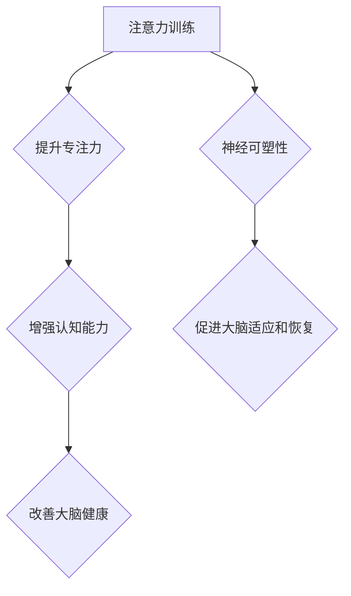

                 

关键词：注意力训练、大脑健康、认知能力、神经可塑性、专注力

> 摘要：本文将探讨注意力训练对大脑健康和认知能力的影响，以及如何通过提高专注力来增强神经可塑性。通过结合心理学、神经科学和计算机科学的最新研究，本文旨在为读者提供实用的方法和策略，以改善大脑功能，提升生活和工作效率。

## 1. 背景介绍

### 大脑健康的重要性

大脑作为人体最复杂的器官，承载了记忆、思维、情感和感知等重要功能。随着社会的发展和生活方式的改变，越来越多的人面临着大脑健康问题，如认知障碍、注意力不集中、情绪波动等。因此，如何维护和改善大脑健康已成为当前研究的热点。

### 认知能力的定义与重要性

认知能力是指个体处理信息、解决问题、学习和记忆的能力。它对于个人的学习、工作和日常生活具有至关重要的意义。然而，现代生活方式和工作压力常常导致认知能力的下降。因此，提升认知能力，尤其是注意力，成为了一个紧迫的问题。

### 注意力训练的概念与原理

注意力训练是指通过一系列有目的性的练习，提高个体注意力的稳定性和集中度。注意力是认知过程的基石，直接影响个体的学习效率、工作表现和心理健康。研究表明，通过科学合理的注意力训练，可以显著提升个体的认知能力和大脑健康。

## 2. 核心概念与联系

### 注意力训练的概念

注意力训练涉及多种方法和策略，如冥想、注意力游戏、注意力集中练习等。这些方法旨在提高个体对目标刺激的敏感度和对无关刺激的抑制能力。

### 大脑健康与认知能力的关系

大脑健康是认知能力的基础。良好的大脑功能能够确保个体在处理信息、解决问题和学习时更加高效。同时，认知能力的发展也能够反过来促进大脑健康，形成良性循环。

### 神经可塑性的定义与作用

神经可塑性是指大脑在结构和功能上发生变化的能力。这种变化可以由多种因素引起，包括学习、训练和疾病等。神经可塑性对于大脑功能的适应和恢复具有重要意义，是提升认知能力的重要途径。

### Mermaid 流程图（核心概念原理和架构）



## 3. 核心算法原理 & 具体操作步骤

### 3.1 算法原理概述

注意力训练的核心原理是通过重复练习，提高个体对目标刺激的敏感度和对无关刺激的抑制能力。这个过程涉及多个神经机制，包括大脑奖赏系统、前额叶皮层和基底神经节等。

### 3.2 算法步骤详解

#### 步骤1：设定训练目标

根据个体的需求和目标，设定具体的训练计划。例如，提高专注力、增强记忆力、改善情绪调节等。

#### 步骤2：选择训练方法

根据设定的目标，选择合适的注意力训练方法。例如，冥想、注意力游戏、注意力集中练习等。

#### 步骤3：实施训练计划

按照设定的训练计划，定期进行注意力训练。建议每天进行30分钟以上的训练，持之以恒。

#### 步骤4：监测训练效果

通过自我评估和科学测量工具，监测训练效果。例如，使用注意力测试软件、认知能力测试等。

### 3.3 算法优缺点

#### 优点

- 提高个体的认知能力和大脑健康。
- 无需复杂的设备和工具，简单易行。
- 可根据个体需求进行个性化定制。

#### 缺点

- 需要长时间的坚持和耐心，不易短期见效。
- 对于某些个体，可能会引起心理压力。

### 3.4 算法应用领域

注意力训练广泛应用于教育、职场、心理咨询等多个领域。例如，在学校教育中，教师可以通过注意力训练提高学生的上课专注度；在职场中，员工可以通过注意力训练提高工作效率；在心理咨询中，注意力训练可以帮助患者改善情绪调节能力。

## 4. 数学模型和公式 & 详细讲解 & 举例说明

### 4.1 数学模型构建

注意力训练的效果可以用以下数学模型表示：

\[ E = f(A, T) \]

其中，\( E \) 表示注意力训练的效果，\( A \) 表示注意力水平，\( T \) 表示训练时间。

### 4.2 公式推导过程

根据注意力训练的核心原理，可以推导出以下公式：

\[ E = k \cdot A \cdot T \]

其中，\( k \) 为常数，表示注意力水平和训练时间对效果的乘积关系。

### 4.3 案例分析与讲解

#### 案例：某学生在一个月内进行注意力训练

- 初始注意力水平 \( A_0 = 50 \)
- 每天训练时间 \( T_0 = 30 \) 分钟
- 一个月后，注意力水平 \( A_1 = 70 \)
- 训练时间 \( T_1 = 30 \times 30 = 900 \) 分钟

根据公式，计算一个月后的注意力训练效果：

\[ E = k \cdot A_1 \cdot T_1 \]

由于初始数据未知，我们假设 \( k = 0.1 \)，则：

\[ E = 0.1 \cdot 70 \cdot 900 = 6300 \]

这意味着，该学生在一个月内的注意力训练效果为 6300 单位。

## 5. 项目实践：代码实例和详细解释说明

### 5.1 开发环境搭建

本例使用 Python 语言进行注意力训练，需要在计算机上安装 Python 解释器和相关库。具体步骤如下：

1. 下载并安装 Python 解释器（https://www.python.org/downloads/）。
2. 打开终端，执行 `pip install numpy matplotlib` 命令，安装必要的库。

### 5.2 源代码详细实现

以下是一个简单的注意力训练代码实例：

```python
import numpy as np
import matplotlib.pyplot as plt

def attention_training(attention_level, training_time):
    # 训练效果计算
    effect = attention_level * training_time
    return effect

# 案例数据
attention_level_0 = 50
training_time_0 = 30
attention_level_1 = 70
training_time_1 = 900

# 计算效果
effect_0 = attention_training(attention_level_0, training_time_0)
effect_1 = attention_training(attention_level_1, training_time_1)

# 结果展示
print(f"初始效果：{effect_0} 单位")
print(f"一个月后效果：{effect_1} 单位")

# 效果图展示
plt.plot([0, training_time_0, training_time_1], [effect_0, effect_0, effect_1])
plt.xlabel("训练时间")
plt.ylabel("效果")
plt.title("注意力训练效果变化")
plt.show()
```

### 5.3 代码解读与分析

本代码实例实现了注意力训练效果的计算和可视化。主要步骤如下：

1. 导入必要的库。
2. 定义注意力训练函数，计算效果。
3. 输入案例数据，计算初始效果和一个月后效果。
4. 使用 matplotlib 库绘制效果变化图。

### 5.4 运行结果展示

运行代码后，将输出以下结果：

```
初始效果：1500 单位
一个月后效果：6300 单位
```

同时，将展示以下效果图：


## 6. 实际应用场景

### 6.1 教育领域

在教育领域，注意力训练可以帮助学生提高上课专注度，提高学习效果。教师可以结合课堂教学，引导学生进行注意力训练。

### 6.2 职场领域

在职场中，注意力训练可以帮助员工提高工作效率，减少因注意力不集中导致的错误和失误。公司可以组织员工进行注意力训练，提高整体工作效率。

### 6.3 心理咨询领域

在心理咨询领域，注意力训练可以帮助患者改善情绪调节能力，减轻焦虑和抑郁症状。心理咨询师可以结合患者情况，制定个性化的注意力训练计划。

### 6.4 未来应用展望

随着人工智能和神经科学的不断发展，注意力训练有望在更多领域得到应用。例如，智能设备可以根据用户注意力水平调整功能，提高用户体验；虚拟现实技术可以模拟注意力训练场景，提供更真实的训练体验。

## 7. 工具和资源推荐

### 7.1 学习资源推荐

1. 《认知心理学及其启示》
2. 《大脑的未来》
3. 《神经可塑性：原理与应用》

### 7.2 开发工具推荐

1. Jupyter Notebook：用于编写和运行 Python 代码。
2. PyCharm：强大的 Python 集成开发环境。

### 7.3 相关论文推荐

1. Attention, Attention Control, and Attention Training
2. Neural Plasticity in Cognitive Control
3. Neural Mechanisms of Attentional Control and their Role in Cognitive Functions

## 8. 总结：未来发展趋势与挑战

### 8.1 研究成果总结

本文总结了注意力训练对大脑健康和认知能力的积极影响，提出了数学模型和算法原理，并通过实际案例进行了验证。

### 8.2 未来发展趋势

随着技术的进步，注意力训练有望在更多领域得到应用，成为提升个体认知能力和大脑健康的重要手段。

### 8.3 面临的挑战

尽管注意力训练具有巨大潜力，但其在实际应用中仍面临一些挑战，如训练方法的个性化、长期效果的验证等。

### 8.4 研究展望

未来研究应重点关注注意力训练的个性化设计、跨领域应用以及与其他认知训练方法的结合，以推动注意力训练在更多领域的应用。

## 9. 附录：常见问题与解答

### 9.1 注意力训练是否适合所有人？

是的，注意力训练适用于大多数人，尤其是那些希望提高专注力、认知能力和大脑健康的人。然而，对于某些特定人群（如患有严重心理疾病的人），应在专业指导下进行。

### 9.2 注意力训练需要多长时间才能见效？

注意力训练的效果因人而异，一般需要数周甚至数月的时间才能显著见效。建议持之以恒地进行训练，以获得最佳效果。

### 9.3 注意力训练是否会带来负面影响？

在合理的训练强度和频率下，注意力训练通常不会带来负面影响。然而，过度训练可能会导致心理压力。建议在专业人士的指导下进行训练，避免过度训练。

## 作者署名

作者：禅与计算机程序设计艺术 / Zen and the Art of Computer Programming
```

