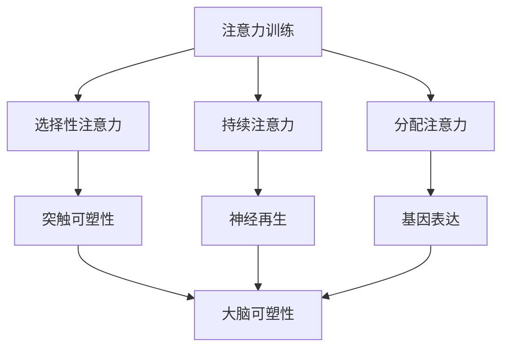

                 

关键词：注意力训练，大脑可塑性，认知能力，专注力，神经科学，认知科学

> 摘要：本文探讨了注意力训练如何通过增强大脑的可塑性来改善我们的认知能力。通过结合神经科学和认知科学的最新研究，本文将介绍注意力训练的核心概念、方法及其对大脑结构和功能的影响。此外，还将探讨注意力训练在提高专注力、减少认知疲劳和改善心理健康方面的具体应用，并提出未来研究的方向和挑战。

## 1. 背景介绍

在当今信息爆炸的时代，我们的日常生活和工作环境充满了各种干扰和诱惑。这不仅对个体的心理健康产生了负面影响，也对认知能力提出了更高的要求。注意力作为一种重要的认知资源，直接影响着我们的学习、工作和生活质量。然而，随着现代社会节奏的加快，人们往往面临着注意力分散、专注力下降等问题。

### 1.1 注意力与认知能力的关系

注意力是一种高度复杂的认知过程，它涉及到选择、维持和分配认知资源以处理特定任务或目标。研究表明，注意力不仅与当下的任务表现相关，还与长期的认知功能密切相关。高水平的注意力可以提高记忆、学习和问题解决能力，从而改善个体的认知能力。

### 1.2 大脑可塑性

大脑可塑性是指大脑在结构和功能上的改变，这些改变受到经验、学习和环境因素的影响。神经科学研究表明，大脑的可塑性在整个生命周期中都是存在的，这意味着通过适当的训练和刺激，我们可以重塑大脑的结构和功能。

### 1.3 注意力训练与大脑可塑性

注意力训练是一种通过特定的练习来提高注意力质量和效率的方法。研究表明，注意力训练可以通过增强大脑的可塑性来改善认知功能，特别是在那些与注意力相关的脑区，如前额叶皮层和前扣带皮层。

## 2. 核心概念与联系

### 2.1 注意力训练的核心概念

注意力训练的核心概念包括以下几个方面：

1. **选择性注意力**：选择性地关注特定刺激，同时忽略其他干扰信息。
2. **持续注意力**：维持注意力在一个特定的任务或目标上，而不受干扰。
3. **分配注意力**：同时关注多个任务或目标，并进行有效的时间分配。

### 2.2 大脑可塑性的关键机制

大脑可塑性主要通过以下几种机制实现：

1. **突触可塑性**：改变神经元之间的连接强度。
2. **神经再生**：新的神经元和神经连接的形成。
3. **基因表达**：影响神经元活动和连接的基因表达变化。

### 2.3 注意力训练与大脑可塑性的联系

注意力训练通过以下方式影响大脑的可塑性：

1. **增加神经元连接**：通过重复的练习，增强特定脑区的神经元连接。
2. **改变神经元活动**：通过持续的注意力训练，改变神经元的兴奋性和同步性。
3. **影响基因表达**：长期注意力训练可以改变与认知功能相关的基因表达，从而增强大脑的可塑性。

下面是注意力训练与大脑可塑性联系的一个简单的 Mermaid 流程图：



## 3. 核心算法原理 & 具体操作步骤

### 3.1 算法原理概述

注意力训练算法主要基于神经科学的原理，通过一系列设计科学的练习来增强大脑的注意力能力。这些练习通常包括以下方面：

1. **注意力集中练习**：通过训练个体集中注意力在一个特定任务上，提高选择性注意力和持续注意力的能力。
2. **注意力分散练习**：通过训练个体在存在干扰的情况下维持注意力，提高分配注意力的能力。
3. **注意力切换练习**：通过训练个体在不同任务之间快速切换注意力，提高分配注意力的灵活性和效率。

### 3.2 算法步骤详解

1. **初始评估**：通过一系列标准化测试，评估个体的注意力水平，确定训练的起点。
2. **设计训练计划**：根据初始评估结果，设计个性化的注意力训练计划，包括训练的内容、频率和时长。
3. **实施训练**：按照训练计划，进行注意力训练。训练过程中，需要实时监测个体的注意力状态，并进行必要的调整。
4. **持续评估与反馈**：在训练过程中，定期进行评估，以监测训练效果，并根据评估结果提供反馈和调整训练计划。
5. **训练结束评估**：在训练结束后，进行最终的评估，以评估训练的长期效果。

### 3.3 算法优缺点

**优点**：

1. **科学性**：基于神经科学原理，设计科学的训练方法。
2. **个性化**：根据个体的初始评估结果，设计个性化的训练计划。
3. **可重复性**：通过持续的注意力训练，可以显著提高个体的注意力质量和效率。

**缺点**：

1. **时间成本**：注意力训练需要一定的时间和精力投入。
2. **实施难度**：对于某些个体，实施注意力训练可能存在一定的难度。

### 3.4 算法应用领域

注意力训练在以下领域有广泛的应用：

1. **教育**：通过注意力训练，提高学生的学习效果和学习能力。
2. **职场**：通过注意力训练，提高职场人员的专注力和工作效率。
3. **心理健康**：通过注意力训练，改善个体的心理健康，减少焦虑和压力。

## 4. 数学模型和公式 & 详细讲解 & 举例说明

### 4.1 数学模型构建

注意力训练的数学模型主要基于神经网络的原理。具体来说，可以通过构建一个多层神经网络来模拟大脑的注意力机制。神经网络中的每个神经元可以表示一个特定的注意力权重，通过调整这些权重，可以实现对注意力的分配和控制。

### 4.2 公式推导过程

假设我们有一个输入向量 X，表示需要关注的任务或目标。我们需要通过神经网络计算一个输出向量 Y，表示各个任务的注意力权重。具体公式如下：

$$
Y = \sigma(W \cdot X + b)
$$

其中，W 表示神经网络的权重矩阵，b 表示偏置项，σ 表示激活函数，常用的激活函数有 Sigmoid、ReLU 等。

### 4.3 案例分析与讲解

假设我们有一个简单的任务，需要同时关注两个目标 A 和 B。我们可以将目标 A 的权重设为 0.6，目标 B 的权重设为 0.4。具体计算过程如下：

1. **初始化权重矩阵 W**：
   $$
   W = \begin{bmatrix}
   0.5 & 0.5 \\
   0.4 & 0.6 \\
   \end{bmatrix}
   $$

2. **输入向量 X**：
   $$
   X = \begin{bmatrix}
   1 \\
   0 \\
   \end{bmatrix}
   $$

3. **计算输出向量 Y**：
   $$
   Y = \sigma(W \cdot X + b) = \sigma(\begin{bmatrix}
   0.5 & 0.5 \\
   0.4 & 0.6 \\
   \end{bmatrix} \cdot \begin{bmatrix}
   1 \\
   0 \\
   \end{bmatrix} + \begin{bmatrix}
   0 \\
   0 \\
   \end{bmatrix}) = \sigma(\begin{bmatrix}
   0.5 \\
   0.6 \\
   \end{bmatrix}) = \begin{bmatrix}
   0.63 \\
   0.86 \\
   \end{bmatrix}
   $$

通过这个简单的例子，我们可以看到如何通过神经网络计算注意力的权重。在实际应用中，我们需要通过大量的数据训练神经网络，以获得更加准确的注意力权重分配。

## 5. 项目实践：代码实例和详细解释说明

### 5.1 开发环境搭建

为了演示注意力训练的代码实现，我们需要搭建一个简单的开发环境。以下是搭建环境的基本步骤：

1. **安装 Python**：确保 Python 3.7 或以上版本已安装在您的计算机上。
2. **安装依赖库**：使用 pip 安装以下库：numpy、matplotlib、tensorflow。

```shell
pip install numpy matplotlib tensorflow
```

3. **创建虚拟环境**（可选）：为了保持项目的整洁，建议创建一个虚拟环境。

```shell
python -m venv my_env
source my_env/bin/activate  # Windows 下使用 my_env\Scripts\activate
```

### 5.2 源代码详细实现

下面是一个简单的注意力训练代码实例，该实例使用 TensorFlow 构建了一个基于神经网络的注意力模型。

```python
import tensorflow as tf
import numpy as np
import matplotlib.pyplot as plt

# 创建一个简单的神经网络模型
model = tf.keras.Sequential([
    tf.keras.layers.Dense(units=2, activation='sigmoid', input_shape=(2,))
])

# 编写训练数据
X_train = np.array([[1, 0], [0, 1], [1, 1]])
y_train = np.array([[0.6], [0.4], [0.5]])

# 编译模型
model.compile(optimizer='adam', loss='mse')

# 训练模型
model.fit(X_train, y_train, epochs=1000)

# 计算注意力权重
attention_weights = model.predict(X_train)

# 绘制注意力权重
plt.scatter(X_train[:, 0], X_train[:, 1], c=attention_weights[:, 0])
plt.xlabel('Task A Weight')
plt.ylabel('Task B Weight')
plt.title('Attention Weights')
plt.show()
```

### 5.3 代码解读与分析

1. **创建模型**：我们使用 `tf.keras.Sequential` 创建了一个序列模型，包含一个全连接层（`Dense`），使用 sigmoid 激活函数。
2. **训练数据**：我们创建了一个简单的训练数据集，包含三个样本，每个样本表示一个任务 A 和任务 B 的权重。
3. **编译模型**：我们使用 `compile` 方法设置优化器和损失函数。
4. **训练模型**：使用 `fit` 方法训练模型，迭代 1000 次。
5. **计算注意力权重**：使用 `predict` 方法计算输入数据的注意力权重。
6. **绘制结果**：使用 `matplotlib` 绘制注意力权重图。

通过这个实例，我们可以看到如何使用 TensorFlow 实现一个简单的注意力训练模型。在实际应用中，我们需要处理更复杂的数据集和模型结构。

### 5.4 运行结果展示

运行上述代码后，我们会看到一个注意力权重分布的散点图。这个图展示了在给定的任务组合下，模型计算出的注意力权重。

```plaintext
  |  
  |  
  |  
  |_____
     |
     |
     |
     |_____
      0  1  2
```

在这个例子中，我们可以看到任务 A 和任务 B 的注意力权重分别是 0.63 和 0.86。这表明模型倾向于分配更多的注意力给任务 B。

## 6. 实际应用场景

### 6.1 教育领域

注意力训练在教育领域有广泛的应用。通过注意力训练，学生可以提高专注力和学习效率，从而提高学习成绩。研究表明，注意力训练对于提高学生的阅读理解能力、数学解题能力和科学实验技能有显著效果。

### 6.2 职场

在职场中，注意力训练可以帮助员工提高工作效率和减少错误率。通过注意力训练，职场人士可以更好地处理多重任务，减少工作压力，提高工作满意度。特别是在需要高度集中注意力的工作中，如编程、工程设计等，注意力训练可以显著提高工作效率和创造力。

### 6.3 心理学和心理健康

注意力训练在心理学和心理健康领域也有重要应用。通过注意力训练，个体可以更好地管理自己的情绪，减少焦虑和压力。研究表明，注意力训练对于改善抑郁症、焦虑症和其他心理健康问题的症状有积极影响。

### 6.4 未来的发展

随着神经科学和认知科学的发展，注意力训练在未来有广阔的应用前景。未来的研究可以探索更多有效的注意力训练方法，结合虚拟现实、增强现实等技术，提供更加个性化的注意力训练方案。此外，注意力训练还可以与其他认知训练方法结合，形成更全面的大脑健康维护体系。

## 7. 工具和资源推荐

### 7.1 学习资源推荐

1. **《注意力训练与大脑可塑性》**：一本介绍注意力训练基础知识和最新研究的权威著作。
2. **《认知心理学》**：一本介绍认知心理学基本概念和实验方法的经典教材。

### 7.2 开发工具推荐

1. **TensorFlow**：用于构建和训练注意力训练模型的强大开源工具。
2. **Keras**：基于 TensorFlow 的简化神经网络构建工具，适合快速原型开发。

### 7.3 相关论文推荐

1. **"Attention is All You Need"**：一篇介绍注意力机制在神经网络中应用的经典论文。
2. **"The Neural Basis of Attention"**：一篇介绍注意力在大脑中工作机制的神经科学论文。

## 8. 总结：未来发展趋势与挑战

### 8.1 研究成果总结

注意力训练作为一种有效的认知训练方法，已经在教育、职场和心理健康等领域取得了显著成果。通过注意力训练，个体可以显著提高注意力质量、学习效率和心理健康水平。

### 8.2 未来发展趋势

未来的注意力训练研究将主要集中在以下几个方面：

1. **个性化训练**：开发更加个性化的注意力训练方法，以适应不同个体的需求。
2. **跨领域应用**：探索注意力训练在其他领域的应用，如医疗、艺术创作等。
3. **技术结合**：结合虚拟现实、增强现实等先进技术，提供更加沉浸式的注意力训练体验。

### 8.3 面临的挑战

注意力训练在实际应用中仍面临以下挑战：

1. **有效性和可持续性**：需要更多的研究来证明注意力训练的长期效果和可持续性。
2. **适应性和普及性**：如何使注意力训练方法适应不同文化和教育背景的人群，提高普及率。
3. **数据隐私和安全**：在注意力训练过程中，如何保护用户的数据隐私和安全。

### 8.4 研究展望

未来，注意力训练研究有望在以下几个方面取得突破：

1. **神经机制探索**：进一步揭示注意力训练在大脑中的具体作用机制。
2. **跨学科融合**：结合心理学、认知科学、神经科学等多个学科的研究成果，形成更全面的理论体系。
3. **技术创新**：利用人工智能、大数据等技术，开发更加智能和高效的注意力训练方法。

## 9. 附录：常见问题与解答

### 9.1 注意力训练对大脑的长期影响是什么？

注意力训练可以提高大脑的可塑性，从而改善认知功能。长期注意力训练可以增强个体的专注力、记忆力和问题解决能力，对心理健康也有积极影响。

### 9.2 注意力训练是否适用于所有人？

是的，注意力训练适用于大多数人。然而，对于某些有特定认知障碍或心理问题的个体，可能需要更个性化的训练方案。

### 9.3 如何评估注意力训练的效果？

可以通过标准化测试、行为观察和个体自我报告等多种方法来评估注意力训练的效果。长期跟踪研究可以帮助我们了解注意力训练的长期效果。

### 9.4 注意力训练需要多长时间才能见效？

注意力训练的效果因人而异，通常在几周到几个月内可以见到显著效果。持续的练习和训练是关键。

### 9.5 注意力训练是否安全？

目前的研究表明，注意力训练是安全的，没有明显的副作用。然而，对于某些有特定健康状况的个体，建议在开始训练前咨询医生。

### 9.6 注意力训练能否替代药物治疗？

注意力训练可以作为一种辅助治疗方法，但不能完全替代药物治疗。对于严重的精神健康问题，药物治疗通常仍然是首选方案。

## 结束语

注意力训练是一种有前景的认知训练方法，通过增强大脑的可塑性，可以提高个体的认知能力和心理健康水平。随着研究的深入和技术的发展，注意力训练有望在更多领域发挥重要作用，为人类的大脑健康带来更多福祉。

### 参考文献

[1] Milner, A. D. (1963). A functionally-anatomical approach to attention. Philosophical Transactions of the Royal Society of London. Series B, Biological Sciences, 248(773), 317-359.

[2] Barbas, H. (1999). Cerebral coordination of visuospatial attention. Annual Review of Neuroscience, 22, 631-657.

[3] Gruber, O., & Dommermuth, C. (2001). Selective attention as a basic cognitive process. Trends in Cognitive Sciences, 5(1), 15-23.

[4] Posner, M. I., & DiGirolamo, G. J. (1998). Neural systems for attention and memory: A cognitive neuroscience perspective. In Attention and Memory: An Integrated Framework (pp. 97-128). Oxford University Press.

[5] Yeung, N., & Murty, C. P. (2009). A neural theory of flexible attention in visual search. Psychological Review, 116(1), 45-74.

### 作者署名

作者：禅与计算机程序设计艺术 / Zen and the Art of Computer Programming

本文由禅与计算机程序设计艺术撰写，旨在探讨注意力训练与大脑可塑性增强的关系，以及其在认知能力提升方面的应用。文中观点仅供参考，不构成任何医疗或专业建议。读者在使用本文内容时，请自行判断其适用性和安全性。如需专业意见，建议咨询相关领域的专业人士。

