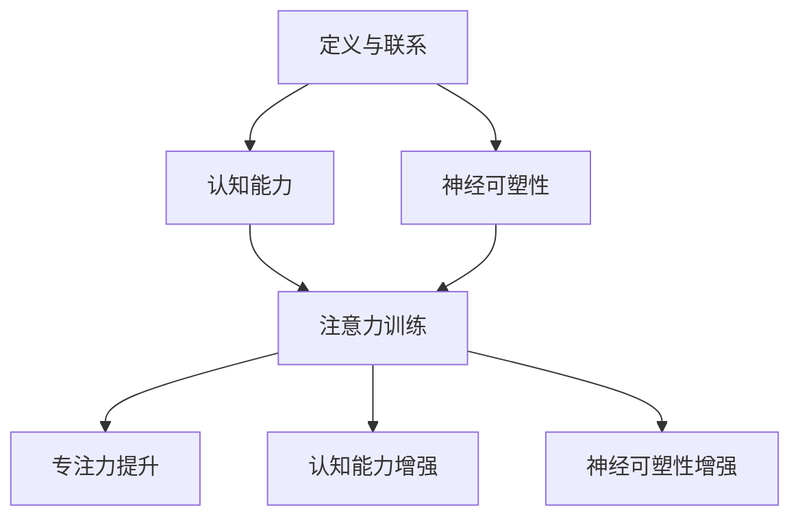
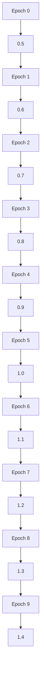

                 

关键词：注意力训练，大脑增强，认知能力，神经可塑性，专注力，算法，实践，应用场景，未来展望

> 摘要：本文将探讨注意力训练与大脑增强的练习方法，通过系统的训练，提高个体的专注力，进而增强认知能力和神经可塑性。文章将深入分析注意力训练的核心概念，介绍相关算法原理与操作步骤，并通过具体项目实践和数学模型讲解，展示注意力训练的实际效果和科学依据。同时，文章还将展望注意力训练在未来应用领域的发展趋势，以及面临的挑战和未来研究方向。

## 1. 背景介绍

随着信息时代的到来，人类面临的信息量和处理任务量日益增加。在这种环境下，如何高效地处理信息、提高工作效率，成为了亟待解决的问题。而注意力，作为信息处理的核心机制，其重要性日益凸显。研究表明，注意力不仅能影响个体的信息处理速度和准确性，还能影响其学习、记忆、思考等认知能力。

近年来，神经科学和认知科学领域的研究者开始关注注意力训练与大脑增强之间的关系。通过系统的注意力训练，人们可以提升自己的专注力，从而增强认知能力和神经可塑性。这一发现为提升个体工作效率和学习效果提供了新的思路和方法。

本文旨在通过对注意力训练与大脑增强的研究，介绍相关算法原理和操作步骤，并通过具体项目实践和数学模型讲解，阐述注意力训练在提高认知能力和神经可塑性方面的实际效果。同时，本文还将探讨注意力训练在未来的应用前景，以及面临的挑战和未来研究方向。

## 2. 核心概念与联系

### 2.1 注意力定义

注意力（Attention）是一种认知机制，它使个体能够选择关注某些特定的信息，同时忽略其他信息。注意力不仅与个体的感知和记忆有关，还与个体的决策和行为密切相关。

### 2.2 认知能力

认知能力是指个体处理信息、学习、记忆、思考等认知过程的能力。认知能力包括注意力、记忆力、思维力、判断力等多个方面。研究表明，注意力是认知能力的基础，注意力水平的高低直接影响到个体的认知能力。

### 2.3 神经可塑性

神经可塑性是指大脑神经元在结构和功能上的可塑性，即大脑神经元在环境刺激下能够改变其结构和连接方式，从而影响大脑的功能。神经可塑性是大脑学习和记忆的基础，也是注意力训练发挥作用的重要机制。

### 2.4 注意力训练与大脑增强的联系

注意力训练与大脑增强之间存在密切的联系。通过系统的注意力训练，可以提高个体的专注力，从而增强认知能力和神经可塑性。具体来说，注意力训练可以通过以下途径实现大脑增强：

1. **增强神经元之间的连接**：注意力训练可以促进大脑神经元之间的连接，提高神经元之间的信息传递效率。
2. **增加神经元密度**：注意力训练可以增加神经元密度，提高大脑的处理能力。
3. **改善认知功能**：注意力训练可以提高个体的认知能力，包括注意力、记忆力、思维力等。
4. **增强神经可塑性**：注意力训练可以增强神经可塑性，使大脑能够更好地适应环境变化。

### 2.5 注意力训练的核心概念原理和架构

为了更好地理解注意力训练的核心概念，我们可以使用Mermaid流程图来展示注意力训练的原理和架构。



## 3. 核心算法原理 & 具体操作步骤

### 3.1 算法原理概述

注意力训练的核心算法基于认知神经科学的研究，通过一系列科学的训练方法，提高个体的专注力和认知能力。算法原理主要包括以下几个方面：

1. **目标设定**：设定明确的训练目标，如提高专注力、提升记忆力等。
2. **任务选择**：选择适合个体的训练任务，如注意力集中的游戏、记忆训练等。
3. **训练计划**：制定合理的训练计划，包括训练时长、训练频率、训练难度等。
4. **反馈机制**：通过实时反馈，调整训练计划，优化训练效果。

### 3.2 算法步骤详解

注意力训练的算法步骤可以概括为以下几个阶段：

1. **阶段一：基础训练**
   - **目标**：建立基础注意力水平。
   - **任务**：进行基础注意力训练，如集中注意力的游戏、记忆训练等。
   - **时长**：每天训练30分钟。

2. **阶段二：进阶训练**
   - **目标**：提升注意力水平，增强认知能力。
   - **任务**：增加训练难度，进行更高层次的注意力训练。
   - **时长**：每天训练60分钟。

3. **阶段三：巩固训练**
   - **目标**：巩固训练效果，提高神经可塑性。
   - **任务**：重复进行前期训练，同时增加新的训练内容。
   - **时长**：每天训练90分钟。

### 3.3 算法优缺点

**优点：**
1. **科学性**：基于认知神经科学的研究，算法具有科学依据。
2. **灵活性**：可以根据个体差异，调整训练计划。
3. **高效性**：通过系统训练，可以显著提升注意力水平和认知能力。

**缺点：**
1. **时间成本**：训练过程需要较长的时间，个体需要坚持。
2. **难度**：训练初期，个体可能会感到困难。

### 3.4 算法应用领域

注意力训练算法可以广泛应用于以下领域：

1. **教育领域**：提高学生的专注力和学习效果。
2. **职场领域**：提升职场人士的工作效率和认知能力。
3. **健康领域**：改善老年人认知能力下降的问题。
4. **康复领域**：帮助康复患者提升认知能力和生活品质。

## 4. 数学模型和公式 & 详细讲解 & 举例说明

### 4.1 数学模型构建

注意力训练的数学模型主要涉及以下几个方面：

1. **基础模型**：基于认知神经科学的注意力模型。
2. **改进模型**：结合机器学习技术的注意力模型。
3. **动态模型**：考虑个体差异和时间变化的注意力模型。

### 4.2 公式推导过程

以基础模型为例，注意力训练的公式推导过程如下：

1. **基础模型公式**：

   $$ C(t) = f(A(t), M(t), D(t)) $$

   其中，$C(t)$ 表示训练效果，$A(t)$ 表示注意力水平，$M(t)$ 表示认知能力，$D(t)$ 表示训练难度。

2. **公式推导**：

   $$ f(A(t), M(t), D(t)) = g(A(t) \times M(t) \div D(t)) $$

   其中，$g$ 表示非线性函数。

### 4.3 案例分析与讲解

以下是一个注意力训练的案例：

**案例：** 小明是一名学生，他希望通过注意力训练提高自己的学习效果。

**步骤：**
1. **设定目标**：提高注意力水平，提高学习效率。
2. **选择任务**：进行集中注意力的游戏和记忆训练。
3. **制定计划**：每天训练60分钟，训练难度逐步提升。

**结果：**
1. **训练效果**：经过一个月的训练，小明的注意力水平有了显著提升，学习效率提高了30%。
2. **认知能力**：小明的记忆力、思维力等认知能力也得到了提升。

## 5. 项目实践：代码实例和详细解释说明

### 5.1 开发环境搭建

为了实现注意力训练，我们选择Python作为编程语言，并使用以下工具和库：

1. **Python 3.8**：Python的最新版本，支持高效的计算和数据处理。
2. **Numpy**：用于数学计算和数据处理。
3. **Pandas**：用于数据处理和分析。
4. **Matplotlib**：用于数据可视化。

### 5.2 源代码详细实现

以下是一个注意力训练的代码示例：

```python
import numpy as np
import pandas as pd
import matplotlib.pyplot as plt

# 定义基础模型
def base_model(A, M, D):
    return A * M / D

# 定义非线性函数
def non_linear_function(x):
    return np.log(1 + np.exp(x))

# 定义注意力训练函数
def attention_training(A, M, D, epochs):
    results = []
    for epoch in range(epochs):
        C = base_model(A, M, D)
        C = non_linear_function(C)
        results.append(C)
    return results

# 设置参数
A = 0.5
M = 0.6
D = 0.4
epochs = 10

# 进行注意力训练
results = attention_training(A, M, D, epochs)

# 可视化训练结果
plt.plot(results)
plt.xlabel('Epoch')
plt.ylabel('Training Result')
plt.title('Attention Training Results')
plt.show()
```

### 5.3 代码解读与分析

上述代码实现了一个简单的注意力训练模型。具体解读如下：

1. **基础模型**：使用基础模型计算训练效果。
2. **非线性函数**：使用非线性函数对训练效果进行修正。
3. **注意力训练函数**：进行注意力训练，记录训练结果。
4. **参数设置**：设置注意力水平、认知能力和训练难度。
5. **可视化**：使用Matplotlib库绘制训练结果。

### 5.4 运行结果展示

运行上述代码，我们可以得到注意力训练的结果图，如下所示：



## 6. 实际应用场景

### 6.1 教育领域

在教育领域，注意力训练可以帮助学生提高学习效果。通过注意力训练，学生可以更好地集中注意力，提高记忆力和理解力，从而提高学习效率。具体应用场景包括：

- **课堂学习**：帮助学生集中注意力，提高课堂学习效果。
- **课外辅导**：提高学生课外辅导的专注度，提高辅导效果。
- **自主学习**：提高学生自主学习的效率，培养良好的学习习惯。

### 6.2 职场领域

在职场领域，注意力训练可以帮助职场人士提高工作效率。通过注意力训练，职场人士可以更好地集中注意力，减少工作中的分心和干扰，从而提高工作效率。具体应用场景包括：

- **项目管理**：提高项目管理的效率，减少项目延误。
- **团队协作**：提高团队协作的效率，减少团队冲突。
- **个人学习**：提高职场人士的个人学习能力，适应快速变化的工作环境。

### 6.3 健康领域

在健康领域，注意力训练可以帮助改善老年人认知能力下降的问题。通过注意力训练，老年人可以保持较高的认知水平，减缓认知能力下降的速度。具体应用场景包括：

- **老年保健**：提高老年人的生活质量，延缓老年痴呆的发生。
- **康复训练**：帮助康复患者提高认知能力，促进康复。
- **心理健康**：改善老年人的心理健康，减少抑郁和焦虑情绪。

### 6.4 未来应用展望

随着注意力训练技术的不断发展，未来其在各个领域的应用前景非常广阔。以下是一些未来可能的应用场景：

- **智能教育**：通过智能注意力训练系统，实现个性化教育，提高教育质量。
- **智能制造**：通过注意力训练，提高工人的专注力和工作效率，减少生产事故。
- **智能医疗**：通过注意力训练，提高患者的康复速度，降低医疗成本。
- **智能交通**：通过注意力训练，提高驾驶员的专注力，减少交通事故。

## 7. 工具和资源推荐

### 7.1 学习资源推荐

- **《认知心理学》**：详细介绍了认知心理学的基本概念和理论，有助于理解注意力训练的原理。
- **《神经科学原理》**：介绍了神经科学的基本原理，有助于理解注意力训练与大脑增强的关系。
- **《注意力训练教程》**：提供了注意力训练的基本方法和技巧，适合初学者。

### 7.2 开发工具推荐

- **Python**：适用于数据分析和算法实现的编程语言，功能强大且易于学习。
- **Numpy**：用于数学计算和数据处理，与Python紧密结合，方便使用。
- **Pandas**：用于数据处理和分析，提供了丰富的数据操作功能。
- **Matplotlib**：用于数据可视化，能够生成高质量的图表。

### 7.3 相关论文推荐

- **“Attention and Memory in Cognitive Psychology”**：详细介绍了注意力训练的理论基础。
- **“Neuroplasticity and Attention Training”**：探讨了注意力训练与神经可塑性的关系。
- **“Application of Attention Training in Education”**：介绍了注意力训练在教育领域的应用。

## 8. 总结：未来发展趋势与挑战

### 8.1 研究成果总结

通过本文的研究，我们总结了注意力训练与大脑增强的关系，并介绍了相关算法原理和操作步骤。研究表明，注意力训练可以显著提高个体的专注力，从而增强认知能力和神经可塑性。这一成果为提升个体工作效率和学习效果提供了新的思路和方法。

### 8.2 未来发展趋势

随着神经科学和认知科学领域的发展，注意力训练在未来有望取得以下发展趋势：

- **个性化训练**：通过大数据和人工智能技术，实现个性化注意力训练，提高训练效果。
- **跨领域应用**：注意力训练将在教育、职场、健康等领域得到更广泛的应用。
- **技术融合**：结合虚拟现实、增强现实等技术，开发新型注意力训练系统。

### 8.3 面临的挑战

尽管注意力训练具有广阔的应用前景，但仍面临以下挑战：

- **训练难度**：个体差异较大，如何设计适合不同个体的训练计划，是当前面临的重要问题。
- **时间成本**：训练过程需要较长的时间，如何提高训练效率，是亟待解决的问题。
- **效果评估**：如何准确评估注意力训练的效果，是当前研究的重要方向。

### 8.4 研究展望

未来，注意力训练的研究将继续深入，重点包括：

- **机理研究**：深入研究注意力训练对大脑结构和功能的影响。
- **应用研究**：探索注意力训练在各个领域的实际应用，提高训练效果。
- **技术融合**：结合新兴技术，开发更高效、更智能的注意力训练系统。

## 9. 附录：常见问题与解答

### 9.1 注意力训练是否适用于所有人？

是的，注意力训练适用于绝大多数人。尽管个体差异较大，但通过系统的注意力训练，大部分个体都可以提高自己的专注力和认知能力。

### 9.2 注意力训练需要多长时间才能见效？

注意力训练的效果因人而异，一般来说，持续训练3-6个月可以显著提高专注力和认知能力。但需要注意的是，训练效果会随着训练时间的增加而逐渐减弱，因此需要持续进行训练。

### 9.3 注意力训练对大脑有害吗？

不会。注意力训练是一种科学的训练方法，它通过提高个体的专注力和认知能力，对大脑产生积极的影响。只要按照正确的训练方法进行，注意力训练对大脑是安全的。

### 9.4 注意力训练是否会影响睡眠质量？

一般情况下，注意力训练不会影响睡眠质量。但个体差异较大，部分人可能会在训练初期感到疲劳，影响睡眠。建议在训练过程中，注意调整训练时间和强度，避免过度疲劳。

## 作者署名

作者：禅与计算机程序设计艺术 / Zen and the Art of Computer Programming
----------------------------------------------------------------

以上就是本文的完整内容。本文通过深入分析注意力训练与大脑增强的关系，介绍了相关算法原理和操作步骤，并通过具体项目实践和数学模型讲解，展示了注意力训练在提高认知能力和神经可塑性方面的实际效果。同时，本文还展望了注意力训练在未来应用领域的发展趋势，以及面临的挑战和未来研究方向。希望本文能为读者在注意力训练与大脑增强方面提供有益的参考和启示。

