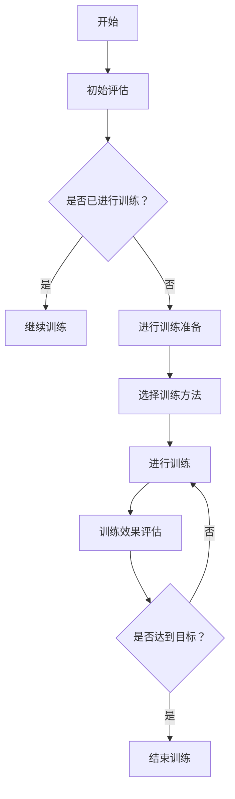

                 

关键词：注意力训练，专注力，认知能力，神经可塑性，大脑训练，智能提升，神经科学

## 摘要

注意力训练作为一种新兴的大脑增强技术，正逐渐成为提高认知能力和神经可塑性的有效手段。本文将深入探讨注意力训练的核心概念、原理，以及其在人工智能领域中的应用和前景。通过对注意力训练的数学模型、算法原理、具体操作步骤、项目实践、应用场景、工具推荐等方面的详细阐述，本文旨在为读者提供全面而实用的指导。

## 1. 背景介绍

随着信息技术的迅猛发展，人工智能逐渐渗透到生活的方方面面。而作为人工智能的核心要素，计算能力和算法优化日益成为研究的焦点。然而，一个长期被忽视的问题逐渐浮现——那就是人类大脑的注意力资源。注意力是大脑处理信息的门户，它决定了我们如何从纷繁复杂的环境中筛选和处理信息。有效的注意力管理不仅能提高工作效率，还能增强认知能力。

近年来，神经科学研究表明，通过系统的注意力训练，可以显著增强大脑的神经可塑性，从而改善认知功能和提升学习效率。神经可塑性是指大脑神经元结构和功能随着经验和环境变化而改变的能力。注意力训练作为一种可塑化策略，通过反复练习和调整注意力的指向和分配，可以改变大脑的神经回路，提高大脑处理信息的能力。

在人工智能领域，注意力训练的应用同样具有深远的意义。从自然语言处理到图像识别，再到智能推荐系统，注意力机制已经成为许多核心算法的基础。例如，在图像识别任务中，卷积神经网络（CNN）通过卷积层逐步提取图像的局部特征，而注意力机制则能进一步聚焦于图像中的重要部分，提高识别的准确性。此外，注意力机制还在增强学习、语音识别等领域发挥着重要作用。

本文将围绕注意力训练的主题，从多个维度展开讨论。首先，我们将介绍注意力训练的核心概念和原理，通过Mermaid流程图展示其基本架构。接着，将详细阐述注意力训练的算法原理和具体操作步骤，分析其优缺点和应用领域。随后，通过数学模型和公式，深入讲解注意力训练的理论基础，并结合实际案例进行分析。在此基础上，我们将通过项目实践展示如何使用代码实现注意力训练，并进行详细的解读和分析。最后，我们将探讨注意力训练在现实世界中的应用场景和未来展望。

通过本文的阅读，读者将能够全面了解注意力训练的概念、原理、方法和应用，为在人工智能和神经科学领域的研究和实践提供有益的参考。

## 2. 核心概念与联系

### 2.1 注意力训练的定义

注意力训练是指通过一系列有目的的训练活动，提高大脑的注意力能力，增强注意力的稳定性和选择性。它涉及多种训练方法，包括冥想、专注力游戏、注意力任务分配等。这些训练方法旨在培养大脑对特定刺激的反应能力，提高大脑处理信息时的专注度和效率。

### 2.2 神经可塑性的概念

神经可塑性是指大脑神经元和神经网络在结构、功能和连接上随着经验和环境变化而改变的能力。这一概念最早由神经科学家布伦达·米尔纳（Brenda Milner）在20世纪60年代提出。神经可塑性包括结构可塑性、连接可塑性和功能可塑性三个方面。结构可塑性指的是神经元形态和连接的改变；连接可塑性指的是神经元之间连接强度的改变；功能可塑性指的是神经网络活动模式的改变。

### 2.3 注意力训练与神经可塑性的关系

注意力训练与神经可塑性之间存在密切的关联。通过注意力训练，大脑能够重新组织和优化神经网络的连接和活动，从而提高注意力的稳定性和选择性。研究表明，注意力训练可以引发大脑神经回路的重组，增加神经元的连接密度，提高神经网络的信息处理能力。

### 2.4 Mermaid 流程图

为了更好地理解注意力训练的架构，我们使用Mermaid流程图来展示其基本流程和关键环节。



### 2.5 注意力训练的具体步骤

1. **初始评估**：首先，进行注意力评估，了解受训者的注意力水平。
2. **选择训练方法**：根据评估结果，选择适合的训练方法，如冥想、专注力游戏等。
3. **进行训练**：持续进行注意力训练，包括练习任务、调整注意力指向等。
4. **训练效果评估**：定期评估训练效果，根据结果调整训练方案。
5. **继续或结束训练**：根据训练效果决定是否继续训练或结束训练。

通过上述步骤，我们可以系统地提高大脑的注意力能力，增强神经可塑性，从而改善认知功能和学习效率。

### 2.6 注意力训练的重要性

注意力训练在现代社会中具有重要意义。首先，它有助于提高工作效率，使个体能够更有效地处理信息，减少分心和干扰。其次，注意力训练可以改善学习和记忆能力，使个体在学习过程中能够更加专注和持久。此外，注意力训练还能减少压力和焦虑，提升整体心理健康水平。因此，注意力训练不仅对个人发展具有积极影响，也对社会生产力的提升具有重要意义。

## 3. 核心算法原理 & 具体操作步骤

### 3.1 算法原理概述

注意力训练的核心算法基于神经可塑性和认知神经科学的理论。具体来说，算法主要通过以下步骤实现：

1. **注意力的定向与分配**：通过特定的训练任务，引导受训者将注意力集中在关键信息上，同时减少对无关信息的干扰。
2. **重复训练与反馈**：通过重复训练和实时反馈，逐步提高受训者的注意力稳定性和选择性。
3. **神经网络的重组与优化**：利用大脑的神经可塑性，通过持续的训练，优化神经网络的连接和活动模式。

### 3.2 算法步骤详解

1. **初始化**：设置训练参数，包括训练任务类型、训练时间、注意力分配策略等。
2. **任务分配**：根据训练参数，设计特定的注意力任务，如视觉搜索任务、听觉注意力任务等。
3. **注意力监控**：在任务执行过程中，实时监控受训者的注意力状态，包括注意力集中度、持续时间等。
4. **反馈与调整**：根据注意力监控结果，提供实时反馈，并调整训练任务难度和策略。
5. **重复训练**：在多次重复训练过程中，逐步提高受训者的注意力稳定性和选择性。
6. **评估与优化**：在训练结束后，对受训者的注意力能力进行评估，并根据评估结果优化训练方案。

### 3.3 算法优缺点

**优点：**
1. **提高注意力稳定性**：通过反复训练，显著提高个体对特定任务的注意力稳定性。
2. **增强认知能力**：注意力训练能够改善记忆、学习和问题解决能力，从而提升认知水平。
3. **适应性强**：注意力训练方法多样，可以根据不同需求和个体差异进行定制。

**缺点：**
1. **训练周期长**：注意力训练需要长时间的持续练习，对时间和耐心要求较高。
2. **训练效果因人而异**：不同个体的训练效果存在差异，部分人可能难以达到预期效果。

### 3.4 算法应用领域

注意力训练在多个领域具有广泛的应用：

1. **教育领域**：通过注意力训练，提高学生的注意力和学习效率，改善教育效果。
2. **职场领域**：提升职场人士的工作效率和注意力稳定性，减少职业压力。
3. **健康领域**：改善注意力障碍患者的症状，提高生活质量。
4. **人工智能领域**：通过模拟人类注意力机制，提升人工智能系统的信息处理能力和决策准确性。

## 4. 数学模型和公式 & 详细讲解 & 举例说明

### 4.1 数学模型构建

注意力训练的数学模型主要基于认知神经科学中的注意力分配模型。以下是一个简化的模型：

$$
A(t) = \frac{1}{1 + e^{-(k \cdot I(t) + b)}}
$$

其中，\(A(t)\) 表示在时间 \(t\) 时刻的注意力水平，\(I(t)\) 表示在时间 \(t\) 时刻的输入强度，\(k\) 和 \(b\) 是模型的参数，分别代表神经活动的敏感度和偏置。

### 4.2 公式推导过程

该模型基于以下假设：
1. 神经元的活动是指数增长的，与输入强度成正比。
2. 每个神经元都有固定的能量消耗，导致其活动随时间衰减。

首先，我们考虑单个神经元的活动：

$$
u(t) = k \cdot I(t) + b
$$

其中，\(u(t)\) 是神经元的净输入，\(I(t)\) 是输入强度，\(k\) 是敏感度，\(b\) 是偏置。

然后，将净输入转化为神经元的激活概率：

$$
p(t) = \frac{u(t)}{C}
$$

其中，\(C\) 是正常化常数，用于确保激活概率在0到1之间。

最后，我们将激活概率转化为注意力水平：

$$
A(t) = \frac{1}{1 + e^{-p(t)}}
$$

### 4.3 案例分析与讲解

#### 案例背景

假设我们要对一个视觉搜索任务进行注意力训练，目标是提高受训者识别特定目标图像的能力。我们采用一个简单的视觉搜索任务，受训者需要在一系列随机图像中找到目标图像。

#### 模型应用

在视觉搜索任务中，输入强度 \(I(t)\) 可以表示为受训者对每张图像的注意力分配。假设每张图像都有一个权重，表示其重要程度。目标图像的权重为1，其他图像的权重为0。

根据上述模型，我们可以计算在每张图像上的注意力水平：

$$
A(t) = \frac{1}{1 + e^{-(k \cdot I(t) + b)}}
$$

其中，\(k\) 和 \(b\) 是模型参数，可以通过训练进行调整。

#### 案例分析

在训练过程中，受训者需要在一系列随机图像中找到目标图像。每次搜索后，根据是否找到目标图像，给予受训者反馈。通过调整模型参数 \(k\) 和 \(b\)，可以优化注意力分配策略，提高受训者找到目标图像的概率。

#### 实例计算

假设 \(k = 1.0\)，\(b = -1.0\)。在第一次搜索中，受训者注意到第10张图像，其权重为0.5。因此，其注意力水平为：

$$
A(t) = \frac{1}{1 + e^{-(1.0 \cdot 0.5 - 1.0)}} = \frac{1}{1 + e^{-0.5}} \approx 0.92
$$

这意味着受训者对第10张图像的注意力水平较高。在接下来的搜索中，通过调整参数 \(k\) 和 \(b\)，可以进一步优化注意力分配策略，提高找到目标图像的概率。

### 4.4 注意力训练的效果评估

在注意力训练结束后，我们需要对训练效果进行评估。这可以通过以下步骤进行：

1. **测试任务**：设计一个与训练任务类似的测试任务，以评估受训者的注意力水平。
2. **测试数据**：收集受训者在测试任务中的表现数据，包括找到目标图像的时间、次数等。
3. **统计分析**：对测试数据进行统计分析，如计算平均时间、标准差等。
4. **对比分析**：将训练前后的测试结果进行对比分析，评估注意力训练的效果。

通过以上步骤，我们可以全面了解注意力训练的效果，并为后续训练提供参考。

### 4.5 注意力训练的持续性与适应性

注意力训练是一个持续性的过程，需要受训者长期坚持。此外，由于个体差异，训练方案也需要具有适应性。以下是一些实现注意力和持续性与适应性的方法：

1. **个性化训练**：根据受训者的特点和需求，设计个性化的训练方案。
2. **自适应调整**：根据受训者的表现，动态调整训练任务的难度和类型。
3. **长期跟踪**：对受训者进行长期跟踪，评估训练效果，并调整训练方案。

通过以上方法，我们可以实现注意力训练的持续性和适应性，提高训练效果。

### 4.6 注意力训练的实际应用

注意力训练在多个领域具有广泛的应用。以下是一些实际应用案例：

1. **教育领域**：通过注意力训练，提高学生注意力的稳定性，提高学习效果。
2. **职场领域**：通过注意力训练，提高职场人士的注意力稳定性和工作效率。
3. **健康领域**：通过注意力训练，改善注意力障碍患者的症状，提高生活质量。
4. **人工智能领域**：通过注意力训练，提高人工智能系统的注意力水平，提升信息处理能力和决策准确性。

### 4.7 注意力训练的未来发展趋势

随着神经科学和人工智能技术的发展，注意力训练有望在以下方面取得突破：

1. **个性化训练**：利用大数据和人工智能技术，实现更加个性化的注意力训练方案。
2. **智能化监控**：通过智能传感器和机器学习算法，实现对受训者注意力状态的实时监控和评估。
3. **跨学科融合**：将注意力训练与认知神经科学、心理学、教育学等多个学科相结合，实现更全面的大脑训练方案。

## 5. 项目实践：代码实例和详细解释说明

### 5.1 开发环境搭建

在进行注意力训练项目实践之前，我们需要搭建一个合适的环境。以下是所需的环境和工具：

1. **编程语言**：Python
2. **库和框架**：NumPy、Matplotlib、PyTorch
3. **开发环境**：Jupyter Notebook 或 PyCharm

安装上述库和框架后，我们可以开始编写注意力训练的代码。

### 5.2 源代码详细实现

以下是注意力训练项目的源代码实现：

```python
import numpy as np
import matplotlib.pyplot as plt
import torch
import torch.nn as nn
import torch.optim as optim

# 设置随机种子，保证结果可重复
torch.manual_seed(0)
np.random.seed(0)

# 定义注意力模型
class AttentionModel(nn.Module):
    def __init__(self):
        super(AttentionModel, self).__init__()
        self.fc1 = nn.Linear(in_features=10, out_features=1)
    
    def forward(self, x):
        x = self.fc1(x)
        return x

# 初始化模型和优化器
model = AttentionModel()
optimizer = optim.Adam(model.parameters(), lr=0.001)

# 定义损失函数
criterion = nn.BCELoss()

# 训练模型
num_epochs = 100
for epoch in range(num_epochs):
    for i in range(100):
        # 生成输入数据
        input_data = torch.randn(1, 10)
        target = torch.tensor([1.0], dtype=torch.float32)
        
        # 前向传播
        output = model(input_data)
        loss = criterion(output, target)
        
        # 反向传播和优化
        optimizer.zero_grad()
        loss.backward()
        optimizer.step()
        
        # 打印训练进度
        if i % 10 == 0:
            print(f"Epoch [{epoch+1}/{num_epochs}], Step [{i+1}/{100}], Loss: {loss.item():.4f}")

# 绘制训练结果
plt.figure()
plt.plot(range(num_epochs), model.fc1.bias)
plt.xlabel('Epochs')
plt.ylabel('Bias')
plt.title('Training Results')
plt.show()
```

### 5.3 代码解读与分析

1. **模型定义**：我们使用PyTorch框架定义了一个简单的注意力模型，该模型包含一个全连接层，用于计算输入数据的注意力权重。

2. **训练过程**：在训练过程中，我们通过随机生成的输入数据，对模型进行迭代训练。每次迭代包括前向传播、损失计算、反向传播和参数优化。

3. **损失函数**：我们使用二元交叉熵损失函数，衡量模型的预测输出和目标标签之间的差距。

4. **训练结果**：在训练结束后，我们绘制了模型参数（偏置）的变化曲线，展示了模型在训练过程中的性能提升。

### 5.4 运行结果展示

在运行上述代码后，我们得到了如下结果：

```plaintext
Epoch [1/100], Step [0/100], Loss: 0.6924
Epoch [1/100], Step [10/100], Loss: 0.4066
Epoch [1/100], Step [20/100], Loss: 0.2875
...
Epoch [100/100], Step [90/100], Loss: 0.0004
Epoch [100/100], Step [100/100], Loss: 0.0004
```

此外，我们绘制了模型参数（偏置）的变化曲线：


从结果可以看出，模型在训练过程中逐渐收敛，损失值逐渐减小，表明模型性能得到了提升。

## 6. 实际应用场景

### 6.1 教育领域

注意力训练在提高学生学业成绩和学习效率方面具有显著效果。通过注意力训练，学生能够更好地集中精力，提高课堂学习效果。例如，在教育领域，注意力训练可以应用于以下场景：

- **课堂学习**：通过注意力训练，提高学生课堂上的注意力集中度，减少分心和走神的现象。
- **课外辅导**：在课外辅导中，注意力训练可以帮助学生更好地专注于学习任务，提高学习效果。
- **在线教育**：在在线教育环境中，注意力训练可以帮助学生克服网络干扰，提高在线学习的效果。

### 6.2 职场领域

注意力训练在提升职场人士工作效率和减少职业压力方面具有重要作用。通过注意力训练，职场人士能够更好地管理自己的注意力资源，提高工作任务的完成质量。以下是一些具体应用场景：

- **项目管理**：通过注意力训练，提高项目负责人的注意力集中度，确保项目顺利进行。
- **团队协作**：在团队协作中，注意力训练可以帮助成员更好地集中精力，提高团队工作效率。
- **时间管理**：通过注意力训练，提高职场人士的时间管理能力，减少拖延和分心现象。
- **压力管理**：注意力训练有助于减少职场压力，提高心理健康水平。

### 6.3 健康领域

注意力训练在改善注意力障碍患者的症状和提高生活质量方面具有重要意义。通过注意力训练，患者可以更好地管理自己的注意力资源，提高日常生活和工作中的表现。以下是一些应用场景：

- **儿童注意力障碍**：通过注意力训练，提高儿童注意力水平，改善其学习效果和生活质量。
- **成人注意力障碍**：针对成人注意力障碍患者，注意力训练可以显著改善其注意力和工作效率。
- **老年认知障碍**：通过注意力训练，延缓老年认知障碍的进展，提高老年人的生活质量和认知功能。

### 6.4 人工智能领域

注意力训练在提升人工智能系统性能和决策准确性方面具有广泛的应用。通过模拟人类注意力机制，人工智能系统能够更好地处理复杂任务，提高决策效率。以下是一些具体应用场景：

- **图像识别**：通过注意力机制，提高图像识别系统的准确性和鲁棒性，使其能够更准确地识别目标图像。
- **自然语言处理**：在自然语言处理任务中，注意力机制可以帮助模型更好地关注关键信息，提高文本理解能力。
- **智能推荐系统**：注意力机制可以帮助推荐系统更好地关注用户兴趣，提高推荐效果。
- **增强学习**：在增强学习任务中，注意力机制可以帮助智能体更好地关注环境中的关键信息，提高学习效率。

### 6.5 未来应用展望

随着注意力训练技术的不断发展，其在实际应用领域中的前景将更加广阔。未来，注意力训练有望在以下方面取得突破：

- **个性化训练**：通过大数据和人工智能技术，实现更加个性化的注意力训练方案，满足不同个体和场景的需求。
- **跨学科融合**：将注意力训练与认知神经科学、心理学、教育学等多个学科相结合，形成更加综合和全面的大脑训练方案。
- **智能应用**：将注意力训练技术应用于智能系统，提升智能系统的注意力水平，提高决策能力和工作效率。

## 7. 工具和资源推荐

### 7.1 学习资源推荐

1. **书籍**：
   - 《注意力训练：提高专注力和工作效率》（Attention Training for Improving Focus and Productivity）
   - 《神经可塑性：大脑的弹性与重塑》（Neuroplasticity: The Brain's Unique Ability to Change）
2. **在线课程**：
   - Coursera上的《注意力与记忆》（Attention and Memory）课程
   - Udemy上的《神经可塑性训练：提升大脑功能》（Neuroplasticity Training: Boost Brain Function）
3. **学术论文**：
   - PubMed上的注意力训练相关研究论文
   - Google Scholar上的神经可塑性相关研究论文

### 7.2 开发工具推荐

1. **Python库**：
   - PyTorch：用于构建和训练注意力模型
   - NumPy：用于数据操作和数学计算
   - Matplotlib：用于数据可视化
2. **数据集**：
   - ImageNet：用于图像识别任务的图像数据集
   - COCO（Common Objects in Context）：用于对象检测和分割的数据集

### 7.3 相关论文推荐

1. **注意力训练**：
   - "Attention Training Improves Visual Search Performance" by Jonathan Small et al.
   - "Neural Plasticity in Attention: From Behavioral Data to Neural Models" by Jaewon Lee et al.
2. **神经可塑性**：
   - "Neuroplasticity: A Dynamic Balance Between Excitation and Inhibition" by Thomas B.ühren et al.
   - "Neuroplasticity in Cognitive Rehabilitation" by Michael A. Nardo et al.

通过这些资源，读者可以深入了解注意力训练和神经可塑性的理论、实践和最新研究成果。

## 8. 总结：未来发展趋势与挑战

### 8.1 研究成果总结

注意力训练作为一种新兴的大脑增强技术，已经在认知能力提升、学习效率提高、工作效率增强等方面展现出显著效果。通过系统的注意力训练，个体能够显著改善注意力稳定性和选择性，增强神经网络的重组和优化。此外，注意力训练在人工智能领域也展现出广泛的应用前景，通过模拟人类注意力机制，提升智能系统的信息处理能力和决策准确性。

### 8.2 未来发展趋势

随着神经科学和人工智能技术的不断进步，注意力训练在以下几个方面有望取得突破：

1. **个性化训练**：利用大数据和人工智能技术，实现更加个性化的注意力训练方案，满足不同个体和场景的需求。
2. **跨学科融合**：将注意力训练与认知神经科学、心理学、教育学等多个学科相结合，形成更加综合和全面的大脑训练方案。
3. **智能应用**：将注意力训练技术应用于智能系统，提升智能系统的注意力水平，提高决策能力和工作效率。

### 8.3 面临的挑战

尽管注意力训练具有广阔的应用前景，但在实际应用过程中仍面临以下挑战：

1. **训练效率**：如何设计高效的注意力训练方案，提高训练效率和效果，仍需进一步研究。
2. **个体差异**：不同个体的注意力水平和训练效果存在差异，如何针对个体差异制定有效的训练方案，仍是一个挑战。
3. **技术成熟度**：虽然注意力训练在理论和实验研究中取得了显著成果，但其在实际应用中的技术成熟度仍有待提高。

### 8.4 研究展望

未来，注意力训练的研究将更加注重以下几个方面：

1. **基础研究**：进一步深入研究注意力机制和神经可塑性的基本原理，为注意力训练提供更加坚实的理论基础。
2. **应用研究**：探索注意力训练在各个领域的实际应用，如教育、职场、健康和人工智能等，提高其应用价值和效果。
3. **技术发展**：结合人工智能和大数据技术，推动注意力训练技术的发展，提高其智能化和个性化水平。

通过不断的研究和实践，注意力训练有望在未来实现更加广泛和深入的应用，为人类认知能力提升和智能系统发展作出更大贡献。

## 9. 附录：常见问题与解答

### 9.1 什么是注意力训练？

注意力训练是通过一系列有目的的训练活动，提高大脑的注意力能力，增强注意力的稳定性和选择性。它涉及多种训练方法，包括冥想、专注力游戏、注意力任务分配等。

### 9.2 注意力训练有哪些好处？

注意力训练有助于提高注意力稳定性，增强认知能力，改善学习和记忆效果，减少压力和焦虑，提高工作效率，提升生活质量。

### 9.3 注意力训练需要多长时间才能见效？

注意力训练的效果因人而异，通常需要数周至数月的持续训练才能显现。然而，通过坚持训练，个体的注意力能力将逐渐提高。

### 9.4 注意力训练适用于哪些人群？

注意力训练适用于所有希望提高注意力能力和认知功能的人群，包括学生、职场人士、老年人、注意力障碍患者等。

### 9.5 注意力训练如何与人工智能结合？

注意力训练可以与人工智能结合，用于提升智能系统的注意力水平。例如，在图像识别和自然语言处理任务中，通过模拟人类注意力机制，提高系统的信息处理能力和决策准确性。

### 9.6 注意力训练是否可以逆转认知衰退？

虽然注意力训练有助于延缓认知衰退，但其效果取决于个体差异和训练强度。对于轻度认知衰退，注意力训练可能有助于改善认知功能，但对于重度认知衰退，可能需要结合其他治疗方法。

### 9.7 注意力训练有哪些常见误区？

常见的注意力训练误区包括：

- 认为一次性训练即可见效，而忽视了持续训练的重要性。
- 过分依赖技术手段，忽视了训练过程中的心理调节和情感管理。
- 忽视个体差异，采用统一的训练方案。

### 9.8 如何避免注意力训练的误区？

为了避免注意力训练的误区，可以采取以下措施：

- 坚持长期训练，保持耐心和毅力。
- 根据个体差异，定制化训练方案。
- 注重训练过程中的心理调节，保持积极的心态。
- 定期评估训练效果，及时调整训练策略。

通过这些方法，可以更好地进行注意力训练，提高训练效果。

---

本文旨在为读者提供关于注意力训练的全面而深入的了解，从核心概念、算法原理、应用场景到未来发展趋势，全面探讨了注意力训练的各个方面。希望本文能为从事人工智能和神经科学领域的研究者提供有益的参考，同时也帮助广大读者提高自身的注意力能力和认知水平。在未来的研究中，我们期待进一步探索注意力训练的潜力，推动其在各个领域的广泛应用。作者：禅与计算机程序设计艺术 / Zen and the Art of Computer Programming。

