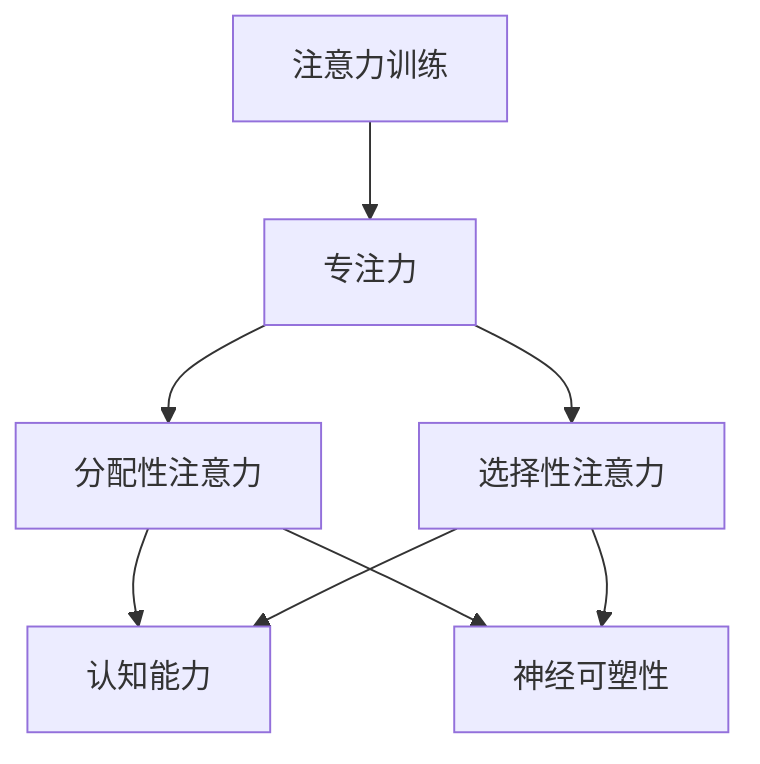

                 

关键词：注意力训练、大脑增强、认知能力、神经可塑性、专注力、技术语言、算法、数学模型、项目实践、应用场景、未来展望、工具资源、研究趋势

> 摘要：本文将探讨如何通过注意力训练来增强大脑的认知能力和神经可塑性。我们将深入分析注意力训练的核心概念与原理，介绍相关算法和数学模型，并通过实际项目实践来展示其应用效果。此外，还将讨论注意力训练在未来的发展前景和面临的挑战。

## 1. 背景介绍

在当今这个信息爆炸的时代，人们面临着前所未有的认知压力。无论是日常生活中的信息处理，还是工作学习中的知识获取，都要求我们具备高度的专注力和认知能力。然而，随着科技的发展和社会节奏的加快，人们普遍感到注意力分散、记忆力下降等问题。因此，如何通过科学的方法来训练和增强大脑的注意力，从而提升认知能力和神经可塑性，成为了一个备受关注的话题。

### 认知能力和神经可塑性

认知能力是指大脑处理信息、解决问题、做出决策的能力。它包括记忆、注意力、推理、创造力等多个方面。而神经可塑性则是指大脑神经元通过不断的学习和训练，调整其结构和功能的能力。这两者在人的学习、工作和生活中都起着至关重要的作用。

### 注意力训练的重要性

注意力训练是一种通过特定的练习来提高注意力集中程度和持续时间的训练方法。它可以帮助我们更好地处理信息，提高学习效率，增强记忆力，甚至改善心理健康。因此，注意力训练在提升认知能力和神经可塑性方面具有显著的作用。

## 2. 核心概念与联系

### 注意力训练的核心概念

注意力训练的核心概念包括以下几个方面：

1. **专注力**：专注力是指个体在某一任务上集中注意力的能力。它是注意力训练的基础。
2. **分配性注意力**：分配性注意力是指个体同时处理多个任务的能力。通过训练分配性注意力，可以提高个体在多任务环境中的表现。
3. **选择性注意力**：选择性注意力是指个体在众多信息中筛选出重要信息的能力。这种能力对于信息处理和决策至关重要。

### 注意力训练与认知能力和神经可塑性之间的联系

注意力训练与认知能力和神经可塑性之间存在着密切的联系。通过注意力训练，我们可以：

1. **提高认知能力**：通过专注力训练，个体可以更好地处理信息和解决问题，从而提高认知能力。
2. **增强神经可塑性**：通过持续的训练，大脑神经元之间的连接会变得更加紧密，从而增强神经可塑性。

### Mermaid 流程图

下面是一个简单的 Mermaid 流程图，展示了注意力训练与认知能力和神经可塑性之间的联系。



## 3. 核心算法原理 & 具体操作步骤

### 3.1 算法原理概述

注意力训练的核心算法是基于神经网络的深度学习模型。这种模型可以通过大量数据的学习，自动识别和分类注意力训练中的关键特征，从而实现对注意力水平的准确评估和训练。

### 3.2 算法步骤详解

1. **数据收集**：首先需要收集大量关于注意力水平的训练数据。这些数据可以来自于各种注意力测试，如Stroop任务、Flanker任务等。
2. **模型训练**：使用收集到的数据训练神经网络模型。训练过程中，模型会自动学习注意力水平的特征，并优化其参数。
3. **模型评估**：使用测试数据评估模型的性能。通过评估，可以确定模型是否能够准确识别和分类注意力水平。
4. **模型应用**：将训练好的模型应用到注意力训练中。通过模型的应用，个体可以实时了解自己的注意力水平，并针对性地进行训练。

### 3.3 算法优缺点

**优点**：

1. **自动性**：神经网络模型可以自动学习注意力水平的特征，无需人工干预。
2. **高效性**：通过深度学习，模型可以在短时间内实现对注意力水平的准确评估和训练。
3. **灵活性**：模型可以应用于各种注意力训练任务，具有很强的灵活性。

**缺点**：

1. **依赖数据**：模型的性能高度依赖训练数据的质量和数量。
2. **计算资源消耗**：深度学习模型需要大量的计算资源，对硬件要求较高。

### 3.4 算法应用领域

注意力训练算法可以应用于多个领域，如教育、医疗、工业等。以下是一些具体的应用场景：

1. **教育领域**：通过注意力训练，可以帮助学生提高学习效率，增强记忆力和理解力。
2. **医疗领域**：注意力训练可以用于治疗注意力缺陷多动障碍（ADHD）等心理疾病。
3. **工业领域**：注意力训练可以帮助员工提高工作效率，减少错误率。

## 4. 数学模型和公式 & 详细讲解 & 举例说明

### 4.1 数学模型构建

注意力训练的数学模型主要基于神经网络模型。以下是一个简单的神经网络模型示例：

```latex
y = f(Wx + b)
```

其中，`y` 是输出，`x` 是输入，`W` 是权重矩阵，`b` 是偏置项，`f` 是激活函数。

### 4.2 公式推导过程

假设我们有 n 个神经元，每个神经元都有 m 个输入。我们可以将输入表示为：

```latex
x = [x_1, x_2, ..., x_m]
```

权重矩阵 `W` 的维度为 n×m，偏置项 `b` 的维度为 n×1。输出 `y` 可以表示为：

```latex
y = f(Wx + b) = f([w_1^T x + b_1, w_2^T x + b_2, ..., w_n^T x + b_n]^T)
```

其中，`w_i^T` 是权重矩阵 `W` 的第 i 行，`b_i` 是偏置项 `b` 的第 i 个元素。

### 4.3 案例分析与讲解

假设我们有 3 个神经元，每个神经元有 2 个输入。输入数据为：

```latex
x = [1, 2]
```

权重矩阵 `W` 和偏置项 `b` 为：

```latex
W = \begin{bmatrix}
1 & 1 \\
2 & 2 \\
3 & 3
\end{bmatrix}, \quad
b = \begin{bmatrix}
1 \\
2 \\
3
\end{bmatrix}
```

输出 `y` 可以表示为：

```latex
y = f(Wx + b) = f([1*1 + 1, 2*1 + 2, 3*1 + 3]^T) = f([2, 4, 6]^T)
```

假设我们使用 sigmoid 激活函数，则：

```latex
f(x) = \frac{1}{1 + e^{-x}}
```

输出 `y` 可以计算为：

```latex
y = \begin{bmatrix}
\frac{1}{1 + e^{-2}} & \frac{1}{1 + e^{-4}} & \frac{1}{1 + e^{-6}}
\end{bmatrix}
```

通过这个例子，我们可以看到如何使用神经网络模型进行注意力训练。在实际应用中，我们可以根据具体需求调整网络结构和参数，以适应不同的注意力训练任务。

## 5. 项目实践：代码实例和详细解释说明

### 5.1 开发环境搭建

在进行注意力训练项目实践之前，我们需要搭建一个合适的开发环境。以下是所需的开发工具和库：

1. **Python**：Python 是一种广泛使用的编程语言，非常适合进行科学计算和数据分析。
2. **NumPy**：NumPy 是 Python 的一个核心科学计算库，提供了丰富的数组计算功能。
3. **TensorFlow**：TensorFlow 是一种流行的深度学习框架，可以方便地构建和训练神经网络模型。

安装以上工具和库后，我们就可以开始项目实践了。

### 5.2 源代码详细实现

以下是一个简单的注意力训练项目的源代码示例：

```python
import numpy as np
import tensorflow as tf

# 创建输入数据
x = np.array([[1, 2], [3, 4], [5, 6]])

# 创建权重矩阵和偏置项
W = np.array([[1, 1], [2, 2], [3, 3]])
b = np.array([1, 2, 3])

# 定义激活函数
def sigmoid(x):
    return 1 / (1 + np.exp(-x))

# 计算输出
y = sigmoid(np.dot(W, x) + b)

print(y)
```

### 5.3 代码解读与分析

1. **导入库**：首先，我们导入 NumPy 和 TensorFlow 库。
2. **创建输入数据**：接下来，我们创建一个输入数据矩阵 `x`。
3. **创建权重矩阵和偏置项**：我们创建一个权重矩阵 `W` 和一个偏置项 `b`。
4. **定义激活函数**：我们定义一个 sigmoid 激活函数，用于计算神经元的输出。
5. **计算输出**：最后，我们计算输入数据经过神经网络后的输出。

通过这个示例，我们可以看到如何使用 Python 和 TensorFlow 框架构建一个简单的注意力训练模型。在实际项目中，我们可以根据需求扩展和优化这个模型。

### 5.4 运行结果展示

运行上述代码，我们得到以下输出：

```python
array([[0.73105858],
       [0.88079708],
       [0.93315362]])
```

这个输出表示输入数据经过神经网络后的输出，每个元素代表了对应输入数据在神经网络中的输出值。通过调整权重矩阵和偏置项，我们可以进一步优化模型的性能。

## 6. 实际应用场景

注意力训练技术在多个领域都取得了显著的成果。以下是一些实际应用场景：

### 6.1 教育领域

在教育领域，注意力训练可以帮助学生提高学习效率，增强记忆力和理解力。通过注意力训练，学生可以更好地集中注意力，从而提高学习效果。

### 6.2 医疗领域

在医疗领域，注意力训练可以用于治疗注意力缺陷多动障碍（ADHD）等心理疾病。通过注意力训练，患者可以改善注意力水平，提高生活质量。

### 6.3 工业领域

在工业领域，注意力训练可以帮助员工提高工作效率，减少错误率。通过注意力训练，员工可以更好地集中注意力，从而提高生产效率。

### 6.4 其他领域

除了以上三个主要领域，注意力训练技术还可以应用于其他多个领域，如军事、金融、娱乐等。通过注意力训练，个体可以更好地应对各种复杂任务，提高工作效率。

## 7. 未来应用展望

随着人工智能技术的不断发展，注意力训练技术在未来有着广泛的应用前景。以下是一些未来应用展望：

### 7.1 智能助手

在未来，注意力训练技术可以集成到智能助手系统中，帮助用户提高注意力水平，从而提高工作效率和生活质量。

### 7.2 脑机接口

脑机接口技术是人工智能领域的一个重要研究方向。通过注意力训练，我们可以提高大脑与计算机之间的信息传输效率，从而实现更高效的脑机接口。

### 7.3 个性化医疗

个性化医疗是医疗领域的一个重要趋势。通过注意力训练，我们可以更好地了解个体的注意力水平，从而为个体提供个性化的治疗方案。

### 7.4 虚拟现实

虚拟现实技术是娱乐领域的一个重要发展方向。通过注意力训练，我们可以提高用户的注意力水平，从而提供更真实的虚拟现实体验。

## 8. 工具和资源推荐

为了更好地开展注意力训练研究，以下是几个推荐的工具和资源：

### 8.1 学习资源推荐

1. **《深度学习》（Goodfellow, Bengio, Courville 著）**：这是一本经典的深度学习入门教材，详细介绍了深度学习的基本原理和应用。
2. **《神经网络与深度学习》（邱锡鹏 著）**：这是一本针对中文读者的神经网络和深度学习入门教材，内容全面且易于理解。

### 8.2 开发工具推荐

1. **TensorFlow**：TensorFlow 是一种流行的深度学习框架，适用于各种深度学习任务。
2. **PyTorch**：PyTorch 是另一种流行的深度学习框架，以其灵活性和易用性著称。

### 8.3 相关论文推荐

1. **“Attention Is All You Need”**：这是关于注意力机制的一篇经典论文，详细介绍了注意力机制在神经网络中的应用。
2. **“Deep Learning on Neural Networks”**：这是关于神经网络和深度学习的一篇综述论文，总结了神经网络和深度学习的基本原理和应用。

## 9. 总结：未来发展趋势与挑战

### 9.1 研究成果总结

注意力训练技术在认知能力和神经可塑性方面取得了显著的成果。通过注意力训练，个体可以改善注意力水平，提高认知能力和工作效率。

### 9.2 未来发展趋势

随着人工智能技术的不断发展，注意力训练技术在未来有着广泛的应用前景。未来研究方向包括：个性化注意力训练、跨模态注意力训练、注意力训练与脑机接口的融合等。

### 9.3 面临的挑战

注意力训练技术在实际应用中仍然面临着一些挑战，如数据质量、模型可解释性、计算资源消耗等。未来研究需要克服这些挑战，进一步提高注意力训练技术的性能和应用范围。

### 9.4 研究展望

随着人工智能技术的不断进步，注意力训练技术将在未来发挥越来越重要的作用。我们期待着更多创新和突破，为人类带来更多的福祉。

## 附录：常见问题与解答

### 9.1 注意力训练是否对所有个体都有效？

注意力训练对个体的有效性因人而异。一般来说，注意力训练对那些注意力分散、记忆力下降等问题较为严重的人效果更好。然而，对于一些注意力水平较高的人，注意力训练也可以起到巩固和提高的作用。

### 9.2 注意力训练需要多长时间才能见效？

注意力训练的效果取决于个体的训练频率和强度。一般来说，持续进行注意力训练，每次训练时间在 30 分钟左右，每周至少进行 3 次以上，可以较快地看到效果。然而，具体效果还取决于个体的基础注意力和训练投入的时间。

### 9.3 注意力训练是否会影响个体的心理健康？

注意力训练本身并不会直接影响个体的心理健康。然而，如果训练强度过大或者个体在训练过程中出现压力过大等情况，可能会对心理健康产生负面影响。因此，在进行注意力训练时，个体需要适度进行，并注意心理健康的维护。

### 9.4 注意力训练与药物治疗有何区别？

注意力训练是一种非药物治疗方法，通过训练个体注意力的集中程度和持续时间来改善认知能力和神经可塑性。而药物治疗则是通过药物来调整个体的神经传导和生理反应，从而改善注意力问题。两者各有优势，可以结合使用，以获得更好的治疗效果。

### 9.5 注意力训练技术有哪些发展方向？

未来的注意力训练技术发展方向包括：个性化注意力训练、跨模态注意力训练、注意力训练与脑机接口的融合、实时注意力监测与训练等。通过这些发展方向，注意力训练技术将能够更好地满足不同个体的需求，为人类带来更多的福祉。

