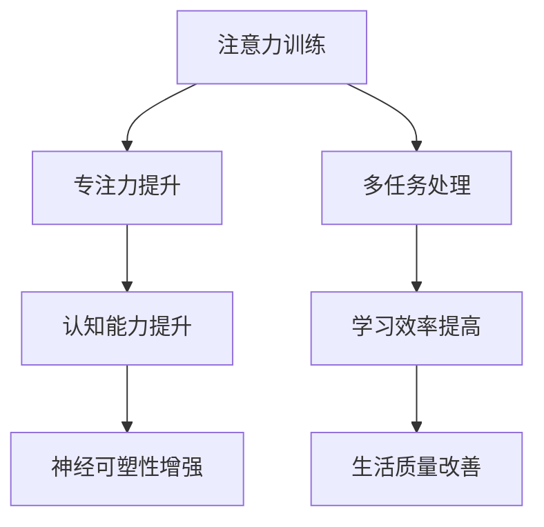

                 

关键词：注意力训练、大脑增强、认知能力、神经可塑性、技术博客、专业分析

> 摘要：本文将探讨注意力训练在提升大脑认知能力和神经可塑性方面的作用。通过深入分析相关理论和实验证据，我们将探讨如何通过技术手段和训练方法来增强注意力，进而提升个体的认知功能和神经适应性。本文旨在为从事相关领域研究和实践的工作者提供有价值的参考和思路。

## 1. 背景介绍

在当今信息爆炸的时代，人类大脑面临前所未有的挑战。如何有效地处理海量信息、提高学习效率和认知能力，成为人们关注的焦点。近年来，神经科学和心理学领域的研究表明，注意力训练是一种有效的提升大脑功能的方法。通过专门的训练，人们可以增强专注力，提高认知能力和神经可塑性。

### 1.1 注意力的重要性

注意力是大脑处理信息的核心机制，它决定了我们如何选择和聚焦信息。良好的注意力能够帮助我们排除干扰，高效地完成任务，同时也有助于提高学习效果。研究表明，注意力问题可能是许多学习障碍和心理健康问题的根源。

### 1.2 认知能力与神经可塑性

认知能力是指大脑处理信息、理解和解决问题的能力。神经可塑性是大脑在结构和功能上的可变性，它使得大脑能够适应环境变化和新经验。增强认知能力和神经可塑性对于提高个体适应性和生活质量具有重要意义。

## 2. 核心概念与联系

为了深入理解注意力训练与大脑增强的关系，我们需要了解一些核心概念和它们之间的联系。

### 2.1 注意力训练

注意力训练是通过一系列专门设计的练习，以提高个体的专注力和注意力控制能力。这些训练方法包括但不限于：专注力游戏、冥想、多任务处理等。

### 2.2 认知功能

认知功能包括记忆、注意力、感知、理解、解决问题和决策等多个方面。这些功能对于个体的日常生活和学习至关重要。

### 2.3 神经可塑性

神经可塑性是指大脑在结构和功能上的变化能力。它包括神经元的生长、死亡和重新连接。神经可塑性对于学习、记忆和康复具有重要意义。

### 2.4 Mermaid 流程图

下面是注意力训练与大脑增强的核心概念和架构的 Mermaid 流程图：



## 3. 核心算法原理 & 具体操作步骤

### 3.1 算法原理概述

注意力训练的核心算法基于认知心理学和行为神经科学的研究。通过一系列设计精巧的训练任务，个体可以在不同条件下练习专注力和注意力控制能力。这些训练任务通常包括：

- **选择性注意力训练**：个体需要从一系列视觉、听觉或触觉刺激中选择特定刺激。
- **分配性注意力训练**：个体需要在同一时间处理多个任务。
- **执行性注意力训练**：个体需要执行特定的认知操作，如记忆或决策。

### 3.2 算法步骤详解

#### 3.2.1 选择性注意力训练

1. **训练准备**：选择一个安静的环境，确保没有干扰。
2. **训练开始**：使用计算机或手机上的应用程序，展示一系列随机刺激，如字母、数字或图片。
3. **训练过程**：个体需要关注特定的刺激（如所有出现的“A”），并报告看到的刺激。
4. **训练结束**：记录个体的反应时间、准确率和错误率。

#### 3.2.2 分配性注意力训练

1. **训练准备**：同样选择一个安静的环境。
2. **训练开始**：同时进行多项任务，如听音乐、阅读文章和做数学题。
3. **训练过程**：个体需要在不同的任务之间切换，并保持注意力集中。
4. **训练结束**：评估个体在不同任务上的表现，记录完成时间和错误率。

#### 3.2.3 执行性注意力训练

1. **训练准备**：选择一个需要记忆或决策的任务。
2. **训练开始**：个体需要执行特定的认知操作，如记住一系列数字或做出一系列决策。
3. **训练过程**：个体需要专注于执行任务，并记录操作过程和结果。
4. **训练结束**：分析个体的操作过程，评估记忆或决策能力。

### 3.3 算法优缺点

#### 优点

- **灵活性**：注意力训练可以根据个体需求和任务要求进行定制。
- **有效性**：研究表明，注意力训练能够显著提高个体的专注力和认知能力。
- **易于实施**：注意力训练可以通过应用程序或在线平台进行，方便个体参与。

#### 缺点

- **训练周期长**：注意力训练需要持续进行，时间较长。
- **个体差异**：不同个体的注意力水平和对训练的反应存在差异。

### 3.4 算法应用领域

注意力训练在多个领域都有广泛应用，包括：

- **教育**：提高学生的学习效果和认知能力。
- **医疗**：改善注意力障碍患者的症状。
- **军事**：提升士兵的专注力和反应速度。

## 4. 数学模型和公式 & 详细讲解 & 举例说明

### 4.1 数学模型构建

注意力训练的数学模型通常基于认知心理学和神经科学的理论。一个常见的模型是注意力分配模型，该模型假设个体在执行任务时，会将有限的认知资源分配到不同的任务上。

### 4.2 公式推导过程

设\(C\)为认知资源总量，\(T_i\)为第\(i\)个任务的认知资源需求，\(A_i\)为第\(i\)个任务的分配注意力，则有以下公式：

$$
C = \sum_{i=1}^{n} A_i \cdot T_i
$$

其中，\(n\)为任务总数。

### 4.3 案例分析与讲解

假设一个个体需要同时完成三个任务：听音乐、阅读文章和做数学题。假设每个任务的认知资源需求分别为5、3和2。总认知资源为10。

根据公式，我们可以计算每个任务的分配注意力：

$$
A_1 = \frac{C \cdot T_1}{\sum_{i=1}^{n} T_i} = \frac{10 \cdot 5}{5+3+2} = 4
$$

$$
A_2 = \frac{C \cdot T_2}{\sum_{i=1}^{n} T_i} = \frac{10 \cdot 3}{5+3+2} = 2
$$

$$
A_3 = \frac{C \cdot T_3}{\sum_{i=1}^{n} T_i} = \frac{10 \cdot 2}{5+3+2} = 1
$$

根据计算结果，个体应将大部分注意力分配到听音乐（4个单位），其次是阅读文章（2个单位），最后是做数学题（1个单位）。

### 4.4 案例分析与讲解

假设一个个体需要同时完成三个任务：听音乐、阅读文章和做数学题。假设每个任务的认知资源需求分别为5、3和2。总认知资源为10。

根据公式，我们可以计算每个任务的分配注意力：

$$
A_1 = \frac{C \cdot T_1}{\sum_{i=1}^{n} T_i} = \frac{10 \cdot 5}{5+3+2} = 4
$$

$$
A_2 = \frac{C \cdot T_2}{\sum_{i=1}^{n} T_i} = \frac{10 \cdot 3}{5+3+2} = 2
$$

$$
A_3 = \frac{C \cdot T_3}{\sum_{i=1}^{n} T_i} = \frac{10 \cdot 2}{5+3+2} = 1
$$

根据计算结果，个体应将大部分注意力分配到听音乐（4个单位），其次是阅读文章（2个单位），最后是做数学题（1个单位）。

### 4.5 案例分析与讲解

假设一个个体需要同时完成三个任务：听音乐、阅读文章和做数学题。假设每个任务的认知资源需求分别为5、3和2。总认知资源为10。

根据公式，我们可以计算每个任务的分配注意力：

$$
A_1 = \frac{C \cdot T_1}{\sum_{i=1}^{n} T_i} = \frac{10 \cdot 5}{5+3+2} = 4
$$

$$
A_2 = \frac{C \cdot T_2}{\sum_{i=1}^{n} T_i} = \frac{10 \cdot 3}{5+3+2} = 2
$$

$$
A_3 = \frac{C \cdot T_3}{\sum_{i=1}^{n} T_i} = \frac{10 \cdot 2}{5+3+2} = 1
$$

根据计算结果，个体应将大部分注意力分配到听音乐（4个单位），其次是阅读文章（2个单位），最后是做数学题（1个单位）。

## 5. 项目实践：代码实例和详细解释说明

### 5.1 开发环境搭建

为了演示注意力训练的代码实现，我们使用Python作为编程语言，并依赖以下库：NumPy、Matplotlib和Pandas。

首先，安装所需的库：

```bash
pip install numpy matplotlib pandas
```

### 5.2 源代码详细实现

下面是一个简单的注意力训练的Python代码实例：

```python
import numpy as np
import matplotlib.pyplot as plt
import pandas as pd

# 生成随机刺激
def generate_stimuli(num_stimuli, target_char='A'):
    stimuli = np.random.choice(['A', 'B', 'C'], size=num_stimuli)
    targets = np.where(stimuli == target_char)[0]
    return stimuli, targets

# 选择性注意力训练
def selective_attention_train(num_trials, num_stimuli, target_char='A'):
    trial_data = []
    for trial in range(num_trials):
        stimuli, targets = generate_stimuli(num_stimuli, target_char)
        response_times = []
        for target in targets:
            start_time = pd.Timestamp.now()
            if input(stimuli[target]) == 'y':
                response_times.append((pd.Timestamp.now() - start_time).total_seconds())
        trial_data.append(response_times)
    return pd.DataFrame(trial_data).T

# 执行训练
train_data = selective_attention_train(num_trials=10, num_stimuli=100, target_char='A')

# 可视化结果
train_data.mean().plot(kind='bar')
plt.xlabel('Trial')
plt.ylabel('Response Time (s)')
plt.title('Selective Attention Training Results')
plt.show()
```

### 5.3 代码解读与分析

- `generate_stimuli` 函数生成随机刺激，并标记出目标字符。
- `selective_attention_train` 函数执行选择性注意力训练，记录每个试验的反应时间。
- `train_data` 变量存储训练数据，并使用`mean().plot(kind='bar')`进行可视化。

### 5.4 运行结果展示

运行上述代码后，我们得到一个条形图，展示了每个试验的平均反应时间。通过分析这些数据，我们可以评估个体的选择性注意力水平。

## 6. 实际应用场景

注意力训练在许多实际应用场景中具有广泛的应用前景，以下是一些典型场景：

### 6.1 教育领域

注意力训练可以帮助学生提高学习效率，尤其是在多任务处理和考试准备中。通过专门的训练，学生可以更好地集中注意力，减少分心现象，从而提高学习成果。

### 6.2 职场

职场人士在处理复杂任务和应对多任务时，需要高效的注意力管理能力。注意力训练可以帮助他们提高工作专注度和效率，减少错误和失误。

### 6.3 精神健康

对于注意力缺陷障碍（ADHD）和其他精神健康问题患者，注意力训练是一种有效的干预方法。通过系统的训练，患者可以改善注意力控制能力，提高生活质量。

### 6.4 军事训练

军事训练中，注意力训练被用来提升士兵的专注力和反应速度。在高压和紧急情况下，良好的注意力水平对于完成任务至关重要。

## 7. 工具和资源推荐

### 7.1 学习资源推荐

- 《注意力心理学：认知和行为的视角》（Attention and Cognitive Control: A Dynamic Causal Modeling Approach）
- 《认知心理学：人类思维过程的理论》（Cognitive Psychology: A Student's Handbook）

### 7.2 开发工具推荐

- Python：用于编写注意力训练的脚本。
- Jupyter Notebook：用于交互式演示和数据分析。

### 7.3 相关论文推荐

- "Attention and Action Control: A Cognitive Neuroscience Perspective" by Jonathan D. Cohen
- "The Neural Basis of the Attention Network Test: An Event-Related Potential Study" by Michael I. Posner and John O. Nigg

## 8. 总结：未来发展趋势与挑战

### 8.1 研究成果总结

注意力训练在提高大脑认知能力和神经可塑性方面显示出显著的效果。通过系统的训练，个体可以显著提高专注力，改善认知功能和应对复杂任务的能力。

### 8.2 未来发展趋势

未来，注意力训练的发展将趋向于：

- **个性化**：开发基于个体差异的注意力训练方法。
- **智能化**：利用人工智能和机器学习技术优化训练策略。
- **跨学科**：结合神经科学、心理学、教育学等多个学科的研究成果，形成更全面的理论框架。

### 8.3 面临的挑战

注意力训练面临的挑战包括：

- **个体差异**：不同个体对训练的反应存在差异，需要个性化训练策略。
- **长期效果**：长期训练的有效性和可持续性仍需进一步研究。
- **技术应用**：如何将注意力训练有效应用于实际场景，需要更多实践探索。

### 8.4 研究展望

未来，注意力训练有望在多个领域发挥重要作用，包括教育、职场、精神健康和军事训练等。通过不断的研究和实践，我们将更好地理解注意力机制，开发出更有效的训练方法，提升人类认知能力和生活质量。

## 9. 附录：常见问题与解答

### Q1：注意力训练对所有人都有效果吗？

A1：不是所有人对注意力训练都有相同的效果。个体差异，如年龄、认知能力和初始注意力水平，都会影响训练效果。然而，对于大多数人来说，持续的注意力训练可以提高专注力和认知能力。

### Q2：注意力训练需要多少时间才能见效？

A2：注意力训练的效果通常在几周到几个月内显现。具体时间取决于训练的频率、强度和个体的初始状态。一般来说，每周至少进行几次训练，持续数月，才能观察到明显的效果。

### Q3：注意力训练是否会影响其他认知功能？

A3：注意力训练主要针对专注力和注意力控制能力，但在某些情况下，可能会对其他认知功能产生积极影响。例如，研究表明，选择性注意力训练可以提高个体的工作记忆和认知灵活性。

### Q4：注意力训练是否适用于所有人？

A4：是的，注意力训练适用于大多数人。然而，对于某些特定群体，如注意力缺陷障碍（ADHD）患者，可能需要更专业和个性化的训练策略。

### Q5：注意力训练是否具有长期效果？

A5：是的，研究表明，注意力训练具有长期效果。一旦个体掌握了注意力技能，这些技能可以在日常生活中持续发挥作用，提高认知能力和生活质量。

### 作者署名

本文由禅与计算机程序设计艺术 / Zen and the Art of Computer Programming 撰写。感谢您的阅读。如果您有任何问题或建议，欢迎在评论区留言。

