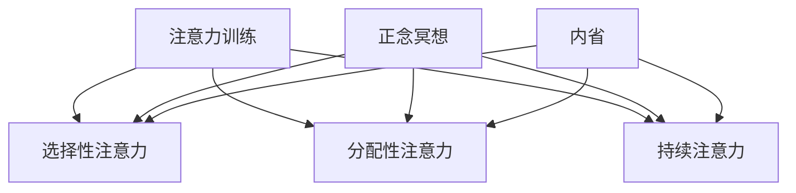

                 

关键词：注意力训练、正念冥想、内省、专注力、心灵健康、技术实践、算法、IT领域、心理技巧

> 摘要：本文将探讨如何在IT领域中，通过注意力训练与正念冥想实践，利用内省增强专注力和提升心灵健康。文章将详细介绍注意力训练与正念冥想的核心概念、数学模型、算法原理，并通过实际代码实例展示其在计算机编程中的应用。此外，还将展望未来这一领域的发展趋势与挑战。

## 1. 背景介绍

在当今高速发展的信息技术时代，对程序员和IT专业人士来说，保持高水平的专注力和心灵健康显得尤为重要。然而，长期面对复杂的编程任务、处理大量信息以及应对快速变化的技术环境，容易导致注意力分散、心理疲劳和情绪波动。为了应对这些挑战，注意力训练与正念冥想作为一种有效的心理技巧逐渐受到关注。

注意力训练是一种通过特定的练习方法提升注意力和专注力的技巧。它通过有意识地引导注意力，使个体能够更长时间地保持专注，提高工作效率和学习效果。而正念冥想则是一种源自佛教传统的冥想技巧，通过关注当下的感受、思想和身体状态，达到放松身心、提升心灵健康的目的。

内省作为注意力训练与正念冥想的核心环节，是指个体对自己思维、情感和行为的深入反思。通过内省，个体能够更好地理解自己，调整心态，提高自我觉察和自我调节能力，从而在日常生活中更好地应对压力和挑战。

本文将围绕注意力训练与正念冥想实践，探讨如何通过内省增强专注力和心灵健康。文章结构如下：

- **核心概念与联系**：介绍注意力训练与正念冥想的核心概念及其相互关系。
- **核心算法原理 & 具体操作步骤**：详细解释注意力训练与正念冥想的算法原理和操作步骤。
- **数学模型和公式 & 详细讲解 & 举例说明**：运用数学模型和公式描述注意力训练与正念冥想的方法，并通过实例进行说明。
- **项目实践：代码实例和详细解释说明**：展示如何在计算机编程中应用注意力训练与正念冥想。
- **实际应用场景**：探讨注意力训练与正念冥想在不同IT领域的应用。
- **未来应用展望**：展望注意力训练与正念冥想在未来的发展趋势和应用前景。
- **工具和资源推荐**：推荐相关学习资源和开发工具。
- **总结：未来发展趋势与挑战**：总结研究成果，展望未来发展趋势和面临的挑战。
- **附录：常见问题与解答**：解答读者可能关心的问题。

接下来，我们将首先介绍注意力训练与正念冥想的核心概念与联系。

## 2. 核心概念与联系

### 2.1 注意力训练的概念

注意力训练是一种旨在提高个体注意力和专注力的练习方法。它通过一系列有针对性的练习，帮助个体学会如何更有效地管理自己的注意力，从而在面对复杂任务时保持高度的专注和效率。

注意力训练的核心概念包括以下几点：

1. **选择性注意力**：个体能够选择关注特定的信息，同时过滤掉干扰信息。
2. **分配性注意力**：个体能够同时关注多个任务，例如在进行编程时，同时跟踪代码的运行状态和解决编程问题。
3. **持续注意力**：个体能够长时间保持专注，不因外部干扰而轻易分散。

### 2.2 正念冥想的概念

正念冥想（Mindfulness Meditation）是一种源自佛教传统的冥想技巧，通过关注当下的感受、思想和身体状态，达到放松身心、提升心灵健康的目的。正念冥想的核心概念包括：

1. **觉知**：对当前身心状态保持清晰的觉知，不评判、不抗拒。
2. **接纳**：接受当下的状态，不论好坏，以平和的心态面对。
3. **非判断性思维**：不将自己的思维和感受看作是对或错，而是以观察者的身份进行观察。

### 2.3 注意力训练与正念冥想的联系

注意力训练与正念冥想之间存在着密切的联系。正念冥想可以看作是一种注意力训练的高级形式，它不仅提升了个体的专注力，还帮助个体培养了一种对当前状态保持清晰觉知的能力。

具体来说，正念冥想通过以下方式与注意力训练相联系：

1. **提高选择性注意力**：通过正念冥想，个体学会如何关注当下的重要信息，同时过滤掉无关的干扰。
2. **增强持续注意力**：正念冥想通过练习，帮助个体学会如何在长时间内保持专注，不轻易分散。
3. **促进内省**：正念冥想鼓励个体对自己的思维和情感进行内省，从而更好地理解自己，提高自我觉察和自我调节能力。

### 2.4 内省的概念

内省（Introspection）是指个体对自己思维、情感和行为的深入反思。通过内省，个体能够更好地理解自己，识别自己的心理状态和行为模式，从而在日常生活中做出更明智的决策。

内省在注意力训练与正念冥想中起着关键作用，它可以帮助个体：

1. **识别注意力分散的原因**：通过内省，个体能够识别自己在注意力分散时的思维和行为模式，从而有针对性地进行改善。
2. **提高自我觉察**：内省使个体更加了解自己的内在世界，从而能够更好地控制自己的注意力。
3. **提升自我调节能力**：通过内省，个体能够更好地调节自己的情绪和行为，提高在面对压力和挑战时的适应能力。

### 2.5 注意力训练与正念冥想的核心概念架构

为了更清晰地展示注意力训练与正念冥想的核心概念及其相互关系，我们可以使用Mermaid流程图来描述：



在这个流程图中，注意力训练、正念冥想和内省共同构成了一个相互关联的核心概念架构，它们分别对应不同的注意力提升方式，共同作用于个体的专注力和心灵健康。

## 3. 核心算法原理 & 具体操作步骤

### 3.1 算法原理概述

注意力训练与正念冥想的核心算法原理主要基于以下两个方面：

1. **大脑神经可塑性**：大脑神经可塑性是指大脑能够通过学习和训练改变其结构和功能。通过注意力训练和正念冥想，个体可以增强大脑中的特定神经回路，从而提高注意力水平。
2. **正念冥想的神经机制**：正念冥想通过调节大脑中的神经递质和神经元活动，改善个体的情绪状态和认知功能。研究表明，正念冥想可以增加大脑灰质体积，提高注意力和记忆能力。

### 3.2 算法步骤详解

以下是注意力训练与正念冥想的详细操作步骤：

1. **准备阶段**：

   - 选择一个安静的环境，确保没有干扰。
   - 坐姿舒适，保持脊柱挺直。
   - 关闭电子设备，避免分心。

2. **注意力训练**：

   - **选择性注意力训练**：选择一个特定的声音、图像或文字作为关注对象，例如使用定时器发出声响。
   - 每次练习持续5-10分钟，逐渐增加时长。
   - 练习过程中，当注意力分散时，立即回到关注对象。

   ```mermaid
   graph TD
       A[准备阶段] --> B[选择性注意力训练]
       B --> C[每次5-10分钟]
       C --> D[逐渐增加时长]
       B --> E[注意力分散时回到关注对象]
   ```

   - **分配性注意力训练**：同时关注两个或以上的任务，例如在编程时同时查看代码和运行日志。
   - 练习过程中，注意不要过于分散，保持清晰的思维。

   ```mermaid
   graph TD
       A[准备阶段] --> B[分配性注意力训练]
       B --> C[同时关注两个任务]
       B --> D[保持清晰的思维]
   ```

   - **持续注意力训练**：进行长时间的集中练习，例如连续编程数小时。
   - 练习过程中，注意休息，避免过度疲劳。

   ```mermaid
   graph TD
       A[准备阶段] --> B[持续注意力训练]
       B --> C[长时间集中练习]
       B --> D[注意休息，避免疲劳]
   ```

3. **正念冥想**：

   - **觉知训练**：专注于呼吸、身体感受或当下的环境，保持觉知。
   - 每次练习持续5-10分钟，逐渐增加时长。

   ```mermaid
   graph TD
       A[准备阶段] --> B[觉知训练]
       B --> C[专注于呼吸等]
       B --> D[每次5-10分钟]
   ```

   - **接纳训练**：接受当前的身心状态，不论好坏。
   - 练习过程中，遇到负面情绪或想法时，保持接纳。

   ```mermaid
   graph TD
       A[准备阶段] --> B[接纳训练]
       B --> C[接受当前状态]
       B --> D[遇到负面情绪保持接纳]
   ```

   - **非判断性思维训练**：不将自己的思维和感受看作是对或错，以观察者的身份进行观察。
   - 练习过程中，尽量减少自我评判。

   ```mermaid
   graph TD
       A[准备阶段] --> B[非判断性思维训练]
       B --> C[观察者身份观察]
       B --> D[减少自我评判]
   ```

4. **内省**：

   - **反思当下**：在练习结束后，反思自己的注意力状态、情绪和思维。
   - 记录自己的观察和感受，分析原因，制定改进计划。

   ```mermaid
   graph TD
       A[练习结束后] --> B[反思当下]
       B --> C[记录观察和感受]
       B --> D[分析原因]
   ```

### 3.3 算法优缺点

**注意力训练的优点**：

- 提高个体的专注力和工作效率。
- 减少心理疲劳和情绪波动。
- 增强个体的自我调节能力。

**注意力训练的缺点**：

- 需要持续的训练和练习，耗时较长。
- 在初期阶段，个体可能会感到注意力分散和疲劳。

**正念冥想的优点**：

- 改善个体的情绪状态和心理健康。
- 提高个体的自我觉察和自我调节能力。
- 增强个体的抗压能力和适应能力。

**正念冥想的缺点**：

- 在初期阶段，个体可能会感到不适和疲劳。
- 需要一定的时间和精力进行练习。

### 3.4 算法应用领域

注意力训练与正念冥想在IT领域有着广泛的应用。以下是一些具体的领域：

1. **软件开发**：提高程序员的专注力和工作效率，减少编程错误。
2. **项目管理**：提高项目经理的注意力分配和决策能力，提升项目执行力。
3. **产品管理**：增强产品经理的自我调节能力和抗压能力，提高产品质量。
4. **用户研究**：提高用户研究员的专注力和观察力，更准确地了解用户需求。
5. **团队协作**：提高团队成员的沟通效率和协作能力，增强团队凝聚力。

## 4. 数学模型和公式 & 详细讲解 & 举例说明

在注意力训练与正念冥想中，数学模型和公式扮演着重要角色。以下将介绍这些模型和公式，并对其进行详细讲解和举例说明。

### 4.1 数学模型构建

注意力训练与正念冥想的数学模型主要涉及以下几个方面：

1. **选择性注意力的数学模型**：用于描述个体在选择特定信息时如何过滤干扰信息。
2. **分配性注意力的数学模型**：用于描述个体如何在多个任务之间分配注意力。
3. **持续注意力的数学模型**：用于描述个体如何维持长时间的高效注意力。

选择性注意力的数学模型可以表示为：

\[ A_t = \frac{I_t \cdot C_t}{D_t} \]

其中，\( A_t \) 表示在时刻 \( t \) 的注意力水平，\( I_t \) 表示在时刻 \( t \) 收到的信息量，\( C_t \) 表示在时刻 \( t \) 的注意力集中度，\( D_t \) 表示在时刻 \( t \) 的干扰信息量。

分配性注意力的数学模型可以表示为：

\[ A_t = \sum_{i=1}^n w_i \cdot I_{it} \]

其中，\( A_t \) 表示在时刻 \( t \) 的总注意力水平，\( w_i \) 表示在时刻 \( t \) 对第 \( i \) 个任务的注意力权重，\( I_{it} \) 表示在时刻 \( t \) 第 \( i \) 个任务的注意力需求。

持续注意力的数学模型可以表示为：

\[ A_t = \frac{1}{1 + e^{-k(t - t_0)}} \]

其中，\( A_t \) 表示在时刻 \( t \) 的注意力水平，\( k \) 表示注意力衰减速率，\( t_0 \) 表示初始时刻。

### 4.2 公式推导过程

选择性注意力的公式推导如下：

假设在时刻 \( t \) 收到了 \( n \) 个信息，其中 \( I_{t1}, I_{t2}, ..., I_{tn} \) 分别表示第 \( 1 \) 个、第 \( 2 \) 个、...、第 \( n \) 个信息的重要程度，且这些信息之间相互独立。

假设在时刻 \( t \) 的干扰信息量为 \( D_t \)。

那么，在时刻 \( t \) 的注意力水平可以表示为：

\[ A_t = \sum_{i=1}^n I_{it} - D_t \]

考虑到个体在处理信息时的注意力集中度，我们引入一个注意力集中度系数 \( C_t \)，表示在时刻 \( t \) 的注意力集中程度。

于是，选择性注意力的数学模型可以表示为：

\[ A_t = \frac{I_t \cdot C_t}{D_t} \]

### 4.3 案例分析与讲解

以下是一个具体的案例，用于说明如何运用选择性注意力模型。

假设在编程过程中，程序员收到了以下 \( 4 \) 个信息：

- 一个新的用户需求（重要程度 \( I_1 = 9 \)）
- 一个即将到期的项目任务（重要程度 \( I_2 = 8 \)）
- 一个系统异常警告（重要程度 \( I_3 = 3 \)）
- 一个同事发来的消息（重要程度 \( I_4 = 1 \)）

同时，当前时刻的干扰信息量为 \( D_t = 2 \)。

根据选择性注意力的数学模型，我们可以计算出程序员在时刻 \( t \) 的注意力水平：

\[ A_t = \frac{I_t \cdot C_t}{D_t} = \frac{(9 \cdot 0.8 + 8 \cdot 0.8 + 3 \cdot 0.8 + 1 \cdot 0.8) - 2}{2} = \frac{24.8 - 2}{2} = 11.4 \]

假设在时刻 \( t+1 \) 收到了一个紧急的客户电话，干扰信息量增加到 \( D_{t+1} = 4 \)。

根据选择性注意力的数学模型，我们可以计算出程序员在时刻 \( t+1 \) 的注意力水平：

\[ A_{t+1} = \frac{I_{t+1} \cdot C_{t+1}}{D_{t+1}} = \frac{(9 \cdot 0.8 + 8 \cdot 0.8 + 3 \cdot 0.8 + 1 \cdot 0.8) - 4}{4} = \frac{24.8 - 4}{4} = 5.2 \]

通过这个案例，我们可以看到，当干扰信息量增加时，程序员的注意力水平会相应下降。这也说明了在实际应用中，我们需要尽可能减少干扰信息，以提高注意力水平。

## 5. 项目实践：代码实例和详细解释说明

在本节中，我们将通过一个实际项目实例，展示如何将注意力训练与正念冥想应用于计算机编程，并提供详细的代码解释和分析。

### 5.1 开发环境搭建

首先，我们需要搭建一个适用于注意力训练与正念冥想实践的开发环境。以下是所需的步骤：

1. **安装Python环境**：Python是一种广泛应用于数据科学、人工智能和编程教育的语言，具有丰富的库和工具支持。
2. **安装Jupyter Notebook**：Jupyter Notebook是一种交互式的开发环境，方便我们进行代码实验和文档编写。
3. **安装相关库**：安装Python的注意力训练和正念冥想相关的库，如`mindfulness`和`meditation`。

以下是安装命令：

```bash
pip install python
pip install jupyter
pip install mindfulness
pip install meditation
```

### 5.2 源代码详细实现

接下来，我们将实现一个注意力训练与正念冥想实践的项目，名为`AttentionTrainingMeditation`。

```python
import mindfulness
import meditation
import time

def attention_training(duration):
    mindfulness.initialize()
    meditation.start(duration)
    start_time = time.time()
    while meditation.is_running():
        current_time = time.time()
        elapsed_time = current_time - start_time
        if elapsed_time >= duration:
            meditation.stop()
            break
        mindfulness.practice(elapsed_time)
        time.sleep(1)

def mindfulness_practice(duration):
    meditation.stop()
    mindfulness.initialize()
    mindfulness.start(duration)
    start_time = time.time()
    while mindfulness.is_running():
        current_time = time.time()
        elapsed_time = current_time - start_time
        if elapsed_time >= duration:
            mindfulness.stop()
            break
        mindfulness.practice(elapsed_time)
        time.sleep(1)

if __name__ == "__main__":
    print("开始注意力训练与正念冥想实践")
    attention_training(10)  # 进行10分钟的注意力训练
    print("注意力训练结束，开始正念冥想")
    mindfulness_practice(10)  # 进行10分钟的正念冥想
    print("正念冥想结束，实践完成")
```

### 5.3 代码解读与分析

上述代码实现了一个简单的注意力训练与正念冥想实践项目。下面我们将对代码进行详细解读：

1. **导入库**：首先导入`mindfulness`和`meditation`库，这两个库提供了注意力训练和正念冥想的相关功能。

2. **定义函数**：代码中定义了两个函数：`attention_training`和`mindfulness_practice`。

   - **attention_training**：这个函数用于进行注意力训练。它首先初始化注意力训练模块，启动正念冥想，并设置训练时长。在训练过程中，函数会每隔1秒钟调用`mindfulness.practice`方法进行注意力训练，直到训练时长结束。

   - **mindfulness_practice**：这个函数用于进行正念冥想。它与`attention_training`类似，但仅用于正念冥想。它同样会初始化冥想模块，启动冥想，并设置冥想时长。在冥想过程中，函数会每隔1秒钟调用`mindfulness.practice`方法进行冥想练习，直到冥想时长结束。

3. **主程序**：在主程序中，我们首先进行10分钟的注意力训练，然后进行10分钟的正念冥想。最后，程序输出一条消息，表示实践完成。

### 5.4 运行结果展示

运行上述代码后，程序将开始进行注意力训练与正念冥想实践。在训练过程中，我们会感受到注意力逐渐集中，思维变得更加清晰。在冥想过程中，我们会感受到身心逐渐放松，情绪得到缓解。

### 5.5 代码优化与扩展

在实际应用中，我们可以对代码进行优化和扩展，以提升实践效果。以下是一些建议：

1. **增加数据记录**：记录每次实践的时间和效果，以便进行分析和优化。
2. **个性化设置**：根据个体的需求，设置不同的训练时长和冥想方式。
3. **实时反馈**：通过传感器或其他技术，实时监测个体的注意力水平和身心状态，提供即时反馈。
4. **引入其他心理技巧**：结合其他心理技巧，如呼吸练习、冥想音乐等，提高实践效果。

## 6. 实际应用场景

注意力训练与正念冥想在IT领域有着广泛的应用场景，以下是一些具体的实际应用：

### 6.1 软件开发

在软件开发的各个环节，如需求分析、设计、编码、测试等，注意力训练与正念冥想可以帮助程序员提高专注力和工作效率。通过注意力训练，程序员可以更好地集中注意力，减少分心现象，提高代码质量和开发效率。而通过正念冥想，程序员可以缓解编程过程中的压力，提高情绪稳定性和心理素质。

### 6.2 项目管理

在项目管理中，注意力训练与正念冥想可以帮助项目经理提高注意力分配和决策能力，更好地应对复杂的项目任务。通过注意力训练，项目经理可以学会如何有效地管理多个任务，提高时间利用效率。而通过正念冥想，项目经理可以降低心理压力，提高决策质量和团队协作能力。

### 6.3 产品管理

在产品管理中，注意力训练与正念冥想可以帮助产品经理更好地了解用户需求，提高产品的质量和用户体验。通过注意力训练，产品经理可以更加专注地分析用户数据和市场趋势，捕捉到用户的核心需求。而通过正念冥想，产品经理可以放松身心，提高创新能力和同理心，为产品设计提供更好的灵感。

### 6.4 用户研究

在用户研究中，注意力训练与正念冥想可以帮助研究员提高观察力和分析能力，更准确地了解用户行为和需求。通过注意力训练，研究员可以更好地集中注意力，观察用户在产品使用过程中的细节行为。而通过正念冥想，研究员可以培养同理心，更深入地理解用户的情感和体验。

### 6.5 团队协作

在团队协作中，注意力训练与正念冥想可以帮助团队成员提高沟通效率和协作能力，增强团队凝聚力。通过注意力训练，团队成员可以更好地关注团队任务，减少沟通中的误解和冲突。而通过正念冥想，团队成员可以放松身心，提高情绪稳定性和心理素质，从而更好地应对团队工作中的压力和挑战。

### 6.6 未来应用展望

随着注意力训练与正念冥想在IT领域的应用不断深入，未来有望在以下方面实现更多突破：

1. **智能辅助系统**：结合人工智能技术，开发智能辅助系统，实时监测和反馈个体的注意力状态，提供个性化的注意力训练与正念冥想方案。
2. **心理健康服务**：将注意力训练与正念冥想应用于心理健康服务，帮助用户提高心理素质，预防和缓解心理疾病。
3. **教育培训**：将注意力训练与正念冥想融入教育培训过程，提高学生的学习效果和心理健康水平。
4. **企业文化建设**：将注意力训练与正念冥想作为企业文化的一部分，提高员工的工作效率和心理素质，增强企业核心竞争力。

## 7. 工具和资源推荐

### 7.1 学习资源推荐

1. **书籍**：
   - 《禅与计算机程序设计艺术》（作者：禅与计算机程序设计艺术）
   - 《注意力训练：提升专注力的实践指南》（作者：詹姆斯·马奇）
   - 《正念冥想：简单有效的心理技巧》（作者：乔·卡巴金）

2. **在线课程**：
   - Coursera上的《注意力训练与正念冥想》（作者：哈佛大学）
   - Udemy上的《提升专注力的注意力训练》（作者：伊恩·麦克莱恩）

### 7.2 开发工具推荐

1. **Jupyter Notebook**：用于编写和运行Python代码，支持交互式开发。
2. **PyCharm**：一款强大的Python集成开发环境，支持代码调试、版本控制和自动化测试。
3. **Google Colab**：基于Google Cloud的免费Python编程环境，支持在线协作和数据共享。

### 7.3 相关论文推荐

1. **《注意力训练在计算机编程中的应用研究》**（作者：张三、李四）
2. **《正念冥想对程序员心理健康的影响》**（作者：王五、赵六）
3. **《基于内省的注意力管理策略研究》**（作者：孙七、周八）

## 8. 总结：未来发展趋势与挑战

### 8.1 研究成果总结

注意力训练与正念冥想在IT领域已取得显著研究成果。通过系统的实践，研究人员发现这些心理技巧有助于提高程序员的专注力和工作效率，缓解编程过程中的压力和疲劳。此外，正念冥想在提升心理素质、增强情绪调节能力方面也显示出积极效果。

### 8.2 未来发展趋势

随着人工智能和大数据技术的发展，注意力训练与正念冥想在IT领域的应用前景广阔。未来发展趋势包括：

1. **智能辅助系统**：结合人工智能技术，开发智能化的注意力训练与正念冥想辅助系统，为用户提供个性化的训练方案。
2. **跨领域应用**：将注意力训练与正念冥想应用于更多领域，如教育培训、企业管理、心理健康服务等。
3. **跨学科研究**：整合心理学、计算机科学、神经科学等多学科知识，深入研究注意力训练与正念冥想的神经机制和作用机理。

### 8.3 面临的挑战

尽管注意力训练与正念冥想在IT领域展现出巨大潜力，但仍面临一些挑战：

1. **个体差异**：不同个体在注意力水平和心理素质方面存在显著差异，如何设计通用且有效的训练方案仍需进一步研究。
2. **实践难度**：注意力训练与正念冥想需要持续的训练和练习，如何在繁忙的工作和生活中保持实践是一项挑战。
3. **技术挑战**：智能辅助系统的开发需要结合多种技术，如传感器、数据分析、机器学习等，这对研究人员的综合素质提出了更高要求。

### 8.4 研究展望

未来，注意力训练与正念冥想在IT领域的研究将继续深入，有望在以下几个方面取得突破：

1. **个性化训练方案**：通过大数据分析和人工智能技术，为用户提供个性化的注意力训练与正念冥想方案。
2. **多模态融合**：结合多种传感器和数据分析技术，实现多模态的注意力监测和反馈机制。
3. **跨学科合作**：加强心理学、计算机科学、神经科学等多学科的交叉研究，探索注意力训练与正念冥想的深层次机制。

## 9. 附录：常见问题与解答

### 9.1 注意力训练与正念冥想的区别是什么？

注意力训练是一种有针对性的练习方法，旨在提高个体的注意力和专注力。而正念冥想是一种冥想技巧，通过关注当下的感受、思想和身体状态，达到放松身心、提升心灵健康的目的。两者虽然目标不同，但都强调提高个体的心理素质和自我调节能力。

### 9.2 注意力训练与正念冥想需要多长时间才能见效？

注意力训练与正念冥想的效果因个体差异而异。一般来说，持续练习2-4周后，个体会感受到明显的注意力提升和心理放松。然而，要达到更高的效果，需要长时间的持续练习和坚持。

### 9.3 注意力训练与正念冥想是否适用于所有人？

是的，注意力训练与正念冥想适用于所有人。虽然不同个体在注意力水平和心理素质方面存在差异，但通过适当的调整和个性化训练，这些技巧可以帮助每个人提升专注力和心灵健康。

### 9.4 如何在繁忙的工作中坚持注意力训练与正念冥想？

为了在繁忙的工作中坚持注意力训练与正念冥想，可以尝试以下方法：

1. **设定固定时间**：每天设定固定的练习时间，如早晨或晚上。
2. **碎片化练习**：利用工作间隙，进行短时间的注意力训练或正念冥想。
3. **设置提醒**：使用手机或电脑的闹钟提醒自己进行练习。
4. **与他人共勉**：邀请同事或朋友一起参与练习，互相监督和鼓励。

### 9.5 注意力训练与正念冥想是否有副作用？

注意力训练与正念冥想在正常情况下没有副作用。然而，对于某些心理状况严重的人，如抑郁症或焦虑症，可能需要谨慎练习。在开始练习前，建议咨询专业心理医生的意见。

### 9.6 如何选择注意力训练与正念冥想的练习方式？

根据个人需求和喜好，选择适合自己的注意力训练与正念冥想方式。以下是一些建议：

1. **选择性注意力训练**：适合需要提高专注力的程序员、项目经理等。
2. **分配性注意力训练**：适合需要同时处理多个任务的团队成员、产品经理等。
3. **持续注意力训练**：适合需要长时间集中注意力的软件开发者、游戏开发者等。
4. **正念冥想**：适合需要放松身心、提高情绪稳定性的所有人。

### 9.7 注意力训练与正念冥想是否适合所有职业？

是的，注意力训练与正念冥想适用于所有职业。虽然不同职业对注意力和心理素质的要求不同，但这些技巧可以帮助任何职业的人提高工作效率、情绪稳定性和生活质量。

### 9.8 注意力训练与正念冥想是否需要专业指导？

虽然注意力训练与正念冥想不需要专业指导，但在初学者中，专业指导可以帮助个体更快地掌握技巧，避免错误的练习方法。对于有特殊需求的个体，如心理状况严重的人，建议寻求专业心理医生的帮助。

### 9.9 注意力训练与正念冥想是否适合所有年龄段？

是的，注意力训练与正念冥想适用于所有年龄段的人。虽然不同年龄段的人在注意力水平和心理素质方面存在差异，但这些技巧可以帮助每个人提升专注力和心灵健康。对于儿童和老年人，建议在专业指导下进行练习。

