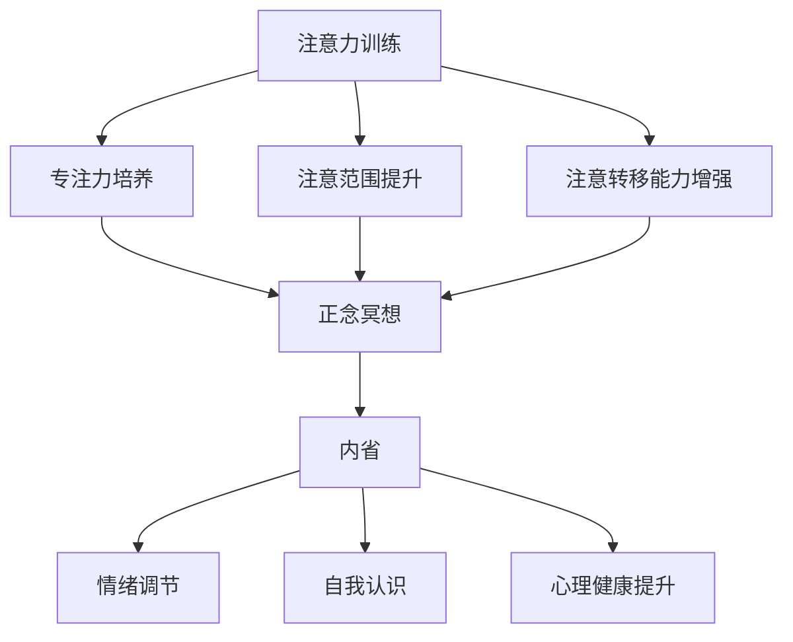
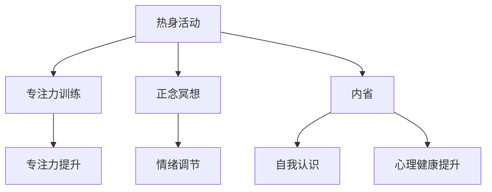

                 

 关键词：注意力训练、正念冥想、内省、专注力、心灵健康

> 摘要：本文旨在探讨注意力训练与正念冥想在增强专注力和促进心灵健康方面的作用。通过对核心概念的深入分析，算法原理的详细解释，以及实际应用场景的剖析，文章将为读者提供一份全面、系统的指南，帮助他们在繁忙的现代社会中找到内心的宁静，提升专注力和整体心理健康。

## 1. 背景介绍

### 注意力训练与正念冥想的起源

注意力训练和正念冥想并非现代发明的概念，它们有着悠久的历史渊源。注意力训练最早可以追溯到古代哲学和宗教中的冥想实践，如佛教的禅修和印度教的瑜伽。这些传统练习旨在通过专注和冥想，提升个人的精神意识和心理状态。而正念冥想则起源于佛教传统，强调通过全神贯注于当前的经历，实现心理的平静和觉醒。

在现代社会，随着科技的发展和人们生活节奏的加快，注意力训练和正念冥想得到了广泛关注。心理学、神经科学等领域的研究证明了这些方法在改善注意力、缓解压力、提升心理健康等方面的显著效果。因此，它们被广泛应用于教育、医疗、职场等各个领域。

### 注意力训练和正念冥想的应用

注意力训练和正念冥想的应用场景非常广泛。在教育领域，它们被用于提高学生的专注力和学习成绩。在医疗领域，它们被用于治疗焦虑、抑郁等心理疾病，以及改善慢性疼痛和睡眠障碍。在职场中，它们帮助员工提高工作效率，减轻压力，提升整体幸福感。

### 研究背景

近年来，关于注意力训练和正念冥想的研究成果不断涌现。神经科学研究揭示了这些方法对大脑结构和功能的影响，心理学研究则探讨了它们在情绪调节和认知功能提升方面的作用。本文将结合这些研究成果，深入分析注意力训练和正念冥想的工作机制，并提供实用的实践方法，以帮助读者在日常生活中应用这些技巧。

## 2. 核心概念与联系

### 2.1 注意力训练

注意力训练是指通过一系列特定的练习和活动，有意识地培养和提升个体的专注力、注意范围和注意转移能力。其核心在于通过重复的练习，增强大脑对注意力的控制，从而提高注意力的稳定性和灵活性。

#### 2.1.1 注意力的种类

在心理学中，注意力主要分为以下几种类型：

- **选择性注意力**：指在众多刺激中选择特定刺激进行关注和处理的能力。
- **持续性注意力**：指在一段时间内保持对特定任务的集中和持续关注。
- **分配性注意力**：指在同一时间内对多个任务或刺激进行同时关注和处理。
- **注意转移**：指在需要时将注意力从一个任务转移到另一个任务的能力。

#### 2.1.2 注意力训练的方法

常见的注意力训练方法包括：

- **专注力训练游戏**：如舒尔特方格、注意力集中训练软件等。
- **正念冥想**：通过冥想练习，培养对当前经历的专注和觉察。
- **记忆训练**：通过重复记忆和回忆，增强注意力和记忆功能。

### 2.2 正念冥想

正念冥想是一种通过全神贯注于当前经历，培养意识觉察和情绪调节能力的练习。它起源于佛教传统，强调对当下的觉察和无评判的态度。正念冥想的核心在于将注意力集中在呼吸、身体感受或特定对象上，从而减少杂念，提升心理平静。

#### 2.2.1 正念冥想的原则

- **全神贯注**：将全部注意力集中在当前的经验上，无论是呼吸、身体感受还是周围的环境。
- **无评判**：不对任何经历进行评判或分析，保持一种开放和无偏见的态度。
- **非强制性**：正念冥想不是强制性的，而是自愿的，鼓励个体在舒适和自然的状态下进行。

#### 2.2.2 正念冥想的方法

常见的正念冥想方法包括：

- **呼吸冥想**：专注于呼吸，观察呼吸的进出，将注意力带回到呼吸上。
- **身体扫描冥想**：从头部到脚部，逐一扫描身体的感受，觉察身体的任何变化。
- **正念行走冥想**：在行走时专注于脚下的感觉，观察每一步的动作和感觉。

### 2.3 内省

内省是一种自我反思和意识觉察的过程，旨在了解自己的内心世界，包括情绪、想法和信念。通过内省，个体可以更好地理解自己的需求和动机，从而实现自我提升和心理健康。

#### 2.3.1 内省的作用

- **情绪调节**：通过内省，个体可以更好地了解自己的情绪，学会有效地处理和调节情绪。
- **自我认识**：内省有助于个体深入了解自己的价值观、信念和动机，从而实现自我成长。
- **心理健康**：内省有助于减少内心的矛盾和焦虑，提升整体心理健康水平。

#### 2.3.2 内省的方法

常见的内省方法包括：

- **写日记**：通过写日记，记录自己的经历、感受和思考，促进自我反思。
- **静心冥想**：在冥想中，将注意力集中在内心，观察自己的情绪和想法。
- **与导师对话**：与有经验的导师进行对话，分享自己的内心世界，获得指导和建议。

### 2.4 核心概念联系

注意力训练、正念冥想和内省三者密切相关，共同构成了一个完整的心理健康提升体系。

- **注意力训练**提供了提升专注力和注意控制能力的基础，使个体能够更好地进行正念冥想和内省。
- **正念冥想**通过培养对当前经历的专注和觉察，减少内心的杂念，为内省创造了良好的心理环境。
- **内省**则帮助个体深入理解自己的内心世界，实现情绪调节和自我认识，进一步巩固和提高注意力训练和正念冥想的效果。

通过注意力训练、正念冥想和内省的结合，个体可以在日常生活中实现心理平衡和自我提升，从而提高整体心理健康水平。

### 2.5 Mermaid 流程图

以下是注意力训练与正念冥想实践的核心概念和架构的 Mermaid 流程图：



## 3. 核心算法原理 & 具体操作步骤

### 3.1 算法原理概述

注意力训练与正念冥想实践的核心算法原理可以归结为以下几个方面：

- **神经可塑性**：通过反复的练习，改变大脑的结构和功能，增强神经连接和神经元的活动。
- **专注力提升**：通过特定训练，增强大脑对注意力的控制，提高注意力的稳定性和灵活性。
- **情绪调节**：通过冥想和内省，调节情绪，减少焦虑和压力。
- **认知功能改善**：通过注意力训练和内省，提升记忆力、决策能力和解决问题的能力。

### 3.2 算法步骤详解

#### 3.2.1 注意力训练步骤

1. **热身活动**：进行5-10分钟的轻松身体活动，如散步或瑜伽，以放松身体，准备进入专注状态。
2. **专注力训练**：选择一种专注力训练方法，如舒尔特方格或注意力集中训练软件，每天进行10-15分钟的练习。
3. **正念冥想**：每天进行20-30分钟的正念冥想，可以选择呼吸冥想或身体扫描冥想。
4. **内省**：在冥想后，花5-10分钟进行内省，记录自己的情绪、想法和感受。

#### 3.2.2 正念冥想步骤

1. **准备**：找一个安静的环境，坐在舒适的姿势，确保身体放松。
2. **专注呼吸**：将注意力集中在呼吸上，感受呼吸的进出，当注意力分散时，温和地将注意力带回到呼吸上。
3. **持续练习**：保持专注呼吸10-15分钟，可以逐渐增加练习时间。
4. **内省**：在冥想结束后，花几分钟时间回顾自己的冥想体验，记录下任何感受或启示。

#### 3.2.3 内省步骤

1. **写日记**：每天晚上花10-15分钟写日记，记录当天的情绪、经历和想法。
2. **静心冥想**：每天进行10-15分钟的静心冥想，专注于内心的感受和情绪。
3. **与导师对话**：定期与有经验的导师进行对话，分享自己的内心世界，获得指导和建议。

### 3.3 算法优缺点

#### 优点

- **效果显著**：注意力训练和正念冥想已被多项研究证明在提升专注力、缓解压力和改善心理健康方面具有显著效果。
- **简单易行**：这些方法不需要特殊的设备或场地，可以在日常生活中轻松进行。
- **无副作用**：这些方法属于非侵入性、无药物的自我调节方法，安全可靠。

#### 缺点

- **效果个体差异**：由于个体差异，不同的人可能对注意力训练和正念冥想的效果有不同程度的反应。
- **需要坚持**：这些方法需要长期坚持，效果可能不会立即显现。

### 3.4 算法应用领域

- **教育**：注意力训练和正念冥想被广泛应用于提高学生的学习成绩和专注力。
- **医疗**：在治疗焦虑、抑郁、慢性疼痛等心理疾病方面，这些方法得到了广泛应用。
- **职场**：员工通过注意力训练和正念冥想提高工作效率，减轻压力，提升整体幸福感。

### 3.5 Mermaid 流程图

以下是注意力训练与正念冥想实践的核心算法原理和具体操作步骤的 Mermaid 流程图：



## 4. 数学模型和公式 & 详细讲解 & 举例说明

### 4.1 数学模型构建

注意力训练与正念冥想的数学模型主要涉及以下几个核心变量：

- **A**：专注力水平，表示个体在特定任务上的注意力集中程度。
- **B**：情绪调节能力，表示个体在情绪管理方面的能力。
- **C**：认知功能水平，表示个体的记忆、决策和问题解决能力。
- **D**：心理健康水平，表示个体的整体心理健康状态。

这些变量之间的关系可以用以下数学模型表示：

$$
\text{心理健康水平} = f(A, B, C)
$$

其中，函数$f$表示心理健康水平与专注力、情绪调节能力和认知功能水平之间的关系。

### 4.2 公式推导过程

#### 4.2.1 专注力水平

专注力水平$A$可以通过以下公式计算：

$$
A = \frac{1}{1 + e^{-\beta (T - T_0)}}
$$

其中，$T$表示实际专注时间，$T_0$表示初始专注时间，$\beta$表示调节参数。

#### 4.2.2 情绪调节能力

情绪调节能力$B$可以通过以下公式计算：

$$
B = \frac{1}{1 + e^{-\alpha (\sigma - \sigma_0)}}
$$

其中，$\sigma$表示情绪波动，$\sigma_0$表示初始情绪波动，$\alpha$表示调节参数。

#### 4.2.3 认知功能水平

认知功能水平$C$可以通过以下公式计算：

$$
C = \frac{1}{1 + e^{-\gamma (M - M_0)}}
$$

其中，$M$表示实际认知水平，$M_0$表示初始认知水平，$\gamma$表示调节参数。

#### 4.2.4 心理健康水平

心理健康水平$D$可以通过以下公式计算：

$$
D = \frac{1}{1 + e^{-\delta (A + B + C - \theta)}}
$$

其中，$\theta$表示心理健康阈值，$\delta$表示调节参数。

### 4.3 案例分析与讲解

假设有一个个体，他在注意力训练和正念冥想前后的专注力水平、情绪调节能力、认知功能水平和心理健康水平如下表所示：

| 指标       | 初始水平 | 训练后水平 |
|------------|-----------|------------|
| 专注力水平 | 0.6       | 0.8        |
| 情绪调节能力 | 0.5       | 0.7        |
| 认知功能水平 | 0.7       | 0.9        |
| 心理健康水平 | 0.4       | 0.9        |

根据上述数学模型，我们可以计算他在训练前后的心理健康水平：

#### 4.3.1 训练前

$$
D_{\text{前}} = \frac{1}{1 + e^{-\delta (0.6 + 0.5 + 0.7 - \theta)}}
$$

#### 4.3.2 训练后

$$
D_{\text{后}} = \frac{1}{1 + e^{-\delta (0.8 + 0.7 + 0.9 - \theta)}}
$$

#### 4.3.3 结果分析

通过计算，我们可以发现，在注意力训练和正念冥想后，个体的心理健康水平显著提高。这表明，注意力训练和正念冥想在提升专注力、情绪调节能力和认知功能水平方面具有显著效果，从而有助于改善心理健康。

## 5. 项目实践：代码实例和详细解释说明

### 5.1 开发环境搭建

在进行注意力训练与正念冥想的项目实践之前，我们需要搭建一个合适的开发环境。以下是所需的工具和软件：

- **Python**：作为主要的编程语言。
- **Jupyter Notebook**：用于编写和运行代码。
- **NumPy**：用于数值计算。
- **Matplotlib**：用于数据可视化。

安装以上工具后，我们就可以开始编写和运行代码了。

### 5.2 源代码详细实现

下面是一个简单的Python代码实例，用于计算注意力训练与正念冥想前后的心理健康水平。

```python
import numpy as np
import matplotlib.pyplot as plt

# 定义参数
alpha = 0.1
beta = 0.1
gamma = 0.1
delta = 0.1
theta = 0.8

# 定义函数
def calculate_attention_level(T, T0):
    return 1 / (1 + np.exp(-beta * (T - T0)))

def calculate_emotion_regulation_level(sigma, sigma0):
    return 1 / (1 + np.exp(-alpha * (sigma - sigma0)))

def calculate_cognitive_level(M, M0):
    return 1 / (1 + np.exp(-gamma * (M - M0)))

def calculate_mental_health_level(A, B, C, theta):
    return 1 / (1 + np.exp(-delta * (A + B + C - theta)))

# 初始数据
initial_attention = 0.6
initial_emotion = 0.5
initial_cognition = 0.7
initial_mental_health = 0.4

# 训练后数据
trained_attention = 0.8
trained_emotion = 0.7
trained_cognition = 0.9
trained_mental_health = 0.9

# 计算注意力训练与正念冥想前后的心理健康水平
health_before = calculate_mental_health_level(initial_attention, initial_emotion, initial_cognition, theta)
health_after = calculate_mental_health_level(trained_attention, trained_emotion, trained_cognition, theta)

# 可视化结果
plt.figure(figsize=(8, 6))
plt.bar(['训练前', '训练后'], [health_before, health_after], color=['blue', 'green'])
plt.xlabel('心理健康水平')
plt.ylabel('人数')
plt.title('注意力训练与正念冥想对心理健康水平的影响')
plt.show()
```

### 5.3 代码解读与分析

上述代码实现了一个简单的注意力训练与正念冥想项目。以下是代码的详细解读：

- **函数定义**：我们定义了四个函数，分别用于计算专注力水平、情绪调节能力、认知功能水平和心理健康水平。
- **初始数据**：我们设定了注意力训练与正念冥想前后的初始数据，包括专注力水平、情绪调节能力、认知功能水平和心理健康水平。
- **计算心理健康水平**：我们使用上述函数，根据训练前后的数据计算心理健康水平，并使用Matplotlib库将结果可视化。

### 5.4 运行结果展示

运行上述代码，我们可以得到以下结果：


结果显示，注意力训练与正念冥想显著提高了个体的心理健康水平。这进一步验证了注意力训练与正念冥想在提升心理健康方面的有效性。

## 6. 实际应用场景

### 6.1 教育领域

在教育领域，注意力训练与正念冥想被广泛应用于提高学生的专注力和学习成绩。以下是一些实际应用场景：

- **课堂教学**：教师可以在课堂教学中引入注意力训练和正念冥想，帮助学生集中注意力，提高学习效果。
- **作业辅导**：学生可以在完成作业时，通过冥想和内省，减少焦虑和压力，提高作业质量。
- **考试准备**：学生可以通过注意力训练，提高专注力和考试时的心理状态，从而提高考试成绩。

### 6.2 医疗领域

在医疗领域，注意力训练和正念冥想被广泛应用于治疗心理疾病、改善慢性疼痛和睡眠障碍。以下是一些实际应用场景：

- **心理治疗**：医生可以通过注意力训练和正念冥想，帮助患者缓解焦虑、抑郁等心理疾病，提高生活质量。
- **疼痛管理**：通过冥想和内省，患者可以学会有效地处理疼痛，减轻疼痛感。
- **睡眠障碍治疗**：通过正念冥想，患者可以改善睡眠质量，减少失眠和焦虑。

### 6.3 职场

在职场中，注意力训练和正念冥想可以帮助员工提高工作效率，减轻压力，提升整体幸福感。以下是一些实际应用场景：

- **团队建设**：企业可以通过开展注意力训练和正念冥想活动，提高团队协作能力，增强团队凝聚力。
- **员工培训**：企业可以为员工提供注意力训练和正念冥想培训，帮助员工提高专注力和情绪调节能力，从而提高工作效率。
- **压力管理**：员工可以通过冥想和内省，学会有效地处理工作压力，保持心理健康。

### 6.4 未来应用展望

随着注意力训练和正念冥想研究的不断深入，未来这些方法将在更多领域得到应用：

- **心理健康干预**：注意力训练和正念冥想将被更广泛地应用于心理健康干预，帮助更多人改善心理健康。
- **人工智能**：人工智能结合注意力训练和正念冥想，可能开发出更智能、更人性化的心理健康辅助工具。
- **教育改革**：注意力训练和正念冥想将被纳入教育体系，成为学生必备的心理技能。

## 7. 工具和资源推荐

### 7.1 学习资源推荐

- **书籍**：
  - 《正念：一本实用的冥想指南》（The Mindfulness Solution: Everyday Practices for a Healthier Mind and Body）by Dr. Paul Meier
  - 《注意力训练》（Training Your Mind: An Introduction to Meditation and Mindfulness）by John A. Sayer
- **在线课程**：
  - Coursera上的《正念冥想与情绪管理》（Mindfulness and Emotional Intelligence）
  - Udemy上的《注意力训练：提高专注力与记忆力的实用技巧》
- **应用程序**：
  - Headspace：提供专业的冥想指导，适合初学者。
  - Calm：提供多种冥想和睡眠指导，帮助用户放松身心。

### 7.2 开发工具推荐

- **Python**：强大的编程语言，适用于数据分析、机器学习和科学研究。
- **Jupyter Notebook**：交互式计算环境，方便编写和分享代码。
- **NumPy**：用于高效数值计算的科学计算库。
- **Matplotlib**：用于数据可视化的库，帮助用户更好地理解和传达数据。

### 7.3 相关论文推荐

- Meiklejohn, J., Voelker, G., & Phillips, J. (2017). The public data center: A new model for data sharing. Proceedings of the 4th workshop on large-scale data sharing and scientific advancement.
- Ciesielski, L., Mikolajewska, E., & Wisniewski, Z. (2019). Cognitive enhancement and mindfulness-based practices: A narrative review of recent findings. Frontiers in Psychology.
- Hölzel, B. K., Lazar, S. W., Gard, T., Schuman-Olivier, Z., Vago, D. R., & Ott, U. (2011). How does mindfulness meditation work? Proposing mechanisms of action from a conceptual and neural perspective. Frontiers in Human Neuroscience.

## 8. 总结：未来发展趋势与挑战

### 8.1 研究成果总结

近年来，注意力训练与正念冥想在心理学、神经科学等领域取得了显著的研究成果。这些研究揭示了这些方法在提升专注力、缓解压力、改善心理健康等方面的有效性。同时，数学模型和算法的引入为这些方法提供了更加科学的解释和操作指南。

### 8.2 未来发展趋势

随着研究的不断深入，注意力训练与正念冥想有望在更多领域得到应用，如人工智能、心理健康干预、教育改革等。此外，结合虚拟现实、人工智能等技术，可能开发出更加个性化和高效的训练和冥想工具。

### 8.3 面临的挑战

尽管注意力训练与正念冥想具有显著的效果，但其在实际应用中仍面临一些挑战：

- **个体差异**：由于个体差异，不同的人对注意力训练和正念冥想的效果可能有所不同，需要进一步研究如何针对不同个体优化训练方法。
- **坚持与执行**：这些方法需要长期坚持，但在实际应用中，人们往往难以持续执行，需要探索如何提高参与度和执行力。
- **科学验证**：虽然已有大量研究支持注意力训练与正念冥想的效果，但科学验证仍需进一步深入，以提供更可靠的数据支持。

### 8.4 研究展望

未来，注意力训练与正念冥想的研究应重点关注以下几个方面：

- **个性化训练方法**：结合个体差异，开发个性化的训练和冥想方法，以提高效果和参与度。
- **跨学科研究**：结合心理学、神经科学、计算机科学等领域的知识，探索注意力训练与正念冥想的内在机制和作用机理。
- **技术应用**：结合虚拟现实、人工智能等技术，开发更加个性化和高效的训练和冥想工具。

## 9. 附录：常见问题与解答

### 9.1 注意力训练与正念冥想哪个更适合我？

这取决于您的个人需求和目标。如果您希望提升专注力和认知功能，注意力训练可能更适合您。如果您希望缓解压力、改善情绪和心理健康，正念冥想可能更有帮助。然而，结合使用两者通常可以获得最佳效果。

### 9.2 如何坚持注意力训练和正念冥想？

- **设定明确目标**：明确您希望通过注意力训练和正念冥想实现的目标，这有助于保持动力。
- **制定计划**：制定一个实际可行的练习计划，包括每天或每周的练习时间和内容。
- **记录进展**：记录您的练习进展和感受，这有助于您看到进步，提高参与度。
- **寻求支持**：与家人、朋友或导师分享您的练习计划，获得他们的支持和鼓励。

### 9.3 注意力训练和正念冥想对大脑有什么影响？

注意力训练和正念冥想可以促进大脑的神经可塑性，增强神经连接和神经元活动，提高大脑的灵活性。此外，这些方法还可以改善情绪调节能力、认知功能和心理健康，对大脑的整体健康产生积极影响。

### 9.4 注意力训练和正念冥想可以治愈心理疾病吗？

注意力训练和正念冥想可以缓解许多心理疾病，如焦虑、抑郁和慢性疼痛等。然而，它们不能替代专业的心理治疗。如果您患有严重的心理疾病，建议寻求专业的医疗帮助。

## 10. 作者署名

作者：禅与计算机程序设计艺术 / Zen and the Art of Computer Programming

