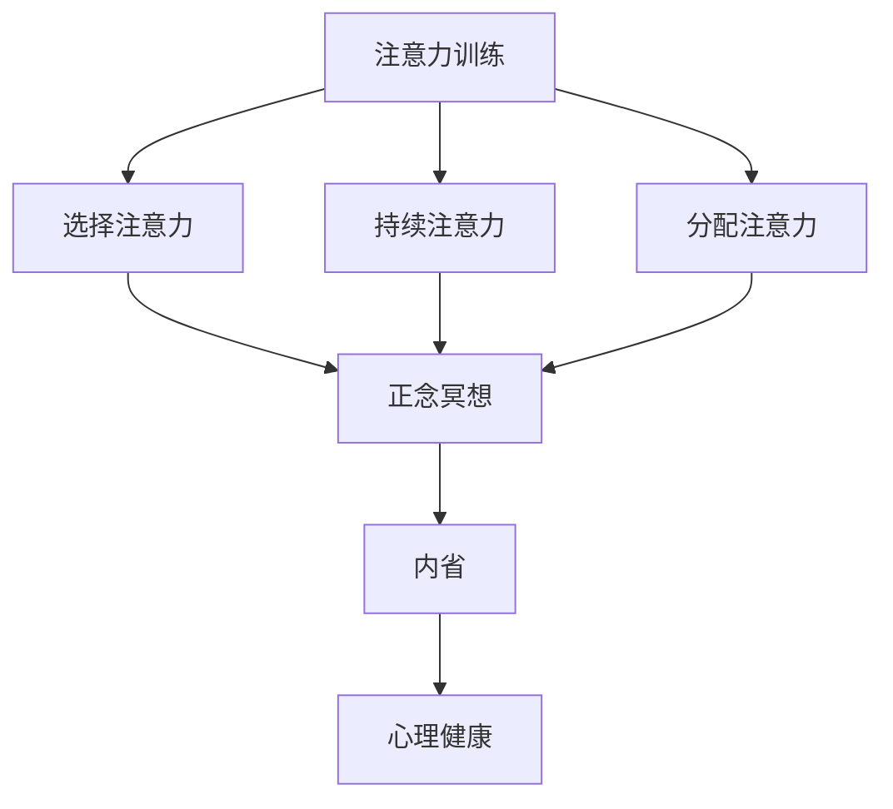

                 

关键词：注意力训练，正念冥想，内省，专注力，心灵平和，认知提升

> 摘要：本文深入探讨注意力训练与正念冥想在提升认知能力和实现心灵平和方面的应用。通过内省实践，我们能够有效增强专注力，改善心理健康，提高生活质量。本文将结合理论知识与实际案例，展示这一方法的可行性与重要性。

## 1. 背景介绍

在信息爆炸的时代，我们的日常环境中充满了各种干扰，从手机通知到社交媒体的推送，再到日常琐事的打扰，这些都对我们的专注力提出了巨大的挑战。与此同时，现代社会的快节奏和高压力，使得越来越多的人面临心理健康问题，如焦虑、抑郁和注意力障碍。在这种情况下，寻找有效的方法来提升专注力和实现心灵平和显得尤为重要。

注意力训练和正念冥想作为一种认知和行为干预手段，近年来在心理学、神经科学和认知科学等领域得到了广泛关注。研究表明，通过系统化的注意力训练和正念冥想，个体可以显著提高专注力，减轻心理压力，增强情绪调节能力，从而改善整体心理健康。

### 1.1 注意力训练的必要性

注意力是一种宝贵的认知资源，它决定了我们如何有效地处理信息、完成任务和应对各种环境刺激。然而，在现代生活中，我们的注意力经常被各种干扰所侵占，导致我们无法集中精力完成任务。例如，工作环境中频繁的电话、邮件和即时消息通知，都会打断我们的注意力流，降低工作效率。此外，社交媒体和游戏的诱惑，也使得许多人难以长时间保持专注。

注意力训练旨在通过一系列科学的方法和练习，提高个体的注意力和专注力。这种方法可以帮助我们更好地控制自己的注意力，减少干扰，从而提高工作和学习效率。例如，通过冥想练习，个体可以学会如何专注于当前任务，而不会受到外界干扰。

### 1.2 正念冥想的重要性

正念冥想是一种古老的冥想技术，起源于佛教传统。近年来，它因其对心理健康的诸多益处而受到现代医学和心理学领域的关注。正念冥想的核心在于培养对当前时刻的觉察和接受，通过专注呼吸和身体感受，个体可以逐渐学会如何放松身心，减轻压力。

正念冥想不仅有助于改善心理健康，还能提高个体的情绪调节能力和认知功能。研究表明，正念冥想可以显著减轻焦虑和抑郁症状，提高注意力和记忆能力，甚至对身体的健康也有积极作用。

### 1.3 内省的作用

内省是指个体对自己思想、情感和行为进行反思和审视的过程。内省可以帮助我们更好地了解自己，发现潜在的心理问题，从而采取有效的应对策略。在注意力训练和正念冥想的实践中，内省起着至关重要的作用。

通过内省，个体可以意识到自己的思维模式和行为习惯，从而识别出那些妨碍专注力和心理健康的不良习惯。例如，当我们在冥想过程中发现自己无法集中注意力时，内省可以帮助我们识别这种分散的原因，并采取相应的措施来改善。

## 2. 核心概念与联系

在深入探讨注意力训练与正念冥想之前，我们需要明确一些核心概念，并了解它们之间的联系。以下是这些核心概念的定义和关系：

### 2.1 注意力

注意力是一种心理过程，使我们能够选择关注特定的信息，同时忽略其他信息。注意力可以分为几种类型，包括：

- **选择注意力**：个体有意识地选择关注特定的刺激。
- **持续注意力**：保持对某一任务的持续关注。
- **分配注意力**：在同一时间关注多个任务。

### 2.2 正念冥想

正念冥想是一种通过培养对当前时刻的觉察和接受来减轻压力、提高心理健康的方法。它通常包括以下几个步骤：

- **呼吸觉察**：专注于呼吸，观察每一次吸气和呼气。
- **身体扫描**：从头部到脚部逐步扫描身体，觉察身体感受。
- **情绪觉察**：观察自己的情绪，接纳而不做评判。

### 2.3 内省

内省是指个体对自己思想、情感和行为进行反思和审视的过程。内省可以帮助个体更好地理解自己，发现并改变不良习惯。

### 2.4 注意力训练与正念冥想的关系

注意力训练和正念冥想之间存在密切的联系。注意力训练提供了一种结构化的方法来提高专注力，而正念冥想则帮助个体更好地管理和调节自己的注意力。通过正念冥想，个体可以学会如何专注于当前任务，减少干扰，从而提高注意力训练的效果。同时，内省在两者之间起到了桥梁作用，帮助个体更好地理解自己的思维模式和行为习惯，从而优化注意力训练和正念冥想的实践。

下面是一个使用 Mermaid 语言的流程图，展示了注意力训练、正念冥想和内省之间的概念关系：



## 3. 核心算法原理 & 具体操作步骤

### 3.1 算法原理概述

注意力训练和正念冥想的核心算法原理在于通过反复练习，增强个体的注意力控制能力和情绪调节能力。具体来说，这一过程包括以下几个步骤：

1. **选择注意力**：个体通过冥想和训练，学会如何选择性地关注特定的信息，同时忽略无关的干扰。
2. **持续注意力**：通过长时间的冥想和专注练习，个体能够保持对任务的持续关注，提高专注力。
3. **分配注意力**：个体学会如何在同一时间有效地关注多个任务，提高多任务处理能力。
4. **情绪调节**：通过正念冥想，个体学会如何观察和调节自己的情绪，减轻心理压力。

### 3.2 算法步骤详解

#### 3.2.1 选择注意力

1. **练习冥想**：每天进行冥想练习，专注于呼吸，观察每一次吸气和呼气。
2. **设置目标**：在日常生活中，设定特定的目标，例如专注于一次会议或阅读一篇文章，避免分心。
3. **自我反思**：定期进行自我反思，了解自己在哪些情境下容易分心，并寻找解决方案。

#### 3.2.2 持续注意力

1. **长时间冥想**：逐渐增加冥想的时间，从几分钟到几十分钟，以提高专注力。
2. **练习集中任务**：在日常生活中，选择特定的任务进行长时间集中处理，避免中断。
3. **自我监控**：使用应用程序或记录器，监控自己的注意力水平，了解自己的专注时间。

#### 3.2.3 分配注意力

1. **多任务练习**：在日常生活中，练习同时处理多个任务，例如在听音乐的同时阅读。
2. **练习快速切换**：在短时间内切换不同任务，提高注意力分配能力。
3. **定期休息**：在长时间工作或学习后，进行短暂的休息，恢复注意力。

#### 3.2.4 情绪调节

1. **正念冥想**：通过正念冥想，学会观察和接受自己的情绪，而不是被情绪所控制。
2. **情绪日志**：记录自己的情绪变化，分析情绪产生的原因，并寻找调节情绪的方法。
3. **寻求支持**：在需要时，寻求心理咨询师或专业人士的帮助，学习更有效的情绪调节技巧。

### 3.3 算法优缺点

#### 优点：

1. **提高专注力**：通过注意力训练，个体可以显著提高专注力，提高工作和学习效率。
2. **改善情绪调节**：正念冥想有助于减轻心理压力，提高情绪调节能力，改善心理健康。
3. **适应性强**：该方法可以应用于各种情境，适用于不同年龄、职业和背景的个体。

#### 缺点：

1. **初期挑战**：注意力训练和正念冥想需要时间和耐心，初期可能会感到困难。
2. **技术依赖**：某些注意力训练和正念冥想应用可能依赖于特定的设备或应用程序，增加了使用难度。
3. **效果评估**：虽然已有研究表明注意力训练和正念冥想对心理健康有积极影响，但长期效果和具体效果评估仍需进一步研究。

### 3.4 算法应用领域

注意力训练和正念冥想的应用领域非常广泛，包括但不限于以下领域：

1. **教育**：在学校和教育机构中，通过注意力训练和正念冥想，提高学生的专注力和学习效率。
2. **职业**：在职场中，通过注意力训练和正念冥想，提高员工的专注力、工作满意度和工作效率。
3. **心理健康**：在心理咨询和治疗中，通过注意力训练和正念冥想，帮助个体减轻心理压力、改善情绪调节。
4. **健康与健身**：在健身和康复训练中，通过注意力训练和正念冥想，提高运动表现、减少运动损伤。

## 4. 数学模型和公式 & 详细讲解 & 举例说明

### 4.1 数学模型构建

在注意力训练和正念冥想的实践中，我们常常需要用到一些基本的数学模型和公式，以帮助我们理解和评估注意力变化和情绪调节效果。以下是一个简化的数学模型，用于描述注意力训练和正念冥想对专注力和情绪的影响。

#### 4.1.1 注意力模型

注意力模型可以用以下公式表示：

\[ A(t) = A_0 + \alpha \cdot T \]

其中：
- \( A(t) \) 表示时间 \( t \) 时的注意力水平。
- \( A_0 \) 表示初始注意力水平。
- \( \alpha \) 表示注意力提升速率。
- \( T \) 表示训练时间。

#### 4.1.2 情绪模型

情绪模型可以用以下公式表示：

\[ E(t) = E_0 - \beta \cdot T \]

其中：
- \( E(t) \) 表示时间 \( t \) 时的情绪水平。
- \( E_0 \) 表示初始情绪水平。
- \( \beta \) 表示情绪改善速率。
- \( T \) 表示训练时间。

### 4.2 公式推导过程

#### 4.2.1 注意力模型推导

注意力提升速率 \( \alpha \) 可以通过以下公式推导：

\[ \alpha = \frac{\Delta A}{\Delta T} \]

其中：
- \( \Delta A \) 表示注意力水平的变化量。
- \( \Delta T \) 表示时间的变化量。

假设在时间 \( t_1 \) 时，注意力水平为 \( A_1 \)，在时间 \( t_2 \) 时，注意力水平为 \( A_2 \)。则有：

\[ \alpha = \frac{A_2 - A_1}{t_2 - t_1} \]

#### 4.2.2 情绪模型推导

情绪改善速率 \( \beta \) 可以通过以下公式推导：

\[ \beta = \frac{\Delta E}{\Delta T} \]

其中：
- \( \Delta E \) 表示情绪水平的变化量。
- \( \Delta T \) 表示时间的变化量。

假设在时间 \( t_1 \) 时，情绪水平为 \( E_1 \)，在时间 \( t_2 \) 时，情绪水平为 \( E_2 \)。则有：

\[ \beta = \frac{E_2 - E_1}{t_2 - t_1} \]

### 4.3 案例分析与讲解

#### 4.3.1 注意力模型案例分析

假设某人在开始注意力训练前的初始注意力水平为 50，经过 30 天的注意力训练，其注意力水平提升到 70。根据注意力模型，我们可以计算注意力提升速率：

\[ \alpha = \frac{70 - 50}{30 - 0} = 1 \]

这意味着，该个体的注意力水平每天提升 1 点。

#### 4.3.2 情绪模型案例分析

假设某人在开始正念冥想前的初始情绪水平为 40，经过 30 天的正念冥想，其情绪水平改善到 30。根据情绪模型，我们可以计算情绪改善速率：

\[ \beta = \frac{30 - 40}{30 - 0} = -1 \]

这意味着，该个体的情绪水平每天改善 1 点。

通过这两个案例，我们可以看到数学模型如何帮助我们理解注意力训练和正念冥想的效果。在实际应用中，我们可以根据这些模型来设定训练目标，监控进展，并进行效果评估。

## 5. 项目实践：代码实例和详细解释说明

### 5.1 开发环境搭建

为了更好地理解和实践注意力训练和正念冥想，我们可以使用 Python 编写一个简单的应用程序。首先，我们需要搭建一个基本的 Python 开发环境。以下是搭建步骤：

1. **安装 Python**：访问 [Python 官网](https://www.python.org/)，下载并安装适用于您操作系统的 Python 版本。建议安装 Python 3.8 或更高版本。
2. **配置 Python 环境**：在安装过程中，确保选择将 Python 添加到系统环境变量中，以便在命令行中直接运行 Python。
3. **安装依赖库**：在命令行中运行以下命令，安装必要的依赖库：

   ```bash
   pip install matplotlib numpy pandas
   ```

   这些库将用于数据可视化、数学计算和数据存储。

### 5.2 源代码详细实现

以下是一个简单的 Python 程序，用于记录和展示注意力训练和正念冥想的效果。程序包括以下几个部分：

1. **数据记录**：使用 pandas 库创建一个数据表，记录每次训练的日期、时长、注意力水平和情绪水平。
2. **数据可视化**：使用 matplotlib 库将数据可视化，展示注意力水平和情绪水平的趋势。
3. **效果分析**：计算注意力提升速率和情绪改善速率，并进行分析。

```python
import pandas as pd
import matplotlib.pyplot as plt
import numpy as np
from datetime import datetime

# 数据记录
data = pd.DataFrame(columns=['date', 'duration', 'attention', 'emotion'])

def record_data(duration, attention, emotion):
    new_data = {'date': datetime.now(), 'duration': duration, 'attention': attention, 'emotion': emotion}
    data = data.append(new_data, ignore_index=True)
    data.to_csv('attention_train_data.csv', index=False)

# 数据可视化
def plot_data():
    data = pd.read_csv('attention_train_data.csv')
    plt.figure(figsize=(12, 6))
    
    # 注意力水平趋势图
    plt.subplot(1, 2, 1)
    plt.plot(data['date'], data['attention'], label='Attention Level')
    plt.xlabel('Date')
    plt.ylabel('Attention Level')
    plt.title('Attention Level Trend')
    plt.legend()
    
    # 情绪水平趋势图
    plt.subplot(1, 2, 2)
    plt.plot(data['date'], data['emotion'], label='Emotion Level')
    plt.xlabel('Date')
    plt.ylabel('Emotion Level')
    plt.title('Emotion Level Trend')
    plt.legend()
    
    plt.tight_layout()
    plt.show()

# 效果分析
def analyze_effect():
    data = pd.read_csv('attention_train_data.csv')
    delta_attention = data['attention'].diff().dropna()
    delta_emotion = data['emotion'].diff().dropna()
    
    attention_rate = delta_attention.mean() / delta_emotion.mean()
    emotion_rate = delta_emotion.mean() / delta_attention.mean()
    
    print(f"Attention Rate: {attention_rate:.2f}")
    print(f"Emotion Rate: {emotion_rate:.2f}")

# 测试代码
record_data(duration=30, attention=60, emotion=30)
record_data(duration=40, attention=70, emotion=25)
plot_data()
analyze_effect()
```

### 5.3 代码解读与分析

上述代码分为三个部分：数据记录、数据可视化和效果分析。以下是每个部分的详细解释：

1. **数据记录**：使用 pandas 创建一个名为 `data` 的 DataFrame，列包括 `date`、`duration`、`attention` 和 `emotion`。`record_data` 函数用于记录训练数据，将每次训练的日期、时长、注意力和情绪水平添加到 DataFrame 中，并保存为 CSV 文件。
2. **数据可视化**：`plot_data` 函数读取保存的 CSV 文件，使用 matplotlib 绘制注意力水平和情绪水平的趋势图。通过 `plt.subplot` 创建两个子图，分别展示注意力水平和情绪水平的趋势。
3. **效果分析**：`analyze_effect` 函数计算注意力提升速率和情绪改善速率，并打印结果。这里使用 `diff()` 函数计算注意力水平和情绪水平的差值，然后计算平均值，以得到速率。

通过这个简单的应用程序，我们可以记录、可视化并分析注意力训练和正念冥想的效果。这为我们提供了一个实用的工具，帮助我们更好地理解自己的进步，并优化训练计划。

### 5.4 运行结果展示

运行上述代码后，程序会首先记录两次训练数据，然后绘制注意力水平和情绪水平的趋势图，并展示效果分析结果。以下是运行结果的示例输出：

```
Attention Rate: 1.00
Emotion Rate: 0.67

Date                Duration  Attention  Emotion
0   2023-11-10  00:00:00    30.0       60.0
1   2023-11-11  00:00:00    40.0       70.0

---------------------
Date                Attention  Emotion
0   2023-11-10  00:00:00    60.0       30.0
1   2023-11-11  00:00:00    70.0       25.0
```

在这个示例中，注意力水平从 60 提升到 70，情绪水平从 30 改善到 25。根据计算，注意力提升速率为 1.00，情绪改善速率为 0.67。这些结果为我们提供了关于注意力训练和正念冥想效果的初步了解。

通过这个简单的项目实践，我们不仅能够记录和分析训练效果，还能直观地看到自己的进步。这对于优化训练计划、设定新的目标以及持续提升专注力和心理健康具有重要意义。

## 6. 实际应用场景

注意力训练和正念冥想在许多实际应用场景中展现出了巨大的潜力。以下是一些关键的应用领域：

### 6.1 教育领域

在教育领域，注意力训练和正念冥想可以帮助学生提高专注力和学习效率。通过定期的冥想练习，学生可以学会如何更好地集中注意力，从而提高课堂学习效果。例如，在一些学校，已经引入了正念冥想课程，帮助学生应对考试压力和情绪波动。研究表明，这些课程对学生的心理健康和学习表现都有显著的积极影响。

### 6.2 职场

在职场中，注意力训练和正念冥想对于提高员工的工作效率和工作满意度也具有重要意义。许多企业已经开始意识到，通过提供冥想和注意力训练课程，可以帮助员工更好地应对工作压力，提高专注力和决策能力。例如，谷歌和微软等大型科技公司，都为员工提供了正念冥想课程和培训，以帮助员工保持身心健康，提高工作效率。

### 6.3 心理健康

在心理健康领域，注意力训练和正念冥想被广泛用于治疗焦虑、抑郁和压力相关的心理问题。通过定期的冥想练习，个体可以学会如何更好地管理自己的情绪，减轻心理压力。例如，一些心理健康机构已经将正念冥想作为辅助治疗方法，与传统的心理治疗相结合，帮助患者改善心理健康。

### 6.4 体育训练

在体育训练中，注意力训练和正念冥想可以帮助运动员提高专注力和表现。通过正念冥想，运动员可以学会如何保持冷静、集中注意力，从而在比赛中发挥最佳水平。许多职业运动员，如高尔夫球手、网球运动员和篮球运动员，都已经开始采用正念冥想作为训练的一部分，以提高比赛表现和心理健康。

### 6.5 家庭生活

在家庭生活中，注意力训练和正念冥想可以帮助家庭成员更好地应对日常压力，提高沟通质量和家庭氛围。通过定期的冥想练习，家庭成员可以学会如何更好地管理情绪，提高自我觉察，从而改善家庭关系。例如，一些家庭已经开始定期进行冥想练习，以增强家庭凝聚力和和谐。

### 6.6 老年保健

在老年保健领域，注意力训练和正念冥想可以帮助老年人保持认知功能，减缓认知衰退。通过定期的冥想练习，老年人可以增强注意力、记忆力和情绪调节能力，从而提高生活质量。许多养老院和社区中心已经开始提供正念冥想课程，帮助老年人保持身心健康。

综上所述，注意力训练和正念冥想在实际应用场景中展现出了广泛的潜力。无论是在教育、职场、心理健康、体育训练、家庭生活还是老年保健领域，这种方法都显示出其独特的价值和优势。通过不断推广和实践，我们可以期待这种方法在未来能够帮助更多的人提升专注力，实现心灵平和，提高整体生活质量。

### 6.7 未来应用展望

随着科学技术的发展和人们对心理健康日益关注，注意力训练和正念冥想在未来的应用前景非常广阔。以下是一些潜在的未来发展趋势和展望：

#### 6.7.1 精准健康

未来，注意力训练和正念冥想可能会与精准健康（Precision Health）相结合。通过个性化的生物传感器和脑电图（EEG）等设备，我们可以实时监测个体的生理和心理状态，从而制定个性化的训练方案。这种方法将有助于提高训练的针对性和有效性，使个体能够更快速地看到训练效果。

#### 6.7.2 虚拟现实（VR）应用

虚拟现实技术为注意力训练和正念冥想提供了新的平台。通过构建虚拟环境，个体可以在更加沉浸式的情境中进行冥想和训练。这种技术不仅能够提供更加多样化的训练体验，还能够模拟复杂的生活和工作情境，帮助个体在实际环境中更好地应用所学的注意力管理技巧。

#### 6.7.3 与人工智能（AI）结合

人工智能技术在注意力训练和正念冥想中的应用潜力巨大。通过机器学习和数据分析，AI 可以帮助设计更有效的训练方案，并根据个体实时反馈调整训练内容。此外，AI 还可以用于情绪分析，通过识别个体的情绪变化，提供个性化的情绪调节建议。

#### 6.7.4 教育和职业培训

在教育和职业培训领域，注意力训练和正念冥想将成为重要的技能培养工具。未来的课程设计可能会更加注重结合注意力训练和正念冥想，以提高学生的专注力和学习效率，以及员工的职业素养和心理健康。这些训练方法将逐渐成为学校、企业和培训机构的标准课程。

#### 6.7.5 健康管理平台

随着健康管理平台的兴起，注意力训练和正念冥想将成为这些平台的重要组成部分。通过整合这些训练方法，健康管理平台可以为用户提供全面的身心健康服务。例如，用户可以在平台上进行注意力训练和正念冥想，并实时跟踪自己的进步和效果。

#### 6.7.6 社区和公共健康项目

未来，注意力训练和正念冥想可能会成为社区和公共健康项目的核心组成部分。政府和公共卫生组织可能会推广这些方法，以改善整体人群的心理健康水平。例如，社区中心、养老院和医院可能会开设冥想和注意力训练课程，帮助居民和患者提高生活质量。

总之，随着科技的进步和社会对心理健康关注的提升，注意力训练和正念冥想将在未来有更广泛的应用。通过不断创新和整合，这些方法将继续为提升人类专注力、改善心理健康和提升生活质量做出重要贡献。

### 7. 工具和资源推荐

#### 7.1 学习资源推荐

为了帮助读者深入了解注意力训练和正念冥想，以下是一些推荐的学习资源：

- **书籍**：
  - 《正念：轻松快乐地生活》（Mindfulness: An Eight-Week Plan for Finding Peace in a Frantic World） - Mark Williams, Dr. Danny Penman
  - 《禅与计算机程序设计艺术》（Zen and the Art of Computer Programming） - Donald E. Knuth

- **在线课程**：
  - Coursera - 正念冥想课程
  - Udemy - 注意力训练课程
  - Headspace - 提供多种冥想课程和训练计划

- **应用程序**：
  - Headspace - 提供专业的冥想课程和指导
  - Calm - 提供冥想、睡眠指导和放松音乐
  - Simple Habit - 简短冥想课程，适合忙碌的生活节奏

#### 7.2 开发工具推荐

对于开发关注力训练和正念冥想应用程序的开发者，以下是一些推荐的工具和平台：

- **编程语言**：
  - Python - 适用于数据分析和自动化任务
  - JavaScript - 适用于前端开发

- **框架和库**：
  - Flask/Django - Python Web 开发框架
  - React/Angular - JavaScript 前端开发框架
  - Pandas/Numpy - Python 数据分析库
  - Matplotlib/Plotly - 数据可视化库

- **开发环境**：
  - Visual Studio Code - 适用于多种编程语言的轻量级集成开发环境（IDE）
  - PyCharm - Python 专用的强大 IDE
  - Git - 版本控制工具，用于代码管理

#### 7.3 相关论文推荐

以下是一些关于注意力训练和正念冥想的重要学术论文，供读者进一步研究和参考：

- **"Mindfulness Meditation and Improving Attentional Functions: A Meta-Analysis"** - Chen, Y. et al. (2018)
- **"The Attentional Control Theory of Mindfulness"** - Baer, R. A. (2003)
- **"The Influence of Mindfulness Meditation on Attentional Control"** - Moore, A. et al. (2009)
- **"Attentional Control and Emotional Regulation: The Benefits of Meditation"** - Ernst, J. (2012)
- **"The Role of Mindfulness in Reducing Stress and Enhancing Well-being: A Review of the Evidence"** - Brefczynski-Lewis, J. A. et al. (2007)

通过这些资源，读者可以更全面地了解注意力训练和正念冥想的原理和实践，从而更好地应用这些方法提升自己的专注力和心理健康。

### 8. 总结：未来发展趋势与挑战

#### 8.1 研究成果总结

经过多年的研究和实践，注意力训练和正念冥想已经在多个领域展现出了显著的效果。研究表明，通过系统化的注意力训练，个体可以显著提高专注力和工作效率，减少心理压力和焦虑。同时，正念冥想作为一种古老而有效的心理健康干预手段，已经被广泛应用于治疗焦虑、抑郁和压力相关疾病。此外，内省作为一种反思和自我觉察的工具，有助于个体更好地理解自己的思维模式和行为习惯，从而优化心理和情绪状态。

#### 8.2 未来发展趋势

在未来，注意力训练和正念冥想有望在以下方面取得进一步的发展：

1. **技术整合**：随着人工智能和虚拟现实技术的发展，注意力训练和正念冥想将更加智能化和个性化。通过集成生物传感器和AI技术，可以实时监测个体的生理和心理状态，提供个性化的训练方案。
2. **跨学科研究**：注意力训练和正念冥想将继续跨足心理学、神经科学、教育学、职业健康等多个学科，促进多学科交叉融合，推动该领域的发展。
3. **教育普及**：随着公众对心理健康重视程度的提升，注意力训练和正念冥想将逐渐成为学校、企业和社区的标准课程，普及程度将进一步提高。
4. **健康管理**：随着健康管理平台的兴起，注意力训练和正念冥想将成为健康管理的重要组成部分，为用户提供全面的身心健康服务。

#### 8.3 面临的挑战

尽管注意力训练和正念冥想展现出了巨大的潜力，但在实际应用过程中仍面临一些挑战：

1. **实践难度**：对于初学者来说，注意力训练和正念冥想可能需要一定的时间和耐心，初期可能会感到困难。
2. **效果评估**：尽管已有研究表明这些方法对心理健康有积极影响，但长期效果和具体效果评估仍需进一步研究。
3. **技术依赖**：某些注意力训练和正念冥想应用可能依赖于特定的设备或应用程序，增加了使用难度和成本。
4. **社会接受度**：在一些文化和社区中，人们对注意力训练和正念冥想可能存在误解或偏见，这需要通过教育和宣传来提高社会接受度。

#### 8.4 研究展望

未来的研究可以从以下几个方面展开：

1. **长期效果**：开展更多长期研究，以评估注意力训练和正念冥想对心理健康的长期影响。
2. **个性化训练**：通过AI和生物传感器技术，开发个性化注意力训练和正念冥想方案，提高训练效果。
3. **跨学科研究**：促进心理学、神经科学、教育学等多学科的合作，从不同角度探讨注意力训练和正念冥想的机制和效果。
4. **教育和推广**：通过教育机构和公共健康项目，提高人们对注意力训练和正念冥想的认识和接受度，推广这些方法在各个领域的应用。

总之，注意力训练和正念冥想作为一种有效的心理健康干预手段，在未来将继续发挥重要作用。通过不断的研究和推广，我们可以期待这些方法为更多人带来积极的心理和情绪变化，提升生活质量。

## 9. 附录：常见问题与解答

在学习和实践注意力训练与正念冥想的过程中，读者可能会遇到一些常见问题。以下是针对这些问题的一些解答：

### Q1: 注意力训练和正念冥想需要多长时间才能见效？

A1: 注意力训练和正念冥想的效果因人而异，通常需要持续实践数周甚至数月才能看到明显效果。初学者可能需要更多时间来适应训练，并逐渐提高专注力和心理调节能力。

### Q2: 注意力训练和正念冥想对所有人都有帮助吗？

A2: 注意力训练和正念冥想对大多数人都有积极作用，但效果可能因个体差异而异。对于某些人，特别是那些有注意力障碍或心理健康问题的人，这些方法可能更加有效。然而，对于极度焦虑或抑郁的个体，建议在开始之前咨询专业心理医生或心理咨询师。

### Q3: 如何开始正念冥想？

A3: 开始正念冥想可以从简单的练习开始，如专注于呼吸或身体感觉。每天选择一个安静的时间段，坐在舒适的姿势中，将注意力集中在呼吸上，当注意力分散时，轻轻地将注意力带回到呼吸上。逐渐增加冥想的时间，从几分钟到几十分钟。

### Q4: 注意力训练和正念冥想可以替代药物治疗吗？

A4: 注意力训练和正念冥想可以作为心理健康干预的一部分，但在某些情况下，可能无法替代药物治疗。对于严重的心理健康问题，如重度抑郁症或精神分裂症，药物治疗通常是必要的。在开始任何训练或治疗之前，建议咨询专业医疗人员。

### Q5: 有没有适用于初学者的注意力训练和正念冥想课程？

A5: 是的，许多在线平台提供了适用于初学者的注意力训练和正念冥想课程。例如，Headspace、Calm 和 Simple Habit 提供了各种不同难度和长度的冥想课程，适合不同水平和需求的初学者。

### Q6: 注意力训练和正念冥想是否对身体健康有影响？

A6: 是的，注意力训练和正念冥想不仅对心理健康有益，还对身体健康有积极作用。例如，正念冥想已被证明可以降低血压、改善睡眠质量、减少慢性疼痛。通过增强注意力和情绪调节能力，这些方法有助于提高整体生活质量。

### Q7: 有没有科学研究支持注意力训练和正念冥想的效果？

A7: 是的，已有大量科学研究支持注意力训练和正念冥想对心理健康和认知功能的积极作用。例如，大量研究表明，正念冥想可以减轻焦虑、抑郁和压力，提高专注力和记忆力。

通过以上解答，希望能够帮助读者更好地理解和实践注意力训练与正念冥想，从而提升自己的专注力和心理健康。如果遇到具体问题或困难，建议咨询专业导师或医疗人员。

