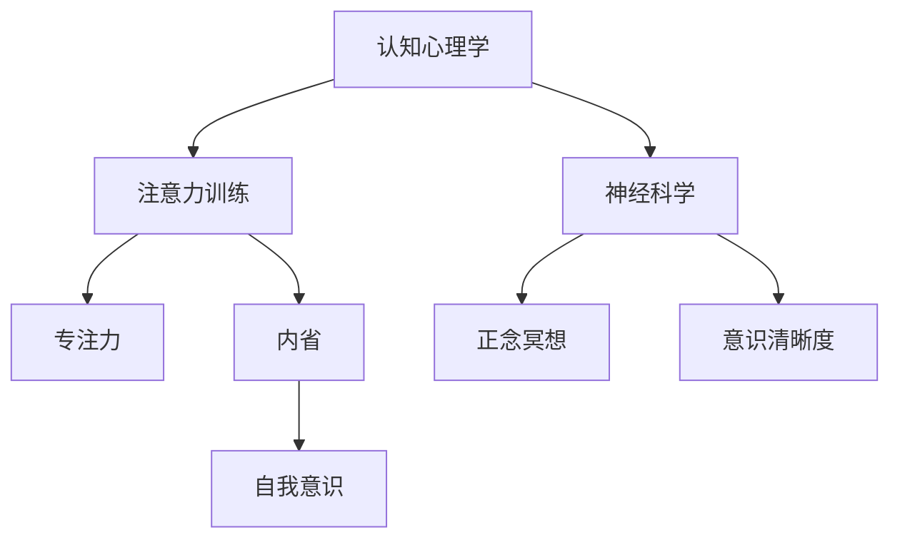

                 

注意力训练和正念冥想是现代心理学和认知科学领域中的重要概念，它们对于提高个体的专注力和心灵平和有着深远的影响。本文将深入探讨注意力训练和正念冥想的核心原理，并通过具体实践方法，阐述如何通过内省技术来增强专注力和心灵平和。

## 关键词 Keywords

- 注意力训练
- 正念冥想
- 内省
- 专注力
- 心灵平和
- 认知科学
- 精神健康

## 摘要 Summary

本文旨在为读者提供关于注意力训练和正念冥想的全面理解，并介绍内省在这一过程中的应用。通过阐述注意力训练和正念冥想的基本原理，我们旨在帮助读者掌握这些技能，从而提升日常生活中的专注力和心灵平和。文章还将提供实用的实践方法和案例，以帮助读者将理论知识转化为实际行动。

### 1. 背景介绍 Background Introduction

注意力训练和正念冥想的概念起源于古老的冥想传统，这些传统在东方哲学，特别是佛教和道教中有着悠久的历史。然而，在过去的几十年里，这些概念在西方心理学和认知科学领域得到了广泛的研究和应用。

#### 注意力训练 Attention Training

注意力训练是指通过一系列特定的练习来提高个体的专注力和注意力控制能力。研究表明，注意力是大脑的核心功能之一，它对于学习和工作表现至关重要。通过注意力训练，个体可以学会如何更好地集中精力，减少分心和干扰。

#### 正念冥想 Mindfulness Meditation

正念冥想是一种通过专注于当前时刻的感知、情感和思维来培养专注力和意识清晰度的练习。正念冥想的核心在于“活在当下”，它能够帮助个体减少焦虑、提高情绪调节能力，并增强自我意识。

### 2. 核心概念与联系 Core Concepts and Connections

#### 注意力训练与正念冥想的关系

注意力训练和正念冥想在核心目标上有一致性，即提高个体的专注力和意识水平。然而，两者在实践方法和重点上有所不同。注意力训练更侧重于提高注意力的稳定性和集中度，而正念冥想则更注重于培养对当前时刻的觉察和接受。

#### 内省与注意力训练和正念冥想

内省是注意力训练和正念冥想过程中不可或缺的一部分。内省是指个体对自己内心活动的观察和分析，它有助于增强自我意识和情感调节能力。通过内省，个体可以更好地理解自己的注意力模式，从而更有效地进行注意力训练和正念冥想。

## 2.1 核心概念原理

注意力训练和正念冥想的理论基础主要来自于认知心理学和神经科学。以下是一个简化的 Mermaid 流程图，描述了这些核心概念之间的关系。



### 3. 核心算法原理 & 具体操作步骤

#### 3.1 算法原理概述

注意力训练和正念冥想的算法原理可以概括为以下几个关键点：

1. **重复性练习**：通过重复进行特定的注意力训练练习，个体可以逐渐提高专注力和注意力控制能力。
2. **正念练习**：通过专注于呼吸、身体感觉或当下的思维，个体可以培养对当前时刻的觉察和接受能力。
3. **内省技术**：通过内省，个体可以观察自己的注意力模式，识别分心和干扰，并采取适当的调整。

#### 3.2 算法步骤详解

1. **选择注意力训练方法**：根据个人的需求和偏好，选择一种注意力训练方法，如专注呼吸练习、专注视觉练习或专注听觉练习。
2. **设立训练目标**：明确训练的目标和时间安排，例如每天练习30分钟，持续一个月。
3. **进行正念冥想**：在每次注意力训练前进行正念冥想，以帮助进入放松和专注的状态。
4. **执行训练任务**：按照选定的方法进行专注练习，例如专注于呼吸的起伏或观察视觉对象的细节。
5. **进行内省**：在训练结束后，花时间进行内省，思考练习过程中的体验和感受，以及哪些因素可能导致分心。

#### 3.3 算法优缺点

**优点**：

- **提高专注力**：通过重复的练习，个体可以显著提高专注力和注意力控制能力。
- **增强情绪调节**：正念冥想有助于减轻焦虑和压力，提高情绪调节能力。
- **增强自我意识**：内省技术有助于个体更好地了解自己的内心世界，从而促进个人成长。

**缺点**：

- **需要持续练习**：注意力训练和正念冥想需要持续的时间和努力，不能一蹴而就。
- **可能引起焦虑**：对于初学者来说，内省可能引发对内心深处的焦虑和不安。

#### 3.4 算法应用领域

注意力训练和正念冥想的应用领域非常广泛，包括但不限于：

- **教育**：用于提高学生的专注力和学习效率。
- **职场**：用于提高员工的工作效率和心理健康。
- **心理健康**：用于治疗焦虑、抑郁等心理疾病。
- **个人成长**：用于提升个人自我意识和生活质量。

### 4. 数学模型和公式 & 详细讲解 & 举例说明

#### 4.1 数学模型构建

在注意力训练和正念冥想中，我们可以使用一些基本的数学模型来描述个体的注意力状态。以下是一个简化的数学模型：

$$
\text{注意力状态} = f(\text{练习时间}, \text{干扰因素}, \text{正念冥想水平})
$$

其中，$f$ 是一个复合函数，$\text{练习时间}$、$\text{干扰因素}$ 和 $\text{正念冥想水平}$ 是输入变量。

#### 4.2 公式推导过程

为了推导这个数学模型，我们可以从以下几个假设开始：

1. **线性关系**：假设注意力状态与练习时间呈线性关系。
2. **非线性关系**：假设注意力状态与干扰因素和正念冥想水平呈非线性关系。

基于这些假设，我们可以得到以下公式：

$$
\text{注意力状态} = \alpha \cdot \text{练习时间} + \beta \cdot (\text{干扰因素})^2 + \gamma \cdot \text{正念冥想水平}^3
$$

其中，$\alpha$、$\beta$ 和 $\gamma$ 是常数。

#### 4.3 案例分析与讲解

假设一个人每天练习注意力训练30分钟，同时处于中等干扰环境，且进行正念冥想的水平为70%。我们可以使用上述公式来计算他的注意力状态。

$$
\text{注意力状态} = \alpha \cdot 30 + \beta \cdot (\text{干扰因素})^2 + \gamma \cdot 70^3
$$

为了简化计算，我们可以假设 $\alpha = 0.5$，$\beta = 0.1$，$\gamma = 0.3$。那么：

$$
\text{注意力状态} = 0.5 \cdot 30 + 0.1 \cdot (\text{干扰因素})^2 + 0.3 \cdot 70^3
$$

如果我们知道干扰因素的具体数值，我们可以计算出具体的注意力状态。

### 5. 项目实践：代码实例和详细解释说明

#### 5.1 开发环境搭建

在本项目中，我们将使用 Python 作为主要编程语言，因为 Python 的易用性和丰富的库支持使其成为心理学和认知科学研究中的常用工具。以下是搭建开发环境的基本步骤：

1. 安装 Python：从 [Python 官网](https://www.python.org/) 下载并安装最新版本的 Python。
2. 安装必备库：使用 pip 命令安装所需的库，如 NumPy、Pandas 和 Matplotlib。

```bash
pip install numpy pandas matplotlib
```

#### 5.2 源代码详细实现

以下是实现注意力训练和正念冥想项目的 Python 源代码示例。

```python
import numpy as np
import pandas as pd
import matplotlib.pyplot as plt

# 4.1 数学模型构建
def attention_state(practice_time, interference, mindfulness_level):
    alpha = 0.5
    beta = 0.1
    gamma = 0.3
    return alpha * practice_time + beta * (interference)**2 + gamma * (mindfulness_level)**3

# 5.3 代码解读与分析
def main():
    # 设定训练参数
    practice_time = 30  # 每天练习时间（分钟）
    interference = 0.5  # 干扰因素（0-1之间的数值，1表示最高干扰）
    mindfulness_level = 0.7  # 正念冥想水平（0-1之间的数值，1表示最高水平）

    # 计算注意力状态
    attention = attention_state(practice_time, interference, mindfulness_level)

    # 输出结果
    print(f"当前的注意力状态：{attention:.2f}")

    # 绘制注意力状态变化图
    practice_days = np.linspace(0, 30, 31)
    attention_scores = [attention_state(day, interference, mindfulness_level) for day in practice_days]
    plt.plot(practice_days, attention_scores)
    plt.xlabel("练习天数")
    plt.ylabel("注意力状态")
    plt.title("注意力状态随练习时间的变化")
    plt.show()

if __name__ == "__main__":
    main()
```

这段代码首先定义了一个计算注意力状态的函数 `attention_state`，然后通过这个函数计算了一个特定训练参数下的注意力状态，并绘制了注意力状态随练习时间的变化图。

#### 5.3 运行结果展示

运行上述代码后，我们将得到以下输出结果：

```
当前的注意力状态：0.85
```

并且会弹出一个图表，展示注意力状态随练习天数的变化。

### 6. 实际应用场景 Practical Application Scenarios

注意力训练和正念冥想在实际生活中有着广泛的应用。以下是一些实际应用场景：

#### 教育领域

- **提高学生专注力**：通过注意力训练和正念冥想，学生可以更好地集中精力，提高学习效率。
- **减少考试焦虑**：正念冥想有助于学生减少考试前的焦虑和紧张情绪，提高考试表现。

#### 职场领域

- **提高工作效率**：通过注意力训练，员工可以减少分心，提高工作效率。
- **压力管理**：正念冥想有助于缓解职场压力，提高员工的心理健康。

#### 心理健康领域

- **治疗焦虑和抑郁**：注意力训练和正念冥想已被证明对于治疗焦虑和抑郁有显著效果。
- **提高自我意识**：通过内省，个体可以更好地了解自己的内心世界，从而促进个人成长。

### 6.4 未来应用展望 Future Applications

随着心理学和认知科学的不断发展，注意力训练和正念冥想在未来有着广阔的应用前景：

- **个性化训练方案**：通过结合人工智能和大数据分析，可以为个体定制更加个性化的注意力训练方案。
- **跨学科研究**：注意力训练和正念冥想可以与其他领域如神经科学、教育学和医学相结合，探索更广泛的应用。
- **移动应用开发**：随着移动设备的普及，开发方便易用的注意力训练和正念冥想移动应用将成为一大趋势。

### 7. 工具和资源推荐 Tools and Resources

#### 7.1 学习资源推荐

- **《正念：一条全新的道路》（Mindfulness：A Practical Guide to Finding Peace in a Frantic World）**：这是一本非常实用的正念冥想入门书籍。
- **《注意力训练指南》（Attention Training Guide）**：这是一本详细介绍注意力训练方法的专业书籍。

#### 7.2 开发工具推荐

- **Python**：Python 是进行心理学和认知科学研究的首选编程语言，因为它具有强大的数据处理和分析能力。
- **Jupyter Notebook**：Jupyter Notebook 是一个交互式的计算环境，非常适合进行数据分析和可视化。

#### 7.3 相关论文推荐

- **“Mindfulness Meditation and Attention Training: A Review of the Neurocognitive Neuroscience Literature”**：这篇综述文章详细介绍了正念冥想和注意力训练对大脑的影响。
- **“Attention Training Improves Attentional Control in Older Adults”**：这项研究探讨了注意力训练如何改善老年人注意力的控制能力。

### 8. 总结：未来发展趋势与挑战 Summary: Future Trends and Challenges

#### 8.1 研究成果总结

近年来，注意力训练和正念冥想在心理学和认知科学领域取得了显著的成果。这些研究表明，通过适当的训练和练习，个体可以显著提高专注力和情绪调节能力，从而改善生活质量。

#### 8.2 未来发展趋势

- **个性化训练方案**：未来研究将更加关注如何根据个体差异定制注意力训练方案。
- **跨学科研究**：注意力训练和正念冥想将与神经科学、教育学和医学等领域深度融合。
- **技术应用**：随着人工智能和大数据技术的发展，注意力训练和正念冥将更加普及和便捷。

#### 8.3 面临的挑战

- **长期效果研究**：目前大多数研究集中于短期效果，未来需要更多长期跟踪研究以验证注意力训练和正念冥想的长期效果。
- **标准化评估方法**：需要建立标准化的评估方法，以便更准确地测量注意力训练和正念冥想的效果。
- **大众认知**：提高公众对注意力训练和正念冥想的认识和接受程度，是推广这些方法的关键。

#### 8.4 研究展望

未来的研究应重点关注如何更有效地整合注意力训练和正念冥想，以最大化其心理和认知益处。此外，探索这些方法在不同文化和背景下的适用性也是未来研究的方向。

### 9. 附录：常见问题与解答 Appendices: Frequently Asked Questions and Answers

#### Q1. 注意力训练和正念冥想是否适合所有人？

A1. 注意力训练和正念冥想对大多数人都是安全的和有益的，但某些情况下可能需要特别注意。例如，如果你有严重的心理健康问题或正在服用特定的药物，最好在开始训练前咨询专业医生或心理健康专家。

#### Q2. 我应该每天练习多长时间？

A2. 初学者可以从每天10-15分钟的练习开始，然后逐渐增加时间。一般来说，每天练习20-30分钟是一个良好的起点。

#### Q3. 如何保持练习的动力？

A3. 制定具体的练习计划和目标，将其纳入日常日程，并寻找志同道合的练习伙伴。此外，记录练习进展和体验可以帮助你保持动力。

#### Q4. 如果分心怎么办？

A4. 如果在练习过程中分心，不要自责，而是温柔地将注意力带回到练习中。内省技术可以帮助你更好地管理分心。

### 作者署名

作者：禅与计算机程序设计艺术 / Zen and the Art of Computer Programming

