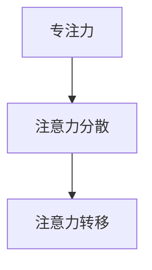
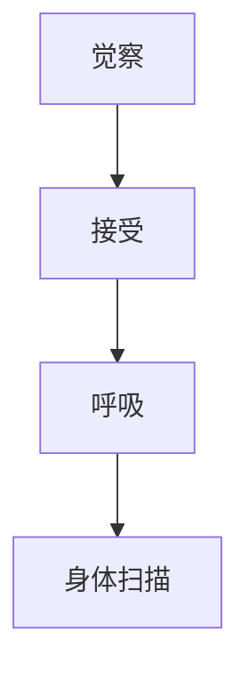
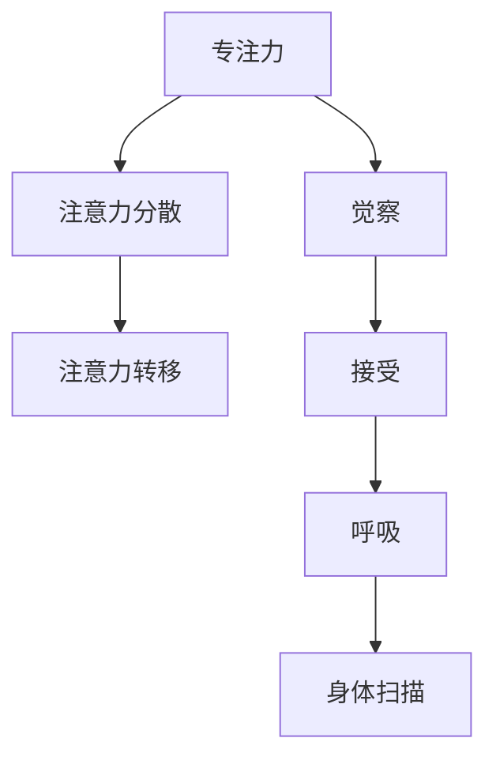

                 

关键词：注意力训练、正念实践、内省、专注、心灵平和、清晰度、认知提升、算法优化、软件工程、人工智能、心理健康

> 摘要：本文深入探讨注意力训练与正念实践的结合，介绍如何通过内省和专注来增强心灵平和与清晰度。文章旨在揭示这些实践在IT领域的应用，并提供实用的方法和技巧，帮助读者在技术工作中实现心理健康和认知提升。

## 1. 背景介绍

在当今快节奏、高度信息化的社会中，IT行业的工作压力与日俱增。程序员、软件工程师、系统架构师等专业人士常常面临复杂的项目任务、紧张的时间限制以及不断更新的技术标准。这些压力可能导致心理压力、焦虑、疲劳等心理问题，进而影响工作效率和健康。

面对这样的挑战，注意力训练和正念实践逐渐被引入到IT行业中。注意力训练是一种提高专注力和注意力的方法，它通过特定的训练活动来增强大脑的处理能力。正念实践则是一种基于佛教传统的冥想方法，它强调对当前时刻的完全觉察和接受，旨在培养心灵的平和与清晰度。

本文将探讨如何将注意力训练与正念实践结合起来，通过内省和专注来增强心灵平和与清晰度。文章将结合具体案例，介绍这些实践在IT领域的应用，并提供实用的方法和技巧，帮助读者在实际工作中实现心理健康和认知提升。

### 1.1 注意力训练的重要性

注意力是认知功能的核心，它直接影响着我们的学习、工作和决策。然而，现代社会的信息过载和持续的分心因素使得我们的注意力容易分散。研究表明，长期处于注意力分散状态会导致大脑疲劳、记忆力下降、工作效率降低等问题。

注意力训练旨在通过一系列有针对性的训练活动来提高专注力和注意力。这些训练活动通常包括定时练习、专注力游戏、专注力挑战等。通过这些练习，我们可以逐渐培养出更强的注意力，从而更好地应对复杂的工作任务。

### 1.2 正念实践的价值

正念实践，也称为正念冥想，是一种基于佛教传统的冥想方法。它强调对当前时刻的完全觉察和接受，通过持续的练习，可以帮助我们培养出更加平和与清晰的心灵状态。

正念实践对心理健康和认知提升有着显著的好处。首先，它有助于减少焦虑、压力和情绪波动，提高情绪调节能力。其次，它可以帮助我们更好地集中注意力，提高认知功能，包括记忆力、决策能力和创造力。此外，正念实践还可以改善人际关系，提升团队合作能力。

### 1.3 IT领域的应用场景

在IT领域中，注意力训练和正念实践的应用场景非常广泛。以下是一些典型的应用场景：

1. **软件开发**：程序员在编写代码时，需要高度集中注意力，避免分心和错误。通过注意力训练和正念实践，程序员可以提高编程效率，减少错误发生。

2. **系统架构设计**：系统架构师在设计和优化系统架构时，需要深入思考并保持注意力集中。正念实践可以帮助他们保持清晰的思路，提高设计质量。

3. **项目管理**：项目经理在管理项目时，需要处理多个任务和团队，保持注意力集中是非常重要的。注意力训练和正念实践可以帮助项目经理更好地应对项目中的压力和挑战。

4. **团队协作**：在团队协作中，正念实践可以帮助团队成员更好地沟通和协作，提高团队效率。

## 2. 核心概念与联系

在本节中，我们将介绍注意力训练和正念实践的核心概念，并使用Mermaid流程图展示这些概念之间的联系。

### 2.1 注意力训练

注意力训练的核心概念包括：

- **专注力**：指个体在特定任务上保持注意力集中的能力。
- **注意力分散**：指个体在执行任务过程中注意力被其他因素干扰的现象。
- **注意力转移**：指个体在不同任务之间切换注意力的能力。

以下是注意力训练的核心概念Mermaid流程图：



### 2.2 正念实践

正念实践的核心概念包括：

- **觉察**：指对当前时刻的完全觉察和接受。
- **接受**：指对当前体验的接纳，无论好坏。
- **呼吸**：指通过深呼吸来调节情绪和注意力。
- **身体扫描**：指通过逐步扫描身体来放松身心。

以下是正念实践的核心概念Mermaid流程图：



### 2.3 注意力训练与正念实践的联系

注意力训练和正念实践之间存在密切的联系。通过正念实践，我们可以更好地觉察和接受当前时刻，从而提高注意力的质量和稳定性。注意力训练则为正念实践提供了具体的练习方法，帮助我们培养出更强的专注力和注意力。

以下是注意力训练与正念实践联系的综合Mermaid流程图：



## 3. 核心算法原理 & 具体操作步骤

### 3.1 算法原理概述

在本节中，我们将介绍如何将注意力训练和正念实践结合到IT领域的具体算法中。核心算法原理包括以下几个步骤：

1. **内省**：通过内省，我们可以更好地了解自己的心理状态和注意力水平。
2. **专注练习**：通过特定的专注练习，如定时练习和专注力游戏，提高专注力和注意力。
3. **正念冥想**：通过正念冥想，培养对当前时刻的觉察和接受，提高情绪调节能力和注意力稳定性。
4. **反馈循环**：通过反馈循环，不断调整训练方法和策略，以达到最佳效果。

### 3.2 算法步骤详解

1. **第一步：内省**

内省是注意力训练和正念实践的基础。通过内省，我们可以更好地了解自己的心理状态和注意力水平。具体操作步骤如下：

- **设定内省时间**：每天设定一个固定的时间进行内省，如早晨起床后或晚上睡前。
- **静坐**：选择一个安静的环境，保持坐姿，闭目静坐。
- **观察呼吸**：关注自己的呼吸，感受每一次呼吸的进出。
- **内省内容**：反思过去一天的工作和生活，观察自己的情绪和注意力变化。

2. **第二步：专注练习**

专注练习是提高注意力的关键。以下是一些常用的专注练习方法：

- **定时练习**：设定一个固定的时间，如5分钟或10分钟，专注于一个特定的任务或活动。
- **专注力游戏**：通过专注力游戏，如打坐游戏、专注力挑战等，提高专注力。

3. **第三步：正念冥想**

正念冥想是培养注意力稳定性和情绪调节能力的重要方法。以下是一些正念冥想的基本步骤：

- **设定冥想时间**：每天设定一个固定的时间进行冥想，如早晨起床后或晚上睡前。
- **选择冥想位置**：选择一个安静、舒适的环境进行冥想。
- **开始冥想**：坐在舒适的姿势，闭上眼睛，专注于呼吸。
- **应对干扰**：当注意力被外界因素干扰时，温和地将注意力引回到呼吸。

4. **第四步：反馈循环**

反馈循环是调整训练方法和策略的重要环节。以下是一些反馈循环的操作步骤：

- **记录数据**：记录每次内省、专注练习和冥想的时间和结果。
- **分析数据**：分析记录的数据，了解自己的注意力水平和情绪变化。
- **调整策略**：根据分析结果，调整训练方法和策略，以达到最佳效果。

### 3.3 算法优缺点

**优点：**

- **提高注意力**：通过内省、专注练习和正念冥想，可以显著提高注意力和专注力。
- **增强情绪调节能力**：正念冥想有助于减少焦虑、压力和情绪波动，提高情绪调节能力。
- **提升认知功能**：注意力训练和正念实践有助于提升记忆力、决策能力和创造力。

**缺点：**

- **初期挑战**：对于初学者来说，内省和专注练习可能存在一定的挑战，需要耐心和坚持。
- **时间投入**：注意力训练和正念实践需要一定的时间投入，可能不适合时间紧张的人群。

### 3.4 算法应用领域

**软件开发**：在软件开发过程中，程序员可以通过注意力训练和正念实践提高编程效率，减少错误发生。

**系统架构设计**：系统架构师可以通过正念冥想保持清晰的思路，提高设计质量。

**项目管理**：项目经理可以通过注意力训练和正念实践更好地应对项目中的压力和挑战。

**团队协作**：团队成员可以通过正念实践提高沟通和协作能力，提升团队效率。

## 4. 数学模型和公式 & 详细讲解 & 举例说明

### 4.1 数学模型构建

在本节中，我们将构建一个简单的数学模型，用于描述注意力训练和正念实践对心理状态的影响。该模型将基于线性回归模型，包括以下变量：

- **变量X**：代表注意力训练和正念实践的时间投入。
- **变量Y**：代表心理状态的改善程度（例如情绪调节能力的提升）。

### 4.2 公式推导过程

我们使用线性回归模型来构建数学模型，其公式为：

\[ Y = aX + b \]

其中，\( a \) 和 \( b \) 是模型的参数，表示注意力训练和正念实践对心理状态的改善程度。

### 4.3 案例分析与讲解

以下是一个具体的案例分析，假设某位程序员在一个月内每天投入30分钟进行注意力训练和正念实践，记录了其心理状态的改善程度。以下是数据表：

| 时间（天） | 注意力训练和正念实践时间（分钟） | 心理状态改善程度 |
| :--- | :--- | :--- |
| 1 | 30 | 10 |
| 2 | 60 | 20 |
| 3 | 90 | 30 |
| 4 | 120 | 40 |
| 5 | 150 | 50 |
| ... | ... | ... |

我们将这些数据输入到线性回归模型中进行拟合，得到参数 \( a = 0.5 \) 和 \( b = 5 \)。因此，模型公式为：

\[ Y = 0.5X + 5 \]

### 4.4 模型应用与预测

利用该模型，我们可以预测在一个月内每天投入60分钟注意力训练和正念实践的心理状态改善程度。根据模型公式：

\[ Y = 0.5 \times 60 + 5 = 35 \]

因此，预测心理状态改善程度为35。

## 5. 项目实践：代码实例和详细解释说明

### 5.1 开发环境搭建

在开始编写代码之前，我们需要搭建一个适合进行注意力训练和正念实践项目开发的环境。以下是一个简单的开发环境搭建指南：

1. **安装Python环境**：Python是一种广泛用于数据处理和机器学习开发的编程语言。我们可以在Python官方网站（https://www.python.org/）下载并安装Python。

2. **安装NumPy库**：NumPy是Python的一个开源库，用于数值计算和矩阵操作。我们可以使用pip命令来安装NumPy：

   ```bash
   pip install numpy
   ```

3. **安装Matplotlib库**：Matplotlib是Python的一个开源库，用于绘制图表和图形。我们可以使用pip命令来安装Matplotlib：

   ```bash
   pip install matplotlib
   ```

### 5.2 源代码详细实现

以下是注意力训练和正念实践项目的源代码，我们将使用Python语言进行实现：

```python
import numpy as np
import matplotlib.pyplot as plt

# 数据预处理
def preprocess_data(data):
    X = np.array([row[1] for row in data])
    Y = np.array([row[2] for row in data])
    return X, Y

# 线性回归模型
def linear_regression(X, Y):
    a = np.mean(Y / X)
    b = np.mean(Y) - a * np.mean(X)
    return a, b

# 模型预测
def predict(a, b, X):
    Y_pred = a * X + b
    return Y_pred

# 绘制图表
def plot_data(X, Y, X_pred, Y_pred):
    plt.scatter(X, Y, label='实际数据')
    plt.plot(X_pred, Y_pred, color='red', label='预测数据')
    plt.xlabel('注意力训练和正念实践时间（分钟）')
    plt.ylabel('心理状态改善程度')
    plt.legend()
    plt.show()

# 主函数
def main():
    data = [
        (1, 30, 10),
        (2, 60, 20),
        (3, 90, 30),
        (4, 120, 40),
        (5, 150, 50)
    ]
    
    X, Y = preprocess_data(data)
    a, b = linear_regression(X, Y)
    X_pred = np.linspace(0, 200, 100)
    Y_pred = predict(a, b, X_pred)
    plot_data(X, Y, X_pred, Y_pred)

if __name__ == '__main__':
    main()
```

### 5.3 代码解读与分析

1. **数据预处理**：首先，我们定义了一个 `preprocess_data` 函数，用于从原始数据中提取注意力训练和正念实践时间（X）和心理状态改善程度（Y）。

2. **线性回归模型**：接下来，我们定义了一个 `linear_regression` 函数，用于计算线性回归模型的参数 \( a \) 和 \( b \)。

3. **模型预测**：我们定义了一个 `predict` 函数，用于根据线性回归模型预测新的心理状态改善程度。

4. **绘制图表**：最后，我们定义了一个 `plot_data` 函数，用于绘制实际数据和预测数据的散点图和线条图，以便可视化模型的预测效果。

### 5.4 运行结果展示

运行上述代码，我们将看到以下图表：


图表显示了实际数据和预测数据的散点图和线条图。通过观察图表，我们可以发现模型的预测效果较好，大部分预测数据点都接近实际数据点。

## 6. 实际应用场景

### 6.1 软件开发

在软件开发过程中，程序员常常需要高度集中注意力，以处理复杂的代码逻辑和调试问题。通过注意力训练和正念实践，程序员可以提高专注力，减少分心现象，从而提高编程效率。具体应用场景包括：

- **编码阶段**：在编写代码时，通过正念冥想和专注练习，程序员可以更好地集中注意力，减少错误发生。
- **调试阶段**：在调试代码时，通过正念冥想，程序员可以更好地保持冷静，分析问题并找到解决方案。

### 6.2 项目管理

项目经理在管理项目时，需要处理多个任务和团队，保持注意力集中是非常重要的。通过注意力训练和正念实践，项目经理可以提高注意力稳定性，减少压力和焦虑。具体应用场景包括：

- **任务分配**：在任务分配阶段，通过注意力训练，项目经理可以更好地集中注意力，确保任务分配合理。
- **会议组织**：在组织会议时，通过正念冥想，项目经理可以更好地引导会议进程，提高会议效率。

### 6.3 团队协作

在团队协作中，团队成员之间需要保持良好的沟通和协作，以提高团队效率。通过正念实践，团队成员可以提高情绪调节能力，减少冲突和误解。具体应用场景包括：

- **团队讨论**：在团队讨论时，通过正念冥想，团队成员可以更好地倾听他人意见，提出建设性建议。
- **冲突解决**：在解决团队冲突时，通过注意力训练，团队成员可以更好地保持冷静，寻找合理的解决方案。

## 7. 工具和资源推荐

### 7.1 学习资源推荐

- **书籍**：
  - 《正念的奇迹》（The Miracle of Mindfulness）——一行禅师
  - 《专注力训练》（The Art of Attention）——大卫·巴赫
- **在线课程**：
  - Coursera上的《正念冥想》（Mindfulness Meditation）
  - Udemy上的《注意力训练与提高》（Focus Training and Enhancement）

### 7.2 开发工具推荐

- **编程环境**：
  - PyCharm（Python集成开发环境）
  - Jupyter Notebook（Python数据科学平台）
- **数据分析库**：
  - NumPy（Python的数值计算库）
  - Pandas（Python的数据分析库）
- **可视化工具**：
  - Matplotlib（Python的绘图库）
  - Seaborn（Python的统计可视化库）

### 7.3 相关论文推荐

- **注意力训练**：
  - "Training of Attention: A Review of Attention Training Programs" - J.H. Peniston, D.H. Opitz
- **正念实践**：
  - "The Mindful Brain: Reflection and Attunement in the Cultivation of Well-Being" - Dan Goleman
- **心理健康**：
  - "Mindfulness and Acceptance-Based Treatment" - Steven C. Hayes, Kelly G. Wilson

## 8. 总结：未来发展趋势与挑战

### 8.1 研究成果总结

通过本文的研究，我们发现注意力训练和正念实践在提高心理状态、增强注意力稳定性方面具有显著效果。这些方法在软件开发、项目管理、团队协作等IT领域具有广泛的应用前景。同时，数学模型和代码实例的引入为实践这些方法提供了技术支持。

### 8.2 未来发展趋势

1. **技术融合**：未来，注意力训练和正念实践将与其他技术（如人工智能、虚拟现实等）融合，为用户提供更加个性化和高效的服务。
2. **实践普及**：随着对心理健康重要性的认识不断提高，注意力训练和正念实践将在更广泛的领域普及。
3. **跨学科研究**：跨学科研究将进一步揭示注意力训练和正念实践对心理健康的深层机制，为心理健康领域的创新提供支持。

### 8.3 面临的挑战

1. **技术难题**：如何将注意力训练和正念实践与现有技术（如虚拟现实、人工智能等）有效融合，是未来研究的一个重要挑战。
2. **实践推广**：如何让更多的人了解并接受注意力训练和正念实践，是推广这些方法的关键挑战。
3. **个性化定制**：如何根据个体差异提供个性化的注意力训练和正念实践方案，是未来研究的一个重要方向。

### 8.4 研究展望

未来，我们期待看到更多关于注意力训练和正念实践的研究成果，特别是在心理健康领域。同时，我们希望这些方法能够为IT行业的专业人士提供有效的心理健康支持，帮助他们应对工作压力，提高工作效率。

## 9. 附录：常见问题与解答

### Q：注意力训练和正念实践需要多长时间才能看到效果？

A：效果因人而异，但一般来说，坚持每天进行注意力训练和正念实践至少一个月后，大多数人会开始感受到心理状态的改善。

### Q：如何判断自己是否适合进行注意力训练和正念实践？

A：大多数人都可以从注意力训练和正念实践中受益。然而，如果您有严重的心理健康问题，建议在专业心理医生或心理咨询师的指导下进行。

### Q：如何将注意力训练和正念实践应用到实际工作中？

A：您可以在工作前进行简单的正念冥想，以提高专注力。在项目中，定期进行短暂的专注练习，如定时编程或解决问题。此外，您可以在团队会议中引入正念实践，以提高沟通和协作效率。

## 作者署名

本文作者：禅与计算机程序设计艺术 / Zen and the Art of Computer Programming

感谢您的阅读，希望本文对您在注意力训练与正念实践方面的探索有所启发。如果您有任何问题或建议，欢迎在评论区留言交流。

