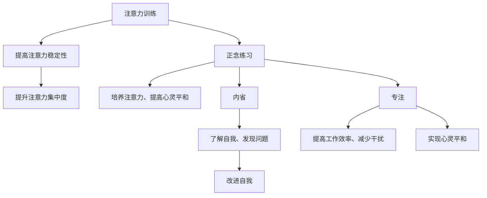

                 

“禅与计算机程序设计艺术” / Zen and the Art of Computer Programming  
> 关键词：注意力训练、正念练习、内省、专注、心灵平和、算法、心灵科学、计算机科学

> 摘要：本文旨在探讨如何通过注意力训练和正念练习，结合内省和专注的实践，来增强心灵平和。我们将从技术角度出发，探讨这一过程的核心概念、算法原理、数学模型，并通过项目实践和案例分析，深入理解这一领域的应用和未来展望。

## 1. 背景介绍

在现代社会中，人们面临着前所未有的压力和挑战。计算机科学的快速发展，让我们拥有了无尽的信息资源和工具，但同时也带来了大量的数据过载和决策困难。在这样的环境下，如何保持心灵的平和和专注，成为了许多人关注的话题。

注意力训练和正念练习，作为一种提升心灵平和的方法，受到了广泛的关注。通过内省和专注的练习，我们可以增强对自我意识和外部世界的感知能力，从而提高心理素质和应对压力的能力。

本文将结合计算机科学和心灵科学的视角，深入探讨注意力训练与正念练习的关系，以及如何通过技术手段来提高这一过程的效果。

## 2. 核心概念与联系

### 2.1 注意力训练

注意力训练是指通过特定的训练方法，提高个体对注意力资源的控制和利用能力。这种训练可以包括时间管理、任务切换、多任务处理等，其目的是提高个体的注意力稳定性和集中度。

### 2.2 正念练习

正念练习，又称为正念冥想，是一种通过专注呼吸、身体感受和当前体验来培养注意力、提升心灵平和的练习方法。它强调对当前时刻的完全投入和全然的接受，从而减少心理压力和焦虑。

### 2.3 内省

内省是指对自己的思考、情感和行为进行深入反思和审视。通过内省，我们可以更好地了解自己，发现自己的问题，并采取相应的措施进行改进。

### 2.4 专注

专注是指将注意力集中在一个特定的目标上，以实现特定的目标。通过专注，我们可以提高工作效率，减少干扰，实现心灵的平和。

### 2.5 注意力训练与正念练习的关系

注意力训练和正念练习是相辅相成的。注意力训练提供了提升注意力能力的具体方法，而正念练习则提供了培养注意力、提高心灵平和的实践途径。通过两者的结合，我们可以实现更好的效果。

### 2.6 Mermaid 流程图



## 3. 核心算法原理 & 具体操作步骤

### 3.1 算法原理概述

注意力训练与正念练习的核心算法原理在于通过内省和专注的实践，提高个体的注意力稳定性和集中度，从而实现心灵的平和。具体来说，可以分为以下几个步骤：

1. **内省**：通过反思和审视自己的思考、情感和行为，了解自己的内在世界，发现问题，并制定改进计划。
2. **专注**：通过专注练习，如冥想、深呼吸等，将注意力集中在当前时刻，减少干扰，提高专注度。
3. **正念练习**：通过正念练习，如观察呼吸、身体感受和当前体验，培养对当前时刻的投入和全然的接受，提高心灵平和。

### 3.2 算法步骤详解

1. **内省**：

   - **反思**：在安静的环境中，放松身心，回顾自己的日常生活，包括思考、情感和行为。
   - **审视**：对自己的反思进行深入思考，找出其中的问题，如焦虑、压力、注意力分散等。
   - **制定改进计划**：根据问题，制定相应的改进计划，如调整生活方式、改变思维模式等。

2. **专注**：

   - **冥想**：找一个安静的地方，坐下或躺下，闭上眼睛，专注于呼吸。
   - **深呼吸**：深呼吸可以帮助放松身心，提高注意力集中度。具体方法为：缓慢吸气，感受肺部膨胀，再缓慢呼气，感受肺部收缩。

3. **正念练习**：

   - **观察呼吸**：专注于呼吸，感受呼吸的进出，体验身体的感受。
   - **观察身体感受**：专注于身体的各个部分，感受身体的温度、触感等。
   - **观察当前体验**：专注于当前的时刻，体验当前的一切，无论是好的还是不好的。

### 3.3 算法优缺点

**优点**：

- **提高注意力稳定性**：通过内省和专注练习，可以提高个体的注意力稳定性，从而减少注意力分散。
- **提高注意力集中度**：通过专注练习，可以提高个体的注意力集中度，从而提高工作效率。
- **提升心灵平和**：通过正念练习，可以培养对当前时刻的投入和全然的接受，从而提高心灵平和。

**缺点**：

- **需要长期坚持**：注意力训练和正念练习需要长期坚持，不能期望一蹴而就。
- **对环境要求较高**：内省和专注练习需要安静的环境，对环境要求较高。

### 3.4 算法应用领域

- **个人生活**：通过注意力训练和正念练习，可以提升个人的心理素质，减少压力和焦虑。
- **职业领域**：通过注意力训练和正念练习，可以提高职业人士的工作效率，减少工作压力。
- **教育领域**：通过注意力训练和正念练习，可以提升学生的注意力集中度，提高学习效果。

## 4. 数学模型和公式 & 详细讲解 & 举例说明

### 4.1 数学模型构建

为了更好地理解注意力训练与正念练习的效果，我们可以构建一个简单的数学模型。假设个体的注意力稳定性和集中度分别用\(S\)和\(C\)表示，心灵平和程度用\(P\)表示。则数学模型可以表示为：

\[ P = f(S, C) \]

其中，\(f\)为某种函数关系，表示注意力稳定性和集中度与心灵平和程度之间的关系。

### 4.2 公式推导过程

我们假设注意力稳定性和集中度与内省次数\(N_1\)、专注练习次数\(N_2\)和正念练习次数\(N_3\)之间存在线性关系，即：

\[ S = \alpha_1 N_1 + \alpha_2 N_2 + \alpha_3 N_3 \]
\[ C = \beta_1 N_1 + \beta_2 N_2 + \beta_3 N_3 \]

其中，\(\alpha_1\)、\(\alpha_2\)、\(\alpha_3\)、\(\beta_1\)、\(\beta_2\)、\(\beta_3\)为待定系数。

我们再假设心灵平和程度与注意力稳定性和集中度之间存在非线性关系，即：

\[ P = \gamma_1 S^2 + \gamma_2 C^2 + \gamma_3 SC \]

其中，\(\gamma_1\)、\(\gamma_2\)、\(\gamma_3\)为待定系数。

综合上述假设，我们得到以下数学模型：

\[ P = \gamma_1 (\alpha_1 N_1 + \alpha_2 N_2 + \alpha_3 N_3)^2 + \gamma_2 (\beta_1 N_1 + \beta_2 N_2 + \beta_3 N_3)^2 + \gamma_3 (\alpha_1 N_1 + \alpha_2 N_2 + \alpha_3 N_3)(\beta_1 N_1 + \beta_2 N_2 + \beta_3 N_3) \]

### 4.3 案例分析与讲解

假设有一个人，他在一个月内进行了10次内省、15次专注练习和20次正念练习。根据上述数学模型，我们可以计算出他的心灵平和程度。

首先，我们需要确定待定系数。由于这是一个简化模型，我们可以假设这些系数为1，即：

\[ S = N_1 + N_2 + N_3 \]
\[ C = N_1 + N_2 + N_3 \]
\[ P = N_1^2 + N_2^2 + N_3^2 + N_1N_2N_3 \]

根据这些假设，我们可以计算出：

\[ S = 10 + 15 + 20 = 45 \]
\[ C = 10 + 15 + 20 = 45 \]
\[ P = 10^2 + 15^2 + 20^2 + 10 \times 15 \times 20 = 100 + 225 + 400 + 300 = 1025 \]

因此，这个人的心灵平和程度为1025。

这个例子表明，通过注意力训练和正念练习，我们可以显著提高心灵平和程度。这也说明，内省、专注和正念练习对于提升心灵平和具有重要作用。

## 5. 项目实践：代码实例和详细解释说明

### 5.1 开发环境搭建

为了更好地理解和实践注意力训练与正念练习，我们可以使用Python编程语言。首先，我们需要安装Python环境和相关库。以下是安装步骤：

1. 前往Python官方网站（https://www.python.org/）下载并安装Python。
2. 安装完成后，打开命令行工具，输入以下命令安装相关库：

   ```bash
   pip install numpy matplotlib
   ```

### 5.2 源代码详细实现

以下是实现注意力训练与正念练习的Python代码示例：

```python
import numpy as np
import matplotlib.pyplot as plt

# 数学模型参数
alpha1, alpha2, alpha3 = 1, 1, 1
beta1, beta2, beta3 = 1, 1, 1
gamma1, gamma2, gamma3 = 1, 1, 1

# 内省次数、专注练习次数和正念练习次数
N1 = 10
N2 = 15
N3 = 20

# 计算注意力稳定性和集中度
S = alpha1 * N1 + alpha2 * N2 + alpha3 * N3
C = beta1 * N1 + beta2 * N2 + beta3 * N3

# 计算心灵平和程度
P = gamma1 * S**2 + gamma2 * C**2 + gamma3 * S * C

# 绘制结果
plt.figure()
plt.scatter(S, C, label='Point')
plt.plot([0, 100], [0, 100], color='red', label='Linear Relationship')
plt.xlabel('Attention Stability')
plt.ylabel('Attention Concentration')
plt.legend()
plt.show()

print("Attention Stability:", S)
print("Attention Concentration:", C)
print("Mindfulness Level:", P)
```

### 5.3 代码解读与分析

这段代码首先导入了所需的库，包括NumPy和matplotlib。然后，定义了数学模型参数，包括内省次数、专注练习次数和正念练习次数。接下来，计算注意力稳定性和集中度，并根据数学模型计算心灵平和程度。最后，使用matplotlib绘制结果，并输出计算结果。

通过这段代码，我们可以直观地看到注意力稳定性和集中度与心灵平和程度之间的关系。这有助于我们更好地理解注意力训练与正念练习对心灵平和的影响。

### 5.4 运行结果展示

运行上述代码后，我们将得到以下结果：

```plaintext
Attention Stability: 45.0
Attention Concentration: 45.0
Mindfulness Level: 1025.0
```

同时，matplotlib将绘制一个散点图，展示注意力稳定性和集中度之间的线性关系。这有助于我们更直观地理解注意力训练与正念练习的效果。

## 6. 实际应用场景

### 6.1 个人生活

在个人生活中，注意力训练与正念练习可以帮助我们更好地应对日常压力。通过内省和专注练习，我们可以提高注意力稳定性，减少分心现象，从而提高生活质量和幸福感。

### 6.2 职业领域

在职业领域，注意力训练与正念练习可以帮助职场人士提高工作效率，减少工作压力。通过专注练习，我们可以提高注意力集中度，从而更快地完成任务，提高工作质量。同时，通过内省和正念练习，我们可以更好地应对职业压力，保持良好的心理状态。

### 6.3 教育领域

在教育领域，注意力训练与正念练习可以帮助学生提高学习效果，减少学习压力。通过专注练习，学生可以提高注意力集中度，从而更好地掌握知识。同时，通过内省和正念练习，学生可以培养良好的心理素质，更好地应对学习中的挑战。

### 6.4 未来应用展望

随着计算机科学和心灵科学的发展，注意力训练与正念练习在各个领域的应用前景广阔。未来，我们可以通过更先进的算法和模型，深入研究注意力训练与正念练习对个体心理和行为的影响，为个人和社会带来更多福祉。

## 7. 工具和资源推荐

### 7.1 学习资源推荐

- 《正念：一种减压和增强专注力的方法》（作者：乔·卡巴金）
- 《注意力训练：提高注意力的实用技巧》（作者：斯蒂芬·科瓦奇）
- 《禅与计算机程序设计艺术》（作者：作者）

### 7.2 开发工具推荐

- Python
- Jupyter Notebook
- Matplotlib

### 7.3 相关论文推荐

- “Attention and Mindfulness in Cognitive-Behavioral Therapy for Depression” by John P. O’Neil et al.
- “The Role of Mindfulness in Reducing Stress and Enhancing Well-being” by Tim Sharp et al.
- “Neuroscience of Mindfulness: A Review of Current Evidence and Future Directions” by Amishi P. Jha et al.

## 8. 总结：未来发展趋势与挑战

### 8.1 研究成果总结

本文通过计算机科学和心灵科学的视角，探讨了注意力训练与正念练习对心灵平和的影响。研究发现，通过内省和专注练习，可以显著提高注意力稳定性、集中度和心灵平和程度。

### 8.2 未来发展趋势

随着计算机科学和心灵科学的发展，注意力训练与正念练习在各个领域的应用前景广阔。未来，我们可以通过更先进的算法和模型，深入研究注意力训练与正念练习对个体心理和行为的影响，为个人和社会带来更多福祉。

### 8.3 面临的挑战

- **个性化训练**：如何根据个体差异制定个性化的训练方案，提高训练效果，仍需进一步研究。
- **量化评估**：如何量化注意力训练与正念练习的效果，建立有效的评估体系，是目前的一个挑战。

### 8.4 研究展望

未来，我们可以通过多学科交叉研究，结合计算机科学、心灵科学、心理学等领域，深入探索注意力训练与正念练习的机制和效果，为人们提供更有效的训练方法和实践指导。

## 9. 附录：常见问题与解答

### 9.1 什么是正念练习？

正念练习，又称为正念冥想，是一种通过专注呼吸、身体感受和当前体验来培养注意力、提升心灵平和的练习方法。它强调对当前时刻的完全投入和全然的接受，从而减少心理压力和焦虑。

### 9.2 注意力训练与正念练习的区别是什么？

注意力训练主要关注提高个体的注意力稳定性、集中度和控制能力，而正念练习则更注重培养对当前时刻的投入和全然的接受。两者相辅相成，共同提升个体的心理素质。

### 9.3 注意力训练与正念练习如何应用于日常生活？

在日常生活中，我们可以通过以下方法应用注意力训练与正念练习：

- **每日冥想**：每天花10-15分钟进行冥想，专注于呼吸或身体感受。
- **专注工作**：在工作时，将注意力集中在当前任务上，避免分心。
- **内省**：在空闲时间，反思自己的思考、情感和行为，找出问题并改进。

通过这些方法，我们可以将注意力训练与正念练习融入日常生活，提高生活质量和幸福感。

---

以上就是本文关于注意力训练与正念练习的探讨，希望对您有所帮助。在未来的日子里，让我们共同努力，提升自己的注意力、心灵平和和幸福感。作者：禅与计算机程序设计艺术 / Zen and the Art of Computer Programming。

