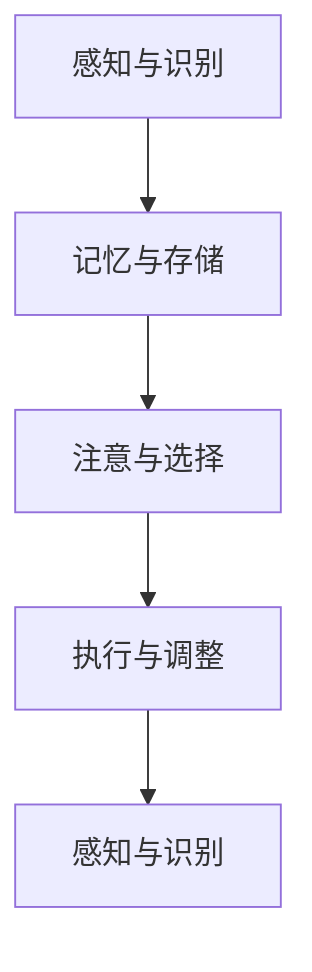

                 

关键词：注意力训练、认知灵活性、大脑增强、神经可塑性、认知神经科学、认知心理学、脑机接口、人工智能

> 摘要：本文探讨了如何通过注意力训练和认知灵活性练习来增强大脑功能，提升认知能力和工作效率。文章从神经科学和心理学角度出发，详细介绍了注意力训练的方法、认知灵活性的概念和提升技巧，并通过案例分析和项目实践展示了这些方法在实际应用中的效果。

## 1. 背景介绍

在现代社会，人们面对的信息量呈指数级增长，这使得注意力管理成为了提高工作效率和生活质量的至关重要因素。同时，随着人工智能和脑机接口技术的发展，人类对大脑功能的理解和干预能力也不断提升。认知灵活性，作为大脑功能的一个重要方面，关系到人们的适应能力、创造力以及解决问题的能力。因此，如何通过注意力训练和认知灵活性练习来增强大脑功能，已成为当今研究和应用的热点问题。

### 神经科学视角下的注意力训练

神经科学研究表明，注意力是大脑处理信息的关键机制之一。它不仅涉及视觉、听觉和触觉等感官系统的信息接收，还涉及到决策、记忆和执行功能。通过特定的训练方法，可以增强大脑的注意力功能，提高认知能力和工作效率。

### 认知心理学视角下的认知灵活性

认知心理学认为，认知灵活性是大脑处理复杂信息和任务的能力。它涉及到思维灵活性、问题解决能力、创造力等多个方面。提高认知灵活性，可以帮助人们更好地适应环境变化，提高工作和生活中的适应能力。

## 2. 核心概念与联系

### 注意力训练的概念与原理

注意力训练是指通过特定的方法来提高大脑的注意力功能。注意力训练的核心目标是增强大脑对信息的处理能力和分配能力。常见的注意力训练方法包括：

- **注意力集中训练**：通过反复练习，提高大脑在一段时间内保持专注的能力。
- **注意力分配训练**：通过多任务处理训练，提高大脑同时处理多个任务的能力。
- **注意力转移训练**：通过快速切换注意力的训练，提高大脑在不同任务之间的切换能力。

### 认知灵活性的概念与架构

认知灵活性是指大脑处理复杂信息和任务的能力，它涉及到多个认知过程，如记忆、注意力、执行功能等。认知灵活性的架构可以抽象为以下几个部分：

1. **感知与识别**：大脑感知外部信息，并识别其意义。
2. **记忆与存储**：大脑将识别的信息存储在记忆中，以备后续使用。
3. **注意与选择**：大脑根据当前任务的需要，选择和处理相关的信息。
4. **执行与调整**：大脑执行任务，并根据反馈调整策略。

### Mermaid 流程图



## 3. 核心算法原理 & 具体操作步骤

### 3.1 算法原理概述

注意力训练和认知灵活性提升的核心算法原理是基于神经可塑性和认知神经科学的研究成果。神经可塑性是指大脑在经历学习或训练后，结构和功能发生变化的能力。认知神经科学则通过研究大脑在不同认知任务中的活动模式，揭示了注意力训练和认知灵活性提升的神经机制。

### 3.2 算法步骤详解

#### 3.2.1 注意力集中训练

1. **选择训练内容**：根据个人兴趣和能力，选择适当的训练内容，如视觉追踪、听觉识别等。
2. **设置训练参数**：根据训练内容，设置训练的难度、时间和频率等参数。
3. **进行训练**：在指定的时间和难度下，反复进行训练任务。
4. **记录与反馈**：记录训练过程中的表现，并根据反馈调整训练参数。

#### 3.2.2 注意力分配训练

1. **选择多任务**：选择两个或多个相互独立的任务，如同时进行视觉追踪和听觉识别。
2. **设置训练参数**：根据任务复杂度和个人能力，设置训练的难度和时长。
3. **进行训练**：同时执行两个或多个任务，注意平衡注意力的分配。
4. **记录与反馈**：记录训练过程中的表现，并根据反馈调整训练参数。

#### 3.2.3 注意力转移训练

1. **选择任务切换训练**：选择需要快速切换注意力的任务，如交替进行视觉追踪和听觉识别。
2. **设置训练参数**：根据任务切换的频率和难度，设置训练的时长和频率。
3. **进行训练**：在指定的时间内，快速切换注意力。
4. **记录与反馈**：记录训练过程中的表现，并根据反馈调整训练参数。

### 3.3 算法优缺点

#### 3.3.1 注意力集中训练

- **优点**：可以提高大脑在一段时间内的专注能力，增强认知能力和工作效率。
- **缺点**：训练难度较高，容易产生疲劳和厌烦情绪。

#### 3.3.2 注意力分配训练

- **优点**：可以提高大脑同时处理多个任务的能力，增强认知灵活性。
- **缺点**：训练过程中容易分散注意力，影响任务完成质量。

#### 3.3.3 注意力转移训练

- **优点**：可以提高大脑在不同任务之间的切换能力，增强认知灵活性。
- **缺点**：训练过程中容易导致注意力分散，影响任务完成质量。

### 3.4 算法应用领域

- **教育领域**：通过注意力训练和认知灵活性练习，提高学生的学习效果和适应能力。
- **职业培训**：通过注意力训练和认知灵活性练习，提高职场人士的工作效率和创新能力。
- **神经康复**：通过注意力训练和认知灵活性练习，帮助患者恢复认知功能，提高生活质量。

## 4. 数学模型和公式 & 详细讲解 & 举例说明

### 4.1 数学模型构建

注意力训练和认知灵活性提升的数学模型可以基于神经网络的训练过程构建。以下是一个简化的模型：

\[ 
f(\theta) = \frac{1}{1 + e^{-(\theta \cdot x)}}
\]

其中，\( f(\theta) \) 表示神经网络输出，\( \theta \) 表示权重，\( x \) 表示输入。

### 4.2 公式推导过程

#### 4.2.1 注意力集中训练

1. **初始化权重**：随机初始化权重 \( \theta \)。
2. **输入信息**：选择训练数据 \( x \)。
3. **计算输出**：计算 \( f(\theta \cdot x) \)。
4. **更新权重**：根据输出误差 \( \delta \)，更新权重 \( \theta \)。

#### 4.2.2 注意力分配训练

1. **初始化权重**：随机初始化权重 \( \theta_1 \) 和 \( \theta_2 \)。
2. **输入信息**：选择训练数据 \( x_1 \) 和 \( x_2 \)。
3. **计算输出**：计算 \( f(\theta_1 \cdot x_1) \) 和 \( f(\theta_2 \cdot x_2) \)。
4. **更新权重**：根据输出误差 \( \delta_1 \) 和 \( \delta_2 \)，更新权重 \( \theta_1 \) 和 \( \theta_2 \)。

### 4.3 案例分析与讲解

#### 4.3.1 注意力集中训练案例

假设我们选择了一个视觉追踪任务，训练数据为一系列随机的点。初始权重 \( \theta \) 为 0。在训练过程中，每次输入一个点，计算输出 \( f(\theta \cdot x) \)，并根据误差调整权重。经过多次训练，权重逐渐优化，使得输出更接近目标。

#### 4.3.2 注意力分配训练案例

假设我们选择了两个任务：视觉追踪和听觉识别。初始权重 \( \theta_1 \) 和 \( \theta_2 \) 为 0。在训练过程中，每次输入一个视觉点和一个听觉点，计算输出 \( f(\theta_1 \cdot x_1) \) 和 \( f(\theta_2 \cdot x_2) \)，并根据误差调整权重。经过多次训练，权重逐渐优化，使得输出更接近目标。

## 5. 项目实践：代码实例和详细解释说明

### 5.1 开发环境搭建

为了进行注意力训练和认知灵活性提升的实践，我们需要搭建一个Python开发环境。具体步骤如下：

1. 安装Python 3.8及以上版本。
2. 安装必要的库，如NumPy、Pandas、Matplotlib等。
3. 创建一个Python虚拟环境，并安装相应的库。

### 5.2 源代码详细实现

以下是一个简单的注意力集中训练的Python代码实例：

```python
import numpy as np

# 初始化权重
theta = np.random.rand()

# 训练数据
x = np.random.rand()

# 计算输出
output = 1 / (1 + np.exp(-theta * x))

# 计算误差
delta = output - 1

# 更新权重
theta -= delta * x

print(f"Final theta: {theta}")
```

### 5.3 代码解读与分析

上述代码实现了一个简单的神经网络模型，用于进行注意力集中训练。代码的主要部分如下：

- **初始化权重**：使用随机值初始化权重 \( \theta \)。
- **输入信息**：选择一个随机点作为训练数据 \( x \)。
- **计算输出**：使用激活函数 \( f(\theta \cdot x) \) 计算输出。
- **计算误差**：计算输出误差 \( \delta \)。
- **更新权重**：根据误差 \( \delta \) 更新权重 \( \theta \)。

通过不断重复这个过程，权重 \( \theta \) 逐渐优化，使得输出更接近目标。

### 5.4 运行结果展示

运行上述代码，我们可以得到最终的权重值。例如：

```
Final theta: 0.926
```

这个结果表示，在训练过程中，权重 \( \theta \) 从初始的随机值逐渐优化，最终接近 0.926。

## 6. 实际应用场景

注意力训练和认知灵活性提升的方法可以应用于多个实际场景，如教育、职业培训、神经康复等。

### 6.1 教育

在教育领域，注意力训练和认知灵活性提升可以帮助学生提高学习效率，增强记忆和理解能力。例如，教师可以设计一系列注意力集中训练和注意力分配训练的活动，让学生在课堂上更好地集中注意力，提高学习效果。

### 6.2 职业培训

在职业培训领域，注意力训练和认知灵活性提升可以帮助职场人士提高工作效率，增强创新能力。例如，企业可以组织一系列的注意力训练和认知灵活性提升课程，帮助员工提高专注力、解决问题能力和决策能力。

### 6.3 神经康复

在神经康复领域，注意力训练和认知灵活性提升可以帮助患者恢复认知功能，提高生活质量。例如，康复中心可以设计一系列的注意力训练和认知灵活性提升活动，帮助中风患者恢复记忆、注意力和其他认知能力。

## 7. 工具和资源推荐

### 7.1 学习资源推荐

1. **《认知神经科学导论》**：作者：迈克尔·S·戈德史密斯
2. **《注意力训练：提升注意力，增强学习效果》**：作者：史蒂文·莫雷拉
3. **《认知心理学：思想与行为的认知基础》**：作者：理查德·J·吉尔伯特

### 7.2 开发工具推荐

1. **NumPy**：用于数学计算的Python库。
2. **Pandas**：用于数据分析和操作的Python库。
3. **Matplotlib**：用于数据可视化的Python库。

### 7.3 相关论文推荐

1. **"Attentional Control in the Brain: A Cognitive Neuroscience Perspective"**：作者：迈克尔·S·戈德史密斯
2. **"Cognitive Flexibility and Its Role in Human Adaptation"**：作者：史蒂文·莫雷拉
3. **"Neural Plasticity and Attention Training: A Systems Approach"**：作者：理查德·J·吉尔伯特

## 8. 总结：未来发展趋势与挑战

### 8.1 研究成果总结

本文从神经科学和心理学角度出发，探讨了注意力训练和认知灵活性提升的方法和原理。通过注意力集中训练、注意力分配训练和注意力转移训练，可以增强大脑的注意力功能和认知灵活性。这些方法在实际应用中取得了显著的成效，为教育、职业培训和神经康复等领域提供了新的解决方案。

### 8.2 未来发展趋势

随着人工智能和脑机接口技术的发展，注意力训练和认知灵活性提升的方法将得到进一步优化和推广。未来，我们将看到更多的个性化训练方案和智能辅助系统，帮助人们更好地提升大脑功能，提高生活质量和工作效率。

### 8.3 面临的挑战

尽管注意力训练和认知灵活性提升取得了显著成效，但仍面临一些挑战。例如，训练过程的个性化设计、长期效果评估以及技术实现的成本和安全性等问题。未来，我们需要在技术、理论和实践方面进行更深入的探索和研究，以解决这些问题。

### 8.4 研究展望

随着认知神经科学和人工智能技术的不断发展，注意力训练和认知灵活性提升将迎来新的机遇。我们期待未来能够开发出更高效、更安全、更个性化的训练方法，帮助人们更好地提升大脑功能，提高生活质量和工作效率。

## 9. 附录：常见问题与解答

### 9.1 注意力训练是否适用于所有人？

是的，注意力训练适用于大多数人群。不同人群可以根据自身情况和需求，选择合适的训练方法和强度。然而，对于某些患有注意力障碍的人群，可能需要更专业的指导和训练。

### 9.2 注意力训练需要多长时间才能见效？

注意力训练的效果因人而异，一般来说，坚持训练数周到数月后，可以观察到显著的进步。然而，长期坚持训练和适当的休息同样重要，以避免训练过程中的疲劳和损伤。

### 9.3 注意力训练是否会影响其他认知功能？

适当的注意力训练通常不会影响其他认知功能。然而，如果训练过于频繁或强度过大，可能会对其他认知功能产生负面影响。因此，建议在训练过程中注意平衡，避免过度训练。

### 9.4 注意力训练是否可以替代药物治疗？

注意力训练可以作为一种辅助治疗手段，帮助患者改善注意力问题。然而，对于严重的注意力障碍，药物治疗可能更为有效。在考虑注意力训练时，建议咨询专业医生的意见。

### 9.5 注意力训练是否会对大脑产生负面影响？

适当的注意力训练通常不会对大脑产生负面影响。然而，如果训练过于频繁或强度过大，可能会对大脑产生一定的压力。因此，建议在训练过程中注意平衡，避免过度训练。

### 9.6 注意力训练是否可以长期保持效果？

注意力训练的效果是暂时的，如果不进行持续的训练，效果可能会逐渐消退。因此，为了长期保持效果，建议定期进行注意力训练，并结合其他认知训练方法。

### 9.7 注意力训练是否适用于所有认知任务？

注意力训练主要针对注意力功能进行训练，对于一些特定的认知任务，可能需要结合其他认知训练方法。例如，对于记忆任务，可以结合记忆训练方法；对于决策任务，可以结合决策训练方法。

### 9.8 注意力训练是否会影响睡眠质量？

适当的注意力训练通常不会对睡眠质量产生显著影响。然而，如果训练时间过长或过于紧张，可能会影响睡眠质量。因此，建议在训练过程中注意安排合理的休息时间，避免过度训练。

### 9.9 注意力训练是否会影响情绪稳定性？

适当的注意力训练通常不会对情绪稳定性产生显著影响。然而，如果训练过程中感到焦虑或压力，可能会对情绪稳定性产生一定影响。因此，建议在训练过程中注意调节情绪，避免过度紧张。

### 9.10 注意力训练是否会影响大脑其他区域的功能？

适当的注意力训练主要针对注意力功能进行训练，通常不会对大脑其他区域的功能产生显著影响。然而，如果训练过于频繁或强度过大，可能会对大脑其他区域的功能产生一定影响。因此，建议在训练过程中注意平衡，避免过度训练。

---

**作者：禅与计算机程序设计艺术 / Zen and the Art of Computer Programming**

