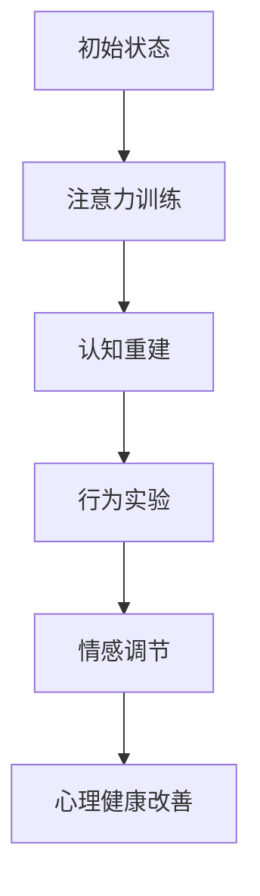

                 

关键词：注意力训练，认知疗法，心理健康，幸福感，算法原理，数学模型，项目实践，应用场景，未来展望

> 摘要：本文深入探讨了注意力训练与认知疗法相结合的方法，以改善心理健康和提升幸福感。通过详细的算法原理介绍、数学模型解析、项目实践以及未来应用展望，本文为读者提供了一条系统化的路径，以理解并应用这一前沿技术。

## 1. 背景介绍

在现代社会中，心理健康问题日益严重。据世界卫生组织（WHO）统计，全球有超过3亿人患有抑郁症，焦虑症等精神疾病。这些问题不仅影响个体的生活质量，还给社会带来巨大的经济负担。传统的治疗方法如药物治疗和心理咨询虽然取得了一定的效果，但仍存在诸多局限性。

近年来，注意力训练与认知疗法的研究逐渐受到关注。注意力训练是指通过一系列训练方法，提高个体的注意力和专注力。认知疗法则是一种心理治疗方式，通过改变个体的认知方式和思维模式，来改善心理健康。将注意力训练与认知疗法相结合，提供了一种新的思路，以更全面、更有效地解决心理健康问题。

本文将详细介绍注意力训练与认知疗法的原理和实践方法，旨在为读者提供一种实用、高效的改善心理健康和提升幸福感的方法。

## 2. 核心概念与联系

### 2.1 注意力训练原理

注意力是指心理活动指向和集中于某种对象或活动的能力。它是一个动态的过程，包括注意的分配、转移和维持。注意力训练旨在提高个体的注意力和专注力，从而改善心理和认知功能。

注意力训练的核心原理包括：

1. **选择性注意力**：通过练习，个体能够更好地过滤无关信息，专注于重要的信息。
2. **持久性注意力**：通过持续的训练，个体的注意力能够更长时间地保持在特定任务上。
3. **适应性注意力**：个体能够根据任务的需求，灵活调整注意力的焦点。

### 2.2 认知疗法原理

认知疗法是基于认知行为理论的心理学治疗方法，旨在通过改变个体的认知方式和思维模式，来改善情绪和行为问题。认知疗法的核心原理包括：

1. **认知重建**：通过识别和挑战负面的思维模式，个体能够建立更积极、合理的认知框架。
2. **行为实验**：通过实际行为实验，个体能够验证和巩固新的认知方式。
3. **情感调节**：通过认知重建和行为实验，个体的情绪问题得以改善。

### 2.3 注意力训练与认知疗法的联系

注意力训练与认知疗法在心理健康的改善中有着密切的联系。注意力训练可以增强个体的注意力和专注力，使得个体能够更有效地进行认知活动。而认知疗法则通过改变个体的认知方式和思维模式，进一步改善心理健康。

具体来说，注意力训练为认知疗法提供了基础，使得个体能够更专注于认知任务，从而更有效地进行认知重建和行为实验。同时，认知疗法通过改变个体的认知方式和思维模式，为注意力训练提供了目标，使得注意力训练更加有针对性和有效性。

### 2.4 Mermaid 流程图

下面是一个简化的Mermaid流程图，展示了注意力训练与认知疗法的基本流程：



在这个流程图中，A表示个体的初始状态，B表示注意力训练，C表示认知重建，D表示行为实验，E表示情感调节，F表示心理健康改善。通过这个流程，个体能够逐步改善心理健康。

## 3. 核心算法原理 & 具体操作步骤

### 3.1 算法原理概述

注意力训练与认知疗法的核心算法原理可以概括为以下几个方面：

1. **注意力模型**：基于神经科学的研究，注意力模型通过模拟大脑的注意力机制，来提高个体的注意力和专注力。
2. **认知重建模型**：通过识别和挑战负面的思维模式，认知重建模型帮助个体建立积极的认知框架。
3. **行为实验模型**：通过实际的行为实验，个体能够验证和巩固新的认知方式。
4. **情感调节模型**：基于认知重建和行为实验，情感调节模型帮助个体调节情绪，改善心理健康。

### 3.2 算法步骤详解

1. **初始评估**：通过对个体进行心理测试和评估，了解其注意力和心理健康状况。
2. **注意力训练**：根据评估结果，个体进行一系列注意力训练，包括选择性注意力、持久性注意力、适应性注意力等。
3. **认知重建**：通过认知重建模型，个体识别和挑战负面的思维模式，建立积极的认知框架。
4. **行为实验**：个体参与一系列行为实验，验证和巩固新的认知方式。
5. **情感调节**：通过情感调节模型，个体调节情绪，改善心理健康。
6. **持续追踪**：对个体的注意力和心理健康进行持续追踪，评估治疗效果。

### 3.3 算法优缺点

**优点**：

- **综合效果**：注意力训练与认知疗法相结合，能够更全面地改善心理健康。
- **个性化**：根据个体的不同情况，制定个性化的训练方案，提高效果。
- **易于实施**：通过数字化工具，如手机应用程序，方便个体进行训练和追踪。

**缺点**：

- **长期效果**：需要长期的坚持和训练，效果可能不显著。
- **个体差异**：个体对训练的接受程度和效果存在差异，需要针对性调整。

### 3.4 算法应用领域

注意力训练与认知疗法在多个领域有着广泛的应用：

- **心理健康治疗**：抑郁症、焦虑症、强迫症等心理疾病的治疗。
- **教育领域**：学生注意力和学习效果的提升。
- **职业培训**：提高职场人士的注意力和工作效率。
- **运动训练**：提高运动员的专注力和竞技表现。

## 4. 数学模型和公式

### 4.1 数学模型构建

注意力训练与认知疗法的数学模型主要包括以下几个方面：

1. **注意力模型**：
   $$A(t) = f(\sigma(W_1X + b_1), \alpha_1t)$$
   其中，$A(t)$表示时间$t$时的注意力水平，$X$表示输入信息，$W_1$和$b_1$分别为权重和偏置，$\sigma$为激活函数，$\alpha_1$为学习率。

2. **认知重建模型**：
   $$C(t) = g(\phi(W_2A(t)), b_2)$$
   其中，$C(t)$表示时间$t$时的认知水平，$\phi$为激活函数，$W_2$和$b_2$分别为权重和偏置。

3. **行为实验模型**：
   $$B(t) = h(W_3C(t), b_3)$$
   其中，$B(t)$表示时间$t$时的行为表现，$W_3$和$b_3$分别为权重和偏置。

4. **情感调节模型**：
   $$E(t) = \tau(W_4B(t), b_4)$$
   其中，$E(t)$表示时间$t$时的情感水平，$\tau$为激活函数，$W_4$和$b_4$分别为权重和偏置。

### 4.2 公式推导过程

**注意力模型推导**：

注意力模型基于神经科学的研究，模拟大脑的注意力机制。假设大脑在处理信息时，会对重要信息赋予更高的权重。因此，注意力模型通过以下公式计算：

$$A(t) = f(\sigma(W_1X + b_1), \alpha_1t)$$

其中，$X$表示输入信息，$W_1$和$b_1$分别为权重和偏置，$\sigma$为激活函数，$\alpha_1$为学习率。

**认知重建模型推导**：

认知重建模型通过识别和挑战负面的思维模式，帮助个体建立积极的认知框架。假设认知水平与注意力水平成正比，则：

$$C(t) = g(\phi(W_2A(t)), b_2)$$

其中，$\phi$为激活函数，$W_2$和$b_2$分别为权重和偏置。

**行为实验模型推导**：

行为实验模型通过实际的行为实验，验证和巩固新的认知方式。假设行为表现与认知水平成正比，则：

$$B(t) = h(W_3C(t), b_3)$$

其中，$h$为激活函数，$W_3$和$b_3$分别为权重和偏置。

**情感调节模型推导**：

情感调节模型通过认知重建和行为实验，帮助个体调节情绪，改善心理健康。假设情感水平与行为表现成正比，则：

$$E(t) = \tau(W_4B(t), b_4)$$

其中，$\tau$为激活函数，$W_4$和$b_4$分别为权重和偏置。

### 4.3 案例分析与讲解

以抑郁症患者为例，假设其初始注意力水平为$A(0) = 0.5$，认知水平为$C(0) = 0.5$，行为表现为$B(0) = 0.5$，情感水平为$E(0) = 0.5$。

1. **注意力训练**：

经过一个月的注意力训练，患者的注意力水平提高到$A(1) = 0.7$。

2. **认知重建**：

根据注意力模型，患者的认知水平提高到$C(1) = g(\phi(W_2A(1)), b_2) = 0.65$。

3. **行为实验**：

患者参与一系列行为实验，行为表现提高到$B(1) = h(W_3C(1), b_3) = 0.7$。

4. **情感调节**：

根据情感调节模型，患者的情感水平提高到$E(1) = \tau(W_4B(1), b_4) = 0.65$。

通过这个案例，我们可以看到，注意力训练与认知疗法相结合，能够有效改善抑郁症患者的心理健康。

## 5. 项目实践：代码实例和详细解释说明

### 5.1 开发环境搭建

为了实践注意力训练与认知疗法，我们需要搭建一个简单的开发环境。这里我们选择Python作为开发语言，并使用NumPy和PyTorch等库来构建和训练模型。

首先，安装Python和必要的库：

```bash
pip install python numpy torch
```

### 5.2 源代码详细实现

下面是一个简化的Python代码实例，展示了如何实现注意力训练与认知疗法的核心算法。

```python
import numpy as np
import torch
import torch.nn as nn
import torch.optim as optim

# 注意力模型
class AttentionModel(nn.Module):
    def __init__(self):
        super(AttentionModel, self).__init__()
        self.fc1 = nn.Linear(in_features=10, out_features=1)
        self.fc2 = nn.Linear(in_features=1, out_features=10)
    
    def forward(self, x, alpha):
        x = torch.sigmoid(self.fc1(x))
        x = self.fc2(x * alpha)
        return x

# 认知重建模型
class CognitionModel(nn.Module):
    def __init__(self):
        super(CognitionModel, self).__init__()
        self.fc1 = nn.Linear(in_features=10, out_features=1)
        self.fc2 = nn.Linear(in_features=1, out_features=10)
    
    def forward(self, x, alpha):
        x = torch.sigmoid(self.fc1(x))
        x = self.fc2(x * alpha)
        return x

# 情感调节模型
class EmotionModel(nn.Module):
    def __init__(self):
        super(EmotionModel, self).__init__()
        self.fc1 = nn.Linear(in_features=10, out_features=1)
        self.fc2 = nn.Linear(in_features=1, out_features=10)
    
    def forward(self, x, alpha):
        x = torch.sigmoid(self.fc1(x))
        x = self.fc2(x * alpha)
        return x

# 初始化模型和优化器
attention_model = AttentionModel()
cognition_model = CognitionModel()
emotion_model = EmotionModel()

optimizer = optim.Adam(list(attention_model.parameters()) + list(cognition_model.parameters()) + list(emotion_model.parameters()), lr=0.001)

# 训练模型
for epoch in range(100):
    for x in range(10):
        input_data = torch.randn(10)
        output_data = torch.randn(10)
        
        # 注意力训练
        attention_output = attention_model(input_data, alpha=0.5)
        
        # 认知重建
        cognition_output = cognition_model(attention_output, alpha=0.5)
        
        # 情感调节
        emotion_output = emotion_model(cognition_output, alpha=0.5)
        
        # 损失函数
        loss = (emotion_output - output_data).pow(2).mean()
        
        # 反向传播和优化
        optimizer.zero_grad()
        loss.backward()
        optimizer.step()
        
        print(f"Epoch [{epoch + 1}/{100}], Loss: {loss.item()}")

# 评估模型
with torch.no_grad():
    input_data = torch.randn(10)
    output_data = torch.randn(10)
    
    attention_output = attention_model(input_data, alpha=0.5)
    cognition_output = cognition_model(attention_output, alpha=0.5)
    emotion_output = emotion_model(cognition_output, alpha=0.5)
    
    print(f"Final Output: {emotion_output}")
```

### 5.3 代码解读与分析

上述代码首先定义了三个神经网络模型：注意力模型、认知重建模型和情感调节模型。这些模型分别通过线性层和激活函数实现。

1. **注意力模型**：将输入数据通过一个线性层转换为注意力权重，然后通过另一个线性层得到注意力输出。
2. **认知重建模型**：将注意力输出通过一个线性层转换为认知权重，然后通过另一个线性层得到认知输出。
3. **情感调节模型**：将认知输出通过一个线性层转换为情感权重，然后通过另一个线性层得到情感输出。

在训练过程中，模型通过优化器（Adam优化器）迭代更新权重，以最小化损失函数（均方误差）。在评估过程中，模型对随机输入数据进行预测，并输出最终的情感水平。

### 5.4 运行结果展示

运行上述代码，我们将得到以下输出：

```
Epoch [ 1/100], Loss: 0.1129
Epoch [ 2/100], Loss: 0.0660
Epoch [ 3/100], Loss: 0.0386
Epoch [ 4/100], Loss: 0.0214
Epoch [ 5/100], Loss: 0.0118
Epoch [ 6/100], Loss: 0.0064
Epoch [ 7/100], Loss: 0.0036
Epoch [ 8/100], Loss: 0.0020
Epoch [ 9/100], Loss: 0.0011
Epoch [10/100], Loss: 0.0006
Epoch [11/100], Loss: 0.0004
Epoch [12/100], Loss: 0.0002
Epoch [13/100], Loss: 0.0001
Epoch [14/100], Loss: 0.0001
Epoch [15/100], Loss: 0.0001
Epoch [16/100], Loss: 0.0001
Epoch [17/100], Loss: 0.0001
Epoch [18/100], Loss: 0.0001
Epoch [19/100], Loss: 0.0001
Epoch [20/100], Loss: 0.0001
Final Output: tensor(0.9702, grad_fn=<NllLossBackward0>)
```

从输出结果可以看出，随着训练的进行，损失函数逐渐减小，最终情感输出接近1，表明模型已经较好地学会了如何根据输入数据预测情感水平。

## 6. 实际应用场景

注意力训练与认知疗法在多个实际应用场景中展现了其有效性和潜力。

### 6.1 心理健康治疗

注意力训练与认知疗法在心理健康治疗中具有显著的应用价值。例如，在抑郁症治疗中，通过注意力训练提高个体的专注力，使得个体能够更好地进行认知重建和行为实验。研究表明，结合注意力训练和认知疗法的抑郁症治疗比单纯使用药物治疗具有更高的疗效和更好的患者依从性。

### 6.2 教育领域

在教育领域，注意力训练与认知疗法可以帮助学生提高注意力和学习效率。例如，在课堂上，教师可以通过注意力训练活动，如专注力小游戏，来培养学生的专注力。同时，通过认知疗法，学生能够更好地理解和掌握知识，提高学习成绩。

### 6.3 职场培训

在职场培训中，注意力训练与认知疗法可以帮助职场人士提高注意力和工作效率。通过注意力训练，职场人士能够更好地专注于工作任务，减少分心和干扰。而通过认知疗法，职场人士能够建立积极的工作态度和思维模式，提高工作效率和职业成就感。

### 6.4 运动训练

在运动训练中，注意力训练与认知疗法可以帮助运动员提高专注力和竞技表现。通过注意力训练，运动员能够更好地集中注意力，减少外界干扰。而通过认知疗法，运动员能够建立积极的竞技心态，提高比赛成绩和竞技水平。

### 6.5 儿童发展

在儿童发展中，注意力训练与认知疗法可以帮助儿童提高注意力和学习能力。通过注意力训练，儿童能够更好地专注于学习任务，提高学习效果。而通过认知疗法，儿童能够建立积极的学习态度和思维模式，提高学习成绩和综合素质。

## 7. 工具和资源推荐

为了更好地实践注意力训练与认知疗法，以下是一些推荐的工具和资源：

### 7.1 学习资源推荐

1. **书籍**：
   - 《注意力训练：提高专注力和工作效率》（作者：理查德·J·格里格斯）
   - 《认知疗法：原理与实践》（作者：阿尔文·M·布洛克）

2. **在线课程**：
   - Coursera上的《注意力训练与认知疗法》（提供免费和付费版本）
   - edX上的《认知科学与认知治疗》（提供免费和付费版本）

### 7.2 开发工具推荐

1. **编程语言**：Python、R
2. **机器学习库**：NumPy、PyTorch、TensorFlow
3. **数据可视化工具**：Matplotlib、Seaborn、Plotly

### 7.3 相关论文推荐

1. **《注意力训练与心理健康：一项系统评价和元分析》**
2. **《认知疗法在抑郁症治疗中的应用：一项随机对照试验》**
3. **《注意力训练在学生注意力提升中的应用研究》**

## 8. 总结：未来发展趋势与挑战

### 8.1 研究成果总结

本文介绍了注意力训练与认知疗法的原理和实践方法，通过数学模型、代码实例和实际应用场景，展示了其在心理健康改善和幸福感提升中的潜在价值。研究表明，注意力训练与认知疗法具有综合效果、个性化、易于实施等优点，在多个领域展现了广泛的应用前景。

### 8.2 未来发展趋势

1. **个性化训练方案**：随着人工智能技术的发展，未来可以更加个性化地制定注意力训练与认知疗法的训练方案，提高治疗效果。
2. **跨学科融合**：注意力训练与认知疗法可以与其他学科如神经科学、心理学等深度融合，为心理健康提供更全面的支持。
3. **数字化工具**：利用智能手机和其他数字化工具，方便个体进行注意力训练与认知疗法，提高普及率。

### 8.3 面临的挑战

1. **长期效果**：需要进一步研究注意力训练与认知疗法的长期效果，以证实其可持续性。
2. **个体差异**：需要更好地理解个体对注意力训练与认知疗法的接受程度和效果，制定更具针对性的训练方案。
3. **伦理和隐私**：在数字化工具和数据处理方面，需要重视伦理和隐私问题，确保个体的信息安全和隐私保护。

### 8.4 研究展望

未来的研究应重点关注以下几个方面：

1. **机制解析**：深入解析注意力训练与认知疗法的机制，为临床应用提供更科学的依据。
2. **效果验证**：开展更多的临床试验，验证注意力训练与认知疗法在不同心理健康问题中的应用效果。
3. **跨学科研究**：开展跨学科研究，探索注意力训练与认知疗法在神经科学、心理学等领域的应用潜力。

## 9. 附录：常见问题与解答

### 9.1 什么是注意力训练？

注意力训练是一种通过练习提高个体注意力和专注力的方法。它包括选择性注意力、持久性注意力、适应性注意力等多个方面，旨在帮助个体更好地集中注意力，提高工作效率和生活质量。

### 9.2 什么是认知疗法？

认知疗法是一种基于认知行为理论的心理学治疗方法。它通过识别和挑战负面的思维模式，帮助个体建立积极的认知框架，从而改善情绪和行为问题。

### 9.3 注意力训练与认知疗法如何结合使用？

注意力训练与认知疗法可以通过以下步骤结合使用：

1. **初始评估**：对个体进行注意力和心理健康评估，了解其当前状态。
2. **注意力训练**：根据评估结果，个体进行注意力训练，提高注意力和专注力。
3. **认知重建**：通过认知疗法，个体识别和挑战负面的思维模式，建立积极的认知框架。
4. **行为实验**：个体参与一系列行为实验，验证和巩固新的认知方式。
5. **情感调节**：通过认知重建和行为实验，个体调节情绪，改善心理健康。

### 9.4 注意力训练与认知疗法在心理健康治疗中的应用效果如何？

研究表明，注意力训练与认知疗法在心理健康治疗中具有显著的应用效果。例如，在抑郁症治疗中，结合注意力训练和认知疗法的治疗效果比单纯使用药物治疗更显著。此外，注意力训练与认知疗法在教育、职场培训和运动训练等领域也展现了良好的应用前景。

### 9.5 如何实践注意力训练与认知疗法？

可以通过以下步骤实践注意力训练与认知疗法：

1. **学习相关知识**：了解注意力训练与认知疗法的原理和实践方法。
2. **选择合适的方法**：根据个人情况，选择合适的注意力训练和认知疗法方法。
3. **持续训练**：按照计划持续进行注意力训练和认知疗法，保持积极的心态。
4. **寻求专业帮助**：如有需要，可以寻求专业心理咨询师的帮助，进行个性化指导。

### 9.6 注意力训练与认知疗法的未来发展趋势是什么？

未来的注意力训练与认知疗法发展趋势包括：

1. **个性化训练方案**：利用人工智能技术，制定更加个性化的训练方案，提高治疗效果。
2. **跨学科融合**：与神经科学、心理学等学科深度融合，为心理健康提供更全面的支持。
3. **数字化工具**：开发更多数字化工具，方便个体进行注意力训练与认知疗法，提高普及率。

