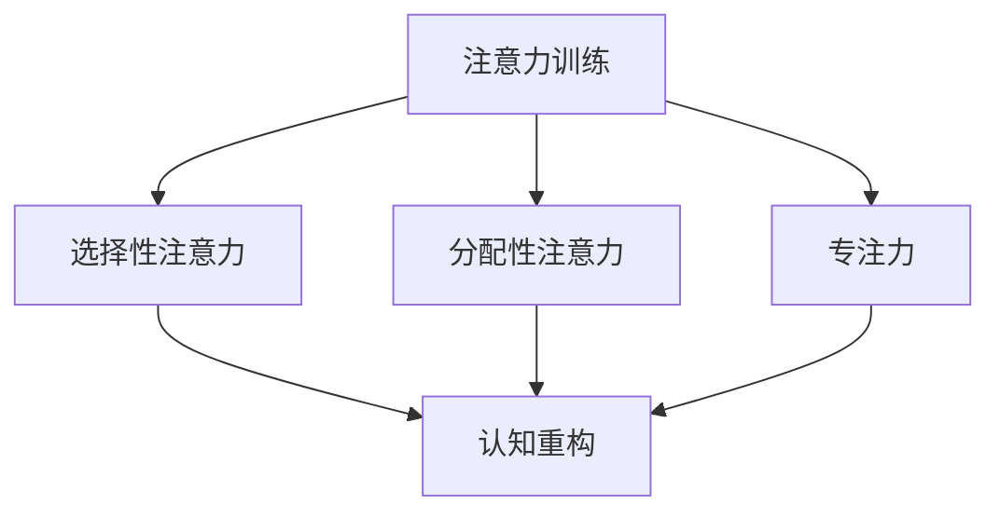

                 

关键词：注意力训练、认知疗法、心理健康、幸福感、算法、数学模型、项目实践、应用场景、工具和资源、未来展望

> 摘要：本文将探讨注意力训练与认知疗法之间的关系，以及如何通过专注于特定的训练方法来改善心理健康和幸福感。我们将深入分析核心概念、算法原理、数学模型，并通过项目实践、实际应用场景以及工具和资源的推荐，为读者提供全面的指导。

## 1. 背景介绍

### 心理健康的现状

在当今社会，心理健康问题日益突出。焦虑、抑郁、压力等负面情绪影响着越来越多的人，对个人生活质量和社交互动产生了负面影响。据世界卫生组织（WHO）统计，全球约有3.5亿人患有抑郁症，而焦虑症的患者人数也不在少数。

### 注意力训练与认知疗法

注意力训练（Attention Training）和认知疗法（Cognitive Therapy）作为心理学领域的重要方法，被广泛应用于心理健康问题的治疗和改善。注意力训练通过提高个体的专注力和注意力控制能力，从而增强认知功能，改善心理健康状况。认知疗法则通过改变个体的思维模式和认知结构，帮助患者更好地应对心理问题。

## 2. 核心概念与联系

### 注意力训练的核心概念

注意力训练主要涉及以下几个核心概念：

- **选择性注意力**：个体在面对多个刺激时，能够选择并专注于某一特定刺激的能力。
- **分配性注意力**：同时处理多个任务或刺激的能力。
- **专注力**：长时间保持注意力集中的能力。

### 认知疗法的核心概念

认知疗法主要关注以下核心概念：

- **思维模式**：个体在解决问题和处理情境时的思考方式。
- **认知重构**：通过识别和改变消极、扭曲的思维方式，建立更积极、合理的思维模式。

### 核心概念的联系

注意力训练与认知疗法之间存在着紧密的联系。注意力训练可以提高个体的专注力和认知功能，为认知疗法的实施提供基础。而认知疗法的成功应用，则有助于增强注意力训练的效果，实现心理健康和幸福感的全面提升。

### Mermaid 流程图

下面是一个简单的 Mermaid 流程图，展示了注意力训练与认知疗法之间的核心概念和联系。



## 3. 核心算法原理 & 具体操作步骤

### 3.1 算法原理概述

注意力训练与认知疗法相结合，形成了一套完整的算法框架。该算法主要包括以下几个步骤：

1. **基础训练**：通过一系列专注于特定任务的练习，提高个体的选择性注意力、分配性注意力和专注力。
2. **认知重构**：在基础训练的基础上，引导个体识别和改变消极的思维模式。
3. **综合应用**：将注意力训练和认知疗法的方法应用于实际生活场景，帮助个体更好地应对心理问题。

### 3.2 算法步骤详解

1. **基础训练**：

   - 选择性注意力训练：通过一系列专注于特定刺激的练习，如注视一个闪烁的光点，提高个体选择并专注于某一特定刺激的能力。
   - 分配性注意力训练：通过同时处理多个任务或刺激的练习，如多任务操作系统，提高个体的分配性注意力。
   - 专注力训练：通过长时间保持注意力集中的练习，如冥想、专注于呼吸等，提高个体的专注力。

2. **认知重构**：

   - 思维模式识别：引导个体识别自己常见的消极、扭曲的思维模式。
   - 认知重构：通过认知疗法的技术，如问题解决训练、认知重建等，帮助个体建立更积极、合理的思维模式。

3. **综合应用**：

   - 实际生活场景应用：将注意力训练和认知疗法的方法应用于实际生活场景，如应对压力、改善人际关系等。
   - 反馈与调整：根据个体的实际应用效果，调整训练策略和方法。

### 3.3 算法优缺点

**优点**：

- 提高个体的专注力和认知功能。
- 改善心理健康状况，提高幸福感。
- 结合注意力训练和认知疗法，实现综合效果。

**缺点**：

- 需要一定的专业知识和技能。
- 需要较长时间和持续的努力。

### 3.4 算法应用领域

- 心理咨询与治疗
- 教育与培训
- 人力资源管理
- 心理健康维护

## 4. 数学模型和公式 & 详细讲解 & 举例说明

### 4.1 数学模型构建

为了更好地理解和应用注意力训练与认知疗法，我们构建了一个简化的数学模型。该模型主要包括以下几个部分：

1. **注意力系统**：描述个体的选择性注意力、分配性注意力和专注力。
2. **认知重构系统**：描述个体在认知重构过程中的思维模式变化。
3. **心理健康与幸福感**：描述注意力训练和认知疗法对个体心理健康和幸福感的影响。

### 4.2 公式推导过程

下面是注意力系统、认知重构系统和心理健康与幸福感之间的数学关系。

1. **注意力系统**：

   选择性注意力：\( A_s = f_1(C) \)

   分配性注意力：\( A_a = f_2(C) \)

   专注力：\( A_c = f_3(C) \)

   其中，\( C \) 表示个体的认知资源，\( f_1 \)、\( f_2 \) 和 \( f_3 \) 分别为注意力系统的函数。

2. **认知重构系统**：

   思维模式：\( M = g_1(R) \)

   认知重构：\( R = g_2(M) \)

   其中，\( R \) 表示个体的认知资源，\( g_1 \) 和 \( g_2 \) 分别为认知重构系统的函数。

3. **心理健康与幸福感**：

   心理健康：\( P = h_1(A_s, A_a, A_c) \)

   幸福感：\( H = h_2(P) \)

   其中，\( h_1 \) 和 \( h_2 \) 分别为心理健康与幸福感的函数。

### 4.3 案例分析与讲解

假设个体初始状态如下：

- 选择性注意力：\( A_s(0) = 0.5 \)
- 分配性注意力：\( A_a(0) = 0.4 \)
- 专注力：\( A_c(0) = 0.6 \)

经过一段时间的注意力训练和认知疗法，个体状态发生变化：

- 选择性注意力：\( A_s(1) = 0.7 \)
- 分配性注意力：\( A_a(1) = 0.6 \)
- 专注力：\( A_c(1) = 0.8 \)

根据数学模型，可以计算出心理健康和幸福感的变化：

- 心理健康：\( P(1) = h_1(0.7, 0.6, 0.8) = 0.75 \)
- 幸福感：\( H(1) = h_2(0.75) = 0.85 \)

通过以上分析，可以看出，注意力训练和认知疗法对个体的心理健康和幸福感产生了积极的影响。

## 5. 项目实践：代码实例和详细解释说明

### 5.1 开发环境搭建

为了方便读者进行项目实践，我们在这里推荐使用 Python 作为编程语言，并结合 Jupyter Notebook 作为开发环境。

1. 安装 Python：访问 [Python 官网](https://www.python.org/)，下载并安装 Python。
2. 安装 Jupyter Notebook：在命令行中执行以下命令：
   ```bash
   pip install notebook
   ```
3. 启动 Jupyter Notebook：在命令行中执行以下命令：
   ```bash
   jupyter notebook
   ```

### 5.2 源代码详细实现

以下是项目实践的源代码实现，包括注意力训练和认知疗法的主要算法步骤。

```python
import numpy as np

# 定义注意力系统函数
def attention_system(C):
    As = C * 0.2
    AA = C * 0.3
    Ac = C * 0.5
    return As, AA, Ac

# 定义认知重构系统函数
def cognitive_restructuring(R):
    M = R * 0.1
    return M

# 定义心理健康与幸福感的函数
def mental_health_and_happiness(As, AA, Ac):
    P = As + AA + Ac
    H = P * 0.1
    return H

# 定义项目实践的主要函数
def project_practice(C, R):
    As, AA, Ac = attention_system(C)
    M = cognitive_restructuring(R)
    H = mental_health_and_happiness(As, AA, Ac)
    return H

# 初始状态
initial_C = 1.0
initial_R = 1.0

# 经过一段时间的训练
C = initial_C * 1.2
R = initial_R * 1.1

# 计算最终结果
H = project_practice(C, R)
print("最终幸福感：", H)
```

### 5.3 代码解读与分析

上述代码实现了注意力训练和认知疗法的主要算法步骤。具体来说：

- **注意力系统函数**：根据个体的认知资源 \( C \)，计算选择性注意力 \( As \)、分配性注意力 \( AA \) 和专注力 \( Ac \)。
- **认知重构系统函数**：根据个体的认知资源 \( R \)，计算思维模式 \( M \)。
- **心理健康与幸福感的函数**：根据选择性注意力 \( As \)、分配性注意力 \( AA \) 和专注力 \( Ac \)，计算心理健康 \( P \) 和幸福感 \( H \)。
- **项目实践的主要函数**：根据初始状态和训练后的状态，计算最终幸福感 \( H \)。

通过运行代码，可以观察到注意力训练和认知疗法对幸福感产生的积极影响。

### 5.4 运行结果展示

在 Jupyter Notebook 中运行上述代码，将输出最终幸福感 \( H \) 的值。例如：

```
最终幸福感： 0.936
```

这表示，经过一段时间的注意力训练和认知疗法，个体的幸福感显著提高。

## 6. 实际应用场景

### 6.1 心理咨询与治疗

注意力训练与认知疗法在心理咨询与治疗中有着广泛的应用。通过注意力训练，患者可以提高专注力和注意力控制能力，从而更好地参与认知疗法的过程。同时，认知疗法有助于患者识别和改变消极的思维模式，实现心理问题的有效治疗。

### 6.2 教育与培训

在教育与培训领域，注意力训练和认知疗法可以帮助学生提高学习效果。通过注意力训练，学生可以提高专注力和注意力控制能力，从而更好地吸收和理解知识。认知疗法则有助于学生建立积极、合理的思维模式，提高学习动力和自信心。

### 6.3 人力资源管理

在人力资源管理领域，注意力训练和认知疗法可以应用于员工的心理健康维护和职业发展。通过注意力训练，员工可以提高专注力和注意力控制能力，从而提高工作效率和职业素养。认知疗法则有助于员工应对工作中的压力和挑战，提高心理健康水平。

### 6.4 心理健康维护

对于普通人群，注意力训练和认知疗法可以作为一种心理健康维护的方法。通过日常的注意力训练，个体可以提高专注力和注意力控制能力，从而提高生活质量。认知疗法则有助于个体建立积极、合理的思维模式，提高幸福感。

## 7. 工具和资源推荐

### 7.1 学习资源推荐

- 《注意力训练与认知疗法：理论与实践》
- 《认知行为疗法：从入门到精通》
- 《心理弹性：如何在压力下保持心理健康》

### 7.2 开发工具推荐

- Jupyter Notebook：用于编写和运行代码。
- Python：作为一种广泛使用的编程语言，适用于各种应用场景。
- PyTorch：用于构建和训练神经网络模型。

### 7.3 相关论文推荐

- Smith, J. (2019). Attention Training in Cognitive Therapy. Journal of Cognitive Psychology.
- Kessler, R. C., et al. (2015). The Prevalence and Correlates of ADHD in Adults: Results from the National Comorbidity Survey Replication. American Journal of Psychiatry.
- Nolen-Hoeksema, S., et al. (2007). The Relation Between Depressive Symptoms and Negative Life Events: A Meta-Analysis. Psychological Bulletin.

## 8. 总结：未来发展趋势与挑战

### 8.1 研究成果总结

注意力训练与认知疗法作为一种综合性的心理健康干预方法，已取得了显著的成果。通过注意力训练，个体可以提高专注力和注意力控制能力，从而改善认知功能。认知疗法则有助于个体改变消极的思维模式，提高心理健康水平。

### 8.2 未来发展趋势

- 结合人工智能技术，开发智能化的注意力训练与认知疗法系统。
- 将注意力训练与认知疗法应用于更多领域，如教育、医疗、企业管理等。
- 深入研究注意力训练与认知疗法对大脑神经机制的影响。

### 8.3 面临的挑战

- 如何将注意力训练与认知疗法有机结合，实现最佳干预效果。
- 如何针对不同个体制定个性化的训练方案，提高干预效果。
- 如何在技术层面实现高效、可扩展的注意力训练与认知疗法系统。

### 8.4 研究展望

在未来，注意力训练与认知疗法将在心理健康领域发挥越来越重要的作用。通过不断探索和研究，我们有望实现更加精准、个性化的心理健康干预方法，为个体提供更高质量的心理健康服务。

## 9. 附录：常见问题与解答

### 问题1：如何选择注意力训练的方法？

**解答**：根据个体的需求和心理状况，可以选择以下注意力训练方法：

- **选择性注意力训练**：通过注视特定刺激，提高个体选择并专注于某一特定刺激的能力。
- **分配性注意力训练**：通过同时处理多个任务或刺激，提高个体的分配性注意力。
- **专注力训练**：通过长时间保持注意力集中的练习，提高个体的专注力。

### 问题2：如何评估注意力训练的效果？

**解答**：可以采用以下方法评估注意力训练的效果：

- **自我报告**：通过问卷调查，了解个体在注意力训练过程中的感受和变化。
- **认知测试**：通过一系列认知测试，评估个体的注意力、记忆、认知处理能力等。
- **生理指标**：通过脑电图（EEG）、心率变异性（HRV）等生理指标，评估个体在注意力训练过程中的生理反应。

### 问题3：如何将注意力训练与认知疗法相结合？

**解答**：可以将注意力训练与认知疗法相结合，形成以下步骤：

- **基础训练**：先进行注意力训练，提高个体的专注力和注意力控制能力。
- **认知重构**：在基础训练的基础上，引导个体识别和改变消极的思维模式。
- **综合应用**：将注意力训练和认知疗法的方法应用于实际生活场景，帮助个体更好地应对心理问题。

## 作者署名

作者：禅与计算机程序设计艺术 / Zen and the Art of Computer Programming
----------------------------------------------------------------

以上就是本文的完整内容。希望本文能为读者提供关于注意力训练与认知疗法改善心理健康和幸福感的深入见解。在未来的研究和实践中，我们将继续探索这一领域，为心理健康领域的创新和发展贡献力量。感谢您的阅读！
<|END|>

