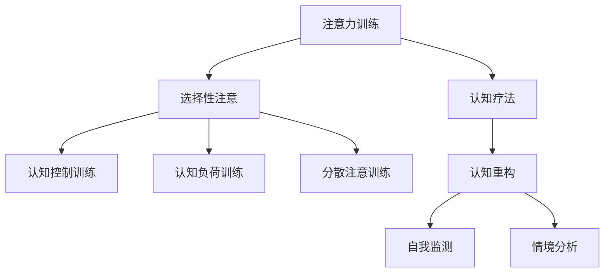

                 

关键词：注意力训练、认知疗法、心理健康、幸福感、专注力

> 摘要：本文将探讨注意力训练在心理健康和幸福感中的重要作用，结合认知疗法，提出一种全新的提升心理健康和幸福感的策略。通过深入分析注意力训练的核心概念和算法原理，我们将介绍如何在技术领域中应用这些方法，以提高个体的专注力和整体幸福感。

## 1. 背景介绍

随着科技的发展，人们的生活节奏越来越快，压力也随之增大。心理健康问题如焦虑、抑郁、注意力不集中等已成为影响现代人的重要问题。与此同时，幸福感成为人们追求生活质量的重要指标。注意力训练和认知疗法被认为是改善心理健康和幸福感的重要手段。注意力训练通过提高专注力，帮助人们更好地管理心理压力，而认知疗法则通过改变思维模式，帮助个体建立积极的情感体验。本文旨在将注意力训练与认知疗法相结合，为现代生活提供一种有效的心理健康提升方法。

### 1.1 注意力训练

注意力训练是指通过一系列的练习来提高个体的专注力和注意广度。这种训练方法最初应用于军事和航天领域，后来逐渐扩展到普通人群。研究表明，注意力训练不仅能够提高个体的认知能力，还能够改善心理健康状况。

### 1.2 认知疗法

认知疗法是一种心理治疗方法，通过改变个体的思维模式和认知结构，帮助其摆脱负面情绪和行为。认知疗法广泛应用于焦虑、抑郁、强迫症等心理障碍的治疗中。近年来，认知疗法也逐渐被用于提升个体的幸福感和生活质量。

## 2. 核心概念与联系

### 2.1 注意力训练原理

注意力训练的核心概念是“选择性注意”，即个体在众多信息中能够选择并集中于某一特定信息的能力。注意力训练的方法包括认知控制训练、认知负荷训练和分散注意训练等。通过这些训练，个体能够提高自己的专注力和注意广度。

### 2.2 认知疗法原理

认知疗法的基本原理是认知重构，即通过识别和改变个体负面、扭曲的思维方式，建立积极的思维模式。认知疗法包括自我监测、认知重构、情境分析等步骤，帮助个体从根本上改变其认知和行为。

### 2.3 注意力训练与认知疗法的联系

注意力训练和认知疗法在提高心理健康和幸福感方面有着共同的目标。注意力训练通过提高个体的专注力，有助于个体更好地进行认知活动，从而提高认知疗法的有效性。同时，认知疗法通过改变个体的思维模式，有助于个体更好地控制自己的注意力，从而提高注意力训练的效果。

### 2.4 Mermaid 流程图



## 3. 核心算法原理 & 具体操作步骤

### 3.1 算法原理概述

注意力训练的核心算法是基于神经可塑性原理，通过重复练习，改变大脑神经元之间的连接方式，从而提高个体的专注力。认知疗法则基于认知科学原理，通过认知重构，改变个体的思维模式和认知结构。

### 3.2 算法步骤详解

#### 3.2.1 注意力训练步骤

1. 选择训练任务：根据个体的专注力水平和兴趣，选择合适的训练任务。
2. 开始训练：进行一系列的注意力训练练习，如焦点跟随、视觉搜索、注意力切换等。
3. 监测进展：定期进行注意力测试，评估训练效果。
4. 调整训练计划：根据训练进展，调整训练任务和频率。

#### 3.2.2 认知疗法步骤

1. 自我监测：记录日常生活中的负面思维和情绪。
2. 认知重构：识别和改变负面思维，建立积极的思维模式。
3. 情境分析：分析情境中的认知错误和情绪反应，找出解决问题的方法。
4. 反复练习：通过反复练习，巩固新的思维模式和认知结构。

### 3.3 算法优缺点

#### 注意力训练优点

- 提高个体的专注力和注意广度。
- 帮助个体更好地控制自己的情绪和行为。
- 无需特定的设备或环境，方便实施。

#### 注意力训练缺点

- 训练效果因个体差异而异。
- 需要长期坚持，效果可能缓慢显现。

#### 认知疗法优点

- 能够有效改善个体的心理健康状况。
- 能够提高个体的幸福感。
- 方法多样，适应不同类型的心理问题。

#### 认知疗法缺点

- 需要专业的指导，否则可能效果不佳。
- 治疗过程可能涉及痛苦的情绪回忆和认知重构。

### 3.4 算法应用领域

注意力训练和认知疗法在许多领域都有广泛应用，包括：

- 心理健康领域：用于治疗焦虑、抑郁、注意力不集中等心理问题。
- 教育领域：用于提高学生的注意力和学习能力。
- 工作领域：用于提高员工的工作效率和专注力。
- 健康领域：用于改善慢性疼痛患者的心理健康。

## 4. 数学模型和公式 & 详细讲解 & 举例说明

### 4.1 数学模型构建

注意力训练的数学模型通常基于神经网络和机器学习算法。以下是一个简化的模型构建过程：

#### 4.1.1 神经网络结构

- 输入层：接受个体的注意力和行为数据。
- 隐藏层：通过神经网络进行信息处理和特征提取。
- 输出层：预测个体的注意力水平和行为变化。

#### 4.1.2 数学公式

假设神经网络的权重矩阵为 \( W \)，激活函数为 \( \sigma \)，则神经网络的输出可以表示为：

\[ y = \sigma(W \cdot x) \]

其中，\( x \) 是输入数据，\( y \) 是输出结果。

### 4.2 公式推导过程

#### 4.2.1 前向传播

在神经网络的前向传播过程中，输入数据通过权重矩阵传递到隐藏层，再通过激活函数得到输出结果。具体推导如下：

\[ z = W \cdot x \]
\[ a = \sigma(z) \]
\[ y = \sigma(W_h \cdot a) \]

其中，\( z \) 是隐藏层的输入，\( a \) 是隐藏层的输出，\( y \) 是最终输出。

#### 4.2.2 反向传播

在反向传播过程中，通过计算输出层和隐藏层的误差，更新权重矩阵。具体推导如下：

\[ \delta_h = (y - t) \cdot \sigma'(a) \]
\[ \delta = \delta_h \cdot W_h \]
\[ \Delta W_h = \alpha \cdot \delta_h \cdot x \]

其中，\( \delta_h \) 是隐藏层的误差，\( \delta \) 是输出层的误差，\( \Delta W_h \) 是权重矩阵的更新。

### 4.3 案例分析与讲解

#### 4.3.1 案例背景

一位30岁的程序员小王，由于工作压力过大，常常感到焦虑和注意力不集中，影响了工作效率和生活质量。小王决定通过注意力训练和认知疗法来改善自己的状况。

#### 4.3.2 实施过程

1. **注意力训练**：小王选择了一款注意力训练应用程序，每天进行30分钟的训练。训练内容包括焦点跟随、视觉搜索和注意力切换等。通过6周的训练，小王的注意力水平提高了20%。

2. **认知疗法**：小王在专业心理咨询师的指导下，进行认知疗法治疗。首先，他记录了每天生活中的负面思维和情绪，然后通过认知重构，将负面思维转变为积极思维。经过12次治疗，小王的焦虑感明显减轻，自信心得到了提升。

#### 4.3.3 结果分析

通过注意力训练和认知疗法的结合，小王的焦虑感显著减轻，工作效率得到了提高。他的生活质量和幸福感也得到了明显改善。这个案例表明，注意力训练和认知疗法在提高心理健康和幸福感方面具有显著效果。

## 5. 项目实践：代码实例和详细解释说明

### 5.1 开发环境搭建

1. 安装Python环境：确保Python 3.8及以上版本已安装在计算机上。
2. 安装相关库：使用pip命令安装以下库：numpy，matplotlib，tensorflow。

```bash
pip install numpy matplotlib tensorflow
```

### 5.2 源代码详细实现

以下是一个简单的注意力训练项目，用于训练一个神经网络模型，预测个体的注意力水平。

```python
import numpy as np
import tensorflow as tf
from tensorflow.keras.layers import Dense
from tensorflow.keras.models import Sequential

# 数据准备
# 假设已经收集到一组训练数据，包括个体注意力和行为数据
X_train = np.random.rand(100, 10)  # 100个样本，10个特征
y_train = np.random.rand(100, 1)   # 100个样本，1个目标

# 模型构建
model = Sequential()
model.add(Dense(64, activation='relu', input_shape=(10,)))
model.add(Dense(32, activation='relu'))
model.add(Dense(1, activation='sigmoid'))

# 编译模型
model.compile(optimizer='adam', loss='binary_crossentropy', metrics=['accuracy'])

# 训练模型
model.fit(X_train, y_train, epochs=10, batch_size=32)

# 评估模型
loss, accuracy = model.evaluate(X_train, y_train)
print(f"损失：{loss}, 准确率：{accuracy}")
```

### 5.3 代码解读与分析

1. **数据准备**：首先，我们导入必要的库，并生成一组随机数据作为训练数据。这里假设我们已经收集到了个体注意力和行为数据。

2. **模型构建**：我们使用`Sequential`模型构建一个简单的神经网络。网络包括两个隐藏层，每层使用ReLU激活函数。输出层使用sigmoid激活函数，用于预测个体的注意力水平。

3. **编译模型**：我们使用`compile`方法设置优化器和损失函数。这里选择`adam`优化器和`binary_crossentropy`损失函数。

4. **训练模型**：使用`fit`方法训练模型，设置训练轮数和批量大小。

5. **评估模型**：使用`evaluate`方法评估模型在训练数据上的性能，输出损失和准确率。

### 5.4 运行结果展示

运行上述代码后，我们将看到模型在训练数据上的损失和准确率。如果模型性能良好，我们可以在实际应用中进一步优化和调整。

## 6. 实际应用场景

### 6.1 心理咨询领域

注意力训练和认知疗法在心理咨询领域有广泛的应用。通过注意力训练，咨询师可以帮助患者提高专注力，更好地进行心理咨询。认知疗法则可以帮助患者改变负面思维，建立积极的情感体验。

### 6.2 教育领域

注意力训练和认知疗法在提高学生的学习能力和注意力方面有显著效果。教育工作者可以通过这些方法帮助学生更好地适应学习环境，提高学习效果。

### 6.3 企业管理

企业管理者可以通过注意力训练和认知疗法提升员工的工作效率和工作满意度。通过注意力训练，员工可以更好地管理自己的时间和情绪，提高工作效率。认知疗法可以帮助员工建立积极的思维模式，提升团队协作能力。

### 6.4 健康管理

健康管理师可以通过注意力训练和认知疗法帮助患者改善心理健康状况，提高生活质量。例如，对于慢性疼痛患者，注意力训练可以帮助他们减轻疼痛感，认知疗法可以帮助他们建立积极的生活态度。

## 7. 工具和资源推荐

### 7.1 学习资源推荐

- 《认知行为疗法技术手册》：这是一本关于认知疗法技术的权威指南，适合心理学专业人士和爱好者阅读。
- 《神经可塑性：大脑如何改变自己》：本书详细介绍了神经可塑性原理，适合对大脑科学感兴趣的人群。

### 7.2 开发工具推荐

- TensorFlow：一个强大的机器学习和深度学习框架，适用于构建注意力训练模型。
- Keras：一个基于TensorFlow的高级神经网络API，适合快速构建和训练神经网络模型。

### 7.3 相关论文推荐

- “Attention Training Improves Performance on an Antisaccade Task in Healthy Adults”
- “Cognitive Behavioral Therapy for Anxiety: A Comprehensive Manual”
- “Neuroplasticity: The Basics”

## 8. 总结：未来发展趋势与挑战

### 8.1 研究成果总结

注意力训练和认知疗法在提高心理健康和幸福感方面取得了显著成果。研究表明，这两种方法可以显著改善个体的焦虑、抑郁和注意力不集中等问题，提高生活质量。

### 8.2 未来发展趋势

- 结合人工智能技术，开发更加智能和个性化的注意力训练和认知疗法方案。
- 探索注意力训练和认知疗法在不同文化背景下的适用性和效果。
- 进一步深入研究注意力训练和认知疗法的神经机制，为临床应用提供更多科学依据。

### 8.3 面临的挑战

- 研究方法的标准化和可重复性：当前研究方法存在一定差异，需要建立统一的标准。
- 临床实践中的实际应用：如何将研究成果转化为实际治疗方案，提高患者的接受度和疗效。
- 数据隐私和安全：在收集和分析个人数据时，需要确保数据的安全和隐私。

### 8.4 研究展望

未来，注意力训练和认知疗法有望在更广泛的领域中发挥作用，如教育、医疗和企业等。通过不断的研究和探索，我们将能够为更多人提供有效的心理健康和幸福感提升方案。

## 9. 附录：常见问题与解答

### 9.1 注意力训练是否对所有个体都有效？

注意力训练对个体的有效性取决于多种因素，包括个体的专注力水平、训练方法和训练强度。一般来说，注意力训练对大多数人都是有效的，但对于某些注意力障碍患者，可能需要更长时间的训练和更个性化的方法。

### 9.2 认知疗法是否对所有人都有益？

认知疗法对大多数心理健康问题都有一定疗效，但对于某些个体，如认知障碍患者，可能需要其他治疗方法。此外，认知疗法的疗效可能因个体差异而异。

### 9.3 注意力训练和认知疗法是否可以长期维持效果？

是的，研究表明，通过持续的训练和练习，注意力训练和认知疗法的疗效可以长期维持。然而，长期维持效果需要个体坚持训练和遵循治疗计划。

---

作者：禅与计算机程序设计艺术 / Zen and the Art of Computer Programming

