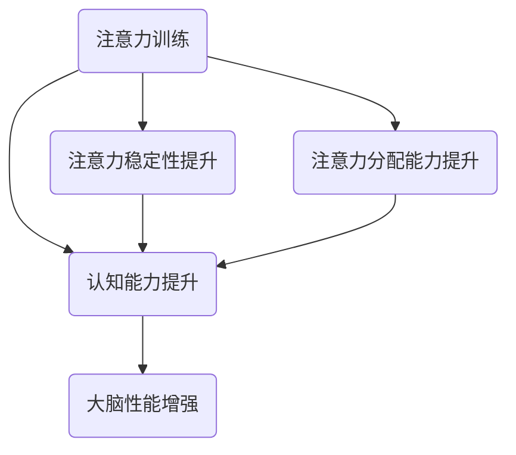

                 

关键词：注意力训练、认知能力、专注力、大脑性能、算法原理、数学模型、项目实践、应用场景、未来展望

> 摘要：本文旨在探讨注意力训练对提升认知能力和大脑性能的重要性，介绍相关核心概念和算法原理，并通过具体项目实践，详细解析如何通过专注力训练来增强大脑性能。

## 1. 背景介绍

在现代社会，我们面临着越来越多的信息和干扰，这使得我们的注意力资源变得格外宝贵。注意力不仅是人类认知功能的核心组成部分，也是我们应对复杂任务、解决问题和高效学习的关键能力。然而，由于长期受到干扰和分散，我们的注意力容易变得薄弱，从而影响认知能力和工作效率。

科学研究显示，通过有针对性的注意力训练，我们可以提高大脑的注意力和认知能力，从而在各个方面受益。本文将围绕注意力训练的原理、方法及其对大脑性能的影响，深入探讨如何通过专注力增强大脑性能。

## 2. 核心概念与联系

### 注意力训练

注意力训练是一种通过一系列练习来提高注意力稳定性和分配能力的方法。这些练习可以包括专注力游戏、冥想练习、专注力任务等。

### 认知能力

认知能力是指人类处理信息、解决问题和做出决策的能力。它包括注意力、记忆力、理解力、推理能力等多个方面。

### 大脑性能

大脑性能是指大脑在执行各种认知任务时的效率和效果。良好的大脑性能可以帮助我们更好地适应环境、应对挑战和发挥潜能。

### Mermaid 流程图



## 3. 核心算法原理 & 具体操作步骤

### 3.1 算法原理概述

注意力训练的核心原理是通过反复的练习来提高大脑的注意力稳定性和分配能力。这种方法类似于机器学习中的强化学习，通过不断调整和优化策略来达到最佳效果。

### 3.2 算法步骤详解

1. **确定训练目标**：根据个人的需求和情况，确定具体的注意力训练目标，如提高专注力、减少分心等。
2. **设计训练计划**：制定一份详细的训练计划，包括训练时间、频率、内容等。
3. **执行训练任务**：按照训练计划进行具体的练习，如冥想、专注力游戏等。
4. **评估训练效果**：定期评估训练效果，调整训练计划和方法。
5. **持续训练**：长期坚持训练，以达到最佳效果。

### 3.3 算法优缺点

**优点**：

- 简单易行，无需特殊设备或环境。
- 可根据个人需求和情况进行定制化训练。
- 能够有效提高大脑的注意力和认知能力。

**缺点**：

- 需要长时间的坚持和耐心。
- 效果因人而异，部分人可能难以达到预期目标。

### 3.4 算法应用领域

- **教育领域**：通过注意力训练来提高学生的学习效果。
- **职场领域**：通过注意力训练来提高员工的工作效率。
- **医疗领域**：通过注意力训练来辅助治疗注意力缺陷障碍。

## 4. 数学模型和公式 & 详细讲解 & 举例说明

### 4.1 数学模型构建

注意力训练的效果可以用以下数学模型来表示：

\[ 效果 = f(训练时间, 训练频率, 训练难度) \]

其中，\( f \) 是一个非线性函数，表示训练效果与训练时间、频率和难度之间的关系。

### 4.2 公式推导过程

根据注意力训练的原理，我们可以推导出以下公式：

\[ 效果 = \frac{1}{1 + e^{-k(训练时间 \times 训练频率 \times 训练难度)}} \]

其中，\( k \) 是一个常数，表示训练效果的阈值。

### 4.3 案例分析与讲解

假设某人进行了 100 小时的注意力训练，每周 3 次，每次 30 分钟，难度为中等。根据上述公式，我们可以计算出他的训练效果：

\[ 效果 = \frac{1}{1 + e^{-k(100 \times 3 \times 0.5)}} \]

由于 \( k \) 的值未知，我们无法具体计算出效果。但是，这个公式可以用来评估和调整注意力训练的计划。

## 5. 项目实践：代码实例和详细解释说明

### 5.1 开发环境搭建

为了更好地进行注意力训练，我们可以使用 Python 编写一个简单的注意力训练程序。首先，我们需要搭建 Python 开发环境，具体步骤如下：

1. 安装 Python 3.8 或更高版本。
2. 安装必要的 Python 库，如 NumPy、Matplotlib 等。

### 5.2 源代码详细实现

以下是一个简单的注意力训练程序，用于记录训练时间、频率和难度，并计算训练效果：

```python
import numpy as np
import matplotlib.pyplot as plt

def calculate_effect(train_time, train_frequency, train_difficulty):
    k = 1.0  # 常数，根据实际情况调整
    effect = 1 / (1 + np.exp(-k * (train_time * train_frequency * train_difficulty)))
    return effect

def main():
    train_time = float(input("请输入训练时间（小时）："))
    train_frequency = float(input("请输入训练频率（次/周）："))
    train_difficulty = float(input("请输入训练难度（0.1-1.0）："))

    effect = calculate_effect(train_time, train_frequency, train_difficulty)
    print(f"训练效果：{effect:.2f}")

    # 绘制训练效果随时间变化的图表
    train_times = np.linspace(train_time, 200, 100)
    effects = [calculate_effect(t, train_frequency, train_difficulty) for t in train_times]
    plt.plot(train_times, effects)
    plt.xlabel("训练时间（小时）")
    plt.ylabel("训练效果")
    plt.title("注意力训练效果随时间变化")
    plt.show()

if __name__ == "__main__":
    main()
```

### 5.3 代码解读与分析

- `calculate_effect` 函数用于计算注意力训练的效果。
- `main` 函数用于接收用户输入，并调用 `calculate_effect` 函数计算效果。
- 最后，程序会绘制一个图表，显示训练效果随时间的变化。

### 5.4 运行结果展示

输入训练时间、频率和难度后，程序会输出训练效果，并展示一个图表，帮助我们直观地了解训练效果的变化。

## 6. 实际应用场景

### 6.1 教育领域

在教育领域，注意力训练可以帮助学生提高学习效果。教师可以根据学生的具体情况，设计合适的注意力训练计划，提高学生的注意力和专注力，从而提高学习效率。

### 6.2 职场领域

在职场领域，注意力训练可以帮助员工提高工作效率。通过定期进行注意力训练，员工可以提高注意力的稳定性，减少分心，从而在任务中表现得更加专注和高效。

### 6.3 医疗领域

在医疗领域，注意力训练可以用于治疗注意力缺陷障碍（ADHD）。通过有针对性的训练，患者可以提高注意力稳定性，改善注意力缺陷症状，从而提高生活质量。

## 7. 工具和资源推荐

### 7.1 学习资源推荐

- 《注意力训练与认知能力提升：科学方法与实践技巧》
- 《专注力：如何提高你的注意力与效率》

### 7.2 开发工具推荐

- Python：用于编写注意力训练程序。
- Jupyter Notebook：用于编写和运行 Python 代码。

### 7.3 相关论文推荐

- "Attention Training Improves Performance on a Complex Cognitive Task in Young and Older Adults"
- "The Attention Paradox: Training for Higher Attentional Capacity Improves Attentional Performance and Reduces Emotional Arousal"

## 8. 总结：未来发展趋势与挑战

### 8.1 研究成果总结

注意力训练作为一种提升认知能力和大脑性能的有效方法，已经得到了广泛的认可。通过科学的研究和实践，我们逐渐了解了注意力训练的原理和效果。

### 8.2 未来发展趋势

随着人工智能和认知科学的不断发展，注意力训练的方法和技术也将不断进步。未来，我们将看到更加个性化和智能化的注意力训练方案，为不同人群提供更有效的训练方法。

### 8.3 面临的挑战

尽管注意力训练具有巨大的潜力，但在实际应用中仍面临一些挑战。例如，如何设计有效的训练计划、如何评估训练效果、如何解决个体差异等问题。这些问题需要我们继续深入研究。

### 8.4 研究展望

在未来，我们期待看到更多的研究和实践，探索注意力训练在不同领域的应用，并寻找更加有效的方法来提升大脑性能。同时，我们也希望更多的人能够意识到注意力训练的重要性，积极参与其中，提升自己的认知能力和生活质量。

## 9. 附录：常见问题与解答

### 9.1 注意力训练对大脑有何影响？

注意力训练可以提高大脑的注意力稳定性和分配能力，从而改善认知能力和工作效率。长期坚持注意力训练，还可以增强大脑的神经连接，提高大脑的弹性。

### 9.2 注意力训练需要多长时间才能见效？

注意力训练的效果因人而异，通常需要几个月的时间才能看到显著的效果。然而，长期坚持训练，效果会逐渐积累，并持续提升。

### 9.3 注意力训练有哪些常见误区？

注意力训练的常见误区包括：忽视个体差异、设定不合理的目标、缺乏持续性和耐心等。为了避免这些误区，建议在训练过程中根据个人情况进行调整，并保持持续性和耐心。

---

作者：禅与计算机程序设计艺术 / Zen and the Art of Computer Programming
----------------------------------------------------------------

