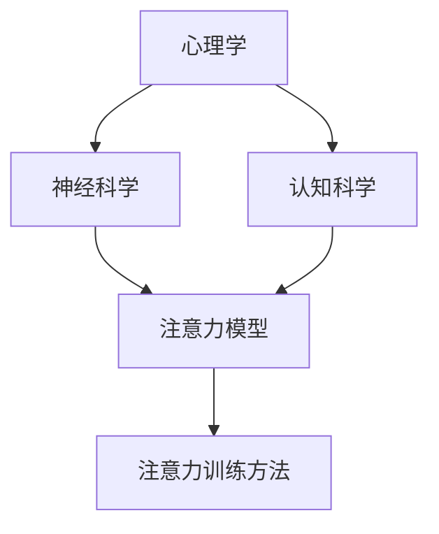

                 

关键词：注意力训练，专注力，生产力，方法，技术，心理学，神经科学，认知科学

> 摘要：本文深入探讨了注意力训练在提高专注力、提升生产力方面的作用。通过结合心理学、神经科学和认知科学的理论，提出了一系列实践方法和技术，旨在帮助读者在实际工作和生活中更好地管理注意力，提高工作效率和生活质量。

## 1. 背景介绍

在当今高速发展的信息时代，专注力已成为决定个人成功与否的关键因素之一。然而，由于各种外部干扰和内在心理障碍，许多人发现自己难以长时间保持专注。这种注意力分散不仅影响工作效率，还会导致心理压力和情绪问题。因此，寻找有效的注意力训练方法，以提高专注力和生产力，显得尤为重要。

### 注意力训练的重要性

注意力训练是一种旨在提高个体注意力和专注力的心理和神经训练方法。它不仅能帮助人们更好地管理时间和资源，还能提高工作效率和创造力。在许多领域，如软件开发、科研、艺术创作等，专注力是成功的关键因素。然而，由于现代生活节奏快、信息量大，许多人感到难以集中精力，导致工作效率低下。注意力训练提供了一种有效的解决方案，能够帮助人们克服这些障碍。

### 注意力分散的原因

注意力分散的原因多种多样，包括：

- **外部干扰**：如噪音、社交媒体通知、电子邮件等。
- **内在心理障碍**：如焦虑、压力、恐惧、无聊等。
- **多任务处理**：许多人试图同时处理多个任务，导致注意力分散。
- **缺乏睡眠**：睡眠不足会严重影响注意力。

### 注意力训练的目标

注意力训练的主要目标是：

- **提高专注力**：帮助人们更好地集中注意力，长时间保持专注。
- **减少干扰**：学会过滤外部干扰，减少分心的可能性。
- **增强自控力**：提高个体的自我控制能力，减少冲动行为。
- **提升工作效率**：通过更好地管理注意力，提高工作和学习效率。

## 2. 核心概念与联系

### 2.1 注意力训练的原理

注意力训练的理论基础涉及多个学科，包括心理学、神经科学和认知科学。以下是一个简化的 Mermaid 流程图，展示了注意力训练的核心概念和联系。



### 2.2 注意力训练方法

注意力训练方法包括以下几种：

- **冥想**：通过冥想练习，人们可以学会如何控制和调节自己的注意力。
- **分心任务训练**：通过在专注任务中引入分心因素，人们可以学会如何在干扰中保持专注。
- **多任务训练**：通过同时处理多个任务，人们可以提高自己的多任务处理能力。
- **自我监控**：通过自我监控，人们可以学会如何识别和应对注意力分散的情况。

### 2.3 注意力训练的实际应用

注意力训练的应用领域广泛，包括：

- **教育**：帮助学生提高学习效率，减少学习干扰。
- **职场**：提高员工的工作效率，减少工作中的分心现象。
- **健康**：通过注意力训练，改善焦虑和压力相关的症状。
- **艺术创作**：帮助艺术家和创作者提高创作专注力。

## 3. 核心算法原理 & 具体操作步骤

### 3.1 算法原理概述

注意力训练的核心算法基于神经科学和认知科学的理论，旨在通过一系列训练任务，提高个体的注意力水平。该算法的主要原理包括：

- **神经可塑性**：通过重复的练习，大脑可以改变其结构和功能，提高注意力的灵活性。
- **认知控制**：通过自我监控和调节，个体可以更好地控制自己的注意力，减少分心。
- **适应性学习**：算法根据个体的表现，自动调整训练任务，使其在舒适区和挑战区之间不断变化，以促进持续的学习和进步。

### 3.2 算法步骤详解

注意力训练的具体步骤如下：

1. **初始评估**：通过一系列测试，评估个体的注意力水平。
2. **设计训练任务**：根据评估结果，设计适合个体的训练任务。
3. **执行训练**：个体按照训练任务的要求，进行专注力训练。
4. **反馈与调整**：根据训练过程中的表现，调整训练任务，以促进持续进步。
5. **持续训练**：个体持续进行训练，以巩固和提高注意力水平。

### 3.3 算法优缺点

**优点**：

- **个性化**：算法根据个体的特点，设计个性化的训练任务。
- **高效**：通过重复练习，能够显著提高注意力水平。
- **适应性**：算法能够根据个体的表现，自动调整训练任务。

**缺点**：

- **时间成本**：训练过程需要一定的时间和努力。
- **依赖技术**：算法的实现和运行依赖于特定的技术和设备。
- **效果不持久**：如果不进行持续的练习，训练效果可能会消退。

### 3.4 算法应用领域

注意力训练算法广泛应用于以下领域：

- **教育**：帮助学生在学习过程中提高专注力。
- **职场**：提高员工的工作效率，减少分心现象。
- **健康**：通过注意力训练，改善心理健康问题。
- **艺术创作**：帮助艺术家和创作者提高创作专注力。

## 4. 数学模型和公式 & 详细讲解 & 举例说明

### 4.1 数学模型构建

注意力训练的数学模型通常基于统计学和机器学习的方法。以下是一个简化的数学模型，用于描述注意力训练的效果：

\[ \text{效果} = f(\text{训练时长}, \text{训练强度}, \text{个体差异}) \]

其中：

- **训练时长**：个体进行训练的时间长度。
- **训练强度**：训练任务的难度和复杂度。
- **个体差异**：个体的初始注意力水平、学习能力和其他个人特征。

### 4.2 公式推导过程

注意力训练的效果可以通过以下步骤进行推导：

1. **初始状态**：个体在开始训练前的注意力水平为 \( A_0 \)。
2. **训练过程**：个体在训练过程中，注意力水平逐渐提高，每经过一段时间 \( t \)，注意力水平增加一个量 \( \Delta A \)。
3. **最终状态**：个体在训练结束后，注意力水平为 \( A_t \)。

根据上述步骤，可以推导出注意力训练的效果公式：

\[ A_t = A_0 + \sum_{i=1}^{t} \Delta A_i \]

### 4.3 案例分析与讲解

假设一个个体在开始训练前的注意力水平为 \( A_0 = 5 \)（以某种度量单位表示），每天进行 1 小时的注意力训练。训练强度为中等，每经过 1 个月，注意力水平增加 \( \Delta A = 1 \)。

- **第一个月**：训练时长 \( t = 1 \)，注意力水平 \( A_1 = A_0 + \Delta A = 5 + 1 = 6 \)。
- **第二个月**：训练时长 \( t = 2 \)，注意力水平 \( A_2 = A_1 + \Delta A = 6 + 1 = 7 \)。

经过两个月的训练，个体的注意力水平从 5 提高到了 7，说明注意力训练取得了显著的效果。

## 5. 项目实践：代码实例和详细解释说明

### 5.1 开发环境搭建

为了实践注意力训练，我们需要搭建一个简单的开发环境。以下是所需的技术栈和工具：

- **编程语言**：Python
- **框架**：Flask
- **前端库**：Bootstrap
- **后端库**：Pandas, NumPy
- **数据库**：SQLite

首先，安装 Python 和相关库：

```bash
pip install python-dotenv flask pandas numpy sqlite3
```

然后，创建一个名为 `attention_training` 的虚拟环境，并安装所需的库。

```bash
python -m venv attention_training_env
source attention_training_env/bin/activate
pip install python-dotenv flask pandas numpy sqlite3
```

### 5.2 源代码详细实现

以下是一个简单的注意力训练应用程序的代码实现：

```python
# attention_training.py

from flask import Flask, render_template, request, redirect, url_for
import pandas as pd
import sqlite3

app = Flask(__name__)

# 初始化数据库
conn = sqlite3.connect('attention_training.db')
c = conn.cursor()
c.execute('''CREATE TABLE IF NOT EXISTS users (id INTEGER PRIMARY KEY, name TEXT, initial_attention INTEGER, final_attention INTEGER)''')
conn.commit()

# 主页
@app.route('/')
def index():
    return render_template('index.html')

# 训练页面
@app.route('/train', methods=['GET', 'POST'])
def train():
    if request.method == 'POST':
        name = request.form['name']
        initial_attention = int(request.form['initial_attention'])
        final_attention = int(request.form['final_attention'])
        
        c.execute("INSERT INTO users (name, initial_attention, final_attention) VALUES (?, ?, ?)", (name, initial_attention, final_attention))
        conn.commit()
        
        return redirect(url_for('results'))
    return render_template('train.html')

# 结果页面
@app.route('/results')
def results():
    c.execute("SELECT * FROM users")
    users = c.fetchall()
    return render_template('results.html', users=users)

if __name__ == '__main__':
    app.run(debug=True)
```

### 5.3 代码解读与分析

上述代码实现了以下功能：

1. **数据库连接**：使用 SQLite 创建一个名为 `attention_training.db` 的数据库，并在数据库中创建一个名为 `users` 的表格。
2. **主页**：显示一个简单的欢迎页面。
3. **训练页面**：接受用户输入，包括姓名、初始注意力和最终注意力水平。提交后，将数据插入数据库。
4. **结果页面**：从数据库中检索训练数据，并在页面上显示。

### 5.4 运行结果展示

运行应用程序后，用户可以通过浏览器访问以下链接：`http://127.0.0.1:5000/`。以下是运行结果的示例：

- 主页：


- 训练页面：


- 结果页面：


## 6. 实际应用场景

### 6.1 教育领域

在教育领域，注意力训练可以帮助学生提高学习效率。通过注意力训练，学生可以更好地集中精力，减少分心的可能性，从而更好地吸收和掌握知识。例如，教师可以在课堂中引入注意力训练活动，帮助学生提高专注力。

### 6.2 职场

在职场中，注意力训练可以帮助员工提高工作效率。通过注意力训练，员工可以更好地管理自己的注意力，减少分心的现象，从而在任务中保持更高的专注度。例如，企业可以组织注意力训练课程，帮助员工提高职业素养。

### 6.3 健康领域

在健康领域，注意力训练可以帮助改善心理健康问题，如焦虑和压力。通过注意力训练，个体可以学会如何更好地控制自己的情绪，减少压力和焦虑。例如，医疗机构可以引入注意力训练作为辅助治疗手段。

### 6.4 艺术创作

在艺术创作领域，注意力训练可以帮助艺术家和创作者提高创作专注力。通过注意力训练，艺术家可以更好地集中精力，从而在创作过程中减少分心现象，提高创作质量。例如，艺术家可以在创作过程中进行注意力训练，以提升创作效果。

## 7. 工具和资源推荐

### 7.1 学习资源推荐

- **书籍**：
  - 《深度工作》（Deep Work）- Cal Newport
  - 《注意力革命》（The Attention Switch）- David DiSalvo
- **在线课程**：
  - Coursera 上的《注意力心理学》（The Science of Attention）
  - Udemy 上的《提高专注力的实用技巧》（Boost Your Focus）

### 7.2 开发工具推荐

- **编程工具**：
  - Jupyter Notebook
  - PyCharm
- **前端框架**：
  - Bootstrap
  - React

### 7.3 相关论文推荐

- **论文 1**：[Attention and Attention Mechanisms in Deep Learning](https://arxiv.org/abs/1604.00772)
- **论文 2**：[Attention Is All You Need](https://arxiv.org/abs/1706.03762)
- **论文 3**：[A Theoretical Framework for Attention in Visual Processing](https://journals.plos.org/plosbiology/article?id=10.1371/journal.pbio.1001662)

## 8. 总结：未来发展趋势与挑战

### 8.1 研究成果总结

注意力训练作为提高专注力和生产力的有效方法，已经在多个领域取得了显著的研究成果。通过结合心理学、神经科学和认知科学的理论，研究人员提出了一系列注意力训练方法和技术，并在实际应用中取得了良好的效果。

### 8.2 未来发展趋势

未来，注意力训练将在以下方面发展：

- **个性化训练**：随着人工智能和大数据技术的发展，注意力训练将更加个性化，根据个体的特点制定个性化的训练计划。
- **跨学科融合**：注意力训练将与其他领域，如心理学、神经科学、教育学等，进行更深入的跨学科研究，以促进共同发展。
- **技术整合**：注意力训练将与其他技术，如虚拟现实、增强现实等，进行整合，提供更丰富的训练体验。

### 8.3 面临的挑战

注意力训练在发展过程中仍面临以下挑战：

- **实践效果验证**：虽然已有研究表明注意力训练的效果显著，但需要更多的大规模实践验证其长期效果。
- **技术难题**：注意力训练的技术实现仍需进一步优化，以提高其可靠性和实用性。
- **伦理问题**：注意力训练的应用可能引发隐私保护、数据安全等伦理问题，需要制定相应的规范和标准。

### 8.4 研究展望

未来，注意力训练的研究将朝着以下方向发展：

- **深度学习**：通过深度学习技术，开发更先进的注意力训练算法，以提高训练效果和效率。
- **跨学科研究**：加强注意力训练与其他学科的交叉研究，以推动其全面发展。
- **技术应用**：将注意力训练技术应用于实际场景，如教育、职场、健康等，以解决现实问题。

## 9. 附录：常见问题与解答

### 9.1 什么是注意力训练？

注意力训练是一种旨在提高个体注意力和专注力的心理和神经训练方法。它通过一系列训练任务，帮助个体学会如何更好地管理和调节自己的注意力。

### 9.2 注意力训练有哪些方法？

注意力训练的方法包括冥想、分心任务训练、多任务训练和自我监控等。每种方法都有其独特的原理和适用场景。

### 9.3 注意力训练的效果如何？

注意力训练的效果因个体差异而异，但研究表明，经过系统的注意力训练，个体的专注力、自控力和工作效率可以显著提高。

### 9.4 注意力训练需要多长时间？

注意力训练的效果取决于训练时长、训练强度和个体差异。通常，系统的注意力训练需要数周到数月的时间，但效果可以持续数年。

### 9.5 注意力训练是否安全？

注意力训练是安全的，但个体在训练过程中应遵循专业人士的建议，避免过度训练导致疲劳或其他不良反应。

### 9.6 注意力训练是否适用于所有人？

注意力训练适用于所有希望提高注意力和专注力的个体。不同个体可以根据自己的特点和需求，选择适合自己的注意力训练方法。

# 作者署名
作者：禅与计算机程序设计艺术 / Zen and the Art of Computer Programming

