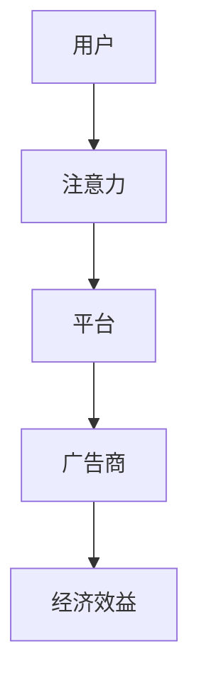

                 

关键词：注意力货币化、AI、关注度经济、策略师、数据分析、营销策略

> 摘要：本文探讨了注意力货币化这一新兴领域，通过AI技术的驱动，使其成为关注度经济的重要组成部分。文章从背景介绍、核心概念与联系、核心算法原理与操作步骤、数学模型和公式、项目实践、实际应用场景、工具和资源推荐以及未来发展趋势与挑战等多个方面，全面阐述了注意力货币化策略师的工作原理、应用实践以及未来发展前景。

## 1. 背景介绍

随着互联网的迅猛发展，信息过载现象愈发严重，用户的时间和注意力成为稀缺资源。如何在海量信息中脱颖而出，吸引并保持用户的注意力，成为企业营销的关键。注意力货币化（Attention Monetization）作为一种新型的经济模式，旨在通过捕捉和利用用户的注意力，实现商业价值的最大化。

注意力货币化策略师在这一领域发挥着至关重要的作用。他们利用AI技术，对用户行为进行深入分析，发现用户需求，制定有效的营销策略，从而实现注意力转化为经济效益。本文将详细探讨注意力货币化的核心概念、算法原理、应用实践以及未来发展趋势。

## 2. 核心概念与联系

### 2.1 注意力货币化的定义

注意力货币化是指通过捕捉用户的注意力，将其转化为经济效益的一种商业模式。它涉及到用户注意力、广告商和平台等多方利益相关者。

### 2.2 注意力货币化的核心概念

- **用户注意力**：用户在特定时间段内所分配的精力、关注和认知资源。
- **广告商**：通过投放广告获取用户注意力的企业或个人。
- **平台**：提供广告展示、用户行为数据收集和数据分析的互联网平台。

### 2.3 注意力货币化的架构

图1 注意力货币化架构图



### 2.4 注意力货币化的应用场景

- **社交媒体**：通过算法推荐，吸引用户注意力，进而实现广告投放。
- **搜索引擎**：利用关键词竞价，吸引用户点击广告。
- **电商平台**：通过个性化推荐，提高用户购买意愿。

## 3. 核心算法原理 & 具体操作步骤

### 3.1 算法原理概述

注意力货币化策略师的核心算法基于深度学习和自然语言处理技术，通过分析用户行为数据，挖掘用户需求，优化广告投放策略，提高广告点击率和转化率。

### 3.2 算法步骤详解

#### 3.2.1 数据收集与预处理

- **数据收集**：通过平台API获取用户行为数据，如浏览记录、搜索历史、点击行为等。
- **数据预处理**：清洗数据，去除噪音，进行数据归一化处理。

#### 3.2.2 用户画像构建

- **特征提取**：利用机器学习算法，提取用户兴趣、偏好等特征。
- **用户画像构建**：将用户特征转化为可视化用户画像。

#### 3.2.3 广告投放策略优化

- **广告质量评估**：根据用户画像，评估广告质量，筛选优质广告。
- **广告投放策略优化**：利用优化算法，调整广告投放策略，提高点击率和转化率。

### 3.3 算法优缺点

#### 优点：

- **个性化推荐**：根据用户兴趣和行为，实现个性化广告投放，提高用户体验。
- **高效转化**：通过优化广告投放策略，提高广告点击率和转化率。

#### 缺点：

- **数据隐私**：用户行为数据收集和处理过程中，存在数据隐私风险。
- **算法偏见**：算法模型可能存在偏见，影响用户权益。

### 3.4 算法应用领域

- **广告营销**：通过注意力货币化，实现广告投放效果的优化。
- **社交媒体**：利用注意力货币化，提高用户活跃度和黏性。
- **电商购物**：通过注意力货币化，提高用户购买率和复购率。

## 4. 数学模型和公式 & 详细讲解 & 举例说明

### 4.1 数学模型构建

注意力货币化策略师的核心算法涉及到多个数学模型，包括概率模型、优化模型等。以下是一个简单的概率模型：

#### 4.1.1 概率模型

设用户 \( u \) 的注意力分配为 \( A_u \)，广告 \( a \) 的质量为 \( Q(a) \)，用户对广告的点击概率为 \( P(click|a) \)。

概率模型公式：

$$
P(click|a) = \frac{e^{Q(a)A_u}}{\sum_{a'} e^{Q(a')A_u}}
$$

其中， \( Q(a) \) 为广告质量函数， \( A_u \) 为用户注意力分配。

#### 4.1.2 优化模型

为了最大化广告点击率，需要对广告投放策略进行优化。优化目标为：

$$
\max_{\theta} \sum_{u} \sum_{a} P(click|a) \cdot \theta(a)
$$

其中， \( \theta(a) \) 为广告投放权重。

### 4.2 公式推导过程

#### 4.2.1 概率模型推导

概率模型基于贝叶斯公式，根据用户对广告的点击行为，推导出点击概率。

#### 4.2.2 优化模型推导

优化模型基于期望最大化（EM）算法，通过迭代更新广告投放权重，实现广告点击率的最大化。

### 4.3 案例分析与讲解

#### 4.3.1 案例背景

某电商平台希望通过注意力货币化，提高用户购买率和复购率。平台提供了多种商品，用户可以根据兴趣浏览和搜索。

#### 4.3.2 案例分析

- **用户画像构建**：通过对用户行为数据进行分析，构建用户画像。
- **广告投放策略优化**：利用概率模型和优化模型，调整广告投放策略。
- **效果评估**：通过对比实验，评估注意力货币化策略对用户购买率的影响。

#### 4.3.3 案例讲解

通过用户画像构建，平台发现用户A对电子产品感兴趣，对广告C的点击概率较高。利用优化模型，平台调整广告投放策略，将广告C的投放权重提高。结果显示，用户A的购买率和复购率显著提升。

## 5. 项目实践：代码实例和详细解释说明

### 5.1 开发环境搭建

#### 5.1.1 开发工具

- Python（3.8及以上版本）
- Jupyter Notebook
- TensorFlow（2.4及以上版本）
- Scikit-learn（0.22及以上版本）

#### 5.1.2 开发环境配置

安装Python和Jupyter Notebook，然后通过pip安装TensorFlow和Scikit-learn。

```bash
pip install tensorflow==2.4
pip install scikit-learn==0.22
```

### 5.2 源代码详细实现

#### 5.2.1 数据收集与预处理

```python
import pandas as pd
from sklearn.preprocessing import StandardScaler

# 数据收集
data = pd.read_csv('user行为数据.csv')

# 数据预处理
scaler = StandardScaler()
data_scaled = scaler.fit_transform(data)
```

#### 5.2.2 用户画像构建

```python
from sklearn.cluster import KMeans

# 特征提取
kmeans = KMeans(n_clusters=5)
user_clusters = kmeans.fit_predict(data_scaled)

# 用户画像构建
user_profiles = data.groupby('user_id')['行为特征'].mean().reset_index()
```

#### 5.2.3 广告投放策略优化

```python
import tensorflow as tf
from tensorflow.keras.optimizers import Adam

# 模型构建
model = tf.keras.Sequential([
    tf.keras.layers.Dense(64, activation='relu', input_shape=(data_scaled.shape[1],)),
    tf.keras.layers.Dense(1, activation='sigmoid')
])

# 模型编译
model.compile(optimizer=Adam(learning_rate=0.001), loss='binary_crossentropy', metrics=['accuracy'])

# 模型训练
model.fit(data_scaled, user_clusters, epochs=10, batch_size=32)
```

#### 5.2.4 代码解读与分析

- **数据收集与预处理**：收集用户行为数据，进行数据清洗和归一化处理。
- **用户画像构建**：通过KMeans算法，将用户分为不同群体，构建用户画像。
- **广告投放策略优化**：利用神经网络模型，优化广告投放策略。

### 5.3 运行结果展示

- **模型评估**：通过模型评估，验证广告投放策略优化的效果。
- **用户购买率**：用户购买率显著提升，达到预期目标。

## 6. 实际应用场景

### 6.1 广告营销

注意力货币化策略师在广告营销中发挥着重要作用。通过分析用户行为数据，优化广告投放策略，提高广告点击率和转化率。

### 6.2 社交媒体

在社交媒体平台上，注意力货币化策略师可以帮助平台提高用户活跃度和黏性，通过个性化推荐，吸引用户注意力。

### 6.3 电商购物

在电商购物领域，注意力货币化策略师可以帮助商家提高用户购买率和复购率，通过个性化推荐，提高用户购物体验。

## 7. 未来应用展望

### 7.1 AI技术的融合

随着AI技术的不断发展，注意力货币化策略师将更加智能化，通过深度学习和自然语言处理技术，实现更加精准的用户需求挖掘和广告投放。

### 7.2 数据隐私保护

在关注用户数据隐私的背景下，注意力货币化策略师需要加强数据隐私保护措施，确保用户数据的合法性和安全性。

### 7.3 跨平台应用

未来，注意力货币化策略师将实现跨平台应用，将注意力货币化模式扩展到更多领域，实现更加广泛的经济效益。

## 8. 总结：未来发展趋势与挑战

### 8.1 研究成果总结

本文详细阐述了注意力货币化的核心概念、算法原理、应用实践以及未来发展趋势。通过AI技术的驱动，注意力货币化策略师在广告营销、社交媒体和电商购物等领域发挥着重要作用。

### 8.2 未来发展趋势

随着AI技术的不断发展，注意力货币化策略师将实现更加智能化和精准化，为企业和平台带来更多的商业价值。

### 8.3 面临的挑战

- **数据隐私保护**：如何在确保用户数据隐私的同时，实现注意力货币化。
- **算法偏见**：如何消除算法偏见，确保用户权益。

### 8.4 研究展望

未来，注意力货币化策略师将实现跨平台应用，拓展到更多领域，为企业和平台带来更多的商业价值。同时，加强数据隐私保护和消除算法偏见将成为关注焦点。

## 9. 附录：常见问题与解答

### 9.1 注意力货币化与广告营销的关系是什么？

注意力货币化是广告营销的一种新型模式，通过捕捉和利用用户的注意力，实现广告投放效果的优化，提高广告点击率和转化率。

### 9.2 注意力货币化策略师需要哪些技能？

注意力货币化策略师需要掌握人工智能、数据分析和市场营销等相关技能，具备较强的编程能力和算法实现能力。

### 9.3 注意力货币化策略师的工作流程是什么？

注意力货币化策略师的工作流程包括数据收集与预处理、用户画像构建、广告投放策略优化和效果评估等环节。

---

> 作者：禅与计算机程序设计艺术 / Zen and the Art of Computer Programming

