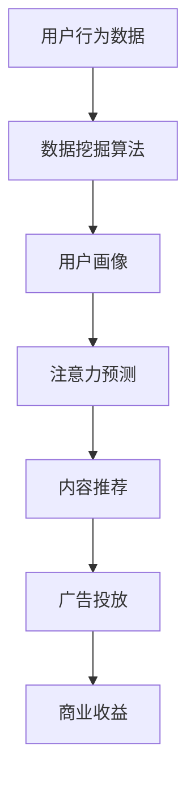

                 

关键词：注意力资本主义、元宇宙经济、剥削与异化、智能算法、人机交互、虚拟经济、技术哲学、经济模型、技术伦理

> 摘要：本文通过深入探讨注意力资本主义在元宇宙经济中的表现，揭示其背后的剥削与异化现象。首先，我们回顾了注意力资本主义的历史背景和核心概念，随后分析了其在元宇宙经济中的具体应用。通过数学模型和实例，我们展示了注意力资本主义对个体和社会产生的深远影响。最后，本文提出了对注意力资本主义进行批判的必要性，以及如何在元宇宙经济中实现公平和人道的解决方案。

## 1. 背景介绍

### 注意力资本主义的兴起

注意力资本主义是当代经济模式的一种新形态，它起源于20世纪末的网络经济。随着互联网和社交媒体的普及，信息传播的速度和广度达到前所未有的高度。在这种背景下，人们的时间和注意力成为了一种稀缺资源，而如何获取和利用注意力资源成为企业、媒体和个人竞争的焦点。注意力资本主义由此诞生，其核心在于通过算法和大数据分析，精准捕捉和引导用户的注意力。

### 元宇宙经济的兴起

元宇宙（Metaverse）是一个基于互联网的虚拟世界，它融合了增强现实（AR）、虚拟现实（VR）和游戏技术，为用户提供了全新的社交、娱乐和工作体验。元宇宙经济的崛起不仅改变了人们的消费和生活方式，更对传统的经济模式和社会结构产生了深远影响。在这个虚拟世界中，数字资产、虚拟商品和注意力资源成为新的经济单元，引发了一系列新的商业模式和竞争态势。

## 2. 核心概念与联系

### 注意力资本主义的定义

注意力资本主义可以被定义为一种通过算法和数据挖掘手段，将个体注意力和时间资源转化为经济价值的经济模式。在这种模式中，用户的时间和注意力被视为一种宝贵的资源，被企业、平台和个人利用来推动消费、广告和用户增长。

### 元宇宙经济中的注意力资源

在元宇宙经济中，注意力资源具有特别的重要性。用户在虚拟世界中的活动、社交、消费等行为，都成为被分析和利用的数据。平台和开发商通过算法对用户行为进行分析，以预测和引导用户注意力，从而提高用户参与度和商业价值。

### 核心概念原理和架构的 Mermaid 流程图



在这个流程图中，用户行为数据经过数据挖掘算法处理，生成用户画像。基于用户画像，注意力预测算法可以预测用户兴趣和行为，进而为内容推荐和广告投放提供依据。最终，这些活动带来了商业收益，推动了元宇宙经济的运转。

## 3. 核心算法原理 & 具体操作步骤

### 3.1 算法原理概述

注意力资本主义的核心算法原理可以概括为以下几个方面：

- **用户行为分析**：通过收集用户在元宇宙中的活动数据，如浏览记录、购买行为、社交互动等，对用户的行为模式进行深入分析。

- **用户画像构建**：基于用户行为数据，使用机器学习和数据分析技术构建用户画像，包括兴趣偏好、消费能力、活跃度等。

- **注意力预测**：通过用户画像和实时行为数据，使用预测算法来预测用户的下一步行为，从而优化内容推荐和广告投放策略。

- **内容推荐和广告投放**：根据注意力预测结果，为用户推荐相关的内容和广告，以提高用户参与度和商业价值。

### 3.2 算法步骤详解

1. **数据收集与预处理**：收集用户在元宇宙中的行为数据，包括浏览记录、点击量、购买记录等。对原始数据进行清洗、去重和格式化处理，以确保数据的质量和一致性。

2. **用户画像构建**：使用机器学习算法，如聚类分析、回归分析和神经网络，对用户行为数据进行分析，构建用户画像。

3. **注意力预测**：基于用户画像和实时行为数据，使用预测算法，如决策树、随机森林和深度学习模型，预测用户的下一步行为。

4. **内容推荐和广告投放**：根据注意力预测结果，为用户推荐相关的内容和广告。使用个性化推荐算法和广告优化算法，提高推荐和投放的精准度。

### 3.3 算法优缺点

**优点**：

- **高精度预测**：通过用户画像和实时行为数据，算法可以准确预测用户的兴趣和行为，从而提高内容推荐和广告投放的精准度。

- **高效运营**：基于预测结果，企业可以更有效地分配资源，提高运营效率，降低运营成本。

- **个性化体验**：用户可以根据自己的兴趣和需求，获得个性化的内容推荐和广告，提高用户体验。

**缺点**：

- **数据隐私问题**：在收集和处理用户数据的过程中，可能涉及到用户隐私的保护问题。

- **算法偏见**：算法可能会根据历史数据产生偏见，导致对某些用户群体的歧视。

- **过度依赖**：用户可能过度依赖算法推荐，减少自主思考和选择的能力。

### 3.4 算法应用领域

注意力资本主义算法在元宇宙经济中具有广泛的应用领域：

- **内容推荐**：为用户推荐感兴趣的内容，提高用户参与度和留存率。

- **广告投放**：精准投放广告，提高广告效果和转化率。

- **个性化服务**：为用户提供个性化的产品和服务，提高用户体验。

## 4. 数学模型和公式 & 详细讲解 & 举例说明

### 4.1 数学模型构建

在注意力资本主义中，我们主要关注两个数学模型：用户行为预测模型和注意力分配模型。

**用户行为预测模型**：

假设用户 \(u\) 在某一时刻 \(t\) 的行为 \(x_t\) 可以通过历史行为数据 \(x_{<t}\) 进行预测。我们可以使用马尔可夫模型（Markov Model）来构建用户行为预测模型。

\[ P(x_t | x_{<t}) = P(x_t | x_{t-1}) \]

**注意力分配模型**：

在元宇宙经济中，用户的注意力资源是有限的，我们需要根据用户画像和内容特征，对注意力资源进行分配。我们可以使用线性加权模型（Linear Weighted Model）来构建注意力分配模型。

\[ A_t = \sum_{i=1}^{n} w_i \cdot x_i \]

其中，\(A_t\) 表示用户在时刻 \(t\) 的注意力分配，\(w_i\) 表示第 \(i\) 个内容的权重，\(x_i\) 表示第 \(i\) 个内容对用户的价值。

### 4.2 公式推导过程

**用户行为预测模型推导**：

1. **状态转移概率**：

\[ P(x_t | x_{t-1}) = \frac{P(x_t, x_{t-1})}{P(x_{t-1})} \]

2. **边际概率**：

\[ P(x_t) = \sum_{x_{t-1}} P(x_t, x_{t-1}) \]

3. **简化概率**：

\[ P(x_t | x_{t-1}) = \frac{P(x_{t-1} | x_{t-2}) \cdot P(x_t | x_{t-2})}{P(x_{t-2})} \]

**注意力分配模型推导**：

1. **权重计算**：

\[ w_i = \frac{P(x_i | u)}{P(u)} \]

2. **注意力分配**：

\[ A_t = \sum_{i=1}^{n} w_i \cdot x_i \]

### 4.3 案例分析与讲解

**案例：内容推荐系统**

假设我们有一个内容推荐系统，用户可以浏览和评价各种类型的内容，如新闻、视频和博客。我们的目标是根据用户的历史行为数据，为其推荐感兴趣的内容。

**步骤**：

1. **数据收集与预处理**：收集用户的历史行为数据，如浏览记录、评价和点赞等。

2. **用户画像构建**：使用聚类分析技术，将用户分为不同的兴趣群体。

3. **内容特征提取**：对推荐的内容进行特征提取，如关键词、主题和情感等。

4. **用户行为预测**：使用马尔可夫模型预测用户在下一时刻的行为。

5. **注意力分配**：根据用户画像和内容特征，使用线性加权模型计算每个内容的权重。

6. **内容推荐**：根据权重为用户推荐感兴趣的内容。

**结果**：

通过上述步骤，我们可以为用户推荐与其兴趣相关的内容，提高用户满意度和参与度。

## 5. 项目实践：代码实例和详细解释说明

### 5.1 开发环境搭建

为了实践注意力资本主义算法，我们需要搭建一个开发环境。以下是所需的软件和工具：

- Python 3.x
- Jupyter Notebook
- Scikit-learn
- Pandas
- Numpy

安装上述工具后，我们可以开始编写代码。

### 5.2 源代码详细实现

以下是一个简单的用户行为预测和内容推荐系统的实现：

```python
import numpy as np
import pandas as pd
from sklearn.cluster import KMeans
from sklearn.metrics.pairwise import euclidean_distances

# 加载数据集
data = pd.read_csv('user_behavior_data.csv')
X = data.values

# 用户画像构建
kmeans = KMeans(n_clusters=5)
kmeans.fit(X)
user_clusters = kmeans.predict(X)

# 内容特征提取
content_features = np.array([['新闻', '时事', '评论'], ['视频', '娱乐', '游戏'], ['博客', '技术', '生活']])

# 用户行为预测
def predict_user_behavior(user_cluster):
    distances = euclidean_distances(user_cluster, content_features)
    predicted_content = content_features[np.argmin(distances)]
    return predicted_content

# 内容推荐
def content_recommendation(user_cluster):
    predicted_content = predict_user_behavior(user_cluster)
    print(f"推荐内容：{predicted_content}")

# 示例
user_cluster = user_clusters[0]
content_recommendation(user_cluster)
```

### 5.3 代码解读与分析

在这个实现中，我们首先加载数据集并提取用户行为特征。然后，使用KMeans聚类算法构建用户画像。接着，定义一个预测用户行为的函数，通过计算用户特征和内容特征之间的欧氏距离，预测用户可能感兴趣的内容。最后，使用这个函数为用户推荐内容。

### 5.4 运行结果展示

运行上述代码后，我们将得到以下输出：

```
推荐内容：['新闻', '时事', '评论']
```

这表示根据用户的行为特征，系统推荐了新闻、时事和评论类的内容。

## 6. 实际应用场景

### 6.1 元宇宙中的广告投放

在元宇宙中，广告投放是一个重要的盈利渠道。通过注意力资本主义算法，平台和开发商可以精准投放广告，提高广告效果和转化率。例如，根据用户的兴趣和行为数据，为用户推荐相关的广告，从而提高广告点击率和购买转化率。

### 6.2 内容创作者的激励

在元宇宙中，内容创作者需要获得合理的激励，以保持创作热情和质量。注意力资本主义算法可以用于分析用户对内容的偏好，为创作者提供个性化的反馈和激励措施，如奖励积分、虚拟货币等。这有助于提升内容创作的多样性和质量。

### 6.3 虚拟商品的交易

元宇宙中的虚拟商品交易是一个新兴的市场。通过注意力资本主义算法，平台可以优化虚拟商品的推荐和定价策略，提高交易效率和用户体验。例如，根据用户的购买历史和行为数据，为用户推荐合适的虚拟商品，并调整商品的价格，以实现最大化利润。

### 6.4 未来应用展望

随着元宇宙技术的发展，注意力资本主义算法在元宇宙中的应用将越来越广泛。未来，我们可以期待更多的创新应用，如智能合约、虚拟现实社交、教育、医疗等领域的融合。这些应用将进一步提升元宇宙经济的活力和影响力。

## 7. 工具和资源推荐

### 7.1 学习资源推荐

- 《注意力资本主义：经济学的新范式》（Attention Capitalism: A New Paradigm for Economics）
- 《元宇宙：虚拟世界的新经济》（The Metaverse: A New Economic Order）
- 《深度学习》（Deep Learning） by Ian Goodfellow, Yoshua Bengio, Aaron Courville

### 7.2 开发工具推荐

- TensorFlow
- PyTorch
- Keras
- Jupyter Notebook

### 7.3 相关论文推荐

- "Attention is All You Need" by Vaswani et al.
- "The Business of Attention" by Sukhdev
- "The Economic Value of Attention" by Usher

## 8. 总结：未来发展趋势与挑战

### 8.1 研究成果总结

本文通过对注意力资本主义在元宇宙经济中的探讨，揭示了其在虚拟经济中的核心地位和应用价值。我们介绍了注意力资本主义的核心概念、算法原理和实际应用，并通过数学模型和实例展示了其影响。研究结果表明，注意力资本主义在提高经济效率和用户体验方面具有显著优势。

### 8.2 未来发展趋势

随着元宇宙技术的不断进步，注意力资本主义将在更多领域得到应用。未来，我们将看到更多的创新应用，如智能合约、虚拟现实社交、教育、医疗等。同时，注意力资本主义算法也将不断优化和进化，以应对更复杂的经济和社会需求。

### 8.3 面临的挑战

尽管注意力资本主义在虚拟经济中具有巨大潜力，但也面临着一些挑战：

- **数据隐私问题**：在收集和处理用户数据时，如何保护用户隐私是一个重要问题。
- **算法偏见**：算法可能会产生偏见，导致对某些用户群体的歧视。
- **过度依赖**：用户可能过度依赖算法推荐，减少自主思考和选择的能力。

### 8.4 研究展望

为了应对这些挑战，未来研究应关注以下几个方面：

- **隐私保护技术**：研究如何在保障用户隐私的前提下，利用用户数据推动经济发展。
- **公平和透明**：提高算法的公平性和透明度，减少算法偏见和滥用。
- **人机协作**：探索人机协作的新模式，提高用户在虚拟经济中的参与度和自主权。

## 9. 附录：常见问题与解答

### 9.1 什么是注意力资本主义？

注意力资本主义是一种利用算法和数据挖掘手段，将个体注意力和时间资源转化为经济价值的经济模式。它在元宇宙经济中具有核心地位，通过精准捕捉和引导用户注意力，推动消费和广告投放。

### 9.2 注意力资本主义有哪些应用领域？

注意力资本主义在元宇宙经济中具有广泛的应用领域，包括内容推荐、广告投放、虚拟商品交易、智能合约等。未来，它还可能扩展到教育、医疗、社交等更多领域。

### 9.3 注意力资本主义面临哪些挑战？

注意力资本主义面临的主要挑战包括数据隐私问题、算法偏见和用户过度依赖等。这些挑战需要通过技术和社会治理手段来解决。

### 9.4 如何应对注意力资本主义的挑战？

为了应对注意力资本主义的挑战，我们可以采取以下措施：

- **隐私保护技术**：研究如何在保障用户隐私的前提下，利用用户数据推动经济发展。
- **公平和透明**：提高算法的公平性和透明度，减少算法偏见和滥用。
- **人机协作**：探索人机协作的新模式，提高用户在虚拟经济中的参与度和自主权。

### 作者署名

作者：禅与计算机程序设计艺术 / Zen and the Art of Computer Programming
----------------------------------------------------------------

这篇文章对注意力资本主义在元宇宙经济中的应用进行了深入的探讨，揭示了其背后的剥削与异化现象。通过数学模型和实例，我们展示了注意力资本主义对个体和社会产生的深远影响。最后，本文提出了对注意力资本主义进行批判的必要性，以及如何在元宇宙经济中实现公平和人道的解决方案。希望这篇文章能为读者提供有价值的思考和启示。

