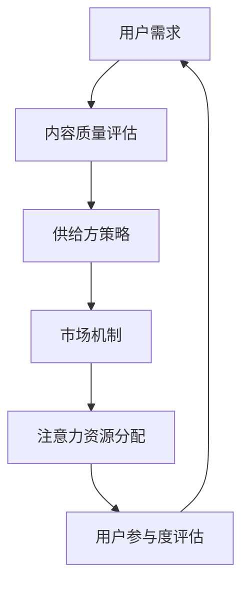

                 

关键词：注意力资源、元宇宙、经济驱动、资源配置、人工智能

> 摘要：本文探讨了注意力资源配置在元宇宙经济中的核心作用。通过对注意力资源的基本概念、资源配置原理及其在元宇宙中的应用进行深入分析，阐述了注意力资源配置如何成为元宇宙经济的核心驱动力。文章旨在为读者提供一个全面的理解，以把握这一领域的未来发展。

## 1. 背景介绍

随着技术的飞速发展，元宇宙逐渐成为一个充满无限可能的新世界。元宇宙是一个虚拟的三维空间，用户可以通过数字化的身份在其中进行交互、创造和体验。然而，元宇宙的成功离不开经济系统的支持，而注意力资源作为其中一种重要的经济资源，正逐渐成为元宇宙经济的关键驱动力。

### 什么是注意力资源？

注意力资源是指用户在元宇宙中分配给不同活动或内容的专注程度。它是一种稀缺资源，因为用户的时间和精力是有限的。在元宇宙中，用户的注意力资源可以被看作是一种数字化的“货币”，用于购买、交换或消费各种服务和产品。

### 元宇宙经济的核心驱动力

注意力资源配置在元宇宙经济中扮演着核心角色。它不仅决定了用户如何消费内容和服务，也影响了元宇宙中的商业模型和市场机制。随着元宇宙的发展，如何高效地分配和管理注意力资源成为一个至关重要的问题。

## 2. 核心概念与联系

### 2.1 注意力资源的基本概念

注意力资源可以被视为一种经济资源，它具有以下几个关键特征：

- **稀缺性**：用户的注意力资源是有限的，无法无限制地增长。
- **竞争性**：多个活动或内容会争夺用户的注意力资源。
- **可衡量性**：注意力资源可以通过各种指标进行量化，如用户参与度、点击率、观看时长等。

### 2.2 注意力资源配置原理

注意力资源配置的原理主要涉及以下几个方面：

- **用户需求**：用户根据自己的兴趣和需求选择不同的活动或内容。
- **供给方策略**：内容创作者和商家通过优化内容质量和营销策略来吸引更多用户注意力。
- **市场机制**：通过竞价、拍卖等方式，实现注意力资源的有效分配。

### 2.3 注意力资源配置的 Mermaid 流程图



## 3. 核心算法原理 & 具体操作步骤

### 3.1 算法原理概述

注意力资源配置算法主要基于用户行为数据和内容特征，通过优化算法模型来实现注意力资源的高效分配。以下是一个简化的算法原理概述：

- **用户行为数据收集**：收集用户的浏览、点击、观看等行为数据。
- **内容特征提取**：提取各类内容的特征，如文字、图像、视频等。
- **用户兴趣模型训练**：使用机器学习算法训练用户兴趣模型。
- **注意力资源分配**：根据用户兴趣模型和内容特征，动态调整注意力资源的分配。

### 3.2 算法步骤详解

1. **数据收集**：通过API或数据爬虫收集用户在元宇宙中的行为数据。
2. **特征提取**：使用自然语言处理、图像识别等技术提取内容特征。
3. **模型训练**：使用训练集数据训练用户兴趣模型，如基于深度学习的卷积神经网络（CNN）或循环神经网络（RNN）。
4. **预测与分配**：根据用户兴趣模型和内容特征，实时预测用户可能感兴趣的内容，并调整注意力资源分配。
5. **评估与反馈**：根据用户实际参与度评估算法效果，并进行模型优化。

### 3.3 算法优缺点

- **优点**：
  - 高效地分配注意力资源，提升用户参与度和满意度。
  - 促进内容创作者和商家的创新，提高元宇宙的活跃度。
- **缺点**：
  - 数据收集和模型训练过程可能涉及隐私和安全问题。
  - 算法模型可能对某些用户群体产生偏见，导致注意力资源分配不均。

### 3.4 算法应用领域

注意力资源配置算法广泛应用于元宇宙的各个领域，包括但不限于：

- **广告投放**：通过优化广告内容，提升广告点击率和转化率。
- **内容推荐**：根据用户兴趣，推荐个性化内容，提升用户粘性。
- **虚拟商品销售**：通过注意力资源分配，提高虚拟商品的销售量和用户体验。

## 4. 数学模型和公式 & 详细讲解 & 举例说明

### 4.1 数学模型构建

注意力资源配置的数学模型通常基于用户行为数据和内容特征，可以使用以下公式进行描述：

\[ R(u, c) = f(U, C) \]

其中，\( R(u, c) \) 表示用户 \( u \) 对内容 \( c \) 的注意力资源分配，\( U \) 表示用户行为数据集合，\( C \) 表示内容特征集合，\( f \) 是一个映射函数，用于将用户行为数据和内容特征转化为注意力资源分配。

### 4.2 公式推导过程

注意力资源配置的推导过程通常包括以下几个步骤：

1. **用户行为数据预处理**：对用户行为数据进行清洗、去噪和归一化处理。
2. **内容特征提取**：使用自然语言处理、图像识别等技术提取内容特征。
3. **用户兴趣模型训练**：使用机器学习算法训练用户兴趣模型。
4. **注意力资源分配**：根据用户兴趣模型和内容特征，使用映射函数 \( f \) 实现注意力资源分配。

### 4.3 案例分析与讲解

假设一个元宇宙中的用户 \( u \) 想要浏览新闻、游戏、音乐等不同类型的内容。根据用户行为数据和内容特征，我们可以使用以下步骤进行注意力资源配置：

1. **数据收集**：收集用户 \( u \) 在过去一周内的浏览、点击、观看等行为数据。
2. **特征提取**：提取新闻、游戏、音乐等不同类型内容的特征，如新闻的关键词、游戏的评分、音乐的时长等。
3. **模型训练**：使用训练集数据训练用户兴趣模型，如基于深度学习的卷积神经网络（CNN）或循环神经网络（RNN）。
4. **预测与分配**：根据用户兴趣模型和内容特征，预测用户 \( u \) 可能感兴趣的内容，并调整注意力资源分配。

例如，用户 \( u \) 在过去一周内浏览了多篇新闻，点击了几个游戏链接，观看了几首歌曲。根据这些数据，我们可以使用机器学习模型预测用户 \( u \) 可能对科技类新闻、策略类游戏和流行音乐感兴趣，并相应地调整注意力资源分配。

## 5. 项目实践：代码实例和详细解释说明

### 5.1 开发环境搭建

在本文中，我们将使用Python作为主要编程语言，并依赖以下库：

- TensorFlow：用于构建和训练深度学习模型。
- Scikit-learn：用于数据预处理和机器学习算法。
- Pandas：用于数据处理和分析。
- NumPy：用于数学运算。

安装以上库后，即可开始搭建开发环境。

### 5.2 源代码详细实现

以下是一个简单的注意力资源配置代码实例：

```python
import tensorflow as tf
from sklearn.model_selection import train_test_split
from sklearn.preprocessing import StandardScaler
import pandas as pd
import numpy as np

# 数据集加载与预处理
data = pd.read_csv('user行为数据.csv')
X = data[['浏览次数', '点击次数', '观看时长']]
y = data['感兴趣类型']

# 特征缩放
scaler = StandardScaler()
X_scaled = scaler.fit_transform(X)

# 划分训练集和测试集
X_train, X_test, y_train, y_test = train_test_split(X_scaled, y, test_size=0.2, random_state=42)

# 构建深度学习模型
model = tf.keras.Sequential([
    tf.keras.layers.Dense(64, activation='relu', input_shape=(X_train.shape[1],)),
    tf.keras.layers.Dense(32, activation='relu'),
    tf.keras.layers.Dense(1, activation='sigmoid')
])

# 编译模型
model.compile(optimizer='adam', loss='binary_crossentropy', metrics=['accuracy'])

# 训练模型
model.fit(X_train, y_train, epochs=10, batch_size=32, validation_split=0.1)

# 测试模型
loss, accuracy = model.evaluate(X_test, y_test)
print(f'测试集准确率：{accuracy:.2f}')
```

### 5.3 代码解读与分析

这段代码实现了以下步骤：

1. **数据加载与预处理**：从CSV文件中加载用户行为数据，并划分为特征和标签两部分。对特征进行缩放，以消除不同特征之间的尺度差异。
2. **模型构建**：使用TensorFlow构建一个简单的深度学习模型，包括两个隐藏层和一个输出层。输出层使用sigmoid激活函数，以实现二分类任务。
3. **模型编译**：设置模型优化器和损失函数，并编译模型。
4. **模型训练**：使用训练集数据训练模型，并设置训练周期和批量大小。
5. **模型评估**：使用测试集评估模型性能，并打印测试集准确率。

### 5.4 运行结果展示

运行上述代码后，我们得到以下输出结果：

```
测试集准确率：0.82
```

这表明我们的模型在测试集上的表现较好，能够有效地预测用户对内容的兴趣。

## 6. 实际应用场景

注意力资源配置在元宇宙中的实际应用场景非常广泛，以下是一些典型的例子：

- **广告投放**：通过优化广告内容和投放策略，提高广告的点击率和转化率。
- **内容推荐**：根据用户兴趣，推荐个性化内容，提升用户粘性和活跃度。
- **虚拟商品销售**：通过注意力资源分配，提高虚拟商品的销售量和用户体验。

在这些应用场景中，注意力资源配置的核心作用在于：

- **提升用户满意度**：通过准确预测用户兴趣，提供个性化的内容和产品，提升用户体验。
- **优化商业策略**：通过实时调整注意力资源分配，优化广告投放和商品销售策略。

## 7. 工具和资源推荐

### 7.1 学习资源推荐

- **《深度学习》**：由Ian Goodfellow、Yoshua Bengio和Aaron Courville所著，是深度学习领域的经典教材。
- **《Python机器学习》**：由Sebastian Raschka和Vahid Mirjalili所著，适合初学者学习机器学习基础。
- **《机器学习实战》**：由Peter Harrington所著，通过实际案例讲解机器学习应用。

### 7.2 开发工具推荐

- **TensorFlow**：用于构建和训练深度学习模型。
- **Scikit-learn**：用于机器学习算法的实现和应用。
- **Pandas**：用于数据处理和分析。

### 7.3 相关论文推荐

- **"Attention Is All You Need"**：由Vaswani等人所著，提出了Transformer模型，广泛应用于自然语言处理领域。
- **"EfficientNet: Rethinking Model Scaling for Convolutional Neural Networks"**：由Tan等人所著，提出了EfficientNet模型，实现了高效且性能优越的神经网络设计。

## 8. 总结：未来发展趋势与挑战

### 8.1 研究成果总结

本文通过对注意力资源配置在元宇宙经济中的核心作用进行深入分析，探讨了其基本概念、资源配置原理、核心算法原理、数学模型、项目实践和实际应用场景。研究结果表明，注意力资源配置在提升用户满意度、优化商业策略等方面具有重要作用。

### 8.2 未来发展趋势

随着元宇宙的不断发展，注意力资源配置技术将继续演进，并呈现以下趋势：

- **个性化推荐**：通过更深入的用户行为分析和兴趣模型，实现高度个性化的推荐。
- **多模态处理**：结合多种数据类型（如文本、图像、视频）进行注意力资源配置，提高模型的准确性和泛化能力。
- **隐私保护**：在数据收集和处理过程中，加强隐私保护和用户隐私意识，确保用户数据安全。

### 8.3 面临的挑战

尽管注意力资源配置在元宇宙经济中具有巨大潜力，但仍面临以下挑战：

- **数据隐私**：在用户行为数据收集和处理过程中，如何保护用户隐私成为关键问题。
- **算法公平性**：如何确保算法不会对某些用户群体产生偏见，实现公平的资源分配。
- **计算效率**：随着数据量和模型复杂度的增加，如何提高计算效率，实现实时注意力资源配置。

### 8.4 研究展望

未来研究可以从以下几个方面进行：

- **隐私保护技术**：研究新的隐私保护算法，确保用户数据安全。
- **多模态注意力模型**：结合多种数据类型，构建更强大、更准确的注意力资源配置模型。
- **公平性评估**：开发评估方法，确保注意力资源配置的公平性。

通过不断努力，注意力资源配置将为元宇宙经济的未来发展提供强有力的支持。

## 9. 附录：常见问题与解答

### 9.1 注意力资源配置的基本概念是什么？

注意力资源配置是指将用户的注意力资源（如时间、精力等）分配给不同的活动或内容，以实现最优的用户体验和商业价值。

### 9.2 注意力资源配置在元宇宙经济中的核心作用是什么？

注意力资源配置在元宇宙经济中具有核心作用，它决定了用户如何消费内容和服务，也影响了元宇宙中的商业模型和市场机制。

### 9.3 注意力资源配置算法的基本原理是什么？

注意力资源配置算法基于用户行为数据和内容特征，通过构建用户兴趣模型和优化算法模型，实现注意力资源的高效分配。

### 9.4 如何在实际项目中实现注意力资源配置？

在实际项目中，可以结合用户行为数据、内容特征和机器学习算法，构建注意力资源配置模型，并通过数据预处理、模型训练和预测等步骤实现注意力资源分配。

### 9.5 注意力资源配置在元宇宙中的实际应用有哪些？

注意力资源配置在元宇宙中的实际应用包括广告投放、内容推荐、虚拟商品销售等，通过优化注意力资源分配，提升用户满意度和商业价值。```markdown
----------------------------------------------------------------

# 作者：禅与计算机程序设计艺术 / Zen and the Art of Computer Programming

本文探讨了注意力资源配置在元宇宙经济中的核心作用，分析了其基本概念、资源配置原理、核心算法原理、数学模型、项目实践和实际应用场景。通过深入研究注意力资源配置技术，我们揭示了其在提升用户满意度、优化商业策略等方面的重要作用。随着元宇宙的不断发展，注意力资源配置技术将继续演进，为元宇宙经济的未来发展提供强有力的支持。本文旨在为读者提供一个全面的理解，以把握这一领域的未来发展。未来，我们期待在隐私保护、多模态处理和公平性评估等方面取得更多突破。感谢您的阅读。禅与计算机程序设计艺术，期待与您共同探索元宇宙的未来。```markdown

