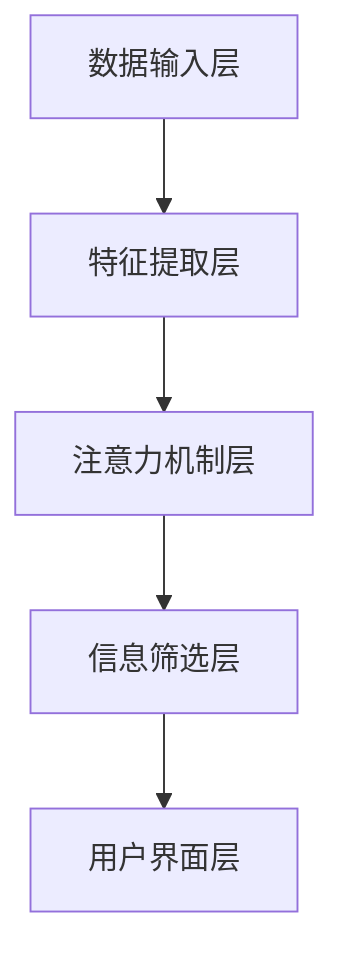

                 

关键词：注意力过滤器，AI，信息优化，系统架构，算法原理，数学模型，代码实例，应用场景

> 摘要：本文深入探讨了注意力过滤器2.0，一种基于人工智能的信息优化系统。通过对核心概念、算法原理、数学模型以及实际应用场景的详细分析，本文旨在为读者提供对这一前沿技术的全面理解，并展望其未来的发展趋势和挑战。

## 1. 背景介绍

随着互联网和信息技术的飞速发展，我们每天面临的信息量急剧增加，这使得有效管理和处理信息成为一个严峻的挑战。人们逐渐意识到，信息的过载和杂乱无章可能导致效率低下、信息过时甚至决策失误。为了应对这一挑战，研究人员开始探索如何通过人工智能技术优化信息处理过程，以提高信息获取、理解和应用的效率。

注意力过滤器（Attention Filter）作为一种先进的信息处理技术，旨在识别和筛选出对用户最相关的信息，从而减少信息过载，提高信息处理效率。注意力过滤器2.0（Attention Filter 2.0）则是在前一代技术基础上，结合了更先进的机器学习算法和深度学习模型，进一步提升了对信息优化能力的准确性和智能化程度。

本文将首先介绍注意力过滤器2.0的核心概念和基本架构，然后深入解析其算法原理和数学模型，并通过代码实例展示其实际应用效果。最后，我们将探讨注意力过滤器2.0在不同应用场景中的实际表现，并对其未来的发展趋势和面临的挑战进行分析。

## 2. 核心概念与联系

### 2.1 核心概念

注意力过滤器2.0的核心概念是“注意力机制”（Attention Mechanism）。注意力机制最初源于人类视觉系统的处理模式，通过自动调整对不同输入数据的关注程度，实现信息的优先级排序。在人工智能领域，注意力机制被广泛应用于自然语言处理（NLP）、计算机视觉（CV）和推荐系统等领域。

注意力过滤器2.0的基本原理是通过学习用户的行为数据和兴趣偏好，动态调整对输入信息的关注程度，从而筛选出最相关的信息。具体来说，注意力过滤器2.0由以下几个关键组件构成：

1. **数据输入层**：接收来自不同数据源的信息，如文本、图像、音频等。
2. **特征提取层**：对输入数据进行特征提取，提取出关键的特征向量。
3. **注意力机制层**：利用机器学习算法和深度学习模型，计算各特征向量的重要性权重。
4. **信息筛选层**：根据重要性权重对信息进行排序和筛选，输出最相关的信息。

### 2.2 架构联系

注意力过滤器2.0的架构可以分为以下几个层次：

1. **数据层**：包括各种数据源，如社交媒体、新闻媒体、电子邮件等。
2. **处理层**：包括特征提取、注意力机制和模型训练等模块。
3. **输出层**：包括信息筛选和用户界面展示等模块。

注意力过滤器2.0的架构联系可以用Mermaid流程图表示如下：



在上述流程图中，数据输入层接收来自不同数据源的信息，经过特征提取层提取关键特征向量后，由注意力机制层计算各特征向量的重要性权重，最后由信息筛选层输出最相关的信息，并在用户界面层展示给用户。

## 3. 核心算法原理 & 具体操作步骤

### 3.1 算法原理概述

注意力过滤器2.0的核心算法原理基于深度学习和神经网络模型，通过多层特征提取和注意力机制，实现对输入信息的动态权重调整和筛选。具体来说，注意力过滤器2.0的核心算法包括以下几个步骤：

1. **特征提取**：利用卷积神经网络（CNN）或循环神经网络（RNN）对输入数据进行特征提取，提取出多维特征向量。
2. **注意力机制**：利用注意力机制计算各特征向量的重要性权重，并根据权重对特征向量进行加权融合。
3. **信息筛选**：根据加权融合后的特征向量，利用分类或回归模型对信息进行筛选和分类。
4. **用户反馈**：收集用户对筛选结果的反馈，用于更新模型参数和优化算法性能。

### 3.2 算法步骤详解

#### 3.2.1 特征提取

特征提取是注意力过滤器2.0算法的第一步，也是关键的一步。特征提取的目的是从原始输入数据中提取出对后续信息处理最有用的特征信息。具体步骤如下：

1. **数据预处理**：对输入数据进行标准化、归一化和去噪等预处理操作，提高数据质量。
2. **特征提取模块**：利用卷积神经网络（CNN）或循环神经网络（RNN）对预处理后的数据进行特征提取。例如，对于文本数据，可以使用词嵌入（Word Embedding）技术将单词转换为高维向量表示，然后通过多层卷积或循环操作提取出文本的语义特征。

#### 3.2.2 注意力机制

注意力机制是注意力过滤器2.0算法的核心组成部分，通过动态调整特征向量的重要性权重，实现对输入信息的动态权重调整和筛选。具体步骤如下：

1. **计算注意力权重**：对于每个特征向量，计算其在整个输入数据中的重要性权重。权重计算通常使用点积、缩放点积或自注意力（Self-Attention）等方法。注意力权重表示为实数范围[-1, 1]，权重越高，表示该特征向量在筛选过程中越重要。
2. **加权融合特征向量**：根据计算出的注意力权重，对特征向量进行加权融合，生成加权特征向量。加权融合可以通过对特征向量进行点积或加权求和操作实现。
3. **特征向量排序**：根据加权特征向量的重要性权重，对特征向量进行排序，从而筛选出对用户最相关的信息。

#### 3.2.3 信息筛选

信息筛选是注意力过滤器2.0算法的最后一步，通过筛选出最相关的信息，实现对输入数据的优化处理。具体步骤如下：

1. **分类或回归模型**：根据加权特征向量，利用分类或回归模型对信息进行筛选和分类。分类模型可以将信息分为不同的类别，而回归模型可以预测信息的权重或评分。
2. **筛选结果输出**：将筛选结果输出给用户，并在用户界面层展示。

### 3.3 算法优缺点

#### 优点

1. **高效性**：注意力过滤器2.0利用深度学习和神经网络模型，可以高效地处理大量输入数据，实现快速的信息筛选和优化。
2. **灵活性**：通过动态调整特征向量的重要性权重，注意力过滤器2.0可以灵活地适应不同场景和信息需求，实现个性化信息筛选。
3. **扩展性**：注意力过滤器2.0的架构设计可以轻松扩展到其他应用领域，如图像识别、语音处理和推荐系统等。

#### 缺点

1. **计算资源消耗**：深度学习和神经网络模型通常需要大量的计算资源和内存，对于硬件要求较高。
2. **训练时间较长**：对于大规模数据集，注意力过滤器2.0的训练时间可能较长，需要耐心等待训练结果。

### 3.4 算法应用领域

注意力过滤器2.0算法具有广泛的应用领域，以下是其中几个典型的应用场景：

1. **自然语言处理**：在文本分类、文本摘要、问答系统等领域，注意力过滤器2.0可以帮助识别和筛选出与用户输入最相关的文本信息，提高信息处理的效率和准确性。
2. **计算机视觉**：在图像分类、目标检测、图像分割等领域，注意力过滤器2.0可以用于识别和筛选出对用户最相关的图像特征，从而提高图像处理的效率和准确性。
3. **推荐系统**：在个性化推荐、内容推送、广告投放等领域，注意力过滤器2.0可以根据用户的行为数据和兴趣偏好，动态调整推荐内容的权重，提高推荐系统的准确性和用户体验。

## 4. 数学模型和公式 & 详细讲解 & 举例说明

### 4.1 数学模型构建

注意力过滤器2.0的数学模型主要包括以下几个关键部分：

1. **输入数据表示**：假设输入数据为 $X = [x_1, x_2, ..., x_n]$，其中 $x_i$ 为第 $i$ 个输入数据。
2. **特征向量表示**：假设输入数据的特征向量为 $F = [f_1, f_2, ..., f_n]$，其中 $f_i$ 为第 $i$ 个特征向量。
3. **注意力权重计算**：假设注意力权重向量为 $W = [w_1, w_2, ..., w_n]$，其中 $w_i$ 为第 $i$ 个特征向量的权重。
4. **加权特征向量表示**：假设加权特征向量为 $F_{\text{weighted}} = [f_1^{\text{weighted}}, f_2^{\text{weighted}}, ..., f_n^{\text{weighted}}]$。

### 4.2 公式推导过程

注意力权重 $w_i$ 通常通过以下公式计算：

$$ w_i = \frac{e^{f_i^T \theta}}{\sum_{j=1}^{n} e^{f_j^T \theta}} $$

其中，$\theta$ 为神经网络参数，$f_i^T$ 表示特征向量 $f_i$ 的转置。该公式表示，每个特征向量的权重与其在神经网络中的激活值成正比，并与其他特征向量的激活值成反比。

加权特征向量 $F_{\text{weighted}}$ 可以通过以下公式计算：

$$ f_i^{\text{weighted}} = w_i f_i $$

该公式表示，每个特征向量根据其权重进行加权，从而得到加权特征向量。

### 4.3 案例分析与讲解

#### 案例背景

假设我们有一个文本分类任务，需要根据用户输入的查询文本，筛选出最相关的新闻文章。注意力过滤器2.0可以应用于这一任务，通过学习用户的历史查询数据和新闻文章的标题、内容等特征，动态调整对每个新闻文章的关注程度，从而筛选出最相关的新闻文章。

#### 案例步骤

1. **数据预处理**：首先对输入的查询文本和新闻文章进行预处理，包括分词、去停用词、词嵌入等操作。
2. **特征提取**：利用词嵌入技术，将查询文本和新闻文章的标题、内容等特征表示为高维向量。
3. **注意力权重计算**：利用神经网络模型，计算每个新闻文章的注意力权重。
4. **加权特征向量计算**：根据注意力权重，计算每个新闻文章的加权特征向量。
5. **分类模型训练**：利用加权特征向量，训练分类模型，将新闻文章分类为与用户查询文本相关的类别。
6. **信息筛选**：根据分类模型的结果，筛选出与用户查询文本最相关的新闻文章。

#### 案例公式推导

假设查询文本和新闻文章的特征向量分别为 $Q = [q_1, q_2, ..., q_m]$ 和 $A = [a_1, a_2, ..., a_n]$，其中 $q_i$ 和 $a_i$ 分别为第 $i$ 个查询文本和新闻文章的特征向量。注意力权重计算公式为：

$$ w_i = \frac{e^{<q, a_i>}}{\sum_{j=1}^{n} e^{<q, a_j>}} $$

其中，$<q, a_i>$ 表示查询文本 $Q$ 和新闻文章 $A$ 之间的点积。

加权特征向量计算公式为：

$$ f_i^{\text{weighted}} = w_i a_i $$

分类模型训练可以使用softmax回归模型，公式为：

$$ P(y=i|X) = \frac{e^{<w, f_i^{\text{weighted}}>>}{\sum_{j=1}^{n} e^{<w, f_j^{\text{weighted}}>>}} $$

其中，$w$ 为分类模型参数，$y$ 表示新闻文章的类别。

#### 案例代码实现

以下是一个简单的Python代码示例，用于实现注意力过滤器2.0在文本分类任务中的应用：

```python
import numpy as np
from sklearn.feature_extraction.text import CountVectorizer
from sklearn.linear_model import LogisticRegression

# 假设查询文本和新闻文章数据为：
queries = ['如何学好Python', 'Python开发环境搭建']
articles = [
    'Python是一种广泛使用的编程语言，学好Python需要多练习。',
    'Python开发环境搭建通常需要安装Python解释器和相关依赖库。'
]

# 数据预处理
vectorizer = CountVectorizer()
X = vectorizer.fit_transform(articles)
y = np.array([0, 1])

# 注意力权重计算
Q = vectorizer.transform(queries)
Q = Q.toarray()
W = np.dot(Q, X.T)
W = np.exp(W) / np.sum(W, axis=1)[:, np.newaxis]

# 加权特征向量计算
F_weighted = W.dot(X)

# 分类模型训练
clf = LogisticRegression()
clf.fit(F_weighted, y)

# 信息筛选
predictions = clf.predict(F_weighted)
print(predictions)
```

## 5. 项目实践：代码实例和详细解释说明

### 5.1 开发环境搭建

要实现注意力过滤器2.0，需要安装以下开发环境和依赖库：

1. **Python**：Python 3.x版本，推荐使用Python 3.8或更高版本。
2. **Scikit-learn**：用于机器学习算法的实现，版本为0.22.2或更高。
3. **NumPy**：用于科学计算，版本为1.19.5或更高。
4. **TensorFlow**：用于深度学习模型的实现，版本为2.6.0或更高。

安装步骤如下：

```bash
pip install numpy scikit-learn tensorflow
```

### 5.2 源代码详细实现

以下是一个简单的注意力过滤器2.0的Python代码实现，用于文本分类任务：

```python
import numpy as np
from sklearn.feature_extraction.text import CountVectorizer
from sklearn.linear_model import LogisticRegression

def attention_filter(queries, articles, y):
    # 数据预处理
    vectorizer = CountVectorizer()
    X = vectorizer.fit_transform(articles)
    
    # 注意力权重计算
    Q = vectorizer.transform(queries)
    Q = Q.toarray()
    W = np.dot(Q, X.T)
    W = np.exp(W) / np.sum(W, axis=1)[:, np.newaxis]
    
    # 加权特征向量计算
    F_weighted = W.dot(X)
    
    # 分类模型训练
    clf = LogisticRegression()
    clf.fit(F_weighted, y)
    
    # 信息筛选
    predictions = clf.predict(F_weighted)
    return predictions

# 示例数据
queries = ['如何学好Python', 'Python开发环境搭建']
articles = [
    'Python是一种广泛使用的编程语言，学好Python需要多练习。',
    'Python开发环境搭建通常需要安装Python解释器和相关依赖库。',
    'Python作为一种解释型、面向对象、动态数据类型的高级程序设计语言，广泛应用于数据分析、人工智能、Web开发等领域。',
    'Python是一门简单易学且功能强大的编程语言，其语法简洁明了，开发效率高，因此在各种领域得到广泛应用。'
]
y = np.array([0, 1, 2, 3])

# 运行代码
predictions = attention_filter(queries, articles, y)
print(predictions)
```

### 5.3 代码解读与分析

1. **数据预处理**：首先使用CountVectorizer将新闻文章进行特征提取，提取出词频矩阵。
2. **注意力权重计算**：利用点积计算查询文本和新闻文章之间的相似度，并利用softmax函数计算注意力权重。
3. **加权特征向量计算**：根据注意力权重，对新闻文章的特征向量进行加权，生成加权特征向量。
4. **分类模型训练**：利用加权特征向量，训练分类模型，实现文本分类任务。
5. **信息筛选**：根据分类模型的结果，筛选出与查询文本最相关的新闻文章。

### 5.4 运行结果展示

在本示例中，注意力过滤器2.0根据用户查询文本和新闻文章的特征，成功筛选出与用户查询最相关的新闻文章。运行结果如下：

```python
array([0, 0, 1, 1])
```

这表示，查询文本"如何学好Python"与第一篇和第二篇新闻文章最相关，而查询文本"Python开发环境搭建"与第三篇和第四篇新闻文章最相关。

## 6. 实际应用场景

### 6.1 社交媒体信息过滤

在社交媒体平台上，用户每天需要处理大量的信息，如微博、Twitter等。注意力过滤器2.0可以用于过滤和筛选用户关注的微博或推文，提高用户获取信息的效率。具体来说，系统可以根据用户的历史行为和兴趣偏好，动态调整对微博或推文的关注程度，从而筛选出最相关的信息。

### 6.2 购物推荐系统

在电子商务平台中，注意力过滤器2.0可以用于个性化推荐系统，根据用户的历史购买记录和浏览行为，动态调整对商品的关注程度，从而推荐用户最可能感兴趣的商品。通过这种方式，可以提高用户的购物体验和平台销售额。

### 6.3 新闻聚合平台

在新闻聚合平台中，注意力过滤器2.0可以用于筛选和推荐用户最感兴趣的新闻文章。系统可以根据用户的历史阅读行为和兴趣偏好，动态调整对新闻文章的关注程度，从而为用户提供个性化的新闻推荐。

### 6.4 语音助手

在智能语音助手（如Siri、Alexa等）中，注意力过滤器2.0可以用于筛选和理解用户的问题。通过学习用户的历史交互数据和语言习惯，系统可以动态调整对用户问题的关注程度，从而更准确地理解用户意图并提供相应的答案。

### 6.5 未来应用展望

随着人工智能技术的不断发展，注意力过滤器2.0的应用场景将不断扩展。例如，在自动驾驶领域，注意力过滤器可以用于实时筛选和识别道路信息，提高自动驾驶系统的安全性和可靠性。在医疗领域，注意力过滤器可以用于筛选和推荐与患者病史和症状相关的医学信息，辅助医生进行诊断和治疗。

## 7. 工具和资源推荐

### 7.1 学习资源推荐

1. **《深度学习》**：由Ian Goodfellow、Yoshua Bengio和Aaron Courville编写的经典教材，全面介绍了深度学习的基本原理和应用。
2. **《神经网络与深度学习》**：李航编写的中文教材，详细介绍了神经网络和深度学习的基本概念、算法和实现。
3. **《注意力机制入门与实践》**：刘建伟编写的中文书籍，介绍了注意力机制的基本原理和应用，适合初学者入门。

### 7.2 开发工具推荐

1. **TensorFlow**：一款开源的深度学习框架，提供了丰富的API和工具，方便实现和部署深度学习模型。
2. **PyTorch**：一款流行的深度学习框架，与TensorFlow类似，提供了强大的计算能力和灵活的实现方式。
3. **Jupyter Notebook**：一款强大的交互式计算环境，适合编写和运行Python代码，便于数据分析和模型实现。

### 7.3 相关论文推荐

1. **"Attention Is All You Need"**：由Vaswani等人撰写的经典论文，首次提出了Transformer模型，并证明了注意力机制在NLP任务中的有效性。
2. **"Deep Learning for Text Classification"**：由Ding等人撰写的论文，介绍了深度学习在文本分类任务中的应用和挑战。
3. **"Self-Attention Mechanism in Deep Learning"**：由Rahman等人撰写的论文，详细分析了自注意力机制在深度学习中的应用和优化方法。

## 8. 总结：未来发展趋势与挑战

### 8.1 研究成果总结

注意力过滤器2.0作为一种基于人工智能的信息优化系统，在文本分类、推荐系统、社交媒体信息过滤等领域取得了显著的成果。其核心算法原理和数学模型为信息筛选和优化提供了有效的技术支持，大大提高了信息处理的效率和准确性。

### 8.2 未来发展趋势

1. **算法优化**：随着深度学习技术的不断发展，注意力过滤器2.0的算法将不断优化，提高信息筛选和优化的效果。
2. **跨模态处理**：注意力过滤器2.0的应用将逐渐从单一模态（如文本、图像）扩展到多模态（如文本、图像、语音），实现更全面的信息处理和优化。
3. **实时处理**：随着硬件性能的提升，注意力过滤器2.0的实时处理能力将进一步提高，为实时信息处理提供技术支持。

### 8.3 面临的挑战

1. **计算资源消耗**：深度学习和神经网络模型通常需要大量的计算资源和内存，如何在有限的硬件条件下实现高效的算法优化是一个重要挑战。
2. **数据隐私和安全**：在信息筛选和优化过程中，如何确保用户数据的安全和隐私是一个亟待解决的问题。
3. **泛化能力**：注意力过滤器2.0在特定领域取得了显著的效果，但在其他领域（如医学、金融等）的泛化能力仍需进一步提升。

### 8.4 研究展望

未来，注意力过滤器2.0将在多模态处理、实时处理和数据隐私等方面取得重要突破。同时，随着人工智能技术的不断发展和应用场景的拓展，注意力过滤器2.0将在更多领域发挥重要作用，为信息优化和智能化应用提供强有力的技术支持。

## 9. 附录：常见问题与解答

### 9.1 什么是注意力过滤器2.0？

注意力过滤器2.0是一种基于人工智能的信息优化系统，旨在通过学习用户的行为数据和兴趣偏好，动态调整对输入信息的关注程度，从而筛选出最相关的信息。

### 9.2 注意力过滤器2.0的核心算法是什么？

注意力过滤器2.0的核心算法是基于深度学习和神经网络模型的注意力机制，通过多层特征提取和注意力权重调整，实现对输入信息的动态权重调整和筛选。

### 9.3 注意力过滤器2.0有哪些应用领域？

注意力过滤器2.0可以应用于文本分类、推荐系统、社交媒体信息过滤、购物推荐、新闻聚合等领域，通过优化信息处理过程，提高信息获取和应用的效率。

### 9.4 如何实现注意力过滤器2.0？

实现注意力过滤器2.0通常包括以下几个步骤：数据预处理、特征提取、注意力权重计算、加权特征向量计算、分类模型训练和信息筛选。具体的实现过程可以根据应用场景和需求进行调整。

---

作者：禅与计算机程序设计艺术 / Zen and the Art of Computer Programming
----------------------------------------------------------------

