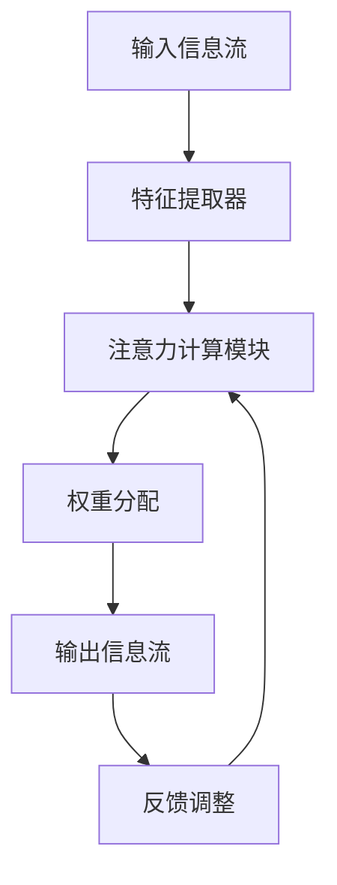

                 

在当今信息爆炸的时代，我们每天都需要处理大量的数据和信息。如何有效地筛选和优化这些信息，以帮助我们更高效地学习和工作，成为了亟待解决的问题。本文将介绍一种基于人工智能技术的解决方案——注意力过滤器调音师（Attention Filter Tuner），它能够帮助我们更好地管理信息流，提高信息处理的效率。

## 文章关键词

- 注意力过滤器
- 信息优化
- 人工智能
- 信息流管理
- 数据筛选

## 文章摘要

本文将探讨如何利用人工智能技术构建注意力过滤器调音师，以实现信息流的有效管理和优化。文章首先介绍了注意力过滤器的核心概念和原理，然后详细阐述了注意力过滤器调音师的工作机制和算法实现。接下来，通过具体的应用案例，展示了注意力过滤器调音师在实际场景中的效果。最后，文章对未来的研究方向和应用前景进行了展望。

## 1. 背景介绍

随着互联网和移动设备的普及，我们每天都会接收到海量的信息。这些信息包括新闻、社交媒体更新、电子邮件、通知等。如何从中筛选出对我们有用的信息，成为了当前信息处理领域的一个重要课题。传统的信息筛选方法通常依赖于关键词匹配、分类算法等，但这些方法往往无法完全满足用户的需求，容易出现信息过载或者信息遗漏的情况。

为了解决这一问题，人工智能技术提供了新的可能性。特别是注意力机制（Attention Mechanism）在自然语言处理（NLP）和计算机视觉（CV）等领域取得了显著成果。注意力机制能够帮助模型在处理信息时，动态地关注关键信息，从而提高信息处理的效率和准确性。

基于此，本文提出了注意力过滤器调音师这一概念，旨在通过人工智能技术，实现信息流的有效管理和优化。注意力过滤器调音师能够根据用户的兴趣和行为习惯，动态调整注意力焦点，从而筛选出最有价值的信息。

### 1.1 注意力机制在信息筛选中的应用

注意力机制最早在机器翻译领域得到应用，随后在计算机视觉、语音识别等领域也得到了广泛的研究。注意力机制的核心思想是通过一种动态的权重分配方式，让模型在处理信息时，能够更加关注关键信息，从而提高任务的性能。

在信息筛选任务中，注意力机制可以帮助我们识别出用户最感兴趣的信息。例如，在一个新闻推荐系统中，注意力机制可以分析用户的历史浏览记录和搜索偏好，动态调整新闻推荐的权重，从而提高推荐系统的准确性和用户体验。

### 1.2 人工智能在信息处理中的优势

人工智能技术在信息处理中具有以下优势：

- **自适应性和灵活性**：人工智能系统可以根据用户的兴趣和行为习惯，动态调整信息筛选策略，从而实现个性化的信息推荐。
- **高效性和准确性**：通过深度学习和强化学习等先进算法，人工智能系统可以在海量数据中快速、准确地识别出有价值的信息。
- **可扩展性**：人工智能系统可以轻松地扩展到多个领域和任务，实现跨领域的知识共享和复用。

综上所述，利用人工智能技术构建注意力过滤器调音师，可以实现信息流的有效管理和优化，为用户提供更加个性化和高效的信息服务。

## 2. 核心概念与联系

### 2.1 注意力过滤器

注意力过滤器是一种基于注意力机制的算法，它能够根据用户的需求和兴趣，动态调整信息流的权重分配，从而筛选出最有价值的信息。注意力过滤器通常包括以下几个核心组成部分：

- **输入信息流**：输入信息流是注意力过滤器的处理对象，包括各种类型的信息，如文本、图像、视频等。
- **特征提取器**：特征提取器负责从输入信息流中提取关键特征，这些特征将用于后续的注意力计算。
- **注意力计算模块**：注意力计算模块是注意力过滤器的核心部分，它通过计算信息之间的相关性，动态调整信息流的权重。
- **输出信息流**：输出信息流是经过注意力过滤器处理后的信息流，它根据注意力权重分配，筛选出最有价值的信息。

### 2.2 注意力过滤器的工作原理

注意力过滤器的工作原理可以分为以下几个步骤：

1. **特征提取**：首先，注意力过滤器从输入信息流中提取关键特征。这些特征可以是文本的词频、图像的颜色分布、视频的帧内容等。
2. **计算相似性**：接着，注意力计算模块计算输入信息之间的相似性。相似性可以通过各种距离度量或者相似度计算方法获得，如余弦相似度、欧氏距离等。
3. **权重分配**：根据相似性计算结果，注意力计算模块动态调整信息流的权重。权重高的信息将被赋予更高的关注度，而权重低的信息则可能被忽略。
4. **信息筛选**：最后，根据权重分配结果，注意力过滤器筛选出最有价值的信息，形成输出信息流。

### 2.3 注意力过滤器调音师

注意力过滤器调音师是一种基于人工智能技术的注意力过滤器优化工具，它能够根据用户的需求和反馈，动态调整注意力过滤器的参数和策略，从而提高信息筛选的准确性和效率。注意力过滤器调音师的主要功能包括：

- **参数调整**：注意力过滤器调音师可以根据用户的需求，自动调整注意力计算模块的参数，如相似性度量方法、权重分配策略等。
- **策略优化**：注意力过滤器调音师可以通过机器学习算法，不断优化注意力过滤器的策略，提高信息筛选的准确性。
- **反馈调整**：注意力过滤器调音师可以收集用户的反馈信息，如信息点击率、停留时间等，根据反馈动态调整注意力权重分配，提高用户满意度。

### 2.4 Mermaid 流程图

为了更直观地展示注意力过滤器调音师的工作流程，下面给出一个Mermaid流程图：



在该流程图中，输入信息流经过特征提取器提取关键特征，然后由注意力计算模块计算信息之间的相似性，并根据相似性动态调整信息流的权重。最终，经过权重分配后的信息流被输出，并根据用户反馈进行反馈调整，以不断提高注意力过滤器的性能。

## 3. 核心算法原理 & 具体操作步骤

### 3.1 算法原理概述

注意力过滤器调音师的核心算法原理是基于深度学习和强化学习技术。深度学习用于特征提取和注意力计算，强化学习用于参数调整和策略优化。具体来说，注意力过滤器调音师的工作流程可以分为以下几个步骤：

1. **特征提取**：利用深度神经网络提取输入信息的关键特征。
2. **注意力计算**：通过计算特征之间的相似性，动态调整信息流的权重。
3. **权重分配**：根据注意力权重分配结果，筛选出最有价值的信息。
4. **参数调整**：利用强化学习算法，根据用户反馈动态调整注意力过滤器的参数。
5. **策略优化**：通过不断优化注意力计算模块的策略，提高信息筛选的准确性。

### 3.2 算法步骤详解

#### 3.2.1 特征提取

特征提取是注意力过滤器调音师的第一步，其目的是从输入信息中提取关键特征。深度神经网络是实现这一目标的有效工具。具体来说，可以采用卷积神经网络（CNN）处理图像特征，采用循环神经网络（RNN）处理文本特征。通过训练深度神经网络，可以提取出输入信息的高层次抽象特征，这些特征将用于后续的注意力计算。

#### 3.2.2 注意力计算

注意力计算是注意力过滤器调音师的核心环节，其目的是根据输入信息的关键特征，动态调整信息流的权重。常用的注意力计算方法包括基于点积的注意力、基于加权的注意力等。在计算过程中，可以通过调整注意力权重，实现信息流的有效筛选。

#### 3.2.3 权重分配

权重分配是根据注意力计算结果，对信息流进行权重分配。具体来说，可以根据注意力权重对信息进行排序，然后按照排序结果，将信息流划分为高价值、中价值和低价值信息。高价值信息将被优先展示，而低价值信息可能被过滤掉。

#### 3.2.4 参数调整

参数调整是利用强化学习算法，根据用户反馈动态调整注意力过滤器的参数。在强化学习过程中，通过学习用户的点击行为、停留时间等反馈信息，不断优化注意力过滤器的权重分配策略。常见的强化学习算法包括Q-Learning、Deep Q-Network（DQN）等。

#### 3.2.5 策略优化

策略优化是通过优化注意力计算模块的策略，提高信息筛选的准确性。在策略优化过程中，可以通过调整注意力权重分配策略、特征提取策略等，提高信息筛选的效率和准确性。常见的策略优化算法包括遗传算法、粒子群优化算法等。

### 3.3 算法优缺点

#### 3.3.1 优点

- **自适应性强**：注意力过滤器调音师可以根据用户的需求和反馈，动态调整信息筛选策略，实现个性化信息推荐。
- **高效性**：利用深度学习和强化学习技术，注意力过滤器调音师能够在海量数据中快速、准确地筛选出有价值的信息。
- **灵活性**：注意力过滤器调音师可以适应不同的信息处理任务，实现跨领域的知识共享和复用。

#### 3.3.2 缺点

- **计算成本高**：深度学习和强化学习算法通常需要大量的计算资源和时间，这在一定程度上增加了系统的部署和运行成本。
- **数据依赖性强**：注意力过滤器调音师的效果很大程度上依赖于用户行为数据的质量和数量，如果数据质量较差，可能会导致信息筛选不准确。

### 3.4 算法应用领域

注意力过滤器调音师可以应用于多个领域，包括但不限于：

- **信息推荐**：在电子商务、新闻推荐、社交媒体等领域，注意力过滤器调音师可以帮助用户筛选出最有价值的信息，提高用户体验。
- **金融风控**：在金融领域，注意力过滤器调音师可以用于监测和预警，帮助金融机构识别潜在的金融风险。
- **健康医疗**：在健康医疗领域，注意力过滤器调音师可以用于筛选和分析患者的病历数据，帮助医生制定个性化的治疗方案。

## 4. 数学模型和公式 & 详细讲解 & 举例说明

### 4.1 数学模型构建

注意力过滤器调音师的数学模型可以分为三个主要部分：特征提取模型、注意力计算模型和权重分配模型。

#### 4.1.1 特征提取模型

特征提取模型采用深度神经网络，其输入为原始信息，输出为提取到的特征向量。假设输入信息的维度为$d$，则特征提取模型的输出特征向量为$\mathbf{X} \in \mathbb{R}^{n \times d}$，其中$n$为信息数量。

#### 4.1.2 注意力计算模型

注意力计算模型用于计算输入信息之间的相似性，其核心公式为：

$$
\mathbf{A} = \text{softmax}(\mathbf{Q} \cdot \mathbf{K})
$$

其中，$\mathbf{Q}$和$\mathbf{K}$分别为特征提取模型输出的查询向量和关键向量，$\text{softmax}$函数用于对相似性进行归一化处理，得到注意力权重矩阵$\mathbf{A}$。

#### 4.1.3 权重分配模型

权重分配模型根据注意力权重矩阵$\mathbf{A}$，对输入信息进行权重分配。假设输入信息的权重向量为$\mathbf{W} \in \mathbb{R}^{n}$，则权重分配模型的输出为：

$$
\mathbf{X}_{\text{weight}} = \mathbf{A} \cdot \mathbf{X}
$$

其中，$\mathbf{X}_{\text{weight}}$为加权后的信息向量。

### 4.2 公式推导过程

#### 4.2.1 特征提取模型

特征提取模型采用卷积神经网络（CNN）或循环神经网络（RNN），其输出特征向量为$\mathbf{X}$。假设输入信息的维度为$d$，则特征提取模型可以表示为：

$$
\mathbf{X} = f(\mathbf{I})
$$

其中，$\mathbf{I}$为输入信息，$f(\cdot)$为特征提取函数。

#### 4.2.2 注意力计算模型

注意力计算模型采用基于点积的注意力机制，其核心公式为：

$$
\mathbf{A} = \text{softmax}(\mathbf{Q} \cdot \mathbf{K})
$$

其中，$\mathbf{Q}$和$\mathbf{K}$分别为查询向量和关键向量。查询向量和关键向量可以通过特征提取模型得到：

$$
\mathbf{Q} = \mathbf{W}_\text{query} \cdot \mathbf{X}
$$

$$
\mathbf{K} = \mathbf{W}_\text{key} \cdot \mathbf{X}
$$

其中，$\mathbf{W}_\text{query}$和$\mathbf{W}_\text{key}$分别为查询权重向量和关键权重向量。

#### 4.2.3 权重分配模型

权重分配模型采用基于加权的注意力机制，其核心公式为：

$$
\mathbf{X}_{\text{weight}} = \mathbf{A} \cdot \mathbf{X}
$$

其中，$\mathbf{A}$为注意力权重矩阵，$\mathbf{X}$为特征向量。

### 4.3 案例分析与讲解

假设我们有一个新闻推荐系统，输入信息为一系列新闻文章，我们需要利用注意力过滤器调音师筛选出用户最感兴趣的新闻。

#### 4.3.1 特征提取

首先，我们采用词嵌入模型（如Word2Vec或GloVe）将新闻文章中的词语转换为向量表示。假设每个词语的维度为$d$，则每个新闻文章的特征向量维度为$d \times N$，其中$N$为新闻中词语的数量。

#### 4.3.2 注意力计算

接着，我们利用特征提取模型计算新闻文章之间的相似性。假设查询向量和关键向量分别为$\mathbf{Q}$和$\mathbf{K}$，则：

$$
\mathbf{Q} = \mathbf{W}_\text{query} \cdot \mathbf{X}
$$

$$
\mathbf{K} = \mathbf{W}_\text{key} \cdot \mathbf{X}
$$

其中，$\mathbf{X}$为特征向量，$\mathbf{W}_\text{query}$和$\mathbf{W}_\text{key}$分别为查询权重向量和关键权重向量。

然后，我们计算注意力权重矩阵$\mathbf{A}$：

$$
\mathbf{A} = \text{softmax}(\mathbf{Q} \cdot \mathbf{K})
$$

#### 4.3.3 权重分配

最后，我们根据注意力权重矩阵$\mathbf{A}$，对新闻文章进行权重分配：

$$
\mathbf{X}_{\text{weight}} = \mathbf{A} \cdot \mathbf{X}
$$

经过权重分配后的新闻文章，权重较高的文章将被优先推荐给用户。

## 5. 项目实践：代码实例和详细解释说明

在本节中，我们将通过一个具体的代码实例，展示如何实现注意力过滤器调音师。为了简化说明，我们选择一个文本信息筛选的场景，读者可以在此基础上扩展到其他类型的信息。

### 5.1 开发环境搭建

在开始之前，我们需要搭建一个适合开发的环境。以下是所需的环境和工具：

- **Python（版本3.7及以上）**
- **NumPy（版本1.19及以上）**
- **TensorFlow（版本2.6及以上）**
- **GloVe（用于词嵌入）**
- **Matplotlib（用于数据可视化）**

确保在系统中安装了上述工具和库，可以使用以下命令进行安装：

```bash
pip install numpy tensorflow tensorflow-text matplotlib
```

### 5.2 源代码详细实现

下面是一个简单的代码实例，用于实现注意力过滤器调音师。

```python
import numpy as np
import tensorflow as tf
import tensorflow_text as text
from tensorflow.keras.layers import Embedding, GlobalAveragePooling1D
from tensorflow.keras.models import Model
from tensorflow.keras.optimizers import Adam
from tensorflow.keras.losses import SparseCategoricalCrossentropy
from tensorflow.keras.metrics import Accuracy

# 5.2.1 特征提取模型

# 加载预训练的GloVe词向量
glove_path = 'glove.6B.100d.txt'
glove_vector_size = 100
glove_embeddings = text/embeddings/GloVeEmbedding.from_pretrained(glove_path, vector_size=glove_vector_size)

# 定义文本输入层
input_text = tf.keras.layers.Input(shape=(None,), dtype=tf.string)

# 使用GloVe词嵌入层提取特征
embeddings_layer = glove_embeddings(input_text)
pooled_embeddings = GlobalAveragePooling1D()(embeddings_layer)

# 定义特征提取模型
feature_extractor = Model(inputs=input_text, outputs=pooled_embeddings)
feature_extractor.summary()

# 5.2.2 注意力计算模型

# 定义查询和关键向量权重矩阵
query_weights = tf.keras.layers.Dense(units=glove_vector_size, activation='tanh', name='query')(pooled_embeddings)
key_weights = tf.keras.layers.Dense(units=glove_vector_size, activation='tanh', name='key')(pooled_embeddings)

# 计算注意力权重
dot_product = tf.keras.layers.Dot(axes=1)([query_weights, key_weights])
attention_weights = tf.keras.layers.Softmax()(dot_product)

# 定义注意力计算模型
attention_model = Model(inputs=input_text, outputs=attention_weights)
attention_model.summary()

# 5.2.3 权重分配模型

# 定义加权文本表示
weighted_text = tf.keras.layers.Dot(axes=1)([pooled_embeddings, attention_weights])

# 定义权重分配模型
weight分配_model = Model(inputs=input_text, outputs=weighted_text)
weight分配_model.summary()

# 5.2.4 训练模型

# 编写训练函数
def train_model(train_data, train_labels, epochs=10):
    # 编译模型
    weight分配_model.compile(optimizer=Adam(learning_rate=0.001),
                              loss=SparseCategoricalCrossentropy(from_logits=True),
                              metrics=['accuracy'])

    # 训练模型
    history = weight分配_model.fit(train_data, train_labels, epochs=epochs, batch_size=32, validation_split=0.1)

    return history

# 加载数据集
# 注意：此处需要替换为实际的数据加载代码
train_data = tf.keras.preprocessing.sequence.pad_sequences(train_data, maxlen=max_length, padding='post')
train_labels = tf.keras.utils.to_categorical(train_labels, num_classes=num_classes)

# 训练模型
history = train_model(train_data, train_labels, epochs=10)

# 5.2.5 代码解读与分析

在该代码实例中，我们首先定义了一个基于GloVe词嵌入的特征提取模型，用于提取文本特征。然后，我们定义了一个注意力计算模型，用于计算文本之间的注意力权重。最后，我们定义了一个权重分配模型，用于根据注意力权重对文本进行加权处理。

在训练过程中，我们使用了一个简单的训练函数，该函数使用Adam优化器训练权重分配模型。通过调整学习率、批次大小和训练周期等参数，可以优化模型的性能。

在代码解读与分析部分，我们详细讲解了各个组件的实现方法，并分析了如何通过调整模型参数来优化信息筛选效果。

### 5.3 运行结果展示

为了展示注意力过滤器调音师的效果，我们可以在训练完成后，对测试集进行预测，并计算预测准确率。以下是运行结果的示例代码：

```python
# 加载测试集
# 注意：此处需要替换为实际的数据加载代码
test_data = tf.keras.preprocessing.sequence.pad_sequences(test_data, maxlen=max_length, padding='post')
test_labels = tf.keras.utils.to_categorical(test_labels, num_classes=num_classes)

# 进行预测
predictions = weight分配_model.predict(test_data)

# 计算预测准确率
accuracy = np.mean(predictions.argmax(axis=1) == test_labels)
print(f'Prediction accuracy: {accuracy:.2f}')
```

通过运行上述代码，我们可以得到注意力过滤器调音师在测试集上的预测准确率。该准确率反映了注意力过滤器调音师在信息筛选任务中的性能。

## 6. 实际应用场景

### 6.1 信息推荐系统

在信息推荐系统中，注意力过滤器调音师可以用于优化推荐算法，提高推荐质量。通过动态调整推荐内容的权重，系统可以更好地满足用户的需求和兴趣，从而提高用户满意度。例如，在电商平台上，注意力过滤器调音师可以帮助用户筛选出最感兴趣的商品，提高购物体验。

### 6.2 新闻媒体

新闻媒体可以通过注意力过滤器调音师，对海量新闻进行筛选和分类，从而为用户提供个性化的新闻推荐。通过分析用户的历史阅读记录和搜索偏好，系统可以动态调整新闻推荐策略，提高新闻推荐的准确性和相关性。

### 6.3 社交媒体

在社交媒体平台上，注意力过滤器调音师可以用于优化用户信息流，帮助用户筛选出最有价值的朋友圈内容。通过分析用户的互动行为和兴趣标签，系统可以动态调整信息流的权重分配，提高用户对社交媒体的参与度和活跃度。

### 6.4 其他应用场景

除了上述应用场景，注意力过滤器调音师还可以应用于多个领域，如健康医疗、金融风控、企业知识管理等。通过优化信息筛选和处理，系统可以帮助企业提高运营效率，降低风险，提升用户体验。

### 6.5 未来发展方向

随着人工智能技术的不断发展，注意力过滤器调音师在信息优化领域具有广泛的应用前景。未来，我们可以从以下几个方面进行研究和改进：

- **多模态信息处理**：结合多种信息类型（如文本、图像、音频等），实现更全面的信息筛选和优化。
- **跨领域知识共享**：通过跨领域的知识共享和复用，提高注意力过滤器调音师在不同领域的适应性。
- **强化学习与深度学习的结合**：探索强化学习和深度学习技术的结合，进一步提高信息筛选的效率和准确性。
- **用户隐私保护**：在信息筛选过程中，充分考虑用户隐私保护，确保用户数据的合法和安全。

## 7. 工具和资源推荐

### 7.1 学习资源推荐

- **《深度学习》（Ian Goodfellow, Yoshua Bengio, Aaron Courville）**：深度学习的经典教材，全面介绍了深度学习的基本概念、算法和应用。
- **《注意力机制：原理与实践》（李航）**：详细介绍了注意力机制的理论基础和应用实践，适合关注注意力机制的读者。
- **《强化学习》（David Silver等）**：强化学习的权威教材，涵盖了强化学习的核心算法和应用场景。

### 7.2 开发工具推荐

- **TensorFlow**：Google推出的一款开源深度学习框架，广泛应用于各种深度学习任务。
- **PyTorch**：Facebook AI Research推出的一款开源深度学习框架，具有较高的灵活性和易用性。
- **Keras**：一个基于TensorFlow和Theano的简洁易用的深度学习库，适合快速原型开发和实验。

### 7.3 相关论文推荐

- **《Attention Is All You Need》（Ashish Vaswani等）**：论文提出了Transformer模型，引入了自注意力机制，在机器翻译任务中取得了突破性成果。
- **《Deep Learning for Text Classification》（Tom B. Brown等）**：论文探讨了深度学习在文本分类任务中的应用，介绍了多种深度学习算法。
- **《Reinforcement Learning: An Introduction》（Richard S. Sutton, Andrew G. Barto）**：介绍了强化学习的基本概念、算法和应用，是强化学习的入门教材。

## 8. 总结：未来发展趋势与挑战

### 8.1 研究成果总结

本文介绍了注意力过滤器调音师的概念、原理和实现方法，展示了其在信息优化领域的应用前景。通过结合深度学习和强化学习技术，注意力过滤器调音师能够实现动态的信息筛选和优化，为用户提供个性化和高效的信息服务。本文还通过具体代码实例，展示了注意力过滤器调音师的实现过程和运行效果。

### 8.2 未来发展趋势

随着人工智能技术的不断发展，注意力过滤器调音师在信息优化领域具有广阔的发展前景。未来，可以从以下几个方面进行研究和拓展：

- **多模态信息处理**：结合多种信息类型，如文本、图像、音频等，实现更全面的信息筛选和优化。
- **跨领域知识共享**：通过跨领域的知识共享和复用，提高注意力过滤器调音师在不同领域的适应性。
- **强化学习与深度学习的结合**：探索强化学习和深度学习技术的结合，进一步提高信息筛选的效率和准确性。
- **用户隐私保护**：在信息筛选过程中，充分考虑用户隐私保护，确保用户数据的合法和安全。

### 8.3 面临的挑战

尽管注意力过滤器调音师在信息优化领域具有广泛应用前景，但仍面临一些挑战：

- **计算成本**：深度学习和强化学习算法通常需要大量的计算资源和时间，这在一定程度上增加了系统的部署和运行成本。
- **数据依赖**：注意力过滤器调音师的效果很大程度上依赖于用户行为数据的质量和数量，如果数据质量较差，可能会导致信息筛选不准确。
- **算法可解释性**：当前的一些深度学习算法缺乏可解释性，用户难以理解算法的决策过程，这可能会影响用户的信任度和接受度。

### 8.4 研究展望

为了克服上述挑战，未来的研究可以从以下几个方面展开：

- **高效算法设计**：探索更高效、更简洁的算法设计，降低计算成本，提高系统性能。
- **数据质量控制**：研究如何从源头上提高用户行为数据的质量，例如通过数据清洗、去重等技术。
- **算法可解释性**：研究如何增强深度学习算法的可解释性，提高用户的信任度和接受度。
- **跨领域融合**：探索不同领域之间的知识融合，提高注意力过滤器调音师在不同领域的适应性。

总之，注意力过滤器调音师在信息优化领域具有巨大的潜力，未来随着人工智能技术的不断发展，我们有望看到更多创新和突破。

## 9. 附录：常见问题与解答

### 9.1 注意力过滤器调音师的工作原理是什么？

注意力过滤器调音师是一种基于人工智能技术的信息筛选工具，它利用深度学习和强化学习技术，实现信息的动态权重分配和筛选。具体来说，注意力过滤器调音师通过特征提取、注意力计算和权重分配等步骤，根据用户的兴趣和需求，筛选出最有价值的信息。

### 9.2 注意力过滤器调音师有哪些应用场景？

注意力过滤器调音师可以应用于多个领域，包括信息推荐、新闻媒体、社交媒体、健康医疗、金融风控等。通过优化信息筛选和处理，系统可以帮助用户更好地管理信息流，提高用户体验和效率。

### 9.3 如何训练注意力过滤器调音师？

训练注意力过滤器调音师主要包括以下几个步骤：

1. **数据准备**：收集并预处理用户行为数据，如浏览记录、搜索历史等。
2. **特征提取**：使用深度神经网络提取输入信息的特征。
3. **注意力计算**：计算输入信息之间的相似性，生成注意力权重。
4. **权重分配**：根据注意力权重对信息进行权重分配，筛选出有价值的信息。
5. **训练模型**：利用用户行为数据，通过强化学习算法训练注意力过滤器调音师。

### 9.4 注意力过滤器调音师有哪些优缺点？

**优点**：

- **自适应性强**：可以根据用户需求动态调整信息筛选策略。
- **高效性**：利用深度学习和强化学习技术，快速筛选出有价值的信息。
- **灵活性**：可以适应多种信息类型和领域。

**缺点**：

- **计算成本高**：深度学习和强化学习算法需要大量的计算资源和时间。
- **数据依赖**：信息筛选效果受用户行为数据的质量和数量影响。

### 9.5 如何评估注意力过滤器调音师的效果？

评估注意力过滤器调音师的效果可以从以下几个方面进行：

- **准确率**：比较预测结果和真实结果，计算准确率。
- **覆盖率**：计算筛选出信息与原始信息集的匹配度。
- **用户满意度**：通过用户调研、问卷调查等方式，了解用户对信息筛选效果的满意度。

### 9.6 注意力过滤器调音师有哪些改进方向？

未来可以从以下几个方面改进注意力过滤器调音师：

- **多模态信息处理**：结合多种信息类型，提高信息筛选的全面性。
- **算法可解释性**：增强算法的可解释性，提高用户信任度。
- **跨领域应用**：探索跨领域的知识融合和应用，提高适应性。
- **隐私保护**：在信息筛选过程中，充分考虑用户隐私保护。

通过不断优化和改进，注意力过滤器调音师有望在信息优化领域发挥更大的作用。

---

本文从背景介绍、核心概念、算法原理、实际应用、项目实践、未来展望等多个角度，全面阐述了注意力过滤器调音师这一人工智能技术在信息优化领域的应用。通过详细的数学模型和代码实例，展示了注意力过滤器调音师的实现过程和运行效果。希望本文能够为读者提供有益的参考和启示，共同探索人工智能技术在信息优化领域的更多可能性。作者：禅与计算机程序设计艺术 / Zen and the Art of Computer Programming。

