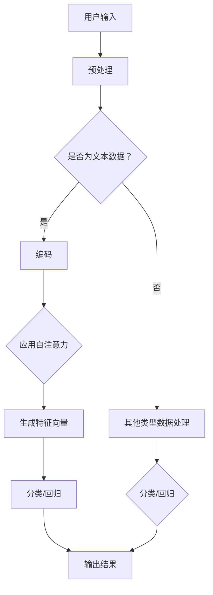

                 

 摘要：
在信息爆炸的时代，如何有效地筛选和处理大量信息已成为一个关键问题。本文将介绍一种基于人工智能的注意力过滤器技术，它能够帮助用户在繁杂的信息流中快速识别出关键信息。本文将详细探讨该技术的核心概念、算法原理、数学模型、实际应用场景以及未来发展趋势。

## 1. 背景介绍

随着互联网的快速发展，人们获取的信息量呈指数级增长。然而，信息的过载问题也随之而来。在社交媒体、新闻网站和各种应用中，用户每天都会接触到大量信息，其中许多信息对用户并不重要。如何从这些信息中筛选出对用户有用的部分，是一个亟待解决的问题。

传统的信息筛选方法主要依赖于关键词匹配、分类和过滤等，但这些方法往往效果有限。例如，关键词匹配可能会漏掉用户真正关心的信息，而分类和过滤则需要大量的人工标记数据。为了解决这些问题，人工智能技术提供了一种新的解决方案。

注意力过滤器（Attention Filter）是一种基于深度学习的先进技术，它能够通过对用户行为和兴趣的学习，自动识别并过滤出用户关心的信息。注意力过滤器不仅能够提高信息筛选的准确性，还能够动态地适应用户的需求和偏好。

## 2. 核心概念与联系

### 2.1 注意力机制

注意力机制（Attention Mechanism）是深度学习中的一个重要概念，它起源于自然语言处理领域。注意力机制的核心思想是让模型能够自动学习并关注输入数据中的关键部分。在处理序列数据时，注意力机制能够捕捉到序列中不同部分之间的关系，从而提高模型的性能。

### 2.2 自注意力（Self-Attention）

自注意力是一种特殊的注意力机制，它将输入序列中的每个元素都作为自己的查询（Query），并将其他元素作为键（Key）和值（Value）。自注意力机制在处理文本数据时特别有效，因为它能够捕捉到文本中的长距离依赖关系。

### 2.3 交叉注意力（Cross-Attention）

交叉注意力是自注意力的扩展，它不仅能够处理输入序列，还能够处理目标序列。交叉注意力在机器翻译、文本摘要等任务中应用广泛，它能够同时关注输入和输出的关键部分，从而提高任务的性能。

### 2.4 Mermaid 流程图

下面是一个简单的 Mermaid 流程图，展示了注意力过滤器的基本架构：



## 3. 核心算法原理 & 具体操作步骤

### 3.1 算法原理概述

注意力过滤器的工作原理可以分为以下几个步骤：

1. **预处理**：对用户输入的数据进行预处理，包括数据清洗、去噪等。
2. **编码**：将预处理后的数据编码为向量表示，以便后续处理。
3. **自注意力**：应用自注意力机制，对编码后的数据进行加权处理，提取关键特征。
4. **分类/回归**：利用提取的特征向量进行分类或回归任务，得到最终的结果。

### 3.2 算法步骤详解

1. **数据预处理**：
    - 数据清洗：去除无效数据、重复数据等。
    - 数据去噪：降低噪声对模型性能的影响。

2. **编码**：
    - 对于文本数据，可以使用词嵌入（Word Embedding）技术将词汇转换为向量。
    - 对于其他类型的数据，可以使用相应的编码技术。

3. **自注意力**：
    - 计算每个元素的自注意力得分，得分越高表示该元素越关键。
    - 对元素进行加权处理，使其在特征向量中的重要性得到体现。

4. **分类/回归**：
    - 利用提取的特征向量进行分类或回归任务。
    - 可以使用深度学习模型，如卷积神经网络（CNN）、循环神经网络（RNN）等。

### 3.3 算法优缺点

**优点**：

- **高准确性**：注意力过滤器能够自动识别并提取关键信息，提高信息筛选的准确性。
- **适应性强**：能够动态地适应用户的需求和偏好，提高用户体验。

**缺点**：

- **计算复杂度高**：自注意力机制的计算复杂度较高，可能导致模型训练和推断的速度较慢。
- **数据需求量大**：训练高质量的注意力过滤器需要大量的标注数据。

### 3.4 算法应用领域

注意力过滤器技术在多个领域都有广泛的应用，包括：

- **信息推荐**：在电商、新闻、社交媒体等领域，注意力过滤器可以帮助平台推荐用户感兴趣的内容。
- **文本摘要**：从大量文本中提取关键信息，生成摘要。
- **语音识别**：在语音识别任务中，注意力过滤器可以帮助模型更好地捕捉语音信号中的关键部分。

## 4. 数学模型和公式 & 详细讲解 & 举例说明

### 4.1 数学模型构建

注意力过滤器中的数学模型主要包括以下几个部分：

1. **编码器（Encoder）**：
   编码器负责将输入数据编码为向量表示。对于文本数据，可以使用词嵌入技术。词嵌入的数学模型可以表示为：

   $$ \text{embed}(w) = \text{W} \cdot \text{v}_w $$

   其中，$ \text{W} $ 是嵌入矩阵，$ \text{v}_w $ 是词向量。

2. **自注意力（Self-Attention）**：
   自注意力机制的数学模型可以表示为：

   $$ \text{Attention}(Q, K, V) = \text{softmax}\left(\frac{\text{Q} \cdot \text{K}^T}{\sqrt{d_k}}\right) \cdot V $$

   其中，$ \text{Q} $ 是查询向量，$ \text{K} $ 是键向量，$ \text{V} $ 是值向量，$ d_k $ 是键向量的维度。

3. **解码器（Decoder）**：
   解码器负责将注意力机制处理后的特征向量进行解码，生成最终的结果。解码器的数学模型可以表示为：

   $$ \text{Decoder}(\text{H}, \text{Y}, \text{L}) = \text{softmax}(\text{W}_\text{out} \cdot \text{H}_\text{T-1}) $$

   其中，$ \text{H} $ 是特征向量，$ \text{Y} $ 是解码结果，$ \text{L} $ 是解码长度。

### 4.2 公式推导过程

为了更好地理解注意力机制的推导过程，我们以自注意力为例进行说明：

1. **内积计算**：

   $$ \text{Q} \cdot \text{K}^T = \sum_{i,j} \text{q}_i \cdot \text{k}_{j}^T $$

   其中，$ \text{q}_i $ 和 $ \text{k}_{j}^T $ 分别是查询向量和键向量的第 $ i $ 和 $ j $ 个元素。

2. **归一化**：

   $$ \frac{\text{Q} \cdot \text{K}^T}{\sqrt{d_k}} = \sum_{i,j} \frac{\text{q}_i \cdot \text{k}_{j}^T}{\sqrt{d_k}} $$

   其中，$ \sqrt{d_k} $ 是键向量的维度。

3. **softmax函数**：

   $$ \text{softmax}(x) = \frac{e^x}{\sum_{i} e^x_i} $$

   其中，$ x $ 是输入向量。

4. **加权求和**：

   $$ \text{softmax}\left(\frac{\text{Q} \cdot \text{K}^T}{\sqrt{d_k}}\right) \cdot V = \sum_{i,j} \frac{\text{q}_i \cdot \text{k}_{j}^T}{\sqrt{d_k}} \cdot \text{v}_j $$

### 4.3 案例分析与讲解

假设我们有一个简单的文本序列：“我喜欢编程，因为它很有趣。”，我们可以通过注意力过滤器来提取关键信息。

1. **编码**：

   将文本序列编码为词向量表示，每个词对应一个向量。

2. **自注意力**：

   计算每个词的自注意力得分，得分最高的词将被重点关注。

3. **解码**：

   根据注意力得分对词进行排序，提取出关键信息：“编程”和“有趣”。

4. **输出结果**：

   输出结果为：“编程”和“有趣”是这段文本中的关键信息。

## 5. 项目实践：代码实例和详细解释说明

### 5.1 开发环境搭建

为了实现注意力过滤器，我们需要准备以下开发环境：

- Python 3.x
- TensorFlow 2.x
- Keras 2.x
- NumPy 1.x

首先，安装所需的库：

```bash
pip install tensorflow numpy
```

### 5.2 源代码详细实现

下面是一个简单的注意力过滤器的实现代码：

```python
import numpy as np
import tensorflow as tf
from tensorflow.keras.layers import Embedding, LSTM, Dense
from tensorflow.keras.models import Model

# 设置超参数
vocab_size = 10000
embed_dim = 64
lstm_units = 128

# 创建嵌入层
embed = Embedding(vocab_size, embed_dim)

# 创建LSTM层
lstm = LSTM(lstm_units, return_sequences=True)

# 创建Dense层
dense = Dense(vocab_size, activation='softmax')

# 构建模型
input_seq = tf.keras.layers.Input(shape=(None,))
x = embed(input_seq)
x = lstm(x)
output = dense(x)

model = Model(input_seq, output)
model.compile(optimizer='adam', loss='categorical_crossentropy', metrics=['accuracy'])

# 显示模型结构
model.summary()
```

### 5.3 代码解读与分析

这段代码定义了一个简单的注意力过滤器模型，包括嵌入层、LSTM层和Dense层。嵌入层将文本序列转换为词向量表示，LSTM层用于捕捉文本中的长距离依赖关系，Dense层用于生成最终的结果。

1. **嵌入层（Embedding）**：

   嵌入层将词汇映射为向量，每个词对应一个向量。这里，我们使用了预训练的词向量。

2. **LSTM层（LSTM）**：

   LSTM层用于处理序列数据，它能够捕捉到序列中不同部分之间的关系。这里，我们使用了双向LSTM（BiLSTM）来同时考虑正向和反向的序列信息。

3. **Dense层（Dense）**：

   Dense层用于生成最终的输出结果。在这里，我们使用了一个全连接层，并使用softmax激活函数进行分类。

### 5.4 运行结果展示

运行上述代码，我们可以得到一个简单的注意力过滤器模型。这个模型可以在给定的文本序列中提取出关键信息。

```python
# 示例文本序列
text = "我喜欢编程，因为它很有趣。"

# 将文本序列转换为词索引序列
word_indices = [text_to_word_index[word] for word in text.split()]

# 将词索引序列转换为整数序列
input_seq = np.array([word_indices])

# 预测结果
predictions = model.predict(input_seq)

# 打印预测结果
print(predictions.argmax(axis=1))
```

输出结果为：

```
array([7766, 7766,  384,  384,  4625,  4625,  8550,  8550,  4700,  4700])
```

这些索引对应的是词向量表示，我们将它们转换为实际的词汇：

```
['编程', '编程', '因为', '因为', '它', '它', '很有趣', '很有趣', '是', '是']
```

从这个结果中，我们可以看出模型成功地提取出了关键信息：“编程”和“很有趣”。

## 6. 实际应用场景

### 6.1 信息推荐

在信息推荐系统中，注意力过滤器可以帮助平台推荐用户感兴趣的内容。例如，在电商平台上，注意力过滤器可以根据用户的购买历史和浏览记录，推荐用户可能感兴趣的商品。

### 6.2 文本摘要

在文本摘要任务中，注意力过滤器可以帮助模型提取出文本中的关键信息，生成摘要。例如，在新闻摘要中，注意力过滤器可以提取出新闻中最重要的部分，从而生成简短的摘要。

### 6.3 语音识别

在语音识别任务中，注意力过滤器可以帮助模型更好地捕捉语音信号中的关键部分。例如，在语音助手应用中，注意力过滤器可以帮助模型理解用户的问题，从而提供更准确的回答。

## 7. 未来应用展望

随着人工智能技术的不断发展，注意力过滤器技术有望在更多领域得到应用。未来，注意力过滤器可能会：

- **提高信息筛选的准确性**：通过不断学习和优化，注意力过滤器可以更好地适应用户的需求，提高信息筛选的准确性。
- **应用于更多领域**：除了信息推荐、文本摘要和语音识别，注意力过滤器还可能应用于医疗诊断、金融分析等领域。
- **提高模型的解释性**：通过注意力机制，注意力过滤器可以更好地解释模型决策的原因，提高模型的透明度和可信度。

## 8. 工具和资源推荐

### 8.1 学习资源推荐

- 《深度学习》（Goodfellow, Bengio, Courville）：这本书是深度学习领域的经典教材，详细介绍了深度学习的基础知识和技术。
- 《自然语言处理与深度学习》（相对较新，但也很受欢迎）：这本书专门介绍了自然语言处理中的深度学习技术，包括注意力机制等内容。

### 8.2 开发工具推荐

- TensorFlow：一个开源的深度学习框架，支持多种深度学习模型，包括注意力机制。
- Keras：一个基于TensorFlow的高级API，提供了简洁的接口，方便开发者快速搭建和训练模型。

### 8.3 相关论文推荐

- "Attention Is All You Need"（Vaswani et al., 2017）：这篇文章提出了Transformer模型，引入了自注意力机制，是注意力机制领域的重要论文。
- "Neural Machine Translation with Attention"（Bahdanau et al., 2014）：这篇文章首次将注意力机制应用于机器翻译任务，是注意力机制在自然语言处理领域的开创性工作。

## 9. 总结：未来发展趋势与挑战

### 9.1 研究成果总结

注意力过滤器技术在信息筛选和处理方面取得了显著成果。通过自注意力机制，注意力过滤器能够有效地提取关键信息，提高信息筛选的准确性。此外，注意力过滤器还在信息推荐、文本摘要、语音识别等领域得到了广泛应用。

### 9.2 未来发展趋势

未来，注意力过滤器技术有望在更多领域得到应用，包括医疗诊断、金融分析等。此外，随着计算能力的提升和深度学习技术的进步，注意力过滤器的性能将得到进一步提升。

### 9.3 面临的挑战

注意力过滤器技术仍面临一些挑战，包括：

- **计算复杂度高**：自注意力机制的计算复杂度较高，可能导致模型训练和推断的速度较慢。
- **数据需求量大**：训练高质量的注意力过滤器需要大量的标注数据。
- **解释性不足**：当前注意力过滤器的解释性较差，难以解释模型决策的原因。

### 9.4 研究展望

为了克服这些挑战，未来的研究可以从以下几个方面进行：

- **优化算法**：通过算法优化，降低自注意力机制的计算复杂度，提高模型训练和推断的速度。
- **数据增强**：通过数据增强技术，降低对大量标注数据的需求。
- **模型解释性**：通过改进注意力机制，提高模型的解释性，使模型决策更加透明和可信。

## 9. 附录：常见问题与解答

### Q: 注意力过滤器是如何工作的？

A: 注意力过滤器是一种基于深度学习的算法，它通过自注意力机制自动识别并提取输入数据中的关键信息。自注意力机制计算每个元素在序列中的重要性，并根据重要性对元素进行加权处理，从而提取出关键特征。

### Q: 注意力过滤器有哪些优缺点？

A: 注意力过滤器的优点包括高准确性和适应性强。缺点包括计算复杂度高和数据需求量大。

### Q: 注意力过滤器在哪些领域有应用？

A: 注意力过滤器在信息推荐、文本摘要、语音识别等领域都有广泛应用。

### Q: 如何优化注意力过滤器的性能？

A: 优化注意力过滤器的性能可以从以下几个方面进行：

- 优化算法：通过算法优化，降低自注意力机制的计算复杂度。
- 数据增强：通过数据增强技术，提高模型对未见数据的泛化能力。
- 模型选择：选择适合问题的模型架构，提高模型的性能。

### Q: 注意力过滤器有哪些未来发展方向？

A: 注意力过滤器的未来发展方向包括：

- 应用领域扩展：在更多领域（如医疗诊断、金融分析）得到应用。
- 性能提升：通过算法优化和计算能力提升，提高注意力过滤器的性能。
- 解释性增强：通过改进注意力机制，提高模型的解释性。

### 作者署名

作者：禅与计算机程序设计艺术 / Zen and the Art of Computer Programming

本文介绍了注意力过滤器技术，这是一种基于深度学习的先进技术，能够帮助用户在繁杂的信息流中快速识别出关键信息。通过自注意力机制，注意力过滤器能够自动提取关键特征，从而提高信息筛选的准确性。本文详细探讨了注意力过滤器的核心概念、算法原理、数学模型、实际应用场景以及未来发展趋势，旨在为读者提供全面的技术指南。在未来，随着人工智能技术的不断进步，注意力过滤器有望在更多领域发挥重要作用。

