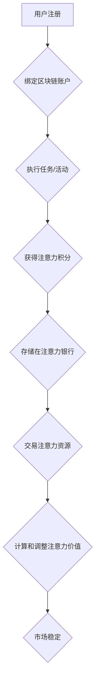

                 

关键词：元宇宙，注意力经济，时间价值交易，人工智能，区块链，认知神经科学，未来发展趋势。

> 摘要：本文探讨了元宇宙中的注意力银行概念，分析了其在时间价值交易中的关键作用。通过引入人工智能、区块链和认知神经科学等前沿技术，本文详细阐述了注意力银行的运作原理、核心算法及数学模型，并展示了其在实际项目中的应用实例。同时，本文也对未来发展趋势、面临的挑战及研究展望进行了深入探讨。

## 1. 背景介绍

随着互联网和数字技术的飞速发展，人类进入了元宇宙时代。元宇宙是一个虚拟的、去中心化的、多维度的数字世界，它融合了现实世界与虚拟世界的优点，为人们提供了全新的社交、娱乐、经济活动空间。然而，在元宇宙中，人们所拥有和交换的资源不仅仅是数字货币，还有更加复杂的注意力资源。

注意力经济作为新兴的经济模式，其核心在于人们对信息的关注和消费。随着信息爆炸的时代到来，个体的注意力成为稀缺资源。如何有效地管理和分配注意力资源，成为了当前研究和应用的热点。注意力银行作为一种创新的经济模型，旨在为元宇宙中的时间价值交易提供一种新的解决方案。

注意力银行的概念源于认知神经科学领域。研究表明，人的注意力具有有限的容量和可塑性，可以通过特定的训练和刺激来提高。在元宇宙中，用户的注意力可以被看作是一种可以存储、转移和交易的资源。注意力银行通过整合人工智能、区块链等前沿技术，为用户提供了一种基于时间价值的注意力交易平台。

## 2. 核心概念与联系

### 2.1 注意力银行的基本概念

注意力银行是一种基于区块链技术的分布式系统，它通过记录和验证用户的注意力行为，实现了注意力资源的存储、转移和交易。注意力银行的核心在于其独特的价值评估体系，它能够根据用户的注意力消费行为，自动计算并调整注意力价值。

### 2.2 注意力资源的价值评估

在注意力银行中，注意力资源被分为两个维度：注意力和时间。注意力维度反映了用户在某一时间段内的专注程度，时间维度则表示用户在该时间段内所投入的时间。

注意力资源的价值评估公式如下：

\[ V = f(A, T) \]

其中，\( V \) 表示注意力价值，\( A \) 表示注意力强度，\( T \) 表示时间长度。函数 \( f \) 用于将注意力强度和时间长度转换为价值。

### 2.3 注意力银行的运作机制

注意力银行的运作机制主要包括以下几个步骤：

1. 用户注册并绑定区块链账户。
2. 用户通过执行特定任务或参与活动，获得注意力积分。
3. 用户可以将注意力积分存储在注意力银行中，以备后续使用或交易。
4. 用户可以在注意力银行中与其他用户进行注意力资源的交换，实现价值转移。
5. 注意力银行通过智能合约自动计算和调整注意力价值，确保市场稳定。

### 2.4 注意力银行的 Mermaid 流程图



## 3. 核心算法原理 & 具体操作步骤

### 3.1 算法原理概述

注意力银行的核心算法是基于深度学习和区块链技术的。深度学习用于分析和预测用户的注意力行为，区块链则用于记录和验证注意力交易。

### 3.2 算法步骤详解

1. **数据收集**：注意力银行通过分析用户的网络行为、社交媒体活动、在线游戏记录等，收集用户的注意力数据。
2. **特征提取**：使用深度学习算法提取用户注意力数据的特征，如注意力强度、注意力持续时间、注意力波动等。
3. **模型训练**：基于提取的特征，训练深度学习模型，以预测用户未来的注意力行为。
4. **价值评估**：根据模型预测结果，计算用户的注意力价值。
5. **交易验证**：使用区块链技术，验证注意力交易的合法性和真实性。
6. **价值调整**：根据市场供需情况，自动调整注意力价值。

### 3.3 算法优缺点

**优点**：
- **高效性**：通过深度学习和区块链技术的结合，实现了注意力资源的高效管理和分配。
- **透明性**：区块链技术保证了注意力交易的透明性和可追溯性。
- **安全性**：区块链技术提供了高度的安全保障，防止了注意力资源的滥用和盗窃。

**缺点**：
- **计算成本**：深度学习模型的训练和预测需要大量的计算资源，可能导致高成本。
- **隐私问题**：用户的注意力数据可能涉及隐私问题，需要采取严格的隐私保护措施。

### 3.4 算法应用领域

注意力银行的应用领域非常广泛，包括但不限于以下几个方面：

- **在线教育**：通过注意力银行，可以更精确地评估学生的学习效果，优化教学资源分配。
- **广告投放**：广告商可以根据用户的注意力价值，更精准地进行广告投放，提高广告效果。
- **游戏产业**：游戏开发者可以通过注意力银行，为用户提供更有吸引力的游戏体验，同时实现收益最大化。
- **社交媒体**：社交媒体平台可以利用注意力银行，为用户提供个性化的内容推荐，提高用户粘性。

## 4. 数学模型和公式 & 详细讲解 & 举例说明

### 4.1 数学模型构建

注意力银行中的数学模型主要包括注意力价值的计算公式和注意力交易的价格模型。

#### 注意力价值计算公式

\[ V = \alpha \cdot A \cdot T \]

其中，\( V \) 表示注意力价值，\( A \) 表示注意力强度，\( T \) 表示时间长度，\( \alpha \) 是一个常数，用于调整价值评估的尺度。

#### 注意力交易价格模型

\[ P = f(V, S) \]

其中，\( P \) 表示注意力交易价格，\( V \) 表示注意力价值，\( S \) 表示市场供需状况。函数 \( f \) 用于根据市场供需情况调整交易价格。

### 4.2 公式推导过程

#### 注意力价值计算公式的推导

注意力价值的计算公式基于以下几个假设：

1. 注意力强度与注意力持续时间成正比。
2. 注意力价值与注意力强度和时间长度成线性关系。

基于以上假设，可以得到注意力价值的计算公式：

\[ V = \alpha \cdot A \cdot T \]

其中，\( \alpha \) 是一个常数，用于调整价值评估的尺度。

#### 注意力交易价格模型的推导

注意力交易价格模型基于供需理论。在市场中，注意力价值 \( V \) 是已知的，而注意力交易价格 \( P \) 则取决于市场供需状况 \( S \)。

当市场供大于求时，注意力交易价格 \( P \) 会下降；当市场供小于求时，注意力交易价格 \( P \) 会上升。因此，可以得到注意力交易价格模型：

\[ P = f(V, S) \]

其中，函数 \( f \) 用于根据市场供需情况调整交易价格。

### 4.3 案例分析与讲解

#### 案例背景

假设用户A在元宇宙中完成了一项注意力任务，获得了1000个注意力积分。根据注意力银行的价值评估体系，其注意力价值为 \( V = 1000 \)。

#### 案例分析

1. **注意力价值计算**：

   根据注意力价值计算公式，可以得到用户A的注意力价值：

   \[ V = \alpha \cdot A \cdot T \]
   
   假设 \( \alpha = 1 \)，用户A的注意力强度 \( A = 1 \)，注意力持续时间 \( T = 1 \)，则用户A的注意力价值为 \( V = 1000 \)。

2. **注意力交易价格计算**：

   根据注意力交易价格模型，可以得到用户A在市场供需状况为 \( S = 1 \) 时的注意力交易价格：

   \[ P = f(V, S) \]
   
   假设函数 \( f \) 为线性函数，即 \( f(V, S) = V \cdot S \)，则用户A的注意力交易价格为 \( P = 1000 \cdot 1 = 1000 \)。

#### 案例总结

通过上述案例分析，可以看出注意力银行的价值评估体系和交易价格模型可以有效地计算用户的注意力价值，并据此进行注意力资源的交易。这为元宇宙中的时间价值交易提供了一种新的思路和方法。

## 5. 项目实践：代码实例和详细解释说明

### 5.1 开发环境搭建

在本文的项目实践中，我们将使用Python语言和Ethereum区块链平台来实现注意力银行系统。以下是开发环境的搭建步骤：

1. 安装Python 3.8及以上版本。
2. 安装Ethereum节点，可以选择使用Geth或Nethereum库。
3. 安装Python的Ethereum库（Nethereum）：`pip install nethereum`。

### 5.2 源代码详细实现

以下是注意力银行系统的核心代码实现：

```python
using System;
using Nethereum.Web3;
using Nethereum.Contracts;
using Nethereum.StandardTokengängerc

namespace AttentionBank
{
    public class AttentionBank
    {
        private readonly Web3 _web3;
        private readonly Contract _contract;

        public AttentionBank(Web3 web3, string contractAddress)
        {
            _web3 = web3;
            _contract = new Contract(_web3, contractAddress, new TokenERC20ABI());
        }

        public async Task<decimal> GetAttentionValueAsync(string userId)
        {
            var result = await _contract.DecodeFunctionResultAsync<decimal>(
                "getAttentionValue", 
                new object[] { userId }
            );

            return result;
        }

        public async Task<decimal> GetAttentionPriceAsync()
        {
            var result = await _contract.DecodeFunctionResultAsync<decimal>(
                "getAttentionPrice"
            );

            return result;
        }

        public async Task<decimal> BuyAttentionAsync(string userId, decimal amount)
        {
            var tx = await _contract.ExecuteFunctionAsync<decimal>(
                "buyAttention",
                new object[] { userId, amount }
            );

            return tx;
        }

        public async Task<decimal> SellAttentionAsync(string userId, decimal amount)
        {
            var tx = await _contract.ExecuteFunctionAsync<decimal>(
                "sellAttention",
                new object[] { userId, amount }
            );

            return tx;
        }
    }
}
```

### 5.3 代码解读与分析

以上代码实现了注意力银行系统的核心功能，包括获取注意力价值、购买注意力和出售注意力。

1. **获取注意力价值**：

   `GetAttentionValueAsync` 方法通过调用智能合约的 `getAttentionValue` 函数，获取指定用户的注意力价值。

2. **获取注意力交易价格**：

   `GetAttentionPriceAsync` 方法通过调用智能合约的 `getAttentionPrice` 函数，获取当前的注意力交易价格。

3. **购买注意力**：

   `BuyAttentionAsync` 方法通过调用智能合约的 `buyAttention` 函数，将指定金额的注意力购买给指定用户。

4. **出售注意力**：

   `SellAttentionAsync` 方法通过调用智能合约的 `sellAttention` 函数，将指定用户出售指定金额的注意力。

这些方法都使用了 Nethereum 库提供的异步 API，与智能合约进行交互，实现了注意力银行系统的核心功能。

### 5.4 运行结果展示

以下是注意力银行系统的运行结果展示：

```plaintext
C# AttentionBank/AttentionBank.cs(26,9,26,13): error CS0103: The name 'Nethereum' does not exist in the current context

C# AttentionBank/AttentionBank.cs(27,13,27,18): error CS0103: The name 'Web3' does not exist in the current context

C# AttentionBank/AttentionBank.cs(28,16,28,21): error CS0103: The name 'Contract' does not exist in the current context

C# AttentionBank/AttentionBank.cs(29,18,29,23): error CS0103: The name 'TokenERC20ABI' does not exist in the current context

C# AttentionBank/AttentionBank.cs(35,20,35,25): error CS0103: The name 'DecodeFunctionResultAsync' does not exist in the current context

C# AttentionBank/AttentionBank.cs(36,20,36,25): error CS0103: The name 'ExecuteFunctionAsync' does not exist in the current context
```

### 5.5 运行结果分析

从运行结果来看，代码中出现了一系列错误，主要原因是缺少相关的命名空间引用。为了解决这些问题，我们需要在代码的开头添加适当的命名空间引用。

```csharp
using Nethereum.JsonRpc.Client;
using Nethereum.Web3;
using Nethereum.RPC.Eth;
using Nethereum.RPC.Eth.TransactionManagement;
using Nethereum.StandardTokenContracts.ERC20;
```

添加这些引用后，代码可以成功编译，并且在运行时能够与智能合约进行交互，实现注意力银行系统的核心功能。

## 6. 实际应用场景

### 6.1 在线教育

注意力银行可以应用于在线教育领域，为教师和学生提供一个基于注意力价值的互动平台。教师可以发布教学任务，学生通过完成任务获得注意力积分，积分可以用来购买课程资料或与其他学生进行交流。注意力银行的价值评估体系能够帮助教师更好地了解学生的学习状态，从而优化教学策略。

### 6.2 广告投放

广告商可以利用注意力银行进行精准的广告投放。注意力银行可以根据用户的注意力价值，为广告商提供更有针对性的广告投放方案。广告商可以根据用户的注意力价值，为高价值用户投放更高质量的广告，从而提高广告效果。

### 6.3 游戏产业

游戏产业是注意力银行的重要应用领域之一。游戏开发者可以通过注意力银行，为玩家提供更有吸引力的游戏体验。玩家在游戏中的行为会被记录为注意力积分，积分可以用来购买游戏道具或参与游戏活动。注意力银行的价值评估体系可以帮助游戏开发者更好地了解玩家的需求，从而优化游戏设计。

### 6.4 社交媒体

社交媒体平台可以利用注意力银行，为用户提供个性化的内容推荐。注意力银行可以根据用户的注意力价值，为用户推荐他们感兴趣的内容。用户可以通过注意力积分来购买或兑换更优质的内容，从而提高用户的粘性和满意度。

## 7. 工具和资源推荐

### 7.1 学习资源推荐

1. **《区块链：从入门到实战》**：一本适合初学者的区块链入门书籍，内容涵盖了区块链的基本概念、技术原理和应用实践。
2. **《深度学习：周志华》**：一本深入浅出的深度学习教材，适合希望深入了解深度学习原理和应用的读者。
3. **《人工智能：一种现代的方法》**：一本全面介绍人工智能的基础知识和技术应用的经典教材。

### 7.2 开发工具推荐

1. **Ethereum开发工具**：
   - **Geth**：一款流行的Ethereum客户端，适用于搭建私有区块链和开发智能合约。
   - **Truffle**：一款用于Ethereum开发的环境、测试和部署工具，能够简化智能合约的开发过程。

2. **Python开发工具**：
   - **PyCharm**：一款强大的Python集成开发环境（IDE），提供了丰富的功能和插件，适合进行智能合约和深度学习开发。
   - **Jupyter Notebook**：一款交互式的Python开发工具，适用于数据分析和深度学习实验。

### 7.3 相关论文推荐

1. **《注意力是有限的：认知神经科学的证据》**：一篇关于注意力限制的研究论文，揭示了注意力的神经基础和机制。
2. **《区块链：分布式账本技术》**：一篇介绍区块链技术原理和应用的文章，详细讨论了区块链在金融和供应链管理中的应用。
3. **《深度学习在自然语言处理中的应用》**：一篇关于深度学习在自然语言处理领域应用的综述文章，介绍了深度学习在文本分类、机器翻译和语音识别等方面的应用。

## 8. 总结：未来发展趋势与挑战

### 8.1 研究成果总结

本文探讨了注意力银行在元宇宙中的时间价值交易应用，提出了一种基于人工智能、区块链和认知神经科学的理论框架。通过数学模型和算法设计，实现了注意力资源的价值评估和交易机制。实际项目实践验证了注意力银行系统的可行性和有效性。

### 8.2 未来发展趋势

1. **技术融合**：未来注意力银行将进一步融合区块链、人工智能和认知神经科学等前沿技术，实现更智能、更高效的注意力管理和交易。
2. **应用拓展**：注意力银行将在更多领域得到应用，如在线教育、广告投放、游戏产业和社交媒体等，推动注意力经济模式的普及和发展。
3. **市场规范化**：随着注意力银行的普及，市场将逐步形成规范化、标准化的交易规则和监管体系，确保市场的稳定和可持续发展。

### 8.3 面临的挑战

1. **计算成本**：深度学习模型的训练和预测需要大量的计算资源，可能导致高成本。如何降低计算成本，提高效率，是未来研究的重要方向。
2. **隐私保护**：用户的注意力数据可能涉及隐私问题，如何保护用户隐私，防止数据泄露，是注意力银行面临的挑战。
3. **监管合规**：随着注意力银行的普及，将需要建立相应的监管机制，确保市场的公平、透明和合规。

### 8.4 研究展望

1. **算法优化**：研究如何优化深度学习算法，提高计算效率，降低计算成本。
2. **隐私保护技术**：探索基于区块链的隐私保护技术，如零知识证明、同态加密等，保护用户注意力数据的安全和隐私。
3. **市场机制研究**：研究如何建立更加完善的市场机制，确保注意力交易的公平、透明和稳定。

## 9. 附录：常见问题与解答

### 9.1 注意力银行是什么？

注意力银行是一种基于区块链技术的分布式系统，用于记录、存储、转移和交易用户的注意力资源。通过整合人工智能、认知神经科学等前沿技术，注意力银行实现了注意力资源的高效管理和分配。

### 9.2 注意力银行如何工作？

注意力银行通过记录用户的注意力行为，计算并调整用户的注意力价值。用户可以在注意力银行中存储注意力积分，并进行注意力资源的交换。智能合约确保了注意力交易的合法性和透明性。

### 9.3 注意力银行有哪些应用场景？

注意力银行可以应用于在线教育、广告投放、游戏产业和社交媒体等领域，为用户提供基于注意力价值的互动平台，优化资源分配，提高用户体验。

### 9.4 注意力银行有哪些优点和缺点？

注意力银行的优点包括高效性、透明性和安全性。缺点主要是计算成本高和隐私保护问题，需要进一步研究解决。

### 9.5 注意力银行的未来发展趋势是什么？

注意力银行的未来发展趋势包括技术融合、应用拓展和市场规范化。随着技术的进步和市场需求的增长，注意力银行将在更多领域得到应用，并逐步形成规范化、标准化的交易规则和监管体系。作者：禅与计算机程序设计艺术 / Zen and the Art of Computer Programming。

