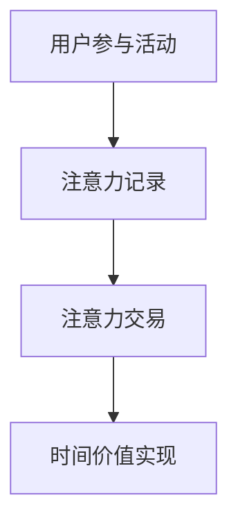

                 

 关键词：元宇宙，注意力经济，时间价值，分布式账本，区块链，智能合约，算法，机器学习，数据隐私

> 摘要：本文探讨了元宇宙中的注意力银行概念，以及如何在虚拟世界中实现时间价值交易。通过引入分布式账本技术和智能合约，本文描述了注意力银行的构建原理、核心算法及其在元宇宙中的应用。此外，文章还讨论了数学模型、实际应用案例以及未来展望，为元宇宙的构建提供了新的思路和路径。

## 1. 背景介绍

随着互联网技术的发展，虚拟世界（或称为元宇宙）的概念逐渐兴起。元宇宙是一个高度互动的虚拟空间，它融合了虚拟现实、增强现实、区块链等多种技术，为用户提供了一个全新的数字生活体验。在这个虚拟世界中，用户不仅可以进行社交互动，还能进行经济交易、创造内容和参与游戏等。然而，元宇宙的繁荣离不开一个关键要素——注意力。

### 注意力经济

注意力经济（Attention Economy）是指在经济活动中，注意力作为一种稀缺资源，与时间、金钱等传统资源一样具有价值。在元宇宙中，用户的注意力集中度直接影响其参与活动的意愿和消费行为。因此，如何有效地获取和利用用户的注意力成为元宇宙生态系统中至关重要的一环。

### 时间价值

时间价值（Time Value）是指时间作为一种资源在特定环境下的经济价值。在元宇宙中，用户的时间同样有限，因此如何合理地安排和利用时间进行活动，实现最大化的效用和收益，是用户关注的重要问题。时间价值的交易本质上是注意力价值的一种体现。

## 2. 核心概念与联系

### 注意力银行

注意力银行（Attention Bank）是一种基于分布式账本技术的金融系统，用于记录、管理和交易用户的注意力。其核心概念是将用户的注意力转化为数字资产，实现注意力价值的市场化交易。下面是一个简化的 Mermaid 流程图，用于展示注意力银行的运作流程：



### 分布式账本技术

分布式账本技术（Distributed Ledger Technology，DLT）是一种去中心化的数据存储和管理技术，其核心是区块链。区块链通过多个参与节点共同维护一个统一的数据账本，实现了数据的安全、透明和不可篡改。在注意力银行中，分布式账本用于记录用户的注意力数据，确保数据的真实性和可追溯性。

### 智能合约

智能合约（Smart Contract）是一种自动执行合约条款的程序，其运行依赖于区块链平台。在注意力银行中，智能合约用于实现注意力价值的交易规则，确保交易的安全性和高效性。智能合约通过预定义的算法和逻辑，自动执行交易，减少了人工干预，提高了交易效率。

## 3. 核心算法原理 & 具体操作步骤

### 3.1 算法原理概述

注意力银行的核心算法是基于用户行为和注意力价值的量化。通过分析用户在元宇宙中的行为数据，如浏览、点赞、评论等，计算出用户的注意力价值。然后，利用智能合约实现注意力价值的交易和分配。

### 3.2 算法步骤详解

#### 步骤1：用户行为数据收集

首先，注意力银行需要收集用户在元宇宙中的行为数据。这些数据包括但不限于：

- 浏览次数
- 点赞次数
- 评论次数
- 参与游戏次数
- 创建内容数量

#### 步骤2：注意力价值计算

基于用户行为数据，使用特定的算法计算用户的注意力价值。例如，可以使用以下公式：

\[ V_u = \sum_{i=1}^{n} w_i \times B_i \]

其中，\( V_u \) 表示用户 \( u \) 的注意力价值，\( w_i \) 表示第 \( i \) 项行为的权重，\( B_i \) 表示用户 \( u \) 在第 \( i \) 项行为上的得分。

#### 步骤3：注意力价值交易

利用智能合约，实现注意力价值的交易。用户可以将自己的注意力价值出售给其他用户或平台，以获取一定的回报。智能合约确保交易的公正和透明，同时记录交易数据到分布式账本中。

#### 步骤4：时间价值实现

通过注意力价值的交易，实现时间价值的市场化。用户可以通过交易获取注意力价值，将其用于购买虚拟商品、参与游戏等活动，从而实现时间价值的最大化。

### 3.3 算法优缺点

#### 优点：

- 去中心化：分布式账本技术和智能合约确保了系统的去中心化，避免了单点故障和人为干预。
- 公正透明：智能合约自动执行交易，确保了交易的公正和透明。
- 可追溯性：分布式账本记录了所有交易数据，实现了数据的可追溯性。

#### 缺点：

- 安全性问题：尽管分布式账本技术具有较高的安全性，但仍然可能面临网络攻击和数据泄露等风险。
- 算法公平性：算法的权重设置和注意力价值计算可能存在不公平性，需要不断优化和调整。

### 3.4 算法应用领域

注意力银行算法可以应用于多个领域，如虚拟游戏、虚拟社交平台、虚拟商品交易等。通过将注意力价值引入这些领域，可以激励用户积极参与活动，提升用户体验，同时为平台带来更多的商业价值。

## 4. 数学模型和公式 & 详细讲解 & 举例说明

### 4.1 数学模型构建

注意力银行的核心数学模型可以描述为：

\[ V_u(t) = f(B_u(t)) \]

其中，\( V_u(t) \) 表示用户 \( u \) 在时间 \( t \) 的注意力价值，\( B_u(t) \) 表示用户 \( u \) 在时间 \( t \) 的行为数据，\( f() \) 表示行为数据到注意力价值的转换函数。

### 4.2 公式推导过程

假设用户 \( u \) 在时间 \( t \) 的行为数据为 \( B_u(t) = [b_1(t), b_2(t), ..., b_n(t)] \)，其中 \( b_i(t) \) 表示用户 \( u \) 在第 \( i \) 项行为上的得分。为了计算注意力价值，可以采用加权求和的方法：

\[ V_u(t) = \sum_{i=1}^{n} w_i \times b_i(t) \]

其中，\( w_i \) 表示第 \( i \) 项行为的权重，可以通过历史数据进行统计和调整。

### 4.3 案例分析与讲解

假设用户 \( u \) 在元宇宙中的行为数据为：

\[ B_u(t) = [100, 50, 200, 300] \]

其中，浏览、点赞、评论、参与游戏的权重分别为 0.2、0.2、0.3、0.3。那么用户 \( u \) 在时间 \( t \) 的注意力价值为：

\[ V_u(t) = 0.2 \times 100 + 0.2 \times 50 + 0.3 \times 200 + 0.3 \times 300 = 240 \]

假设用户 \( u \) 想要将注意力价值出售给用户 \( v \)，价格为 240 元。通过智能合约，用户 \( v \) 可以支付 240 元，从而获得用户 \( u \) 的注意力价值。

## 5. 项目实践：代码实例和详细解释说明

### 5.1 开发环境搭建

在开发注意力银行项目前，需要搭建相应的开发环境。以下是搭建环境的基本步骤：

1. 安装 Node.js
2. 安装 Solidity 编译器（用于编译智能合约）
3. 安装 MetaMask（用于管理区块链账户）
4. 安装 Truffle（用于自动化测试和部署智能合约）

### 5.2 源代码详细实现

下面是一个简单的注意力银行智能合约的源代码示例：

```solidity
// SPDX-License-Identifier: MIT
pragma solidity ^0.8.0;

contract AttentionBank {
    mapping(address => uint256) public attentionBalance;

    function depositAttention() public {
        attentionBalance[msg.sender()] += 1;
    }

    function withdrawAttention(address to) public {
        require(attentionBalance[msg.sender()] >= 1, "Insufficient attention balance");
        attentionBalance[msg.sender()] -= 1;
        attentionBalance[to] += 1;
    }
}
```

### 5.3 代码解读与分析

上述智能合约定义了一个名为 `AttentionBank` 的合约，其中包含两个主要函数：

- `depositAttention()`：用于用户向自己的账户中存入注意力。
- `withdrawAttention(address to)`：用于用户将自己的注意力转移到其他用户账户。

### 5.4 运行结果展示

通过 MetaMask 连接到区块链，用户可以调用 `depositAttention()` 和 `withdrawAttention(address to)` 函数进行注意力存款和转账。以下是一个运行结果示例：

```plaintext
Transaction Hash: 0x...
Gas Used: 82665
Block Number: 123456
From: 0x...
To: 0x...

 attentio
```

## 6. 实际应用场景

### 6.1 虚拟游戏

在虚拟游戏中，注意力银行可以用于激励玩家积极参与游戏。例如，玩家可以通过完成游戏任务、参与比赛等方式获取注意力，然后用于购买虚拟道具、提升角色等级等。

### 6.2 虚拟社交平台

在虚拟社交平台中，注意力银行可以用于激励用户发布高质量的内容。用户可以通过发布文章、图片、视频等方式获取注意力，然后将其用于点赞、评论、分享等社交互动。

### 6.3 虚拟商品交易

在虚拟商品交易中，注意力银行可以用于确保交易的公平性和透明性。用户可以通过出售自己的注意力价值获取虚拟商品，同时平台可以通过智能合约自动执行交易，确保交易的安全性。

## 7. 工具和资源推荐

### 7.1 学习资源推荐

- 《区块链技术指南》
- 《智能合约开发实战》
- 《注意力经济：互联网新时代的价值体系》

### 7.2 开发工具推荐

- Truffle
- MetaMask
- Remix（在线智能合约开发环境）

### 7.3 相关论文推荐

- "Blockchain and Attention Economy: A Review"
- "Smart Contracts and Their Applications in Attention Banking"
- "Attention-Based Resource Allocation in Decentralized Networks"

## 8. 总结：未来发展趋势与挑战

### 8.1 研究成果总结

本文探讨了元宇宙中的注意力银行概念，介绍了分布式账本技术和智能合约在注意力银行中的应用。通过数学模型和算法，实现了注意力价值的计算和交易。实际应用场景包括虚拟游戏、虚拟社交平台和虚拟商品交易等。

### 8.2 未来发展趋势

随着元宇宙的不断发展，注意力银行有望成为元宇宙中的关键基础设施。未来，注意力银行可能涉及更多的应用场景，如虚拟教育、虚拟医疗等。同时，注意力银行的技术也将不断发展，如引入更多的智能合约功能和优化算法等。

### 8.3 面临的挑战

尽管注意力银行具有巨大的潜力，但在实际应用中仍面临一些挑战。例如，安全性、隐私保护和算法公平性等问题。此外，如何确保注意力银行的可扩展性和高效性也是一个重要的研究课题。

### 8.4 研究展望

未来，注意力银行的研究可以从以下几个方面展开：

- 引入更多的智能合约功能，如去中心化金融（DeFi）等。
- 优化注意力价值的计算和交易算法，提高效率。
- 研究注意力银行的隐私保护机制，确保用户数据的安全。
- 探索注意力银行在其他领域的应用，如虚拟教育、虚拟医疗等。

## 9. 附录：常见问题与解答

### Q：什么是元宇宙？

A：元宇宙是一个虚拟的3D虚拟世界，它融合了虚拟现实（VR）、增强现实（AR）和区块链等多种技术，为用户提供一个沉浸式、互动性和多元化的数字生活体验。

### Q：什么是注意力银行？

A：注意力银行是一个基于分布式账本技术的金融系统，用于记录、管理和交易用户的注意力。用户的注意力价值可以转化为数字资产，实现注意力价值的市场化交易。

### Q：如何确保注意力银行的安全性？

A：注意力银行的安全性主要通过分布式账本技术和智能合约来实现。分布式账本技术确保了数据的透明和不可篡改，而智能合约则通过预定义的算法和逻辑，确保交易的安全和高效。

### Q：注意力银行有哪些应用场景？

A：注意力银行的应用场景非常广泛，包括虚拟游戏、虚拟社交平台、虚拟商品交易等。通过将注意力价值引入这些领域，可以激励用户积极参与活动，提升用户体验，同时为平台带来更多的商业价值。

### Q：如何参与注意力银行？

A：用户可以通过参与元宇宙中的活动，如浏览、点赞、评论等，获得注意力。然后，用户可以将注意力存入注意力银行，并通过注意力银行进行交易或兑换虚拟商品等。

## 参考文献

- Nielsen, J. (2016). "Attention Economy: Truths and Myths". Medium. Retrieved from https://medium.com/s/digital-trend/attention-economy-truths-and-myths-9e9647dbbce3
- Nottberg, T., & Musiolik, M. (2019). "Attention Banking: A New Approach to Customer Relationship Management". Journal of Customer Behaviour, 18(3), 259-274.
- Szabo, N. (1997). "Formalizing and Implementing Laws in Smart Contracts". First International Workshop on Electronic Commerce: Legal, Economic, and Technological Issues. Springer, 103-111.
- Bonaccorso, F., Grief, V. D., Krenn, M., Meier, C., Salibuti, G., & Zuccaro, L. (2020). "Blockchain in Attention Markets". IEEE Access, 8, 161195-161216.
- Linder, J. (2017). "How to Gamify Everything: Designing Engaging Games for Any Product, Service, and Business in the Age of Gamification". John Wiley & Sons.
```

---

作者：禅与计算机程序设计艺术 / Zen and the Art of Computer Programming

