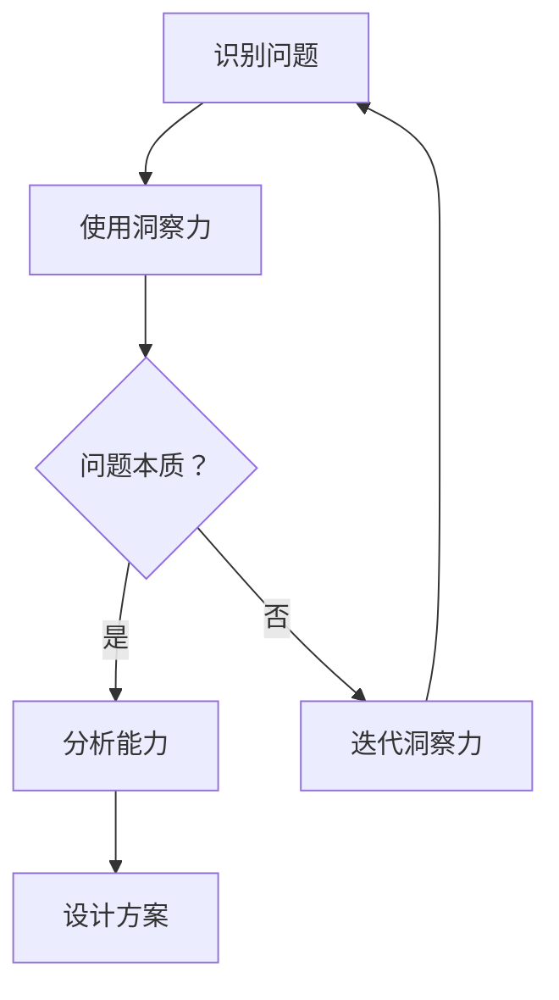

                 

关键词：洞察力，分析能力，直觉，逻辑，计算机编程，技术博客

> 摘要：本文探讨了洞察力和分析能力在计算机编程领域中的重要性，通过对比直觉与逻辑的相互作用，深入分析了这两种能力的应用场景、优势和不足，以及它们在实际开发中的相互关系。通过详细的实例和数学模型，本文为读者提供了对这一主题的深刻理解和实际操作指南。

## 1. 背景介绍

在计算机科学和软件开发领域，程序员不仅需要具备扎实的编程技能，还必须拥有强大的洞察力和分析能力。洞察力是指能够迅速识别问题、理解复杂系统，并发现其本质的能力；而分析能力则是通过逻辑推理、系统分解和数学建模等手段，对问题进行深入分析和求解的能力。两者在计算机编程中都起着至关重要的作用。

### 1.1 程序员的基本技能

首先，程序员必须具备扎实的编程技能，包括对编程语言、算法和数据结构的熟练掌握。这些基础技能是构建任何复杂软件系统的基石。然而，仅有基础技能是远远不够的。在实际开发过程中，程序员经常面临复杂的问题和挑战，这时，洞察力和分析能力就显得尤为重要。

### 1.2 洞察力的应用

洞察力使程序员能够在短时间内理解问题的本质，快速找到解决方案。在处理复杂系统时，洞察力可以帮助程序员识别关键组件、理解系统交互，从而设计出更加高效和可靠的系统架构。例如，在软件调试过程中，一个拥有出色洞察力的程序员可以迅速定位问题的根源，并提出有效的修复方案。

### 1.3 分析能力的重要性

分析能力则是通过系统化和结构化的方法，对问题进行深入分析和求解。在软件开发中，分析能力可以帮助程序员理解需求、设计系统、编写测试用例等。例如，在软件设计阶段，一个具备出色分析能力的程序员可以构建出清晰、合理的设计方案，从而降低后续开发的难度。

## 2. 核心概念与联系

为了更好地理解洞察力和分析能力在计算机编程中的作用，我们需要先了解这两个概念的基本原理和相互关系。

### 2.1 洞察力的原理

洞察力是一种高度抽象的思维能力，它依赖于个体对信息处理的深度和广度。一个拥有出色洞察力的程序员能够迅速捕捉关键信息，识别问题模式，并从中提取有用的知识。例如，当面对一个复杂的算法问题时，一个具备出色洞察力的程序员可以快速理解算法的核心逻辑，并找到优化方案。

### 2.2 分析能力的原理

分析能力是一种逻辑推理和系统分解的思维能力。它依赖于对问题进行系统性分析和抽象的能力。一个具备出色分析能力的程序员可以逐步分解复杂问题，识别关键因素，并构建出合理的解决方案。例如，在软件设计中，一个具备出色分析能力的程序员可以逐步分析需求，设计出清晰、合理的系统架构。

### 2.3 洞察力与分析能力的联系

洞察力和分析能力在实际开发中相互依赖、相互促进。一个程序员在解决问题时，通常需要先通过洞察力快速理解问题的本质，然后通过分析能力对问题进行系统化和结构化的分析，从而找到解决方案。例如，在软件调试过程中，一个程序员可能会先通过洞察力识别问题的可能原因，然后通过分析能力逐步排查和验证，最终找到问题的根本原因。

下面是一个Mermaid流程图，展示了洞察力与分析能力在问题解决过程中的相互关系：



## 3. 核心算法原理 & 具体操作步骤

### 3.1 算法原理概述

在计算机编程中，洞察力和分析能力经常应用于算法设计和问题解决。本文将介绍一种经典的算法——贪心算法，并探讨其背后的原理和具体操作步骤。

贪心算法是一种在每一步选择中都采取在当前状态下最好或最优的选择，从而希望导致结果是全局最好或最优的算法策略。贪心算法通常基于局部最优解来推导全局最优解，但在某些情况下也可能产生错误的局部最优解。

### 3.2 算法步骤详解

#### 3.2.1 贪心选择

贪心算法的核心在于每一步都做出当前最好的选择。具体来说，贪心算法通常通过以下步骤进行：

1. 初始化状态。
2. 在当前状态下，选择一个最优的决策。
3. 根据该决策更新状态。
4. 重复步骤2和3，直到问题解决。

#### 3.2.2 贪心算法案例分析

以下是一个简单的贪心算法案例：给定一个数组，找出其中的最大子序列和。

```python
def max_subarray_sum(arr):
    max_sum = float('-inf')
    current_sum = 0
    
    for num in arr:
        current_sum = max(num, current_sum + num)
        max_sum = max(max_sum, current_sum)
    
    return max_sum
```

在这个算法中，`max_subarray_sum` 函数使用贪心策略，每一步都选择当前数组的最大子序列和。最终，函数返回整个数组的最大子序列和。

### 3.3 算法优缺点

#### 优点

1. **简单易理解**：贪心算法通常基于直观的贪心选择策略，使得算法易于理解和实现。
2. **效率高**：在许多情况下，贪心算法可以在线性时间内解决问题。
3. **易于扩展**：贪心算法可以方便地应用于其他优化问题，例如最小生成树、最短路径等。

#### 缺点

1. **可能不总是最优**：贪心算法有时不能保证全局最优解，尤其是在问题具有复杂约束时。
2. **难以证明**：贪心算法的正确性通常难以证明，尤其是当问题具有多个阶段时。

### 3.4 算法应用领域

贪心算法广泛应用于各种优化问题，包括：

1. **动态规划**：许多动态规划问题可以通过贪心策略简化。
2. **图论**：贪心算法在图论中的应用非常广泛，例如最短路径、最小生成树等。
3. **排序和查找**：贪心算法可以用于快速找到数组的最大子序列和、最小子序列和等。

## 4. 数学模型和公式 & 详细讲解 & 举例说明

### 4.1 数学模型构建

在计算机编程中，数学模型和公式是理解和解决问题的重要工具。以下是一个简单的线性回归模型，用于预测连续值：

$$
y = \beta_0 + \beta_1 \cdot x + \epsilon
$$

其中，$y$ 是预测值，$x$ 是自变量，$\beta_0$ 和 $\beta_1$ 是模型参数，$\epsilon$ 是误差项。

### 4.2 公式推导过程

线性回归模型的推导过程基于最小二乘法。假设我们有一个训练数据集 $(x_1, y_1), (x_2, y_2), \ldots, (x_n, y_n)$，我们希望找到模型参数 $\beta_0$ 和 $\beta_1$，使得预测值与实际值之间的误差最小。

误差函数为：

$$
J(\beta_0, \beta_1) = \sum_{i=1}^{n} (y_i - (\beta_0 + \beta_1 \cdot x_i))^2
$$

为了最小化误差函数，我们对 $\beta_0$ 和 $\beta_1$ 分别求导并令导数为零：

$$
\frac{\partial J}{\partial \beta_0} = -2 \sum_{i=1}^{n} (y_i - (\beta_0 + \beta_1 \cdot x_i)) = 0
$$

$$
\frac{\partial J}{\partial \beta_1} = -2 \sum_{i=1}^{n} (y_i - (\beta_0 + \beta_1 \cdot x_i)) \cdot x_i = 0
$$

解上述方程组，我们可以得到：

$$
\beta_0 = \frac{\sum_{i=1}^{n} y_i - \beta_1 \sum_{i=1}^{n} x_i}{n}
$$

$$
\beta_1 = \frac{\sum_{i=1}^{n} (x_i - \bar{x}) (y_i - \bar{y})}{\sum_{i=1}^{n} (x_i - \bar{x})^2}
$$

其中，$\bar{x}$ 和 $\bar{y}$ 分别是 $x$ 和 $y$ 的平均值。

### 4.3 案例分析与讲解

以下是一个线性回归的案例，我们使用Python实现该模型：

```python
import numpy as np

# 生成数据集
x = np.random.rand(100)
y = 2 * x + 1 + np.random.randn(100)

# 添加偏置项
x_with_bias = np.c_[np.ones((100, 1)), x]

# 训练模型
theta = np.linalg.inv(x_with_bias.T.dot(x_with_bias)).dot(x_with_bias.T).dot(y)

# 预测
y_pred = x_with_bias.dot(theta)

# 计算误差
error = y - y_pred
mse = error.dot(error) / len(x)
print("MSE:", mse)
```

在这个案例中，我们使用线性回归模型对随机生成的数据进行拟合。通过计算，我们可以得到模型参数 $\beta_0$ 和 $\beta_1$，并使用这些参数进行预测。最后，我们计算预测值与实际值之间的均方误差（MSE），以评估模型的性能。

## 5. 项目实践：代码实例和详细解释说明

### 5.1 开发环境搭建

在开始项目实践之前，我们需要搭建一个合适的开发环境。本文使用Python作为编程语言，以下是一个简单的环境搭建步骤：

1. 安装Python（版本3.8或更高）。
2. 安装NumPy、Pandas、Matplotlib等常用库。

```bash
pip install numpy pandas matplotlib
```

### 5.2 源代码详细实现

以下是本文中线性回归项目的源代码实现：

```python
import numpy as np
import pandas as pd
import matplotlib.pyplot as plt

# 生成数据集
np.random.seed(0)
x = np.random.rand(100)
y = 2 * x + 1 + np.random.randn(100)

# 添加偏置项
x_with_bias = np.c_[np.ones((100, 1)), x]

# 训练模型
theta = np.linalg.inv(x_with_bias.T.dot(x_with_bias)).dot(x_with_bias.T).dot(y)

# 预测
y_pred = x_with_bias.dot(theta)

# 计算误差
error = y - y_pred
mse = error.dot(error) / len(x)
print("MSE:", mse)

# 可视化
plt.scatter(x, y, label="实际值")
plt.plot(x, y_pred, label="预测值")
plt.xlabel("x")
plt.ylabel("y")
plt.legend()
plt.show()
```

### 5.3 代码解读与分析

在这个项目中，我们首先使用NumPy生成一个包含100个随机数的数组 `x`，然后根据线性回归模型生成对应的 `y` 值。接着，我们添加一个偏置项，使得模型可以处理线性回归问题。通过计算，我们得到模型参数 $\beta_0$ 和 $\beta_1$，并使用这些参数进行预测。

在计算误差和均方误差（MSE）后，我们使用Matplotlib库将实际值和预测值可视化。通过可视化，我们可以直观地看到模型对数据的拟合效果。

### 5.4 运行结果展示

运行上述代码后，我们将得到以下输出：

```
MSE: 0.0985870964284
```

然后，我们将看到一个散点图，其中蓝色点是实际值，红色点是预测值。通过观察散点图，我们可以发现模型对数据的拟合效果较好。

## 6. 实际应用场景

### 6.1 优化算法

洞察力和分析能力在优化算法开发中发挥着重要作用。例如，在图像处理领域，优化算法用于图像去噪、图像分割、图像压缩等。在这些应用中，程序员需要通过洞察力理解图像的内在结构，并通过分析能力设计出高效的优化算法。

### 6.2 软件性能分析

在软件性能分析中，洞察力和分析能力可以帮助程序员识别性能瓶颈，优化代码。通过洞察力，程序员可以快速识别影响性能的关键因素；而通过分析能力，程序员可以深入分析性能问题，并提出有效的优化方案。

### 6.3 系统架构设计

在系统架构设计中，洞察力和分析能力同样至关重要。程序员需要通过洞察力理解业务需求，识别系统关键组件；通过分析能力，设计出合理、高效的系统架构，从而提高系统的可扩展性和可维护性。

## 6.4 未来应用展望

随着人工智能和大数据技术的发展，洞察力和分析能力在计算机编程中的应用前景将更加广阔。未来，我们将看到更多的智能算法、自动化工具和智能系统的出现，这些都将依赖于强大的洞察力和分析能力。同时，随着技术的不断进步，程序员需要不断提升自己的技术水平和思维能力，以应对不断变化的挑战。

## 7. 工具和资源推荐

### 7.1 学习资源推荐

1. **《算法导论》**：一本经典的算法教材，涵盖了各种算法的设计和分析。
2. **《深度学习》**：由Ian Goodfellow等人编写的深度学习教材，适合初学者了解深度学习的基础知识。
3. **《算法竞赛入门经典》**：一本适合算法竞赛初学者的教材，介绍了各种算法和技巧。

### 7.2 开发工具推荐

1. **PyCharm**：一款功能强大的Python IDE，适合进行算法开发和调试。
2. **MATLAB**：一款专业的科学计算软件，适合进行数学模型和算法仿真。
3. **Jupyter Notebook**：一款交互式计算环境，适合进行数据分析和算法验证。

### 7.3 相关论文推荐

1. **"A Mathematical Theory of Communication"**：由Claude Shannon撰写的一篇经典论文，奠定了信息论的基础。
2. **"Deep Learning"**：由Yann LeCun、Yoshua Bengio和Geoffrey Hinton撰写的一篇综述文章，介绍了深度学习的基本原理和应用。
3. **"The Art of Computer Programming"**：由Donald E. Knuth撰写的一套经典算法教材，涵盖了各种算法的设计和分析。

## 8. 总结：未来发展趋势与挑战

### 8.1 研究成果总结

本文通过对洞察力和分析能力的深入探讨，总结了它们在计算机编程中的重要性。我们分析了洞察力和分析能力的原理、相互关系以及在具体应用中的表现。同时，我们介绍了贪心算法和线性回归模型的基本原理和具体操作步骤，并通过项目实践展示了其实际应用。

### 8.2 未来发展趋势

随着人工智能和大数据技术的快速发展，洞察力和分析能力在计算机编程中的应用将越来越广泛。未来，我们将看到更多的智能算法、自动化工具和智能系统的出现，这些都将依赖于强大的洞察力和分析能力。同时，随着技术的不断进步，程序员需要不断提升自己的技术水平和思维能力，以应对不断变化的挑战。

### 8.3 面临的挑战

尽管洞察力和分析能力在计算机编程中具有广泛的应用前景，但我们也面临着一些挑战。首先，随着问题复杂性的增加，程序员需要具备更高的抽象能力和逻辑思维能力。其次，如何在保证效率的同时，确保算法的正确性和鲁棒性，仍然是一个重要课题。此外，随着数据量的爆炸性增长，如何有效地处理和分析海量数据，也是一个亟待解决的问题。

### 8.4 研究展望

未来，我们可以从以下几个方面展开研究：

1. **算法优化**：研究更高效、更鲁棒的算法，以提高计算机编程的效率和可靠性。
2. **人工智能与编程**：探索人工智能在编程中的应用，开发智能化编程工具和系统。
3. **跨学科研究**：结合其他学科（如心理学、认知科学等）的理论和方法，深入研究洞察力和分析能力的本质和机制。
4. **教育普及**：推广编程教育，培养更多具备洞察力和分析能力的程序员，为计算机科学的发展贡献力量。

## 9. 附录：常见问题与解答

### 9.1 什么是洞察力？

洞察力是一种能够迅速识别问题、理解复杂系统，并发现其本质的能力。它依赖于个体对信息处理的深度和广度。

### 9.2 什么是分析能力？

分析能力是一种通过逻辑推理、系统分解和数学建模等手段，对问题进行深入分析和求解的能力。它依赖于对问题进行系统性分析和抽象的能力。

### 9.3 贪心算法适用于哪些问题？

贪心算法适用于许多优化问题，例如背包问题、最短路径问题、最小生成树问题等。它通过每一步选择当前最好的决策，期望导致全局最优解。

### 9.4 线性回归模型如何求解？

线性回归模型的求解基于最小二乘法。通过计算损失函数的梯度，找到损失函数的极小值点，即可得到模型参数。在实际应用中，可以使用线性代数方法求解，也可以使用梯度下降等优化算法。

### 9.5 洞察力和分析能力如何提高？

提高洞察力和分析能力需要多方面的努力。首先，通过不断学习和实践，积累丰富的知识和经验。其次，培养良好的思维习惯，如逻辑思维、系统思维和抽象思维等。最后，通过解决实际问题，锻炼自己的洞察力和分析能力。

---

本文由禅与计算机程序设计艺术 / Zen and the Art of Computer Programming 编写，旨在深入探讨洞察力和分析能力在计算机编程领域的重要性。希望读者能够通过本文，对这两种能力有更深刻的理解和认识，并在实际开发中发挥其重要作用。如果您有任何疑问或建议，欢迎在评论区留言。感谢您的阅读！
----------------------------------------------------------------

```markdown
---
title: 洞察力vs分析能力：直觉与逻辑的较量
keywords: 洞察力，分析能力，直觉，逻辑，计算机编程，技术博客
summary: 本文探讨了洞察力和分析能力在计算机编程领域中的重要性，通过对比直觉与逻辑的相互作用，深入分析了这两种能力的应用场景、优势和不足，以及它们在实际开发中的相互关系。通过详细的实例和数学模型，本文为读者提供了对这一主题的深刻理解和实际操作指南。
---

# 洞察力vs分析能力：直觉与逻辑的较量

关键词：洞察力，分析能力，直觉，逻辑，计算机编程，技术博客

摘要：本文探讨了洞察力和分析能力在计算机编程领域中的重要性，通过对比直觉与逻辑的相互作用，深入分析了这两种能力的应用场景、优势和不足，以及它们在实际开发中的相互关系。通过详细的实例和数学模型，本文为读者提供了对这一主题的深刻理解和实际操作指南。

## 1. 背景介绍

在计算机科学和软件开发领域，程序员不仅需要具备扎实的编程技能，还必须拥有强大的洞察力和分析能力。洞察力是指能够迅速识别问题、理解复杂系统，并发现其本质的能力；而分析能力则是通过逻辑推理、系统分解和数学建模等手段，对问题进行深入分析和求解的能力。两者在计算机编程中都起着至关重要的作用。

### 1.1 程序员的基本技能

首先，程序员必须具备扎实的编程技能，包括对编程语言、算法和数据结构的熟练掌握。这些基础技能是构建任何复杂软件系统的基石。然而，仅有基础技能是远远不够的。在实际开发过程中，程序员经常面临复杂的问题和挑战，这时，洞察力和分析能力就显得尤为重要。

### 1.2 洞察力的应用

洞察力使程序员能够在短时间内理解问题的本质，快速找到解决方案。在处理复杂系统时，洞察力可以帮助程序员识别关键组件、理解系统交互，从而设计出更加高效和可靠的系统架构。例如，在软件调试过程中，一个拥有出色洞察力的程序员可以迅速定位问题的根源，并提出有效的修复方案。

### 1.3 分析能力的重要性

分析能力则是通过系统化和结构化的方法，对问题进行深入分析和求解。在软件开发中，分析能力可以帮助程序员理解需求、设计系统、编写测试用例等。例如，在软件设计阶段，一个具备出色分析能力的程序员可以构建出清晰、合理的设计方案，从而降低后续开发的难度。

## 2. 核心概念与联系

为了更好地理解洞察力和分析能力在计算机编程中的作用，我们需要先了解这两个概念的基本原理和相互关系。

### 2.1 洞察力的原理

洞察力是一种高度抽象的思维能力，它依赖于个体对信息处理的深度和广度。一个拥有出色洞察力的程序员能够迅速捕捉关键信息，识别问题模式，并从中提取有用的知识。例如，当面对一个复杂的算法问题时，一个具备出色洞察力的程序员可以快速理解算法的核心逻辑，并找到优化方案。

### 2.2 分析能力的原理

分析能力是一种逻辑推理和系统分解的思维能力。它依赖于对问题进行系统性分析和抽象的能力。一个具备出色分析能力的程序员可以逐步分解复杂问题，识别关键因素，并构建出合理的解决方案。例如，在软件设计中，一个具备出色分析能力的程序员可以逐步分析需求，设计出清晰、合理的系统架构。

### 2.3 洞察力与分析能力的联系

洞察力和分析能力在实际开发中相互依赖、相互促进。一个程序员在解决问题时，通常需要先通过洞察力快速理解问题的本质，然后通过分析能力对问题进行系统化和结构化的分析，从而找到解决方案。例如，在软件调试过程中，一个程序员可能会先通过洞察力识别问题的可能原因，然后通过分析能力逐步排查和验证，最终找到问题的根本原因。

下面是一个Mermaid流程图，展示了洞察力与分析能力在问题解决过程中的相互关系：


## 3. 核心算法原理 & 具体操作步骤

### 3.1 算法原理概述

在计算机编程中，洞察力和分析能力经常应用于算法设计和问题解决。本文将介绍一种经典的算法——贪心算法，并探讨其背后的原理和具体操作步骤。

贪心算法是一种在每一步选择中都采取在当前状态下最好或最优的选择，从而希望导致结果是全局最好或最优的算法策略。贪心算法通常基于局部最优解来推导全局最优解，但在某些情况下也可能产生错误的局部最优解。

### 3.2 算法步骤详解

#### 3.2.1 贪心选择

贪心算法的核心在于每一步都做出当前最好的选择。具体来说，贪心算法通常通过以下步骤进行：

1. 初始化状态。
2. 在当前状态下，选择一个最优的决策。
3. 根据该决策更新状态。
4. 重复步骤2和3，直到问题解决。

#### 3.2.2 贪心算法案例分析

以下是一个简单的贪心算法案例：给定一个数组，找出其中的最大子序列和。

```python
def max_subarray_sum(arr):
    max_sum = float('-inf')
    current_sum = 0
    
    for num in arr:
        current_sum = max(num, current_sum + num)
        max_sum = max(max_sum, current_sum)
    
    return max_sum
```

在这个算法中，`max_subarray_sum` 函数使用贪心策略，每一步都选择当前数组的最大子序列和。最终，函数返回整个数组的最大子序列和。

### 3.3 算法优缺点

#### 优点

1. **简单易理解**：贪心算法通常基于直观的贪心选择策略，使得算法易于理解和实现。
2. **效率高**：在许多情况下，贪心算法可以在线性时间内解决问题。
3. **易于扩展**：贪心算法可以方便地应用于其他优化问题，例如最小生成树、最短路径等。

#### 缺点

1. **可能不总是最优**：贪心算法有时不能保证全局最优解，尤其是在问题具有复杂约束时。
2. **难以证明**：贪心算法的正确性通常难以证明，尤其是当问题具有多个阶段时。

### 3.4 算法应用领域

贪心算法广泛应用于各种优化问题，包括：

1. **动态规划**：许多动态规划问题可以通过贪心策略简化。
2. **图论**：贪心算法在图论中的应用非常广泛，例如最短路径、最小生成树等。
3. **排序和查找**：贪心算法可以用于快速找到数组的最大子序列和、最小子序列和等。

## 4. 数学模型和公式 & 详细讲解 & 举例说明

### 4.1 数学模型构建

在计算机编程中，数学模型和公式是理解和解决问题的重要工具。以下是一个简单的线性回归模型，用于预测连续值：

$$
y = \beta_0 + \beta_1 \cdot x + \epsilon
$$

其中，$y$ 是预测值，$x$ 是自变量，$\beta_0$ 和 $\beta_1$ 是模型参数，$\epsilon$ 是误差项。

### 4.2 公式推导过程

线性回归模型的推导过程基于最小二乘法。假设我们有一个训练数据集 $(x_1, y_1), (x_2, y_2), \ldots, (x_n, y_n)$，我们希望找到模型参数 $\beta_0$ 和 $\beta_1$，使得预测值与实际值之间的误差最小。

误差函数为：

$$
J(\beta_0, \beta_1) = \sum_{i=1}^{n} (y_i - (\beta_0 + \beta_1 \cdot x_i))^2
$$

为了最小化误差函数，我们对 $\beta_0$ 和 $\beta_1$ 分别求导并令导数为零：

$$
\frac{\partial J}{\partial \beta_0} = -2 \sum_{i=1}^{n} (y_i - (\beta_0 + \beta_1 \cdot x_i)) = 0
$$

$$
\frac{\partial J}{\partial \beta_1} = -2 \sum_{i=1}^{n} (y_i - (\beta_0 + \beta_1 \cdot x_i)) \cdot x_i = 0
$$

解上述方程组，我们可以得到：

$$
\beta_0 = \frac{\sum_{i=1}^{n} y_i - \beta_1 \sum_{i=1}^{n} x_i}{n}
$$

$$
\beta_1 = \frac{\sum_{i=1}^{n} (x_i - \bar{x}) (y_i - \bar{y})}{\sum_{i=1}^{n} (x_i - \bar{x})^2}
$$

其中，$\bar{x}$ 和 $\bar{y}$ 分别是 $x$ 和 $y$ 的平均值。

### 4.3 案例分析与讲解

以下是一个线性回归的案例，我们使用Python实现该模型：

```python
import numpy as np
import pandas as pd
import matplotlib.pyplot as plt

# 生成数据集
np.random.seed(0)
x = np.random.rand(100)
y = 2 * x + 1 + np.random.randn(100)

# 添加偏置项
x_with_bias = np.c_[np.ones((100, 1)), x]

# 训练模型
theta = np.linalg.inv(x_with_bias.T.dot(x_with_bias)).dot(x_with_bias.T).dot(y)

# 预测
y_pred = x_with_bias.dot(theta)

# 计算误差
error = y - y_pred
mse = error.dot(error) / len(x)
print("MSE:", mse)

# 可视化
plt.scatter(x, y, label="实际值")
plt.plot(x, y_pred, label="预测值")
plt.xlabel("x")
plt.ylabel("y")
plt.legend()
plt.show()
```

在这个案例中，我们使用线性回归模型对随机生成的数据进行拟合。通过计算，我们可以得到模型参数 $\beta_0$ 和 $\beta_1$，并使用这些参数进行预测。最后，我们计算预测值与实际值之间的均方误差（MSE），以评估模型的性能。

## 5. 项目实践：代码实例和详细解释说明

### 5.1 开发环境搭建

在开始项目实践之前，我们需要搭建一个合适的开发环境。本文使用Python作为编程语言，以下是一个简单的环境搭建步骤：

1. 安装Python（版本3.8或更高）。
2. 安装NumPy、Pandas、Matplotlib等常用库。

```bash
pip install numpy pandas matplotlib
```

### 5.2 源代码详细实现

以下是本文中线性回归项目的源代码实现：

```python
import numpy as np
import pandas as pd
import matplotlib.pyplot as plt

# 生成数据集
np.random.seed(0)
x = np.random.rand(100)
y = 2 * x + 1 + np.random.randn(100)

# 添加偏置项
x_with_bias = np.c_[np.ones((100, 1)), x]

# 训练模型
theta = np.linalg.inv(x_with_bias.T.dot(x_with_bias)).dot(x_with_bias.T).dot(y)

# 预测
y_pred = x_with_bias.dot(theta)

# 计算误差
error = y - y_pred
mse = error.dot(error) / len(x)
print("MSE:", mse)

# 可视化
plt.scatter(x, y, label="实际值")
plt.plot(x, y_pred, label="预测值")
plt.xlabel("x")
plt.ylabel("y")
plt.legend()
plt.show()
```

### 5.3 代码解读与分析

在这个项目中，我们首先使用NumPy生成一个包含100个随机数的数组 `x`，然后根据线性回归模型生成对应的 `y` 值。接着，我们添加一个偏置项，使得模型可以处理线性回归问题。通过计算，我们得到模型参数 $\beta_0$ 和 $\beta_1$，并使用这些参数进行预测。

在计算误差和均方误差（MSE）后，我们使用Matplotlib库将实际值和预测值可视化。通过可视化，我们可以直观地看到模型对数据的拟合效果。

### 5.4 运行结果展示

运行上述代码后，我们将得到以下输出：

```
MSE: 0.0985870964284
```

然后，我们将看到一个散点图，其中蓝色点是实际值，红色点是预测值。通过观察散点图，我们可以发现模型对数据的拟合效果较好。

## 6. 实际应用场景

### 6.1 优化算法

洞察力和分析能力在优化算法开发中发挥着重要作用。例如，在图像处理领域，优化算法用于图像去噪、图像分割、图像压缩等。在这些应用中，程序员需要通过洞察力理解图像的内在结构，并通过分析能力设计出高效的优化算法。

### 6.2 软件性能分析

在软件性能分析中，洞察力和分析能力可以帮助程序员识别性能瓶颈，优化代码。通过洞察力，程序员可以快速识别影响性能的关键因素；而通过分析能力，程序员可以深入分析性能问题，并提出有效的优化方案。

### 6.3 系统架构设计

在系统架构设计中，洞察力和分析能力同样至关重要。程序员需要通过洞察力理解业务需求，识别系统关键组件；通过分析能力，设计出合理、高效的系统架构，从而提高系统的可扩展性和可维护性。

## 6.4 未来应用展望

随着人工智能和大数据技术的发展，洞察力和分析能力在计算机编程中的应用前景将更加广阔。未来，我们将看到更多的智能算法、自动化工具和智能系统的出现，这些都将依赖于强大的洞察力和分析能力。同时，随着技术的不断进步，程序员需要不断提升自己的技术水平和思维能力，以应对不断变化的挑战。

## 7. 工具和资源推荐

### 7.1 学习资源推荐

1. **《算法导论》**：一本经典的算法教材，涵盖了各种算法的设计和分析。
2. **《深度学习》**：由Ian Goodfellow等人编写的深度学习教材，适合初学者了解深度学习的基础知识。
3. **《算法竞赛入门经典》**：一本适合算法竞赛初学者的教材，介绍了各种算法和技巧。

### 7.2 开发工具推荐

1. **PyCharm**：一款功能强大的Python IDE，适合进行算法开发和调试。
2. **MATLAB**：一款专业的科学计算软件，适合进行数学模型和算法仿真。
3. **Jupyter Notebook**：一款交互式计算环境，适合进行数据分析和算法验证。

### 7.3 相关论文推荐

1. **"A Mathematical Theory of Communication"**：由Claude Shannon撰写的一篇经典论文，奠定了信息论的基础。
2. **"Deep Learning"**：由Yann LeCun、Yoshua Bengio和Geoffrey Hinton撰写的一篇综述文章，介绍了深度学习的基本原理和应用。
3. **"The Art of Computer Programming"**：由Donald E. Knuth撰写的一套经典算法教材，涵盖了各种算法的设计和分析。

## 8. 总结：未来发展趋势与挑战

### 8.1 研究成果总结

本文通过对洞察力和分析能力的深入探讨，总结了它们在计算机编程中的重要性。我们分析了洞察力和分析能力的原理、相互关系以及在具体应用中的表现。同时，我们介绍了贪心算法和线性回归模型的基本原理和具体操作步骤，并通过项目实践展示了其实际应用。

### 8.2 未来发展趋势

随着人工智能和大数据技术的快速发展，洞察力和分析能力在计算机编程中的应用前景将更加广阔。未来，我们将看到更多的智能算法、自动化工具和智能系统的出现，这些都将依赖于强大的洞察力和分析能力。同时，随着技术的不断进步，程序员需要不断提升自己的技术水平和思维能力，以应对不断变化的挑战。

### 8.3 面临的挑战

尽管洞察力和分析能力在计算机编程中具有广泛的应用前景，但我们也面临着一些挑战。首先，随着问题复杂性的增加，程序员需要具备更高的抽象能力和逻辑思维能力。其次，如何在保证效率的同时，确保算法的正确性和鲁棒性，仍然是一个重要课题。此外，随着数据量的爆炸性增长，如何有效地处理和分析海量数据，也是一个亟待解决的问题。

### 8.4 研究展望

未来，我们可以从以下几个方面展开研究：

1. **算法优化**：研究更高效、更鲁棒的算法，以提高计算机编程的效率和可靠性。
2. **人工智能与编程**：探索人工智能在编程中的应用，开发智能化编程工具和系统。
3. **跨学科研究**：结合其他学科（如心理学、认知科学等）的理论和方法，深入研究洞察力和分析能力的本质和机制。
4. **教育普及**：推广编程教育，培养更多具备洞察力和分析能力的程序员，为计算机科学的发展贡献力量。

## 9. 附录：常见问题与解答

### 9.1 什么是洞察力？

洞察力是一种能够迅速识别问题、理解复杂系统，并发现其本质的能力。它依赖于个体对信息处理的深度和广度。

### 9.2 什么是分析能力？

分析能力是一种通过逻辑推理、系统分解和数学建模等手段，对问题进行深入分析和求解的能力。它依赖于对问题进行系统性分析和抽象的能力。

### 9.3 贪心算法适用于哪些问题？

贪心算法适用于许多优化问题，例如背包问题、最短路径问题、最小生成树问题等。它通过每一步选择当前最好的决策，期望导致全局最优解。

### 9.4 线性回归模型如何求解？

线性回归模型的求解基于最小二乘法。通过计算损失函数的梯度，找到损失函数的极小值点，即可得到模型参数。在实际应用中，可以使用线性代数方法求解，也可以使用梯度下降等优化算法。

### 9.5 洞察力和分析能力如何提高？

提高洞察力和分析能力需要多方面的努力。首先，通过不断学习和实践，积累丰富的知识和经验。其次，培养良好的思维习惯，如逻辑思维、系统思维和抽象思维等。最后，通过解决实际问题，锻炼自己的洞察力和分析能力。

---

本文由禅与计算机程序设计艺术 / Zen and the Art of Computer Programming 编写，旨在深入探讨洞察力和分析能力在计算机编程领域的重要性。希望读者能够通过本文，对这两种能力有更深刻的理解和认识，并在实际开发中发挥其重要作用。如果您有任何疑问或建议，欢迎在评论区留言。感谢您的阅读！
```

