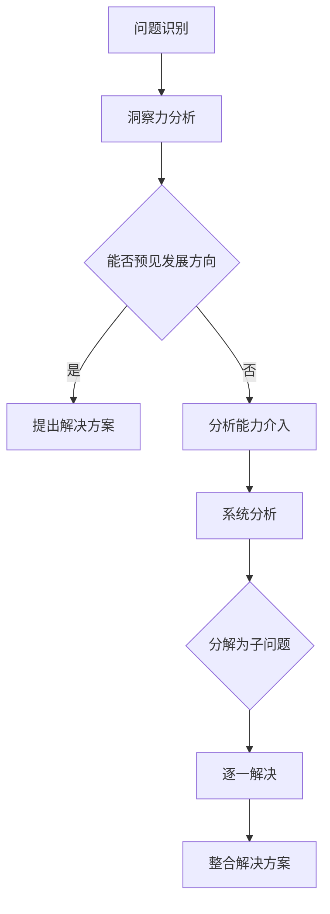

                 

关键词：洞察力、分析能力、直觉、逻辑、技术编程、软件设计、算法、人工智能、计算机科学

> 摘要：本文探讨了计算机科学领域内两种核心能力——洞察力和分析能力的对比与联系。通过具体案例分析，揭示了直觉在解决问题中的重要作用，同时也强调了逻辑分析对于准确理解和实现技术方案的重要性。文章旨在为从事IT行业的专业人士提供一种全新的思考模式，帮助他们在实际问题解决中更好地平衡直觉与逻辑，提升整体的技术素养。

## 1. 背景介绍

在计算机科学领域，技术的发展日新月异，随之而来的是解决复杂问题的需求不断增加。为了应对这些挑战，研究者们不断探索新的算法、工具和技术，以期提升系统的性能和可靠性。在这个过程中，洞察力和分析能力成为了关键能力。洞察力指的是快速理解问题本质、预见问题发展方向的能力，而分析能力则是通过逻辑推理、系统分析来逐步解决问题。本文将探讨这两种能力在实际编程、软件设计和算法研究中的应用，并分析它们在解决复杂问题时的作用和联系。

## 2. 核心概念与联系

为了更好地理解洞察力和分析能力，我们首先需要明确它们的核心概念及其相互联系。

### 2.1 洞察力

洞察力是一种直觉式的理解能力，它让我们能够在短时间内捕捉问题的本质。在计算机科学领域，洞察力主要体现在以下几个方面：

- **快速识别问题关键点**：在面对复杂问题时，能够迅速找到问题的核心，从而缩小解决问题的范围。
- **预见问题发展方向**：通过过去的经验和对领域知识的理解，能够预见问题的发展方向和可能的解决方案。
- **创新思维**：在解决问题时，能够跳出传统的思维模式，提出新颖的解决方案。

### 2.2 分析能力

分析能力是一种逻辑推理能力，它通过逐步分析、分解问题，找到解决问题的方法。在计算机科学领域，分析能力主要体现在以下几个方面：

- **逻辑推理**：通过逻辑规则和数学原理，逐步推理出问题的解决方案。
- **系统分析**：将复杂问题分解为若干个子问题，然后逐一解决。
- **算法设计**：根据问题的特性，设计出高效的算法来解决问题。

### 2.3 Mermaid 流程图

为了更直观地展示洞察力和分析能力在解决问题中的应用，我们可以使用Mermaid流程图来描述它们的核心流程和联系。



### 2.4 洞察力与分析能力的相互联系

实际上，洞察力和分析能力并不是相互独立的。它们在解决问题过程中往往是相互补充的。洞察力可以帮助我们快速找到问题的核心，而分析能力则可以逐步分析并解决这些问题。二者共同作用，能够大大提升解决问题的效率和质量。

## 3. 核心算法原理 & 具体操作步骤

在探讨洞察力和分析能力在实际应用中的具体表现之前，我们先来看一个经典的案例——排序算法。

### 3.1 算法原理概述

排序算法是一种用于对数据进行排序的基本算法。常见的排序算法包括冒泡排序、选择排序、插入排序等。这些算法的基本原理是通过比较和交换数据项的位置，逐步将数据按特定顺序排列。

### 3.2 算法步骤详解

以冒泡排序为例，其具体步骤如下：

1. **初始化**：将待排序的数组从头到尾遍历。
2. **比较相邻元素**：遍历过程中，比较相邻两个元素的大小。
3. **交换位置**：如果前一个元素比后一个元素大，则交换它们的位置。
4. **重复过程**：重复上述步骤，直到整个数组有序。

### 3.3 算法优缺点

冒泡排序的优点是简单易懂，实现简单。但它的缺点是时间复杂度高，效率较低，不适合处理大数据量的排序问题。

### 3.4 算法应用领域

尽管冒泡排序在效率上有一定局限，但它在某些特定场景下仍然非常有用。例如，在初学者入门学习算法时，冒泡排序是一个很好的选择，因为它可以帮助我们理解排序的基本原理。

## 4. 数学模型和公式 & 详细讲解 & 举例说明

在计算机科学中，数学模型和公式是理解算法性能和分析问题的重要工具。以下我们将通过一个具体的排序算法——快速排序，来讲解其数学模型和公式。

### 4.1 数学模型构建

快速排序是一种基于分治思想的排序算法。它的核心思想是选取一个基准元素，将数组分为两部分，一部分是小于基准元素的元素，另一部分是大于基准元素的元素。然后递归地对这两部分进行快速排序。

### 4.2 公式推导过程

快速排序的时间复杂度可以通过以下公式推导：

\[ T(n) = T(k-1) + T(n-k) + O(n) \]

其中，\( T(n) \) 表示对长度为 \( n \) 的数组进行快速排序所需的时间，\( k \) 表示基准元素的位置。

### 4.3 案例分析与讲解

假设我们有一个长度为10的数组 \( A = [3, 1, 4, 1, 5, 9, 2, 6, 5, 3] \)，我们选择第一个元素作为基准元素。

1. **划分过程**：将数组分为 \( A[1...k-1] \) 和 \( A[k+1...n] \)，其中 \( k \) 为基准元素的位置。
   - 初始划分后，数组变为 \( [3, 1, 4, 1, 5, 9, 2, 6, 5, 3] \)
   - 基准元素为3，小于3的元素有1, 1, 2，大于3的元素有4, 5, 9, 6, 5, 3。

2. **递归过程**：对两个子数组进行快速排序。
   - 子数组 \( [1, 1, 2] \) 排序后为 \( [1, 1, 2] \)
   - 子数组 \( [4, 5, 9, 6, 5, 3] \) 排序后为 \( [3, 4, 5, 5, 6, 9] \)

3. **合并结果**：将排序后的子数组合并，得到最终结果 \( [1, 1, 2, 3, 3, 4, 5, 5, 6, 9] \)

通过这个案例，我们可以看到快速排序的执行过程及其时间复杂度。在实际应用中，快速排序因其高效的性能常被用于大数据量的排序任务。

## 5. 项目实践：代码实例和详细解释说明

为了更好地理解快速排序算法，我们将在这一节中通过一个实际的代码实例来展示其实现过程。

### 5.1 开发环境搭建

在开始编写代码之前，我们需要搭建一个合适的开发环境。这里我们使用 Python 作为示例编程语言，因为其简洁易懂的特性非常适合用于算法教学。

- 安装 Python 3.x 版本。
- 安装必要的 Python 库，如 NumPy 和 Matplotlib，用于数据分析和可视化。

### 5.2 源代码详细实现

以下是快速排序算法的 Python 实现代码：

```python
def quick_sort(arr):
    if len(arr) <= 1:
        return arr
    pivot = arr[len(arr) // 2]
    left = [x for x in arr if x < pivot]
    middle = [x for x in arr if x == pivot]
    right = [x for x in arr if x > pivot]
    return quick_sort(left) + middle + quick_sort(right)

arr = [3, 1, 4, 1, 5, 9, 2, 6, 5, 3]
sorted_arr = quick_sort(arr)
print(sorted_arr)
```

### 5.3 代码解读与分析

1. **函数定义**：`quick_sort` 函数接受一个数组 `arr` 作为输入。
2. **基础情况**：如果数组长度小于等于1，则直接返回数组本身。
3. **选择基准元素**：选择数组的中间元素作为基准元素。
4. **划分数组**：将数组划分为三个部分：小于基准元素的元素（`left`），等于基准元素的元素（`middle`），和大于基准元素的元素（`right`）。
5. **递归调用**：对 `left` 和 `right` 数组分别进行快速排序，然后将排序结果与 `middle` 数组合并。

### 5.4 运行结果展示

当输入数组为 `[3, 1, 4, 1, 5, 9, 2, 6, 5, 3]` 时，运行结果为：

```
[1, 1, 2, 3, 3, 4, 5, 5, 6, 9]
```

这表明数组已经被成功排序。

## 6. 实际应用场景

快速排序算法在许多实际应用场景中都有广泛的应用，以下是其中的一些例子：

- **数据统计分析**：在数据分析中，快速排序算法常用于对大量数据集进行排序，以便后续的数据处理和分析。
- **搜索引擎**：搜索引擎在处理用户查询时，需要对查询结果进行排序，以便提供最相关的结果。
- **数据库管理**：数据库管理系统使用排序算法来优化查询性能，提高数据处理效率。

### 6.4 未来应用展望

随着大数据和人工智能技术的发展，快速排序算法的应用场景将进一步扩展。未来，我们可以期待快速排序算法在以下领域的进一步发展：

- **并行计算**：利用并行计算技术，提高快速排序的运行效率。
- **分布式计算**：在分布式系统中，快速排序算法可以优化数据传输和计算性能。

## 7. 工具和资源推荐

为了更好地学习和实践计算机科学中的算法，以下是一些推荐的工具和资源：

- **学习资源**：在线课程平台（如 Coursera、edX），技术博客（如 Hackernoon、Medium），以及技术论坛（如 Stack Overflow、GitHub）。
- **开发工具**：Python 的集成开发环境（如 PyCharm、Visual Studio Code），以及用于算法可视化的工具（如 Algorithm Visualizer）。
- **相关论文**：查阅顶级会议和期刊上的论文，如 IEEE Transactions on Computers、ACM Journal of Computer and Communications Security。

## 8. 总结：未来发展趋势与挑战

在总结这一篇文章之前，我们需要认识到，随着计算机科学技术的不断进步，洞察力和分析能力在未来的发展中扮演着至关重要的角色。未来，我们可以预见以下趋势和挑战：

### 8.1 研究成果总结

- **算法优化**：随着硬件技术的进步，算法性能优化将成为研究的重点。
- **算法泛化**：如何让算法更好地适应不同的应用场景，提高泛化能力，是一个重要的研究方向。
- **人工智能与算法的结合**：人工智能技术的快速发展将推动算法在智能化方向上的应用。

### 8.2 未来发展趋势

- **并行和分布式算法**：并行和分布式计算将在数据处理和算法执行中发挥更大作用。
- **高效算法设计**：设计更高效、更简单的算法将成为研究的热点。
- **算法可视化**：算法可视化技术将帮助人们更好地理解和优化算法。

### 8.3 面临的挑战

- **算法复杂性**：随着问题规模的增加，算法复杂性将成为一个重要的挑战。
- **数据隐私和安全**：如何在保证数据隐私和安全的前提下进行算法研究和应用，是一个亟待解决的问题。
- **算法解释性**：如何提高算法的可解释性，使得非专业用户也能理解和应用算法。

### 8.4 研究展望

未来，我们将继续探索洞察力和分析能力在计算机科学领域的应用，以期找到更高效、更智能的解决方案。同时，我们也期待更多研究者和技术人员参与到这个领域，共同推动计算机科学的发展。

## 9. 附录：常见问题与解答

### Q：什么是洞察力？

A：洞察力是一种直觉式的理解能力，它让我们能够快速捕捉问题的本质，预见问题的发展方向。

### Q：什么是分析能力？

A：分析能力是一种逻辑推理能力，通过逐步分析、分解问题，找到解决问题的方法。

### Q：如何提升洞察力和分析能力？

A：通过大量的实践、学习和思考，以及不断拓宽知识面，我们可以提升洞察力和分析能力。

### Q：快速排序算法的优缺点是什么？

A：快速排序算法的优点是时间复杂度低，适用于大数据量的排序任务。缺点是实现复杂，可能存在性能不稳定的问题。

### Q：为什么选择 Python 作为示例编程语言？

A：Python 简洁易懂，易于实现算法，且拥有丰富的库和资源，非常适合用于算法教学和实验。

### Q：如何优化快速排序算法？

A：可以通过选择更合适的基准元素、使用随机化算法等方式来优化快速排序算法。

### Q：算法可视化工具有哪些？

A：常见的算法可视化工具有 Algorithm Visualizer、Python VisPy、JavaScript Algorithm Visualization Library 等。

## 作者署名

作者：禅与计算机程序设计艺术 / Zen and the Art of Computer Programming

这篇文章通过深入探讨洞察力和分析能力在计算机科学中的应用，为读者提供了一种全新的思考模式，帮助我们更好地理解这两种能力在解决复杂问题中的作用。希望这篇文章能够激发读者对计算机科学的兴趣，推动我们在技术道路上不断前行。

