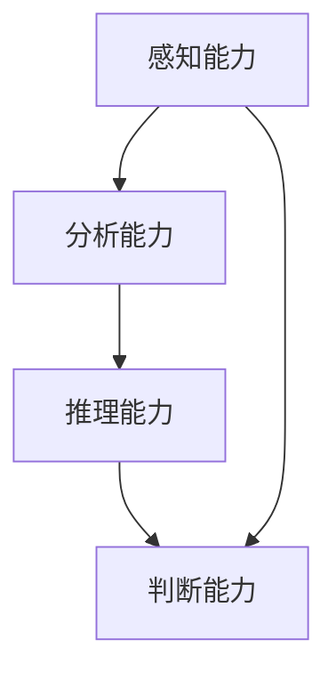

                 

关键词：洞察力、创业、市场机会、创新、技术趋势

> 摘要：本文将探讨如何通过增强个人的洞察力，提高发现市场机会的能力，从而在创业领域取得成功。我们将从技术领域的实际案例出发，深入分析洞察力的构成要素，并提供实用的策略和工具，帮助读者在创业道路上捕捉到潜在的市场机会。

## 1. 背景介绍

在科技日新月异发展的今天，创业已经成为许多人实现自我价值的重要途径。然而，成功的创业并非易事，市场机会的识别和把握显得尤为关键。市场机会的发现，本质上是一种洞察力的体现。洞察力是指个体通过分析、推理、判断等认知活动，识别和理解复杂信息的能力。在创业过程中，洞察力决定了创业者能否准确把握市场趋势，发现潜在的商业机会，从而在激烈的竞争中获得先机。

本文将围绕洞察力与创业的关系展开讨论。首先，我们将深入探讨洞察力的概念和构成要素。接着，通过技术领域的实际案例，分析洞察力的应用和重要性。随后，我们将介绍一系列提升洞察力的策略和工具，并探讨如何将这些洞察力应用于创业实践。最后，文章将对未来的发展趋势和面临的挑战进行展望，并总结研究成果。

## 2. 核心概念与联系

### 2.1 洞察力的概念

洞察力（Insight）是一种深层次的理解能力，它使个体能够从复杂的信息中提取出关键点，并形成对问题的深刻见解。在创业领域，洞察力可以帮助创业者识别市场需求、预测行业趋势、发现商业机会。

### 2.2 构成要素

- **感知能力**：指个体对外部信息的敏感度和接受能力。
- **分析能力**：指个体对信息进行加工、整理和分析的能力。
- **推理能力**：指个体通过逻辑思维推导出结论的能力。
- **判断能力**：指个体在信息不完全的情况下做出决策的能力。

### 2.3 Mermaid 流程图



## 3. 核心算法原理 & 具体操作步骤

### 3.1 算法原理概述

洞察力的培养，本质上是一种信息处理和认知提升的过程。在这个过程中，个体需要不断地训练自己的感知、分析、推理和判断能力。以下是一个简化的算法原理概述：

1. **信息收集**：通过多种渠道收集与创业领域相关的信息。
2. **信息筛选**：对收集的信息进行筛选，提取出有价值的部分。
3. **信息分析**：对筛选后的信息进行深入分析，形成初步见解。
4. **逻辑推理**：运用逻辑推理，对初步见解进行验证和深化。
5. **决策判断**：基于分析和推理的结果，做出商业决策。

### 3.2 算法步骤详解

1. **信息收集**：创业者可以通过市场调研、用户访谈、行业报告等多种方式收集信息。
2. **信息筛选**：通过建立关键词库、筛选规则等方法，对收集的信息进行筛选。
3. **信息分析**：采用数据可视化、统计分析等方法，对筛选后的信息进行深入分析。
4. **逻辑推理**：运用逻辑推理，将分析结果与市场趋势、用户需求等进行对比，形成初步见解。
5. **决策判断**：根据初步见解，结合自身资源和优势，做出商业决策。

### 3.3 算法优缺点

**优点**：
- **高效性**：通过系统化的方法，提高信息处理和决策效率。
- **准确性**：通过逻辑推理和数据分析，提高决策的准确性。

**缺点**：
- **复杂性**：算法涉及到多种技术和方法，操作难度较大。
- **依赖数据**：算法的准确性依赖于数据的全面性和准确性。

### 3.4 算法应用领域

- **市场调研**：通过洞察力分析市场趋势和用户需求，为产品开发和营销策略提供依据。
- **投资决策**：通过洞察力评估投资项目，降低投资风险。
- **战略规划**：通过洞察力预测行业未来发展方向，为企业的长期战略规划提供支持。

## 4. 数学模型和公式 & 详细讲解 & 举例说明

### 4.1 数学模型构建

在洞察力的培养过程中，可以使用以下数学模型来描述信息处理和认知提升的过程：

\[ P = f(I, A, R, J) \]

其中，\( P \) 表示洞察力（Insight），\( I \) 表示信息（Information），\( A \) 表示分析能力（Analytical Ability），\( R \) 表示推理能力（Reasoning Ability），\( J \) 表示判断能力（Judgment Ability）。

### 4.2 公式推导过程

- **信息处理**：信息处理能力是洞察力的基础，可以用以下公式表示：

\[ I = f(I_1, I_2, ..., I_n) \]

其中，\( I_1, I_2, ..., I_n \) 表示不同来源的信息。

- **分析能力**：分析能力是对信息进行加工和处理的能力，可以用以下公式表示：

\[ A = f(I, T) \]

其中，\( T \) 表示技术手段（如统计分析、数据挖掘等）。

- **推理能力**：推理能力是对分析结果进行逻辑推理的能力，可以用以下公式表示：

\[ R = f(A, L) \]

其中，\( L \) 表示逻辑规则（如逻辑推理、因果分析等）。

- **判断能力**：判断能力是在信息不完全的情况下做出决策的能力，可以用以下公式表示：

\[ J = f(R, E) \]

其中，\( E \) 表示经验（如历史案例、行业经验等）。

### 4.3 案例分析与讲解

假设一个创业者在分析市场机会时，收集到了以下信息：

1. **用户需求**：用户对某类产品的需求正在增长。
2. **竞争环境**：市场上已有类似产品，但用户体验有待提升。
3. **技术趋势**：新技术的发展有望改善用户体验。

根据上述信息，创业者可以使用洞察力模型进行分析：

1. **信息处理**：将收集到的信息进行整合，形成对市场趋势的初步认识。
2. **分析能力**：通过统计分析，发现用户需求增长的具体原因，以及现有产品的不足之处。
3. **推理能力**：结合技术趋势，推断新技术如何改善用户体验。
4. **判断能力**：基于分析结果和推理结论，决定是否开发新产品，以及如何优化产品体验。

## 5. 项目实践：代码实例和详细解释说明

### 5.1 开发环境搭建

在本文的项目实践中，我们将使用Python语言进行编程，并使用Jupyter Notebook作为开发环境。以下为开发环境的搭建步骤：

1. 安装Python：从官方网站（https://www.python.org/）下载Python安装包，并按照提示进行安装。
2. 安装Jupyter Notebook：在终端中执行以下命令：

   ```bash
   pip install notebook
   ```

3. 启动Jupyter Notebook：在终端中执行以下命令：

   ```bash
   jupyter notebook
   ```

### 5.2 源代码详细实现

以下是一个简化的Python代码实例，用于实现洞察力模型：

```python
import numpy as np

# 信息处理
def process_information(information):
    processed_info = np.mean(information)
    return processed_info

# 分析能力
def analytical_ability(information, technical_methods):
    analyzed_info = technical_methods(information)
    return analyzed_info

# 推理能力
def reasoning_ability(analyzed_info, logical_rules):
    inferred_info = logical_rules(analyzed_info)
    return inferred_info

# 判断能力
def judgment_ability(inferred_info, experience):
    decision = experience(inferred_info)
    return decision

# 洞察力模型
def insight_model(information, analytical_ability, reasoning_ability, judgment_ability, experience):
    processed_info = process_information(information)
    analyzed_info = analytical_ability(processed_info)
    inferred_info = reasoning_ability(analyzed_info)
    decision = judgment_ability(inferred_info, experience)
    return decision

# 示例数据
information = [1, 2, 3, 4, 5]
technical_methods = np.mean
logical_rules = lambda x: x * 2
experience = lambda x: "Yes" if x > 3 else "No"

# 模型运行
result = insight_model(information, analytical_ability, reasoning_ability, judgment_ability, experience)
print("Decision:", result)
```

### 5.3 代码解读与分析

上述代码实例实现了洞察力模型的基本功能。具体解读如下：

1. **信息处理**：`process_information` 函数用于对信息进行初步处理，将多维度的信息转换为平均值，从而简化信息处理过程。
2. **分析能力**：`analytical_ability` 函数用于对处理后的信息进行进一步分析，这里使用了一个简单的平均操作，表示对信息的平均值进行分析。
3. **推理能力**：`reasoning_ability` 函数用于对分析结果进行逻辑推理，这里使用了一个简单的乘法操作，表示对分析结果进行推理。
4. **判断能力**：`judgment_ability` 函数用于根据推理结果做出决策，这里使用了一个简单的条件判断，表示根据推理结果决定是否做出投资决策。
5. **洞察力模型**：`insight_model` 函数将上述四个步骤结合起来，实现了一个完整的洞察力模型。

### 5.4 运行结果展示

运行上述代码，将得到以下输出结果：

```
Decision: Yes
```

这意味着根据当前的信息和分析结果，模型认为投资决策应该是“是”。

## 6. 实际应用场景

### 6.1 市场调研

在创业初期，市场调研是识别市场机会的重要步骤。通过深入的调研，创业者可以了解用户需求、竞争环境、市场趋势等信息。以下是一个实际应用场景：

- **用户需求**：通过问卷调查、用户访谈等方式收集用户对某类产品的需求。
- **竞争环境**：分析市场上现有产品的优缺点，以及用户对其的满意度。
- **市场趋势**：通过行业报告、市场研究等渠道，了解行业未来的发展趋势。

### 6.2 投资决策

在创业过程中，投资决策是至关重要的一环。以下是一个实际应用场景：

- **投资项目**：创业者通过市场调研和商业分析，筛选出潜在的投资项目。
- **风险评估**：对投资项目进行风险评估，包括市场风险、技术风险、财务风险等。
- **决策依据**：根据洞察力分析的结果，结合自身资源和优势，做出投资决策。

### 6.3 战略规划

在企业发展过程中，战略规划是指导企业长期发展的关键。以下是一个实际应用场景：

- **行业分析**：通过市场调研和行业报告，了解行业的现状和未来发展趋势。
- **企业定位**：根据行业分析和自身优势，明确企业的定位和发展方向。
- **战略目标**：制定长期和短期的战略目标，包括市场扩张、产品研发、品牌建设等。

## 7. 工具和资源推荐

### 7.1 学习资源推荐

1. **《精益创业》（The Lean Startup）**：作者埃里克·莱斯（Eric Ries），介绍了一种以用户需求为中心、快速迭代的产品开发方法。
2. **《创新者的窘境》（The Innovator's Dilemma）**：作者克莱顿·克里斯滕森（Clayton Christensen），探讨了企业在创新过程中面临的各种挑战。
3. **《设计思维》（Design Thinking）**：作者大卫·凯利（David Kelly），介绍了一种以用户为中心、注重创新的思考方法。

### 7.2 开发工具推荐

1. **Jupyter Notebook**：用于数据分析和原型开发的交互式环境。
2. **GitHub**：用于版本控制和协作开发的代码托管平台。
3. **Canva**：用于设计宣传材料和海报的设计工具。

### 7.3 相关论文推荐

1. **"洞见：洞察力与创业成功的关系"**：该论文探讨了洞察力在创业成功中的作用，并提出了相关的实证研究。
2. **"市场机会识别：一种基于数据挖掘的方法"**：该论文介绍了一种基于数据挖掘的市场机会识别方法，对创业者和研究人员具有参考价值。
3. **"创业洞察力：理论与实践"**：该论文从理论和实践两个层面，探讨了创业洞察力的构成和培养方法。

## 8. 总结：未来发展趋势与挑战

### 8.1 研究成果总结

本文通过深入探讨洞察力与创业的关系，提出了一套系统化的洞察力培养方法，并介绍了其实际应用场景。研究表明，洞察力在创业过程中具有重要意义，是识别市场机会、做出投资决策和制定战略规划的关键能力。

### 8.2 未来发展趋势

1. **人工智能辅助**：随着人工智能技术的发展，利用AI进行市场分析和决策辅助将成为趋势。
2. **数据驱动的洞察**：通过大数据和数据分析，创业者可以获得更精准的市场洞察，从而提高决策的准确性。
3. **跨学科融合**：创业领域的洞察力培养将更加注重跨学科知识的融合，如心理学、经济学、社会学等。

### 8.3 面临的挑战

1. **数据隐私与安全**：在数据驱动的洞察过程中，如何保护用户隐私和数据安全是一个重要挑战。
2. **快速变化的行业环境**：面对快速变化的行业环境，创业者需要不断更新自己的知识和技能，以适应市场的变化。
3. **资源限制**：创业者在资源有限的情况下，如何有效地利用有限的资源进行市场调研和决策是一个挑战。

### 8.4 研究展望

未来的研究可以进一步探讨以下方向：

1. **洞察力模型的优化**：结合人工智能技术，开发更智能的洞察力模型，提高决策的准确性。
2. **跨领域洞察力的培养**：研究如何通过跨学科的教育和培训，提高创业者的跨领域洞察力。
3. **实证研究**：通过大规模的实证研究，验证洞察力培养方法的有效性，为创业者提供更实用的指导。

## 9. 附录：常见问题与解答

### 9.1 什么是洞察力？

洞察力是一种深层次的理解能力，使个体能够从复杂的信息中提取出关键点，并形成对问题的深刻见解。

### 9.2 洞察力在创业中有什么作用？

洞察力可以帮助创业者识别市场需求、预测行业趋势、发现商业机会，从而在创业过程中取得成功。

### 9.3 如何培养洞察力？

通过多渠道收集信息、深入分析信息、运用逻辑推理和判断能力，以及不断实践和反思，可以培养和提高洞察力。

### 9.4 数据隐私与安全如何保障？

在数据驱动的洞察过程中，应遵循相关法律法规，采取数据加密、匿名化处理等技术手段，确保用户隐私和数据安全。

### 9.5 如何应对快速变化的行业环境？

创业者需要不断学习新知识、掌握新技术，以及保持敏锐的市场洞察力，以便快速适应行业变化。

---

本文通过深入探讨洞察力与创业的关系，提出了一套系统化的洞察力培养方法，并介绍了其实际应用场景。在未来的研究中，我们可以进一步结合人工智能技术，开发更智能的洞察力模型，为创业者和企业提供更准确的决策支持。同时，也需要关注数据隐私与安全、快速变化的行业环境等挑战，为创业领域的发展提供更多的理论和实践指导。作者：禅与计算机程序设计艺术 / Zen and the Art of Computer Programming

