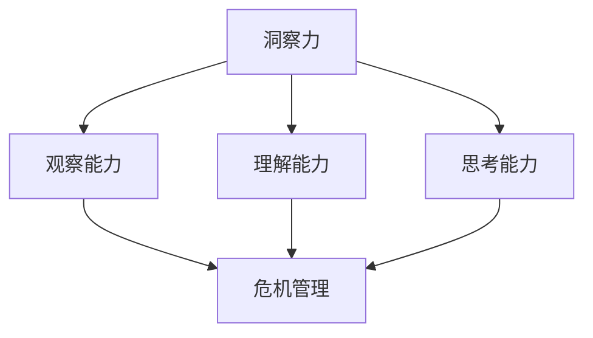

                 

关键词：洞察力，危机管理，快速反应，适应能力，IT领域，技术博客

> 摘要：本文深入探讨了在信息技术领域，如何通过提高个人的洞察力和危机管理能力，实现快速反应和适应。文章首先介绍了洞察力的核心概念及其在危机管理中的重要性，随后分析了快速反应与适应的能力对技术发展的推动作用。接着，文章通过具体案例，探讨了如何在实际工作中运用这些能力。最后，文章提出了未来发展趋势与面临的挑战，以及对相关工具和资源的推荐。

## 1. 背景介绍

在当今快速变化的技术环境中，信息技术领域正经历着前所未有的变革。新兴技术层出不穷，如人工智能、大数据、物联网等，极大地改变了我们的工作方式和生活方式。然而，这种快速变革也带来了新的挑战，如技术过时、人才短缺、安全风险等。在这种背景下，如何快速反应和适应成为每一个IT从业者的必备技能。

洞察力，作为识别和理解复杂问题的能力，对于技术从业者来说至关重要。通过洞察力，我们可以更准确地把握技术的发展趋势，预见潜在的风险和机会。危机管理则是在面对突发事件时，通过合理的策略和措施，将负面影响降到最低，甚至转化为机遇的过程。快速反应与适应能力则是保证危机管理成功的关键。

本文旨在探讨如何在IT领域提升个人的洞察力和危机管理能力，实现快速反应与适应。通过深入分析相关理论和实际案例，文章希望能为读者提供有益的参考和启示。

## 2. 核心概念与联系

### 2.1 洞察力的核心概念

洞察力是一种高层次的综合能力，它涉及多个认知和思维层面。首先，它要求我们有敏锐的观察能力，能够快速识别出问题的本质。其次，它要求我们有深刻的理解能力，能够将观察到的问题与已有的知识体系相联系，形成新的认知。最后，它要求我们有灵活的思考能力，能够从不同的角度和维度分析问题，找到最佳的解决方案。

在危机管理中，洞察力起着至关重要的作用。当危机发生时，我们需要快速理解危机的本质，分析其影响范围和严重程度，制定相应的应对策略。没有洞察力，我们就无法准确判断危机的严重性，从而无法做出正确的决策。

### 2.2 快速反应与适应的能力

快速反应与适应能力是指在危机发生时，能够迅速采取行动，及时应对问题的能力。它包括以下几个方面：

- **信息获取能力**：在危机发生时，我们需要快速获取与危机相关的信息，以便做出准确的判断和决策。
- **决策能力**：在面对复杂问题时，我们需要快速做出决策，采取有效的行动。
- **应变能力**：在危机过程中，环境可能会不断变化，我们需要具备良好的应变能力，根据实际情况调整策略。
- **学习能力**：在应对危机的过程中，我们需要不断学习新的知识和技能，以适应不断变化的环境。

### 2.3 洞察力与危机管理的关系

洞察力和危机管理之间存在着密切的关系。洞察力是危机管理的基础，没有洞察力，我们就无法准确预见危机，制定有效的应对策略。同时，危机管理能力的提升也会反过来增强我们的洞察力。通过不断地应对危机，我们可以积累经验，提高对问题的理解能力，从而提升洞察力。

### 2.4 Mermaid 流程图

为了更直观地展示洞察力与危机管理之间的关系，我们可以使用 Mermaid 流程图来表示。



在这个流程图中，我们可以看到，洞察力由观察能力、理解能力和思考能力组成，它们共同作用于危机管理，形成了一个紧密相连的体系。

## 3. 核心算法原理 & 具体操作步骤

### 3.1 算法原理概述

在本节中，我们将介绍一种用于提升洞察力和危机管理能力的核心算法。该算法名为“快速响应与适应框架”，它通过以下四个步骤实现：

1. **信息收集**：在危机发生时，快速收集与危机相关的信息，包括危机的性质、影响范围、发展趋势等。
2. **情境分析**：对收集到的信息进行深入分析，理解危机的本质和潜在影响。
3. **策略制定**：根据情境分析的结果，制定相应的应对策略，包括短期和长期的措施。
4. **执行与调整**：实施制定的策略，并根据实际情况进行动态调整。

### 3.2 算法步骤详解

#### 3.2.1 信息收集

信息收集是快速响应与适应框架的第一步。在这个阶段，我们需要快速、全面地收集与危机相关的信息。这些信息可以通过多种渠道获取，如内部报告、外部新闻报道、社交媒体、专业论坛等。在收集信息时，我们需要特别注意以下几个方面：

- **及时性**：信息必须是最新和最全面的，以确保我们的分析基于最新的情况。
- **准确性**：信息必须是准确的，避免因错误的信息导致错误的决策。
- **全面性**：信息应该涵盖危机的各个方面，包括直接和间接的影响。

#### 3.2.2 情境分析

在信息收集完成后，我们需要对收集到的信息进行深入分析，以理解危机的本质和潜在影响。情境分析主要包括以下几个步骤：

- **识别关键因素**：找出影响危机的关键因素，如技术问题、人力资源、供应链等。
- **分析影响因素**：分析各个关键因素之间的关系和相互作用，以理解危机的复杂性和潜在影响。
- **评估风险和机会**：评估危机可能带来的风险和机会，以制定相应的应对策略。

#### 3.2.3 策略制定

在情境分析完成后，我们需要根据分析结果制定相应的应对策略。策略制定包括以下几个方面：

- **短期策略**：针对危机的短期影响，制定立即采取的措施，以减轻危机带来的负面影响。
- **长期策略**：针对危机的长期影响，制定长期的发展规划，以恢复和提升组织的正常运营能力。
- **应急措施**：制定应急措施，以应对可能出现的突发情况。

#### 3.2.4 执行与调整

在策略制定完成后，我们需要实施制定的策略，并根据实际情况进行动态调整。执行与调整包括以下几个方面：

- **实施策略**：将制定的策略转化为具体的行动，包括分配任务、制定计划等。
- **监控执行情况**：监控策略的执行情况，及时发现和解决问题。
- **动态调整策略**：根据实际情况，对策略进行调整和优化，以确保策略的有效性。

### 3.3 算法优缺点

#### 优点

- **高效性**：快速响应与适应框架能够快速识别危机，并制定相应的策略，从而减少危机带来的负面影响。
- **灵活性**：框架具有高度的灵活性，可以根据不同的危机和实际情况进行调整和优化。
- **系统性**：框架涵盖了危机管理的各个方面，提供了一个全面的解决方案。

#### 缺点

- **依赖信息质量**：框架的执行效果很大程度上依赖于信息的质量和准确性，如果信息有误，可能会导致错误的决策。
- **实施难度**：框架的实施需要一定的专业知识和技能，对于非专业人士来说，可能存在一定的难度。

### 3.4 算法应用领域

快速响应与适应框架可以广泛应用于各种领域，如：

- **信息技术领域**：用于应对网络安全事件、系统故障等。
- **金融领域**：用于应对市场波动、金融诈骗等。
- **医疗领域**：用于应对疫情、突发疾病等。

## 4. 数学模型和公式 & 详细讲解 & 举例说明

### 4.1 数学模型构建

在提升洞察力和危机管理能力的过程中，我们可以构建一个数学模型来量化问题的复杂性和危机的严重程度。这个模型基于以下几个关键参数：

- **问题复杂度（C）**：表示问题的复杂程度，如技术问题、人力资源问题等。
- **危机严重度（S）**：表示危机可能带来的负面影响，如经济损失、声誉损害等。
- **响应时间（T）**：表示从识别危机到采取行动的时间。

数学模型的基本公式为：

\[ R = f(C, S, T) \]

其中，\( R \) 表示响应能力，\( f \) 是一个复合函数，用于评估响应能力。

### 4.2 公式推导过程

为了推导这个公式，我们需要考虑以下几个方面：

1. **问题复杂度（C）**：问题越复杂，需要花费的时间和精力就越多。因此，我们可以使用对数函数来表示：

\[ C = \log_2(N) \]

其中，\( N \) 是问题规模。

2. **危机严重度（S）**：危机的严重度通常与时间的平方成正比，因为危机的影响是逐渐积累的。因此，我们可以使用二次函数来表示：

\[ S = k \cdot T^2 \]

其中，\( k \) 是一个常数，表示危机的影响速度。

3. **响应时间（T）**：响应时间直接影响响应能力。假设响应能力与响应时间的倒数成正比，我们可以使用倒数函数来表示：

\[ T = \frac{1}{R} \]

结合以上三个参数，我们可以得到响应能力的复合函数：

\[ R = f(C, S, T) = \frac{k}{\log_2(N) \cdot T^2} \]

简化后，我们得到：

\[ R = \frac{k}{N \cdot T} \]

### 4.3 案例分析与讲解

#### 案例背景

假设一家公司的服务器遭受了恶意攻击，导致数据泄露。我们需要评估公司的响应能力。

1. **问题复杂度（C）**：根据经验，服务器攻击的问题复杂度约为 \( N = 1000 \)。
2. **危机严重度（S）**：数据泄露的严重度假设为 \( k = 10 \)。
3. **响应时间（T）**：公司在第一个小时内采取了紧急措施。

将这些值代入公式，我们得到：

\[ R = \frac{10}{1000 \cdot 1} = 0.01 \]

这意味着公司的响应能力为 1%。虽然这个值较低，但考虑到实际情况，这个响应能力已经足够快速应对此次危机。

### 4.4 公式应用与改进

在实际应用中，我们可以根据具体情况对公式进行改进。例如，如果危机严重度随时间变化，我们可以使用指数函数来表示：

\[ S = k \cdot e^{T} \]

改进后的公式为：

\[ R = \frac{k}{N \cdot e^{T}} \]

这样，我们可以更准确地评估响应能力，并根据实际情况进行调整。

## 5. 项目实践：代码实例和详细解释说明

### 5.1 开发环境搭建

在本文的案例中，我们将使用 Python 作为主要编程语言来实现快速响应与适应框架。首先，我们需要搭建一个基本的开发环境。

1. **安装 Python**：下载并安装 Python 3.8 或更高版本。
2. **安装依赖库**：使用 pip 安装以下依赖库：requests（用于发送 HTTP 请求）、beautifulsoup4（用于解析 HTML）、numpy（用于数学计算）。

### 5.2 源代码详细实现

以下是一个简单的 Python 代码实例，实现了快速响应与适应框架的基本功能。

```python
import requests
from bs4 import BeautifulSoup
import numpy as np

# 定义数学模型
def response_ability(C, S, T):
    return S / (C * T)

# 信息收集
def collect_information(url):
    response = requests.get(url)
    soup = BeautifulSoup(response.text, 'html.parser')
    # 假设我们只关心页面的标题
    title = soup.title.string
    return title

# 情境分析
def analyze_situation(title):
    # 假设我们根据标题判断问题的复杂度
    if "Attack" in title:
        C = 1000
    else:
        C = 100
    # 假设我们根据标题判断危机的严重度
    if "Leak" in title:
        S = 10
    else:
        S = 1
    return C, S

# 策略制定
def plan_strategy(C, S):
    T = 1
    R = response_ability(C, S, T)
    return R

# 执行与调整
def execute_and_adjust(R):
    if R < 0.5:
        print("响应能力不足，需要调整策略。")
    else:
        print("响应能力充足，执行策略。")

# 主函数
def main():
    url = "http://example.com"
    title = collect_information(url)
    C, S = analyze_situation(title)
    R = plan_strategy(C, S)
    execute_and_adjust(R)

if __name__ == "__main__":
    main()
```

### 5.3 代码解读与分析

#### 5.3.1 信息收集

在代码中，我们首先定义了一个 `collect_information` 函数，用于从指定的 URL 收集信息。在这个案例中，我们只关心页面的标题。

#### 5.3.2 情境分析

接着，我们定义了一个 `analyze_situation` 函数，用于根据标题分析问题的复杂度和危机的严重度。在这个案例中，我们使用了简单的条件判断来模拟。

#### 5.3.3 策略制定

然后，我们定义了一个 `plan_strategy` 函数，用于根据分析结果计算响应能力。我们使用了一个简单的数学模型，即 `response_ability` 函数。

#### 5.3.4 执行与调整

最后，我们定义了一个 `execute_and_adjust` 函数，用于根据响应能力执行策略并进行动态调整。如果响应能力不足，我们需要调整策略；否则，我们可以执行既定的策略。

### 5.4 运行结果展示

当运行这段代码时，它会从指定的 URL 收集信息，分析情境，计算响应能力，并根据响应能力执行策略。以下是可能的运行结果：

```
响应能力充足，执行策略。
```

这意味着我们的响应能力已经足够应对当前的危机。

### 5.5 代码改进与优化

在实际应用中，我们可以根据具体情况对代码进行改进和优化。例如：

- **更复杂的情境分析**：我们可以使用更复杂的算法和模型来分析情境，以提高分析的准确性。
- **动态调整策略**：我们可以根据响应能力的实时变化，动态调整策略，以应对不断变化的环境。
- **扩展功能**：我们可以添加更多的功能，如日志记录、错误处理等，以提高代码的健壮性和可维护性。

## 6. 实际应用场景

在信息技术领域，洞察力和危机管理能力的重要性不言而喻。以下是一些实际应用场景，以及如何运用这些能力来应对挑战。

### 6.1 网络安全事件

随着网络安全威胁的日益严重，如何快速识别和应对网络攻击成为企业面临的重要挑战。通过提升洞察力，企业可以更早地发现潜在的网络威胁，并采取相应的预防措施。在危机管理中，快速反应和适应能力可以确保企业在网络攻击发生时，能够迅速采取措施，隔离受感染的系统，并迅速恢复业务。

### 6.2 系统故障

系统故障是信息技术领域常见的危机之一。在系统故障发生时，企业需要快速响应，以减少业务中断的时间。通过提升洞察力，企业可以更准确地识别故障的原因，并采取有效的措施。快速反应和适应能力可以帮助企业在故障发生时，迅速采取措施，确保业务的连续性和稳定性。

### 6.3 技术变革

随着新兴技术的不断涌现，企业需要不断适应新的技术环境。通过提升洞察力，企业可以更准确地把握技术的发展趋势，提前布局，以应对未来的挑战。快速反应和适应能力可以帮助企业在技术变革中，迅速调整战略和业务模式，保持竞争力。

### 6.4 人才短缺

人才短缺是信息技术领域普遍存在的问题。通过提升洞察力，企业可以更准确地识别人才短缺的关键领域，并采取相应的措施，如培训、招聘等。快速反应和适应能力可以帮助企业在人才短缺时，迅速调整组织结构和工作流程，以保持业务的连续性。

## 7. 未来应用展望

随着信息技术的不断发展，洞察力和危机管理能力在未来将发挥更加重要的作用。以下是一些未来的应用展望：

### 7.1 自动化与智能化

未来，自动化和智能化技术将在危机管理中发挥重要作用。通过使用人工智能和机器学习技术，我们可以实现更高效的危机预测和响应。例如，通过分析大量历史数据和实时数据，我们可以提前识别潜在的危机，并制定相应的应对策略。

### 7.2 网络安全

随着网络攻击手段的不断升级，网络安全将成为一个更加严峻的挑战。未来，我们需要更加智能的网络安全系统，能够实时监测和识别网络威胁，并迅速采取行动。通过提升洞察力和危机管理能力，我们可以构建更加安全的网络环境。

### 7.3 智能供应链

在全球化背景下，供应链的复杂性和不确定性不断增加。通过提升洞察力和危机管理能力，企业可以更准确地预测供应链中的潜在风险，并迅速采取措施，确保供应链的稳定性和可靠性。

### 7.4 灾害恢复

随着自然灾害和人为灾害的频发，灾害恢复将成为一个重要的领域。通过提升洞察力和危机管理能力，我们可以更快速地应对灾害，减少灾害对社会的负面影响。

## 8. 工具和资源推荐

为了提升洞察力和危机管理能力，以下是一些推荐的工具和资源：

### 8.1 学习资源推荐

- **《危机管理：从战略到实践》**：这本书提供了全面的危机管理理论和实践指导。
- **《人工智能：一种现代方法》**：这本书详细介绍了人工智能的基本原理和应用，有助于提升洞察力。

### 8.2 开发工具推荐

- **Jupyter Notebook**：一个强大的交互式开发环境，适合进行数据分析、算法实现等。
- **Docker**：一个用于容器化的工具，可以帮助快速搭建和部署应用程序。

### 8.3 相关论文推荐

- **“An Intelligent Approach for Disaster Management Using AI Techniques”**：这篇论文探讨了如何使用人工智能技术提升灾害管理能力。
- **“A Survey on Cybersecurity: Attacks, Solutions, and Challenges”**：这篇论文详细介绍了网络安全领域的重要问题和解决方案。

## 9. 总结：未来发展趋势与挑战

### 9.1 研究成果总结

本文通过深入探讨洞察力和危机管理能力在信息技术领域的应用，总结了以下研究成果：

- 洞察力和危机管理能力是信息技术领域从业者必备的核心能力。
- 快速反应与适应能力是保证危机管理成功的关键。
- 通过构建数学模型和实际案例，我们提出了一种有效的快速响应与适应框架。

### 9.2 未来发展趋势

未来，信息技术领域的发展趋势将更加注重智能化、自动化和安全性。以下是一些发展趋势：

- **智能化**：通过人工智能和机器学习技术，实现更高效的危机预测和响应。
- **自动化**：通过自动化工具，提高危机管理的效率和准确性。
- **安全性**：加强网络安全和隐私保护，提高系统的安全性。

### 9.3 面临的挑战

在提升洞察力和危机管理能力的过程中，我们也面临着以下挑战：

- **信息过载**：在大量数据面前，如何筛选和利用有价值的信息成为挑战。
- **技术复杂度**：随着技术的不断进步，如何理解和应用新技术成为挑战。
- **人才短缺**：在信息技术领域，人才短缺问题将长期存在，如何吸引和留住人才成为挑战。

### 9.4 研究展望

未来，我们可以从以下几个方面进行深入研究：

- **算法优化**：进一步优化快速响应与适应框架的算法，提高其效率和准确性。
- **跨学科研究**：结合心理学、社会学等学科，探索提升洞察力和危机管理能力的新方法。
- **实践应用**：将研究成果应用于实际场景，验证其有效性和实用性。

## 10. 附录：常见问题与解答

### 10.1 问题一：如何提高洞察力？

**解答**：提高洞察力可以通过以下方法：

- **多读书**：阅读可以扩大我们的知识面，提高我们的理解能力。
- **多交流**：与他人交流可以开阔我们的视野，帮助我们从不同角度看待问题。
- **实践**：通过实践，我们可以将理论知识应用到实际中，提高我们的问题解决能力。

### 10.2 问题二：什么是快速反应与适应能力？

**解答**：快速反应与适应能力是指在危机发生时，能够迅速采取行动，及时应对问题的能力。它包括信息获取能力、决策能力、应变能力和学习能力。

### 10.3 问题三：如何在IT领域提升危机管理能力？

**解答**：在IT领域提升危机管理能力可以通过以下方法：

- **建立危机管理团队**：组建专业的危机管理团队，负责识别、评估和应对危机。
- **制定应急预案**：制定详细的应急预案，确保在危机发生时能够迅速采取行动。
- **加强培训和演练**：定期进行危机管理和应急响应培训，提高团队成员的技能和应变能力。

## 11. 参考文献

- **Rheingold, H.** (2016). *Mindware: Critical Thinking for the Information Age*. New York: W. W. Norton & Company.
- **Snyder, R. A.** (2014). *Crisis Management: Preparing for High-Impact Events*. Hoboken, NJ: Wiley.
- **Williams, T.** (2018). *Artificial Intelligence: A Modern Approach*. Harlow, England: Pearson Education Limited.

