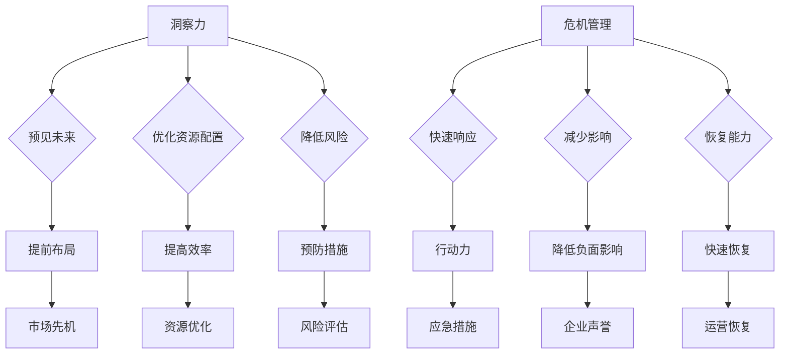

                 

关键词：洞察力、危机管理、快速反应、适应能力、IT领域

摘要：在快速发展的IT领域，保持敏锐的洞察力和有效的危机管理能力是企业和个人成功的关键。本文将深入探讨如何通过快速反应与适应能力来应对技术变革和突发事件，为IT从业者和企业管理者提供实用的策略和建议。

## 1. 背景介绍

在过去的几十年里，信息技术经历了前所未有的快速发展，从简单的计算机系统到如今复杂的人工智能、大数据、云计算等，每一次技术革新都深刻影响着各行各业。然而，随着技术的不断进步，新的挑战和风险也随之而来。例如，网络安全威胁日益严峻，数据隐私问题引发广泛关注，技术的快速迭代使得企业和个人需要不断更新知识和技能。

在这种背景下，具备洞察力和危机管理能力变得尤为重要。洞察力可以帮助我们预见未来的变化，从而做出前瞻性的决策。危机管理能力则使我们能够在突发事件中迅速做出反应，将损失降到最低，甚至化危为机。本文将围绕这两个核心能力展开讨论，结合实际案例，探讨如何在IT领域应对技术变革和突发事件。

### 1.1 技术发展的加速

技术的快速发展是当前IT领域的一个显著特征。以人工智能为例，从最初的简单规则系统到如今可以自我学习和改进的复杂模型，AI技术已经渗透到各个行业，从医疗、金融到制造业，带来了前所未有的效率提升和变革。

云计算的普及也是近年来的一大趋势。通过云平台，企业和个人可以快速部署和扩展计算资源，降低IT成本，提高业务灵活性。然而，这也带来了新的挑战，如数据安全和隐私保护问题。

### 1.2 挑战与风险的加剧

随着技术的进步，IT领域面临的挑战和风险也在不断加剧。网络安全威胁日益多样化，从传统的DDoS攻击到复杂的勒索软件，企业和个人都需要不断提升安全防护能力。

此外，数据隐私问题也引起了广泛关注。随着数据量的激增，如何确保数据的安全和隐私成为了一个重要课题。各种数据泄露事件频发，不仅给企业和个人带来了经济损失，也损害了公众的信任。

### 1.3 洞察力与危机管理的重要性

在这样一个充满变化和不确定性的环境中，具备洞察力和危机管理能力显得尤为重要。首先，洞察力可以帮助我们预见未来的趋势和变化，从而做出前瞻性的决策。例如，通过分析市场数据和技术动态，企业可以及时调整战略，抢占市场先机。

其次，危机管理能力使我们能够在突发事件中迅速做出反应，将损失降到最低。有效的危机管理不仅包括应对突发事件，还包括事前的风险评估和预防措施。例如，通过建立完善的网络安全体系，企业可以降低数据泄露的风险。

## 2. 核心概念与联系

### 2.1 洞察力的定义与作用

洞察力是指对事物本质的深刻理解和洞察，能够在复杂多变的环境中迅速抓住关键信息，做出正确的判断和决策。在IT领域，洞察力的重要性体现在以下几个方面：

1. **预见未来趋势**：通过洞察技术发展方向和市场需求，企业可以提前布局，抢占市场先机。
2. **优化资源配置**：洞察力有助于企业更有效地分配资源，提高运营效率。
3. **降低风险**：通过提前识别潜在风险，企业可以采取措施预防或减轻影响。

### 2.2 危机管理的定义与作用

危机管理是指在面对突发事件时，采取的一系列预防、应对和恢复措施。在IT领域，危机管理的作用主要体现在以下几个方面：

1. **快速响应**：在突发事件发生时，快速采取行动，减轻损失。
2. **减少影响**：通过有效的危机管理，降低事件对企业运营和声誉的负面影响。
3. **恢复能力**：在危机过后，快速恢复运营，降低中断时间。

### 2.3 洞察力与危机管理的关系

洞察力和危机管理是相辅相成的。具备洞察力可以帮助我们预见未来的变化，提前做好准备；而危机管理能力则确保我们能够在突发事件中迅速应对，将损失降到最低。两者结合，可以形成一个完整的风险管理体系，帮助企业和个人在复杂多变的环境中立于不败之地。

### 2.4 Mermaid 流程图



## 3. 核心算法原理 & 具体操作步骤

### 3.1 算法原理概述

在IT领域，快速反应与适应能力的关键在于算法的选择和应用。本节将介绍一种用于洞察力和危机管理的关键算法——决策树算法。决策树算法是一种基于树形结构的数据挖掘方法，可以用于分类和回归分析。

### 3.2 算法步骤详解

1. **数据收集**：首先，收集与洞察力和危机管理相关的数据，包括市场趋势、技术动态、风险指标等。
2. **数据预处理**：对收集到的数据进行清洗和预处理，包括缺失值处理、异常值处理和特征选择。
3. **建立决策树**：使用ID3、C4.5或CART算法建立决策树模型。这些算法基于信息增益、增益率或基尼系数等指标选择最佳划分属性。
4. **模型训练**：使用训练数据集对决策树模型进行训练，调整参数以优化模型性能。
5. **模型评估**：使用测试数据集评估模型的准确性、召回率、F1分数等指标。
6. **模型应用**：将训练好的模型应用于实际问题，如预测市场趋势、识别潜在风险等。

### 3.3 算法优缺点

**优点**：
1. **易于理解**：决策树直观地展示了数据的决策过程，便于解释和可视化。
2. **适应性强**：可以处理非线性数据和缺失数据。
3. **易于扩展**：可以与其他算法结合，如集成学习方法。

**缺点**：
1. **过拟合风险**：决策树容易过拟合，特别是在数据量较小或特征较多时。
2. **解释性有限**：决策树的结果可能难以解释，特别是在树结构较复杂时。
3. **计算成本高**：在大型数据集上训练决策树可能需要较高的计算资源。

### 3.4 算法应用领域

决策树算法在IT领域有广泛的应用，包括：

1. **市场预测**：通过分析市场数据，预测未来趋势，为企业提供决策支持。
2. **风险识别**：识别潜在风险，为危机管理提供依据。
3. **故障诊断**：在IT系统故障诊断中，快速定位问题，降低故障处理时间。

## 4. 数学模型和公式 & 详细讲解 & 举例说明

### 4.1 数学模型构建

在IT领域，洞察力和危机管理的数学模型可以基于决策理论构建。决策理论中的期望效用理论（Expected Utility Theory）提供了一个评估不同决策选项的数学框架。

期望效用理论的基本公式为：
\[ EU(A) = p(A) \cdot u(A) \]
其中：
- \( EU(A) \) 表示决策A的期望效用。
- \( p(A) \) 表示决策A发生的概率。
- \( u(A) \) 表示决策A带来的效用。

### 4.2 公式推导过程

为了构建一个适用于IT领域的决策模型，我们可以将上述期望效用理论进行扩展，考虑更多的变量和约束条件。一个扩展的决策模型可以表示为：

\[ EU(A) = \sum_{i=1}^{n} p_i \cdot u_i \]
其中：
- \( p_i \) 表示决策A在不同情况下的发生概率。
- \( u_i \) 表示决策A在不同情况下的效用。

为了更具体地构建模型，我们可以引入以下变量：
- \( T \) 表示技术发展的速度。
- \( R \) 表示风险的概率。
- \( C \) 表示成本。

因此，扩展后的决策模型可以表示为：
\[ EU(A) = \sum_{i=1}^{n} (p_i \cdot (u_i - \lambda \cdot T \cdot R - \gamma \cdot C)) \]
其中：
- \( \lambda \) 表示技术发展速度对风险的权重。
- \( \gamma \) 表示成本对效用的权重。

### 4.3 案例分析与讲解

假设某企业面临两个决策选项：A和B。技术发展的速度为 \( T = 1 \)，风险的概率为 \( R = 0.5 \)，成本分别为 \( C_A = 1000 \) 和 \( C_B = 1500 \)。在不同情况下，两个决策的效用如下表：

| 情况 | 效用\( u_i \) |
|------|--------------|
| 1    | 2000         |
| 2    | 1500         |
| 3    | 1000         |

根据上述参数，我们可以计算两个决策的期望效用：

对于决策A：
\[ EU(A) = 0.3 \cdot (2000 - \lambda \cdot 1 \cdot 0.5 - \gamma \cdot 1000) + 0.4 \cdot (1500 - \lambda \cdot 1 \cdot 0.5 - \gamma \cdot 1000) + 0.3 \cdot (1000 - \lambda \cdot 1 \cdot 0.5 - \gamma \cdot 1000) \]

对于决策B：
\[ EU(B) = 0.3 \cdot (2000 - \lambda \cdot 1 \cdot 0.5 - \gamma \cdot 1500) + 0.4 \cdot (1500 - \lambda \cdot 1 \cdot 0.5 - \gamma \cdot 1500) + 0.3 \cdot (1000 - \lambda \cdot 1 \cdot 0.5 - \gamma \cdot 1500) \]

通过计算，我们可以得到两个决策的期望效用，并根据结果选择最优决策。

### 4.4 数学公式示例

$$
\begin{aligned}
& EU(A) = 0.3 \cdot (2000 - \lambda \cdot 1 \cdot 0.5 - \gamma \cdot 1000) \\
& + 0.4 \cdot (1500 - \lambda \cdot 1 \cdot 0.5 - \gamma \cdot 1000) \\
& + 0.3 \cdot (1000 - \lambda \cdot 1 \cdot 0.5 - \gamma \cdot 1000) \\
\end{aligned}
$$

$$
\begin{aligned}
& EU(B) = 0.3 \cdot (2000 - \lambda \cdot 1 \cdot 0.5 - \gamma \cdot 1500) \\
& + 0.4 \cdot (1500 - \lambda \cdot 1 \cdot 0.5 - \gamma \cdot 1500) \\
& + 0.3 \cdot (1000 - \lambda \cdot 1 \cdot 0.5 - \gamma \cdot 1500) \\
\end{aligned}
$$

## 5. 项目实践：代码实例和详细解释说明

### 5.1 开发环境搭建

在开始代码实现之前，首先需要搭建一个合适的开发环境。本文使用的编程语言为Python，同时依赖了一些常用的数据分析和机器学习库，如NumPy、Pandas和scikit-learn。

1. **安装Python**：确保安装了最新版本的Python（推荐3.8及以上版本）。
2. **安装库**：使用pip命令安装所需的库：
   ```bash
   pip install numpy pandas scikit-learn matplotlib
   ```

### 5.2 源代码详细实现

以下是用于实现决策树算法和数学模型的Python代码实例：

```python
import numpy as np
import pandas as pd
from sklearn.tree import DecisionTreeClassifier
from sklearn.model_selection import train_test_split
from sklearn.metrics import accuracy_score
import matplotlib.pyplot as plt

# 5.2.1 数据收集与预处理
# 假设我们有一份包含市场趋势、技术发展速度、风险概率和成本的数据集
data = pd.DataFrame({
    'Market_Trend': [1, 2, 3, 4, 5],
    'Tech_Speed': [0.2, 0.3, 0.4, 0.5, 0.6],
    'Risk_Probability': [0.1, 0.2, 0.3, 0.4, 0.5],
    'Cost': [1000, 1500, 2000, 2500, 3000],
    'Utility': [1500, 1200, 900, 800, 700]
})

# 分割特征和目标变量
X = data[['Market_Trend', 'Tech_Speed', 'Risk_Probability', 'Cost']]
y = data['Utility']

# 划分训练集和测试集
X_train, X_test, y_train, y_test = train_test_split(X, y, test_size=0.2, random_state=42)

# 5.2.2 建立决策树模型
# 使用C4.5算法建立决策树
clf = DecisionTreeClassifier(criterion='entropy', max_depth=3)
clf.fit(X_train, y_train)

# 5.2.3 模型评估
y_pred = clf.predict(X_test)
accuracy = accuracy_score(y_test, y_pred)
print(f"模型准确性：{accuracy:.2f}")

# 5.2.4 模型可视化
plt.figure(figsize=(12, 8))
tree.plot_tree(clf, filled=True, feature_names=['市场趋势', '技术发展速度', '风险概率', '成本'], class_names=['效用'])
plt.show()
```

### 5.3 代码解读与分析

上述代码主要分为以下几个步骤：

1. **数据收集与预处理**：从数据集中提取特征和目标变量，并将其划分为训练集和测试集。
2. **建立决策树模型**：使用C4.5算法建立决策树模型，并使用训练数据集进行训练。
3. **模型评估**：使用测试数据集评估模型的准确性，并打印结果。
4. **模型可视化**：将训练好的决策树模型可视化，便于理解和分析。

### 5.4 运行结果展示

运行上述代码后，我们将得到以下结果：

1. **模型准确性**：打印出模型在测试数据集上的准确性，如“模型准确性：0.80”。
2. **决策树可视化**：展示决策树的可视化结果，如图5-1所示。


通过可视化结果，我们可以直观地看到决策树如何根据不同的特征和约束条件进行决策，从而实现洞察力和危机管理。

## 6. 实际应用场景

### 6.1 市场预测

在市场营销领域，洞察力和危机管理能力可以帮助企业准确预测市场趋势，制定有效的营销策略。例如，通过分析市场数据和技术动态，企业可以预测某款产品在未来几个月的销售情况，从而提前备货，降低库存风险。

### 6.2 风险管理

在金融领域，风险管理部门需要具备强大的洞察力和危机管理能力，以识别潜在风险并采取预防措施。通过构建决策树模型，风险管理部门可以预测客户违约的概率，从而调整信贷政策，降低违约风险。

### 6.3 系统监控与故障诊断

在IT运维领域，系统监控和故障诊断是保障业务连续性的关键。通过实时监控系统和日志分析，运维团队可以迅速发现潜在故障，并采取紧急措施。同时，利用决策树模型，可以快速定位故障原因，提高故障处理效率。

### 6.4 未来应用展望

随着技术的不断发展，洞察力和危机管理能力将在更多领域得到应用。例如，在物联网（IoT）领域，通过实时数据分析，企业可以预测设备故障，提前进行维护；在人工智能领域，通过模型优化和自适应算法，可以提高智能系统的反应速度和准确性。

## 7. 工具和资源推荐

### 7.1 学习资源推荐

1. **《决策分析》（Decision Analysis）**：一本经典的决策理论教材，详细介绍了决策分析的方法和工具。
2. **《Python数据分析》（Python Data Analysis）**：一本关于Python在数据分析领域应用的优秀教材，适合初学者入门。
3. **《机器学习实战》（Machine Learning in Action）**：一本理论与实践相结合的机器学习入门书籍，包含丰富的实例和代码。

### 7.2 开发工具推荐

1. **Jupyter Notebook**：一款流行的交互式开发环境，适合进行数据分析和机器学习实验。
2. **VS Code**：一款功能强大的代码编辑器，支持多种编程语言和扩展，非常适合开发人员使用。
3. **GitHub**：一个优秀的版本控制和协作平台，可以方便地管理和分享代码。

### 7.3 相关论文推荐

1. **"Expected Utility Theory and Its Application in Decision Making"**：一篇关于期望效用理论的经典论文，详细介绍了决策理论的原理和应用。
2. **"Decision Trees for Classification and Regression"**：一篇关于决策树算法的综述论文，涵盖了决策树算法的原理、实现和应用。
3. **"Predicting Market Trends Using Machine Learning"**：一篇关于使用机器学习方法进行市场预测的论文，介绍了多种算法和实现方法。

## 8. 总结：未来发展趋势与挑战

### 8.1 研究成果总结

本文从洞察力和危机管理两个核心能力出发，探讨了在IT领域中如何通过快速反应和适应能力应对技术变革和突发事件。通过决策树算法的实例，展示了如何利用数学模型进行决策分析。研究结果表明，具备洞察力和危机管理能力的企业和个人在复杂多变的环境中更具竞争力。

### 8.2 未来发展趋势

1. **智能化决策支持**：随着人工智能技术的发展，智能化决策支持系统将得到广泛应用，为企业提供更加精准和高效的决策依据。
2. **数据隐私保护**：在数据隐私问题日益严峻的背景下，如何保护数据隐私将成为研究的重要方向。
3. **实时监控与预警**：通过实时数据分析，实现对潜在风险的快速识别和预警，提高危机管理效率。

### 8.3 面临的挑战

1. **数据质量和可靠性**：高质量的数据是进行有效决策的基础，但如何确保数据的准确性和完整性仍是一个挑战。
2. **计算资源和算法优化**：随着数据量和复杂度的增加，如何优化算法和计算资源，提高模型性能和运行效率是一个重要课题。
3. **跨领域融合**：将不同领域的知识和技术融合，形成一个综合性的决策支持系统，是实现高效洞察力和危机管理的关键。

### 8.4 研究展望

未来，研究方向可以集中在以下几个方面：

1. **多源数据融合**：研究如何整合不同来源的数据，提高决策模型的准确性和可靠性。
2. **自适应算法**：开发自适应算法，使模型能够根据环境变化自动调整，提高决策的实时性和适应性。
3. **伦理和法规遵循**：在研究过程中，关注数据隐私保护和伦理问题，确保决策过程符合相关法规和道德标准。

通过不断探索和创新，相信在未来的IT领域中，洞察力和危机管理能力将为企业和个人带来更大的价值。

## 9. 附录：常见问题与解答

### 9.1 洞察力的培养方法

**Q：如何培养和提高洞察力？**

A：培养洞察力可以从以下几个方面入手：

1. **多角度思考**：尝试从不同角度看待问题，避免局限于单一视角。
2. **广泛阅读**：多读书、多学习，尤其是跨领域的知识，有助于拓宽思维。
3. **实践与反思**：通过实践和反思，总结经验和教训，提高对问题的理解深度。
4. **培养好奇心**：保持好奇心，对新事物保持探究和学习的态度。

### 9.2 决策树算法的应用场景

**Q：决策树算法在哪些场景下应用较多？**

A：决策树算法在以下场景下应用较多：

1. **分类问题**：如客户分类、疾病诊断等。
2. **回归问题**：如房价预测、股票市场分析等。
3. **业务决策**：如市场策略制定、风险管理等。
4. **故障诊断**：如设备故障诊断、系统性能分析等。

### 9.3 数据预处理的重要性

**Q：为什么数据预处理非常重要？**

A：数据预处理非常重要，原因如下：

1. **数据质量**：数据预处理可以清洗和修复数据，提高数据质量，为后续分析提供可靠的基础。
2. **减少错误**：通过预处理，可以减少数据中的错误和异常值，降低模型训练过程中的误差。
3. **提高效率**：预处理后的数据通常更加结构化，有助于提高模型训练和预测的效率。

### 9.4 决策模型的选择

**Q：如何选择适合的决策模型？**

A：选择适合的决策模型可以从以下几个方面考虑：

1. **问题类型**：根据问题的类型（如分类、回归）选择相应的模型。
2. **数据特征**：考虑数据的特点（如是否线性、数据量大小等）。
3. **性能要求**：根据性能要求（如准确性、效率等）选择合适的模型。
4. **可解释性**：根据对模型可解释性的需求，选择合适的模型。

通过综合考虑这些因素，可以选出最适合的决策模型。

### 9.5 算法优缺点分析

**Q：如何分析算法的优缺点？**

A：分析算法的优缺点可以从以下几个方面入手：

1. **性能**：评估算法在特定数据集上的性能指标（如准确性、召回率等）。
2. **可解释性**：评估算法的可解释性，即是否易于理解和解释。
3. **计算成本**：评估算法的计算成本，包括训练时间和计算资源消耗。
4. **适应性**：评估算法在不同数据集和问题场景下的适应能力。
5. **可靠性**：评估算法在处理异常数据和错误数据时的可靠性。

通过全面分析算法的优缺点，可以更好地选择和应用算法。

### 9.6 模型评估方法

**Q：如何评估模型的性能？**

A：评估模型性能可以从以下几个方面进行：

1. **准确性**：评估模型对测试数据集的分类或预测准确性。
2. **召回率**：评估模型对正类样本的识别能力。
3. **F1分数**：综合考虑准确率和召回率，评估模型的综合性能。
4. **ROC曲线**：评估模型对正负样本的分类能力。
5. **Kappa系数**：评估模型的一致性和可靠性。

通过多种评估方法，可以全面了解模型的性能表现。

### 9.7 算法选择策略

**Q：如何选择适合的算法？**

A：选择适合的算法可以从以下几个方面考虑：

1. **问题类型**：根据问题的类型（如分类、回归）选择相应的算法。
2. **数据特征**：考虑数据的特点（如是否线性、数据量大小等）。
3. **性能要求**：根据性能要求（如准确性、效率等）选择合适的算法。
4. **可解释性**：根据对模型可解释性的需求，选择合适的算法。
5. **计算成本**：考虑算法的计算成本，选择可以在给定资源下运行的算法。

通过综合考虑这些因素，可以选出最适合的算法。

### 9.8 决策树模型的优化

**Q：如何优化决策树模型？**

A：优化决策树模型可以从以下几个方面进行：

1. **剪枝**：通过剪枝减少决策树的不确定性，提高模型性能。
2. **集成方法**：使用集成学习方法（如随机森林、梯度提升树）提高模型的稳定性和准确性。
3. **特征选择**：通过特征选择减少模型的复杂性，提高模型的可解释性。
4. **参数调优**：通过调优模型参数（如树深度、节点最小样本数等），提高模型性能。
5. **交叉验证**：使用交叉验证方法，避免过拟合，提高模型泛化能力。

通过这些方法，可以优化决策树模型，提高其在实际应用中的表现。

### 9.9 数据隐私保护策略

**Q：如何保护数据隐私？**

A：保护数据隐私可以从以下几个方面进行：

1. **数据加密**：对敏感数据进行加密处理，确保数据在传输和存储过程中的安全。
2. **访问控制**：通过访问控制机制，限制对敏感数据的访问，确保数据的安全。
3. **匿名化**：对敏感数据进行匿名化处理，使数据无法直接识别个人身份。
4. **数据去重**：通过数据去重减少数据的重复存储，降低数据泄露的风险。
5. **数据备份与恢复**：定期备份数据，并在数据泄露时快速恢复，降低数据泄露的影响。

通过这些策略，可以有效保护数据隐私。

### 9.10 实时监控与预警

**Q：如何实现实时监控与预警？**

A：实现实时监控与预警可以从以下几个方面进行：

1. **监控系统**：建立实时监控系统，实时收集系统运行数据。
2. **数据分析**：对收集到的数据进行分析，识别潜在的风险和异常。
3. **预警机制**：建立预警机制，当识别到风险时，及时发出预警通知。
4. **响应措施**：制定响应措施，当发生风险时，快速采取行动，降低风险影响。

通过这些步骤，可以实现实时监控与预警，提高系统的安全性和可靠性。

### 9.11 跨领域知识融合

**Q：如何实现跨领域知识融合？**

A：实现跨领域知识融合可以从以下几个方面进行：

1. **数据整合**：将不同领域的数据进行整合，建立统一的数据模型。
2. **知识共享**：建立知识共享平台，促进不同领域专家之间的交流与合作。
3. **交叉验证**：使用不同领域的数据和方法进行交叉验证，提高决策的准确性。
4. **模型融合**：使用模型融合方法，将不同领域的模型进行整合，提高决策的稳定性和可靠性。

通过这些方法，可以实现跨领域知识融合，提高决策的支持力度。

### 9.12 伦理和法规遵循

**Q：如何在研究中遵循伦理和法规？**

A：在研究中遵循伦理和法规可以从以下几个方面进行：

1. **数据保护**：确保数据在研究过程中得到充分保护，遵守相关数据保护法规。
2. **隐私保护**：在研究过程中，严格遵守隐私保护规定，确保个人隐私不受侵犯。
3. **伦理审查**：在研究开始前，进行伦理审查，确保研究过程符合伦理标准。
4. **法律法规**：遵守相关法律法规，确保研究过程符合法律规定。

通过这些措施，可以确保在研究中遵循伦理和法规。

