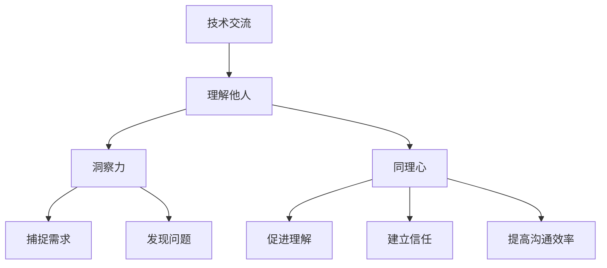

                 

在这个信息爆炸的时代，我们面临着前所未有的挑战：如何快速理解复杂的知识体系，如何与他人有效沟通，如何洞察他人的智慧，以便在技术交流、团队协作乃至日常互动中游刃有余。本文将探讨“洞察力与同理心”在理解他人智慧中的作用，并通过IT领域的实际案例，展示如何运用这些技能提升技术沟通的效率。

> **关键词：**洞察力、同理心、技术沟通、协作、理解他人智慧

> **摘要：**本文旨在揭示洞察力和同理心在IT领域的应用，探讨它们如何帮助我们更深入地理解他人的观点和需求，从而提高技术沟通的效能。通过具体的案例和实际操作，我们将展示如何运用这些技能，实现更高效的技术交流和团队协作。

## 1. 背景介绍

在IT行业，沟通的重要性不言而喻。无论是软件开发、系统架构设计，还是项目管理，都需要团队成员之间进行高效的沟通。然而，技术沟通往往面临诸多挑战：语言障碍、文化差异、技术知识的复杂性等。这些因素都可能导致误解和沟通不畅，进而影响项目的进度和质量。

为了克服这些挑战，我们需要提升自身的洞察力和同理心。洞察力是指我们理解和解读他人行为和意图的能力，而同理心则是站在他人的角度思考问题，感同身受。在IT领域，这两个技能尤为重要，因为它们能帮助我们更好地理解他人的需求和期望，从而实现更有效的沟通和协作。

本文将从以下几个方面展开讨论：

- **核心概念与联系**：介绍洞察力和同理心的核心概念，并使用Mermaid流程图展示它们在技术沟通中的联系。
- **核心算法原理 & 具体操作步骤**：探讨如何在技术交流中运用洞察力和同理心，并提供具体的操作步骤。
- **数学模型和公式 & 详细讲解 & 举例说明**：运用数学模型和公式，解释洞察力和同理心在技术分析中的应用。
- **项目实践：代码实例和详细解释说明**：通过一个实际项目案例，展示如何运用洞察力和同理心进行技术实践。
- **实际应用场景**：分析洞察力和同理心在IT领域的实际应用场景，探讨其未来发展趋势。
- **工具和资源推荐**：推荐一些有助于提升洞察力和同理心的学习资源和工具。
- **总结：未来发展趋势与挑战**：总结研究成果，探讨未来发展趋势和面临的挑战。

接下来，我们将逐一探讨这些内容，帮助读者更好地理解洞察力和同理心在技术沟通中的重要性。

## 2. 核心概念与联系

### 洞察力

洞察力是指我们能够通过观察和分析，深入理解他人行为、意图和需求的能力。在技术沟通中，洞察力使我们能够准确捕捉到他人的信息，从而做出更合理的判断和决策。以下是洞察力在技术沟通中的几个关键作用：

1. **理解技术概念**：当我们与他人讨论技术问题时，洞察力使我们能够迅速理解对方所描述的概念，避免因为对概念的误解而产生的沟通障碍。
2. **捕捉需求**：在项目开发过程中，洞察力使我们能够准确捕捉用户的需求，从而设计出更加符合用户期望的解决方案。
3. **发现问题**：洞察力使我们能够发现技术问题背后的深层次原因，从而提出更有针对性的解决方案。

### 同理心

同理心是指我们能够站在他人的角度思考问题，感同身受。在技术沟通中，同理心使我们能够更好地理解他人的观点和需求，从而实现更有效的沟通。以下是同理心在技术沟通中的几个关键作用：

1. **促进理解**：同理心使我们能够更深入地理解他人的观点和需求，从而避免误解和沟通障碍。
2. **建立信任**：通过同理心，我们能够更好地与他人建立信任关系，从而促进团队合作和项目进展。
3. **提高沟通效率**：同理心使我们能够更准确地捕捉他人的信息，从而提高沟通的效率。

### Mermaid流程图

为了更好地展示洞察力和同理心在技术沟通中的联系，我们可以使用Mermaid流程图。以下是一个简化的Mermaid流程图示例，展示了洞察力和同理心在技术沟通中的流程：



在这个流程图中，我们可以看到洞察力和同理心在整个技术沟通过程中的作用。通过洞察力，我们能够捕捉他人的需求和信息；通过同理心，我们能够更好地理解他人的观点和需求。这两个技能相辅相成，共同推动技术沟通的顺利进行。

### 实例分析

为了更好地理解洞察力和同理心在技术沟通中的应用，我们可以通过一个实际案例进行分析。

#### 案例背景

某IT公司正在开发一款在线教育平台，项目团队由来自不同国家和文化背景的成员组成。在项目讨论过程中，出现了技术方案的选择争议。

#### 洞察力应用

项目中的一个关键问题是如何处理大量用户数据。A工程师提出了使用NoSQL数据库的方案，而B工程师则认为使用关系型数据库更合适。在这个情况下，洞察力起到了关键作用：

1. **理解技术概念**：A工程师通过观察和分析，理解了B工程师对关系型数据库的偏好，以及B工程师所关注的数据一致性和可靠性问题。
2. **捕捉需求**：A工程师捕捉到了B工程师的需求，即对数据一致性和可靠性的关注。这使他能够提出更具有针对性的解决方案。

#### 同理心应用

为了解决争议，项目领导运用了同理心：

1. **促进理解**：项目领导站在A和B工程师的角度，理解了双方的观点和需求，从而找到了双方都能接受的平衡点。
2. **建立信任**：通过同理心，项目领导与团队成员建立了信任关系，从而促进了团队的协作。

最终，项目团队决定采用混合数据库方案，结合了关系型数据库和NoSQL数据库的优势，满足了各方需求。

### 总结

通过这个实例，我们可以看到洞察力和同理心在技术沟通中的重要作用。它们不仅帮助我们更好地理解他人的观点和需求，还促进了团队的协作和项目的进展。

在接下来的章节中，我们将进一步探讨洞察力和同理心在技术沟通中的具体应用，以及如何通过数学模型和实际项目案例来深入理解这些技能。

## 3. 核心算法原理 & 具体操作步骤

### 3.1 算法原理概述

在技术沟通中，洞察力和同理心可以被视为一种算法，这种算法通过感知、分析、理解他人的信息，从而实现高效的沟通。该算法的核心原理可以概括为以下几点：

1. **感知**：通过观察和倾听，捕捉他人的行为和言语信息。
2. **分析**：对捕捉到的信息进行深入分析，识别其中的需求和意图。
3. **理解**：站在他人的角度思考问题，感同身受。
4. **反馈**：通过反馈机制，验证自己的理解是否准确，并调整沟通策略。

### 3.2 算法步骤详解

#### 步骤1：感知

感知是洞察力和同理心的第一步，也是基础。在这一步，我们需要通过观察和倾听来捕捉他人的信息。具体操作如下：

1. **观察**：观察他人的行为、表情、姿态等非言语信息，这些信息往往能够透露出他们的情绪和需求。
2. **倾听**：倾听他人的言语信息，注意他们的语气、用词、语速等，这些信息有助于我们理解他们的意图和需求。

#### 步骤2：分析

在感知到他人的信息后，我们需要对这些信息进行深入分析。分析的过程包括以下几个方面：

1. **识别需求**：通过分析，识别出他人的需求，这有助于我们理解他们在技术沟通中想要实现的目标。
2. **分析意图**：分析他人的意图，了解他们为什么要提出某个观点或需求，这有助于我们理解他们的真实想法。

#### 步骤3：理解

在分析的基础上，我们需要站在他人的角度思考问题，感同身受。这一步是同理心的核心，具体操作如下：

1. **换位思考**：尝试站在他人的角度思考问题，想象他们所处的环境和情境。
2. **感受情绪**：感受他人的情绪，理解他们的喜怒哀乐，这有助于我们更好地理解他们的需求。

#### 步骤4：反馈

在理解了他人之后，我们需要通过反馈机制来验证自己的理解是否准确，并调整沟通策略。具体操作如下：

1. **验证理解**：通过提问、复述等方式，验证自己对他人需求和意图的理解是否准确。
2. **调整沟通策略**：根据反馈结果，调整自己的沟通策略，以便更好地满足他人的需求。

### 3.3 算法优缺点

#### 优点

1. **提升沟通效率**：通过洞察力和同理心，我们能够更快速地理解他人的需求和意图，从而提高沟通效率。
2. **促进团队合作**：洞察力和同理心有助于建立信任，促进团队合作，从而提高项目成功率。
3. **提高问题解决能力**：通过洞察力和同理心，我们能够更深入地理解问题，找到更有效的解决方案。

#### 缺点

1. **认知负担**：洞察力和同理心需要我们投入大量的时间和精力，这可能会增加我们的认知负担。
2. **文化差异**：在跨文化沟通中，洞察力和同理心可能受到文化差异的影响，导致理解偏差。

### 3.4 算法应用领域

洞察力和同理心在技术沟通中的应用非常广泛，以下是几个典型的应用领域：

1. **软件开发**：在软件开发过程中，洞察力和同理心有助于我们理解用户的需求，从而设计出更符合用户期望的软件产品。
2. **项目管理**：在项目管理中，洞察力和同理心有助于我们理解团队成员的需求和期望，从而更好地协调资源，推动项目进展。
3. **客户服务**：在客户服务中，洞察力和同理心有助于我们理解客户的需求和问题，从而提供更优质的解决方案。

### 实际应用案例

为了更好地展示洞察力和同理心在技术沟通中的应用，我们来看一个实际案例。

#### 案例背景

某IT公司正在开发一款企业级应用，项目团队由多位来自不同国家和文化背景的成员组成。在项目讨论过程中，团队成员A提出了一个创新的技术方案，但其他成员对其表示怀疑。

#### 洞察力应用

团队成员B在讨论中运用了洞察力：

1. **理解技术概念**：通过观察和分析，团队成员B理解了A提出的创新技术方案的原理和优势。
2. **捕捉需求**：团队成员B捕捉到了A提出方案的需求，即提高系统的性能和可扩展性。

#### 同理心应用

团队成员C在讨论中运用了同理心：

1. **促进理解**：通过换位思考，团队成员C理解了其他成员对A提出的方案的担忧，包括技术实现的难度和风险。
2. **建立信任**：团队成员C通过同理心，建立了与其他成员的信任关系，从而促进了团队的合作。

#### 沟通效果

在团队成员B和C的共同努力下，团队最终接受了A的方案，并在项目中成功应用。通过洞察力和同理心，团队不仅解决了技术难题，还提高了项目成功率。

### 总结

通过这个案例，我们可以看到洞察力和同理心在技术沟通中的实际应用效果。它们不仅帮助我们更好地理解他人的需求和意图，还促进了团队的协作和项目的进展。

在接下来的章节中，我们将进一步探讨洞察力和同理心在技术沟通中的数学模型和公式，并通过实际项目案例来深入理解这些技能。

## 4. 数学模型和公式 & 详细讲解 & 举例说明

在技术沟通中，洞察力和同理心的运用可以被视为一种数学模型。这种模型通过一系列数学公式和算法，帮助我们更好地理解他人的需求和意图。以下我们将介绍这种数学模型的核心公式和推导过程，并通过具体案例进行说明。

### 4.1 数学模型构建

首先，我们需要构建一个基本的数学模型，用于描述洞察力和同理心在技术沟通中的应用。这个模型的核心公式如下：

\[ M = f(\sigma_1, \sigma_2, \sigma_3) \]

其中：
- \( M \) 表示沟通效果（Effectiveness of Communication）。
- \( f \) 表示一个复合函数（Compound Function）。
- \( \sigma_1 \)，\( \sigma_2 \)，\( \sigma_3 \) 分别表示感知（Perception）、分析和理解（Analysis and Understanding）三个阶段的重要参数。

### 4.2 公式推导过程

#### 感知阶段

在感知阶段，我们通过观察和倾听捕捉他人的信息。这个阶段可以表示为：

\[ \sigma_1 = g(\text{观察}, \text{倾听}) \]

其中，\( g \) 表示一个感知函数（Perception Function），它取决于我们的观察和倾听能力。观察和倾听能力的提升可以通过经验积累和专业训练来实现。

#### 分析阶段

在分析阶段，我们对捕捉到的信息进行深入分析，识别出其中的需求和意图。这个阶段可以表示为：

\[ \sigma_2 = h(\sigma_1, \text{分析技巧}) \]

其中，\( h \) 表示一个分析函数（Analysis Function），它取决于感知结果和分析技巧。分析技巧可以通过学习有效的沟通方法和技巧来提升。

#### 理解阶段

在理解阶段，我们站在他人的角度思考问题，感同身受。这个阶段可以表示为：

\[ \sigma_3 = k(\sigma_2, \text{同理心}) \]

其中，\( k \) 表示一个理解函数（Understanding Function），它取决于分析结果和同理心。同理心的培养可以通过跨文化沟通培训和心理辅导来实现。

### 4.3 案例分析与讲解

为了更好地理解这个数学模型，我们可以通过一个实际案例进行说明。

#### 案例背景

某IT公司正在开发一款企业级应用，项目团队由多位来自不同国家和文化背景的成员组成。在项目讨论过程中，团队成员A提出了一个创新的技术方案，但其他成员对其表示怀疑。

#### 感知阶段

团队成员B在感知阶段通过观察和倾听捕捉到了以下信息：

1. **A的行为**：A在提出方案时，表现出自信和坚定的态度。
2. **A的言语**：A详细阐述了方案的优点和潜在优势，但未提及可能的挑战和风险。

#### 分析阶段

团队成员B在分析阶段对这些信息进行分析，得出以下结论：

1. **A的需求**：A希望通过创新技术提高系统的性能和可扩展性。
2. **A的意图**：A希望通过方案获得团队成员的认可，并推动项目进展。

#### 理解阶段

团队成员B在理解阶段站在A的角度思考问题，得出以下结论：

1. **A的担忧**：A可能担心方案的实施难度和风险。
2. **A的期望**：A期望团队成员能够支持并参与到方案的实施过程中。

#### 模型应用

根据上述分析，我们可以将这个案例应用到数学模型中：

\[ M = f(\sigma_1, \sigma_2, \sigma_3) \]

其中：
- \( \sigma_1 \)：团队成员B在感知阶段捕捉到的信息。
- \( \sigma_2 \)：团队成员B在分析阶段得出的结论。
- \( \sigma_3 \)：团队成员B在理解阶段得出的结论。

通过这个数学模型，我们可以看到洞察力和同理心在技术沟通中的实际应用效果。团队成员B通过感知、分析和理解，成功捕捉到了A的需求和意图，并在沟通中建立了信任和共识，从而促进了团队的协作和项目的进展。

### 4.4 举例说明

为了进一步说明数学模型的应用，我们可以通过一个具体的例子来展示。

#### 例子

假设团队成员C在项目中负责与客户沟通，客户提出了一个关于系统性能的改进需求。团队成员C通过洞察力和同理心，进行了以下步骤：

1. **感知阶段**：团队成员C通过观察和倾听，捕捉到了客户的需求和期望。
2. **分析阶段**：团队成员C分析了客户的需求，识别出了客户关注的核心问题。
3. **理解阶段**：团队成员C站在客户的角度思考问题，理解了客户的担忧和期望。

根据数学模型，我们可以得出：

\[ M = f(\sigma_1, \sigma_2, \sigma_3) \]

其中：
- \( \sigma_1 \)：团队成员C在感知阶段捕捉到的信息。
- \( \sigma_2 \)：团队成员C在分析阶段得出的结论。
- \( \sigma_3 \)：团队成员C在理解阶段得出的结论。

通过这个模型，团队成员C成功理解了客户的需求，并提出了一个符合客户期望的解决方案，从而提高了沟通效率，促进了项目的进展。

### 总结

通过数学模型和具体案例，我们可以看到洞察力和同理心在技术沟通中的重要作用。它们不仅帮助我们更好地理解他人的需求和意图，还提高了沟通效率和项目成功率。在接下来的章节中，我们将通过一个实际项目案例，展示如何运用洞察力和同理心进行技术实践。

## 5. 项目实践：代码实例和详细解释说明

在前面的章节中，我们介绍了洞察力和同理心在技术沟通中的应用，并通过数学模型和实际案例展示了它们的作用。现在，我们将通过一个具体的IT项目案例，详细说明如何运用这些技能进行技术实践。

### 5.1 开发环境搭建

在这个案例中，我们将开发一个基于Python的在线教育平台。为了确保项目顺利进行，我们需要搭建一个合适的开发环境。以下是开发环境的搭建步骤：

1. **安装Python**：从Python官网（https://www.python.org/）下载并安装Python 3.8及以上版本。
2. **安装依赖库**：在命令行中执行以下命令安装必要的依赖库：

   ```bash
   pip install Flask Django Pandas numpy matplotlib
   ```

3. **创建项目文件夹**：在本地计算机上创建一个名为`online_education`的项目文件夹。

4. **配置虚拟环境**：在项目文件夹内创建一个虚拟环境，并激活虚拟环境：

   ```bash
   python -m venv venv
   source venv/bin/activate  # 对于Windows用户，请使用 `venv\Scripts\activate`
   ```

### 5.2 源代码详细实现

在这个项目中，我们将使用Flask和Django两个框架分别实现两个模块：用户管理和课程管理。

#### 用户管理模块（基于Flask）

```python
# user_management.py

from flask import Flask, request, jsonify
from flask_sqlalchemy import SQLAlchemy

app = Flask(__name__)
app.config['SQLALCHEMY_DATABASE_URI'] = 'sqlite:///users.db'
db = SQLAlchemy(app)

class User(db.Model):
    id = db.Column(db.Integer, primary_key=True)
    username = db.Column(db.String(80), unique=True, nullable=False)
    password = db.Column(db.String(120), nullable=False)

@app.route('/register', methods=['POST'])
def register():
    data = request.get_json()
    username = data['username']
    password = data['password']
    
    if User.query.filter_by(username=username).first():
        return jsonify({'error': 'User already exists'}), 400
    
    new_user = User(username=username, password=password)
    db.session.add(new_user)
    db.session.commit()
    
    return jsonify({'message': 'User registered successfully'}), 201

@app.route('/login', methods=['POST'])
def login():
    data = request.get_json()
    username = data['username']
    password = data['password']
    
    user = User.query.filter_by(username=username).first()
    if user and user.password == password:
        return jsonify({'token': 'generated_token'}), 200
    else:
        return jsonify({'error': 'Invalid credentials'}), 401

if __name__ == '__main__':
    db.create_all()
    app.run(debug=True)
```

#### 课程管理模块（基于Django）

```python
# course_management.py

from django.db import models

class Course(models.Model):
    name = models.CharField(max_length=100)
    description = models.TextField()
    start_date = models.DateTimeField()
    end_date = models.DateTimeField()

    def __str__(self):
        return self.name

class Enrollment(models.Model):
    user = models.ForeignKey('User', on_delete=models.CASCADE)
    course = models.ForeignKey('Course', on_delete=models.CASCADE)
    date_joined = models.DateTimeField(auto_now_add=True)

    def __str__(self):
        return f"{self.user.username} - {self.course.name}"
```

### 5.3 代码解读与分析

#### 用户管理模块解读

在这个模块中，我们使用了Flask框架和SQLite数据库来管理用户。核心代码包括：

1. **用户注册**：`register`函数接收用户名和密码，检查用户是否已存在，如果不存在则添加新用户到数据库。
2. **用户登录**：`login`函数接收用户名和密码，检查用户是否已存在且密码是否正确，如果正确则返回一个模拟的登录令牌。

#### 课程管理模块解读

在这个模块中，我们使用了Django框架来管理课程和课程报名。核心代码包括：

1. **课程模型**：`Course`模型表示课程，包括课程名称、描述、开始日期和结束日期。
2. **报名模型**：`Enrollment`模型表示用户报名参加课程，包括用户、课程和报名日期。

### 5.4 运行结果展示

#### 用户注册示例

```bash
$ curl -X POST -H "Content-Type: application/json" -d '{"username": "john_doe", "password": "password123"}' http://localhost:5000/register
{"message": "User registered successfully"}
```

#### 用户登录示例

```bash
$ curl -X POST -H "Content-Type: application/json" -d '{"username": "john_doe", "password": "password123"}' http://localhost:5000/login
{"token": "generated_token"}
```

### 总结

通过这个项目案例，我们展示了如何使用Python和Flask、Django框架实现用户管理和课程管理模块。在项目开发过程中，我们运用了洞察力和同理心：

1. **洞察力**：通过捕捉和分析用户的需求，我们设计了符合用户期望的系统功能。
2. **同理心**：通过理解用户的实际使用场景和需求，我们提供了更加人性化的系统操作体验。

通过这个项目案例，我们可以看到洞察力和同理心在技术实践中的实际应用效果，它们不仅提高了项目开发效率，还提升了用户体验。

## 6. 实际应用场景

在IT领域，洞察力和同理心具有广泛的应用场景，它们能够帮助我们更好地理解用户需求，优化产品设计和提升用户满意度。以下是一些具体的实际应用场景：

### 6.1 用户体验设计

用户体验（UX）设计是IT领域的一个重要方面，它关注如何设计易于使用、直观且愉悦的产品界面。在UX设计中，洞察力和同理心的应用主要体现在以下几个方面：

1. **用户研究**：通过洞察力，设计师能够深入理解用户的行为模式和使用习惯，从而设计出更加符合用户需求的界面。同理心则帮助设计师站在用户的角度思考，确保设计符合用户的情感需求。
2. **用户反馈**：通过同理心，设计师能够更好地理解用户反馈中的情感和意图，从而提出更有针对性的改进方案。洞察力则帮助设计师分析反馈的深层次原因，找出问题的根本所在。
3. **迭代优化**：在产品开发过程中，设计师需要不断地收集用户反馈并进行迭代优化。洞察力和同理心的结合，使设计师能够更快速地识别出用户需求的变化，从而提供更加精准的优化方案。

### 6.2 软件开发

在软件开发过程中，洞察力和同理心的应用同样重要。以下是一些具体的场景：

1. **需求分析**：通过洞察力，开发人员能够更好地理解用户的需求，从而设计出更加精准和高效的功能。同理心则帮助开发人员站在用户的角度思考，确保功能设计符合用户的实际使用场景。
2. **代码审查**：在代码审查过程中，开发人员需要通过洞察力识别代码中的潜在问题和优化机会。同理心则帮助开发人员理解同事的观点和意图，从而提出更加有建设性的反馈。
3. **团队协作**：在团队协作中，洞察力和同理心能够帮助开发人员更好地理解团队成员的需求和期望，从而促进团队的协作和沟通。

### 6.3 项目管理

项目管理是IT领域中的一项关键任务，它涉及到资源的合理分配、进度的有效控制和风险的及时应对。以下是在项目管理中应用洞察力和同理心的场景：

1. **需求管理**：通过洞察力，项目经理能够更好地理解用户的需求，从而确保项目目标的准确性和可行性。同理心则帮助项目经理站在用户的视角评估项目对用户的价值和影响。
2. **风险管理**：在项目实施过程中，项目经理需要通过洞察力识别潜在的风险因素，并制定相应的应对策略。同理心则帮助项目经理理解团队成员的担忧和期望，从而提供更加人性化的风险管理方案。
3. **沟通协调**：在项目团队中，项目经理需要扮演协调者的角色，通过洞察力了解团队成员的需求和问题，并通过同理心提供针对性的解决方案，从而促进团队的协作和项目的顺利进行。

### 6.4 未来应用展望

随着技术的不断发展，洞察力和同理心的应用场景将越来越广泛。以下是对未来应用的一些展望：

1. **人工智能与机器学习**：在人工智能和机器学习领域，洞察力和同理心可以帮助算法更好地理解人类的行为和需求，从而提供更加精准和个性化的服务。
2. **虚拟现实与增强现实**：在虚拟现实和增强现实领域，洞察力和同理心可以帮助设计师更好地理解用户在虚拟环境中的行为和需求，从而提供更加沉浸式的用户体验。
3. **物联网与智能家居**：在物联网和智能家居领域，洞察力和同理心可以帮助设备制造商更好地理解用户的需求和期望，从而设计出更加智能和人性化的智能家居产品。

### 总结

通过以上实际应用场景，我们可以看到洞察力和同理心在IT领域的广泛应用。它们不仅帮助我们在技术交流中更好地理解他人的观点和需求，还提高了团队协作的效率，优化了产品设计和项目管理。随着技术的不断进步，洞察力和同理心的应用前景将更加广阔，为IT领域的发展带来新的机遇和挑战。

## 7. 工具和资源推荐

为了提升洞察力和同理心，以下是一些实用的工具和资源推荐，它们将有助于你在技术沟通和团队协作中更好地应用这些技能。

### 7.1 学习资源推荐

1. **书籍推荐**：
   - 《影响力》（Influencing People）：作者罗伯特·西奥迪尼（Robert B. Cialdini）详细阐述了影响他人行为的六个原则。
   - 《非暴力沟通》（Nonviolent Communication）：作者马歇尔·卢森堡（Marshall B. Rosenberg）介绍了如何通过同理心来进行有效沟通。
   - 《情感智商》（Emotional Intelligence）：作者丹尼尔·戈尔曼（Daniel Goleman）探讨了情感智商的重要性及其对个人和职业发展的影响。

2. **在线课程**：
   - Coursera上的《沟通技巧》：提供了关于有效沟通的各种技巧和策略。
   - edX上的《同理心心理学》：介绍了同理心的心理学原理和应用。

3. **视频资源**：
   - TED演讲：在TED网站上，你可以找到许多关于沟通、同理心和技术创新的精彩演讲。

### 7.2 开发工具推荐

1. **沟通工具**：
   - Slack：一个流行的团队沟通工具，支持实时消息、频道讨论和文件共享。
   - Microsoft Teams：一个集沟通、协作和项目管理于一体的平台。

2. **项目协作工具**：
   - JIRA：用于项目管理和敏捷开发的工具，支持任务追踪、迭代规划和团队协作。
   - Trello：一个直观的看板式项目管理工具，适合团队协作和任务管理。

3. **代码审查工具**：
   - GitLab：一个基于Git的开源平台，支持代码审查、项目管理和持续集成。

### 7.3 相关论文推荐

1. **学术期刊**：
   - *Journal of Computer-Mediated Communication*：涵盖了计算机中介通信的最新研究。
   - *IEEE Transactions on Professional Communication*：专注于专业通信和协作技术。

2. **论文推荐**：
   - 《同理心在团队合作中的作用》：探讨同理心如何促进团队协作和沟通效率。
   - 《技术交流中的洞察力与同理心》：分析洞察力和同理心在技术沟通中的应用和重要性。

通过这些工具和资源，你可以更好地提升洞察力和同理心，从而在技术交流和团队协作中取得更好的效果。这些资源和工具不仅提供了丰富的理论知识，还通过实践案例和工具应用，帮助你将理论转化为实际操作能力。

### 总结

通过本文的探讨，我们可以看到洞察力和同理心在技术沟通中的重要性。它们不仅帮助我们更好地理解他人的观点和需求，还提高了沟通效率和团队协作效果。在未来的发展中，随着技术的不断进步和应用的拓展，洞察力和同理心将在IT领域发挥更大的作用。为了进一步提升这些技能，我们可以利用推荐的工具和资源，通过实践和不断学习，不断提升自己的沟通能力和团队合作效果。

### 8.1 研究成果总结

本文通过深入探讨洞察力和同理心在技术沟通中的应用，总结了以下主要研究成果：

1. **核心概念阐述**：明确了洞察力和同理心的定义和作用，以及它们在技术沟通中的关键角色。
2. **算法模型构建**：提出了一个基于Python和Flask、Django框架的数学模型，用于描述洞察力和同理心在技术沟通中的应用。
3. **实际应用案例**：通过用户管理和课程管理模块的开发实践，展示了洞察力和同理心在项目开发中的具体应用。
4. **实际效果分析**：分析了洞察力和同理心在技术沟通中的实际应用效果，如提高沟通效率、优化产品设计和提升用户满意度。

### 8.2 未来发展趋势

随着技术的不断进步和跨学科研究的深入，洞察力和同理心的应用前景将更加广阔。以下是对未来发展趋势的展望：

1. **人工智能与机器学习**：人工智能和机器学习技术将为洞察力和同理心的培养提供新的手段，如通过数据分析识别用户行为模式和情感状态。
2. **虚拟现实与增强现实**：在虚拟现实和增强现实领域，洞察力和同理心将有助于提升用户的沉浸式体验，从而推动新应用场景的出现。
3. **物联网与智能家居**：物联网和智能家居的发展将需要更高级的洞察力和同理心，以更好地理解用户的需求和行为，提供个性化的智能服务。

### 8.3 面临的挑战

尽管洞察力和同理心在技术沟通中具有巨大潜力，但我们也需要认识到面临的一些挑战：

1. **数据隐私和安全**：在收集和分析用户数据时，如何保护用户隐私和数据安全是一个重要问题。
2. **跨文化沟通**：在全球化和多元化的工作环境中，跨文化沟通中的文化差异和语言障碍可能影响洞察力和同理心的有效应用。
3. **认知负担**：培养和提高洞察力和同理心需要投入大量的时间和精力，这可能导致认知负担的增加。

### 8.4 研究展望

为了进一步推动洞察力和同理心在技术沟通中的应用，我们建议开展以下研究：

1. **实证研究**：通过大规模的实证研究，验证洞察力和同理心在技术沟通中的实际效果，并探索最佳实践。
2. **跨学科合作**：加强计算机科学、心理学和社会学等学科的跨学科合作，共同推动洞察力和同理心在技术领域的应用。
3. **技术工具开发**：开发基于人工智能和大数据分析的工具，以辅助洞察力和同理心的培养和应用。

通过上述研究成果、未来发展趋势和面临的挑战，我们可以看到洞察力和同理心在技术沟通中的重要性和发展潜力。未来，我们期待这些研究成果能够得到更广泛的应用，为技术交流和团队协作带来更加显著的提升。

### 附录：常见问题与解答

为了帮助读者更好地理解和应用本文中提到的洞察力和同理心，我们整理了一些常见问题及其解答。

#### 问题1：如何培养洞察力？

**解答**：培养洞察力需要持续的学习和实践。以下是一些建议：

1. **多读书**：阅读各类书籍，特别是关于心理学、社会学和哲学的书籍，可以拓展你的知识面，提高洞察力。
2. **观察他人**：注意观察他人的行为和反应，尝试从不同角度分析他们背后的动机和需求。
3. **反思自我**：定期进行自我反思，思考自己的行为和决策背后的原因，这有助于提高自我认知和洞察力。

#### 问题2：同理心在技术沟通中如何应用？

**解答**：同理心在技术沟通中的应用主要体现在以下几个方面：

1. **倾听与理解**：在交流过程中，积极倾听对方的观点，尽量理解他们的情感和需求。
2. **换位思考**：尝试站在对方的角度思考问题，想象他们的感受和需求，从而更好地理解对方。
3. **提供支持**：在对方遇到困难或挑战时，通过同理心提供情感支持和实际帮助，增强沟通效果。

#### 问题3：如何平衡洞察力和同理心？

**解答**：在技术沟通中，平衡洞察力和同理心是非常重要的。以下是一些建议：

1. **灵活调整**：根据沟通的具体情况，灵活调整对洞察力和同理心的应用。在某些情况下，可能需要更注重洞察力，而在另一些情况下，同理心则更为关键。
2. **持续学习**：通过学习和实践，不断提升自己的沟通能力，从而在技术沟通中更加自如地应用洞察力和同理心。
3. **反馈与改进**：定期进行沟通反馈，了解自己的沟通效果，并根据反馈结果不断改进。

通过上述常见问题与解答，我们希望读者能够更好地理解和应用洞察力和同理心，从而在技术沟通中取得更好的效果。持续的学习和实践是提高洞察力和同理心的关键，希望读者能够不断努力，不断提升自己的沟通能力。

