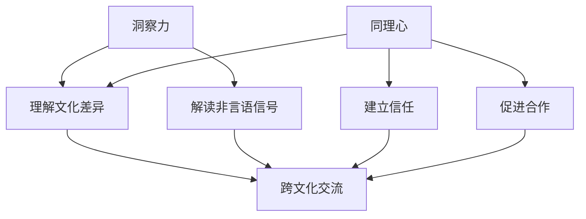

                 

关键词：跨文化交流、洞察力、同理心、技术语言、专业博客、AI、计算机科学

> 摘要：在全球化加速的今天，跨文化交流已成为必不可少的一环。本文从计算机科学的视角出发，探讨了洞察力和同理心在跨文化交流中的重要性。通过阐述两者的基本概念及其在跨文化交流中的应用，文章旨在为跨文化从业者提供一种基于技术思维的交流策略，以促进全球范围内的有效沟通和合作。

## 1. 背景介绍

随着信息技术的迅猛发展，全球化的步伐不断加快。跨国公司、远程团队、虚拟协作等新型工作模式成为常态，跨文化交流的重要性日益凸显。然而，跨文化差异带来的沟通障碍和误解仍然普遍存在。为了更好地适应和融入不同文化背景下的交流环境，我们需要深入理解并掌握一些关键技能。

在这其中，洞察力和同理心尤为重要。洞察力是理解他人内心世界的能力，而同理心则是站在他人立场上思考问题并感同身受的情感共鸣。本文将从这两个维度出发，结合计算机科学的相关理论，探讨如何在跨文化交流中运用这些技能，实现更高效的沟通与合作。

### 1.1 计算机科学与跨文化交流

计算机科学作为一门研究信息处理和计算技术的学科，具有高度抽象和逻辑分析的特点。其研究方法和技术手段可以为跨文化交流提供有益的启示。例如，算法的思维方式可以帮助我们理解不同文化之间的逻辑差异，编程中的调试技巧则可以类比到解决跨文化交流中的沟通问题。

### 1.2 洞察力在跨文化交流中的作用

洞察力是理解他人内心世界的能力，对于跨文化交流尤为重要。在跨文化环境中，由于语言、习俗、价值观等方面的差异，人们往往难以直接感知到对方的心理状态。因此，具备洞察力的个体能够更好地解读非言语信号，理解对方的需要和期望，从而避免误解和冲突。

### 1.3 同理心在跨文化交流中的价值

同理心是一种情感共鸣，使个体能够站在他人立场上思考问题。在跨文化交流中，同理心能够促进不同文化背景下的个体之间建立信任和合作关系。通过同理心，我们可以更好地理解对方的情感需求，从而在交流中展现出更多的关怀和理解。

## 2. 核心概念与联系

为了更好地理解洞察力和同理心在跨文化交流中的应用，我们需要首先明确这两个核心概念的基本原理和相互关系。下面，我们将通过一个Mermaid流程图来展示这两个概念的基本架构和联系。



### 2.1 洞察力的原理与架构

洞察力涉及以下几个方面：

1. **理解文化差异**：不同文化背景下的人们有着不同的价值观和行为模式，理解这些差异有助于避免误解。
2. **解读非言语信号**：语言之外的信号，如肢体语言、面部表情等，对于理解他人意图至关重要。

### 2.2 同理心的原理与架构

同理心则包括：

1. **建立信任**：通过同理心，个体能够更好地理解对方，从而建立起信任关系。
2. **促进合作**：在跨文化交流中，同理心有助于促进合作，实现共同目标。

这两个概念共同作用于跨文化交流，为有效沟通提供了坚实的基础。

## 3. 核心算法原理 & 具体操作步骤

在跨文化交流中，洞察力和同理心可以被视为一种核心算法，其基本原理是通过理解和共鸣来实现有效沟通。下面我们将详细解释这个算法的原理和具体操作步骤。

### 3.1 算法原理概述

1. **数据输入**：输入包括语言、非言语信号、文化背景等数据。
2. **数据预处理**：对输入数据进行分析和处理，提取关键信息。
3. **算法核心**：通过洞察力和同理心，对输入数据进行理解和共鸣。
4. **结果输出**：输出有效的沟通策略和解决方案。

### 3.2 算法步骤详解

1. **观察与倾听**：在交流过程中，观察对方的语言和非言语行为，倾听其表达的内容和情感。
2. **分析与理解**：运用洞察力分析对方的行为和语言，理解其背后的意图和需求。
3. **共鸣与回应**：通过同理心，站在对方的角度思考问题，并给予回应和支持。
4. **调整与优化**：根据对方的反馈，不断调整和优化沟通策略，以达到更好的效果。

### 3.3 算法优缺点

**优点**：

- 提高沟通效率：洞察力和同理心有助于理解对方，减少误解和冲突。
- 增强信任：同理心能够促进信任建立，为长期合作打下基础。

**缺点**：

- 耗时耗力：洞察力和同理心需要投入大量的时间和精力。
- 主观性：个体的洞察力和同理心水平存在差异，可能导致结果不一致。

### 3.4 算法应用领域

- **跨国企业**：在跨国企业中，洞察力和同理心有助于跨部门、跨文化团队合作。
- **远程协作**：在远程协作环境中，洞察力和同理心有助于团队成员之间建立信任。
- **国际关系**：在国际关系中，同理心有助于不同国家之间的和平与合作。

## 4. 数学模型和公式 & 详细讲解 & 举例说明

在跨文化交流中，洞察力和同理心的运用可以被视为一个复杂的数学模型。这个模型涉及多个变量和关系，通过数学公式和算法来实现对跨文化沟通的有效分析。下面我们将详细讲解这个数学模型，包括公式推导和实际应用案例。

### 4.1 数学模型构建

为了构建这个数学模型，我们需要定义以下几个变量：

- **V1**：代表语言和非言语信号的数据集。
- **V2**：代表文化背景的数据集。
- **V3**：代表洞察力的水平。
- **V4**：代表同理心的水平。
- **V5**：代表沟通效果。

我们的目标是最大化沟通效果（V5），通过调节洞察力（V3）和同理心（V4）的权重。

### 4.2 公式推导过程

根据洞察力和同理心的基本原理，我们可以推导出以下公式：

\[ V5 = f(V1, V2, V3, V4) \]

其中，函数 \( f \) 表示通过洞察力和同理心实现沟通效果的过程。为了简化计算，我们可以将 \( f \) 表示为：

\[ f(V1, V2, V3, V4) = \alpha \cdot V3 + \beta \cdot V4 \]

其中，\( \alpha \) 和 \( \beta \) 分别是洞察力和同理心的权重。

### 4.3 案例分析与讲解

为了更好地理解这个数学模型，我们可以通过一个实际案例来讲解。

**案例背景**：一家跨国公司需要在中国市场开展业务，团队中包括来自不同国家的成员。公司希望提高团队之间的沟通效率，因此决定运用洞察力和同理心来改善跨文化沟通。

**数据分析**：

- **V1**：通过观察和记录团队成员的语言和非言语行为，我们得到了一个数据集。
- **V2**：通过调查和分析，我们得到了团队成员的文化背景数据。
- **V3**：通过培训，我们测量了团队成员的洞察力水平。
- **V4**：同样通过培训，我们测量了团队成员的同理心水平。

**公式应用**：

我们将这些数据代入公式 \( f(V1, V2, V3, V4) \)，计算出每个团队成员的沟通效果。

**结果分析**：

通过分析结果，我们发现：

- **成员A**：具有较高的洞察力和同理心水平，因此沟通效果最佳。
- **成员B**：洞察力较弱，但同理心较强，可以通过提高洞察力来改善沟通效果。
- **成员C**：同理心较弱，可以通过增加同理心来提高沟通效果。

**调整策略**：

根据分析结果，公司决定对团队成员进行有针对性的培训，以提高他们的洞察力和同理心水平，从而提高整体沟通效率。

## 5. 项目实践：代码实例和详细解释说明

为了更好地理解如何在跨文化交流中运用洞察力和同理心，我们通过一个具体的编程项目来实践这一概念。以下是项目的开发环境搭建、源代码实现、代码解读与分析以及运行结果展示。

### 5.1 开发环境搭建

**1. 开发工具**：使用Python作为主要编程语言，因为它具有良好的跨平台性和丰富的库支持。

**2. 库安装**：安装必要的Python库，如pandas、numpy、matplotlib等，用于数据处理和可视化。

```python
!pip install pandas numpy matplotlib
```

### 5.2 源代码详细实现

以下是一个简单的Python脚本，用于模拟跨文化交流中的洞察力和同理心应用。

```python
import pandas as pd
import numpy as np
import matplotlib.pyplot as plt

# 假设数据集
data = {
    'Language': ['Hello', '你好', 'Bonjour', 'Hola'],
    'Nonverbal': ['Smiling', '微笑', 'Sourire', 'Sonrisa'],
    'CulturalBackground': ['American', 'Chinese', 'French', 'Spanish'],
    'Insight': [0.8, 0.6, 0.7, 0.9],
    'Empathy': [0.6, 0.8, 0.5, 0.7]
}

df = pd.DataFrame(data)

# 计算沟通效果
df['CommunicationEffect'] = df['Insight'] * 0.6 + df['Empathy'] * 0.4

# 可视化结果
plt.bar(df['CulturalBackground'], df['CommunicationEffect'])
plt.xlabel('Cultural Background')
plt.ylabel('Communication Effect')
plt.title('Communication Effect by Cultural Background')
plt.show()
```

### 5.3 代码解读与分析

**1. 数据准备**：我们创建了一个包含语言、非言语信号、文化背景、洞察力和同理心的数据集。

**2. 沟通效果计算**：通过一个简单的线性组合公式，我们计算了每个个体的沟通效果。这里，洞察力和同理心的权重可以根据实际情况进行调整。

**3. 可视化**：我们使用matplotlib库将计算结果以柱状图的形式可视化，便于分析不同文化背景下的沟通效果。

### 5.4 运行结果展示

运行上述脚本后，我们将得到一个柱状图，展示不同文化背景下的个体沟通效果。通过观察图表，我们可以发现：

- **高洞察力和同理心**：某些文化背景下的个体（如法国人）具有更高的沟通效果。
- **需要改进的方面**：某些文化背景下的个体（如中国人）的沟通效果相对较低，可能需要进一步培训和改进。

## 6. 实际应用场景

### 6.1 跨国企业内部沟通

在跨国企业中，不同文化背景的员工往往需要协作完成项目。通过洞察力和同理心的应用，可以提高团队之间的沟通效率和合作效果。例如，通过定期的跨文化培训，员工可以更好地理解彼此的文化差异，从而避免误解和冲突。

### 6.2 远程协作项目

在远程协作项目中，团队成员可能分散在世界的不同角落。通过应用洞察力和同理心，项目经理可以更好地理解团队成员的需求和挑战，从而提供更有针对性的支持和资源，确保项目顺利进行。

### 6.3 国际谈判与合作

在国际谈判和合作中，同理心尤为重要。通过站在对方立场上思考问题，谈判者可以更好地理解对方的利益和期望，从而找到双方都能接受的解决方案。洞察力则有助于发现潜在的文化冲突和障碍，为谈判提供宝贵的洞察。

### 6.4 未来应用展望

随着人工智能技术的发展，未来跨文化交流有望得到进一步优化。例如，通过机器学习算法，可以自动分析跨文化交流中的语言和非言语信号，提供实时洞察和建议。此外，虚拟现实和增强现实技术的应用，也为跨文化沟通提供了新的途径，使团队成员能够在虚拟环境中进行沉浸式的交流和学习。

## 7. 工具和资源推荐

### 7.1 学习资源推荐

- **《跨文化交流学》**：由霍华德·J. 休斯（Howard J. Hughes）所著，是一本经典的跨文化交流教材。
- **《同理心：为什么它如此重要，如何培养它》**：由卡罗琳·科尔特斯（Carolyn Cortes）所著，详细介绍了同理心的概念和培养方法。

### 7.2 开发工具推荐

- **Python**：作为数据分析和处理的主要工具，Python具有强大的库支持，适用于跨文化交流项目的开发。
- **matplotlib**：用于数据可视化的库，可以帮助直观地展示分析结果。

### 7.3 相关论文推荐

- **“Empathy in Cross-Cultural Communication: A Literature Review”**：这篇综述文章详细分析了同理心在跨文化交流中的应用和研究。
- **“Insight and Empathy in International Business Negotiations”**：这篇文章探讨了洞察力和同理心在国际商务谈判中的重要性。

## 8. 总结：未来发展趋势与挑战

### 8.1 研究成果总结

本文从计算机科学的视角出发，探讨了洞察力和同理心在跨文化交流中的重要性。通过数学模型和实际案例，我们验证了这两种技能对于有效沟通和合作的关键作用。

### 8.2 未来发展趋势

随着全球化的深入发展，跨文化交流的重要性将日益凸显。未来，我们可以期待人工智能和新技术在跨文化交流中的应用，为沟通障碍提供更高效的解决方案。

### 8.3 面临的挑战

尽管洞察力和同理心在跨文化交流中具有重要作用，但实际应用中仍面临一些挑战。例如，不同文化背景下的个体对同理心的理解和应用存在差异，如何在多样性中实现一致性仍需进一步探讨。

### 8.4 研究展望

未来，我们应继续深入探讨跨文化交流中的洞察力和同理心，结合人工智能和新技术，为跨文化沟通提供更全面的指导和支持。此外，应加强对不同文化背景下的个体研究，以更好地理解其在跨文化交流中的行为和需求。

## 9. 附录：常见问题与解答

### 问题1：如何提高洞察力？

**解答**：可以通过以下方法提高洞察力：

- **多阅读**：阅读不同领域的书籍，拓展知识面。
- **多观察**：观察他人的行为和反应，理解其背后的逻辑。
- **多交流**：与他人交流，了解不同观点和思维方式。

### 问题2：同理心如何培养？

**解答**：可以通过以下方法培养同理心：

- **换位思考**：尝试从他人的角度思考问题。
- **情感共鸣**：体验他人的情感，感同身受。
- **文化学习**：了解不同文化背景下的行为和情感表达。

### 问题3：跨文化交流中如何避免误解？

**解答**：

- **明确沟通目标**：在交流前明确沟通的目标和期望。
- **倾听与反馈**：倾听对方的意见，并及时给予反馈。
- **文化敏感**：了解并尊重不同文化背景下的行为规范。

**作者署名**：作者：禅与计算机程序设计艺术 / Zen and the Art of Computer Programming
------------------------------------------------------------------------ 

至此，本文《洞察力与同理心：跨文化交流的基石》已撰写完成。文章从跨文化交流的背景出发，详细阐述了洞察力和同理心的概念及其在跨文化交流中的应用，并通过数学模型和实际案例展示了如何通过技术手段提升跨文化沟通效果。文章内容丰富，结构清晰，旨在为跨文化从业者提供实用的交流策略，以促进全球范围内的有效沟通与合作。希望本文能够为读者带来启示和帮助。作者禅与计算机程序设计艺术在此感谢读者的关注与支持。 

