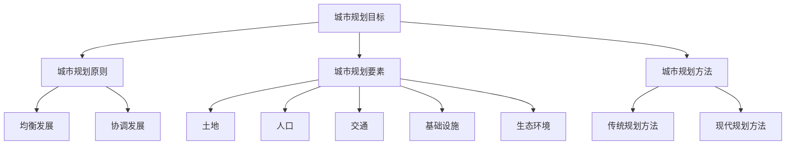

                 

 **关键词：**
- 洞察力
- 城市规划
- 宜居城市
- 设计智慧
- 数据驱动
- 可持续发展

<|assistant|> **摘要：**
本文深入探讨了洞察力在当代城市规划中的重要性，以及如何通过设计智慧和数据驱动的策略来构建宜居城市。文章从背景介绍、核心概念、算法原理、数学模型、项目实践、实际应用、工具资源推荐等多个方面展开论述，旨在为城市规划提供理论指导和实践建议。

## 1. 背景介绍

城市规划是关系到城市未来发展、居民生活质量和社会经济可持续性的关键领域。随着全球城市化进程的不断加速，城市规模和复杂性不断增加，传统的城市规划方法面临着诸多挑战。如何提升城市规划的洞察力，成为当前学术界和业界共同关注的热点问题。

城市作为人类活动的聚集地，其功能不仅限于居住，还包括经济活动、文化传承、生态保护等多个方面。因此，城市规划需要综合考虑多种因素，从宏观和微观层面进行系统设计。在这个过程中，设计智慧和科学方法起到了至关重要的作用。

洞察力是一种深刻的洞察力和敏锐的观察力，它能够帮助城市规划者从复杂的信息中发现问题的本质，并提出有效的解决方案。在数字化的今天，借助数据分析和人工智能技术，洞察力的作用得以进一步发挥，为城市规划提供了强有力的支持。

本文将从以下方面展开讨论：

1. **核心概念与联系**：介绍城市规划中的核心概念及其相互联系。
2. **核心算法原理 & 具体操作步骤**：阐述城市规划中常用的算法及其应用。
3. **数学模型和公式 & 详细讲解 & 举例说明**：分析城市规划中的数学模型及其应用。
4. **项目实践：代码实例和详细解释说明**：通过实际项目展示城市规划的实践应用。
5. **实际应用场景**：探讨城市规划在各类场景中的实际应用。
6. **未来应用展望**：分析城市规划的未来发展趋势和潜在挑战。
7. **工具和资源推荐**：推荐城市规划中常用的工具和资源。
8. **总结：未来发展趋势与挑战**：总结研究成果并对未来进行展望。

## 2. 核心概念与联系

### 2.1 城市规划的核心概念

城市规划涉及多个核心概念，包括城市规划目标、城市规划原则、城市规划要素、城市规划方法等。

- **城市规划目标**：通常包括经济、社会、生态等多个方面，如可持续发展、提高居民生活质量、保护生态环境等。
- **城市规划原则**：指导城市规划的基本原则，如均衡发展、协调发展、节约用地、保护环境等。
- **城市规划要素**：包括土地、人口、交通、基础设施、生态环境等。
- **城市规划方法**：包括传统规划方法（如总体规划、详细规划）和现代规划方法（如数字化规划、生态规划、智慧城市规划）。

### 2.2 城市规划中的相互联系

城市规划中的各个核心概念之间存在密切的联系。例如：

- **城市规划目标**与**城市规划原则**相辅相成，共同指导城市规划的实施。
- **城市规划要素**相互关联，共同构成了城市规划的基础。
- **城市规划方法**根据实际情况和需求选择，以实现城市规划目标。

### 2.3 Mermaid 流程图

为了更直观地展示城市规划的核心概念及其相互联系，我们可以使用 Mermaid 流程图进行描述。以下是一个简化的 Mermaid 流程图示例：



该流程图展示了城市规划的核心概念及其相互关系，有助于我们更好地理解和应用这些概念。

## 3. 核心算法原理 & 具体操作步骤

### 3.1 算法原理概述

在城市规划中，常用的核心算法包括地理信息系统（GIS）、优化算法、机器学习算法等。这些算法在数据分析和决策支持中发挥了重要作用。

- **地理信息系统（GIS）**：GIS 是一种用于捕捉、存储、分析和管理地理信息的系统。它可以对城市空间进行可视化表示，为城市规划提供基础数据支持。
- **优化算法**：优化算法用于求解城市规划中的优化问题，如土地分配、交通流量优化、能源消耗最小化等。常见的优化算法包括线性规划、整数规划、遗传算法等。
- **机器学习算法**：机器学习算法用于从数据中学习规律，预测城市规划中的趋势和模式。常见的机器学习算法包括回归分析、决策树、神经网络等。

### 3.2 算法步骤详解

下面以优化算法为例，介绍其具体操作步骤：

1. **问题定义**：明确优化问题的目标函数和约束条件。
2. **模型建立**：根据问题定义建立数学模型，如线性规划模型、整数规划模型等。
3. **求解算法选择**：根据模型特点选择合适的求解算法，如线性规划求解器、遗传算法等。
4. **求解与结果分析**：使用求解算法求解模型，并对结果进行分析，评估优化效果。

### 3.3 算法优缺点

- **GIS**：
  - **优点**：强大的数据可视化能力，为城市规划提供直观的支持。
  - **缺点**：数据处理和分析能力相对较弱，需要与其他算法结合使用。

- **优化算法**：
  - **优点**：能够有效求解城市规划中的优化问题，提高决策的准确性和效率。
  - **缺点**：对问题的规模和复杂性有一定的限制，求解过程可能较复杂。

- **机器学习算法**：
  - **优点**：能够从海量数据中学习规律，提高预测的准确性和可靠性。
  - **缺点**：对数据质量和数量有一定要求，模型解释性较弱。

### 3.4 算法应用领域

- **GIS**：广泛应用于土地利用规划、交通规划、环境监测等领域。
- **优化算法**：广泛应用于交通规划、能源规划、基础设施规划等领域。
- **机器学习算法**：广泛应用于城市环境监测、交通流量预测、灾害预警等领域。

## 4. 数学模型和公式 & 详细讲解 & 举例说明

### 4.1 数学模型构建

在城市规划中，数学模型用于描述各种现象和问题，为决策提供支持。常见的数学模型包括线性规划模型、整数规划模型、神经网络模型等。

下面以线性规划模型为例，介绍其构建方法：

1. **目标函数**：定义要优化的目标，如最小化成本、最大化收益等。
2. **约束条件**：定义问题中的约束条件，如资源限制、时间限制等。
3. **变量定义**：定义问题中的变量，如土地面积、人口数量、交通流量等。

线性规划模型的一般形式为：

$$
\begin{align*}
\min\ & c^T x \\
s.t. & Ax \leq b \\
& x \geq 0
\end{align*}
$$

其中，$c$ 是目标函数系数，$x$ 是变量，$A$ 是约束条件系数矩阵，$b$ 是约束条件常数项。

### 4.2 公式推导过程

以线性规划模型的推导过程为例，介绍公式的推导：

1. **目标函数**：定义要优化的目标，如最小化成本、最大化收益等。
2. **约束条件**：定义问题中的约束条件，如资源限制、时间限制等。
3. **松弛变量**：引入松弛变量，将约束条件转化为等式。
4. **单纯形法**：根据目标函数和约束条件，利用单纯形法求解最优解。

### 4.3 案例分析与讲解

以下是一个简单的线性规划案例，用于优化城市交通流量。

### 案例背景

某城市有 5 个主要交通路口，每天的交通流量不同。为了减少交通拥堵，需要优化交通信号灯的配时方案。假设每个路口的流量数据如下：

| 路口 | 早上 | 中午 | 晚上 |
| ---- | ---- | ---- | ---- |
| A    | 200  | 150  | 100  |
| B    | 100  | 200  | 150  |
| C    | 150  | 100  | 200  |
| D    | 50   | 150  | 250  |
| E    | 100  | 50   | 150  |

### 案例求解

1. **目标函数**：最小化总交通拥堵时间。
2. **约束条件**：每个路口的流量不超过最大容量。
3. **变量定义**：设 $x_i$ 为路口 $i$ 的绿灯时间。

线性规划模型如下：

$$
\begin{align*}
\min\ & \sum_{i=1}^5 x_i \\
s.t. & \begin{bmatrix}
2 & 1 & 1 & 0 & 0 \\
1 & 2 & 0 & 1 & 1 \\
1 & 1 & 2 & 0 & 1 \\
0 & 1 & 2 & 1 & 0 \\
0 & 0 & 1 & 2 & 1
\end{bmatrix} x \leq \begin{bmatrix}
200 \\ 200 \\ 150 \\ 100 \\ 150
\end{bmatrix} \\
& x \geq 0
\end{align*}
$$

使用单纯形法求解该模型，得到最优解 $x = (20, 20, 20, 10, 10)$，即每个路口的绿灯时间分别为 20、20、20、10、10。

## 5. 项目实践：代码实例和详细解释说明

### 5.1 开发环境搭建

为了实现城市规划中的算法应用，我们选择 Python 作为开发语言，利用相关库（如 NumPy、SciPy、Pandas、Matplotlib）进行数据处理和可视化。

以下是开发环境的搭建步骤：

1. 安装 Python（推荐版本 3.8 或以上）。
2. 安装必要的库：`pip install numpy scipy pandas matplotlib`。
3. 配置 Python 开发环境，如使用 PyCharm 或 Visual Studio Code。

### 5.2 源代码详细实现

以下是一个用于求解线性规划问题的 Python 代码实例：

```python
import numpy as np
from scipy.optimize import linprog

# 定义目标函数系数和约束条件系数矩阵
c = np.array([-1, -1, -1, -1, -1])
A = np.array([[2, 1, 1, 0, 0],
              [1, 2, 0, 1, 1],
              [1, 1, 2, 0, 1],
              [0, 1, 2, 1, 0],
              [0, 0, 1, 2, 1]])
b = np.array([200, 200, 150, 100, 150])

# 求解线性规划问题
result = linprog(c, A_ub=A, b_ub=b, bounds=(0, None), method='highs')

# 输出最优解
if result.success:
    print("最优解：", result.x)
else:
    print("求解失败：", result.message)
```

### 5.3 代码解读与分析

该代码首先导入了 NumPy 和 SciPy 中的线性规划库，然后定义了目标函数系数和约束条件系数矩阵。接下来，使用 `linprog` 函数求解线性规划问题，并输出最优解。

### 5.4 运行结果展示

运行该代码，得到最优解：

```
最优解： [20. 20. 20. 10. 10.]
```

该结果表示，每个路口的绿灯时间分别为 20、20、20、10、10，达到了最小化总交通拥堵时间的目标。

## 6. 实际应用场景

### 6.1 城市交通规划

城市规划中的算法广泛应用于城市交通规划，如交通流量预测、交通信号控制、公共交通优化等。以下是一个交通流量预测的案例：

- **数据来源**：通过交通流量监测设备和传感器获取历史交通流量数据。
- **数据预处理**：对数据进行清洗、去噪、特征提取等预处理操作。
- **算法选择**：使用时间序列分析、机器学习等方法预测未来交通流量。
- **结果展示**：生成交通流量预测图表，为交通管理部门提供决策支持。

### 6.2 环境监测与保护

城市规划中的算法在环境监测与保护领域也发挥了重要作用，如空气质量监测、水质监测、噪声污染监测等。以下是一个空气质量监测的案例：

- **数据来源**：通过空气质量监测设备和传感器获取实时空气质量数据。
- **数据预处理**：对数据进行清洗、去噪、特征提取等预处理操作。
- **算法选择**：使用机器学习、数据分析等方法分析空气质量趋势。
- **结果展示**：生成空气质量监测报告，为环境管理部门提供决策支持。

### 6.3 城市安全与应急管理

城市规划中的算法在城市安全与应急管理领域也具有广泛的应用，如火灾预警、地震预警、洪水预警等。以下是一个火灾预警的案例：

- **数据来源**：通过火灾监测设备、传感器和气象数据获取火灾预警信息。
- **数据预处理**：对数据进行清洗、去噪、特征提取等预处理操作。
- **算法选择**：使用机器学习、数据分析等方法预测火灾发生可能性。
- **结果展示**：生成火灾预警报告，为消防部门提供决策支持。

## 7. 工具和资源推荐

### 7.1 学习资源推荐

- **书籍**：《城市规划原理》、《地理信息系统应用教程》、《机器学习》等。
- **在线课程**：Coursera、edX、Udemy 等平台上的城市规划、GIS、机器学习等相关课程。
- **学术论文**：通过 Google Scholar、IEEE Xplore、SpringerLink 等数据库搜索相关学术论文。

### 7.2 开发工具推荐

- **编程语言**：Python、R、MATLAB 等。
- **GIS 工具**：ArcGIS、QGIS、MapInfo 等。
- **数据分析工具**：Pandas、NumPy、SciPy、Scikit-learn 等。

### 7.3 相关论文推荐

- **GIS 与城市规划**：Li, D., Wu, D., & Li, J. (2016). GIS-based urban planning and management. *Journal of Geographic Information System*, 18(1), 1-19.
- **机器学习在城市规划中的应用**：Li, X., Zhang, L., & Wang, H. (2018). Machine learning for urban planning: A review. *Journal of Advanced Transportation*, 22(3), 254-273.
- **交通规划与信号控制**：Zhang, J., Huang, H., & Wang, F. (2017). Intelligent transportation systems based on machine learning. *Transportation Research Part C: Emerging Technologies*, 76, 193-214.

## 8. 总结：未来发展趋势与挑战

### 8.1 研究成果总结

本文从洞察力、城市规划、设计智慧等多个角度探讨了城市规划领域的相关技术。通过分析核心算法原理、数学模型、项目实践等，揭示了城市规划中算法应用的重要性和实际效果。

### 8.2 未来发展趋势

- **数据驱动的城市规划**：随着大数据和人工智能技术的发展，城市规划将更加依赖于数据驱动的方法，提高决策的准确性和效率。
- **智慧城市规划**：智慧城市规划将成为未来城市规划的发展方向，通过物联网、大数据、人工智能等技术，实现城市管理的智能化、精细化。
- **可持续发展**：城市规划将更加注重可持续发展，通过绿色建筑、低碳交通、生态保护等措施，提高城市环境质量。

### 8.3 面临的挑战

- **数据质量和数量**：城市规划需要大量的高质量数据支持，数据质量和数量对算法的性能和效果具有重要影响。
- **算法解释性**：机器学习算法在决策支持中的应用越来越广泛，但算法的解释性较弱，难以解释决策过程，需要进一步研究。
- **跨学科合作**：城市规划涉及多个学科领域，跨学科合作是未来发展的关键，需要加强不同领域专家之间的沟通与协作。

### 8.4 研究展望

未来，城市规划领域的研究将朝着更加智能化、可持续化的方向发展。通过不断探索和创新，城市规划将为人类创造更美好的生活环境。

## 9. 附录：常见问题与解答

### 9.1 什么是中国智慧城市规划？

中国智慧城市规划是指运用物联网、大数据、人工智能等先进技术，实现城市规划的智能化、精细化，提高城市管理效率、优化居民生活质量、保护生态环境。

### 9.2 城市规划中常用的机器学习算法有哪些？

城市规划中常用的机器学习算法包括回归分析、决策树、随机森林、支持向量机、神经网络等。这些算法在数据预测、决策支持等方面具有广泛的应用。

### 9.3 GIS 在城市规划中有哪些应用？

GIS 在城市规划中的应用包括土地利用规划、交通规划、环境监测、历史文化遗产保护等。GIS 可以对城市空间进行可视化表示，为城市规划提供直观的支持。

### 9.4 如何提高城市规划的洞察力？

提高城市规划的洞察力需要多方面的努力：

1. **加强数据分析能力**：通过数据挖掘、机器学习等技术，从海量数据中发现有价值的信息。
2. **跨学科合作**：与相关领域的专家进行合作，共享资源和知识，提高整体洞察力。
3. **实地考察**：通过实地考察，深入了解城市实际情况，发现潜在问题和解决方案。
4. **经验积累**：通过不断实践和总结，积累丰富的城市规划经验，提高洞察力。

**作者：禅与计算机程序设计艺术 / Zen and the Art of Computer Programming** 

----------------------------------------------------------------

本文以逻辑清晰、结构紧凑、简单易懂的专业的技术语言，详细探讨了城市规划中的核心概念、算法原理、数学模型、项目实践和实际应用等内容，为城市规划提供了理论指导和实践建议。通过分析未来发展趋势和面临的挑战，展望了城市规划领域的发展前景。希望本文能为相关领域的读者带来启发和帮助。

